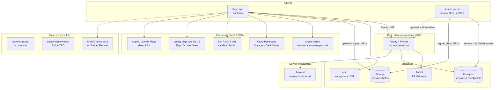
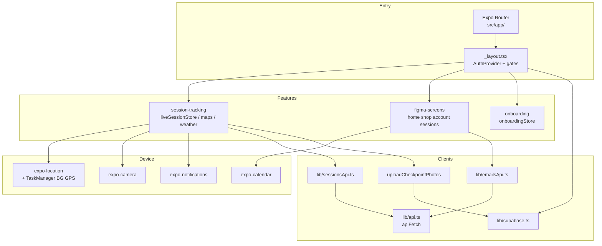
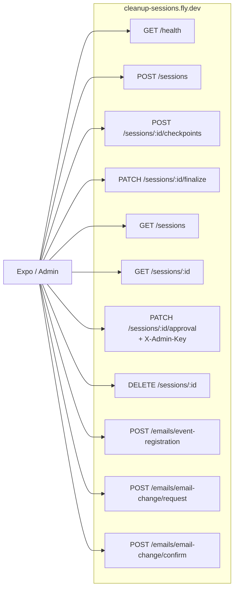
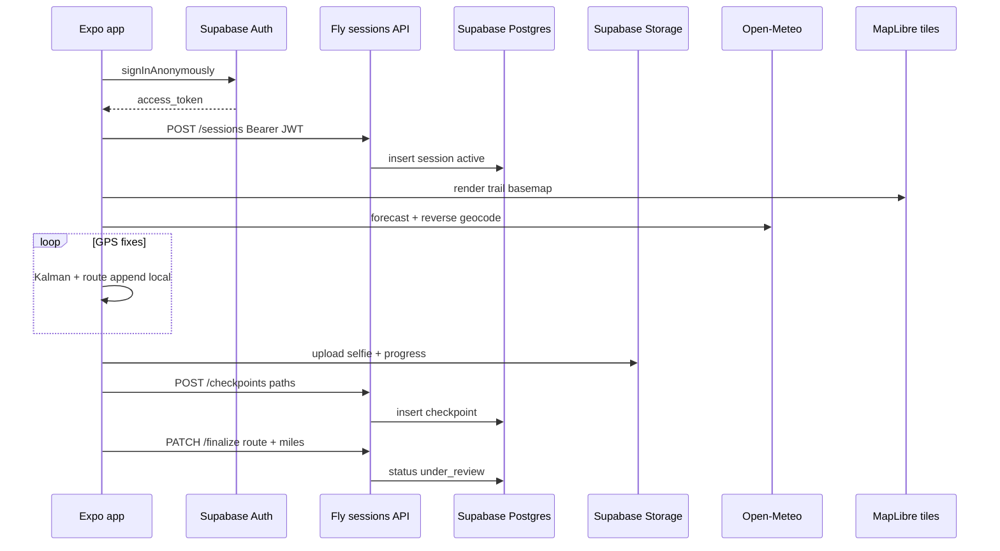

# System architecture

Mermaid overview of the Clean Up - Give Back monorepo: Expo app, Fly sessions API, Supabase, admin portal, client-only integrations, and deferred scaffolds.

**Scope:** There is one live backend HTTP service (`backend/sessions` on Fly). Maps and weather are client-side. `backend/maps` and `backend/payments` are scaffolds only. Admin is a separate Next.js app that talks mainly to Supabase.

Related: [current.md](current.md), [supabase.md](supabase.md), [backend/specs/sessions-api.md](backend/specs/sessions-api.md), [adr/ADR-004-sessions-backend-supabase-fly.md](adr/ADR-004-sessions-backend-supabase-fly.md), [adr/overview.md](adr/overview.md).

---

## Legend

| Style | Meaning |
|-------|---------|
| Solid edges | Live integration in production / test phase |
| Dotted edges | Optional, UI-only, or not fully wired |
| Deferred / scaffold | Directory or product surface exists; no runtime backend yet |

| Layer | Reality |
|-------|---------|
| Backend runtime | One service: Fastify in [`backend/sessions/`](../backend/sessions/) |
| Auth | Supabase anonymous JWT; API verifies via JWKS |
| Photos | Client → Storage; API stores paths only |
| Maps / weather | No backend; MapLibre + Carto/Esri + Open-Meteo |
| Payments | UI only; [`backend/payments/`](../backend/payments/) empty |
| Env | `EXPO_PUBLIC_API_URL`, `EXPO_PUBLIC_SUPABASE_*`; Fly: `DATABASE_URL`, `SUPABASE_URL`, `RESEND_API_KEY`, `ADMIN_API_KEY` |

---

## 1. System context (all integrations)

---

## 2. Frontend internal structure

---

## 3. Sessions API surface

Base URL (prod): `https://cleanup-sessions.fly.dev`. Auth: `Authorization: Bearer <supabase_access_token>` except `GET /health`.

Full contract: [backend/specs/sessions-api.md](backend/specs/sessions-api.md).

---

## 4. Live session data flow

GPS is client-owned mid-session; the finalized polyline is persisted on `PATCH /sessions/:id/finalize`.
