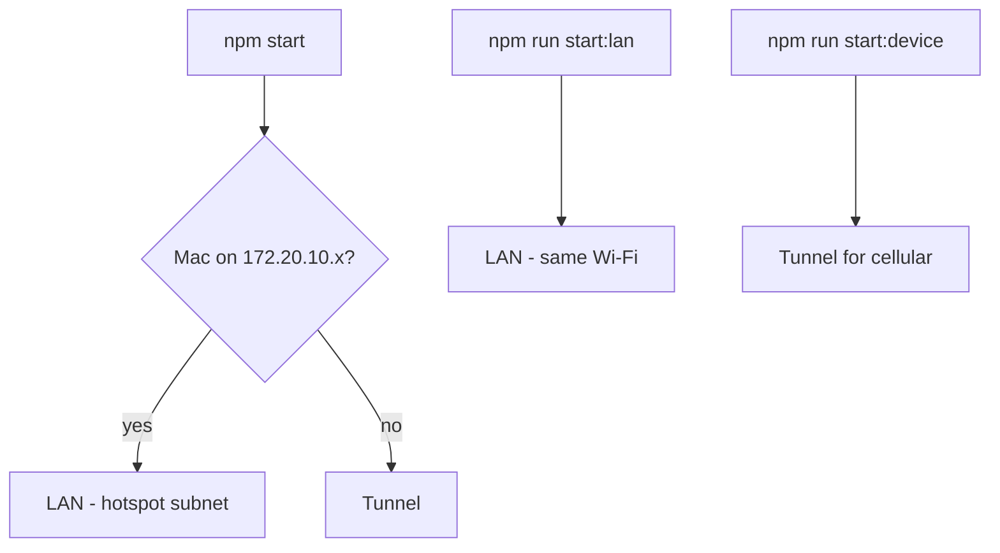

# Spec: Expo Go dev server networking

**Date:** 2026-07-21  
**Status:** Implemented  
**Entrypoint:** [`frontend/scripts/start-expo-go.mjs`](../../../frontend/scripts/start-expo-go.mjs)

## Summary

Physical-device testing with **Expo Go** must work over **same Wi‑Fi**, **iPhone Personal Hotspot**, and **cellular data**. The repo wraps `expo start --go` to pick **LAN** or **tunnel** from network context and prints recovery commands if the tunnel fails.

## Commands

| Command | Host mode | When to use |
|---------|-----------|-------------|
| `npm start` (repo root) | **Smart auto** | Hotspot → LAN; otherwise tunnel (covers cellular / guest Wi‑Fi) |
| `npm run start:lan` | LAN | Mac and phone on the **same Wi‑Fi** (fastest) |
| `npm run start:hotspot` | LAN | Mac joined to **iPhone Personal Hotspot** (`172.20.10.x`) |
| `npm run start:device` | Tunnel | Phone on **LTE/5G** while Mac is on Wi‑Fi, or any cross-network case |
| `npm run start:tunnel` | Tunnel | Same as `start:device`; retry after ngrok timeout |

Tunnel requires **internet on the Mac**. LAN requires the phone to reach the Mac’s LAN IP (same Wi‑Fi or hotspot subnet).

## Network matrix

| Scenario | Mac | Phone | Command | Expected URL |
|----------|-----|-------|---------|--------------|
| Home Wi‑Fi | Wi‑Fi | Same Wi‑Fi | **`npm run start:lan`** (preferred) or `npm start` (tunnel) | `exp://192.168.x.x:8081` or tunnel host |
| iPhone hotspot (same phone) | Hotspot client | Hotspot host | **`npm start`** (auto LAN) or **`npm run start:hotspot`** | `exp://172.20.10.x:8081` |
| Phone on cellular | Wi‑Fi | LTE/5G | **`npm run start:device`** (tunnel) | `exp://….exp.direct` |
| Simulator | — | iOS Simulator on Mac | Press `i` in Metro, or `npm run start:local` | `localhost` |

## Implementation notes

- **Smart default:** Personal Hotspot (`172.20.10.x`) → **LAN**; otherwise **tunnel**. Override with `EXPO_GO_LAN=1`, `EXPO_GO_TUNNEL=1`, or `EXPO_GO_AUTO=lan|tunnel`.
- **`start:hotspot`** forces LAN (not tunnel) — tunnel often times out on hotspot while LAN works.
- **Metro:** [`metro.config.js`](../../../frontend/metro.config.js) sets `server.host = '0.0.0.0'` so LAN mode is reachable from other devices on the network.
- **CI mode:** The start script **unsets `CI`** in the child process (unless `EXPO_GO_CI=1`) so Metro is not stuck in “CI mode” with reloads disabled.
- **TTY / QR:** Metro’s **stdout and stderr are inherited** so Expo detects an interactive terminal and prints the QR. Only stdin is piped (to auto-select “Proceed anonymously”). Piping stdout/stderr makes Expo skip the QR and stall on “Waiting on http://localhost:8081”.
- **Tunnel preflight:** Verifies `@expo/ngrok-bin-*` exists before starting tunnel.
- **Tunnel failure hints:** On non-zero exit in tunnel mode, the script prints `start:lan` / `start:hotspot` / `start:device` recovery lines.

## Troubleshooting

### No QR code — only “Waiting on http://localhost:8081”

The start script must **inherit** Metro’s stdout/stderr (TTY). If those were piped, Expo skips the QR. Update is in `start-expo-go.mjs`; stop Metro (**Ctrl+C**) and run `npm start` again in a normal terminal (not a non-TTY log pane). Same Wi‑Fi? Prefer `npm run start:lan`.

### “The request timed out” (`exp://10.0.0.x:8081` or LAN IP)

You started in **LAN** mode but the phone cannot reach the Mac (cellular, guest Wi‑Fi, AP isolation). Stop Metro and run **`npm run start:device`** (tunnel), or put the phone on the same Wi‑Fi and use **`npm run start:lan`**.

### “Tunnel connection has been closed” / “ngrok tunnel took too long to connect”

Intermittent ngrok/Expo tunnel, slow Mac internet, or Expo/ngrok service delay. Try in order:

1. **Same Wi‑Fi:** `npm run start:lan`
2. **Personal Hotspot** (Mac shows `172.20.10.x`): `npm run start:hotspot` (or `npm start` — auto LAN)
3. **Cellular / cross-network:** retry `npm run start:device` (wait 30–60s on first tunnel connect; Mac needs internet)
4. If tunnel keeps failing, use the **USB fallback** below

### “Metro is running in CI mode”

Your shell may export `CI=true`. The start script clears it for Metro. To keep CI for Metro: `EXPO_GO_CI=1 npm start`.

### Phone on Wi‑Fi but QR still fails

- Confirm Mac firewall allows incoming connections for Node.
- Try `npm run start:device` (tunnel).
- Confirm QR shows your Mac’s Wi‑Fi IP (`192.168…`), not `127.0.0.1`.

### Expo SDK version warning

With Metro **stopped**: `cd frontend && npx expo install expo@~54.0.36`.

## USB fallback (tunnel unstable)

When tunnel drops repeatedly on cellular:

1. Connect iPhone to Mac with **USB**.
2. Install port forwarding: `brew install libimobiledevice`, then in a second terminal: `iproxy 8081 8081`.
3. In `frontend/`: `EXPO_GO_LAN=1 npx expo start --go --localhost`.
4. In Expo Go, open the dev server entry for localhost / manual URL if needed.

## Test plan

1. **Wi‑Fi:** Same network → `npm run start:lan` → scan QR → app loads; edit a file → fast refresh (no CI banner).
2. **Hotspot:** Mac on phone hotspot → `npm start` or `npm run start:hotspot` → LAN URL `exp://172.20.10.x:8081` → same phone loads.
3. **Cellular:** Phone on LTE, Mac on home Wi‑Fi → `npm run start:device` → tunnel URL → phone loads (API calls need phone internet).

## References

- [session-tracking-expo-go.md](session-tracking-expo-go.md) — device testing for GPS/sessions
- [accounts-and-access.md](../../accounts-and-access.md) — EAS dev client (separate from Expo Go LAN/tunnel)
