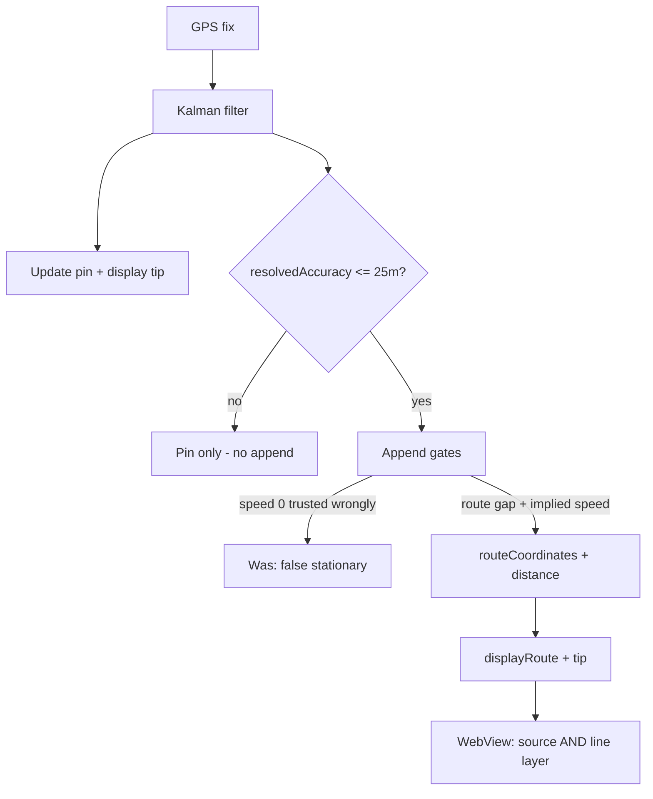
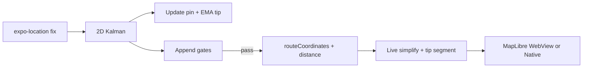

# PROGRESS.md — Clean-Up Give Back Prototype

---

## [2026-07-23] — Who-we-share processors sentence completed

**A:** Expanded the last “We do not sell your data” body so the processors clause is a full sentence (services to CUGB only — not sale/own advertising).

**P:** `/privacy-who-we-share-it-with` last section no longer reads truncated.

---

## [2026-07-23] — Privacy policy index 501(c)(3) footer

**A:** Replaced bare `CleanUpGiveBack` tag on `/privacy-policy` with Account-matching copy: “CleanUp Give Back is a 501(c)(3) nonprofit corporation.”

**P:** Privacy policy main page footer states nonprofit status next to the copyright icon.

---

## [2026-07-23] — Cart line item description preview

**R:** Cart cards showed title only when products were added from shop/product detail because `description` was not passed into `cartStore`.

**A:** Wired product descriptions from `PRODUCT_DETAILS` on shop + product-detail add-to-cart; cart card shows up to 2 lines with `ellipsizeMode="tail"`.

**P:** Any product added to cart shows a truncated description under the name.

---

## [2026-07-23] — Privacy policy in-app copy refresh

**R:** July 23 draft policy must match engineering reality (MapLibre/CARTO/Esri, Fly.io, Resend) and replace stale Google Maps language.

**A:** Centralized copy in `privacyPolicyContent.ts`; wired index + four detail routes; dates Effective July 20 / Last updated July 23; synced `mobile-app-privacy-policy-outline.md` and DPA checklist wording.

**P:** In-app privacy UI reflects draft product copy; counsel review still required before App Store submission.

---

## [2026-07-23] — COPPA cutoff, under-age PII wipe, universal privacy

**A:** `age < 13` via `constants/ageGate.ts`; under-age clears `onboardingStore` and `replace` to `/under-age`; notification defaults all off; removed notification nudge copy; policy copy updated; ADR-003 and compliance docs aligned (no Teen Privacy Tier).

**P:** COPPA under-13 standard, no retention of blocked signup data, same highest-privacy defaults for all allowed users.

---

## [2026-07-23] — System architecture Mermaid diagrams

**A:** Added `docs/architecture.md` with four Mermaid diagrams (system context, frontend structure, sessions API surface, live-session sequence) and linked from `docs/README.md`.

**P:** Living system overview for frontend + backend + integrations.

---

## [2026-07-23] — Expand live-tracker Weather Icons

**R:** Figma MCP timed out on community Weather Icons node `2:78993`; that Figma file is the react-icons/wi set, so paths were extracted from `react-icons@5.5.0`.

**A:** Unified all 27 live weather glyphs on Weather Icons (`react-icons/wi`), scaled 30→24 to match Figma extract viewBox; live pill uses `WeatherConditionIcon` + `weatherIcon` from `useLiveWeather`.

**L:** Prefer react-icons/wi when Figma community MCP is unavailable — same source as the Ultimate React Icons library.

**P:** Live pill icons track WMO codes with day/night variants; full ~220 wi catalog still out of scope.

**H:** All live weather glyphs share Weather Icons + viewBox `0 0 24 24` (scaled from wi 30×30). Keep `WEATHER_ICON_VIEWBOX` in sync if the source size changes.

---

## [2026-07-22] — Admin Today bento redesign

**A:** Rebuilt dashboard as sparse bento grid: hero Review tile, 4 metric tiles, Court + Jump-to tiles; removed feed/bulk/sticky/TodayFocus clutter; Insights (charts+map) one collapsed block.

**P:** First screen is scannable in seconds — review, metrics, court, links.

---

## [2026-07-22] — Admin chart types (progressive disclosure)

**A:** Added area trend (hours + submissions), queue-age bars, decision bars, court progress bars under collapsed Charts; helpers in `dashboard-charts.ts`. Doc: `docs/admin/chart-types-2026-07-22.md`.

**P:** Today stays queue-first; richer analytics only when Donna expands Charts.

---

## [2026-07-22] — Admin dashboard UX audit (Donna)

**A:** Research → action-first layout: TodayFocus + Review next, queue waiting age/court/bulk approve, KPIs after queue, map/charts collapsed, recent skips queue dupes, court urgency colors, mobile sticky CTA. Doc: `docs/admin/ux-audit-2026-07-22.md`.

**P:** Dashboard home is a work queue for Donna, not an analytics wall.

---

## [2026-07-22] — Admin accessibility audit + fixes

**A:** axe-core on dashboard/sessions; primary → AA-safe `#007536`; heatmap keyboard via list only; skip link; named actions/badges; sessions sort label + filter `aria-pressed`; docs in `docs/admin/a11y-audit-2026-07-22.md` + `brand-web.md`.

**P:** Dashboard/Sessions report 0 axe violations after clean `.next` rebuild.

---

## [2026-07-22] — Admin metro neighborhood heatmap

**A:** SVG choropleth of 8 mock metro neighborhoods; session counts/hours by period; click filters recent table; brand green heat scale.

**P:** Dashboard shows Local metro activity map under court-risk strip.

---

## [2026-07-22] — Admin dashboard UX pass (all 9)

**Session goal:** Implement queue-first UX: attention hierarchy, inline decisions, review drawer, nav badges, density, toasts, empty/loading honesty, a11y targets.

**A:**
- Thin mock strip; amber only on review queue; court risk neutral
- First screen = period + KPIs + queue; charts behind “Show charts”; hours below fold
- Inline Approve/Decline + reason sheet + undo toasts (mock local; live via server actions)
- Review drawer (summary → decide) with J/K/A/D/Esc
- Sidebar/mobile badges; Payments demoted to Coming soon
- Denser recent table + status chips + mobile cards; court “C” icon
- ToastProvider; KPI skeletons on period pending; empty donut copy; ≥44px targets + KPI chevrons

**P:** Dashboard UX pass live at `localhost:3001` on mock data.

---

## [2026-07-22] — Admin dashboard: work-queue redesign

**Session goal:** Turn the admin dashboard into Donna’s daily work surface while keeping mock data for empty DB.

**A:**
- Period toggle (This month / Last 30 days / All time) scopes KPIs + donuts
- KPI mix: Under Review · Approved · Court hours at risk · Avg feedback (clickable); Approved hours callout with sparkline/delta
- Review queue (oldest + court-first), court-risk strip, louder mock banner, Approve disabled on mock
- Recent table: volunteer, age, court badge, Open/Approve; under-review sorted first
- Quieter motion + KPI count-up; shared `dashboard-mock` / `dashboard-period` helpers

**P:** Dashboard at `localhost:3001` serves the redesigned layout on mock data.

---

## [2026-07-22] — Instant minimize to Home + down chevron

**Session goal:** Remove blank flash before Home when minimizing the live tracker; point minimize chevron down.

**A:** Skip collapse wipe on dismiss (`dismissTo('/')` immediately). Rotate minimize chevron `-90deg` (down). Docs: `app.md`, `current.md`.

**P:** Minimize lands on Home with no blank interstitial; chevron reads as “minimize down.”

---

## [2026-07-22] — Session-start camera stability + merged My Location + reliable minimize

**Session goal:** Fix crash after first session-start photos (camera remount drift vs specs); merge live tracker Follow + Recenter into one control; ensure minimize always returns to Home with session still running.

**A (Action):**
- `PhotoCaptureScreen` `SequentialCapture`: removed `key={step}` on `CameraView`; stop resetting `cameraReady` on front→back step change (AC-12 / AC-36)
- `LiveSessionScreen`: single **My Location** button — flyTo + enable follow when off; disable follow when on
- Tracker minimize: collapse animation then `dismissTo('/')` (fallback `replace('/')`) so session-setup screens are cleared; Android hardware back minimizes the same way; collapse always invokes navigation even if the timing callback is interrupted
- Updated `session-tracking-expo-go.md` AC-9 / AC-26, `current.md`, `app.md`, `project.md`, `maps.md`

**P:** Session-start dual capture and live tracker map tools match shipped specs; minimize always lands on Home with the minimized pill while the session keeps running.

---

## [2026-07-21] — Admin Portal Phase 1 Scaffold

**R (Reasoning):** PRD v2.0 defines a standalone Next.js 15 admin portal at `admin/` with Supabase Auth, sessions management, and letterhead generation. Phase 1 covers auth + dashboard + sessions core + audit log.

**A (Action):**
- Scaffolded `admin/` Next.js 15 app at monorepo root (zero touches to `frontend/`, `backend/sessions/`, or any existing file)
- Configured Tailwind with all brand tokens from `docs/admin/brand-web.md`
- Loaded Sanchez, Noto Sans, IBM Plex Sans via `next/font/google`
- Set up Supabase SSR client (browser + server + service role) with admin role claim check
- Built middleware: auth guard redirects unauthenticated → `/login`; admin role check blocks non-admin users
- Login page (`/login`): email/password via Supabase Auth + admin role check
- Root layout with persistent sidebar (desktop 240px) + hamburger drawer + mobile bottom tab bar
- Dashboard: 6 KPI cards (under review, approved, declined, open orders, total hours, avg feedback), "Needs attention" banner, recent activity feed — all with Framer Motion stagger animation
- Sessions list (`/sessions`): status chips filter, court-ordered toggle, sort, 25/page pagination, inline approve/decline popover with Framer Motion animation
- Session detail (`/sessions/[id]`): two-column layout, signed Supabase Storage URLs (1h expiry), photo grid with lightbox, full admin action panel (approve/decline/invalid/adjust hours/notes/letterhead links)
- Server actions: `approveSession`, `declineSession`, `markInvalid`, `adjustHours`, `saveAdminNotes` — all write to `admin_audit_log`
- Audit log (`/audit-log`): read-only table with before/after JSON collapsible
- DB migration SQL at `admin/db/001_admin_portal_migration.sql` — additive only (no drops/renames)
- Placeholder pages for Phases 3–6 routes (volunteers, court-hours, feedback, events, orders, payments)
- `admin/.env.local.example` template

**L (Learning):**
- `@supabase/supabase-js` v2 Database generic requires an exact schema shape; easier to omit the generic and use inline type casts
- Framer Motion `layoutId="nav-indicator"` sidebar pill requires `'use client'` on the Sidebar component
- `CookieOptions` must be imported from `@supabase/ssr` explicitly to satisfy TypeScript strict mode

**P (Progression):**
- Phase 1 ✅ (auth, dashboard, sessions, audit log scaffold)
- Phase 2 pending: individual + bulk letterhead PDF via `@react-pdf/renderer` server actions
- Phase 3 pending: volunteer directory, court-hours tracker, court-order CRUD
- Phases 4–7 pending: feedback, events, orders, notifications, CSV export, security hardening

**H (History):**
- Zero files modified in `frontend/`, `backend/sessions/`, `docs/frontend/`, or any existing path
- DB migration is additive only — existing `sessions` and `checkpoints` tables unchanged except 3 new nullable columns
- No Vercel deployment; portal runs at `localhost:3001` via `cd admin && npm run dev`

Session-by-session progress tracker. Distinct from `notes/journey.md` (correction log) and `IMPLEMENTATION_PLAN.md` (task list).

---

## [2026-07-21] — Fix Expo QR missing (piped stdio)

**Goal:** Restore QR code after `npm start` stalled on “Waiting on http://localhost:8081” with no QR.

**Cause:** `start-expo-go.mjs` piped Metro stdout/stderr, so Expo treated the session as non-interactive and skipped the QR.

**Change:** Inherit stdout/stderr; keep stdin piped for anonymous login. Docs: `expo-go-dev-networking.md`.

---

## [2026-07-21] — App audit: sync resilience + feedback stack + docs


**Goal:** Verify the runnable app (typecheck, tests, env, Fly/Supabase, Metro bundle) and fix correctness gaps found in the audit.

**Verified**
- `frontend/node_modules/.bin/tsc --noEmit` clean; Jest **85/85** pass; ESLint **0 errors** (warnings only)
- `frontend/.env` shape OK (project-root Supabase URL, JWT anon key, Fly API URL)
- Fly `GET /health` → 200; `GET /sessions` → 401 without auth (expected); Supabase GoTrue health → 200
- Metro tunnel start + iOS entry bundle **200** (~8.7MB, 1423 modules)

**Fixes**
- Finalize now recreates remote session once on `404 Active session not found` via `createRemoteSessionFromSetup` (works after local teardown)
- Live tracker surfaces `sessionSyncWarning` as a top banner; successful checkpoint sync clears it
- Feedback thank-you Continue uses `dismissTo` so Back does not reopen the feedback form
- Docs: `current.md`, `app.md`, `components.md` — end-session + feedback flow, sync banner, finalize recreate

**Known (documented, not fixed this pass)**
- Feedback Submit is UI-only (no API persistence yet)
- Anon auth failure is memoized until app reload
- Delete-account auth wipe still incomplete

---

## [2026-07-21] — Reverse feedback rating emoji order

**Goal:** Show feedback rating faces negative → positive (Very Sad → Excited) instead of Excited → Very Sad.

**Change:** Reversed `EMOJIS` in `FeedbackScreen.tsx`; docs in `components.md` / `assets.md`.

---

## [2026-07-21] — Expo Go networking: Wi‑Fi / hotspot / cellular

**Goal:** Reliable physical-device Metro for same Wi‑Fi, iPhone Personal Hotspot, and phone-on-cellular.

**Change:** Smart `npm start` — hotspot (`172.20.10.x`) → **LAN** (was wrongly forcing tunnel); `start:hotspot` → LAN; tunnel failure prints recovery hints; docs matrix updated.

| Connection | Command |
|---|---|
| Same Wi‑Fi | `npm run start:lan` |
| Hotspot | `npm start` or `npm run start:hotspot` |
| Cellular | `npm run start:device` |

See [expo-go-dev-networking.md](frontend/specs/expo-go-dev-networking.md).

---

## [2026-07-21] — Match replay precision to live trail

**Goal:** Session detail / confirmation replay should look as granular as the live green trail (not a chunky 4 m polygon).

**Cause:** Replay used `simplifyRouteForDisplay` (4 m); live uses `simplifyRouteForLiveDisplay` (1 m + raw tail). Stored `routeCoordinates` were already dense.

**Fix:** `SessionRouteMapPreviewNative` + preview WebView (`simplifyRouteForLiveDisplay` in `webViewMapHelpers`) use the live display pipeline. Tests + spec AC updates.

**Verify:** `npm run typecheck && npm test`; replay a walked session in Expo Go.

---

## [2026-07-21] — Fix live GPS trail (outdoor walk, Expo Go)

### End goal

Ship a **visible, granular green trail** and an **honest distance readout** during outdoor cleanup walks in **Expo Go** (app open / foreground), then carry the same capture quality into **EAS + Always** for lock-screen continuity.

This session sits on top of [GPS trail precision and continuity](#2026-07-21--gps-trail-precision-and-continuity): density/resume work had landed in code, but a physical outdoor walk still showed **pin moving, Distance 0.0, no polyline** (live tracker and post-session detail).

**Success criteria (Expo Go, outdoors, app open):**
1. Walk 1–2 minutes → **Distance** climbs (hundredths under 0.1 mi, then tenths).
2. **Green polyline** grows behind the heading pin (tip + stored points).
3. Brief app switch → return → trail continues (soft resume already shipped).
4. End session → confirmation / session detail replay shows the same path.

**Out of scope:** lock-screen continuous GPS in Expo Go (still EAS + Always); Strava-grade map-matching; fixing Supabase publishable-key vs anon JWT beyond docs/env guidance.

### Approach

| Layer | Strategy |
|---|---|
| **Capture gates** | Align append accuracy with Kalman (**resolvedAccuracy ≤ 25 m**); stop treating iOS `speedMps === 0` as stationary; stationary uses **distance from last route point**, not tiny per-tick Kalman steps; do not advance `lastAcceptedTimestamp` on rejected appends. |
| **Display sync** | Refresh `displayRouteCoordinates` + live tip (**0.15 m** deadband) on every pin update so the line reaches the arrow between appends. |
| **MapLibre WebView** | Ensure GeoJSON **line layer** exists whenever the source does (`line-join`/`line-cap` in **layout**); two-point fallback when one stored point + moving pin; remount HTML via revision key after map JS changes. |
| **UX honesty** | Distance format: **2 decimals under 0.1 mi** so short walks do not read as `0.0`. |
| **Env / sync** | Normalize Supabase project URL (strip `/rest/v1`); document anon JWT vs publishable key — auth noise does not block local GPS but blocks sync QA. |
| **Debug method** | Runtime Metro logs (`[dbg-…]`) on device walk → confirm/reject hypotheses → fix with evidence → strip instrumentation after user confirmation. |



### Steps done so far

| Step | What shipped | Key files | Status |
|---|---|---|---|
| Accuracy gate | Append path uses `isAcceptableAccuracy(resolvedAccuracy)`; cap **15 → 25 m** | `liveSessionStore.ts`, `routeFiltering.ts` | ✅ |
| Display tip every fix | `buildDisplayRouteWithTip`; tip deadband **0.5 → 0.15 m** | `liveSessionStore.ts`, `routeFiltering.ts` | ✅ |
| WebView tip fallback | One stored point + current ≥ 0.15 m → two-point LineString | `LiveSessionMapWebView.tsx` | ✅ |
| Supabase URL normalize | Strip `/rest/v1`; `.env.example` + `docs/supabase.md` warnings | `supabase.ts`, `.env.example` | ✅ |
| Stationary / speed=0 | Ignore `speedMps === 0`; stationary uses **route-gap** meters + gap timing | `routeFiltering.ts` | ✅ |
| Timestamp hygiene | Do not bump `lastAcceptedTimestamp` on rejected appends | `liveSessionStore.ts` | ✅ |
| Line layer reliability | Re-add layer if missing; layout vs paint; thicker line; `LIVE_MAP_HTML_REVISION` remount | `LiveSessionMapWebView.tsx`, preview WebView | ✅ |
| Distance UI | Hundredths below 0.1 mi on live + minimized pill | `LiveSessionScreen.tsx`, `LiveSessionMinimizedPill.tsx` | ✅ |
| Heading flood | Route inject on geometry/pin; separate heading-only inject | `LiveSessionMapWebView.tsx` | ✅ |
| Tests | Accuracy 25 m; stationary `speedMps === 0` walking case | `routeFiltering.test.ts` | ✅ |
| Docs | `current.md`, runbook troubleshooting, `supabase.md` | `docs/` | ✅ |
| Instrumentation cleanup | Removed debug ingest / `[dbg-2d9418]` after user confirmed trail works | — | ✅ |

**Verified:** Outdoor Expo Go walk — user confirmed trail + distance; `npm run typecheck && npm test` (**84** tests).

### Failures encountered (and status)

| Failure | Evidence | Cause | Status |
|---|---|---|---|
| Pin moves, no trail, Distance 0.0 (~2 min) | Screenshots; empty/sparse `routeCoordinates` early in investigation | Raw accuracy gate / sparse appends; later: **`speedMps === 0` stationary** | **Fixed** |
| Store had route but UI looked broken | Metro: `routeLen` 30+, `distanceMiles` ~0.05, `mapLen` 17+, `hasSource: true` while UI showed 0.0 / no line | (1) `toFixed(1)` hid short distance (2) WebView **source without line layer** / bad paint props | **Fixed** |
| Supabase `Invalid path` / `Invalid API key` | Metro during live session | URL had `/rest/v1/`; anon value may be publishable key not JWT | **Mitigated** (URL normalize + docs); **user must set anon JWT** for sync |
| Checkpoint / create session 404 / Not authenticated | Metro | Auth/env until anon JWT + API healthy | **Open** (sync path; local GPS OK) |

### Current failure / open issue (working on)

Expo Go **foreground trail is signed off**. Remaining work is sync + EAS continuity, not “no green line while walking with app open.”

| Open item | Evidence | Next |
|---|---|---|
| **Supabase anon JWT in local `.env`** | Metro: `anonymous sign-in failed: Invalid API key`; sessions create/hydrate fail | Dashboard → API → **anon public** `eyJ…` (not `sb_publishable_…`); Project URL without `/rest/v1/`; restart Metro |
| **EAS + Always lock-screen trail** | Expo Go cannot keep GPS while locked | Dev-client build; Always location; walk with lock; confirm polyline continues |
| **Checkpoint sync residual 404s** | Prior Metro 404 Active session not found | Re-test after auth fixed; `ensureRemoteSession` already retries once |

### Specs / docs touched

- [expo-go-eas-tester-runbook.md](frontend/specs/expo-go-eas-tester-runbook.md) — trail troubleshooting
- [supabase.md](supabase.md) — Project URL + anon JWT
- [current.md](current.md), [implementation-plan.md](implementation-plan.md)
- Related prior session: [GPS trail precision and continuity](#2026-07-21--gps-trail-precision-and-continuity)

---

## [2026-07-21] — Sessions Select on sort row

**R:** Select sat in the top app bar away from list controls; user wanted it beside Most recent.

**A:** Moved **Select** onto the sort header row (right of Most recent); Cancel / Select all stay in the top bar during selection mode. Docs: `app.md`, `components.md`, `current.md`.

**L:** —

**P:** Done. `npx tsc --noEmit` clean.

**H:** Sessions multi-select entry is on the sort row, not the title bar.

---

## [2026-07-21] — Product copy, account upgrades, and flow edits

**R:** Ship onboarding/legal copy, court/nighttime notices, email confirmations, company-code upgrade, export court-mandated filter, form→selfie session start order, mock location event images, and sessions Select + mocks.

**A:**
- Welcome 501(c)(3); creating-account 2 facts / ~7.5s; legal name + accuracy copy; court acceptance + nighttime bans in onboarding/session setup
- Event detail: removed REGISTERED badge; what-to-bring updated; Register → Resend via `backend/sessions` email routes
- Personal details: email-only + OTP; Account company code → `markTrackerPaid` (persisted) + upgrade modal
- Export: court mandated → approved-only; session flow form then photos then live; home event images location-mapped URIs; Sessions Select button + multi-status mocks

**L:** Anonymous Supabase auth makes Resend OTP preferable to Auth `updateUser({ email })` for email change.

**P:** Done for this batch; configure `RESEND_API_KEY` / `EMAIL_FROM` on Fly for real delivery.

**H:** Session start order is now form → photo → live (not photo → form).

---

## [2026-07-21] — Finalize for Expo Go + EAS testing

**Session goal:** Crash-safe dual-runtime QA (Expo Go + EAS dev client) with live Fly/Supabase sync; align docs and tooling.

| Task | Status |
|---|---|
| Root `package.json` scripts-only (no Expo 57 mismatch) | ✅ |
| Remove `expo-dual-camera`; add `expo-camera` plugin + Android CAMERA | ✅ |
| Photo capture remount on front/back step | ✅ |
| `ensureRemoteSession` + checkpoint 404 recreate/retry | ✅ |
| `frontend/.env` + `.env.example` (API URL + Supabase placeholders) | ✅ |
| ESLint + root `npm test` | ✅ |
| [expo-go-eas-tester-runbook.md](frontend/specs/expo-go-eas-tester-runbook.md) | ✅ |

**Open:** Set **anon public JWT** in `frontend/.env` (not publishable key); outdoor Expo Go trail **confirmed** (see trail-fix session); EAS build when ready for lock-screen GPS.

---

## [2026-07-21] — GPS trail precision and continuity

### End goal

Make live session geolocation feel **precise, granular, and smooth** — comparable to consumer apps like Google Maps / Strava — for **both**:

1. **Expo Go (foreground)** — dense, continuous polyline and arrow motion while the app is open during cleanup walks (including slow litter-picking pace).
2. **EAS dev build + Always location (background)** — same capture quality when the phone is locked or the app is backgrounded, using the existing `expo-task-manager` path.

**User-reported symptoms driving this work:** the trail **stops updating** during slow walking or after returning from background, and when it does update it feels **chunky / laggy** versus athletic-grade trackers.

**Out of scope (unchanged):** map-matching to roads, mid-session route PATCH, realtime GPS streaming to server, building the EAS binary in-repo (code path only).

### Approach

| Layer | Strategy |
|---|---|
| **Continuity** | Stop false stalls: slow walks were classified `stationary` → watch throttled to 3s/9m and append gates rejected points; every `AppState` → `active` resume called `stopLocationWatching()` and **wiped Kalman + append timestamps**. Fix: **soft** subscription teardown on mid-session restart; motion affects **append gates only**, not watch intervals. |
| **Capture density** | Move from ~3m sparse appends to **~1m** sampling: `MIN_ROUTE_SAMPLE_METERS`, watch `distanceInterval`, `getMinMovementMeters` (`max(1m, accuracy×0.25)`), shorter warm-up (**3s**), lower slow-walk speed floor (**0.12 m/s**). |
| **Display smoothness** | Faster EMA on live arrow (**α=0.5**), tighter live Douglas–Peucker (**1m + 10-point raw tail**), shorter Follow ease (**280ms**). Stored route / API polyline unchanged — display-only polish per AC-24. |
| **EAS background** | Keep **1s / 1m** + `BestForNavigation`; on foreground resume, **re-assert** background task if Always granted but updates stopped. |
| **Verification** | Unit tests for gates + Kalman; **`tsc --noEmit`**; manual outdoor checklist on device (Expo Go + EAS when available). |



### Steps done so far

| Step | What shipped | Key files | Status |
|---|---|---|---|
| Soft resume | `stopLocationSubscriptions()` vs full `stopLocationWatching()`; `startLocationWatching` / `resumeLiveSessionTrackingAfterForeground` preserve Kalman + append state | `liveSessionStore.ts` | ✅ |
| No watch throttle on motion | Removed `restartForegroundLocationWatch` and stationary **3s/9m** interval flip; fixed **1s / 1m** `BestForNavigation` while session active | `liveSessionStore.ts` | ✅ |
| Denser capture | `MIN_ROUTE_SAMPLE_METERS` 3→**1**; min-move **×0.25**; `GPS_WARMUP_MS` 8s→**3s**; `MIN_SPEED_TO_RECORD_MPS` 0.4→**0.12** | `geo.ts`, `routeFiltering.ts` | ✅ |
| Smoother display | `DISPLAY_COORDINATE_EMA_ALPHA` **0.5**; live simplify **1m + 10** raw tail; Follow **280ms** | `routeFiltering.ts`, `LiveSessionMapWebView.tsx`, `LiveSessionMapCamera.tsx` | ✅ |
| Background re-assert | `ensureBackgroundLocationRunning()` after foreground resume when Always granted | `liveSessionStore.ts` | ✅ |
| Tests | Updated min-move / warm-up expectations; slow-walk append case | `routeFiltering.test.ts` | ✅ |
| Living docs | AC-24/32/33/26, maps context, project patterns, current capability, components tip copy | `docs/frontend/specs/session-tracking-expo-go.md`, `docs/backend/context/maps.md`, `docs/frontend/context/project.md`, `docs/current.md`, `docs/frontend/context/components.md` | ✅ |

**Verified in CI/dev:** `cd frontend && ./node_modules/.bin/tsc --noEmit`; `npm test -- --testPathPattern='routeFiltering|locationKalman'` (**52** tests pass).

### Failures encountered (and status)

| Failure | Cause | Status |
|---|---|---|
| Trail stops on slow cleanup walking | `MIN_SPEED_TO_RECORD_MPS` 0.4 + stationary watch throttle + append gates | **Addressed in code** (0.12 m/s, fixed dense watch, gates-only motion) |
| Trail stops after app switch / unlock | `startLocationWatching` → `stopLocationWatching` reset Kalman mid-session | **Fixed** (soft subscription stop) |
| Chunky polyline vs Strava | ~3m appends + 8s warm-up + heavy EMA/Follow lag | **Addressed in code** (~1m capture + display tuning) |
| Lock-screen GPS gaps in Expo Go | OS / Expo Go cannot run Always background updates | **Expected** — mitigated by resume + re-assert; **full fix requires EAS + Always** |

### Current failure / open issue (working on)

| Failure | Evidence | Notes |
|---|---|---|
| **Expo Go outdoor trail (no line / Distance 0.0)** | Follow-up outdoor walks after this density work | **Resolved in** [Fix live GPS trail (outdoor walk)](#2026-07-21--fix-live-gps-trail-outdoor-walk-expo-go) — stationary `speedMps===0`, WebView line layer, distance format |
| **EAS + Always lock-screen continuity** | Expo Go cannot keep GPS while locked | **Still open** — needs EAS dev client + Always; same capture pipeline |
| **Checkpoint / auth sync** | Metro Not authenticated / Invalid API key until anon JWT set | **Separate** — see trail-fix session open items + [supabase.md](supabase.md) |

Also still watching: Expo Go notification delivery limits; very short / indoor sessions may still show sparse routes (≥2 accepted points needed for replay).

### Specs touched

- [session-tracking-expo-go.md](frontend/specs/session-tracking-expo-go.md) — AC-24, AC-32, AC-33, AC-26
- [maps.md](backend/context/maps.md), [project.md](frontend/context/project.md), [components.md](frontend/context/components.md), [current.md](current.md)
- Plan reference (not edited in-repo): GPS trail precision and continuity (2026-07-21)

---

## [2026-07-21] — Tour graphic header spacing

**Session goal:** Align graphic-to-title distance across all onboarding tour slides.

| Task | File(s) | Status |
|---|---|---|
| Shared `TOUR_LAYOUT.graphicGapFromTitle` (24px) | `tourLayout.ts` | ✅ |
| Home/Shop/Track/Session tours use fixed gap + `flex-start` graphic anchor | `HomeTourScreen.tsx`, `ShopTourScreen.tsx`, `TrackTourScreen.tsx`, `SessionTourScreen.tsx` | ✅ |
| Docs | `components.md`, `progress.md` | ✅ |

---

## [2026-07-21] — Home tour graphic position

**Session goal:** Move the home tour dashboard graphic closer to the Continue button.

| Task | File(s) | Status |
|---|---|---|
| Illustration stack anchored to bottom of body flex area | `HomeTourScreen.tsx` | ✅ |

---

## [2026-07-21] — Phone field max-length flash fix

**Session goal:** Prevent an 11th digit from briefly appearing in US/CA formatted phone inputs.

| Task | File(s) | Status |
|---|---|---|
| `phoneDisplayMaxLength` helper + `maxLength` on phone `TextInput` | `CountryPickerModal.tsx`, `PersonalDetailsScreen.tsx`, `AccountPhoneScreen.tsx` | ✅ |
| Docs | `components.md`, `progress.md` | ✅ |

---

## [2026-07-21] — All Events date filters

**Session goal:** Add From/To date filters in the All Events modal (home → View All).

| Task | File(s) | Status |
|---|---|---|
| Date parse/filter helpers | `utils/eventFormat.ts` | ✅ |
| From/To fields + filtered list + empty state | `EventsViewAllModal.tsx` | ✅ |
| Docs | `components.md`, `progress.md` | ✅ |

---

## [2026-07-21] — Personal Details + Export footer matches session detail

**Session goal:** Align Save Changes and Export Record footers with session detail sticky footer (white bar, navBottom shadow, 52px primary CTA).

| Task | File(s) | Status |
|---|---|---|
| Absolute white footer + scroll bottom pad | `PersonalDetailsScreen.tsx`, `ExportServiceRecordScreen.tsx` | ✅ |
| Docs | `components.md`, `progress.md` | ✅ |

---

## [2026-07-21] — Export Service Record footer (no navbar)

**Session goal:** Remove bottom nav from Export Service Record; match Personal Details sticky footer only.

| Task | File(s) | Status |
|---|---|---|
| Drop `BottomNavBar`; `SafeAreaView` bottom + footer `paddingBottom: 16 + insets.bottom` | `ExportServiceRecordScreen.tsx` | ✅ |
| Docs | `components.md`, `progress.md` | ✅ |

---

## [2026-07-21] — Export Service Record sticky footer

**Session goal:** Match Personal Details sticky footer pattern on Export Service Record so Export Record CTA is fully visible above bottom nav.

| Task | File(s) | Status |
|---|---|---|
| Move Export Record button out of ScrollView into footer; flex layout for nav (no absolute overlap) | `ExportServiceRecordScreen.tsx` | ✅ |
| Docs | `components.md`, `progress.md` | ✅ |

---

## [2026-07-21] — Session detail footer matches event detail

**Session goal:** Align session detail sticky footer with event detail (upcoming event tap-through).

| Task | File(s) | Status |
|---|---|---|
| White footer bar + `navBottom` shadow; outlined delete + `RegisterButton` New Session | `SessionDetailScreen.tsx` | ✅ |
| Docs | `components.md`, `progress.md` | ✅ |

**A:** Replaced plain text delete link + green CTA on `bgApp` with the same two-row footer pattern as `EventDetailScreen` (secondary outlined action above full-width primary).
**P:** Verify from Home recent session → session detail on device.

---

## [2026-07-21] — Upcoming Events card real photos

**Session goal:** Replace colored-initials placeholders on Upcoming Events cards with real photos; enlarge thumb height.

| Task | File(s) | Status |
|---|---|---|
| Add `image` to `UpcomingEventSummary` + mock assets | `home.types.ts`, `home.ts`, `home.returningUser.ts` | ✅ |
| Render `expo-image` thumb 72×88 (was 56×56 initials) | `UpcomingEventCard.tsx` | ✅ |
| Docs | `components.md`, `assets.md`, `progress.md` | ✅ |

**A:** Wired header / volunteers / park / trail scene requires into event mocks; card uses `contentFit="cover"`.
**P:** Verify on Home Upcoming Events + View All modal.

---

## [2026-07-20 Session 215] — Remove tracker banner; photo → setup form

**Session goal:** Drop the live-tracker route-tracking banner; reverse start order so first dual photo precedes the session setup form (activity / description / etc.).

| Task | File(s) | Status |
|---|---|---|
| Remove `LiveSessionBackgroundTrackingBanner` from tracker | `LiveSessionScreen.tsx` (deleted banner component) | ✅ |
| Photo-first start: stash photos → `/session-setup` → start live | `pendingSessionSetup.ts`, `PhotoCaptureScreen.tsx`, `SessionSetupFormScreen.tsx`, `SessionSetupCompleteScreen.tsx`, `MissedCheckpointScreen.tsx` | ✅ |
| Specs + living docs | `photo-checkpoint-dual-capture.md`, `session-tracking-expo-go.md`, `app.md`, `components.md`, `current.md`, `maps.md` | ✅ |


## [2026-07-20 Session 225] — Integrate upstream `ea167d1` (session UX refinement)

**Session goal:** Pull upstream commit `ea167d1` (checkpoint alerts, background-tracking banner, session delete, resume gate, `pendingSessionSetup`) into local tree without losing the in-flight `PhotoCaptureScreen` zoom-control + photo-submitted work.
**A:** `git stash` → `git pull` (fast-forward) → `git stash pop` (auto-merge), then hand-resolved 7 conflicted files: `_layout.tsx` (nested `GestureHandlerRootView` outermost, 3 session gates inside `AuthProvider`), `LiveSessionScreen.tsx` (auto-merged cleanly — navbar refactor + checkpoint alerts + background banner all landed), `PhotoCaptureScreen.tsx` (kept `ZoomControl` pills+arc, merged in `mode=session-start/session-end`, PiP selfie, haptics, `handleCancelCapture`), `SubmissionConfirmationScreen.tsx` and `SessionDetailScreen.tsx` (kept shared `SessionPhotosSection`, merged in `useFocusEffect` refresh / delete-session button), `liveSessionStore.ts` (kept local route-seeding bugfix — seeds on `routeCoordinates.length === 0` rather than `!previousCoordinate`, which crashed when a low-accuracy sample set `currentCoordinate` before ever appending to the route), and the four doc files (combined both sides' bullets/rows; renumbered upstream's colliding progress-log heading to avoid a duplicate `Session 214`).
**P:** All conflicts resolved and staged; `npx tsc --noEmit` verification pending.

---

## [2026-07-20 Session 224] — Fix zoom dial scroll direction

**Session goal:** Stop the photo-capture zoom wheel from scrolling into the empty arc left of 0.5×; scroll only rightward through labeled stops.
**R:** Tick angles place 0.5→5 top→right, but `dialStyle` used positive (clockwise) rotation — caret moved into blank space behind 0.5×.
**A:** Negated dial rotation so zoom-in brings right-side ticks under the caret; clamps unchanged (hard floor at 0.5×); docs synced from horizontal-strip claim back to curved arc.
**P:** On device — drag zoom pill, confirm caret travels 0.5→5 rightward only and never past 0.5× into empty arc.

| Task | File(s) | Status |
|---|---|---|
| Negate dial rotation | `PhotoCaptureScreen.tsx` | ✅ |
| Sync route docs | `docs/frontend/context/app.md` | ✅ |

---

## [2026-07-20 Session 223] — Match photo-submitted Lottie size to missed-checkpoint

**Session goal:** Make the camera Lottie artboard/display as big as the missed-checkpoint Lottie.
**A:** Refit composition to 500×500 (same as missed); hero `size` 150 (PlayOnceLottie default used on missed).
**P:** Reload `/photo-submitted` — camera hero should match missed-checkpoint scale.

| Task | File(s) | Status |
|---|---|---|
| 500 artboard + size 150 | `photo-submitted.*`, `PhotoSubmittedScreen.tsx`, `PhotoSubmittedHeroVideo.tsx` | ✅ |

---

## [2026-07-20 Session 222] — Nudge photo-submitted camera up again

**A:** Pre-comp 1 Y nudged to 317.08 (down 20 from 297.08); rays unchanged.
**P:** Reload `/photo-submitted`.

---

## [2026-07-20 Session 221] — Photo-submitted Lottie primary green

**Session goal:** Make the camera body and ray lines brand primary green.
**A:** Set body fill + ray strokes to `#009540` (`[0, 149/255, 64/255]`); kept lens/sensor white.
**P:** Reload `/photo-submitted` for green camera + rays.

| Task | File(s) | Status |
|---|---|---|
| Recolor Lottie | `photo-submitted.json`, `photo-submitted.lottie` | ✅ |

---

## [2026-07-20 Session 220] — Center camera in photo-submitted ray burst

**Session goal:** Center the camera icon between the flash ray lines.
**A:** Set Pre-comp 1 position to match Shape Layer 1 (rays) at `[360, 457.08]`.
**P:** Reload `/photo-submitted` — camera should sit in the middle of the burst.

| Task | File(s) | Status |
|---|---|---|
| Align camera to ray center | `photo-submitted.json`, `photo-submitted.lottie` | ✅ |

---

## [2026-07-20 Session 219] — Stop photo-submitted rays clipping at artboard edge

**Session goal:** Flash rays were cut off at the Lottie edge after shifting them down.
**R:** Ray tips extend ~230px from the layer; at Y 353 that overflowed the 512 artboard.
**A:** Expanded composition to 720×720 and offset top layers by +104 so rays clear all edges.
**P:** Reload `/photo-submitted` — full ray burst should be visible.

| Task | File(s) | Status |
|---|---|---|
| Expand artboard + offset layers | `photo-submitted.json`, `photo-submitted.lottie` | ✅ |

---

## [2026-07-20 Session 218] — Lower photo-submitted flash rays

**Session goal:** Move the flash ray lines down to align with the raised camera.
**A:** Shape Layer 1 (rays) Y 257.08 → 305.08 → 353.08 (+96 total) in `photo-submitted.json` / `.lottie`.
**P:** Reload `/photo-submitted` to check ray/camera alignment.

| Task | File(s) | Status |
|---|---|---|
| Shift rays down | `photo-submitted.json`, `photo-submitted.lottie` | ✅ |

---

## [2026-07-20 Session 217] — Nudge photo-submitted camera up in Lottie

**Session goal:** Position the camera icon higher so it sits between the side flash rays.
**A:** Moved Pre-comp 1 Y from 256 → 208 (−48), then → 168 (−88 total) in `photo-submitted.json` / `.lottie`.
**P:** Reload `/photo-submitted` to see the raised camera.

| Task | File(s) | Status |
|---|---|---|
| Shift camera pre-comp up | `photo-submitted.json`, `photo-submitted.lottie` | ✅ |

---

## [2026-07-20 Session 216] — Loop photo-submitted Camera Pop-Up

**Session goal:** Make the photo-submitted hero animation loop.
**A:** Passed `loop` to `PlayOnceLottie` from `PhotoSubmittedHeroVideo`.
**P:** `/photo-submitted` Camera Pop-Up animation repeats while the screen is open.

| Task | File(s) | Status |
|---|---|---|
| Enable loop | `PhotoSubmittedHeroVideo.tsx` | ✅ |

---

## [2026-07-20 Session 215] — Photo-submitted uses Camera Pop-Up `.lottie`

**Session goal:** Replace photo-submitted hero with `Camera Pop-Up.lottie`.
**R:** Metro already lists `lottie` in `assetExts`; embedded JSON matches prior `Camera Pop-Up.json` and still needs repeater baking for RN.
**A:** Packed repeater-baked animation into `photo-submitted.lottie`; `PhotoSubmittedHeroVideo` requires that asset.
**P:** Reload Expo to pick up the new `.lottie` hero.

| Task | File(s) | Status |
|---|---|---|
| Pack + wire `.lottie` | `photo-submitted.lottie`, `PhotoSubmittedHeroVideo.tsx` | ✅ |
| Docs | `app.md`, `components.md`, `assets.md`, `progress.md` | ✅ |

---

## [2026-07-20 Session 214] — Swap photo-submitted Lottie to Camera Pop-Up

**Session goal:** Replace photo-submitted hero with `Camera Pop-Up.json`.
**R:** New asset differs from `TuZanFlZp9` (30fps vs 50fps); still uses Repeater + Trim Paths.
**A:** Wrote repeater-baked copy to `photo-submitted.json` (+ alias); hero already requires that path.
**P:** Reload `/photo-submitted` to see Camera Pop-Up animation.

| Task | File(s) | Status |
|---|---|---|
| Replace + bake Lottie | `assets/animations/photo-submitted.json` | ✅ |
| Docs | `components.md`, `assets.md`, `progress.md` | ✅ |

---

## [2026-07-20 Session 213] — DualCapture fallback, overlay screens, one-hour paywall, timer UX, prefetch

**Session goal:** Fix VisionCamera v5 SIGABRT crash → wire SequentialCapture as default; add dark/light map toggle; overlay photo/checkpoint/paywall screens transparently over the live map; add one-hour session trigger; optimize onboarding image load time.
**Workflow used:** Chat

### Skills Invoked

| Skill | Purpose | Outcome |
|---|---|---|
| `/wrap` | End-of-session hygiene | This block |

### Tasks Completed

| Task | File(s) | Status |
|---|---|---|
| Disable DualCapture (SIGABRT on Fabric); SequentialCapture always-on | `PhotoCaptureScreen.tsx` | ✅ |
| Add map dark/light toggle button (4th MapToolButton) | `LiveSessionScreen.tsx` | ✅ |
| Remove black start marker (MapLibre bitmap timing crash) | `LiveSessionMapNative.tsx` | ✅ |
| Shrink timer card + reduce gap to move it up | `LiveSessionScreen.tsx` | ✅ |
| One-hour elapsed trigger → navigate to `/free-trial-done` | `LiveSessionScreen.tsx` | ✅ |
| `photo-checkpoint`, `photo-submitted`, `missed-checkpoint`, `free-trial-done` as `transparentModal` | `_layout.tsx` | ✅ |
| Dim overlay root backgrounds (`rgba(0,0,0,0.55)`) for all four screens | `PhotoCheckpointScreen.tsx`, `PhotoSubmittedScreen.tsx`, `MissedCheckpointScreen.tsx`, `FreeTrialModal.tsx` | ✅ |
| Replace shop-tour middle graphic with new image | `assets/figma/tour/shop-showcase.png` | ✅ |
| Eager prefetch all tour/onboarding/shop graphics at module load | `tourAssets.ts`, `onboardingGraphics.ts`, `shopAssets.ts`, `_layout.tsx` | ✅ |
| Local Xcode build unblocked (EAS blocked by team agreement) | `app.json` ATS plugin | ✅ |

### Key Decisions

- DualCapture preserved as dead code (hybridRef/JSI approach) for future re-enable when VisionCamera/Nitro fixes Fabric HybridObject prop serialization.
- `transparentModal` keeps parent (live-session map) mounted and rendered — overlay screens must never push again from within or the stack breaks.
- Prefetch uses `Asset.fromModule(module).uri` (sync, no downloadAsync) + batched `ExpoImage.prefetch(uris, 'memory-disk')` at module-load time.

### Learnings

- VisionCamera v5 HybridObjects cannot survive Fabric's `folly::dynamic` serialization at `UIManager::createNode` — hard SIGABRT. Only fix: avoid mounting NativePreviewView with hybridRef props until Nitro resolves this.
- `MissedCheckpointScreen` has double-dim: root `rgba(0,0,0,0.55)` + static `scrim` View with same color — appears too dark. Known issue, needs visual fix.
- Metro port 8081 held by Cursor editor process; kill with `lsof -ti:8081 | xargs kill -9` before starting dev server.

---

## [2026-07-20 Session 212] — Fix photo-submitted Camera Lottie rendering

**Session goal:** Photo-submitted hero Lottie played but looked wrong vs the intended Camera animation.
**R:** `TuZanFlZp9` uses Repeater (10× / 36°) + Trim Paths; `lottie-react-native` was only drawing a partial ray burst / odd lens fill. Same asset’s GIF export (`photo-submitted-success.gif`) shows the correct full burst.
**A:** Baked the repeater into 10 explicit ray groups in `photo-submitted.json`; kept Lottie hero (transparent bg on the card); bumped display size to 160.
**P:** `/photo-submitted` should show the full flash-ray Camera animation.

| Task | File(s) | Status |
|---|---|---|
| Bake repeater in Lottie JSON | `assets/animations/photo-submitted.json` | ✅ |
| Wire hero to baked Lottie | `PhotoSubmittedHeroVideo.tsx` | ✅ |
| Docs | `components.md`, `assets.md`, `progress.md` | ✅ |

---

## [2026-07-20 Session 211] — Photo-submitted hero uses Lottie

**Session goal:** Replace the photo-submitted success GIF with the Camera Lottie (`TuZanFlZp9.json`).
**R:** That file already matched `assets/animations/photo-submitted.json`; the screen was still wired to `photo-submitted-success.gif`.
**A:** `PhotoSubmittedHeroVideo` now plays `photo-submitted.json` once via `PlayOnceLottie`.
**P:** `/photo-submitted` shows the Lottie hero instead of the GIF.

| Task | File(s) | Status |
|---|---|---|
| Wire Lottie hero | `PhotoSubmittedHeroVideo.tsx` | ✅ |
| Docs | `components.md`, `assets.md`, `app.md`, `progress.md` | ✅ |

---

## [2026-07-20 Session 210] — Free-trial Continue opens full checkout

**Session goal:** Continue on "Your one hour is up!" should open the real checkout page, not a popup-wrapped screen.
**R:** `/free-trial-done` is a `transparentModal`; `router.push` to checkout kept modal presentation for the next screen.
**A:** Continue now `router.replace`s `/checkout?mode=tracker&returnTo=live-session` so checkout is a normal stack screen over the live tracker.
**P:** Continue → full-page tracker checkout; back from checkout returns to live session.

| Task | File(s) | Status |
|---|---|---|
| Replace (not push) checkout from paywall | `free-trial-done.tsx` | ✅ |
| Docs | `app.md`, `components.md`, `progress.md` | ✅ |

---

## [2026-07-20 Session 209] — Session Detail Photos carousel (sessions tab)

**Session goal:** Sessions-tab session detail should show the same clickable Photos section as post-session confirmation.
**R:** Post-session UI already had a horizontal Photos carousel + enlarge modal; Sessions-tab detail used a smaller “Photo Evidence” card that felt different.
**A:** Extracted `SessionPhotosSection`; wired it into `SessionDetailScreen` and `SubmissionConfirmationScreen`.
**P:** Opening a session from Sessions → Session Details shows Photos (empty copy or carousel); tap opens full-screen viewer.

| Task | File(s) | Status |
|---|---|---|
| Shared Photos carousel + enlarge | `SessionPhotosSection.tsx` | ✅ |
| Sessions-tab detail uses shared section | `SessionDetailScreen.tsx` | ✅ |
| Post-session confirmation uses shared section | `SubmissionConfirmationScreen.tsx` | ✅ |
| Docs | `app.md`, `components.md`, `current.md`, `progress.md` | ✅ |

---

## [2026-07-20 Session 209] — Horizontal zoom tick strip

**Session goal:** Replace the curved zoom arc with a horizontal tick strip; keep quick-zoom pills inside the dial.
**R:** Arc SVG was tall/layout-fragile; user asked for ticks in a flat strip with controls in the dial.
**A:** Rewrote `ZoomControl` — fixed caret + scrolling horizontal ticks; pills always visible below the strip; pan swipe-right = zoom in.
**P:** Photo-capture zoom is a compact horizontal dial; Metro was aborted earlier — restart if testing on device.

---

## [2026-07-20 Session 208] — Fix photo-capture crash (zoom dial worklets)

**Session goal:** Investigate crash when opening Submit Photo / photo-capture.
**R:** Metro showed GestureDetector-without-root earlier; ZoomWheel also called non-worklet JS (`zoomToFactor` / `formatZoomFactor`) inside `useAnimatedStyle` / `useAnimatedReaction`, which crashes Reanimated on mount.
**A:** Rewrote zoom dial to RN `PanResponder`; inlined zoom math in the worklet; wrapped app root in `GestureHandlerRootView`.
**P:** Photo-capture should open without crashing; zoom still pans horizontally.

---

## [2026-07-20 Session 207] — Tracker chrome follows map dark mode

## [2026-07-20 Session ea167d1] — Live trail smoothness, Expo Go GPS UX, distance replay (upstream sync)

### End goal

Fix three issues found during **Expo Go** device QA on live session tracking:

1. **Background / lock** — elapsed time keeps running but the GPS route stops when the user leaves the app or locks the phone; set honest expectations and resume cleanly on return (no fake background GPS in Expo Go).
2. **Live map trail** — tracking is more granular after recent Kalman work, but the polyline still feels clunky; smooth **display-only** rendering without changing stored route samples.
3. **Route replay** — submission confirmation / session detail replay should reanimate the path the user walked evenly (short ~3–10s preview), not jump by GPS vertex index.

**Locked product choices:** testing client = **Expo Go**; replay = **Option A** (distance-scaled preview, not timestamp-true journey / no API schema change).

### Approach

- **Do not** attempt TaskManager background GPS in Expo Go — OS stops `watchPositionAsync` when backgrounded; gaps while locked are expected until an **EAS dev build + Always** location.
- **Mitigate UX:** soft banner when `backgroundLocationEnabled` is false; **`AppState` → `active`** calls `resumeLiveSessionTrackingAfterForeground()` (sync clocks, ensure tick, **restart** location watch — subscription can exist but stall after background).
- **Smooth live trail:** keep capture pipeline (1s / ~3m, Kalman, append gates); lighter live Douglas–Peucker (`simplifyRouteForLiveDisplay`, ~2m + raw tail); **`appendLiveTipToDisplayRoute`** so the line reaches the EMA-smoothed arrow between appends; round WebView line caps/joins.
- **Replay:** shared **`sliceRouteByDistanceProgress`** (cumulative meters + interpolated tip) in native + WebView preview maps; duration still from `computeRouteReplayDurationMs`; fix auto-play starting at progress `1` then flashing full route.

### Steps done so far

| Area | What shipped | Key files |
|---|---|---|
| Expo Go GPS honesty | `LiveSessionBackgroundTrackingBanner` on live tracker when background GPS off; copy explains pause on background/lock | `LiveSessionBackgroundTrackingBanner.tsx`, `LiveSessionScreen.tsx` |
| Foreground resume | `AppState` listener → `resumeLiveSessionTrackingAfterForeground()` | `liveSessionStore.ts` |
| Live display simplify | `simplifyRouteForLiveDisplay` used in `buildDisplayRoute` | `routeFiltering.ts`, `liveSessionStore.ts` |
| Live tip segment | Maps draw route + EMA tip between appends | `appendLiveTipToDisplayRoute`, `LiveSessionMapNative.tsx`, `LiveSessionMapWebView.tsx` |
| WebView polyline paint | `line-join` / `line-cap` round on live + preview WebViews | `LiveSessionMapWebView.tsx`, `SessionRouteMapPreviewWebView.tsx` |
| Distance replay slice | `sliceRouteByDistanceProgress` + WebView helper | `routeFiltering.ts`, `webViewMapHelpers.ts`, `SessionRouteMapPreviewNative.tsx`, `SessionRouteMapPreviewWebView.tsx` |
| Replay auto-play flash | `SessionRouteMapPanel` initial progress `0` when `replayOnce` | `SessionRouteMapPanel.tsx` |
| Tests | Unit tests for distance slice (48 total in `routeFiltering.test.ts`) | `routeFiltering.test.ts` |
| Living docs | Spec ACs, components registry, current capability text | `session-route-replay.md`, `session-tracking-expo-go.md` (AC-34 banner wired), `current.md`, `components.md` |

**Verified:** `cd frontend && npx tsc --noEmit`; `npm test -- --testPathPattern=routeFiltering`.

### Failures encountered (and status)

| Failure | Cause | Status |
|---|---|---|
| GPS route freezes while timer runs (lock / background) | Expo Go cannot run Always + `expo-task-manager` background updates; foreground watch pauses | **Mitigated** (banner + restart on foreground); **not fixable in Expo Go** — EAS dev client + Always for pocket walks |
| Clunky live polyline | Line only grows on route append (~3m) while arrow EMA updates every fix; 4m display simplify on live path | **Fixed** (display-only tip segment + lighter live simplify) |
| Replay speed uneven / “wrong” animation | Replay sliced by **vertex index** after Douglas–Peucker, not path distance | **Fixed** (`sliceRouteByDistanceProgress` + interpolated tip) |
| Full route flash before auto-replay | `replayProgress` initialized at `1` then auto-play jumped to `0` | **Fixed** (`replayOnce` starts at `0`) |
| AC-34 claimed soft banner but UI missing | `backgroundLocationEnabled` set in store, never shown | **Fixed** (`LiveSessionBackgroundTrackingBanner`) |

### Current failure / open issue (working on)

| Failure | Evidence | Notes |
|---|---|---|
| **Post-ship device QA not signed off** | Code + unit tests pass; user-reported clunky trail / replay / background behavior addressed in this session | **Next:** re-walk in Expo Go — app open (smooth trail), lock screen (banner + expected gap), unlock (GPS resumes), end session (even replay). Report any remaining jank on WebView replay RAF. |
| **Checkpoint persist 404** during live session | Metro: `[sessions] checkpoint persist failed: API 404: {"error":"Active session not found"}` | **Carried from Session 213** — local checkpoint kept; remote create lag / draft id / env mismatch. Not in scope for Session 214 code changes. |
| **Continuous GPS while phone locked** | Product need for pocket walks | **Out of scope for Expo Go** — requires EAS development build, Always permission, existing `backgroundLocationTask.ts` path (see [accounts-and-access.md](accounts-and-access.md)). |

Also still watching: Expo Go notification delivery limits; route replay still needs ≥2 GPS points (indoor / very short tests → “No route recorded”).

### Specs touched

- [session-route-replay.md](frontend/specs/session-route-replay.md) — AC-2 / AC-5 distance-along-path replay
- [session-tracking-expo-go.md](frontend/specs/session-tracking-expo-go.md) — AC-24 live display; AC-27 distance replay; AC-34 banner + foreground resume
- [current.md](current.md), [frontend/context/components.md](frontend/context/components.md), [frontend/context/project.md](frontend/context/project.md)
- [backend/context/maps.md](backend/context/maps.md), [implementation-plan.md](implementation-plan.md)

---

## [2026-07-20 Session 213] — Sessions multi-select delete, persisted tombstones, 5‑min grace

### End goal

1. **Mass delete** on the Sessions list — volunteers can multi-select sessions and hard-delete them in one action (same rules as detail: no archive; approved sessions blocked).
2. **Deletes stay gone** after `npm start` / app restart — no ghost rows on Sessions or Home after testing deletes.
3. **Shorter checkpoint grace** — miss window after a due checkpoint is **5 minutes** (was 10).

### Approach

- **Bulk hard delete only** — no soft-delete / archive status; reuse existing `removeVolunteerSession` + `DELETE /sessions/:id` in a sequential bulk helper (`removeVolunteerSessions`).
- **Client tombstones + remote delete** — Postgres hard delete is source of truth when API is configured; AsyncStorage tombstones (`@cugb/volunteer-deleted-sessions`) hide ids across restarts so list/hydrate cannot resurrect rows (including mock/offline path).
- Hydrate tombstones in `AuthProvider` **before** `hydrateRecentSessionsFromApi()` so Home never briefly shows deleted sessions.
- Grace duration is a single constant (`CHECKPOINT_MISS_GRACE_MS`) consumed by store tick, notifications, and miss finalize.

### Steps done so far

| Area | What shipped | Key files |
|---|---|---|
| Persist tombstones | In-memory Set + AsyncStorage write-through; `hydrateVolunteerDeletedSessions()` | `volunteerDeletedSessions.ts`, `AuthProvider.tsx` |
| Bulk delete helper | Sequential deletes; returns `{ deletedIds, failed[] }` | `removeVolunteerSession.ts` (`removeVolunteerSessions`) |
| Sessions multi-select UI | Top bar **Select** / **Cancel** / **Select all**; row checkboxes; approved disabled; sticky **Delete (N)** + confirm Alert; mock list filtered by tombstones | `SessionsScreen.tsx` |
| 5‑min grace | `CHECKPOINT_MISS_GRACE_MS = 5 * 60 * 1000` | `checkpointConstants.ts` |
| Specs / living docs | AC-44 multi-select; AC-41 AsyncStorage tombstones; AC-6 grace = 5 min | `session-tracking-expo-go.md`, `current.md`, `app.md`, `components.md`, `implementation-plan.md` |

### Failures encountered (and status)

| Failure | Cause | Status |
|---|---|---|
| Deleted session reappears after `npm start` | Tombstones were in-memory only; after restart, `listSessions` / hydrate brought the row back if remote delete missed or mocks were used | **Fixed** (AsyncStorage tombstones + hydrate-before-recent; remote DELETE still required for API-backed permanence) |
| Wanted “archive” on multi-select | No session archive / soft-delete in domain | **Out of scope** — bulk hard delete only (user chose option 1) |

### Current failure / open issue (working on)

| Failure | Evidence | Notes |
|---|---|---|
| **Checkpoint persist 404** during live session | Metro: `[sessions] checkpoint persist failed: API 404: {"error":"Active session not found"}` (seen under `npm start` / Expo Go tunnel) | Local checkpoint still kept; remote create likely lagged, draft resumed against a missing remote id, or env/JWT mismatch. **Not fixed this session** — device QA / sync timing follow-up. Same class of risk noted in Session 212. |

Also still watching (not active bugs this session): Expo Go notification limits; checkpoint persist 404 (see above).

### Specs touched

- [session-tracking-expo-go.md](frontend/specs/session-tracking-expo-go.md) — AC-44; AC-41 persistence; AC-6 5‑min grace
- [current.md](current.md), [frontend/context/app.md](frontend/context/app.md), [frontend/context/components.md](frontend/context/components.md), [implementation-plan.md](implementation-plan.md)

---

## [2026-07-20 Session 212] — Session photo gates, delete sync, Expo Go map + end-flow fixes

### End goal

Make volunteer session lifecycle trustworthy and photo-gated end-to-end:

1. **Delete** removes a session from Sessions / Home and does not leave ghost rows.
2. **Start** requires dual checkpoint photos before GPS/time tracking begins.
3. **During** session: 30‑min checkpoints with a **5‑min grace**, loud reminders (in-app + scheduled local notifications), tracking continues through grace; miss → `invalid` finalize even if UI is not open.
4. **Live tracker** has no manual **Submit Photo** — only due popup / notifications.
5. **End** requires a final dual photo, then show **submission confirmation** with route preview + live replay (not Home).

### Approach

- Prefer local-first UX with Fly API best-effort sync; treat remote DELETE **404** as already-gone and **tombstone** ids so list/hydrate cannot resurrect rows.
- Gate tracking with `pendingSessionSetup` + `/photo-capture?mode=session-start|session-end`.
- Centralize checkpoint interval/grace in `checkpointConstants.ts`; schedule reminders in `checkpointNotifications.ts`; evaluate miss from store tick, resume, and background GPS ingest.
- In Expo Go, never mount MapLibre native (`MLRNCameraModule`); use `isExpoGoClient()` (`StoreClient` **or** `appOwnership === 'expo'`) → WebView maps.
- Avoid navigation races after `finalizeLiveSession()` clears `isActive`.

### Steps done so far

| Area | What shipped | Key files |
|---|---|---|
| Delete 404 + cleanup | Remote 404 → continue local cleanup; delete cached `remoteSessionId` for `session-*` ids | `removeVolunteerSession.ts` |
| Delete list sync | In-memory tombstones; Sessions list filters + optimistic update; detail → `replace('/sessions-list')`; hydrate skips tombstones; **removed** post-delete `hydrateRecentSessionsFromApi` (it refilled deleted rows) | `volunteerDeletedSessions.ts`, `SessionsScreen.tsx`, `SessionDetailScreen.tsx`, `recentSessionsStore.ts` |
| Photo before start | Start Session → capture → then `startNewLiveSession` + first checkpoint | `pendingSessionSetup.ts`, `SessionSetupFormScreen.tsx`, `PhotoCaptureScreen.tsx` |
| 5‑min grace + alarms | Grace 5m; in-app alert + ~45s nag; scheduled local notifications; miss finalize without LiveSessionScreen | `checkpointConstants.ts`, `checkpointNotifications.ts`, `liveSessionStore.ts`, `LiveSessionScreen.tsx`, gates in `_layout.tsx`, `app.json` |
| Tracker UX | Removed Submit Photo; End Session → `mode=session-end` | `LiveSessionScreen.tsx` |
| End → confirmation | Finalize → `/submission-confirmation` (map + replay); refresh snapshot on focus | `PhotoCaptureScreen.tsx`, `SubmissionConfirmationScreen.tsx` |
| Expo Go map crash | `MLRNCameraModule` missing — gate WebView via `isExpoGoClient()` | `isExpoGoClient.ts`, `LiveSessionMap.tsx`, `SessionRouteMapPreview.tsx`, `EventLocationMap.tsx` |
| Specs / living docs | AC-39–43, dual-capture start/end modes, current/app/components | `session-tracking-expo-go.md`, `photo-checkpoint-dual-capture.md`, `current.md`, `app.md`, `components.md` |

### Failures encountered (and status)

| Failure | Cause | Status |
|---|---|---|
| Delete showed “Session not found” / row stayed | Cache-first detail + hard-fail on API 404; post-delete hydrate resurrected rows | **Fixed** (404→local OK + tombstones; no post-delete hydrate) |
| `MLRNCameraModule` crash after photos → live map | Expo Go took native MapLibre path (`executionEnvironment` alone insufficient) | **Fixed** (`appOwnership === 'expo'` too) |
| After final end photos, bounced to **Home** (no preview/replay) | `PhotoCaptureScreen` `useEffect`: `isSessionEnd && !isActive` → `replace('/')` raced `replace('/submission-confirmation')` after finalize cleared `isActive` | **Fixed** (redirect only if inactive **on mount**) |
| After end photos, went to feedback first (no immediate preview) | Initial end flow targeted `/session-feedback` | **Fixed** (navigate to `/submission-confirmation`) |

### Current status / remaining risk

- **Primary end-of-session preview race: fixed** (user confirmed). Instrumentation removed.
- **Still watch in device QA:**
  - Closed-app checkpoint alarms need notification permission + **EAS/dev client** for reliability (Expo Go limited; iOS Critical Alerts out of scope).
  - Metro may log `checkpoint persist failed: API 404 Active session not found` when remote create lagged / env mismatch — local checkpoint still kept.
  - Route replay needs ≥2 GPS points; very short indoor tests may show “No route recorded”.
  - Rebuild native binary after `app.json` `expo-notifications` / permission changes.

### Specs touched

- [session-tracking-expo-go.md](frontend/specs/session-tracking-expo-go.md) — AC-39–43
- [photo-checkpoint-dual-capture.md](frontend/specs/photo-checkpoint-dual-capture.md) — start/end modes
- [current.md](current.md), [frontend/context/app.md](frontend/context/app.md), [frontend/context/components.md](frontend/context/components.md)

*(Grace duration later shortened to 5 minutes in Session 213.)*

---

## [2026-07-20 Session 211] — Sessions delete sync + tracker photo UX

**Session goal:** Deleted sessions disappear from Sessions list; remove manual Submit Photo; require photo before End Session. *(Superseded detail in Session 212.)*

| Task | File(s) | Status |
|---|---|---|
| Tombstone deleted ids + drop post-delete hydrate | `volunteerDeletedSessions.ts`, `removeVolunteerSession.ts`, `recentSessionsStore.ts` | ✅ |
| Sessions list filter + detail → sessions-list | `SessionsScreen.tsx`, `SessionDetailScreen.tsx` | ✅ |
| End Session → session-end capture; no Submit Photo | `LiveSessionScreen.tsx`, `PhotoCaptureScreen.tsx` | ✅ |
| Docs | `session-tracking-expo-go.md`, `photo-checkpoint-dual-capture.md`, `current.md`, `app.md` | ✅ |

---

## [2026-07-20 Session 210] — Delete fix, photo-first start, 10-min grace alarms

**Session goal:** Fix volunteer session delete on stale remote IDs; require dual photo before tracking; 10-min checkpoint grace with escalating notifications. *(See Session 212 for full arc.)*

| Task | File(s) | Status |
|---|---|---|
| DELETE 404 → local cleanup; remote id from cache | `removeVolunteerSession.ts` | ✅ |
| Photo-before-start flow | `pendingSessionSetup.ts`, `SessionSetupFormScreen.tsx`, `PhotoCaptureScreen.tsx` | ✅ |
| 10-min grace + miss finalize without UI | `checkpointConstants.ts`, `liveSessionStore.ts`, `LiveSessionResumeGate.tsx`, `backgroundLocationTask` ingest | ✅ |
| Scheduled + in-app checkpoint alarms | `checkpointNotifications.ts`, `LiveSessionScreen.tsx`, `_layout.tsx`, `app.json` | ✅ |
| Specs + current/app/components docs | `session-tracking-expo-go.md`, `photo-checkpoint-dual-capture.md`, `current.md`, `app.md`, `components.md` | ✅ |

---

## [2026-07-20 Session 209] — Docs sync to current app state

**Session goal:** Bring living docs under `docs/` in line with shipped session tracking (expo-camera, draft resume, delete, networking).

| Task | File(s) | Status |
|---|---|---|
| Fix stale VisionCamera / Fly-pending / PreviewApp-only claims | `current.md`, `accounts-and-access.md`, `project.md`, `README.md` | ✅ |
| Document resume gate, View All, delete, list refetch | `app.md`, `components.md`, `sessions.md` | ✅ |
| Spec status + AC-36/38 + test plan | `session-tracking-expo-go.md`, `sessions-api.md`, `session-route-replay.md` | ✅ |
| Index networking spec; mark plan items done | `docs/README.md`, `implementation-plan.md` | ✅ |

---

## [2026-07-20 Session 208] — Home View All + volunteer session delete

**Session goal:** Wire Home Recent Sessions **View All**; let volunteers delete non-approved sessions (cancels admin review).

| Task | File(s) | Status |
|---|---|---|
| View All → `/sessions-list` | `HomeScreen.tsx` | ✅ |
| `DELETE /sessions/:id` (block `approved`) | `backend/sessions/src/routes/sessions.ts` | ✅ |
| `deleteSession` + `removeVolunteerSession` + store cleanup | `sessionsApi.ts`, `removeVolunteerSession.ts`, recent/cache/stats stores | ✅ |
| Session detail delete UI + list refetch on focus | `SessionDetailScreen.tsx`, `SessionsScreen.tsx` | ✅ |
| API/context/current docs | `docs/backend/specs/sessions-api.md`, `docs/backend/context/sessions.md`, `docs/current.md` | ✅ |

---

## [2026-07-20 Session 207] — Expo Go dev server: Wi‑Fi, hotspot, cellular

**Session goal:** Reliable Expo Go physical-device testing on home Wi‑Fi, iPhone Personal Hotspot, and phone-on-cellular.

| Task | File(s) | Status |
|---|---|---|
| Harden start script (CI unset, no `--offline`, banner, ngrok preflight) | `frontend/scripts/start-expo-go.mjs` | ✅ |
| `start:device` + root delegates | `frontend/package.json`, `package.json` | ✅ |
| Metro `0.0.0.0` for LAN | `frontend/metro.config.js` | ✅ |
| Networking spec + README/current/accounts | `docs/frontend/specs/expo-go-dev-networking.md` | ✅ |

---

## [2026-07-20 Session 207 — tracker chrome] — Tracker overlay follows map dark mode

**Session goal:** When map dark mode is on (sun/moon or auto night), restyle live-tracker UI chrome to match (remote commit on `main` before local Session 214 rebase).

| Task | File(s) | Status |
|---|---|---|
| Add `getTrackerChromeColors(theme)` palette | `trackerChromeTheme.ts` | ✅ |
| Wire `LiveSessionScreen` overlays to chrome | `LiveSessionScreen.tsx` | ✅ |
| Theme `TrackerActionButton` + `MapTypesSheet` | those components | ✅ |
| Spec + docs | `map-theme-and-weather-icons.md`, `app.md`, `current.md` | ✅ |

---

## [2026-07-20 Session 206] — Session tracking harden (GPS, draft, camera, replay)

**Session goal:** Polish the four shipped session pillars: smoother GPS ingest, mid-session crash recovery, BeReal-style sequential capture UX, and route replay quality.

### Tasks Completed

| Task | File(s) | Status |
|---|---|---|
| Foreground/background GPS dedupe + last-processed coordinate tracking | `routeFiltering.ts`, `liveSessionStore.ts` | ✅ |
| Live map cold-start: wait for GPS fix (WebView + native copy) | `LiveSessionMapWebView.tsx`, `LiveSessionMapNative.tsx` | ✅ |
| AsyncStorage live-session draft + Resume/Discard modal | `liveSessionDraft.ts`, `liveSessionStore.ts`, `LiveSessionResumeGate.tsx`, `_layout.tsx` | ✅ |
| Sequential capture: no remount flash, mirror, PiP, haptics | `PhotoCaptureScreen.tsx` | ✅ |
| Route replay: scaled duration, `useReducedMotion` auto-play skip | `routeReplayDuration.ts`, `SessionRouteMapPanel.tsx` | ✅ |
| Specs/docs sync (expo-camera, AC-37, replay) | `docs/frontend/specs/*`, `docs/current.md`, feature README | ✅ |

### Verification

- `npm test -- --testPathPattern='locationKalman|routeFiltering'` — 48 passed
- Device checklist: outdoor walk, force-quit resume, checkpoint capture, replay on confirmation/detail (manual)

---

## [2026-07-20 Session 206b] — Photo capture: flash (back only) + zoom

**Session goal:** Add flash and zoom on the back-camera step; Apple-style zoom dial.

| Task | File(s) | Status |
|---|---|---|
| Flash cycle Off → On → Auto (back step only) | `PhotoCaptureScreen.tsx` | ✅ |
| Curved zoom dial 1×–5× + dim shutter footer | `PhotoCaptureScreen.tsx` | ✅ |

---

## [2026-07-20 Session 205] — UI polish: Did-you-know icon swap and session-setup chevron exit fix

**Session goal:** Replace the question-mark icon on the creating-account screen with the info-circle asset, improve "Did you know" label visibility, and fix the top-left chevron on all session-setup guide screens to exit back to the originating screen rather than stepping backward through the guide.
**Workflow used:** Chat

### Skills Invoked

_None this session — direct inline edits._

### Tasks Completed

| Task | File(s) | Status |
|---|---|---|
| Add `InfoCircleIcon` from `assets/figma/session-setup/info-circle.svg` | `OnboardingIcons.tsx` | ✅ New export alongside existing `QuestionIcon` |
| Swap `QuestionIcon` → `InfoCircleIcon` on creating-account screen | `CreatingAccountScreen.tsx` | ✅ |
| Bump "Did you know" label color `borderOutline` → `textNavInactive` | `CreatingAccountScreen.tsx` | ✅ |
| Fix chevron on session-setup guide screen to call `exitSessionSetupGuideToTrackEntry` | `SessionSetupGuideScreen.tsx` | ✅ |
| Fix chevron on steps 2–5 to call `exitSessionSetupGuideToTrackEntry` | `SessionSetupStep2–5Screen.tsx` | ✅ |

### Key Decisions

- **Chevron vs Previous:** Top-left chevron now consistently exits the entire guide flow (via `router.dismissTo(returnHref)`) on all 5 coachmark screens; the footer "Previous" button still navigates backward through steps. This matches the pattern already used by `session-free-hour` and `session-free-kit`.
- **InfoCircleIcon** is a standalone export — `QuestionIcon` is kept for backward compatibility.

### Learnings

- `session-free-hour` and `session-free-kit` already had the correct `onBack` / `onPrevious` split; the coachmark screens were inconsistently using `goBackInSessionSetupGuide` for both.
- `exitSessionSetupGuideToTrackEntry` uses `router.dismissTo(returnHref)` which bypasses any stale stack entries from prior onboarding flows; `router.back()` does not.

---

## [2026-07-20] — Account: Personal Details section (edit name/phone/birthday/service type)

**Session goal:** Add a Personal Details section to the Account tab where the user can edit the fields collected during onboarding: name, phone number, birthday, and service type (Court Ordered, Volunteering, School, Other).

| Change | File | Status |
|--------|------|--------|
| `onboardingStore` now persists phone, birthday, service type (not just preferred name); adds `usePersonalDetails()` snapshot hook | `onboardingStore.ts` | ✅ |
| Shared service-type constant (`SERVICE_TYPES`/`ServiceType`), replacing the copy local to `AccountDetailsScreen` | `constants/serviceTypes.ts` | ✅ |
| Extracted birthday sheet modal + helpers out of `AccountDetailsScreen` for reuse | `figma-screens/components/BirthdayPickerModal.tsx` | ✅ |
| Extracted country-code sheet modal + phone helpers out of `AccountPhoneScreen` for reuse | `figma-screens/components/CountryPickerModal.tsx` | ✅ |
| `AccountPhoneScreen`/`AccountDetailsScreen` now persist to `onboardingStore` on Continue and prefill from it; refactored to use the shared modal components | `AccountPhoneScreen.tsx`, `AccountDetailsScreen.tsx` | ✅ |
| New Personal Details editor screen (name/phone/birthday/service-type form + Save) | `figma-screens/screens/PersonalDetailsScreen.tsx` | ✅ |
| New `/personal-details` route | `app/personal-details.tsx` | ✅ |
| New "Personal Details" section/row on Account tab → `/personal-details` | `figma-screens/screens/AccountScreen.tsx` | ✅ |
| Simple person glyph for the new section (no Figma node) | `figma-screens/components/PersonalDetailsIcon.tsx` | ✅ |
| Docs: components inventory, routes table, onboarding-flow pattern note, current.md capability note | `docs/frontend/context/components.md`, `docs/frontend/context/app.md`, `docs/current.md` | ✅ |

**Verified:** `npx tsc --noEmit` clean.

---

## [2026-07-20] — Back chevron on session setup guide screens

**Session goal:** Add a leftward back chevron above the progress pills (top-left) on every session-setup onboarding/guide screen, wired to whatever screen the user was previously on, persisting across the whole flow.

| Change | File | Status |
|--------|------|--------|
| New shared `SessionSetupGuideNavRow` (back chevron + `OnboardingProgressPills` row); `onBack` optional — omitting it hides the chevron | `frontend/src/components/session-setup/SessionSetupGuideNavRow.tsx` | ✅ |
| Wired into guide intro, steps 2–7, and finale — `onBack` reuses each screen's existing Previous handler (`goBackInSessionSetupGuide` / `goToSessionSetupStep5`); finale omits `onBack` (no chevron on last session-setup page) | `SessionSetupGuideScreen.tsx`, `SessionSetupStep2-7Screen.tsx`, `SessionSetupCompleteScreen.tsx` | ✅ |
| Docs: component inventory + current-state note | `docs/frontend/context/components.md`, `docs/current.md` | ✅ |

**Verified:** `npx tsc --noEmit` clean.

---

## [2026-07-20] — Onboarding age gate lowered to 13

**Session goal:** Minimum age policy is 13, not 18 — the parent/admin permission screens (`/under-age`, `/under-age-learn-why`) must only appear for users 13 and younger; users 14+ proceed straight through onboarding.

| Change | File | Status |
|--------|------|--------|
| Age-gate threshold `< 18` → `<= 13` | `AccountDetailsScreen.tsx` | ✅ |
| Docs: routes table + onboarding flow pattern + new Policy note | `docs/frontend/context/app.md` | ✅ |

**Verified:** `npx tsc --noEmit` clean.

---

## [2026-07-20] — Session detail Notes field

**Session goal:** Add editable per-session notes under Description; persist locally for later edits from Sessions list **and** immediately after each session ends.

| Change | File | Status |
|--------|------|--------|
| `sessionNotesStore` (AsyncStorage, 500-char limit) | `sessionNotesStore.ts`, `AuthProvider.tsx` | ✅ |
| Shared `SessionNotesField` component | `SessionNotesField.tsx` | ✅ |
| Notes on Session Detail (`/session-detail`) | `SessionDetailScreen.tsx` | ✅ |
| Notes on post-session screen (`/submission-confirmation`) | `SubmissionConfirmationScreen.tsx` | ✅ |
| `description` on `SessionDetailData` | `sessionDetail.ts`, `useSessionDetail.ts` | ✅ |

**Verified:** `npx tsc --noEmit` clean.

---

## [2026-07-20] — Service Hours chart tracks real session hours

**Session goal:** Home bar graph must reflect completed session durations in hours, not static Figma mock values.

| Change | File | Status |
|--------|------|--------|
| Chart buckets aggregate hours (1 decimal) from `sessionStatsStore` | `homeDashboardStats.ts`, `HomeScreen.tsx` | ✅ |
| Persist stats to AsyncStorage; hydrate on boot | `sessionStatsStore.ts`, `AuthProvider.tsx` | ✅ |
| Re-hydrate from API on Home focus | `HomeScreen.tsx` | ✅ |
| Week picker labels follow selected week | `HomeScreen.tsx` | ✅ |
| `HomeScreenReturningUser` alias → live `HomeScreen` | `HomeScreenReturningUser.tsx` | ✅ |
| Tests | `homeDashboardStats.test.ts` | ✅ |

**Verified:** `homeDashboardStats.test.ts` pass; `npx tsc --noEmit` clean.

---

## [2026-07-20] — Home greeting uses onboarding name

**Session goal:** Fix home greeting so the name entered during onboarding appears instead of the mock fallback.

| Change | File | Status |
|--------|------|--------|
| Fix shadowed `setPreferredName` (local state setter never wrote to store) | `AccountPhoneScreen.tsx` | ✅ `persistPreferredName` |
| Pre-fill preferred name from create-account; save name on step 1 Continue | `CreateAccountScreen.tsx`, `AccountPhoneScreen.tsx` | ✅ |

**P:** Home greeting reads `usePreferredName()` → `homeUser.firstName` after onboarding.

---

## [2026-07-20] — Session detail live replay controls

**Session goal:** Replace text replay buttons with icon Play/Pause/Replay, add synced timer, remove layers picker from replay maps.

| Change | File | Status |
|--------|------|--------|
| Icon play/pause/replay + `MM:SS / MM:SS` timer synced to replay progress | `SessionRouteMapPanel.tsx`, `PlayIcon.tsx`, `PauseIcon.tsx`, `ReplayIcon.tsx` | ✅ |
| Remove basemap layer picker from replay panel (`showLayerControl` removed) | `SessionRouteMapPanel.tsx`, `SessionDetailScreen.tsx` | ✅ |
| Living docs | `components.md`, `session-tracking-expo-go.md`, `session-route-replay.md`, `current.md` | ✅ |

**P:** Replay bar shows timer + play/pause + replay only; map opens on session-end basemap via `initialMapLayer`.

---

## [2026-07-20] — Live WebView drop start pin (black duplicate)

**Session goal:** Fix the dark pin that appears beside the green tip when switching map styles.

| Change | File | Status |
|--------|------|--------|
| Remove live-tracker start-marker sync (match native) | `LiveSessionMapWebView.tsx` | ✅ |
| Docs AC-25 / maps | `session-tracking-expo-go.md`, `maps.md`, `progress.md` | ✅ |

**R:** Expo Go WebView still drew a gray `coords[0]` start pin; native already dropped it. On short walks / after style re-sync it sits next to the green tip and reads as the marker “turning black.”
**A:** Live WebView now syncs only the current-position arrow marker (route polyline unchanged).
**L:** Screenshot: green tip + dark 14px start pin with line ending at the dark pin.
**P:** Done; switch Standard/Satellite/Hybrid — only the green pin should remain.
**H:** Live tracker must not render a start pin; keep start pins on replay/preview only.

---

## [2026-07-20] — Map Types sheet dismiss animation on select

**Session goal:** Close the Map Types drawer with its spring animation when switching basemap styles, not instantly.

| Change | File | Status |
|--------|------|--------|
| `handleSelect` calls `dismiss()` after `onSelect` | `MapTypesSheet.tsx` | ✅ |
| `onSelect` only updates store; visibility via `onClose` | `LiveSessionScreen.tsx` | ✅ |
| Docs | `components.md`, `progress.md` | ✅ |

**R:** Parent set `mapLayerPickerVisible` false inside `onSelect`, so `Modal visible={false}` unmounted the sheet before `dismiss()` could run.
**A:** Sheet owns animated close on select; parent only flips visibility from `onClose` after the spring finishes.
**L:** Animated sheets must not let callers set `visible=false` until the dismiss callback.
**P:** Done; switch Standard/Satellite/Hybrid and confirm the sheet slides down.
**H:** Never close `MapTypesSheet` from `onSelect` — only from `onClose`.

---

## [2026-07-20] — Photo enlarge modal chrome redesign + safe area

**Session goal:** Fix safe-area clipping on the photo viewer and simplify overlay chrome.

| Change | File | Status |
|--------|------|--------|
| Wrap Modal body in `SafeAreaProvider` + `initialWindowMetrics` | `PhotoEnlargeModal.tsx` | ✅ |
| Round close button; date/time tag; bottom `1/N`; hide Selfie/Progress | `PhotoEnlargeModal.tsx` | ✅ |
| Docs | `components.md`, `progress.md` | ✅ |

**R:** RN `Modal` zeroed safe-area insets; chrome also mixed caption + counter + timestamp in one top card.
**A:** Re-seed safe area; top = date/time pill + round X; bottom = counter tag; `caption` kept for a11y only.
**L:** Full-screen `overFullScreen` modals need their own `SafeAreaProvider`.
**P:** Done; verify Session Detail + live tracker thumb expand.
**H:** Do not rely on parent safe-area context alone inside RN `Modal`; do not show Selfie/Progress in enlarge chrome.

---

## [2026-07-20] — Live map stuck on spinner after Start Session

**Session goal:** Fix live tracker map not loading when starting a session.

| Change | File | Status |
|--------|------|--------|
| Start `watchPositionAsync` + compass before Always / one-shot GPS; timeout `getCurrentPositionAsync` at 8s | `liveSessionStore.ts` | ✅ |
| Docs | `components.md`, `maps.md`, `app.md`, `progress.md` | ✅ |

**R:** Map mounts only after a GPS seed (anti-US-flash). `startLocationWatching` awaited Always permission then untimed `getCurrentPositionAsync` *before* the watch — a hang or slow dialog left the spinner forever.
**A:** Watch + heading first; last-known + timed current fix and background enablement run in parallel afterward.
**L:** `useLiveWeather` already raced `getCurrentPositionAsync` with 8s — live session must do the same (or better, not block the watch on it).
**P:** Done; re-test Start Session in Expo Go — map should leave the spinner once last-known or first watch fix arrives.
**H:** Never await untimed one-shot GPS or Always permission before `watchPositionAsync` while the map gates on a seed.

---

## [2026-07-20] — Session detail photo thumbs → full-screen viewer

**Session goal:** Same edge-to-edge photo enlarge on Session Detail evidence thumbs as live tracker / submission confirmation.

| Change | File | Status |
|--------|------|--------|
| Pass thumb `source` into modal; date/time from `capturedAt` | `SessionDetailScreen.tsx` | ✅ |
| Modal accepts `source` via `expo-image` | `PhotoEnlargeModal.tsx` | ✅ |
| Local cache emits selfie + progress evidence | `sessionDetail.ts` | ✅ |
| API detail captions + `capturedAt` | `useSessionDetail.ts` | ✅ |
| Docs | `app.md`, `components.md`, `progress.md` | ✅ |

**R:** Detail already mounted the modal but resolved URIs separately — empty/failed resolve meant tap looked dead; snapshot path also omitted progress photos.
**A:** Open with the same `source` as the thumbnail; include both checkpoint photos from cache; stamp timestamps when available.
**L:** Prefer sharing the thumb `ImageSource` over a second URI resolve for enlarge.
**P:** Done; verify Sessions list → detail → tap evidence thumb.
**H:** Keep selfie + progress in evidence list; do not gate visibility on a separate URI resolve.

---

## [2026-07-20] — Photo thumbnail → true full-screen viewer

**Session goal:** Tapping a checkpoint / evidence photo thumbnail opens an edge-to-edge full-screen photo.

| Change | File | Status |
|--------|------|--------|
| Edge-to-edge image (`contain`), overlay chrome, `overFullScreen` | `PhotoEnlargeModal.tsx` | ✅ |
| Docs | `components.md`, `progress.md` | ✅ |

**R:** Prior viewer capped the photo at ~72% height with side padding — felt like a dialog, not full screen.
**A:** Image fills the viewport; header/nav float as scrim overlays; tap photo dismisses.
**L:** Image must use `pointerEvents="none"` so backdrop dismiss still works under overlay chrome.
**P:** Done; verify on live tracker thumbs, session detail, submission confirmation.
**H:** Keep `presentationStyle="overFullScreen"`; do not reintroduce inset maxHeight framing.

---

## [2026-07-20] — Compass latency + accuracy

**Session goal:** Lower live compass lag and improve heading accuracy on the tracker dial + map beam.

| Change | File | Status |
|--------|------|--------|
| Adaptive EMA + platform accuracy gates; reject interference readings | `routeFiltering.ts` (+ tests) | ✅ |
| Publish throttle 100→33 ms; deadband 1→0.35° | `liveSessionStore.ts` | ✅ |
| Skip second EMA when controlled; dial anim 180→70 ms | `Compass.tsx` | ✅ |
| Docs: AC-25, components, maps | `session-tracking-expo-go.md`, `components.md`, `maps.md`, `project.md`, `current.md` | ✅ |

**R:** Stacked EMA (store + Compass) + 100 ms throttle + 180 ms anim made turns feel late; Android calibration 0 was treated like iOS 0° excellence.
**A:** One adaptive smooth in the store; Compass only animates; tighter true-north thresholds; drop unusable readings instead of flipping to bad mag.
**L:** Controlled compass must not re-EMA — map arrow and dial share one filtered heading.
**P:** Done; verify on device turn vs standstill.
**H:** Keep adaptive alpha (slow when still, fast on turns); do not reintroduce fixed 0.22 + double pass.

---

## [2026-07-20] — Submission confirmation scroll gap

**Session goal:** More scroll room between Court Ordered Status and the sticky Go Home footer.

| Change | File | Status |
|--------|------|--------|
| `SCROLL_FOOTER_GAP` 24→96 under court-ordered row | `SubmissionConfirmationScreen.tsx` | ✅ |

**R:** Content sat too tight against the fixed footer; needed padding to scroll clear.
**A:** Raised bottom content inset via `SCROLL_FOOTER_GAP`.
**L:** Sticky footer clearance lives in ScrollView `paddingBottom`, not gap on the court-ordered row.
**P:** Done.
**H:** Keep footer absolute; only adjust scroll padding for clearance.

---

## [2026-07-20] — Tracker return + checkpoint thumb + free-hour type

**Session goal:** After photo submit, land on the original live map (not a nested replace); square checkpoint thumbs; smaller free-hour countdown.

| Change | File | Status |
|--------|------|--------|
| Continue Tracking → `dismissTo('/live-session')` | `PhotoSubmittedScreen.tsx` | ✅ |
| Checkpoint thumbs: rounded square (`radius.sm`) | `LiveSessionScreen.tsx` | ✅ |
| Free-hour countdown font 18→14 | `LiveSessionScreen.tsx` | ✅ |

**R:** `replace('/live-session')` stacked a second tracker over photo modals; Cancel already used `dismissTo`.
**A:** Match Cancel navigation; thumb borderRadius circle→sm; free-hour type scale down.
**L:** Photo flow must dismiss to the existing map route, same as capture Cancel.
**P:** Done for these three UI fixes.
**H:** Do not reintroduce `replace` for Continue Tracking after submit.

---

## [2026-07-20 Session 192] — Shop tour showcase image (transparent bg)

**Session goal:** Replace shop tour “Get your gear” graphic — previous PNG had an opaque black matte that showed on the forest-green tour screen.

### Tasks Completed

| Task | File(s) | Status |
|---|---|---|
| Swap `shop-showcase.png` for mint-kit PNG with transparent corners | `assets/figma/tour/shop-showcase.png` | ✅ |
| Docs | `progress.md`, `assets.md` | ✅ |

---

## [2026-07-20 Session 191] — Service Hours chart Y-axis integers only (re-apply)

**Session goal:** Y-axis tick labels on the Home Service Hours bar chart must be integers, never decimals (prior fix had not persisted).

### Tasks Completed

| Task | File(s) | Status |
|---|---|---|
| `niceMax` ceilings to multiples of 4 so `/4` steps stay integers | `HomeScreen.tsx` | ✅ |
| Docs sync | `progress.md`, `components.md` | ✅ |

### Verified

- Scale examples: max 45 → ticks 48/36/24/12/0; max 7 → 8/6/4/2/0; max 0 → 4/3/2/1/0

---

## [2026-07-20 Session 190] — Session detail: slightly more scroll room

**Session goal:** Add a bit more bottom scroll padding on session detail so content isn’t cramped against the fixed New Session CTA.

### Tasks Completed

| Task | File(s) | Status |
|---|---|---|
| Bump scroll bottom pad 64 → 96 | `SessionDetailScreen.tsx` | ✅ |
| Docs | `app.md`, `progress.md` | ✅ |

---

## [2026-07-20 Session 189] — Tracker: drop device-only banner + instant map pin

**Session goal:** Remove the "Session saved on device only" banner on the live tracker, and stop the map from opening on a continental US overview before jumping to the user.

### Tasks Completed

| Task | File(s) | Status |
|---|---|---|
| Remove sync banner from tracker UI | `LiveSessionScreen.tsx` | ✅ |
| Stop setting device-only create/sync warning copy | `liveSessionStore.ts` | ✅ |
| Activate session + GPS before remote create; seed last-known | `liveSessionStore.ts` | ✅ |
| Mount map only after a GPS center (native + WebView) | `LiveSessionMapNative.tsx`, `LiveSessionMapWebView.tsx` | ✅ |
| Docs | `app.md`, `session-tracking-expo-go.md`, `progress.md` | ✅ |

### Key Decisions

- Tracker no longer surfaces sync-status banners; remote session create runs after local activate.
- Map never uses `DEFAULT_MAP_CENTER` / US zoom — shows a brief spinner until last-known or current fix arrives, then mounts already centered at zoom 15.

### Verified

- `npx tsc --noEmit` — clean

---

## [2026-07-20 Session 188] — Tracker / shop tour / onboarding UI polish

**Session goal:** Ship the attached tracker + shop-tour + onboarding polish batch (image swap, instant onboarding images, timer card pulse, free-hour countdown, map marker fixes, feedback bubble order, etc.).

### Tasks Completed

| Task | File(s) | Status |
|---|---|---|
| Replace shop-showcase + remove Trash Cleanup Kit overlay | `shop-showcase.png`, `ShopTourScreen.tsx` | ✅ |
| Enlarge/raise session-tour graphic | `SessionTourScreen.tsx` | ✅ |
| Boot-prefetch + expo-image for session-setup/onboarding | `onboardingGraphics.ts`, `_layout.tsx`, guide/step/free-kit/hour/welcome | ✅ |
| Suppress route-tracks banners; pulsating border; free-hour countdown | `LiveSessionScreen.tsx`, `liveSessionStore.ts` | ✅ |
| Remove park backgrounds; overlapping checkpoint thumbs | photo-checkpoint/submitted/missed + LiveSessionScreen | ✅ |
| Instant markers on style switch + drop shadow; feedback small→big; session detail scroll pad | map native/webview/helpers, `FeedbackScreen`, `SessionDetailScreen` | ✅ |
| Docs | `app.md`, `progress.md` | ✅ |

### Key Decisions

- Free-hour remaining countdown sits inside the timer card in forest green; elapsed timer stays primary.
- Map style changes no longer remount the native map or tear down WebView markers mid-swap.
- Photo modals use a solid dark scrim only (park assets unused).

### Verified

- `npx tsc --noEmit` — clean after Compass `headingDegrees` prop fix on tracker.

---

## [2026-07-20 Session 188] — Session-setup guide starts on pill 1

**Session goal:** Fix "How does this work?" showing on the third progress pill instead of the first when location/camera were already granted during onboarding.

### Tasks Completed

| Task | File(s) | Status |
|---|---|---|
| Shrink pill `total` instead of advancing coachmark `active` when perms auto-skip | `sessionSetupGuideNavigation.ts` | ✅ |
| Wire location/camera/complete screens to shared pill hook | `SessionSetupStep6/7Screen`, `SessionSetupCompleteScreen` | ✅ |
| Unit tests for pill math | `sessionSetupGuideNavigation.test.ts` | ✅ |
| Docs | `app.md`, `progress.md` | ✅ |

### Key Decisions

- Coachmarks always use linear active indices (guide=1 … free-kit=7); skipped permission screens reduce `total` (8 vs 10) so step5→free-hour still advances by one pill without jumping the intro to pill 3.

### Verified

- `npx tsc --noEmit` — clean
- `sessionSetupGuideNavigation.test.ts` — 6 passed

---

## [2026-07-20 Session 187] — Session-setup coachmark pills match free-hour compression

**Session goal:** Fix progress-pill jump on session setup: "Now that the session is over" showed 5 filled / 5 empty, then the next screen (free-hour) jumped to 8 filled / 2 empty when location+camera were already granted.

### Tasks Completed

| Task | File(s) | Status |
|---|---|---|
| Extend `getSessionSetupGuidePillProgress` to guide + steps 2–5 | `sessionSetupGuideNavigation.ts` | ✅ |
| Wire coachmark screens to `useSessionSetupGuidePillProgress` | `SessionSetupGuideScreen`, `SessionSetupStep2–5Screen` | ✅ |
| Docs | `app.md`, `progress.md` | ✅ |

### Key Decisions

- Same compression rule as free-hour/free-kit: when permission screens will auto-skip, earlier screens advance so the bar stays contiguous (both granted: step5=7 → free-hour=8 → free-kit=9 → complete=10).

### Verified

- Pill math: both perms granted → step5 active=7 (3 empty), free-hour active=8 (2 empty) — one-step advance, not a 3-pill jump.

---

## [2026-07-18 Session 181] — Core tracking audit polish (post–main merge)

**Session goal:** Reconcile local tracking-audit work with `origin/main` (VisionCamera, map theme, free-trial) and close remaining plan gaps.
**Workflow used:** Stash → pull → conflict resolve → plan audit

### Tasks Completed

| Task | File(s) | Status |
|---|---|---|
| Kalman + adaptive GPS + gap recovery | `locationKalman.ts`, `routeFiltering.ts`, `liveSessionStore.ts` | ✅ |
| Background GPS (active session only) | `backgroundLocationTask.ts`, `app.json`, `_layout.tsx` | ✅ |
| Compass-primary heading + precomputed display route + Follow 450ms | `liveSessionStore`, map components, `LiveSessionMapCamera` | ✅ |
| Sync banners + missed-checkpoint → `invalid` + list `photoCount` | `liveSessionStore`, `LiveSessionScreen`, `sessions.ts`, `homeDashboardStats` | ✅ |
| Sequential capture harden (ready gate + Alert) | `PhotoCaptureScreen.tsx` | ✅ Dual still disabled; 8s timeout on Dual path |
| Replay RAF single owner + calendar permissions | `SessionRouteMapPanel`, `addEventToCalendar.ts` | ✅ |
| Docs AC-32–36 + privacy/maps/accounts/app/components | `session-tracking-expo-go.md`, living docs | ✅ |

### Key Decisions

- Keep upstream **VisionCamera sequential-default** (DualCapture disabled) rather than reintroducing `expo-dual-camera`.
- Compass-primary heading (upstream) over speed-dependent GPS+mag fusion — same UX goal, less jitter when standing still.
- Background GPS remains **session-active only**; Expo Go stays foreground-only with soft banner.

### Verification

- `npm test -- --testPathPattern="routeFiltering|locationKalman"` — 35 passed
- `npx tsc --noEmit` — only pre-existing typed-route gaps (`/free-hour`, `/feedback-thank-you`, etc.)

### Docs sweep (same day)

Living docs aligned to shipped tracking audit: `maps.md`, `sessions.md`, `sessions-api.md`, privacy outline, ADR-004/005 amendments, dual-cam report, `README.md` spec index, feature specs (home stats / replay / calendar / photo capture), `project.md` / `components.md` / `accounts-and-access.md`.

---

## [2026-07-18 Session 180] — Align session-setup buttons with onboarding

**Session goal:** Make session-setup guide / form CTAs match onboarding button styles.
**Workflow used:** Chat / visual consistency pass

### Tasks Completed

| Task | File(s) | Status |
|---|---|---|
| Expand shared guide footer to Continue / Previous / Skip | `SessionSetupGuideFooterActions.tsx` | ✅ IBM Plex 18 · `paddingVertical: 20` · matches `OnboardingInfoFooterActions` |
| Wire guide steps 1–7 + finale to shared footer | `SessionSetupGuideScreen` + `Step2`–`Step7` + `Complete` | ✅ |
| Align form Start Session CTA | `SessionSetupFormScreen.tsx` | ✅ Same type + padding as onboarding primary |

### Key Decisions

- Keep session-setup footer chrome (inline, lighter padding) separate from onboarding’s absolute-pinned footer; only the **button** styles are shared visually.
- Permission steps reuse the same component with `continueLabel` / `skipLabel="Not now"` / `disabled`.

### Learnings

- Steps 2–5 were still on Noto Sans 16 / fixed `height: 56`; steps 6–7/complete already had IBM Plex text but kept the shorter 56px hit target.

---

## [2026-07-18 Session 179] — Backend overview + dual-cam production report

**Session goal:** Explain backend layout / Fastify·Prisma·Fly; diagnose dual-cam crash risk; record App Store stance.
**Workflow used:** Chat / Q&A

### Tasks Completed

| Task | File(s) | Status |
|---|---|---|
| Write conversation report | `docs/reports/2026-07-18-backend-and-dual-camera.md` | ✅ |
| Index reports folder | `docs/README.md` | ✅ |

### Key Decisions

- **App Store v1:** prefer **sequential** photo capture as production default; dual simultaneous front+back is optional and crash-prone (native failures bypass JS fallback).
- Dual requires hardware multi-cam sessions (roughly iPhone A12+); not all phones support it.

### Learnings

- `checkMultiCamSupport` + DualCapture JS fallback do not protect against native shutter crashes.
- Root `backend/README.md` “scaffold only” is outdated — sessions API is live on Fly.

---

## [2026-07-18 Session 178] — Migrate react-native-vision-camera v4 → v5

**Session goal:** Fix VisionCamera iOS 26 native crash by migrating to v5 Nitro Modules API.
**Workflow used:** Chat / iterative debug

### Tasks Completed

| Task | File(s) | Status |
|---|---|---|
| Upgrade package version | `frontend/package.json` | ✅ `^4.7.3` → `^5` |
| Install Nitro peer deps | `package.json` | ✅ Added `react-native-nitro-modules`, `react-native-nitro-image` |
| Remove broken Expo plugin entry | `frontend/app.json` | ✅ No `app.plugin.js` in v5; camera perm moved to `ios.infoPlist` |
| Rewrite `checkMultiCamSupport` | `src/utils/checkMultiCamSupport.ts` | ✅ Uses `VisionCamera.requestCameraPermission()` + `createDeviceFactory()` |
| Rewrite `DualCapture` | `src/screens/PhotoCaptureScreen.tsx` | ✅ Full v5 session API: `createCameraSession(true)`, `NativePreviewView`, `capturePhotoToFile` |
| Rewrite `SequentialCapture` | `src/screens/PhotoCaptureScreen.tsx` | ✅ `useCameraDevice()` hook + `usePhotoOutput()` + `capturePhotoToFile` |
| Fix selfie order | `src/screens/PhotoCaptureScreen.tsx` | ✅ Sequential now selfie-first (front), then cleanup area (back) |
| Fix compass null heading TS error | `src/features/session-tracking/liveSessionStore.ts` | ✅ `prevHeading ?? 0` guard |

### Key Decisions

- `DualCapture` auto-falls back to `SequentialCapture` if the native multi-cam session fails — no user-visible error
- `PhotoFile.path` (v4) → `PhotoFile.filePath` (v5); `capturePhotoToFile` used throughout
- `Camera.requestCameraPermission()` (v4 static) → `VisionCamera.requestCameraPermission()` (v5)
- `photo={true}` prop removed; v5 uses `outputs={[photoOutput]}`

### Learnings

- VisionCamera v5 has no `app.plugin.js` — remove from Expo `plugins` array; set `NSCameraUsageDescription` via `ios.infoPlist` in `app.json`
- SDWebImage CocoaPods 1.16.2 modulemap bug recurs after every `prebuild --clean`; fix: `pod cache clean SDWebImage --all && pod install --repo-update`
- `react-native-nitro-modules` and `react-native-nitro-image` must be installed as explicit deps alongside v5

---

## [2026-07-17 Session 157] — Tighten onboarding field error spacing

**Session goal:** Align missing-field error messages with the phone-number error (closer to the input).

### Tasks Completed

| Task | File(s) | Status |
|---|---|---|
| Nest preferred-name error under input (not section gap) | `AccountPhoneScreen.tsx` | ✅ |
| Nest birthday + service-type errors the same way | `AccountDetailsScreen.tsx` | ✅ |
| Docs | `app.md`, `progress.md` | ✅ |

### Key Decisions

- Phone error was already tight because it lived inside `phoneFieldCol`; other errors were siblings in `gap: 20` sections, which pushed them 20px away from the control.

---

## [2026-07-17 Session 156] — Map style zoom jump + dual-camera default

**Session goal:** Stop map zoom-out/in when switching basemap layer or light/dark; prefer true simultaneous dual-camera capture.

### Tasks Completed

| Task | File(s) | Status |
|---|---|---|
| Remove Map remount `key` on layer/theme | `LiveSessionMapNative.tsx`, `SessionRouteMapPreviewNative.tsx` | ✅ Style updates in place |
| Camera uses `initialViewState` only | `ui/map.tsx` | ✅ No declarative fly on every render/style swap |
| Dual-cam device pick (not `isMultiCam` gate) | `checkMultiCamSupport.ts` | ✅ Prefer wide-angle; `isMultiCam` ≠ concurrent front+back |
| DualCapture default + sequential fallback | `PhotoCaptureScreen.tsx` | ✅ `onError` / capture fail → SequentialCapture |
| Docs | `app.md`, `progress.md` | ✅ |

### Key Decisions

- Remounting Map via `key={layer-theme}` was the zoom glitch (fresh camera + re-center fly).
- Vision Camera’s `isMultiCam` means logical dual/triple lens, not AVCaptureMultiCamSession — gating on it incorrectly forced sequential capture on many phones.

---

## [2026-07-17 Session 156] — Fix set-tour Go Home fade (was still instant)

**Session goal:** You’re-all-set Go Home was still cutting instantly; make exit + home enter fade reliably.

### Tasks Completed

| Task | File(s) | Status |
|---|---|---|
| Fade out set-tour before navigate | `SetTourScreen.tsx` | ✅ |
| Fix home opacity race (`rAF` after 0) + delay clearing `enter` | `app/index.tsx` | ✅ |
| Docs | `homeEnterTransition.ts`, `progress.md`, `app.md` | ✅ |

### Key Decisions

- Stack `?enter=fade` alone is unreliable (param clear / native-stack timing); source fade-out + destination opacity fade is the source of truth.
- Assigning `opacity = 0` then `withTiming(1)` in one tick can no-op when the view was already at 1 — defer the timing with `requestAnimationFrame`.

---

## [2026-07-17 Session 155] — Submission confirmation Go Home fade

**Session goal:** Fade into home from session-details Go Home (same path as tour finale).

### Tasks Completed

| Task | File(s) | Status |
|---|---|---|
| Go Home uses `?enter=fade` + `requestHomeFadeIn` | `SubmissionConfirmationScreen.tsx` | ✅ |
| Docs / comments | `homeEnterTransition.ts`, `_layout.tsx`, `app.md`, `progress.md` | ✅ |

### Key Decisions

- Reuse the existing tour Go Home fade path so BottomNav `replace('/')` stays instant.

---

## [2026-07-17 Session 154] — Go Home fade + live-tracker unlock on Xcode build

**Session goal:** Fade into home from set-tour Go Home; fix live tracker (map / location / weather / compass / timer / photo-due) hanging on Xcode development builds.

### Tasks Completed

| Task | File(s) | Status |
|---|---|---|
| Go Home fade (`?enter=fade` + opacity) | `SetTourScreen.tsx`, `app/index.tsx`, `_layout.tsx`, `homeEnterTransition.ts` | ✅ |
| Activate session before GPS/API await | `liveSessionStore.ts` | ✅ Timer/checkpoint tick immediately; location prewarm timed out |
| NativeWind CSS at app root + map flex fallback | `_layout.tsx`, `ui/map.tsx` | ✅ Map no longer depends solely on className sizing |
| Weather GPS timeout | `useLiveWeather.ts` | ✅ |
| Docs | `app.md`, `progress.md` | ✅ |

### Key Decisions

- Session start must not block on `getLastKnownPositionAsync` / remote `createSession` — both could hang and left `isActive=false`, freezing timer + checkpoint + location watchers.
- Tab BottomNav keeps `animation: 'none'`; only tour Go Home opts into fade via route param.

---

## [2026-07-17 Session 154] — Align chart Y labels with week chevron

**Session goal:** Nudge service-hours bar-chart Y-axis labels inward so their left edge matches the week-picker left chevron glyph.

### Tasks Completed

| Task | File(s) | Status |
|---|---|---|
| Y-label `left: 0` → `8` | `HomeScreen.tsx` | ✅ Matches chevron tip inset in 24px icon |
| Docs | `components.md`, `progress.md` | ✅ |

---

## [2026-07-17 Session 153] — Home greeting uses preferred name

**Session goal:** Show the preferred name from account-phone in the home time-of-day greeting.

### Tasks Completed

| Task | File(s) | Status |
|---|---|---|
| Store preferred name in onboardingStore | `onboardingStore.ts` | ✅ `setPreferredName` / `usePreferredName` |
| Save on account-phone Continue | `AccountPhoneScreen.tsx` | ✅ |
| Home greeting override | `HomeScreen.tsx` | ✅ Falls back to mock if unset |
| Docs | `app.md`, `components.md`, `progress.md`, `current.md` | ✅ |

### Key Decisions

- In-memory only (same as onboarding complete flag); Log In without onboarding keeps mock first name.

---

## [2026-07-17 Session 152] — Preferred name on first details screen

**Session goal:** Add a “What would you like to be called?” field to the first “A few details” onboarding step (`/account-phone`).

### Tasks Completed

| Task | File(s) | Status |
|---|---|---|
| Preferred name field + validation | `AccountPhoneScreen.tsx` | ✅ Required, min 2 chars; above phone |
| Docs | `app.md`, `progress.md`, `current.md` | ✅ |

### Key Decisions

- Placed on `/account-phone` (first “A few details” screen), not `/account-details`, so it’s asked before birthday/service type.
- Distinct from create-account legal “Name” — this is the preferred/display nickname for greetings.

---

## [2026-07-17 Session 151] — Organize loose feedback assets

**Session goal:** Move nine root-level feedback SVGs into `assets/figma/feedback-screen/` (kebab-case) so the assets tree matches the per-screen convention.

### Tasks Completed

| Task | File(s) | Status |
|---|---|---|
| `git mv` 9 SVGs → `figma/feedback-screen/` | `assets/figma/feedback-screen/*.svg` | ✅ |
| Update `require()` paths | `FeedbackScreen.tsx` | ✅ |
| Docs | `assets.md`, `figma/README.md`, `progress.md` | ✅ |

### Key Decisions

- Scope limited to loose root SVGs; did not reshuffle `images/`, `stitch/`, or `app.json` paths.
- Left unused PNG exports (`chat-bubble.png`, `sparkle-*.png`) in place.

---

## [2026-07-17 Session 150] — Camera migration to react-native-vision-camera + Xcode dev build

**Session goal:** Replace expo-camera with react-native-vision-camera v4 to enable simultaneous front+back camera capture (one tap, both photos), set up a physical-device Xcode dev build, and push to GitHub main.
**Workflow used:** Skill-driven / iterative native module integration

### Tasks Completed

| Task | File(s) | Status |
|---|---|---|
| Rewrite `PhotoCaptureScreen` — one-tap dual-camera | `screens/PhotoCaptureScreen.tsx` | ✅ `DualCapture` (simultaneous, A12+) + `SequentialCapture` (auto-selfie fallback) |
| Add `checkMultiCamSupport` utility | `utils/checkMultiCamSupport.ts` | ✅ Checks `isMultiCam` + permission before mounting both cameras |
| Migrate from `expo-camera` to `react-native-vision-camera@4.7.3` | `app.json`, `package.json` | ✅ v5 had incompatible API; pinned to v4 |
| Update `app.json` — bundle ID, vision-camera plugin, iOS 15.1, remove push notifications | `frontend/app.json` | ✅ Bundle ID: `com.shivpat.cleanupgiveback`; Push Notifications removed (blocked on personal teams) |
| Generate native folders via `expo prebuild --clean` | `ios/`, `android/` | ✅ New `nonprofitmobileapp` project; old `CleanUpGiveBack` native files removed |
| Pod install with repo-update | `ios/Podfile` | ✅ 119 pods installed |
| Remove Push Notifications entitlement for personal-team signing | `ios/nonprofitmobileapp/nonprofitmobileapp.entitlements` | ✅ Empty dict |
| Add Xcode build guide | `docs/xcode-build.md` | ✅ Covers setup, common errors, TestFlight path |
| Update `.gitignore` to exclude `android/` | `.gitignore` | ✅ |
| Push to GitHub main | — | ✅ Commits `5532116` + `9e5cbd5` |

### Key Decisions

- **Downgraded vision-camera v5 → v4**: v5 (auto-installed by `npx expo install`) has an entirely different API (`usePhotoOutput`, `saveToTemporaryFileAsync`, `NitroImage`) with no `app.plugin.js`. v4 has the stable `Camera.takePhoto()` + ref API that matches the component design.
- **Dual-cam with fallback**: `DualCapture` mounts two `Camera` components simultaneously (works on A12+, `isMultiCam: true`); `SequentialCapture` auto-fires the selfie 900ms after the back photo for older devices — still one user tap.
- **Personal team signing constraints**: Push Notifications capability removed from entitlements and `app.json`; build now signs cleanly on a free Apple ID.

### Learnings

- `npx expo install react-native-vision-camera` resolves to v5 (latest) which breaks; always pin: `npm install react-native-vision-camera@4`.
- `npx expo prebuild` runs pod install automatically; only run `pod install --repo-update` manually if prebuild pod step fails with `ReactNativeDependencies` spec not found.
- `npx expo run:ios --device` requires an interactive terminal to show the device picker; run directly in Terminal, not via `! command`.
- `ios/` is already gitignored in this repo; old tracked files (CleanUpGiveBack.*) needed explicit `git rm --cached` to stage their removal.
- Personal Apple Developer accounts cannot sign apps with Push Notifications, Wallet, iCloud, or other entitlements that require a paid team.

---

## [2026-07-17 Session 149] — Account Give Feedback entry

**Session goal:** Add a Give Feedback option on Account that opens the feedback UI with alternate title copy, without changing the session-end "Rate your experience!" experience.

### Tasks Completed

| Task | File(s) | Status |
|---|---|---|
| Preferences row → `/give-feedback` | `AccountScreen.tsx`, `AccountIcons.tsx` | ✅ |
| Account feedback route (alternate title) | `app/give-feedback.tsx`, `_layout.tsx` | ✅ title **"We'd love your feedback!"** |
| Optional props on FeedbackScreen (defaults unchanged) | `FeedbackScreen.tsx` | ✅ `source: 'account'` skips/submit return to Account |
| Thank-you `returnTo=account` | `FeedbackThankYouScreen.tsx` | ✅ Continue → `/account` |
| Docs | `app.md`, `components.md`, `progress.md` | ✅ |

### Key Decisions

- `/session-feedback` still mounts bare `<FeedbackScreen />` so session-end copy stays **"Rate your experience!"**.
- Account path uses the same screen component with props rather than duplicating the Figma layout.

---

## [2026-07-17 Session 148] — Photo checkpoint sound + haptic on timer expiry

**Session goal:** When the 30-minute checkpoint timer hits zero and the photo-required popup appears, play an alert sound and haptic buzz (not only vibration).

### Tasks Completed

| Task | File(s) | Status |
|---|---|---|
| Alert helper (sound + haptics) | `src/utils/photoCheckpointAlert.ts` | ✅ `expo-audio` + `expo-haptics` / Android `Vibration` |
| Fire once on timer expiry → popup | `src/screens/LiveSessionScreen.tsx` | ✅ ref-guarded; resets when countdown restarts |
| Alert WAV asset | `assets/sounds/photo-checkpoint-alert.wav` | ✅ short two-tone chime |
| Config plugin (playback only) | `app.json` | ✅ `expo-audio` with mic/record disabled |
| Docs | `app.md`, `assets.md`, `progress.md` | ✅ |

### Key Decisions

- Feedback runs from live-session when the countdown hits 0 (not on manual **Submit Photo**), matching setup-guide copy that the phone buzzes when it's time.
- Ref guard prevents repeat sound/navigation while `checkpointSecondsRemaining` stays at 0 each tick.
- iOS uses `expo-haptics` (Warning + Heavy impacts); Android keeps the three-burst `Vibration` pattern plus a notification haptic.

---

## [2026-07-17 Session 147] — Tracker back from onboarding → home

**Session goal:** After reaching the live tracker via the onboarding / session-setup guide, the back chevron should return to home — not the session-setup form.

### Tasks Completed

| Task | File(s) | Status |
|---|---|---|
| Pass `from=onboarding` when starting session | `SessionSetupFormScreen.tsx` | ✅ `router.push('/live-session?from=onboarding')` |
| Back already branches on that param | `LiveSessionScreen.tsx` | ✅ existing `from === 'onboarding' ? replace('/') : back()` |
| Docs | `app.md`, `progress.md` | ✅ |

### Key Decisions

- Reuse the existing `from=onboarding` query flag rather than always `replace('/')` — home→tracker still gets a reverse `slide_from_bottom` via `router.back()`.

---

## [2026-07-17 Session 146] — Live tracker free-hour countdown → paywall

**Session goal:** On first-time (unpaid) tracker use, show a one-hour countdown on the live session screen; when it hits zero, present the "Your one hour is up!" `FreeTrialModal`.

### Tasks Completed

| Task | File(s) | Status |
|---|---|---|
| Free-trial helpers + duration constant | `trackerPaymentStore.ts` | ✅ `FREE_TRIAL_DURATION_SECONDS` (3600; `__DEV__` override via `EXPO_PUBLIC_FREE_TRIAL_SECONDS`), `getFreeTrialSecondsRemaining`, `isFreeTrialExpired` |
| Countdown UI + paywall trigger | `LiveSessionScreen.tsx` | ✅ "Free hour left: MM:SS" under timer card; Modal wraps `FreeTrialModal` at expiry; Continue → tracker checkout; Pay Later dismisses for session |
| Docs | `app.md`, `components.md`, `progress.md` | ✅ |

### Key Decisions

- Countdown is session-elapsed based (same clock as the live timer), gated by `!hasPaid` — matches Free Hour copy ("1 hour before paying").
- Pay Later only dismisses for the current mount so the paywall does not re-fire every second; payment clears it permanently via `markTrackerPaid`.

---

## [2026-07-17 Session 145] — Unify session-setup transitions + progress pills

**Session goal:** Make transitions between session setup guide screens consistent — especially landing on the finale (`session-setup-complete`), which used a different `fade_from_bottom` animation than the default slide used by steps 2–7 / free-hour / free-kit. Also align progress pill design with onboarding (outlined inactive pills, not solid gray).

### Tasks Completed

| Task | File(s) | Status |
|---|---|---|
| Match complete-screen stack animation to other guide steps | `frontend/src/app/_layout.tsx` | ✅ Dropped `fade_from_bottom`; keep `animationTypeForReplace: 'push'` for step7 camera auto-skip |
| Reuse onboarding pill design on session-setup guide | guide + steps 2–7 + complete screens | ✅ Replaced local solid-fill `ProgressPills` with `OnboardingProgressPills` |
| Docs | `docs/frontend/context/app.md`, `components.md`, `docs/progress.md` | ✅ |

### Key Decisions

- Keep replace as forward (`push`) on the finale so `router.replace('/session-setup-complete')` from step7 still slides forward, not a backward pop.
- Single shared pill component (`OnboardingProgressPills`) so onboarding and session-setup stay visually identical.

---

## [2026-07-17 Session 144] — Event detail live location map preview

**Session goal:** Event detail Location section should show a live maps preview; tapping it opens Apple Maps (iOS) or Google Maps (Android).

### Tasks Completed

| Task | File(s) | Status |
|---|---|---|
| Expo Go WebView pin map | `EventLocationMapWebView.tsx` (new) | ✅ Non-interactive MapLibre + brand pin at event coordinate |
| Router: Expo Go → WebView | `EventLocationMap.tsx` | ✅ Matches ADR-005 tier (WebView / native / web CTA) |
| Tap → external maps | existing `openLocationInMaps` + overlay | ✅ Already wired from `EventDetailScreen` |
| Docs | `components.md`, `app.md`, `current.md`, ADR-005 | ✅ |

### Key Decisions

- Reuse ADR-005 WebView MapLibre pattern (not a static image); gestures disabled so the whole preview is a Maps deep-link target.
- Web keeps the “Open in Maps” CTA card; native/dev-client keeps `EventLocationMapNative`.

---

## [2026-07-17 Session 143] — Checkout Place Order footer vs keyboard

**Session goal:** When typing payment fields on checkout, the sticky Place Order footer was lifted by `KeyboardAvoidingView` padding, leaving a gap below the white footer. Extend the footer to the bottom of the page while the keyboard is open; restore normal safe-area padding when it dismisses.

### Tasks Completed

| Task | File(s) | Status |
|---|---|---|
| Keyboard-aware footer padding | `CheckoutScreen.tsx` | ✅ Removed `KeyboardAvoidingView`; iOS keyboard height pads footer so white fills to screen bottom; ScrollView uses `automaticallyAdjustKeyboardInsets` |
| Docs | `components.md` | ✅ CheckoutScreen keyboard footer note |

### Key Decisions

- Pad the footer's own `paddingBottom` with keyboard height (iOS) instead of KAV bottom padding — same lift for the button, but the footer background fills the gap.
- Android keeps window-resize behavior; do not double-apply keyboard height there.

---

## [2026-07-17 Session 142] — Free-trial paywall: Lottie hourglass + payment → confirmation flow

**Session goal:** Fix the "Your one hour is up!" paywall modal (Figma `1141:2178`), swap the WebView hourglass for the local Lottie file, and wire Continue → payment → confirmation with estimated shipping time (Figma `1168:3619`).

### Tasks Completed

| Task | File(s) | Status |
|---|---|---|
| Replace WebView hourglass with Lottie | `HourglassIcon.tsx` | ✅ Uses `assets/animations/hourglass.json` via `PlayOnceLottie` |
| Remove dimmed backdrop | `FreeTrialModal.tsx` | ✅ Opaque `bgApp` full-screen background, no vignette — matches Figma |
| Tracker payment confirmation | `PurchaseConfirmationScreen.tsx`, `mocks/purchaseConfirmation.ts` | ✅ `?mode=tracker` reuses the single receipt screen — adds "Estimated Shipping: ~2-3 days" detail row, single Continue button → `returnTo` |
| Checkout tracker mode | `CheckoutScreen.tsx`, `mocks/checkout.ts` | ✅ `?mode=tracker` fixed $49.99 summary; Place Order → `/purchase-confirmation?mode=tracker&returnTo=` + `markTrackerPaid()` |
| Wire live session flow | `LiveSessionScreen.tsx` | ✅ Continue → `/checkout?mode=tracker&returnTo=live-session`; modal hidden after payment |
| Tracker paid store | `trackerPaymentStore.ts` | ✅ In-memory `hasPaid` flag |
| Docs | `app.md`, `components.md`, `assets.md` | ✅ Routes + assets documented |

### Key Decisions

- Reused existing `CheckoutScreen` with a `mode=tracker` param instead of a separate payment screen — same shipping/payment validation UX, fixed order summary.
- Reused the single existing `PurchaseConfirmationScreen` receipt for the tracker confirmation instead of a dedicated screen — added an `Estimated Shipping` detail row and a tracker-specific single Continue action, rather than maintaining two near-identical "thank you" screens. Removed the short-lived `TrackerPaymentThankYouScreen` + `Shipping.json` from this same session.
- Ignored Figma chat-bubble artwork; hourglass Lottie stays on the paywall only.
- `FreeTrialModal` backdrop changed from a dimmed `rgba` overlay to opaque `colors.bgApp` — Figma's `free_trial_done`/paywall frames are full-screen, not a floating dialog over the home screen.

---

## [2026-07-17 Session 141] — Tracker dark mode: make parks/natural/green spaces visible

**Session goal:** In the live tracker's dark map theme, upstream Carto Dark Matter painted parks, nature reserves, and green landcover (wood/grass/recreation ground) the same near-black as the map background — effectively invisible. Fix visibility for those areas in dark mode only. Follow-up in the same session: user reported a specific named local park (Devonshire Park) was still not visible after the first pass.

**Workflow used:** Direct implementation. Fetched the live `dark-matter-gl-style/style.json` to inspect layer paint values, confirmed `landcover` (class wood/grass/subclass recreation_ground), `park_national_park`, and `park_nature_reserve` all used `fill-color: #0e0e0e` — identical to the `background` layer's `#0e0e0e` — and `poi_park` label text (`#515151`) was low-contrast on the same background. On the follow-up report, fetched Carto's vector tile schema (`carto.streets/v1/tiles.json`) and Voyager's style to confirm the root cause: the `park` source-layer's `class` field supports arbitrary values (generic city parks are `class == "park"`), but **both** Dark Matter and Voyager only ship a `fill` layer for `class == national_park` / `class == nature_reserve` — named local parks get no polygon fill at all in Carto's stock style, in either theme, only a `poi_park` point label.

### Tasks Completed

| Task | File(s) | Status |
|---|---|---|
| Vendor Dark Matter style locally (sources/sprite/glyphs still CDN) | `frontend/src/features/session-tracking/utils/cartoDarkMatterStyle.json` (new) | ✅ One-time snapshot of `https://basemaps.cartocdn.com/gl/dark-matter-gl-style/style.json` |
| Patch greenspace layers to a legible dark green at module load | `frontend/src/features/session-tracking/utils/mapStyles.ts` | ✅ `buildCartoDarkMatterStyle()` clones the JSON and repaints `landcover` / `park_national_park` / `park_nature_reserve` fill to `#1f3d2a` and `poi_park` label text to `#7fae8f`; `getMapStylePayload('standard', 'dark')` now returns `{ type: 'json', value: CARTO_DARK_MATTER }` instead of the raw Carto URL (light/Voyager unchanged, still a URL) |
| Add missing fill for generic/named local parks (e.g. Devonshire Park) | `frontend/src/features/session-tracking/utils/mapStyles.ts` | ✅ `buildCartoDarkMatterStyle()` now splices in a synthetic `park_local` fill layer right after `park_nature_reserve` — same `park` source-layer, filtered to exclude `national_park`/`nature_reserve` (so it doesn't double-paint those), painted the same `#1f3d2a` at 0.9 opacity |
| Update spec + components docs | `docs/frontend/specs/map-theme-and-weather-icons.md`, `docs/frontend/context/components.md`, `docs/current.md` | ✅ New AC-8/AC-9; Policies notes explaining why the style is vendored locally (MapLibre RN's `mapStyle` prop only accepts a URL or a full `StyleSpecification` — no post-load `setPaintProperty` hook), the `park_local` gap-fill, and what to re-check if Carto changes upstream Dark Matter |

### Key Decisions

- Chose to vendor a patched local copy of the style's `layers` array rather than a runtime fetch-and-patch step, because `@maplibre/maplibre-react-native`'s `Map` component only exposes `mapStyle: string | StyleSpecification` with no imperative `setPaintProperty`-style API — the JSON has to be fully correct before it's handed to the native view. The web WebView path (`LiveSessionMapWebView.tsx`) already supported JSON-object styles via `getMapStylePayload`, so both native and Expo Go paths share the same patched style with no branching.
- Left Voyager (light theme) as a live URL and did **not** backport the `park_local` fix there — the missing-local-park-fill gap exists in light mode too, but only dark mode was reported as hard to read. If light mode needs the same fix later, mirror `park_local` into a light-mode style override (documented in `components.md`).
- Verification: `cd frontend && npx tsc --noEmit` — passes with no errors.

---

## [2026-07-16 Session 140] — FeedbackScreen: reverse typing dots, dismiss-on-outside-tap, 1000-char limit

**Session goal:** Address three pieces of direct user feedback on `FeedbackScreen`: reverse the chat-bubble typing-dot order, dismiss the keyboard when tapping outside the textarea, and raise the feedback character limit to 1000.

**Workflow used:** Direct implementation (small, well-scoped UI fixes).

### Tasks Completed

| Task | File(s) | Status |
|---|---|---|
| Reverse typing-dot order to small → medium → big toward the tail (was big → medium → small) | `frontend/src/screens/FeedbackScreen.tsx` | ✅ Swapped `bigBubble`/`smallBubble` position styles; `mediumBubble` unchanged; fade-in order (by name) unchanged |
| Dismiss keyboard on outside tap | `frontend/src/screens/FeedbackScreen.tsx` | ✅ Wrapped screen in `TouchableWithoutFeedback` + `Keyboard.dismiss`; nested `Pressable`/`AnimatedPressable` controls still receive their own taps |
| Raise feedback char limit 500 → 1000 | `frontend/src/screens/FeedbackScreen.tsx` | ✅ `FEEDBACK_MAX_LENGTH = 1000`; counter-on-type behavior (`feedbackText.length > 0`) was already correct, no change needed |
| Update components doc pattern note | `docs/frontend/context/components.md` | ✅ Flagged the dot-direction reversal as an intentional, user-driven override of the Figma spec (previously reverted the other way in an earlier session) |

### Key Decisions

- The typing-dot direction has now flipped twice across sessions (Figma-faithful big→small, then user-requested small→big). Documented explicitly in `components.md` so a future session doesn't "fix" it back to the Figma spec without checking here first.
- Verification: `cd frontend && npx tsc --noEmit` — passes with no errors.

---

## [2026-07-16 Session 139] — Match `disclaimer` (1125:360) footer/graphic overlap on free-hour + free-kit screens

**Session goal:** Fix the `FreeHourScreen` / `FreeKitScreen` hero graphic + footer composition to match Figma `disclaimer` (1125:360): larger graphic, footer buttons pinned in the same position as the preceding onboarding screens, opaque footer fill that covers/crops the graphic behind it, and a secondary outline border on the footer's top edge.

**Workflow used:** Figma MCP inspection (`get_design_context` / `get_metadata` on node `1125:360`) → compare against `LocationPermissionScreen` / `CameraPermissionScreen` footer conventions → implement.

### Tasks Completed

| Task | File(s) | Status |
|---|---|---|
| Pin footer to screen bottom with opaque fill + top border | `frontend/src/components/onboarding/OnboardingInfoFooterActions.tsx` | ✅ `position: absolute`, `bottom: 0`, `backgroundColor: C.bgApp`, `borderTopWidth: 1` / `borderTopColor: C.borderOutline` |
| Enlarge hero graphic + drop `ScrollView` in favor of the `flex`/`justify-content: flex-end` pattern used by prior onboarding screens | `frontend/src/screens/FreeHourScreen.tsx`, `frontend/src/screens/FreeKitScreen.tsx` | ✅ Free-hour graphic `280×467` → `336×560` (same 0.6 aspect ratio as the source PNG); free-kit graphic height `220` → `260`; graphic now anchors to the screen's bottom edge so its lower portion sits behind the footer |
| Verify types | `cd frontend && npx tsc --noEmit` | ✅ No errors |
| Update components doc | `docs/frontend/context/components.md` | ✅ `OnboardingInfoFooterActions` entry updated |

### Key Decisions

- Footer padding/gap values (`paddingHorizontal: 16`, button gap `20`) match the existing `LocationPermissionScreen` / `CameraPermissionScreen` footer convention rather than inventing new spacing, satisfying "same exact position as previous onboarding screens."
- Removed the `ScrollView` + `justifyContent: 'space-between'` scroll-content approach in both screens since the footer is no longer part of the document flow — it's now an absolute overlay, matching how the Figma `Footer` node (`1126:442`) is composed (`bottom-0`, full width, opaque bg) relative to the `Content Container` graphic above it.
- Left `borderOutline` (`#bdcaba`, already in `frontend/src/constants/tokens.ts`) as the "secondary border color" rather than introducing a new token — it's the exact hex Figma uses for this border.

### Learnings

- The Figma `disclaimer` screen's Footer is a full-bleed, absolutely-positioned overlay that intentionally overlaps the bottom ~130px of the hero graphic; this isn't achievable with a scrolling flex-`space-between` layout — the footer must leave document flow so an oversized graphic can render underneath it.

---

## [2026-07-16 Session 138] — Implement free-trial paywall modal after 1-hour tracker session

**Session goal:** Build and wire the "Your one hour is up!" paywall modal (Figma `1141:2178`) that appears on the live tracker after 60 minutes of elapsed time.
**Workflow used:** Skill-driven (frontend-design)

### Skills Invoked

| Skill | Purpose | Outcome |
|---|---|---|
| `frontend-design` | UI implementation guidance for Figma-to-RN conversion | Component built matching Figma spec |

### Tasks Completed

| Task | File(s) | Status |
|---|---|---|
| Create `FreeTrialModal` component | `frontend/src/features/session-tracking/components/FreeTrialModal.tsx` | ✅ Paywall modal with card + bottom bar + Stripe logo |
| Create `HourglassIcon` component | `frontend/src/features/session-tracking/components/HourglassIcon.tsx` | ✅ Animated CSS hourglass via WebView; plays once; brand green colors |
| Wire 1-hour trigger in `LiveSessionScreen` | `frontend/src/screens/LiveSessionScreen.tsx` | ✅ Shows modal when `elapsedSeconds >= 3600`; dismissed state prevents repeat |
| Replace Figma-URL Stripe logo with local SVG | `FreeTrialModal.tsx` | ✅ Uses `ShopStripeLogo` from `ShopAssetIcons.generated` |
| Update components doc | `docs/frontend/context/components.md` | ✅ `FreeTrialModal` and `HourglassIcon` entries added |

### Key Decisions

- `HourglassIcon` uses a `WebView` (already a dependency via the map) rather than Reanimated to avoid rewriting the complex 14-keyframe CSS animation in JS. The WebView is 80×80px and only rendered inside the modal.
- Motion arcs use `#009540` (brand primary) instead of white because the modal card background is light (`#fcf9f8`) — white arcs would be invisible.
- "Continue" routes to `/cart` (existing route); "Pay Later" dismisses the modal and lets the user continue the session. `freeTrialDismissed` state prevents the modal re-appearing if elapsed time crosses 3600 again during the same session mount.
- Remaining Figma image assets (chat bubble / sparkle illustrations) were replaced entirely by the hourglass SVG — no expiring remote URLs in the shipped code.

### Learnings

- `ShopStripeLogo` is already an SVG component in `features/figma-screens/components/ShopAssetIcons.generated` — no need to fetch or store a Stripe logo image asset.
- The `animation-iteration-count: infinite` in the original hourglass CSS must be changed to `1` + `animation-fill-mode: forwards` for a play-once effect that settles in the final state.
- `react-native-webview` supports `androidLayerType="software"` to handle SVG CSS animations that require compositing on Android.

---

## [2026-07-16 Session 137] — Fix: feedback emoji icon padding/sizing per Figma

**Session goal:** Match `FeedbackScreen`'s rating-row icon size/padding to the Figma "Feedback Icon" frame (`1126:1419`).

### Reasoning

The icon glyph was rendered at `EMOJI_SIZE - 4` (43px inside a 47px button) — nearly edge-to-edge. Figma's frame (46.875×46.875) centers its glyph at `23.4375×23.4375`, exactly half the frame size, giving generous ~25%-of-width padding on every side. The button itself was already correctly sized/positioned; only the icon-to-button ratio was off.

### Action

- `EMOJI_SIZE` → `46.875` (was `47`, now matches the Figma frame exactly).
- Added `EMOJI_ICON_SIZE = 23.4375` and pointed `s.emojiImage` at it, replacing the old `EMOJI_SIZE - 4` computed size.
- No change to `emojiButton`/`emojiButtonSelected` — centering (`alignItems`/`justifyContent`) already produces the correct symmetric padding once the icon shrinks.

### Progression

`FeedbackScreen`'s rating icons now match Figma's padding ratio. `npx tsc --noEmit` passes clean; no lint errors.

---

## [2026-07-16 Session 136] — Fix: feedback rating icons use asset SVGs, not hand-coded paths

**Session goal:** Switch `FeedbackScreen`'s rating-row icons from a hand-written `react-native-svg` component (`FeedbackRatingIcons.tsx`) to the actual SVG files already committed under `frontend/assets/` (`Excited.svg`, `Happy.svg`, `Neutral.svg`, `Sad.svg`).

### Reasoning

The prior session ported the Figma vector paths by hand into a new component so the icon fill could be recolored on selection. The exact same glyphs already existed as standalone asset files in `frontend/assets/` — duplicating that path data in code was an unnecessary second source of truth for the same graphic.

### Action

- Deleted `frontend/src/components/feedback/FeedbackRatingIcons.tsx`.
- `FeedbackScreen`'s `EMOJIS` array now holds `require()`'d asset sources (`Excited.svg`, `Happy.svg`, `Neutral.svg`, `Sad.svg`) rendered via `expo-image`'s `Image`, matching the codebase's existing SVG-via-`Image` convention.
- Added `frontend/assets/VerySad.svg`, hand-authored in the same 24×24/`#BDCABA` style as the other four (no Figma source — completes the 5-point scale decided in Session 134/135).
- Because the asset SVGs bake in a static `fill="#BDCABA"`, per-icon recoloring on selection is no longer possible; selection is now conveyed only via `emojiButtonSelected`'s background/border change (same affordance the screen already had for the button itself).
- Documented the new root-level asset files in `docs/frontend/context/assets.md` (previously undocumented/untracked).

### Learning

Before hand-porting Figma vector paths into a new component, check whether the asset already exists as a raw file in `assets/` — recoloring-on-selection is a real requirement, but it doesn't justify duplicating icon geometry if the simpler asset-based approach (static color + background/border for selected state) satisfies the actual design.

### Progression

Feedback rating icons are asset-driven; no dangling references to the deleted component remain (`FeedbackScreen.tsx` was the only consumer). `npx tsc --noEmit` and lint pass clean.

### History

Do not reintroduce a hand-coded icon component for these glyphs unless a future design requires per-icon dynamic recoloring that the asset files can't express.

---

## [2026-07-16 Session 135] — Feature: feedback thank-you screen

**Session goal:** Add a "Thank you for your feedback" acknowledgment screen shown after `FeedbackScreen`'s Submit, before landing on the session review.

### Reasoning

`FeedbackScreen`'s Submit and Skip both routed straight to `/submission-confirmation` — fine functionally (that screen is the correct next step in the End Session flow: session review + "Under Review" status), but gave no distinct acknowledgment that feedback was received. No Figma source exists for a thank-you screen, so it's hand-designed, reusing `FeedbackScreen`'s centered-card shell for visual continuity and `SetupCompleteScreen`'s checkmark-pop convention (`CheckCircleIcon` + `popSpring`) for the success moment.

### Action

| Change | Files | Status |
|--------|-------|--------|
| New `FeedbackThankYouScreen` (card shell, checkmark pop-in, Continue → `/submission-confirmation`) | `screens/FeedbackThankYouScreen.tsx` (new) | ✅ |
| New route, registered in root stack | `app/feedback-thank-you.tsx` (new), `app/_layout.tsx` | ✅ |
| `FeedbackScreen`'s Submit now routes to `/feedback-thank-you`; Skip still goes straight to `/submission-confirmation` | `FeedbackScreen.tsx` | ✅ |
| Documented new screen + corrected the End Session flow description (previously omitted `/session-feedback` entirely) | `components.md`, `current.md` | ✅ |
| `npx tsc --noEmit` | — | ✅ |

### History

`current.md`'s End Session flow description predated the feedback screen's introduction and never mentioned `/session-feedback` at all — fixed both mentions while adding the thank-you step, so the doc now matches `LiveSessionScreen.tsx`'s actual `router.push('/session-feedback')` call.

## [2026-07-16 Session 134] — Fix: feedback screen Figma fidelity + typing-dot fade + char limit

**Session goal:** Re-implement `FeedbackScreen` against Figma `1126:1516` more faithfully than a prior pass, fix the chat-bubble typing dots so they fade in one-by-one instead of simultaneously, and add a character-limit counter to the feedback textarea.

### Reasoning

Comparing Figma's `get_design_context`/metadata against the existing screen turned up three gaps: (1) the rating row used 4 custom colorful emoji illustrations, but Figma specifies 5 outline-style glyphs matching `color/border/outline` unselected / `color/primary` selected; (2) the two middle glyphs in Figma are an identical duplicate "Neutral" face — flagged to the user as a likely Figma authoring mistake, and resolved (user-selected option) by extending the 4 ported glyphs into a coherent 5-point scale with a hand-authored `VerySad`; (3) the three "typing" dots inside the chat bubble were positioned mirrored left-right vs. Figma (small dot on the left; Figma has the *big* dot on the left, shrinking toward the tail on the right) — and their fade-in delays overlapped enough (180ms duration, 180ms stagger) to read as simultaneous rather than sequential.

### Action

| Change | Files | Status |
|--------|-------|--------|
| Ported 4 outline face glyphs from Figma's exact vector paths + hand-authored `VerySad` | `components/feedback/FeedbackRatingIcons.tsx` (new) | ✅ |
| Switched rating row to 5 icons, `color` prop toggles selected/unselected per design tokens | `FeedbackScreen.tsx` | ✅ |
| Fixed dot left-right order (big→medium→small) + non-overlapping fade stagger (220ms > 180ms duration) | `FeedbackScreen.tsx` | ✅ |
| Added `maxLength` (500) + character counter shown once typing starts | `FeedbackScreen.tsx` | ✅ |
| Documented new component + typing-dot pattern | `components.md` | ✅ |
| `npx tsc --noEmit` | — | ✅ |

### History

Asked the user via structured question whether to match Figma's duplicate-Neutral glyph exactly, fix it into a coherent scale, or keep the original 4-icon set; user chose "fix into a coherent scale," which is now the durable rating-scale shape for this screen (Excited → Happy → Neutral → Sad → Very Sad).

## [2026-07-16 Session 133] — Fix: live tracker sun/moon icon + marker disappearing on theme switch

**Session goal:** Fix two live-tracker regressions from the map light/dark theme feature (Session 132) — the toggle showed the wrong icon for the active theme, and switching themes made the GPS marker vanish.

### Reasoning

The theme-toggle icon was previously an "action" icon (showing what tapping it *does*), which read backwards to the user; switched it to an "indicator" icon (showing the *current* state). The marker bug traced to `LiveSessionMapWebView.tsx`'s `window.setMapStyle`: it removes the start/current markers, swaps the Standard basemap style URL (Carto Voyager ↔ Dark Matter), and waits on `map.once('style.load', ...)` to re-add them via `applyRouteOverlay`. That function's `isStyleLoaded()` guard can still read `false` right when `'style.load'` fires (the event only means the style document parsed, not that sources/tiles are ready), so the resync silently no-opped and the markers stayed gone until the next GPS fix.

### Action

| Change | Files | Status |
|--------|-------|--------|
| Swap toggle icon to match active theme (moon = dark, sun = light) | `LiveSessionScreen.tsx`, `TrackerMapThemeIcons.tsx` | ✅ |
| Add `forceApply` param to bypass `isStyleLoaded()` guard on the post-`setStyle` marker resync | `LiveSessionMapWebView.tsx` | ✅ |
| Doc the `isStyleLoaded()` timing gotcha as a durable pattern | `components.md` | ✅ |
| Update AC-3 wording + spec | `map-theme-and-weather-icons.md` | ✅ |
| `npx tsc --noEmit` | — | ✅ |

### History

Native MapLibre path (`LiveSessionMapNative.tsx`) remounts via `key={layer-theme}` when style changes (Fabric often ignores in-place `mapStyle` updates) and restores the camera with `jumpTo` (no fly) so toggles do not zoom-out/in; WebView path uses `setStyle` + marker resync.

## [2026-07-16 Session 132] — Feature: Standard map light/dark + weather condition icons

**Session goal:** Add Standard basemap light/dark toggle (auto by time of day + Account preference) and weather-code icons on the live tracker pill.

### Action

| Change | Status |
|--------|--------|
| `mapThemeStore` (AsyncStorage, follow time of day 19:00–05:59, manual override) | ✅ |
| Carto Dark Matter for Standard dark; Voyager for light | ✅ |
| Live map sun/moon tool + pressed/active brand states | ✅ |
| Account → Preferences → Map theme follows time of day | ✅ |
| Open-Meteo `weather_code` + Figma wi icons → `WeatherConditionIcon` | ✅ |
| Spec + living docs | ✅ |

### History

Manual map toggle turns off time-of-day follow; re-enable from Account. Theme applies to Standard only.

## [2026-07-16 Session 131] — Remove: ESA WorldCover land-cover overlay

**Session goal:** Drop land-cover overlay — average users need hours + walking path, not thematic land classification.

### Reasoning

Land cover was optional, default-off, and orthogonal to core tracking. Keeping it added Map Types UI, Terrascope tile dependency, store state, and legend without helping the primary job.

### Action

| Change | Files | Status |
|--------|-------|--------|
| Delete overlay utils + legend | `utils/landCover.ts`, `LandCoverLegend.tsx`, spec `land-cover-overlay.md` | ✅ |
| Strip store / maps / Map Types sheet | `liveSessionStore.ts`, `LiveSessionMap{Native,WebView}.tsx`, `MapTypesSheet.tsx`, `LiveSessionScreen.tsx` | ✅ |
| Supersede ADR-006; sync living docs | ADR-006, overview, `current.md`, `app.md`, `components.md`, `supabase.md`, expo-go AC-28 removed | ✅ |

### Progression

Live tracker Map Types is Standard / Satellite / Hybrid only. Basemaps unchanged (ADR-005).

### History

ADR-006 Accepted → Superseded (feature removed). Do not reintroduce WorldCover without a new product ask.

## [2026-07-16 Session 130] — Fix: repo-wide `tsc` failures (OnboardingIcons parse error + stale mock refs)

**Session goal:** Get `cd frontend && npx tsc --noEmit` fully clean; it was failing before any land-cover work started.

### Action

| Fix | Files | Status |
|-----|-------|--------|
| `OnboardingIcons.tsx` had a bad-merge artifact: duplicate `LocationPermissionIllustration`/`EyeOpenIcon`/`EyeOffIcon` with unclosed `<Svg>` tags, plus a stray duplicate `<Svg>`/`<Path>` fragment inside `CameraPermissionIllustration`; removed the broken older copies (Figma refs `725:…`), kept the closed newer ones (`728:…`/`1077:…`), and closed the previously-unterminated trailing `EyeOffIcon` | `components/onboarding/OnboardingIcons.tsx` | ✅ |
| `figma-screens/mocks/sessionDetail.ts` referenced `MOCK_EVIDENCE_PHOTOS`, `mockSessionsList`, `DETAIL_OVERRIDES` that no longer exist — leftover from Session 124's placeholder-mock removal; simplified `getSessionDetail` to just cache-or-default/empty (dead `mockSessionsList` branch was unreachable since that list is now `[]`); added missing `mapLayer: DEFAULT_MAP_LAYER` to `DEFAULT_DETAIL` and `emptySessionDetail` | `figma-screens/mocks/sessionDetail.ts` | ✅ |
| `useSessionDetail.ts` Fly API result was missing `mapLayer` (added to `SessionDetailData` in Session 128's replay work but never backfilled here) — API doesn't return a stored layer, so defaults to `DEFAULT_MAP_LAYER` | `session-tracking/hooks/useSessionDetail.ts` | ✅ |
| `animated-icon.web.tsx` imports `./animated-icon.module.css` with no type declaration | new `types/css-modules.d.ts` (`declare module '*.module.css'`) | ✅ |

### Learning

None of these were caused by the land-cover overlay work (Session 129) — `npx tsc --noEmit` was already broken beforehand; the land-cover session only verified its own changed files compiled clean via targeted `rg` filtering, which is why the pre-existing breaks surfaced afterward as a distinct fix pass.

### Progression

`cd frontend && npx tsc --noEmit` exits 0 repo-wide.

## [2026-07-16 Session 129] — Feature: ESA WorldCover land-cover overlay on live tracker

**Session goal:** Add optional ESA WorldCover land-cover overlay without migrating basemaps away from MapLibre + Carto + Esri (ADR-006).

### Reasoning

Strava-style stack comparison showed Mapbox/Maxar as basemap upgrades and EarthEnv as research-heavy; WorldCover is the highest-value *new* layer for cleanup context. Keep free no-key basemaps; add Terrascope MapProxy WorldCover 2021 as a toggleable overlay.

### Action

| Change | Files | Status |
|--------|-------|--------|
| Spec + ADR-006 | `docs/frontend/specs/land-cover-overlay.md`, `docs/adr/ADR-006-…`, overview | ✅ |
| Tile spike (MapProxy XYZ, HTTP 200 PNG) | `utils/landCover.ts` | ✅ |
| Store `landCoverEnabled` + setter; reset on session start/end | `liveSessionStore.ts` | ✅ |
| Map Types Overlays section + legend/attribution | `MapTypesSheet.tsx`, `LandCoverLegend.tsx`, `LiveSessionScreen.tsx` | ✅ |
| WebView ensure-after-`setStyle` + native `RasterSource` | `LiveSessionMapWebView.tsx`, `LiveSessionMapNative.tsx` | ✅ |
| Docs backpressure | `current.md`, `app.md`, `components.md`, `supabase.md`, expo-go AC-28 | ✅ |

### Learning

Terrascope’s REST MapProxy URL (`…/webmercator/{z}/{x}/{y}.png`) works with MapLibre; the older KVP/WMTS templates and `wmts.terrascope.be` REST with `{TIME}` did not without a valid TIME dimension.

### Progression

Done for live tracker (Expo Go + native). Not on session-detail / submission preview. Mapbox migration still out of scope.

### History

Basemaps remain Carto Voyager + Esri; WorldCover is overlay-only (do not bake into StyleSpecification JSONs).

## [2026-07-15 Session 128] — Feature: one-shot walking-path replay on session detail maps

**Session goal:** Add a one-time animated replay of the walking path on the post-session map (submission confirmation + historical session detail), per plan `route_replay_animation_b539bd60`.
## [2026-07-15 Session 124] — Sessions persistence verified + placeholder mocks removed

**Session goal:** Verify Fly sessions API persists to Supabase Postgres end-to-end; remove Figma placeholder session rows from production UI.

### Tasks Completed

| Task | File(s) | Status |
|---|---|---|
| Added a distance-based one-shot replay engine to the WebView route preview: `window.replayRoute` grows the polyline from start to end and moves a tip marker along it (duration scaled 1.8–3.5s by route length), then settles into the existing static `showRoute` view (start/end markers, full polyline); guarded by an in-WebView `hasReplayed` flag so re-injections (e.g. basemap layer change) show the static route instead of replaying again | `SessionRouteMapPreviewWebView.tsx` | ✅ |
| Refactored the static `applyRoute` path to share `ensureRouteLayer` / `fitToRouteBounds` / `setRouteData` helpers with the new replay path (no behavior change to the existing static draw) | `SessionRouteMapPreviewWebView.tsx` | ✅ |
| Added `replayOnce?: boolean` prop, threaded through `SessionRouteMapPanel` → `SessionRouteMapPreview` → `SessionRouteMapPreviewWebView`; the WebView component checks `useReducedMotion()` and falls back to the static route when reduced motion is on | `SessionRouteMapPanel.tsx`, `SessionRouteMapPreview.tsx`, `SessionRouteMapPreviewWebView.tsx` | ✅ |
| Enabled `replayOnce` on both post-session map surfaces | `SubmissionConfirmationScreen.tsx`, `SessionDetailScreen.tsx` (figma-screens) | ✅ |
| Native map path (`SessionRouteMapPreviewNative.tsx`) intentionally unchanged — still draws the full static route immediately; replay is Expo Go/WebView only for this pass | — | ✅ (by design) |
| Updated spec (new AC-27), living docs (`components.md`, `current.md`) | `docs/frontend/specs/session-tracking-expo-go.md`, `docs/frontend/context/components.md`, `docs/current.md` | ✅ |
| `npx tsc --noEmit` clean of new errors | — | ✅ |

### Key Decisions

- Replay timing is **distance-scaled wall-clock**, not derived from GPS timestamps — stored `routeCoordinates` are `[lng, lat]` only with no per-point timestamps, so true "as-walked" real-time replay would require a store schema change (explicitly out of scope).
- The tip marker reuses the existing green `createEndMarkerElement` styling rather than introducing a new marker asset, keeping visual parity with the final settled end marker.
- Replay plays once per WebView mount (i.e. once per screen visit), not once ever — opening session detail again replays the animation again, matching "replays once in the session detail screen" from the request.

---

## [2026-07-15 Session 127] — Fix: Hybrid map missing road names/boundaries/place labels

**Session goal:** Fix reported bug — Hybrid map view showed satellite imagery but no road names, boundaries, or place labels.

### Tasks Completed

| Task | File(s) | Status |
|---|---|---|
| Root-caused: `HYBRID_MAP_STYLE` only overlaid Esri's `Reference/World_Boundaries_and_Places` layer (political boundaries + place names) on top of `World_Imagery` — it never included Esri's dedicated roads/transportation reference layer, so road names and street lines never rendered | `mapStyles.ts` | ✅ |
| Added a third raster layer, `Reference/World_Transportation` (road lines + road name labels), stacked between imagery and the boundaries/places layer so place labels still render on top of roads | `mapStyles.ts` | ✅ |
| `npx tsc --noEmit` clean of new errors (same pre-existing unrelated `SessionsScreen.tsx` error) | — | ✅ |

### Key Decisions

- Kept all three Hybrid layers as separate Esri raster sources (imagery → transportation → boundaries/places) rather than a single combined tile service, matching Esri's documented "hybrid" reference-layer composition pattern and avoiding any new API key requirement.

---

## [2026-07-15 Session 126] — Fix: live tracker map type picker not wired to basemap

**Session goal:** Fix reported bug — tapping Standard / Satellite / Hybrid in the live tracker's Map Types sheet did not change the map.

### Tasks Completed

| Task | File(s) | Status |
|---|---|---|
| Root-caused: `LiveSessionScreen` held its own local `mapType` state and passed `onSelect={setMapType}` to `MapTypesSheet`, which only updated the sheet's selection highlight; the map components actually read a separate `mapLayer` field from `liveSessionStore` that was never updated (`setLiveSessionMapLayer` was imported but never called) | `LiveSessionScreen.tsx` | ✅ |
| Wired `MapTypesSheet` directly to the store: `selectedType={mapLayer}` / `onSelect={setLiveSessionMapLayer}`; removed the dead local `mapType` state and the unused `mapLayerPickerVisible` leftover | `LiveSessionScreen.tsx` | ✅ |
| Consolidated `MapLayerType` from 4 options down to 3 (`standard` / `satellite` / `hybrid`), dropping the redundant `streets` layer since Standard now uses the same Voyager style | `mapStyles.ts` | ✅ |
| Switched the Standard basemap from Carto Positron (minimal, few features) to Carto Voyager (parks in green, buildings, roads, and place labels all visible) to match the "illustrated roads, parks, buildings, labels" requirement for Standard view | `mapStyles.ts`, `LiveSessionMapWebView.tsx`, `SessionRouteMapPreviewWebView.tsx` | ✅ |
| Re-exported `MapTypeOption` as an alias of `MapLayerType` in `MapTypesSheet.tsx` so the sheet's option type and the store's layer type can't drift apart again | `MapTypesSheet.tsx` | ✅ |
| `npx tsc --noEmit` clean of new errors (one pre-existing unrelated error in `SessionsScreen.tsx` confirmed present before this session's changes) | — | ✅ |

### Key Decisions

- Satellite (Esri World Imagery) and Hybrid (Esri imagery + labels) tile styles already existed in `mapStyles.ts` — they were simply unreachable due to the wiring bug, so "implementing" them was primarily a wiring fix rather than new tile integration.
- Dropped "Streets" (Carto Voyager) as its own layer rather than keeping 4 options, since the new Standard already uses Voyager — keeping both would have been a duplicate entry with no visual difference.
- Considered switching the WebView map stack to `mapcn.dev` (the web/DOM version of mapcn); decided against it — the native map path already uses `mapcn-react-native`, and the web version targets bundled React DOM apps, not this app's hand-rolled `WebView` HTML string. It also wouldn't address either the wiring bug or the Standard-visibility ask. Added a forward-looking note to ADR-005 instead.

---

## [2026-07-15 Session 125] — Fix: live tracker map not pinning to user location

**Session goal:** Fix reported bug — opening the live tracker did not center the map on the user's GPS position.

### Tasks Completed

| Task | File(s) | Status |
|---|---|---|
| Root-caused: `recordLocationSample` dropped the *entire* sample (including `currentCoordinate`/`displayCoordinate`) whenever accuracy exceeded `MAX_ACCEPTABLE_ACCURACY_METERS` (15m) — common for the first fix(es) while GPS is still acquiring lock, so the map never received a coordinate to center on | `liveSessionStore.ts` | ✅ |
| Decoupled map-pin updates from route/distance accumulation: every fix now updates `currentCoordinate`/`displayCoordinate`/`currentHeading` immediately; the 15m accuracy gate + `shouldAppendRoutePoint` hardening still guard the recorded route/distance only | `liveSessionStore.ts` | ✅ |
| Verified `routeFiltering.test.ts` (39 tests) still pass unchanged; `LiveSessionMapCamera` / `LiveSessionMapWebView` centering logic (`hasInitialCentered`) now fires on the first fix regardless of accuracy | — | ✅ |

### Key Decisions

- Map centering is a display concern and should not wait on the same accuracy bar as recorded route/distance data — a low-accuracy fix is still useful to show "roughly where you are," while route points still need the accuracy-adaptive/stationary/reversal filters from Session 123 to avoid scribble.

---

## [2026-07-15 Session 124] — Account profile leaf placement

**Session goal:** Match Jane Doe card decorative leaves to Figma ProfileHero (`569:901`).

### Tasks Completed

| Task | File(s) | Status |
|---|---|---|
| Export Figma leaf icons (`569:917`, `569:918`) | `leaf-large.svg`, `leaf-small.svg` | ✅ |
| Position + rotate to match Figma (−75° / −50°) | `AccountScreen.tsx`, `AccountIcons.tsx` | ✅ |
| Docs / asset inventory | `assets.md`, `organize_screen_assets.py` | ✅ |

### Key Decisions

- Leaves are two separate Lucide-style leaf icons with Figma rotations, not a pre-composed `leaves.svg`.
- Card `overflow: 'hidden'` clips them at the top-right corner per design.

---

## [2026-07-16 Session 125] — Camera UX, checkpoint timer, compass accuracy & homepage polish

**Session goal:** Six feature improvements: dual-camera simultaneous capture, "Upcoming Events" label, 5-min checkpoint auto-dismiss, haptic buzz on 30-min timer, compass accuracy, (item 5 skipped by user).
**Workflow used:** Plan → Implement (plan at `~/.claude/plans/so-i-have-a-cozy-thunder.md`)

### Skills Invoked

| Skill | Purpose | Outcome |
|---|---|---|
| `using-superpowers` | Session start skill check | Loaded |
| `wrap` | End-of-session hygiene | Running now |

### Tasks Completed

| Task | File(s) | Status |
|---|---|---|
| Dual-camera BeReal-style capture (back = main, front = PIP top-left, single shutter) | `src/screens/PhotoCaptureScreen.tsx` | ✅ |
| "Recent Events" → "Upcoming Events" label + rename export | `src/features/session-tracking/screens/HomeScreen.tsx`, `mocks/home.ts`, `src/features/figma-screens/screens/HomeScreen.tsx` | ✅ |
| 5-minute auto-dismiss countdown on photo checkpoint popup | `src/screens/PhotoCheckpointScreen.tsx` | ✅ |
| Haptic/vibration buzz when 30-min checkpoint timer expires | `src/screens/LiveSessionScreen.tsx` | ✅ |
| Compass accuracy: 2° jitter filter, trueHeading guard, 100ms animation | `src/components/ui/Compass.tsx` | ✅ |

### Key Decisions

- Dual-camera: uses two `<CameraView>` instances (back = full-screen, front = 100×133px PIP, `position: absolute`, top-left). `Promise.all` fires both `takePictureAsync` calls simultaneously. Requires iOS 13+ / modern Android for multi-cam session.
- Haptic: uses React Native's built-in `Vibration` (no new package) — pattern `[0, 300, 150, 300, 150, 300]` produces three noticeable bursts.
- Compass jitter filter: `if (Math.abs(delta) < 2) return` inside the heading callback, avoiding full EMA/low-pass filter complexity.
- `trueHeading` guard: only trusted when `> 0` OR when it equals exactly `0` with accuracy `< 30°`, preventing stale `-1` fallthrough.
- Auto-dismiss: 5-min `setInterval` cleaned up on unmount; interval ref pattern avoids stale closure on the countdown setter.

### Learnings

- The router's HomeScreen is `features/figma-screens/screens/HomeScreen.tsx` (loaded via `src/app/index.tsx`), not the session-tracking version — both needed updating.
- `expo-haptics` is not installed; `Vibration` from react-native covers the buzz without a new dependency.
- `npx tsc --noEmit` is not available in this project (TypeScript is bundled inside expo, no standalone `tsc` binary); `expo lint` also unavailable (eslint not installed). Code correctness verified by inspection.

---

## [2026-07-14 Session 123] — GPS precision + real-time tracking fix
| Re-point Fly `DATABASE_URL` to Supabase Postgres | Fly secrets | ✅ |
| Fix JWT auth: JWKS (ES256) instead of legacy HS256 secret | `backend/sessions/src/auth.ts` | ✅ |
| Production smoke test: create → finalize → list | Fly API | ✅ |
| Sessions list: loading/empty/error; no mock fallback | `SessionsScreen.tsx` | ✅ |
| Session detail: API fetch + signed Storage photo URLs | `useSessionDetail.ts`, `signedStorageUrl.ts`, `SessionDetailScreen.tsx` | ✅ |
| Clear `mockSessionsList`; preview rows → `sessions.preview.ts` | `mocks/sessions.ts`, `mocks/sessions.preview.ts` | ✅ |
| Docs sync | `current.md`, `implementation-plan.md`, `session-tracking-expo-go.md`, `app.md`, `components.md` | ✅ |

### Key Decisions

- Supabase project uses ES256 JWT signing keys (JWKS); legacy `SUPABASE_JWT_SECRET` HS256 verify no longer works.
- Production UI shows only API-backed sessions when `EXPO_PUBLIC_API_URL` is set.
- Figma preview rows preserved in `sessions.preview.ts` for design harness only.

---

**Session goal:** Eliminate erratic GPS scribble routes, smooth live tracking, and add optional map follow mode.

### Tasks Completed

| Task | File(s) | Status |
|---|---|---|
| Hardened capture filters (stationary, accuracy-adaptive, turn rejection) | `routeFiltering.ts`, `routeFiltering.test.ts` | ✅ |
| Rewrite `recordLocationSample` + `displayCoordinate` EMA | `liveSessionStore.ts` | ✅ |
| 1s GPS interval, 6m sample threshold, 8s warm-up | `liveSessionStore.ts`, `geo.ts` | ✅ |
| Follow toggle (default off) on live tracker | `LiveSessionScreen.tsx`, `LiveSessionMapCamera.tsx` | ✅ |
| WebView in-place arrow marker + follow pan | `LiveSessionMapWebView.tsx`, `webViewMapHelpers.ts` | ✅ |
| Douglas-Peucker display simplification on all map components | `routeFiltering.ts`, `SessionRouteMapPreview*`, `LiveSessionMap*` | ✅ |
| Docs AC-24/26 | `session-tracking-expo-go.md`, `current.md`, `project.md` | ✅ |

### Key Decisions

- Route append distance measured from last **stored** route point (not jittered `currentCoordinate`).
- `lastAcceptedTimestamp` updated on every accepted fix (fixes speed-calc bug).
- Stored route stays capture-filtered raw; Douglas-Peucker is display-only per AC-24.
- Follow mode is opt-in toggle; Recenter remains independent flyTo.

---

## [2026-07-14 Session 122] — GPS tracking refinement

**Session goal:** Improve GPS precision filtering, add start/heading markers, and smooth route display on MapLibre.

### Tasks Completed

| Task | File(s) | Status |
|---|---|---|
| Route filtering + smoothing utils + tests | `routeFiltering.ts`, `routeFiltering.test.ts` | ✅ |
| BestForNavigation watch + accuracy/speed gate | `liveSessionStore.ts`, `geo.ts` | ✅ |
| Shared map markers (start, heading-beam dot, end) | `SessionMapMarkers.tsx` | ✅ |
| Live + preview map marker/smoothing parity | `LiveSessionMapNative/WebView`, `SessionRouteMapPreview*` | ✅ |
| Submission confirmation uses `SessionRouteMapPanel` | `SubmissionConfirmationScreen.tsx` | ✅ |
| Docs AC-24/25 | `session-tracking-expo-go.md`, `maps.md`, `current.md` | ✅ |

### Key Decisions

- Stored route stays filtered-raw for distance/API; smoothing is display-only.
- Stay on MapLibre/expo-location (no Mapbox SDK).

---

## [2026-07-14 Session 121] — Session detail route map wiring

**Session goal:** Show the user's completed walking path on session detail.

### Tasks Completed

| Task | File(s) | Status |
|---|---|---|
| Wire session detail map to cache + API route resolver | `SessionDetailScreen.tsx`, `useSessionRouteCoordinates.ts` | ✅ |
| `SessionRouteMapPanel` with pan/zoom + layer picker on detail | `SessionDetailScreen.tsx` | ✅ |
| Build session detail from completed-session cache | `sessionDetail.ts` | ✅ |
| Recent session cards navigate to session detail | `RecentSessionCard.tsx`, `HomeScreen.tsx` | ✅ |

---

## [2026-07-14 Session 120] — Map layer picker (standard / streets / satellite / hybrid)

**Session goal:** Let users toggle basemap views on the live tracking map.

### Tasks Completed

| Task | File(s) | Status |
|---|---|---|
| Map layer style definitions (Carto + Esri, no API key) | `mapStyles.ts` | ✅ |
| `mapLayer` state + setter in live session store | `liveSessionStore.ts` | ✅ |
| Layer picker menu on live tracker | `MapLayerPicker.tsx`, `LiveSessionScreen.tsx` | ✅ |
| WebView `setMapStyle` with route overlay restore | `LiveSessionMapWebView.tsx` | ✅ |
| Native map style switch | `LiveSessionMapNative.tsx` | ✅ |
| Docs + AC-23 | `session-tracking-expo-go.md`, `current.md`, `maps.md` | ✅ |

### Key Decisions

- Satellite/hybrid use free Esri World Imagery + label overlay tiles (no Google/Mapbox key).
- Layer choice resets to Standard when a session ends; picker wired to existing Figma layers button.

---

## [2026-07-14 Session 119] — Map pan & zoom for geo tracking

**Session goal:** Enable drag-to-pan and pinch-to-zoom on live tracking and route preview maps.

### Tasks Completed

| Task | File(s) | Status |
|---|---|---|
| Stop WebView auto-recenter on every GPS tick | `LiveSessionMapWebView.tsx` | ✅ |
| Preview `fitBounds` only on first route load | `SessionRouteMapPreviewWebView.tsx` | ✅ |
| Touch responder wrapper for map gestures | `MapInteractionContainer.tsx` | ✅ |
| Wrap all four map components | `LiveSessionMapNative.tsx`, `SessionRouteMapPreviewNative.tsx` | ✅ |
| Overlay touch passthrough on live screen | `LiveSessionScreen.tsx` | ✅ |
| Spec AC-22 + docs | `session-tracking-expo-go.md`, `current.md`, `progress.md` | ✅ |

### Key Decisions

- Live map follows user only on first GPS fix and recenter tap (mirrors `LiveSessionMapCamera` on native).
- `MapInteractionContainer` wins touch responder over parent `ScrollView`s on preview screens.

---

## [2026-07-13 Session 118] — Session duration fix

**Session goal:** Fix 0m duration mismatch on submission confirmation; audit duration logic app-wide.

### Tasks Completed

| Task | File(s) | Status |
|---|---|---|
| Wall-clock duration helpers + unit tests | `sessionFormat.ts`, `sessionFormat.test.ts` | ✅ |
| `liveSessionStore` derives elapsed/checkpoint from timestamps | `liveSessionStore.ts`, `LiveSessionScreen.tsx` | ✅ |
| Submission confirmation + recent sessions use resolved duration | `SubmissionConfirmationScreen.tsx`, `recentSessionsStore.ts` | ✅ |
| Backend finalize recomputes `durationSeconds` | `backend/sessions/src/routes/sessions.ts` | ✅ |

### Key Decisions

- Wall-clock `startedAt`/`endedAt` is canonical for completed-session duration; tick loop only refreshes UI.
- Sub-minute display rounds up to `1m` when duration is ≥ 30s (submission detail only).

---

## [2026-07-13 Session 117] — Sessions + geolocation implementation

**Session goal:** Implement Fastify sessions API, Supabase/frontend wiring, WebView map for Expo Go.

### Tasks Completed

| Task | File(s) | Status |
|---|---|---|
| Backend Fastify + Prisma sessions API | `backend/sessions/` | ✅ |
| Prisma schema pushed to Supabase | `prisma db push` | ✅ |
| Frontend Supabase auth + API clients | `lib/supabase.ts`, `api.ts`, `sessionsApi.ts`, `uploadCheckpointPhotos.ts` | ✅ |
| AuthProvider in root layout | `components/AuthProvider.tsx`, `app/_layout.tsx` | ✅ |
| Wire liveSessionStore to API | `liveSessionStore.ts` | ✅ |
| WebView map for Expo Go | `LiveSessionMapWebView.tsx`, `SessionRouteMapPreviewWebView.tsx` | ✅ |
| Sessions list API fetch | `SessionsScreen.tsx` | ✅ |
| Fix frontend `.env` var names | `frontend/.env`, `.env.example` | ✅ |

### Key Decisions

- Fly deploy blocked by org machine limit — API code ready; user runs `fly deploy` + sets `EXPO_PUBLIC_API_URL`.
- App degrades gracefully when API URL unset (local-only session flow + mock sessions list).

### Blockers

- Fly.io: `requested machine count exceeds organization limit` — upgrade plan or delete unused apps, then `fly deploy`.

---

## [2026-07-13 Session 116] — Sessions + geolocation documentation

**Session goal:** Document architecture, ADRs, and specs for Expo Go session tracking with Supabase + Fly persistence and WebView map.

### Tasks Completed

| Task | File(s) | Status |
|---|---|---|
| Sanitize exposed secrets; setup-only Supabase guide | `docs/supabase.md` | ✅ |
| ADR-004 Supabase + Fly sessions backend | `docs/adr/ADR-004-sessions-backend-supabase-fly.md` | ✅ |
| ADR-005 Expo Go WebView map | `docs/adr/ADR-005-expo-go-webview-map.md` | ✅ |
| Sessions API spec | `docs/backend/specs/sessions-api.md` | ✅ |
| Frontend Expo Go integration spec | `docs/frontend/specs/session-tracking-expo-go.md` | ✅ |
| Update backend context (sessions, maps) | `docs/backend/context/sessions.md`, `maps.md` | ✅ |
| Update accounts, current, implementation-plan, README | `docs/accounts-and-access.md`, `current.md`, `implementation-plan.md`, `README.md` | ✅ |

### Key Decisions

- Expo Go test phase: anonymous Supabase auth, Fly Fastify API, client-direct Storage uploads.
- Map in Expo Go: WebView + MapLibre GL JS + Carto Positron (no API key); native MapLibre unchanged for EAS builds.
- Geolocation client-owned (`liveSessionStore`); route persisted on finalize — no separate maps microservice for v1.
- **Action required:** rotate Supabase service_role key, JWT secret, and DB password if previously exposed in docs/chat.

---

## [2026-07-14 Session 119] — Map Types bottom sheet (UI-only)

**Session goal:** Open a Map Types sheet from the live tracker layers control (Standard / Satellite / Hybrid) without wiring MapLibre.
**Workflow used:** Chat / plan execution

### Tasks Completed

| Task | File(s) | Status |
|---|---|---|
| Temporary map-type thumbnail PNGs | `frontend/assets/figma/live-session/map-type-*.png` | ✅ |
| `MapTypesSheet` bottom sheet (primary selection styling) | `MapTypesSheet.tsx` | ✅ |
| Layers button opens sheet; local selection state only | `LiveSessionScreen.tsx` | ✅ |
| Docs backpressure | `components.md`, `assets.md`, `app.md`, `current.md`, figma README | ✅ |

### Key Decisions

- Selection highlight uses brand primary (`#009540`), not Google Maps orange.
- Basemap / MapLibre `mapType` wiring deferred; sheet is UI-only.

---

## [2026-07-13 Session 118] — Welcome title + permission button order

**Session goal:** Align welcome headline with Figma `137:900`; reorder permission CTAs.
**Workflow used:** Chat

### Tasks Completed

| Task | File(s) | Status |
|---|---|---|
| Welcome title reimported from Figma `137:900`; squiggle anchored under “impact.” | `WelcomeScreen.tsx` | ✅ |
| Location + camera permission: button order Enable → Previous → Not now | `LocationPermissionScreen.tsx`, `CameraPermissionScreen.tsx` | ✅ |
| Stay updated footer pinned like A few details (`space-between`) | `NotificationPreferenceScreen.tsx` | ✅ |
| Allow location/camera footers copied to A few details ScrollView + `space-between` pattern | `LocationPermissionScreen.tsx`, `CameraPermissionScreen.tsx` | ✅ |

### Key Decisions

- Permission tertiary “Not now” sits below Previous (not above Enable) per product request.

---

## [2026-07-13 Session 117] — SetupComplete animation rewrite, Go Home fade, tour polish

**Session goal:** Full sequenced-entrance animation on SetupCompleteScreen; skip splash on back-nav; HomeTour illustration sizing; SetTour button palette.
**Workflow used:** Chat / Skill-driven

### Skills Invoked

| Skill | Purpose | Outcome |
|---|---|---|
| `/wrap` | End-of-session hygiene | PROGRESS.md updated, backpressure check run |

### Tasks Completed

| Task | File(s) | Status |
|---|---|---|
| Rewrite SetupCompleteScreen with sequenced entrance (blobs T=0→scale+fade, checkmark pop T=160, copy T=460, CTA T=560) | `SetupCompleteScreen.tsx` | ✅ |
| Go Home: module-level `hasBooted` flag so splash skips on `router.replace('/')` nav-back; fade-in via `homeOpacity` shared value | `app/index.tsx` | ✅ |
| HomeTourScreen illustration split into chart + cards PNGs with aspect-ratio layout (removes fragile `maxHeight`) | `HomeTourScreen.tsx`, tour asset PNGs | ✅ |
| SetTourScreen button palette: Replay Tour → `C.textPrimary` (black) icon + text; Go Home → `C.primary` green text, `IBMPlexSans_600SemiBold` 18px | `SetTourScreen.tsx` | ✅ |

### Key Decisions

- `hasBooted` is module-level (not React state) because `useState` resets on every component remount triggered by `router.replace`; module scope persists for the JS bundle lifetime.
- SetupComplete animation: blobs use `modalSpring` for scale entrance + 28px drift after 220ms; checkmark uses `popSpring`; copy/CTA use `withTiming` fade+slide with stagger. All gated on `useReducedMotion`.
- HomeTour now uses two separate images (`home-stats-chart.png`, `home-stats-cards.png`) with `aspectRatio` constraints instead of a single `maxHeight` — more robust across screen sizes.

### Learnings

- `animation:'none'` on a Stack.Screen applies to ALL navigations to that route including `router.replace` — not just pushes. Use `router.back()` to get slide animation.
- When `useState(false)` resets on `router.replace` to the same route, module-level variables are the right escape hatch for “boot has happened” state.

---

## [2026-07-13 Session 116] — Onboarding location + camera permission screens

**Session goal:** Wire Figma onboarding permission frames into the account flow; organize assets/docs; fix progress-pill step conflict.

### Tasks Completed

| Task | File(s) | Status |
|---|---|---|
| Routes `/location-permission`, `/camera-permission` + stack entries | `app/location-permission.tsx`, `app/camera-permission.tsx`, `_layout.tsx` | ✅ |
| Screens with OS permission prompts; Continue from account-details | `LocationPermissionScreen.tsx`, `CameraPermissionScreen.tsx`, `AccountDetailsScreen.tsx` | ✅ |
| Fix account-details pills to step 2/5 (match Figma); location=3, camera=4, notif=5 | `AccountDetailsScreen.tsx` | ✅ |
| Port illustrations into `OnboardingIcons`; keep SVG sources under `assets/figma/onboarding/` | `OnboardingIcons.tsx`, illustration SVGs | ✅ |
| Manifest + page notes + living docs | `manifest.yaml`, `01-onboarding.md`, `app.md`, `assets.md`, `components.md`, `current.md` | ✅ |

### Key Decisions

- Onboarding uses `/location-permission` + `/camera-permission` (nodes `725:553` / `725:613`); session guide keeps `/session-setup-step6` / `step7` (nodes `728:639` / `728:658`).
- Progress pills stay at 5: phone + details share step 2; permissions fill the previously reserved steps 3–4.

---

## [2026-07-13 Session 115] — Setup-complete blobs + static check

**Session goal:** Opposite-corner drift on lime success blobs; remove broken checkmark animation and reimport static check.

### Tasks Completed

| Task | File(s) | Status |
|---|---|---|
| Reimport `success-check.svg` (Figma `137:36`); port to `AccountCreatedCheck` | `assets/figma/onboarding/`, `OnboardingIcons.tsx` | ✅ |
| Delete `DrawnAccountCreatedCheck` + checkmark pop | `DrawnAccountCreatedCheck.tsx` removed | ✅ |
| Blob TL→BR / BR→TL drift (~28px) on enter; reduced-motion skip | `SetupCompleteScreen.tsx` | ✅ |
| Docs | `app.md`, `components.md`, `assets.md`, `progress.md` | ✅ |

### Key Decisions

- No checkmark animation — prior stroke-draw / pop wrappers kept failing; static SVG port matches other onboarding glyphs.
- Copy/CTA still use screen-enter fade+slide; no longer delayed on checkmark.

---

## [2026-07-13 Session 114] — Per-screen assets + frontend layout cleanup

**Session goal:** Organize icons/media per screen and tidy the frontend asset layout.

### Tasks Completed

| Task | File(s) | Status |
|---|---|---|
| Map dump → `assets/figma/<screen>/` (home, calendar, shared, etc.) | `scripts/organize_screen_assets.py`, `assets/figma/**` | ✅ |
| Group rasters under `images/screens/<flow>/` + update requires | session-setup / permissions / photo flows | ✅ |
| Move root `figma_assets/` → `design/figma/exports/library/` | design-time dump only | ✅ |
| Shop ported glyphs → `shop/_source/` | cart/donate/streak source files | ✅ |
| Inventory + docs | `assets/figma/README.md`, `assets.md`, `frontend/README.md` | ✅ |

### Key Decisions

- Bundled assets stay under `assets/figma/<screen>/`; raw library dump is design-time only.
- Raster companions mirror screen keys under `images/screens/<screen>/`.

---

## [2026-07-13 Session 114] — Sync Figma design-system tokens into repo

**Session goal:** Close the DS sync gap — commit token JSON, canonicalize RN tokens, wire `theme.ts`, drop hardcoded session-setup hex palettes.

### Tasks Completed

| Task | File(s) | Status |
|---|---|---|
| Commit Figma collection JSON mirrors | `design/figma/tokens/*.json` + README | ✅ |
| Canonical RN tokens module | `src/constants/tokens.ts` | ✅ |
| Wire Expo chrome theme to Figma tokens | `src/constants/theme.ts` | ✅ |
| Feature token files → re-export canonical | `figma-screens/tokens.ts`, `session-tracking/tokens.ts`, legacy | ✅ |
| Session-setup / photo / submission screens use tokens | `screens/SessionSetup*`, `Photo*`, `Missed*`, `Submission*`, session-setup components | ✅ |
| Docs | `brand.md`, `assets.md`, `components.md`, `progress.md`, `current.md` | ✅ |

### Key Decisions

- Single source: `@/constants/tokens`; feature `tokens.ts` files stay as thin re-exports for existing imports.
- `colors.bgSurface` remains white for shipped card UIs; Figma elevated `#f6f3f2` is `bgSurfaceElevated` / session-tracking `bgSurface`.
- JSON exports are documented mirrors of Figma (not live API dump); refresh when DS variables change.

---

## [2026-07-13 Session 113] — Onboarding Figma design-system fixes

**Session goal:** Address onboarding audit gaps vs Figma design system (tokens, chips, splash, CTAs).

### Tasks Completed

| Task | File(s) | Status |
|---|---|---|
| Extend shared tokens (`bgTour`, `chipBg`, `textOnPrimarySoft`, `overlayScrim`, `bgSurface`) | `figma-screens/tokens.ts` | ✅ |
| Notif chips → `#f0edec` + outline (drop `#e8f5ee` selected look) | `NotificationPreferenceScreen.tsx` | ✅ |
| Selected fills → `statusApprovedBg` (`#f7fff1`) | `AccountPhoneScreen`, `AccountDetailsScreen` | ✅ |
| Wire onboarding screens + shared chrome to `tokens.ts` | screens + `TourNavButtons`, pills, icons, splash | ✅ |
| Under-age Contact Admin → form CTA size (pv20 / IBM 18) | `UnderAgeScreen`, `UnderAgeLearnWhyScreen` | ✅ |
| Document dual on-primary + tour mint; mark splash node stale | `brand.md`, `01-onboarding.md`, `manifest.yaml` | ✅ |

### Key Decisions

- Tour Continue keeps cream `textOnPrimarySoft` (matches Figma); form CTAs keep white `textOnPrimary`.
- Splash Figma `827:111` is missing — native stays on `color/primary`.

---

## [2026-07-13 Session 112] — Setup-complete checkmark pop

**Session goal:** Replace the broken/invisible checkmark animation with a simple scale + opacity pop (no stroke draw).

### Tasks Completed

| Task | File(s) | Status |
|---|---|---|
| Scale + opacity pop via `checkmarkPop` / `popSpring` | `DrawnAccountCreatedCheck.tsx` | ✅ |
| Docs | `app.md`, `components.md`, `progress.md` | ✅ |

### Key Decisions

- No path draw — reuse the same success pop motif as photo submitted.
- `CHECKMARK_FADE_MS` stays as `durations.checkmarkPop` for copy/CTA delay.

---

## [2026-07-13 Session 111] — Setup-complete checkmark fade-in

**Session goal:** Replace the weird stroke-dash checkmark draw on “Your account was created!” with a simple fade-in.

### Tasks Completed

| Task | File(s) | Status |
|---|---|---|
| Fade-in `AccountCreatedCheck` instead of stroke-dash draw | `DrawnAccountCreatedCheck.tsx` | ✅ |
| Delay copy/CTA enter after fade (`CHECKMARK_FADE_MS`) | `SetupCompleteScreen.tsx` | ✅ |
| Docs | `app.md`, `components.md`, `screen-map.md`, `progress.md` | ✅ |

### Key Decisions

- Keep component name `DrawnAccountCreatedCheck` so the screen import stays stable; animation is opacity-only on the original SVG.

---

## [2026-07-13 Session 110] — Account-details spacing + onboarding CTA size

**Session goal:** Match birthday/service-type “few details” layout to phone step; unify Continue/Previous sizes.

### Tasks Completed

| Task | File(s) | Status |
|---|---|---|
| Align account-details scroll/form spacing with account-phone | `AccountDetailsScreen.tsx` | ✅ |
| Standardize Continue/Previous to `paddingVertical: 20` | `AccountDetailsScreen.tsx`, `TourNavButtons.tsx`, `SetupCompleteScreen.tsx`, `SetTourScreen.tsx` | ✅ |
| Docs | `app.md`, `components.md`, `progress.md` | ✅ |

### Key Decisions

- Canonical onboarding CTA size matches create-account / account-phone / notification-preference (`paddingVertical: 20`, radius 16, IBM Plex 18) — not fixed `height: 56`.

---

## [2026-07-13 Session 109] — Remove onboarding top-left chevron

**Session goal:** Drop the top-left back chevron from onboarding screens.

### Tasks Completed

| Task | File(s) | Status |
|---|---|---|
| Remove back chevron from account-details header | `AccountDetailsScreen.tsx` | ✅ |
| Docs | `app.md`, `progress.md` | ✅ |

### Key Decisions

- Only `/account-details` had a top-left chevron among onboarding steps; other steps already rely on Previous CTAs.
- Keep footer Previous for back navigation.

---

## [2026-07-13 Session 108] — Birthday picker dismiss lag

**Session goal:** Remove long black-scrim linger after birthday wheel Done / dismiss.

### Tasks Completed

| Task | File(s) | Status |
|---|---|---|
| Fade scrim + timed sheet exit (no slow spring settle before unmount) | `AccountDetailsScreen.tsx` | ✅ |
| Docs | `app.md`, `progress.md` | ✅ |

### Key Decisions

- Root cause: static full-opacity scrim stayed up until `sheetDismissSpring` finished (>1s), then `onClose`.
- Exit now matches motion tokens: backdrop + sheet use `withTiming` / `durations.sheetDismiss` (360ms).

---

## [2026-07-13 Session 107] — Setup-complete CTA fade + subtitle contrast

**Session goal:** Account-created screen — Continue matches copy fade/slide; subtitle more visible via DS token.

### Tasks Completed

| Task | File(s) | Status |
|---|---|---|
| Continue CTA same enter as copy (opacity + translateY after check draw) | `SetupCompleteScreen.tsx` | ✅ |
| Subtitle `border-outline` → `color/text/on-primary` | `SetupCompleteScreen.tsx` | ✅ |
| Docs | `app.md`, `screen-map.md`, `progress.md` | ✅ |

### Key Decisions

- Figma subtitle `137:990` rebound from `border-outline` → `color/text/on-primary` (text on primary fills).
- Continue uses the same `@motion enter=opacity+translateY(8)` / `screenEnter` enter as copy, delayed until after checkmark draw.

---

## [2026-07-13 Session 106] — Learn why as full screen (not modal)

**Session goal:** Tap **Learn why** on `/under-age` should open Figma `833:314` as a page, not a popup.

### Tasks Completed

| Task | File(s) | Status |
|---|---|---|
| Native Learn why screen (back, 4 reason cards, Contact Admin) | `UnderAgeLearnWhyScreen.tsx`, `/under-age-learn-why` | ✅ |
| Replace modal with `router.push` | `UnderAgeScreen.tsx` | ✅ |
| Docs | `app.md`, `screen-map.md`, `current.md`, `manifest.yaml`, `01-onboarding.md` | ✅ |

### Verified

- `npx tsc --noEmit` clean

---

## [2026-07-13 Session 105] — Splash: remove duplicate logo/title

**Session goal:** Loading splash showed duplicate logo and title; keep fill-up without stacking two copies.

### Tasks Completed

| Task | File(s) | Status |
|---|---|---|
| Single logo + title; green cover shrinks top→bottom for fill | `AppSplashScreen.tsx` | ✅ |
| Docs | `components.md`, `current.md`, `progress.md` | ✅ |

### Key Decisions

- Previous fill used dim + clipped cream layers (two of each), which read as duplicates.
- One cream mark under a solid green cover that animates height from full → 0.

### Verified

- `npx tsc --noEmit` clean

---

## [2026-07-13 Session 104] — Session tour middle reimport

**Session goal:** Rebuild `session_tour` middle (search + list) from Figma and fix lime star placement on approved rows.

### Tasks Completed

| Task | File(s) | Status |
|---|---|---|
| Replace flat `session-list.png` with native search + tilted rows | `SessionTourScreen.tsx` | ✅ |
| Position stars per Figma (`137:1002`/`1004`/`1006`) on approved left edges | `SessionTourScreen.tsx` | ✅ |
| Docs | `app.md`, `screen-map.md`, `progress.md` | ✅ |

### Key Decisions

- Stars are row-relative (`left: -9`, `top: -16`, full 28.25×44.75) so they stay anchored when layout scales, matching screen absolute coords on the 390×844 frame.
- Odd rows −2°, even +2°; stars only on Approved (Lake Park / Fulton Park / Oakbrook Terrace).

### Verified

- `npx tsc --noEmit` clean

---

## [2026-07-13 Session 103] — Fix account-created checkmark draw

**Session goal:** Restore the visible checkmark draw on “Your account was created!” — mask reveal was blank.

### Tasks Completed

| Task | File(s) | Status |
|---|---|---|
| Replace Mask + animated dash with stroke-dash draw → filled path | `DrawnAccountCreatedCheck.tsx` | ✅ |
| Docs | `app.md`, `components.md`, `screen-map.md`, `progress.md` | ✅ |

### Key Decisions

- `react-native-svg` Mask does not reliably update when dashoffset is animated inside it, so the check stayed invisible.
- Draw along the centerline stroke, then crossfade to the original filled path (SVG asset / `AccountCreatedCheck` still unchanged).

### Verified

- `npx tsc --noEmit` clean

---

## [2026-07-13 Session 102] — Splash logo/title fill-up

**Session goal:** Replace the animated splash gradient with a fill-up animation on the logo and title.

### Tasks Completed

| Task | File(s) | Status |
|---|---|---|
| Bottom-up cream fill on logo + title; solid green bg | `AppSplashScreen.tsx` | ✅ |
| Docs | `components.md`, `current.md`, `progress.md` | ✅ |

### Key Decisions

- Dim cream base + clipped full-cream layer rising from the bottom (`useNativeDriver: false` for height).
- Title fill starts ~180ms after logo; reduced motion jumps to full fill.

### Verified

- `npx tsc --noEmit` clean

---

## [2026-07-13 Session 101] — Creating account interstitial (Figma 137:73)

**Session goal:** Show the creating-account screen while signup runs, with rotating Did-you-know facts as the progress bar fills.

### Tasks Completed

| Task | File(s) | Status |
|---|---|---|
| Native `CreatingAccountScreen` + `/creating-account` route | `CreatingAccountScreen.tsx`, `creating-account.tsx`, `_layout.tsx` | ✅ |
| Wire Create Account CTAs → creating-account → account-phone | `CreateAccountScreen.tsx` | ✅ |
| Question badge SVG + onboarding asset | `OnboardingIcons.tsx`, `assets/figma/onboarding/question-icon.svg` | ✅ |
| Docs / manifest | `app.md`, `components.md`, `assets.md`, `screen-map.md`, `current.md`, `01-onboarding.md`, `manifest.yaml` | ✅ |

### Key Decisions

- Progress is a ~4.2s linear fill (mock account creation); facts rotate with a short fade on the same cadence.
- `router.replace('/account-phone')` so the interstitial is not on the back stack.
- Reduced motion: skip fact fades, jump progress, navigate after a short delay.

### Verified

- `npx tsc --noEmit` clean

---

## [2026-07-13 Session 100] — Tour shop/track graphic load delay

**Session goal:** Fix delayed middle graphics on “Get your gear” and “Track your hours” tour screens.

### Tasks Completed

| Task | File(s) | Status |
|---|---|---|
| Compress shop/track PNGs → webp | `shop-showcase.webp`, `track-map.webp` | ✅ |
| Shared tour asset registry + prefetch | `tourAssets.ts` | ✅ |
| Prefetch from setup-complete + home-tour; expo-image on tour screens | `SetupCompleteScreen`, `HomeTourScreen`, `ShopTourScreen`, `TrackTourScreen` | ✅ |
| Docs | `assets.md`, `components.md`, `progress.md` | ✅ |

### Key Decisions

- Shop showcase was ~313KB PNG; webp ~42KB. Prefetch into expo-image memory-disk before navigation so paint isn’t decode-bound.
- Shop tour also prefetches track map for the next step.

### Verified

- `npx tsc --noEmit` clean

---

## [2026-07-13 Session 99] — Stay updated chips static + checkmark draw

**Session goal:** Make Stay updated preference pills non-clickable; draw the account-created checkmark without changing the SVG.

### Tasks Completed

| Task | File(s) | Status |
|---|---|---|
| Preference chips → display-only Views (always selected) | `NotificationPreferenceScreen.tsx` | ✅ |
| Mask-reveal check draw; leave `AccountCreatedCheck` SVG untouched | `DrawnAccountCreatedCheck.tsx`, `SetupCompleteScreen.tsx` | ✅ |
| Docs | `app.md`, `components.md`, `screen-map.md`, `progress.md` | ✅ |

### Key Decisions

- Chips are illustrative of notification categories, not toggles — Enable / Not now own the action.
- Draw uses a thick centerline stroke as an SVG mask over the same filled path; original `OnboardingIcons` / asset SVG unchanged.

### Verified

- `npx tsc --noEmit` clean

---

## [2026-07-13 Session 98] — Splash animated gradient (replace shimmer)

**Session goal:** On the loading splash, animate the brand gradient itself instead of a white shimmer band.

### Tasks Completed

| Task | File(s) | Status |
|---|---|---|
| Seamless drifting green gradient; remove shimmer overlay | `AppSplashScreen.tsx` | ✅ |
| Docs | `components.md`, `current.md`, `progress.md` | ✅ |

### Key Decisions

- Tall `#005926` → `#149D4F` → `#005926` strip translated by one screen height so the loop is seamless; skipped under `useReducedMotion()`.
- Still uses RN `Animated` + native driver (same stack as fade-out).

### Verified

- `npx tsc --noEmit` clean

---

## [2026-07-13 Session 97] — Set-tour speckled stars + staggered fade-in

**Session goal:** Match “You’re all set!” stars to Figma speckled lime asset, clear text overlap, fade stars in one-by-one.

### Tasks Completed

| Task | File(s) | Status |
|---|---|---|
| Port full `star-set.svg` path (holes/speckles) into `TourSetStar` | `TourIcons.tsx` | ✅ |
| Orbit stars in copy-block padding; staggered opacity enter | `SetTourScreen.tsx` | ✅ |
| Delay first star ~450ms so hero is empty on arrival | `SetTourScreen.tsx` | ✅ |
| Mount stars only after delay (no first-paint flash) | `SetTourScreen.tsx` | ✅ |
| Docs | `app.md`, `components.md`, `assets.md`, `current.md` | ✅ |

### Key Decisions

- Source of truth is `frontend/assets/figma/tour/star-set.svg` (same as Figma `112:7219` / `figma_assets` speckled star), not the solid simplified path.
- Stars sit in padding around the title/subtitle so they never overlap copy; fade uses motion tokens + `useReducedMotion`.
- Initial delay before stagger so no stars are visible on first paint.

### Verified

- `npx tsc --noEmit` clean

---

## [2026-07-13 Session 96] — Stay updated preference chips tappable

**Session goal:** Make the middle preference pills on Stay updated (`/notification-preference`) clearly toggleable.

### Tasks Completed

| Task | File(s) | Status |
|---|---|---|
| Extract `PreferenceChip` with on/off styling + full-width hit target | `NotificationPreferenceScreen.tsx` | ✅ |
| Keep scale handlers from being overwritten by `...rest` | `AnimatedPressable.tsx` | ✅ |
| Docs | `app.md` | ✅ |

### Key Decisions

- Selected = soft green fill + primary border; off = muted chip + outline (was border-only, easy to miss).
- `pointerEvents="none"` on chip contents so SVG icons don’t steal taps on web.

### Verified

- `npx tsc --noEmit` clean

---

## [2026-07-13 Session 95] — Setup-complete checkmark animation

**Session goal:** Animate the checkmark on the “Your account was created!” screen.

### Tasks Completed

| Task | File(s) | Status |
|---|---|---|
| Checkmark pop + delayed copy enter | `SetupCompleteScreen.tsx` | ✅ |
| Motion inventory / route note | `screen-map.md`, `app.md` | ✅ |

### Key Decisions

- Reuse shared `@/motion` tokens (`checkmarkPop`, `popSpring`, `enterFrom`) — same success motif as submission confirmation.
- Respect `useReducedMotion()` (skip animation, show final state).

### Verified

- `npx tsc --noEmit` clean

---

## [2026-07-13 Session 94] — Splash text clip + shimmer

**Session goal:** Fix cut-off brand title on loading splash; add a slight gradient shimmer before the first page.

### Tasks Completed

| Task | File(s) | Status |
|---|---|---|
| Unclip title + logo stroke | `AppSplashScreen.tsx` | ✅ |
| Soft horizontal shimmer (respects reduced motion) | `AppSplashScreen.tsx` | ✅ |
| Docs | `components.md`, `progress.md` | ✅ |

### Key Decisions

- Title: full-width + padding + taller lineHeight + `adjustsFontSizeToFit` so “Clean Up - Give Back” never clips on narrow devices.
- Logo SVG viewBox padded so stroke isn’t cropped at edges.
- Shimmer: low-opacity white band translating across the green gradient (~1.6s loop); skipped when `useReducedMotion()` is true. Min splash hold raised to 1.8s so the shimmer reads before fade-out.

### Verified

- `npx tsc --noEmit` clean

---

## [2026-07-13 Session 93] — Native onboarding tour screens

**Session goal:** Implement Figma coachmark/tour frames `home_tour`, `shop_tour`, `track_tour`, `session_tour`, `set_tour` as native Expo Router screens.

### Tasks Completed

| Task | File(s) | Status |
|---|---|---|
| Tour assets (stats/map/shop PNGs + star/replay SVGs) | `frontend/assets/figma/tour/` | ✅ |
| Shared tour chrome | `TourNavButtons.tsx`, `TourIcons.tsx` | ✅ |
| Five tour screens + routes | `HomeTourScreen`…`SetTourScreen`, `/home-tour`…`/set-tour` | ✅ |
| Wire setup-complete → tour | `SetupCompleteScreen.tsx` | ✅ |
| Manifest + living docs | `manifest.yaml`, `app.md`, `screen-map.md`, `01-onboarding.md`, `assets.md`, `components.md`, `current.md` | ✅ |

### Key Decisions

- Full-screen illustrated tour (Figma) over PRD overlay coachmarks — Figma is ground truth.
- Onboarding marked complete when leaving setup-complete into the tour so mid-tour quit still reaches home.
- Complex middle illustrations exported as PNG; Continue/Previous shared via `TourNavButtons`.

### Verified

- `npx tsc --noEmit` clean

---

## [2026-07-13 Session 92] — Phone country-code flag picker

**Session goal:** Let users scroll and pick a country flag/dial code on the onboarding phone screen.

### Tasks Completed

| Task | File(s) | Status |
|---|---|---|
| Country dial-code list + flag emojis | `frontend/src/constants/countries.ts` | ✅ |
| Scrollable country picker modal on flag tap | `AccountPhoneScreen.tsx` | ✅ |
| Docs | `docs/frontend/context/app.md` | ✅ |

### Key Decisions

- Unicode flag emojis (no flag asset package) so ~130 countries scroll without bundling SVGs.
- Bottom sheet modal matches birthday picker pattern; selecting a row updates flag + `+dialCode` and closes.

### Verified

- `npx tsc --noEmit` clean

---

## [2026-07-13 Session 91] — Finish onboarding screens left incomplete by Claude

**Session goal:** Complete the onboarding flow Claude started (hit session limit): splash → welcome → create account → account details → notification preference → setup complete; wire under-18 gate.

### Tasks Completed

| Task | File(s) | Status |
|---|---|---|
| Welcome screen (Figma `112:6776`) | `WelcomeScreen.tsx`, `/welcome` | ✅ |
| Create account (Figma `105:2`) | `CreateAccountScreen.tsx`, `/create-account` | ✅ |
| Account details wiring | `AccountDetailsScreen.tsx`, `/account-details` | ✅ Continue → notif or `/under-age` |
| Notification preference (Figma `112:7130`) | `NotificationPreferenceScreen.tsx` | ✅ |
| Setup complete / account created (Figma `133:93`) | `SetupCompleteScreen.tsx`, `/setup-complete` | ✅ |
| Splash → welcome gate | `index.tsx`, `onboardingStore.ts` | ✅ |
| Shared pills + icons | `OnboardingProgressPills.tsx`, `OnboardingIcons.tsx` | ✅ |
| Assets | `frontend/assets/figma/onboarding/` | ✅ |

### Key Decisions

- In-memory `onboardingStore` so Log In / setup-complete can `replace('/')` without re-showing splash→welcome in the same session.
- Birthday MM/YYYY under 18 → `/under-age` (parent permission screen Claude already built).
- Coachmark tutorial still designed-only; setup-complete Continues to home.

### Verified

- `npx tsc --noEmit` clean

---

## [2026-07-12 Session 90] — UI polish: sticky sessions controls, top-bar alignment, calendar Done fix, timer auto-nav, emphasis text

**Session goal:** Batch of UI polish and UX correctness fixes across multiple screens.
**Workflow used:** Chat

### Skills Invoked

| Skill | Purpose | Outcome |
|---|---|---|
| `/wrap` | End-of-session hygiene | This entry |

### Tasks Completed

| Task | File(s) | Status |
|---|---|---|
| Privacy FAB arrow flipped upward + functional scroll-to-top | `PrivacyPolicyDetailScreen.tsx` | ✅ `rotate: '-90deg'`; ScrollView ref scroll via FAB press |
| Remove section header chevrons from privacy detail pages | `PrivacyPolicyDetailScreen.tsx` | ✅ `AccountChevronIcon` removed from section headers; restored on index page |
| Sessions page sticky controls | `SessionsScreen.tsx` | ✅ Search bar, filter chips, sort header lifted out of ScrollView into fixed `stickyControls` View |
| Cart icon uses design-system color | `ShopIcons.tsx`, `ShopAssetIcons.generated.tsx` | ✅ All cart icons default to `colors.textPrimary` instead of hardcoded `'#1c1b1b'` |
| Featured item button gap reduced | `ShopScreen.tsx` | ✅ `featuredBtnGroup: { gap: 8 }` wraps View Kit + Add to cart buttons |
| Product detail image corners consistently rounded | `ProductDetailScreen.tsx` | ✅ `carouselSlide` uses `borderRadius: radius.md` on all corners |
| Featured item card tap navigates to kit page | `ShopScreen.tsx` | ✅ Card wrapped in `AnimatedPressable` with `onPress={onViewKit}` |
| Top bar icon alignment standardized to 16px | `ProductDetailScreen.tsx`, `CartScreen.tsx`, `CheckoutScreen.tsx`, `SessionDetailScreen.tsx` | ✅ Left buttons: `alignItems: 'flex-start'`; right buttons: `alignItems: 'flex-end'` within 44px containers |
| Calendar Done returns to calendar view | `ServiceHoursWeekPicker.tsx` | ✅ `confirmPicker` checks `monthYearPickerVisible`; collapses wheel without closing modal |
| Auto-navigate to photo checkpoint when timer hits 0 | `LiveSessionScreen.tsx` | ✅ `useEffect` on `checkpointSecondsRemaining === 0` pushes `/photo-checkpoint` |
| "Sessions not automatically approved" emphasis | `SessionSetupStep5Screen.tsx` | ✅ `NotoSans_700Bold` + `textDecorationLine: 'underline'` + `color: C.textPending` |

### Key Decisions

- Top bar alignment technique: `paddingHorizontal: 16` on the row + `alignItems: 'flex-start'`/`flex-end` on 44px button containers — icons land exactly 16px from edge without absolute positioning.
- `Math.max(0, ...)` clamp in `liveSessionStore` means `checkpointSecondsRemaining === 0` fires exactly once per interval cycle — safe to use as `useEffect` trigger for auto-navigation.

### Learnings

- React Native nested `Pressable` consumes touches naturally — no `stopPropagation` needed for card-wrapping + inner button coexistence.
- Reverted donate gift text from lime green back to yellow (`colors.statusPendingBorder`) per user request.

---

## [2026-07-12] — Add to cart navigates to cart; donation button layout fix

**Goal:** Tapping "Add to cart" anywhere in ShopScreen should navigate directly to `/cart` and the cart badge should update. Donation preset buttons ($5/$10/$25) and Custom button on CartScreen should expand to match description text width.

**Action:**
- `ShopScreen`: both `addShopProduct` (product grid) and the featured kit's inline `onAddToCart` now call `router.push('/cart')` after `addCartItem`. Cart badge auto-updates since `CartBadge` reads from `useCartItemCount()`.
- `CartScreen` `DonationSection`: `donateGrid` changed from `width: 232` fixed to `alignSelf: 'stretch'`; `donateAmountBtn` changed from `width: 64` to `flex: 1` so three preset buttons share full card content width. Custom button was already `width: '100%'` so it inherits the wider grid.

---

## [2026-07-12] — Camera Cancel returns to tracker

**Goal:** Cancel on the camera screen should return to the live tracker, not the photo-required prompt.

**Action:** `PhotoCaptureScreen` Cancel / Go Back now uses `router.dismissTo('/live-session')` so `/photo-checkpoint` is dismissed from the stack.

---

## [2026-07-12] — Checkout missing-field red highlights

**Goal:** Checkout Place Order should highlight incomplete fields in red like session setup.

**Action:** `CheckoutScreen` tracks per-field errors; missing labels use `statusDeclinedText` and inputs use `statusDeclinedBorder`; toast still via `SessionSetupValidationToast`; errors clear live as fields are filled.

---

## [2026-07-12] — Event detail copy toast + open in Maps

**Goal:** Copy should toast that the link was copied; map should open Apple/Google Maps (no placeholder image).

**Action:**
- Copy icon writes a Maps URL via `expo-clipboard` and shows `LinkCopiedToast`.
- Replaced static `map.jpg` with `EventLocationMap` (MapLibre pin / Expo Go CTA); tap → Apple Maps (iOS) or Google Maps (Android).
- Event mocks include lat/lng coordinates.

---

## [2026-07-12] — Session detail Photo Evidence card restored

**Goal:** Bring back the Photo Evidence card on session detail.

**Action:** Repopulated `mocks/sessionDetail.ts` with 4 stub thumbs (`photo-1`…`photo-4`); card + enlarge modal already existed and only hid when `evidencePhotos` was empty.

---

## [2026-07-12] — Navbar tab switches use fade

**Goal:** Bottom nav icon taps should not use the horizontal swipe stack animation.

**Action:** Set `animation: 'fade'` on tab roots (`index`, `shop`, `sessions-list`, `account`) in `_layout.tsx`. Hierarchical pushes keep the default slide.

---

## [2026-07-12] — Contribute hero loads faster

**Goal:** First open of Contribute felt slow because the hero PNG was ~685KB.

**Action:** Replaced with cropped `hero.webp` (~38KB, 780×280); Donate uses `expo-image` (memory-disk); Shop prefetches the hero on mount.

---

## [2026-07-12] — Contribute Continue → donation confirmation

**Goal:** After selecting a gift amount on Contribute, route to the shop confirmation receipt adapted for donation-only.

**Action:** Donate **Continue** → `/purchase-confirmation?mode=donation&amount=`. Confirmation shows gift copy, donation line only, “Total Gift”, “Back to Shop”; order mode unchanged.

---

## [2026-07-12] — Cart → checkout/confirmation sync + empty toast + hearts

**Goal:** Checkout/confirmation should mirror cart contents; empty cart icon should toast; confirmation hearts should animate in.

**Action:**
- `cartStore` starts empty; donation shared across cart/checkout/confirmation.
- Confirmation receipt lists all cart lines; clears cart on Continue Shopping / Go Home.
- `EmptyCartToast` + `useCartIconPress` on Shop / Product Detail / Checkout.
- Confirmation hearts: opacity + scale spring enter (respects reduced motion).

**Verified:** `npx tsc --noEmit` clean.

---

## [2026-07-12] — Contribute: Figma spacing, cut end scroll empty only

**Goal:** Contribute had phantom empty scroll at bottom; earlier pass had also tightened Figma gaps.

**Action:** Restored Figma `412:4` metrics (section gap 30, hero 140, amount presets h 61, card padding). Kept only the scroll fix: `paddingBottom: 16` (not `footerBottom + 120`); sticky footer remains a sibling.

---

## [2026-07-12] — Kits filter shows Trash Clean Up Kit

**Goal:** Shop home Kits chip showed an empty grid.

**Action:** Added Trash Clean Up Kit to the product catalog (`category: 'Kits'`) and removed the Kits→empty special case. View/Add map to `cleanup-kit`.

---

## [2026-07-12] — Checkout: cut end scroll empty space only

**Goal:** Checkout had excess empty scroll at the bottom; Figma spacing/layout must stay.

**Action:** Restored Figma card gaps, field sizes, and City/State + ZIP rows. Kept only the fix: scroll `paddingBottom` is 16 (was `footerBottom + 120` phantom space under a sticky footer sibling).

---

## [2026-07-12] — Cart badge centered + live item count

**Goal:** Cart badge number was off-center; count was hardcoded and did not follow cart contents.

**Action:** Shared `CartBadge` (optically centered green pill) + in-memory `cartStore` (`useSyncExternalStore`). Shop / product detail Add to cart, cart qty/remove, and checkout/confirmation summaries all read the same store; badge count = sum of line quantities.

**Verified:** `npx tsc --noEmit` clean.

---

## [2026-07-12] — Contribute page less empty scroll

**Goal:** Donate/Contribute had too much scrollable empty space.

**Action:** ~~Removed `paddingBottom: footerBottom + 120` and tightened gaps.~~ Superseded — Figma spacing restored; only end padding reduced (see entry above).

---

## [2026-07-12] — Shop donate card icon crisp vector

**Goal:** Green donate card icon was blurry (`donate-circle-icon.png`).

**Action:** Replaced `ShopDonateIcon` with `react-native-svg` path from Figma assets library `Donate Icon.svg` (`figma_assets/Donate Icon.svg` / `frontend/assets/figma/shop/donate-icon.svg`).

---

## [2026-07-12] — Shop Continue CTAs full-width (Figma `415:160`)

**Goal:** Continue buttons on shop pages were narrow / cut off.

**Action:** Root cause — `AnimatedPressable` put layout styles on an inner view while the outer `Pressable` shrink-wrapped under `alignItems: 'center'`. Moved styles+scale onto the Pressable; Donate/Cart/Checkout/PurchaseConfirmation footers use `alignItems: 'stretch'` + `width: '100%'` (h 52, radius.md).

**Verified:** `npx tsc --noEmit` clean.

---

## [2026-07-12] — Donate page heart watermark matches Figma

**Goal:** Place shop-home donation-card heart SVG behind “Support the mission” like Figma `412:319`.

**Action:** Reused `ShopDonateWave` (same path as shop `627:438`) on DonateScreen; positioned at left ~38.5% / 346×324; removed stacked opacity that made it nearly invisible.

**Verified:** `npx tsc --noEmit` clean.

---

## [2026-07-12] — Shop flow SVGs render on native

**Goal:** Many shop-page SVGs blank (cart, checkout, donate, confirmation).

**Action:** Root cause unchanged — `expo-image` + raw `.svg` requires don’t paint on native. Ported remaining shop SVG set to `react-native-svg`:
- `ShopAssetIcons.generated.tsx` (cart trash/±/heart/stripe + checkout bag/truck/payments/card/shield)
- `DonateIcons.generated.tsx` + DonateScreen wiring
- `PurchaseConfirmationIcons.generated.tsx` + confirmation screen wiring
- Mocks keep PNGs only

**Verified:** `npx tsc --noEmit` clean.

---

## [2026-07-12] — Shop donate card heart watermark

**Goal:** Hand-drawn heart missing behind donate card content (Figma `627:438`).

**Action:** Same SVG/`expo-image` issue — ported heart path to `react-native-svg` via `ShopDonateHeartPath.ts` + `ShopDonateWave` (`#BDCABA` @ 30% opacity). Dropped opaque Figma PNG export (baked green bg).

**Verified:** `npx tsc --noEmit` clean.

---

## [2026-07-12] — Shop Best Seller flame icon

**Goal:** Fire/streak icon missing next to “Best Seller” on shop featured card.

**Action:** Replaced fragile 14×14 Figma-scaled path in `ShopStreakIcon` with the proven home `StreakIcon` 24×24 glyph (`fillRule: evenodd`); loosened product-detail badge `height: 20` clip.

**Verified:** `npx tsc --noEmit` clean.

---

## [2026-07-12] — Shop cart + donate icons + product images

**Goal:** Fix missing shop TopAppBar cart and donate-card icons; refresh product PNGs from Figma.

**Action:**
- Root cause: `ShopIcons` loaded `.svg` via `expo-image` (no Metro SVG transformer) → blank glyphs on native.
- Ported `ShopCartIcon`, `ShopFeaturedCartIcon`, `ShopDonateIcon`, `ShopStreakIcon` to `react-native-svg` paths (Figma `498:665` / `510:1153` / `627:442` / `510:1144`).
- Re-downloaded shop product PNGs from Figma MCP (`featured-kit`, tote bags, trash grabber, child/adult vests).

**Verified:** `npx tsc --noEmit` clean.

---

## [2026-07-12] — Purchase confirmation (Figma `494:262`)

**Goal:** Checkout **Place Order** opens the thank-you receipt (`shop_confirmation` / PRD §6.24).

**Action:**
- Added native `/purchase-confirmation` (`PurchaseConfirmationScreen` + mocks) with ticket receipt, hearts, order/donation rows, Total Impact.
- Continue Shopping → `/shop`, Go Home → `/`; wired from Checkout via `replace`.
- Manifest `purchase-confirmation` → `implemented`.

**Verified:** `npx tsc --noEmit` clean.

---

## [2026-07-12] — Checkout screen (Figma `657:1809`)

**Goal:** Cart **Continue** opens checkout (`shop_checkout_final` / PRD §6.23).

**Action:**
- Added native `/checkout` (`CheckoutScreen` + `mocks/checkout.ts`) with order summary, shipping + payment forms, sticky Place Order + Stripe footer.
- Icons under `frontend/assets/figma/shop/checkout/`; wired from Cart Continue; PreviewApp + manifest `checkout` → `implemented`.

**Verified:** `npx tsc --noEmit` clean.

---

## [2026-07-12] — Cart screen (Figma `657:1585`)

**Goal:** Shop / product-detail cart icon opens the Figma cart (`shop_checkout` / PRD §6.22).

**Action:**
- Added native `/cart` (`CartScreen` + `mocks/cart.ts`) with line item, qty/remove, donation presets, order summary, Continue CTA (checkout TBD).
- Assets under `frontend/assets/figma/shop/cart/`; icons via `ShopIcons` (trash, heart, stripe).
- Wired cart icon from `ShopScreen` + `ProductDetailScreen`; PreviewApp + manifest `cart` → `implemented`.

**Verified:** `npx tsc --noEmit` clean.

---

## [2026-07-12] — Donate / Contribute screen (Figma `412:4`)

**Goal:** Shop $5 / $10 / $15 / Custom open the Contribute donate page.

**Action:**
- Added native `/donate` (`DonateScreen` + `mocks/donate.ts`) matching `shop_donate`.
- Wired Shop donate amount chips + Custom → `/donate?amount=5|10|15|custom`.
- Assets under `frontend/assets/figma/shop/donate/`; manifest `donate` → `implemented`.

**Verified:** `npx tsc --noEmit` clean.

---

## [2026-07-12] — Product detail screens (all shop SKUs)

**Goal:** Wire Shop **View Kit** / **View** to Figma product detail frames (`492:114`, `909:126`, `905:166`, `905:236`, `905:306`).

**Action:**
- Added parameterized native route `/product-detail?id=` (`ProductDetailScreen` + `mocks/productDetail.ts`).
- Kit shows Best Seller badge, thumbnail strip, includes list; tote shows Earth/Ocean color swatches; other SKUs share qty + Add to cart chrome.
- Downloaded product-detail heroes under `frontend/assets/figma/shop/product-detail/`.
- Manifest product-detail routes → `implemented`; PreviewApp + Shop navigation wired.

**Verified:** `npx tsc --noEmit` clean.

---

## [2026-07-12] — Shop TopAppBar matches Figma `498:661`

**Goal:** Implement shop page top bar per Figma node `498:661`.

**Action:**
- Centered Sanchez “Shop” title + trailing stroke cart with green count badge.
- Layout matches Account/Product detail bars (`paddingTop: insets.top`, 44px title row, `shadows.barTop`).
- Exported Figma stroke cart SVG (`cart-icon.svg`); badge drawn in RN.
- Product detail top bar reuses `ShopCartIcon`.

**Verified:** `npx tsc --noEmit` clean.

---

## [2026-07-12] — Shop home aligned to Figma `498:606`

**Goal:** Update existing native Shop screen to match `shop_home` (Figma `498:606`).

**Action:**
- Refined `ShopScreen` spacing/hierarchy to Figma (mission → donate → featured → filters → grid).
- Replaced misnamed PNG icons with Figma SVGs via `ShopIcons` (`donate-icon`, wave, streak, dark/white carts).
- Category chips filter the product grid; Kits shows empty (kit is featured-only).
- Wired Shop tab from Account + Sessions; PreviewApp renders `ShopScreen`; manifest `shop` → `implemented`.

**Verified:** `npx tsc --noEmit` clean.

---

## [2026-07-12] — Export date picker matches home (+ day wheel)

**Goal:** Reuse homepage calendar picker UI on Export Service Record; add day column to the month/year wheel.

**Action:**
- `ExportDateField` modal now mirrors `ServiceHoursWeekPicker` (header chevron, month grid, Today/Done).
- `DateWheelPicker` supports `includeDay` → Month | Day | Year for export; home stays Month | Year.

**Verified:** `npx tsc --noEmit` clean.

---

## [2026-07-12] — Fix Export Service Record render crash

**Goal:** Fix `TypeError: date.getMonth is not a function` on `/export-service-record`.

**Action:**
- Root cause: timeframe fields expected `Date`, but Fast Refresh could leave prior string mock values (`"Jan 1, 2026"`).
- Added `toExportDate()` coercion; hardened `formatExportDate` / `ExportDateField`; screen normalizes start/end on mount.

**Verified:** `npx tsc --noEmit` clean; string and Date inputs format correctly.

---

## [2026-07-12] — Event detail + registration confirmation (Figma `196:226` / `787:406`)

**Goal:** Open Event Details from Home Recent Events; Register shows success confirmation overlay.

**Action:**
- Added `EventDetailScreen` + `/event-detail` route (Figma `events_detail`); assets under `frontend/assets/figma/event-detail/`.
- Home recent events + View All sheet navigate with `?id=`; **Register** opens `EventRegistrationSuccessModal` (Figma `787:406`); **Go Home** → `/`.
- Manifest `event-detail` → `implemented`.

**Verified:** `npx tsc --noEmit` clean.

---

## [2026-07-12] — Session detail (Figma `515:1848`)

**Goal:** Open session detail from Sessions list rows per Figma `session_detail`.

**Action:**
- Added `SessionDetailScreen` + `/session-detail?id=` route; icons/map/photos under `frontend/assets/figma/session-detail` and `images/screens/session-detail`.
- Sessions list row tap navigates with session id; New Session → `/session-setup-guide`.
- Manifest `session-detail` → `implemented`.

**Verified:** `npx tsc --noEmit` clean.

---

## [2026-07-12] — Sessions list (Figma `515:1791`)

**Goal:** Implement Sessions tab destination from the bottom navbar using Figma `sessions_list___hybrid_redesign`, with icons from `figma_assets`.

**Action:**
- Added `SessionsScreen` + `/sessions-list` route; icons from `frontend/assets/figma/sessions-list/` (copied from `figma_assets`: GrSearch, HiOutlineChevronUp, Expand Icon / BiExpandAlt, Ellipse 1) via `expo-image`.
- Sessions tab on Home, Notifications, and Account → `/sessions-list`; Profile from Sessions → `/account`.
- Manifest `sessions-list` → `implemented`.

**Verified:** `npx tsc --noEmit` clean.

---

## [2026-07-12] — Export timeframe date editing

**Goal:** Let users change Start/End dates on Export Service Record.

**Action:**
- Added `ExportDateField` — type dates (`Jan 1, 2026`, `1/1/2026`, `2026-01-01`) or open a calendar modal via the calendar icon.
- Start/end stay ordered (moving one past the other clamps the other).

**Verified:** `npx tsc --noEmit` clean.

---

## [2026-07-12] — Export record success (Figma `840:561`)

**Goal:** Show confirmation after Export Record on Export Service Record.

**Action:**
- Added `ExportRecordSuccessScreen` + `/export-record-success` (checkmark card, Continue → Account, View PDF/CSV placeholder).
- Export Record navigates with `?format=pdf|csv`.

**Verified:** `npx tsc --noEmit` clean.

---

## [2026-07-12] — Export Service Record (Figma `854:383`)

**Goal:** Wire Account → Export Service Record to native form matching Figma.

**Action:**
- Added `ExportServiceRecordScreen` + `/export-service-record` with Timeframe dates, Include Statuses multi-select, PDF/CSV tiles, and Export Record CTA.
- Account Records → Export Service Record navigates to the new route.
- Manifest `export-service-record` → `implemented`.

**Verified:** `npx tsc --noEmit` clean.

---

## [2026-07-12] — Approval History (Figma `854:294`)

**Goal:** Wire Account → Approval History to native list matching Figma.

**Action:**
- Added `ApprovalHistoryScreen` + `/approval-history` with summary stats (14 / 3 / 1) and four session cards (Approved / Under Review / Not Approved + notes).
- Account Records → Approval History navigates to the new route.
- Manifest `approval-history` → `implemented`.

**Verified:** `npx tsc --noEmit` clean (pre-existing `SessionsScreen` elevation duplicate only).

---

## [2026-07-12] — Donation History (Figma `854:205`)

**Goal:** Wire Account → Donation History to native list matching Figma.

**Action:**
- Added `DonationHistoryScreen` + `/donation-history` with two donation cards (date, amount, email confirmation chip).
- Account Shop → Donation History navigates to the new route.
- Manifest `donation-history` → `implemented`.

**Verified:** `npx tsc --noEmit` clean.

---

## [2026-07-12] — Order History (Figma `854:116`)

**Goal:** Wire Account → Order History to native list matching Figma.

**Action:**
- Added `OrderHistoryScreen` + `/order-history` with three Delivered order cards + email receipt chips.
- Account Shop → Order History navigates to the new route.

**Verified:** `npx tsc --noEmit` clean.

---

## [2026-07-12] — Request data sent (Figma `728:1648`)

**Goal:** Show confirmation after Submit on Request Data.

**Action:**
- Added `RequestDataSentScreen` + `/request-data-sent` (success check + copy + Continue).
- Request Data Submit → `/request-data-sent`; Continue → `/account`.

**Verified:** `npx tsc --noEmit` clean.

---

## [2026-07-12] — Request your data (Figma `728:1385`)

**Goal:** Wire Account → Request Data to native form matching Figma.

**Action:**
- Added `RequestDataScreen` + `/request-data` with Access / Delete / Download radio options (Access selected by default).
- Submit returns to Account until `request_data_sent` is implemented.

**Verified:** `npx tsc --noEmit` clean.

---

## [2026-07-12] — Delete account confirmation (Figma `725:361`)

**Goal:** Wire Account → Delete Account to native confirm screen; block confirm unless user types DELETE.

**Action:**
- Added `DeleteAccountScreen` + `/delete-account-confirm`; warning banner + confirm field + destructive CTA.
- Invalid confirm shows session-setup-style toast with attention shake; valid confirm replaces to home (welcome not yet built).

**Verified:** `npx tsc --noEmit` clean.

---

## [2026-07-12] — Native Account tab (Figma `569:896`)

**Goal:** Implement Account screen from Figma and wire Profile tab navigation.

**Action:**
- Added `AccountScreen` + `/account` route; icons load from `frontend/assets/figma/account/*.svg` via `expo-image`.
- Profile tab on Home + Notifications navigates to `/account`; Notifications row opens `/notifications`.
- Manifest `account` → `implemented` (`569:896`).

**Verified:** `npx tsc --noEmit` clean.

---

## [2026-07-11] — Emil motion across full session flow

**Goal:** Apply `design.md` §10 Emil Kowalski motion throughout the wired Expo Router session flow (excluding `SessionSetupCompleteScreen` / "That's it!").

**Action:**
- Added `useCoachmarkEnter` + `CoachmarkEnter` for guide tutorial steps (fade + scale 0.95→1).
- Replaced remaining `TouchableOpacity` / plain `Pressable` touch targets with `AnimatedPressable` (`TrackerActionButton`, `SessionSetupTopAppBar`, `HomeScreen` live bar + notifications + view-all).
- Coachmark enter on guide steps 1–7 + location/camera permission screens.
- Stagger/fade enters on `SessionSetupFormScreen`, `PhotoCaptureScreen`, `PhotoCheckpointScreen` (inner), `SubmissionConfirmationScreen`.
- Validation toast on form uses `useAttentionShake` on appear.

**Verified:** `npx tsc --noEmit` clean; no `TouchableOpacity` under `frontend/src/`.

---

## [2026-07-11] — Multi-checkpoint progress in live tracker

**Goal:** Surface completed checkpoint photos when a user submits more than one 30-minute photo during a live session.

**Action:**
- `sessionFormat.ts` — `formatSubmittedCheckpointCount`, `formatCheckpointOrdinal`.
- `LiveSessionScreen` — checkpoint card header shows count + green dot row from `liveSessionStore.submittedCheckpoints`.
- `HomeScreen` minimized `LiveSessionBar` — same dots + label between stats and progress track.
- `PhotoSubmittedScreen` — session count chip + ordinal body copy on 2nd+ submissions.

**Verified:** `npx tsc --noEmit` clean.

---

## [2026-07-11] — Emil Kowalski motion on Expo Go native flow

**Goal:** Apply `design.md` §10 motion principles to the wired Expo Router screens (`frontend/src/screens/`).

**Action:**
- Added shared `frontend/src/motion/index.ts` (easing, durations, springs, `enterFrom`, `staggerDelay`).
- Added `AnimatedPressable` + hooks (`useFadeUpEnter`, `useModalCardEnter`, `useAttentionShake`) under `frontend/src/components/motion/`.
- Motion Inventory screens: `photo-checkpoint` modal slide-up, `photo-submitted` stagger enter, `submission-confirmation` footer enter, `session-setup-complete` stagger, `missed-checkpoint` shake + enter.
- Replaced `TouchableOpacity` + `activeOpacity` with `AnimatedPressable` spring press (`0.97` / `0.98` on icon controls) across all session-setup, live-session, and bottom-nav touch targets.
- Removed looping Lottie on photo-submitted (play-once per `@emil decorative=false`).

**Verified:** `npx tsc --noEmit` clean.

---

## [2026-07-11 continued] — Photo capture flow + looping Lottie fix

**Goal:** Loop the photo-submitted celebration animation without cropping; implement real two-step camera capture before confirmation.

**Action:**
- `PhotoSubmittedScreen` — Lottie now **loops** (`loop` prop), frame **280px**, `overflow: 'visible'` on card + overlay to show radiating burst lines.
- Added `expo-camera` + `app.json` camera permission plugin.
- New `/photo-capture` route (`PhotoCaptureScreen`): front-camera selfie → back-camera progress photo → preview with retake → **Submit Photos** → `/photo-submitted` → **Continue Tracking** → `/live-session`.
- `PhotoCheckpointScreen` **Take Photo** now opens `/photo-capture` instead of skipping straight to confirmation.

**Verified:** `npx tsc --noEmit` clean. Camera capture requires EAS dev client (not Expo Go web).

---

## [2026-07-11 continued] — Session detail uses live photos + route map

**Goal:** Session Detail (`/submission-confirmation`) shows real captured checkpoint photos with timestamps and a GPS walking-path map preview.

**Action:**
- `liveSessionStore` — tracks `submittedCheckpoints`, `startedAt`, and `finalizeLiveSession()` snapshot used by Session Detail.
- `PhotoCaptureScreen` — calls `addPhotoCheckpoint()` on submit.
- `LiveSessionScreen` — **End Session** calls `finalizeLiveSession()` before navigating to Session Detail.
- `SubmissionConfirmationScreen` — renders snapshot photos (progress image + capture time), checkpoint timeline, duration/date-time, setup copy, and `SessionRouteMapPreview` for the recorded route.
- Added `SessionRouteMapPreview` + `sessionFormat` helpers.

**Verified:** `npx tsc --noEmit` clean.


**Goal:** Show the full photo-submitted Lottie without cropping; start the next-photo timer immediately on this screen.

**Action:**
- `PhotoSubmittedScreen` — Lottie frame expanded to **240px** with `overflow: 'visible'` on hero block.
- Subscribes to `useLiveSession()`; calls `resetCheckpointCountdown()` on mount so the chip counts down from `30:00` while the user reads the confirmation (no longer static text; reset moved off **Continue Tracking**).

**Verified:** `npx tsc --noEmit` clean.

---

## [2026-07-11] — Home dashboard Figma `406:300` / `406:291` as default route

**Goal:** Mount the returning-user Home dashboard matching the Figma frame the user linked.

**Action:**
- Switched `/` (`index.tsx`) from `HomeScreen` (first-time empty) to `HomeScreenReturningUser` (populated Figma mock).
- Aligned `home.returningUser.ts` week labels to Figma copy: **October 21–28, 2026**, **Week 16**, `weekStartIso: 2026-10-21`.
- `ServiceHoursWeekPicker` now accepts optional `weekRangeLabel` / `weekNumberLabel` from mock data for the default week; recomputes labels after week navigation.
- Updated `docs/current.md` and `docs/frontend/context/app.md`.

**Verified:** `npx tsc --noEmit` clean.

---

## [2026-07-11 continued] — Service Hours calendar picker

**Goal:** Interactive week navigation on Home Service Hours card.

**Action:**
- Added `ServiceHoursWeekPicker` — chevrons step ±1 week; range badge opens modal calendar with month/year navigation, day selection, and **Today** jump.
- Added `utils/weekCalendar.ts` for Monday-based week labels and grid math.
- `weekStartIso` on home mocks drives default week; chart shows mock bars only on the default week.

**Verified:** `npx tsc --noEmit` clean.

---

## [2026-07-11] — Home first-time-user empty state + returning-user copy

**Goal:** Save populated home dashboard as a copy; show first-time-user empty state on live `/` route.

**Action:**
- Split home mocks into `home.types.ts`, `home.ts` (`firstTimeHomeDashboard`), and `home.returningUser.ts` (`returningUserHomeDashboard`).
- Refactored `HomeScreen` → `HomeScreenWithData({ data })`; default `HomeScreen` uses first-time mock (July 13–20 2026, `0.0 hrs`, empty chart bars, hidden impact/sessions/streak, one event).
- Added `HomeScreenReturningUser.tsx` and figma-screens `PreviewApp` entry **Home (Returning)**.

**Verified:** `npx tsc --noEmit` clean.

---

## [2026-07-10 continued 17] — Tracker Figma alignment + Lottie play-once

**Goal:** Match live tracker to Figma `251:439`; photo-submitted / missed-checkpoint Lotties play once without cropping.

**Action:**
- Rebuilt `LiveSessionScreen` against Figma `session_setup_guide` (`251:439`): fixed 203px location pill, weather icon, compass ticks, green checkpoint countdown (`30:00 minutes`), 12px checkpoint title, design-token colors/radii, distance starts at `0 miles`.
- Added `PlayOnceLottie` (`ui/PlayOnceLottie.tsx`) — `loop={false}`, `resizeMode="contain"`.
- Wired `PhotoSubmittedScreen` + `MissedCheckpointScreen` to `PlayOnceLottie`.
- Added `formatCheckpointDue()` in session mocks.

**Verified:** `npx tsc --noEmit` clean.

---

## [2026-07-10 continued 16] — Fix `/live-session` unmatched route

**Goal:** **Start Session** should navigate to the live tracker without Expo Router "Unmatched Route".

**Action:**
- Lazy-loaded MapLibre in `LiveSessionMap` (`LiveSessionMapNative.tsx`) so Expo Go / web don't evaluate `@/components/ui/map` at route import time.
- Registered native session routes explicitly in `src/app/_layout.tsx`.
- `SessionSetupFormScreen` uses `router.push('/live-session')` after `startNewLiveSession()`.

**Verified:** `npx tsc --noEmit` clean.

---

## [2026-07-10 continued 15] — Live session timer from session setup

**Goal:** After valid session setup, navigate to live tracker with elapsed timer at `00:00:00` and checkpoint countdown at `30:00`.

**Action:**
- Added `liveSessionStore.ts` — shared session clock (`startNewLiveSession`, `resetCheckpointCountdown`, `useLiveSession`).
- `SessionSetupFormScreen` calls `startNewLiveSession` + `router.replace('/live-session')`.
- `LiveSessionScreen` subscribes to store for elapsed + checkpoint timers (ticks continue across photo flow).
- `PhotoSubmittedScreen` resets checkpoint to 30:00 on **Continue Tracking**.

**Verified:** `npx tsc --noEmit` clean.

---

## [2026-07-10 continued 14] — Session setup TopAppBar (Figma 260:1392)

**Goal:** Match session setup form header to [Figma `260:1392`](https://www.figma.com/design/DrDcQH14n7ntDQ80F7au9S/CleanUpGiveBack?node-id=260-1392).

**Action:**
- Added `SessionSetupTopAppBar` + `SessionSetupBackChevronIcon` — white bar, `0 4 5` shadow, 23px nav row, 8.5px bottom padding, Figma chevron (`8.485×14.142`), screen-centered Sanchez 18 title.
- Replaced inline app bar in `SessionSetupFormScreen`.

**Verified:** `npx tsc --noEmit` clean.

---

## [2026-07-10 continued 13] — Session setup form validation

**Goal:** Block **Start Session** when required fields are missing; show red labels/borders and a top toast listing missing field names.

**Action:**
- Added `SessionSetupValidationToast.tsx` — alert toast below app bar: "There are missing fields" + comma-separated labels.
- Extended `SessionSetupDateField` with `hasError`, `onInteraction`, and imperative `validate()` via ref.
- Updated `SessionSetupFormScreen` — validates activity (non-empty), date (parseable), location + camera toggles (must be on); errors clear on user interaction.

**Verified:** `npx tsc --noEmit` clean.

---

## [2026-07-10 continued 12] — Photo checkpoint screen (Figma 364:115)

**Goal:** Implement the photo checkpoint prompt from [Figma `364:115`](https://www.figma.com/design/DrDcQH14n7ntDQ80F7au9S/CleanUpGiveBack?node-id=364-115).

**Action:**
- Added `frontend/src/screens/PhotoCheckpointScreen.tsx` — blurred background, green-bordered card, camera icon, **Take Photo** CTA.
- Route: `frontend/src/app/photo-checkpoint.tsx` → `/photo-checkpoint`.
- Rewired **Submit Photo** on `LiveSessionScreen` → `/photo-checkpoint`; **Take Photo** → `/photo-submitted`.
- Asset: `photo-checkpoint-background.png` (camera icon hand-authored SVG from Figma paths).
- Updated `manifest.yaml`, docs.

**Verified:** `npx tsc --noEmit` clean.

---

## [2026-07-10 continued 11] — Missed checkpoint screen (Figma 269:1587)

**Goal:** Implement the missed checkpoint error from [Figma `269:1587`](https://www.figma.com/design/DrDcQH14n7ntDQ80F7au9S/CleanUpGiveBack?node-id=269-1587).

**Action:**
- Added `frontend/src/screens/MissedCheckpointScreen.tsx` — blurred background, red-bordered card, missed icon, info box, **Restart Session** / **Return Home**.
- Route: `frontend/src/app/missed-checkpoint.tsx` → `/missed-checkpoint`.
- Assets: `missed-checkpoint-background.png`, `missed-checkpoint-icon.png` (GIF from Figma).
- **Restart Session** → `/session-setup`; **Return Home** → `/`.
- Updated `manifest.yaml`, docs.

**Verified:** `npx tsc --noEmit` clean.

**Pending:** Auto-trigger from live session when checkpoint timer expires (not wired yet).

---

## [2026-07-10 continued 10] — Photo submitted screen (Figma 260:1571)

**Goal:** Implement the photo submission confirmation from [Figma `260:1571`](https://www.figma.com/design/DrDcQH14n7ntDQ80F7au9S/CleanUpGiveBack?node-id=260-1571).

**Action:**
- Added `frontend/src/screens/PhotoSubmittedScreen.tsx` — blurred park background, green-bordered card, camera icon, "Next photo in 30:00" chip, **Continue Tracking** CTA.
- Route: `frontend/src/app/photo-submitted.tsx` → `/photo-submitted`.
- Wired **Submit Photo** on `LiveSessionScreen` → `/photo-submitted`; **Continue Tracking** → `/live-session`.
- Asset: `frontend/assets/images/screens/photo-submitted-background.png` (camera graphic hand-authored SVG — Figma export 404).
- Updated `manifest.yaml`, `docs/frontend/context/app.md`, `docs/current.md`, `docs/frontend/context/assets.md`.

**Verified:** `npx tsc --noEmit` clean.

---

## [2026-07-10 continued 9] — Live session screen (Figma 251:439)

**Goal:** Implement the next screen after session setup — the active live tracker from [Figma `251:439`](https://www.figma.com/design/DrDcQH14n7ntDQ80F7au9S/CleanUpGiveBack?node-id=251-439).

**Action:**
- Added `frontend/src/screens/LiveSessionScreen.tsx` — full-bleed map, navbar (back / location pill / compass), IN PROGRESS badge, lime-bordered timer card, checkpoint countdown + progress bar, Submit Photo / End Session CTAs.
- Route: `frontend/src/app/live-session.tsx` → `/live-session`.
- Wired **Start Session** on `SessionSetupFormScreen` → `router.push('/live-session')`.
- Reused `LiveSessionMap` + `formatElapsed` / `formatCountdown` from the session-tracking feature slice.
- Updated `manifest.yaml` (`live-session` → `figmaNode: 251:439`, `status: implemented`), `docs/frontend/context/app.md`, `docs/current.md`.

**Verified:** `npx tsc --noEmit` clean.

**Pending:** Wire Submit Photo → photo-checkpoint and End Session → session-review once those native routes ship.

---

## [2026-07-10 continued 8] — Fixed three pre-existing dev-server bugs, ran the preview live

**Goal:** "Run local host so I can see the prototype" — get `expo start --web` actually booting so the session-tracking feature slice (built in previous entries) could be viewed in a browser.

**Finding:** `expo start --web` was broken for reasons unrelated to this feature — pre-existing environment/dependency issues that would have blocked *any* `expo start` invocation, not just this preview:

1. **Config plugin resolution crash.** `@maplibre/maplibre-react-native`'s `app.plugin.js` does a bare `require('@expo/config-plugins')`. npm had only installed nested copies of that package (inside `@expo/config`, `@expo/prebuild-config`, `@expo/cli`) with no top-level copy, so Node's module resolution from the plugin file's directory couldn't find it — every `expo start` failed immediately with `MODULE_NOT_FOUND`.
2. **Stale `@expo/ui` canary build.** The locked `@expo/ui` version (`0.2.0-canary-20260121-a63c0dd`, resolved via the `~0.2.0-beta.9` range in `package.json`) doesn't export a `./babel-plugin` subpath, but `babel-preset-expo` (SDK 54) unconditionally tries to resolve it, throwing `ERR_PACKAGE_PATH_NOT_EXPORTED` — a error code `resolveModule`'s try/catch doesn't swallow. `@expo/ui` isn't used anywhere in `frontend/src`.
3. **MapLibre crashes the web bundle.** `@maplibre/maplibre-react-native`'s native components call `codegenNativeComponent`, which `react-native-web` doesn't implement (`TypeError: ... is not a function`). This isn't caught by the existing Expo-Go-only fallback in `LiveSessionMap.tsx`, because the crash happens at *module-evaluation* time (static `import` in `ui/map.tsx`), before any runtime `Platform.OS` check in the importing code ever executes.

**Action:**
1. `npm install @expo/config-plugins@54.0.4 --save-dev` — pins a top-level, resolvable copy at the same version already used transitively.
2. `frontend/babel.config.js` — pass `expoUi: false` to `babel-preset-expo` (see file for rationale comment).
3. New `frontend/src/components/ui/map.web.tsx` — inert web stub matching `ui/map.tsx`'s exported API, following the existing `animated-icon.web.tsx` platform-file precedent (see [components.md](frontend/context/components.md) Patterns). Metro's `.web.tsx` resolution keeps the native module out of the web bundle entirely.
4. `LiveSessionMap.tsx` — extended its `isExpoGo`-only fallback check to `isExpoGo || Platform.OS === 'web'`, so web preview gets the same styled "map preview needs a dev-client build" card instead of relying solely on the stub.
5. Temporarily pointed `frontend/src/app/index.tsx` at `PreviewApp` (per the feature's own README instructions) and ran `npx expo start --web --port 8081`.

**Verified:** Bundled clean (`Web Bundled`, no errors). Loaded `http://localhost:8081` in-browser and walked through the flow: confirmed `HomeScreen` renders the full dashboard (greeting/streak, Service Hours chart, Impact grid) *and* that `MinimizedTrackerBar` (distance/time/time-left + progress bar) correctly appears pinned above the bottom nav — the exact behavior the previous entry's `isTrackingActive` refactor was meant to guarantee. `npx tsc --noEmit` clean; no linter errors on touched files.

**Follow-up for whoever next touches `frontend/src/app/index.tsx`:** it's currently pointed at `PreviewApp` for this review session — revert to `<Redirect href="/prototype/welcome" />` before committing, per the feature README.

---

## [2026-07-10 continued 7] — Hardened the minimize-to-Home widget guarantee

**Goal:** "Make sure the widget appears on the Home screen if the user goes to Home during tracking" — verify and harden `MinimizedTrackerBar`'s visibility contract in `dev/PreviewApp.tsx`.

**Finding:** Traced every navigation path into and out of `live-session`. `CameraPermissionScreen`'s `onNext` reset the minimized flag before starting tracking, but its `onSkip` path (same destination: `live-session`) did not — a latent bug where a stale `true` from a previous minimized session could leak into a freshly-started one. More broadly, the flag was toggled ad hoc at each navigation call site, which is fragile: any future screen/path added to the switch could forget to set or clear it correctly.

**Action:** Replaced the manually-toggled `isSessionMinimized` boolean with a single `isTrackingActive` source of truth, set exactly once when tracking starts (both `CameraPermissionScreen` exits) and cleared exactly once when a session truly ends (`MissedCheckpointScreen` / `SubmissionConfirmationScreen` "Return Home"). `HomeScreen`'s `isSessionMinimized` prop now reads directly from that flag, so the widget's visibility is a pure function of "is a session live" rather than of which button the user pressed to get to Home. `LiveSessionScreen`'s `onMinimize` no longer touches the flag at all — it's already `true` by the time a session is live.

**Verified:** `npx tsc --noEmit` clean; no linter errors. README's "minimize-to-Home interaction" section rewritten to document the new one-flag contract for future Home tab wiring.

---

## [2026-07-10 continued 6] — Home dashboard built for the session-tracking feature slice

**Goal:** Implement the real Home screen (Figma `home_dashboard___final_branding`, `406:291`) inside `frontend/src/features/session-tracking/`, replacing the minimal `HomePlaceholderScreen` stand-in used to demo the minimize-to-Home interaction.

**Action:** Pulled `get_design_context` + screenshot + metadata for `406:291`, then built:

| Layer | What was built |
|---|---|
| New icons | `BellIcon`, `CalendarIcon`, `BuildingIcon`, `FlameIcon`, `RouteIcon`, `ChevronRightIcon` hand-ported into `components/icons/*`; registered in `Icon.tsx` alongside a `clock` alias reusing `SessionsIcon`'s clock-face glyph for time chips |
| New component | `components/WeeklyHoursChart.tsx` — flexbox bar chart (no new charting dependency) for the "Service Hours" card, driven by `mocks/home.ts` |
| New mocks | `mocks/home.ts` — streak, weekly hours, impact stats, recent sessions, recent events, notification count, all copied verbatim from the Figma mock |
| New screen | `screens/HomeScreen.tsx` — top app bar (logo + notification badge), greeting + streak badge, Service Hours card (chart + week nav), Your Impact 2×2 stat grid, Recent Sessions list, Recent Events list, `MinimizedTrackerBar` (Figma `622:176`, unchanged) + `BottomNavBar` |
| Wiring | `HomePlaceholderScreen.tsx` deleted; `dev/PreviewApp.tsx`'s `'home'` entry now renders `HomeScreen` |

**Verified:** `npx tsc --noEmit` clean; no linter errors on the feature folder.

**Deferred (mocked, per the feature's existing scope):** week-navigation arrows are decorative (single static week); no backend for any card's data; "View All"/"See More" have no destination.

---

## [2026-07-10 continued 5] — Figma token/copy fixes (pages 2–7)

**Goal:** Apply audit findings from pages 2–7 Figma review; maintain a tracked checklist.

**Action:** Fixed in Figma via Plugin API (`use_figma`):

| Category | Fixes |
|---|---|
| Nav labels | Leftmost tab → **Home**; reverted account-tab regression → **Profile** (`503:1057`) |
| Token bindings | 13 green CTA texts → `color/text/on-primary`; `events_detail` address → `color/text/tertiary` |
| Copy | Sessions filter **Under Review**; checkout header **Checkout**; order history prices aligned to shop; submission grammar + photo checkpoint times |

**Verified:** Bulk scans found 0 unbound `#f0edec` / `#758080` / white card fills. MCP `get_design_context` still aliases `color/text/tertiary` as `color-text-nav-inactive` in exports — Figma bindings are correct.

**Docs synced:** [figma-token-fix-checklist-2026-07-10.md](frontend/figma-token-fix-checklist-2026-07-10.md), `manifest.yaml` (home `137:2174`, missing-frame flags), `pages/07-compliance-legal.md`, `docs/README.md` index.

**Deferred:** `home_dashboard` mixed-style greeting spans (H2); create missing frames (`live-session`, `settings`, `account-privacy`, `privacy-permissions`).

---

## [2026-07-10 continued 4] — Session Tracking flow implemented as an isolated feature slice

**Goal:** Implement the Session Tracking screens (PRD §6.9–6.15) in code, kept separate from the existing `frontend/src/app/` Expo Router flow, in a new `frontend/src/features/session-tracking/` folder.

**Action:** Built the full flow end to end against mocked data:

| Layer | What was built |
|---|---|
| Foundations | `tokens.ts` (brand colors/type/spacing), `motion.ts` (Reanimated durations/easing/springs per emil-design-eng), hand-ported Heroicons SVG icon set (`components/icons/*` + `Icon.tsx` — `react-icons` is web-only, so glyphs were ported to `react-native-svg` instead), `mocks/session.ts` |
| Shared components | `SessionButton`, `ProgressPills`, `StatusPill`, `PermissionToggleRow`, `PhotoPreviewCard`, `LiveSessionMap` (real `mapcn-react-native`/MapLibre with mocked route + Expo Go fallback), `MinimizedTrackerBar` (Figma `622:176`), `BottomNavBar` |
| Screens | `SessionSetupScreen`, `LocationPermissionScreen`, `CameraPermissionScreen`, `LiveSessionScreen`, `PhotoCheckpointScreen` (draggable sheet via `react-native-gesture-handler` + Reanimated, replacing the legacy `PanResponder` prototype), `PhotoSubmittedScreen` and `MissedCheckpointScreen` (both recreated as native Reanimated micro-interactions instead of the legacy CSS-keyframe "gifs"), `SessionReviewScreen`, `SubmissionConfirmationScreen`, `HomePlaceholderScreen` |
| Minimize interaction | `LiveSessionScreen` reports `onMinimize`; the harness owns `isSessionMinimized` state and swaps to `HomePlaceholderScreen`, which renders `MinimizedTrackerBar` — establishes the state-ownership contract for wiring a real Home tab later |
| Tooling | NativeWind/Tailwind set up from scratch (`tailwind.config.js`, `global.css`, `babel.config.js`, `metro.config.js`) to support `mapcn-react-native`'s styling; `app.json` + `eas.json` configured for an EAS dev-client build (MapLibre native module) — `eas build`/`eas init` deliberately not run; `dev/PreviewApp.tsx` screen-switcher harness with font loading |

**Finding:** No Figma frames exist yet for Live Session, Photo Checkpoint, Photo Submitted, Missed Checkpoint, or Session Review (per `figma/pages/04-session-tracking.md`) — used the legacy Stitch HTML (`live_session___refined_map_tracker.html`, `photo_checkpoint.html`, `assets/stitch/photo_submitted.html`, `restart_required.html`) and the existing `prototype/screens/session/*.tsx` copy/layout as references instead of guessing. Confirmed via `screen-map.md` and the PRD (§6.14–6.15) that Session Review and Submission Confirmation are distinct screens from Session Detail (§6.18, out of scope) — the Stitch file named `submission_confirmation___prd_aligned.html` actually contains Session-Detail-shaped content and was **not** used for `SubmissionConfirmationScreen`.

**Verification:** `cd frontend && npx tsc --noEmit` — zero errors. No linter errors in the new folder.

**Docs synced:** `current.md`, `frontend/context/project.md` (Decisions), `frontend/specs/figma-to-native-handoff.md` ("Related, non-conforming build" note), this entry. `frontend/src/features/session-tracking/README.md` documents scope, folder structure, and preview steps.

**Pending:** Running `eas build --profile development` to actually preview the real map (left to the user); wiring the flow into `frontend/src/app/` for real (would follow `figma-to-native-handoff.md`'s Phase 1 criteria, not this slice's shortcuts); real `expo-location`/`expo-camera` integration; a `SessionDetail` screen (§6.18).

---

## [2026-07-10 continued 3] — Figma product detail pages (4 SKUs)

**Goal:** Create product detail frames in Figma for Trash Grabber, Reusable Tote Bags, Adult Safety Vest, and Child Safety Vest using `shop_product_view` (`492:114`) as template; align copy with [cleanupgiveback.org/products](https://cleanupgiveback.org/products); add Earth/Ocean color swatches on tote detail.

**Action:** Duplicated kit template four times in `Shop Flow` (`627:166`):

| Frame | Node | Price |
|---|---|---|
| `shop_product_view_trash_grabber` | `909:126` | $23.99 |

**Note:** Trash grabber frame was accidentally deleted and recreated 2026-07-10; new node `909:126` replaces `905:96`. Prototype View link on `shop_home` restored.
| `shop_product_view_tote_bags` | `905:166` | $3.00 |
| `shop_product_view_adult_safety_vest` | `905:236` | $12.99 |
| `shop_product_view_child_safety_vest` | `905:306` | $9.99 |

Per frame: removed Best Seller badge, thumbnail row, and included-items list; set hero to `#f0edec` placeholder; pasted live-site descriptions. Tote frame: added Color row with Earth (green, selected) and Ocean (blue) swatches. Renamed `shop_home` (`498:606`) card titles to live-site names. Wired prototype View → detail and back → shop.

**Docs synced:** `pages/03-shop-payments.md`, `manifest.yaml`, `screen-map.md`.

**Pending:** Product photography on hero placeholders; optional rename featured kit to "Trash Cleanup Kit" (spacing).

---

## [2026-07-10 continued 2] — Shop product prices corrected to match live site

**Goal:** Update Figma shop screen prices to match the real product prices on [cleanupgiveback.org/shop](https://cleanupgiveback.org/shop).

**Finding:** The `3·Shop & Payments` Figma page (canvas `77:4`, section `Shop Flow` `627:166`) was previously undiscoverable via `figma get_metadata` with no `nodeId` — that call only surfaces one top-level page. Resolved by listing `figma.root.children` via `use_figma`, which revealed 6 real flow pages (`77:2`–`77:7`) plus `Design System` (`1:3`) and `Archived Design + Research (DO NOT VIEW)` (`1:2`). `manifest.yaml` and `pages/03-shop-payments.md` had never recorded these node IDs (`figmaNode: ""` / `TBD`).

**Price audit** (`shop_home`, `498:606`): 3 of the 4 non-featured product cards showed a copy-pasted placeholder price of `$23.99` (from the Trash Grabber card), regardless of product:

| Product card | Before | After (live site) |
|---|---|---|
| Tote Bags (`515:1551`) | $23.99 | **$3.00** |
| Trash Grabber (`515:1567`) | $23.99 | $23.99 (already correct) |
| Child Clean Up Kit (`515:1583`) | $23.99 | **$9.99** |
| Adult Clean Up Kit (`515:1599`) | $23.99 | **$12.99** |

Featured Trash Clean Up Kit ($29.99) and all downstream cart/checkout/confirmation references to it were already correct and left unchanged; donation amounts ($5/$10/$25/$50 presets, tax, shipping) are unrelated to shop catalog pricing and were not touched.

**Docs synced:** `manifest.yaml` (`figmaNode` filled in for `shop`, `product-detail`, `cart`, `checkout`, `purchase-confirmation`, `donate`), `pages/03-shop-payments.md` (node table + new pricing table). `donation-checkout` / `donation-confirmation` frames were not conclusively located as distinct nodes — flagged as a follow-up, not guessed.

---

## [2026-07-10 continued] — Account Records/Shop destination screens (Order/Donation/Approval History, Export Service Record)

**Goal:** Answer 3 product questions (export approved records? order/donation history? approval history tab?) and design the missing destination screens in Figma.

**Finding:** All 3 were already "yes" in the PRD (§6.28–6.30, §7) and already had visible entry-point rows in the Account `Records`/`Shop` cards (Shop card un-hidden by product ahead of this session) — the actual gap was that none of the 4 destination frames existed in Figma yet, only as legacy Stitch HTML + PRD wireframe text.

| Screen | Figma node | Notes |
|---|---|---|
| `order-history` | [`854:116`](https://www.figma.com/design/DrDcQH14n7ntDQ80F7au9S/CleanUpGiveBack?node-id=854-116) | Order cards, `StatusTag/Approved` relabeled "Delivered", muted `$0.00` line |
| `donation-history` | [`854:205`](https://www.figma.com/design/DrDcQH14n7ntDQ80F7au9S/CleanUpGiveBack?node-id=854-205) | Content rebuilt from PRD §6.29 — legacy `donation_history.html` is a copy-paste of `order_history.html` and was **not** used as a reference |
| `approval-history` | [`854:294`](https://www.figma.com/design/DrDcQH14n7ntDQ80F7au9S/CleanUpGiveBack?node-id=854-294) | 3-up summary stat row + session cards, `StatusTag/Approved\|Pending\|Declined`, contextual notes on non-Approved cards |
| `export-service-record` | [`854:383`](https://www.figma.com/design/DrDcQH14n7ntDQ80F7au9S/CleanUpGiveBack?node-id=854-383) | Timeframe (2 stacked `Input` instances), Include Statuses checklist, File Format tiles, sticky `Button/Style=Primary` CTA; kept bottom `Navbar` (diverges from HTML's nav-suppressed flow, matches sibling `request_data` form frame) |

**Build approach:** Cloned the `notifications` frame shell (`TopAppBar` w/ back button + `Navbar`) for each screen, then composed content from Design System page (`1:3`) components (`StatusTag`, `Input/State=Default`, `Button/Style=Primary`) with every fill/stroke/radius bound to existing file variables (`color/primary`, `color/status/*`, `color/border/outline`, `color/bg/surface`, `radius/md`/`sm`) and text styles (`Headline/Detail`, `Body/*`, `Label/Overline`, `Data/Stat`) — no new tokens introduced. Wired `NAVIGATE` reactions from all 4 Account/Shop rows (in both `account` and `account_teen`) to their destination frames; back arrows inherit the standard `BACK` reaction from the cloned shell.

**Docs synced:** `manifest.yaml` (4 routeKeys → `figmaNode` + `status: bound`; also fixed `approval-history`'s `prdSection` from a stale `6.26` to the correct `7`), `pages/06-account-settings.md`, `screen-map.md` (added missing row 32 `Approval History`, which existed in the PRD/manifest but not this table).

**Known simplification:** No Material-style icon glyphs were added (calendar, mail, location, etc.) — status/meaning is conveyed via the existing `StatusTag` component (color + text label), consistent with the a11y rule of never using color alone.

---

## [2026-07-10] — Parent permission blocker + Learn why explainer (Figma)

**Goal:** Design follow-up screen when a minor taps **Learn why** on `parent_permission_confirmation`.

| Action | Result |
|---|---|
| `parent_permission_learn_why` | [`837:102`](https://www.figma.com/design/DrDcQH14n7ntDQ80F7au9S/CleanUpGiveBack?node-id=837-102) — back nav, 4 reason cards, Contact Admin CTA, Privacy Policy link |
| Flow | `parent_permission_confirmation` (728:901) → Learn why → back or Contact Admin |
| Registered | `parent-permission-confirmation`, `parent-permission-learn-why` in `manifest.yaml` |

---

## [2026-07-10] — Disney-style splash loading screen in Figma

**Goal:** Add a cinematic app-loading splash to the existing CleanUpGiveBack Figma file using design-system tokens.

| Action | Result |
|---|---|
| Created `splash-loading` frame | [`827:111`](https://www.figma.com/design/DrDcQH14n7ntDQ80F7au9S/CleanUpGiveBack?node-id=827-111) on **1 · Onboarding** |
| Visual treatment | Dark radial forest-green bg, lime glow arc, white vegetation mark, Sanchez title, Noto Sans tagline |
| Handoff | `_impl-notes` with `@route splash-loading`; manifest + screen-map updated |

**Docs synced:** `manifest.yaml`, `pages/01-onboarding.md`, `screen-map.md`.

---

## [2026-06-30] — Figma pages 1–6 text token sweep (complete)

**Goal:** Ensure every text layer on flow pages 1–6 has color and typography variable/token bindings.

| Action | Result |
|---|---|
| Color fill audit + fix | **25** text nodes bound (`color/text/*`, `color/status/approved/text`) |
| Typography primitive binding | `family/*`, `size/*`, `weight/*` on all unbound text |
| New `size/*` primitives | Added 13 sizes for screen outliers: 9, 13, 15, 17, 19, 20, 24, 26, 30, 31, 32, 40, 50 |
| Mixed-text repair | `627:633` (order confirmation) — fixed corrupt 1px title line from Stitch import |
| Final verification | **980 / 980** text layers pass (0 missing color, 0 missing typography) |

**Docs synced:** `frontend/design/figma/pages/01–06`, `design.md` §14, `tokens/README.md`.

---

## [2026-06-30] — Floating DS components consolidated into Component Library

**Goal:** Remove 11 master components scattered at negative/off-canvas coordinates on the Design System page.

| Action | Detail |
|---|---|
| Created `DS / Component Library` | `743:58` at x=1200 — right of `DS / Root` |
| Moved all masters | Button, Input, SearchBar, FilterChip, BottomNav, TopAppBar, SessionRow, StatusTag |
| Grouped by category | Buttons · Form controls · Navigation · Lists & status |
| Page top-level count | **2** frames only (`DS / Root` + `DS / Component Library`) |

**Docs synced:** `design.md` §16, `components/README.md`.

---

## [2026-06-30] — Figma Design System page reorganized (a11y documented)

**Goal:** Reorganize the Design System page (`1:3`) into a single readable vertical flow and incorporate 2026-06-30 a11y audit changes.

| Action | Detail |
|---|---|
| Moved `Foundations / Elevation` into `DS / Root` | Was orphaned at x=1934; now §6 in scroll order |
| Reordered sections | Known Inconsistencies before Components; added §9 Interactive States + §10 Accessibility |
| Added **Color Usage Rules** | `742:361` — contrast + token usage from a11y audit §4.4 |
| Added **Interactive States** | `742:364` — FocusRing Rect/Pill/Circle specimens, component mapping |
| Added **Accessibility foundations** | `742:382` — touch targets, contrast, focus, roles, `_impl-notes` tags |
| Updated copy | Cover v1.1, Getting Started, Known Inconsistencies, typography labels, section numbering |

**Docs synced:** `frontend/design/figma/design.md` §16, `docs/frontend/brand.md`.

**Still planned in Figma (not this session):** promote `· States` component sets from spec to canvas; apply token remediation (`approved/text-dark`, border outline darken).

---

## [2026-06-30] — Privacy Policy drill-down frames (Page 6)

**Goal:** Create missing privacy section detail pages from `what-we-collect` template.

| Frame | Node ID |
|-------|---------|
| `how-we-use-it` | `735:101` |
| `who-we-share-it-with` | `735:160` |
| `how-we-protect-it` | `735:219` |

Index (`728:995`) and `what-we-collect` (`728:1295`) pre-existed; `request_data` / `request_data_sent` use a form layout. Docs: `frontend/design/figma/pages/06-account-settings.md`.

---

## [2026-06-30] — Retire `color/text/secondary`; migrate all Figma screens to tertiary

**Goal:** Remove `color/text/secondary` (`VariableID:672:225`, `#6e7a6c`) and use `color/text/tertiary` (`VariableID:672:226`, `#3e4a3d`) as the sole de-emphasized text token across all Figma pages.

| Action | Count |
|---|---|
| Paint updates (bound + hardcoded `#6e7a6c` / `#758080`) | **137** across pages 1–7 |
| Variable deleted | `color/text/secondary` |
| Post-migration scan (bound + hardcoded secondary hex) | **0** remaining |

**Per-page updates:** DS 48 · Onboarding 8 · Home & Events 9 · Shop & Payments 16 · Session Tracking 19 · Sessions History 36 · Account & Settings 1 · Compliance & Legal 0 (already clean).

**Docs synced:** `brand.md`, `design.md`, `a11y-audit-2026-06-30.md`, DS Known Inconsistencies label in Figma.

---

## [2026-06-30] — Privacy & Compliance Documentation

**Session goal:** Document nationwide privacy/compliance requirements, audit Figma gaps, add Account-tab privacy hub spec, register 13 new manifest routeKeys — **without modifying existing HTML/Figma/prototype screens** (pending product approval).

| Deliverable | Status |
|-------------|--------|
| `docs/compliance/privacy-and-data-protection.md` | ✅ |
| `docs/compliance/mobile-app-privacy-policy-outline.md` | ✅ |
| `docs/compliance/figma-compliance-screen-gap-audit.md` | ✅ |
| `docs/adr/ADR-003-minor-data-protection-baseline.md` | ✅ |
| `docs/backend/specs/privacy-and-data-rights.md` | ✅ |
| `docs/frontend/specs/privacy-compliance-prd-addendum.md` | ✅ |
| `frontend/design/figma/pages/07-compliance-legal.md` | ✅ |
| `manifest.yaml` — 13 new routeKeys (`account-privacy`, Page 7 screens) | ✅ |
| Living docs: README, implementation-plan, screen-map, project.md, adr/overview, page 06 spec | ✅ |

**Not modified (pending approval):** `account.html`, `settings.html`, `privacy_security.html`, `create-account`, `welcome`, `live-session`, and other existing screens. Change list in gap audit.

**Next steps:**
1. Design Figma frames for `account-privacy` + Page 7 compliance screens.
2. Approve and apply HTML/Figma updates per gap audit (prototype navigation).
3. Counsel review of privacy policy outline.

---

## [2026-06-30 continued] — PRD merge + privacy screen split decision

**Session goal:** Complete remaining plan todos — merge compliance sections into main PRD, document privacy screen split, enhance Page 6 spec.

| Deliverable | Status |
|-------------|--------|
| Main PRD patched — §5 flow, §6.0a–6.0e, §6.31–6.37, updates to §6.1–6.3, §6.11, §6.25, §6.27 | ✅ |
| `docs/compliance/privacy-screen-split-decision.md` | ✅ |
| `frontend/design/figma/pages/06-account-settings.md` — account-privacy wireframe | ✅ |
| Living docs: README, project.md, implementation-plan, gap audit, addendum status | ✅ |

**Still pending:** Native RN implementation, counsel review, updates to existing screens (welcome, create-account, live-session, etc.).

---

## [2026-06-30 continued] — Figma compliance frames designed

| Deliverable | Status |
|-------------|--------|
| 13 Figma frames on Page 6 + Page 7 via Figma MCP | ✅ |
| `manifest.yaml` — all 13 `figmaNode` IDs + `status: designed` | ✅ |
| Page specs 06 + 07, screen-map, implementation-plan, gap audit | ✅ |

**Figma file:** [CleanUpGiveBack](https://www.figma.com/design/DrDcQH14n7ntDQ80F7au9S/CleanUpGiveBack?node-id=718-236) — Page 7 Compliance & Legal Flow section.

---

## [2026-06-30] — Figma Design Ground-Truth Scaffold

**Session goal:** Prepare the repo for Figma-driven native implementation without implementing any screens. Create the local Figma workspace, screen manifest, ADR, handoff spec, and update all living docs.

**Workflow:** Plan confirmed; implemented in one agent session.

| Deliverable | Status |
|-------------|--------|
| `frontend/design/figma/` folder tree (README, manifest, pages, tokens, exports, components) | ✅ |
| `manifest.yaml` — 33 canonical screens seeded from HTML_MAP + 6-page Figma structure | ✅ |
| `docs/adr/ADR-002-figma-design-ground-truth.md` | ✅ |
| `docs/frontend/specs/figma-to-native-handoff.md` | ✅ |
| Living docs updated: `assets.md`, `app.md`, `brand.md`, `screen-map.md`, `current.md`, `implementation-plan.md`, `docs/README.md` | ✅ |
| `@deprecated` JSDoc on `[screen].tsx`; `LEGACY.md` in `stitch_htmls/` | ✅ |
| HTML prototype confirmed runnable — zero code logic changes | ✅ |

**Key decisions:**
- Figma cloud file is canonical; no `.fig` binary in git.
- `HTML_MAP` is frozen — no new entries. New screens registered in `manifest.yaml` first.
- Migration status tracked per-screen: `designed` → `bound` → `implemented`.
- HTML prototype (`/prototype/*`) stays live until its corresponding native screen reaches `implemented`.

**Next steps:**
1. Fill `figmaNode` fields in `manifest.yaml` using Figma MCP export (run `use_figma` with each page to get node IDs).
2. Bind design tokens to remaining 5 Figma pages (Onboarding already done 2026-06-30).
3. Begin native RN implementation starting with the Onboarding flow.

---

## [2026-06-06 Session 1] — Address gap analysis, wire navigation, fix blank-screen bug in Expo Go

**Session goal:** Read gap analysis, build 4 missing screens, fix navigation, apply Emil Kowalski motion principles, get prototype functional in Expo Go iOS simulator.
**Workflow used:** Skill-driven + iterative debugging

### Skills Invoked

| Skill | Purpose | Outcome |
|---|---|---|
| `/emil-design-eng` | Apply Emil Kowalski motion design principles to all new and existing screens | Active:scale-[0.97], transition-[transform], stagger animations, hover guards applied throughout new screens |

### Tasks Completed

| Task | File(s) | Status |
|---|---|---|
| Read gap analysis | `/Users/shivpat/.gemini/antigravity-ide/brain/.../gaps_analysis.md` | ✅ 4 gaps identified |
| Create Setup Complete screen | `frontend/assets/stitch/setup_complete.html` | ✅ With Emil motion principles |
| Create Coachmark Tutorial (6-step) | `frontend/assets/stitch/coachmark_tutorial.html` | ✅ Step transitions, progress dots, spring-like easing |
| Create Approval History screen | `frontend/assets/stitch/approval_history.html` | ✅ Based on order_history structure, stagger animations |
| Create Checkout Form screen | `frontend/assets/stitch/checkout_form.html` | ✅ Shipping + payment, input focus states, sticky CTA |
| Fix account.html navigation | `frontend/assets/stitch/account.html` | ✅ Added button linkElements for all sub-pages |
| Fix shopping cart checkout link | `frontend/assets/stitch/shopping_cart__no_tote_bag_.html` | ✅ Routes to checkout_form not thank_you |
| Fix notification_preference routing | `frontend/assets/stitch/notification_preference___standardized_redo.html` | ✅ Routes to setup_complete |
| Fix order_history back button | `frontend/assets/stitch/order_history.html` | ✅ Fixed {{DATA:SCREEN}} placeholder |
| Register new screens in HTML_MAP | `frontend/src/app/prototype/[screen].tsx` | ✅ 4 new keys added |
| Fix root layout (blank screen bug) | `frontend/src/app/_layout.tsx` | ✅ Replaced NativeTabs with Stack navigator |
| Add metro.config.js for HTML assets | `frontend/metro.config.js` | ✅ Added html to assetExts |
| Fix WebView source loading | `frontend/src/app/prototype/[screen].tsx` | ✅ expo-asset + FileSystem + fetch fallback |
| Fix navigation bridge (iOS WebKit) | `frontend/src/app/prototype/[screen].tsx` | ✅ injectedJavaScriptBeforeContentLoaded + onMessage, postMessage bridge |

### Key Decisions

- **Stack over NativeTabs**: Root layout switched from `NativeTabs` (which hid `/prototype/*` routes) to `Stack` with `headerShown: false`. This is the correct architecture for a full-screen WebView prototype.
- **injectedJavaScriptBeforeContentLoaded + onMessage over onShouldStartLoadWithRequest**: iOS WKWebView doesn't reliably fire `onShouldStartLoadWithRequest` for programmatic `window.location.href` changes. The JS bridge approach (postMessage) is more reliable.
- **expo-file-system over fetch for asset reading**: `Asset.fromModule().downloadAsync()` + `FileSystem.readAsStringAsync(localUri)` is more reliable than `fetch(asset.uri)` for reading bundled HTML assets in Expo Go dev mode.
- **html to assetExts in metro.config.js**: Required for Metro to recognize and bundle `.html` files as assets accessible via `require()`.

### Learnings

- `NativeTabs` from `expo-router/unstable-native-tabs` only registers explicitly named tabs — any route outside those tabs (like `/prototype/*`) is invisible to the navigator.
- `onShouldStartLoadWithRequest` does NOT reliably fire for `window.location.href = '...'` assignments on iOS WKWebView when using `source={{ html }}`.
- `Location.prototype.href` setter override via `Object.defineProperty` silently fails on iOS WebKit — not configurable.
- `injectedJavaScript` runs after page load but `window.ReactNativeWebView` may not be initialized yet; `injectedJavaScriptBeforeContentLoaded` + `DOMContentLoaded` listener is more reliable.
- Metro does not bundle `.html` files as assets by default — must add to `assetExts` in `frontend/metro.config.js`.

---

## [2026-06-30] — Figma Onboarding Flow: Color & Typography Token Refactor

**Goal:** Bind all hardcoded solid fills/strokes to semantic design-system variables and apply canonical text styles across the 11 Onboarding Flow screens in `CleanUpGiveBack` Figma (`node 627:29`), using a hybrid typography strategy (fix rogue fonts/families; preserve intentional size outliers like 40px tour titles).

**Screens touched:** `welcome` (112:6776), `create_account` (105:2), `details_account` (112:6882), `notif_account` (112:7130), `creating_account` (137:73), `create_account_success` (133:93), `home_tour` (137:527), `shop_tour` (137:115), `track_tour` (137:431), `session_tour` (137:173), `set_tour` (112:7170).

| Step | Status | Count |
|---|---|---|
| Discovery audit (color + font inventory) | ✅ | 29 unique hex values, 23 font combos — all 0% bound before refactor |
| Resolve token IDs | ✅ | 16 color vars + 14 text styles mapped |
| Color variable binding | ✅ | **238 nodes** bound across 11 screens |
| Font fixes (variant + family) | ✅ | **22 nodes**: `Noto Sans Display Regular` → `Regular`; `Noto Sans SemiBold 18px` → `IBM Plex Sans SemiBold` |
| Text style application | ✅ | **28 nodes** received canonical `textStyleId` |
| Visual verification | ✅ | All 11 screens screenshot-verified; no layout or color regressions |

**Color variables bound (15 tokens):**

| Token | Variable ID | Hex |
|---|---|---|
| `color/primary` | `VariableID:672:221` | `#009540` |
| `color/bg/app` | `VariableID:672:222` | `#fcf9f8` |
| `color/bg/surface` | `VariableID:672:223` | `#f6f3f2` |
| `color/text/primary` | `VariableID:672:224` | `#1c1b1b` |
| `color/text/tertiary` | `VariableID:672:226` | `#3e4a3d` | (renamed from `color/text/nav-inactive` 2026-06-30; sole de-emphasized text token — secondary retired same day) |
| `color/border/outline` | `VariableID:672:227` | `#bdcaba` |
| `color/border/chip-selected` | `VariableID:672:228` | `#e5e2e1` |
| `color/status/approved/bg` | `VariableID:672:229` | `#f7fff1` |
| `color/status/pending/bg` | `VariableID:672:232` | `#ffddb5` |
| `color/status/pending/text` | `VariableID:672:233` | `#835400` |
| `color/status/pending/border` | `VariableID:672:234` | `#fcab29` |
| `color/status/declined/bg` | `VariableID:672:235` | `#ffd9de` |
| `color/status/declined/text` | `VariableID:672:236` | `#ba1a1a` |
| `color/text/on-primary` | `VariableID:672:238` | `#ffffff` |
| `color/accent/lime` | `VariableID:678:49` | `#c2d832` |

**Text styles applied (9 canonical styles):**
`Body/Default` · `Body/Large` · `Body/Small` · `Body/Emphasis` · `Label/Status` · `Display/Hero` · `Headline/Page` · `Data/Stat` · `Data/Timer`

**Intentionally skipped (logged follow-up gaps):**
- `#c2f9dd` (3 nodes — approved badge text on green in `session_tour`) — not in token table; would change appearance if bound to `color/status/approved/text` (`#009540`). Left hardcoded as a token gap.
- Gradients and image fills — not solid token targets.
- `#000000` × 8, `#d9d9d9` × 8, `#66de7f` × 5 — decorative/icon fills with no matching semantic token.

**Intentional size outliers left as manual (hybrid rule):**
- `Sanchez Regular 40px` × 4 (tour hero titles — no canon style; correct family retained)
- `IBM Plex Sans SemiBold 18px` × 19 (button labels after family fix — size exceeds `Label/Button` 16px)
- `Noto Sans SemiBold/Medium 16px` × 21 (valid weight variants without exact canon match)

### Key Decisions

- **Hybrid typography over full normalization:** Forced text styles only on exact family+weight+size matches to avoid unintended line-height shifts on tour titles and large action buttons.
- **`Noto Sans SemiBold 18px` → `IBM Plex Sans SemiBold 18px`:** Per the plan's explicit hybrid rule — 18px button labels use the correct IBM Plex family (matching brand `Label` role) while retaining their intentional larger size.
- **Per-span color binding on welcome title:** The lime/white mixed-span headline was handled by the color-binding pass (fills bound per node), preserving the two-tone effect without forcing a single `textStyleId`.

### Learnings

- All variables in this Figma file are **file-local** (not library-published); `search_design_system` returns empty for them. Use `figma.variables.getLocalVariableCollectionsAsync()` + `getVariableByIdAsync()` instead.
- `setBoundVariableForPaint` returns a **new paint object** — always capture and reassign the fills/strokes array.
- `figma.skipInvisibleInstanceChildren = false` is required when binding colors into instance overrides (the default `true` would skip component children).
- Pre-loading all canonical fonts with `figma.loadFontAsync` at script start prevents mid-iteration failures when applying `textStyleId` on previously-unloaded fonts.

---

## [2026-06-30] — Final Sweep + Radius Standardization (all pages 1–6)

**Goal:** Catch any missed color bindings from the first two passes (supplemental rogue greens + drift color), eliminate all remaining rogue fonts, and bind all corner radius properties to the four `radius/*` design tokens.

### What was discovered and fixed in this pass

**Missed color mappings (not in original hex table):**
- `#006b2c` → `color/primary` (darker rogue green, per DS "Known Inconsistencies" list)
- `#008739` → `color/primary` (mid rogue green, per DS "Known Inconsistencies" list)
- `#758080` → `color/text/tertiary` (drift of `#6e7a6c`; secondary token later retired 2026-06-30)

**Radius tokens resolved:**

| Token | Variable ID | Value |
|---|---|---|
| `radius/sm` | `VariableID:672:251` | 8px |
| `radius/md` | `VariableID:672:252` | 16px |
| `radius/search` | `VariableID:672:253` | 22px |
| `radius/full` | `VariableID:672:254` | 9999px |

**Radius binding rule applied:** exact integer match for sm/md/search (±0 tolerance); any `cornerRadius >= 900px` bound to `radius/full` (captures all pill variants: 999, 9999, 10554, etc.).

### Radius nodes bound per page

| Page | Nodes bound |
|---|---|
| 1 · Onboarding | 69 |
| 2 · Home & Events | 23 |
| 3 · Shop & Payments | 71 |
| 4 · Session Tracking | 113 |
| 5 · Sessions History | 36 |
| 6 · Account & Settings | 15 |
| **Total** | **327** |

### Intentionally left unbound (radius)

- Values not matching any token: 3px, 6px, 10px, 12px, 14px, 20px, 24px (fractional values from images/scaled vectors)
- Intermediate design-specific radii (88px, 100px) — no token exists; kept as manual overrides

### Final confirmed unbound colors (no token exists for these)

These will remain hardcoded and are logged as design-system gaps for a future token additions pass:

| Color | Count | Note |
|---|---|---|
| `#000000` | ~170 | Map elements, icon outlines — intentional |
| `#d9d9d9` | 8 | Placeholder/skeleton fills |
| `#66de7f` | 5 | Decorative grass illustration |
| `#f0edec` | 15 | Off-white surface not matching `color/bg/surface` |
| `#334e68` | 12 | Navy/blue decorative — no token |
| `#c2f9dd` | 3 | Approved badge on green bg — visual conflict with `color/status/approved/text` |
| `#85d5eb`, `#13a9ff` | 6 | Decorative/map tint |
| `#d1d5db` | 4 | Gray toggle inactive — no token |

### Final file-wide totals (all sessions combined)

| Metric | Count |
|---|---|
| Color nodes bound to variables | **~2,200+** |
| Font nodes fixed (all types) | **48** |
| Text style nodes bound | **311** |
| Radius nodes bound to variables | **327** |
| Rogue fonts eliminated | JetBrains Mono (5), SF Pro Text (12), Noto Display Regular (4), Noto Display SemiBold (2), Noto SemiBold 18px→IBM Plex (22+) |
| Pages fully refactored | **6 of 6** (pages 1–6; archived page excluded) |

### No rogue fonts remain on any page (confirmed by audit)

---

## [2026-06-30] — Pages 2–6 Token Refactor + Rogue Font Elimination

**Goal:** Apply the same color variable binding, canonical text styles, and font family corrections to all remaining design pages (2 · Home & Events, 3 · Shop & Payments, 4 · Session Tracking, 5 · Sessions History, 6 · Account & Settings). Additionally, eliminate JetBrains Mono and SF Pro Text from the entire file per a targeted user request.

### Rogue font elimination (all pages, targeted pass)

| Replacement | Count | Nodes |
|---|---|---|
| `JetBrains Mono Medium` → `IBM Plex Sans Medium` | 4 | Pages 2 (28px), 3 (14px ×2), 4 (28px) |
| `SF Pro Text Regular` → `Noto Sans Regular` | 12 | Pages 2 (×2), 3 (×2), 4 (×2), 5 (×2), 6 (×4) |

### Color binding results

| Page | Section | Nodes bound |
|---|---|---|
| 2 · Home & Events | `627:98` (home_dashboard, events_detail) | 238 |
| 3 · Shop & Payments | `627:166` (6 shop screens) | 362 |
| 4 · Session Tracking | `627:319` (14 frames: setup guides, photo checkpoints, submission) | 584 |
| 5 · Sessions History | `627:357` (sessions_list, session_detail) | 273 |
| 6 · Account & Settings | `627:373` (account, notifications) | 131 |
| **Total pages 2–6** | | **1,588** |
| **Grand total (all pages)** | | **1,826** |

### Typography results per page

| Page | Font fixes | Text styles applied |
|---|---|---|
| 2 · Home & Events | 0 remaining | 28 |
| 3 · Shop & Payments | 2 (`Noto Sans Display Regular` → `Regular`) | 75 |
| 4 · Session Tracking | 6 (`Display SemiBold` ×2, `Noto SemiBold 18px` → IBM Plex ×4) | 33 |
| 5 · Sessions History | 2 (`Noto SemiBold 18px` → IBM Plex) | 118 |
| 6 · Account & Settings | 0 remaining | 29 |
| **Total** | **10** | **283** |

Text styles applied: `Body/Default` · `Body/Large` · `Body/Small` · `Body/Emphasis` · `Label/Status` · `Display/Hero` · `Headline/Page` · `Data/Stat` · `Data/Timer`

### Screens verified (all screenshot-checked, no regressions)

- **Page 2:** home_dashboard, events_detail
- **Page 3:** shop_donate, shop_home, shop_product_view, shop_confirmation, shop_checkout, shop_checkout_final
- **Page 4:** session_setup_guide (×8), home_dashboard_final_branding, photo_checkpoint (×2), photo_submitted (×2), submission_confirmation
- **Page 5:** sessions_list, session_detail
- **Page 6:** account, notifications

### Cumulative refactor totals (pages 1–6)

| Operation | Count |
|---|---|
| Color nodes bound to variables | **2,064** |
| Font fixes (all types) | **48** |
| Text style nodes | **311** |
| Rogue fonts eliminated | JetBrains Mono (5), SF Pro Text (12), Noto Display Regular (4), Noto Display SemiBold (2) |

### Notes on retained outliers (pages 2–6)

Same hybrid rules applied as page 1:
- Non-tokenized decorative colors (`#334e68`, `#758080`, `#006b2c`, `#121212`, etc.) — left hardcoded; no semantic token exists
- Size outliers outside the 9 canonical text styles (e.g. `IBM Plex Sans Medium 32px`, `Sanchez Regular 30px`, `Noto Sans Medium 24px`) — correct family, preserved size
- `#758080` — migrated to `color/text/tertiary` (2026-06-30 secondary retirement)

---

## [2026-06-30 Session 3] — Figma Shadow Reduction (Pages 1–6)

**Goal:** Strip all applied shadows from pages 1–6 except `Shadow/Nav/Bottom` (BottomNav) and `Shadow/Bar/Top` (TopAppBar/section headers). Update DS components and docs to match.

| Action | Count |
|---|---|
| Shadow styles cleared from pages 1–6 | 64 nodes |
| Shadow styles cleared from DS components | 13 nodes |
| Styles retained (Nav/Bottom + Bar/Top only) | 29 nodes |

Updated `docs/frontend/brand.md` Elevation section to document the simplified policy: only structural chrome (BottomNav, TopAppBar) carries a shadow; all other surfaces use border contrast.

---

## [2026-07-01] — Figma Unused Shadow Style Cleanup

**Goal:** Delete the 9 `Shadow/*` effect styles with zero node usage; trim `Foundations/Elevation` swatch grid to the 2 active styles; sync docs.

| Action | Count |
|---|---|
| Effect styles deleted | 9 (Element/Subtle, Card/*, Container/*, Image/*, Brand/Glow) |
| Effect styles retained | 2 (`Shadow/Nav/Bottom` — 19 nodes, `Shadow/Bar/Top` — 26 nodes) |
| Elevation swatch rows removed | 9 |

Updated `frontend/design/figma/design.md`, `docs/frontend/brand.md`, `frontend/design/figma/components/README.md`.

---

## [2026-06-30 Session 2] — Figma Shadow Styles Rollout (Pages 1–6)

**Goal:** Apply all 11 canonical `Shadow/*` Figma effect styles to every applicable node across flow pages 1–6, link all existing ad-hoc shadows to named styles, clean SVG artifacts, add `Foundations/Elevation` section to DS page, and sync docs.

### Shadow counts per page (applied / linked / cleaned)

| Page | Nodes linked to style | Ad-hoc artifacts removed |
|---|---|---|
| DS components | 4 (BottomNav, TopAppBar, Button/Primary, SessionRow) | 0 |
| 1 · Onboarding | 10 | 2 |
| 2 · Home & Events | 10 | 0 |
| 3 · Shop & Payments | 20 | 2 |
| 4 · Session Tracking | 13 | 4 |
| 5 · Sessions History | 23 | 0 |
| 6 · Account & Settings | 11 | 0 |
| **Total** | **91** | **8** |

### Validation result

Re-scan of all 6 flow pages after rollout: **0 unlinked `DROP_SHADOW` effects** on any page. All drop shadows are now bound to one of the 11 `Shadow/*` named effect styles. `LAYER_BLUR` and `GLASS` effects (intentional map UI) were left untouched.

### DS additions

- `Foundations / Elevation` swatch frame (`708:48`) added to Design System page showing all 11 styles with usage notes.
- `BottomNav` component source now has `Shadow/Nav/Bottom` style (was ad-hoc, now linked).

### Docs updated

- `docs/frontend/brand.md` — new **Elevation** section with CSS equivalents and variable table.
- `PROGRESS.md` Session B — stale "Effect styles: 0" line corrected to reflect 11 styles created.

---

## [2026-06-10] — Monorepo layout

**Goal:** Organize repo into `frontend/`, `backend/`, and `docs/` while keeping Expo app runnable.

| Task | Status |
|------|--------|
| Move Expo app, assets, design, scripts to `frontend/` | ✅ |
| Scaffold `backend/{maps,payments,sessions}/` | ✅ |
| Centralize docs under `docs/` with frontend/backend subdivisions | ✅ |
| Root stubs (`AGENTS.md`, `CLAUDE.md`, `package.json`) | ✅ |
| Update `.cursor` rules and docs-backpressure hook | ✅ |
| Verify `npx expo export` bundles prototype routes | ✅ |

---

## [2026-07-12 Session 86] — Shop/Cart/Confirmation UI polish

**Session goal:** Polish shop flow UX — cart donation defaults, tab animations, product card interactions, confirmation page hearts, and order summary layout.
**Workflow used:** Chat / incremental edits

### Skills Invoked

| Skill | Purpose | Outcome |
|---|---|---|
| `/run` | Launch Expo Go dev server | Server started with `npx expo start --go` from `frontend/` |

### Tasks Completed

| Task | File(s) | Status |
|---|---|---|
| Heart SVGs outlined (stroke-only) | `PurchaseConfirmationIcons.generated.tsx` | ✅ Changed fill → stroke on PurchaseHeart1/2/3 |
| Confirmation date/time dynamic | `mocks/purchaseConfirmation.ts` | ✅ `getNow()` generates real date/time at call time |
| Cart donation not pre-selected | `cartStore.ts` | ✅ Initial `cartDonation` changed from `DEFAULT_DONATION` to `null` |
| Tab nav instant (no fade) | `src/app/_layout.tsx` | ✅ `tabRootScreenOptions` animation changed `fade` → `none` |
| Donation amount toggle (deselect) | `screens/CartScreen.tsx` | ✅ Tapping selected amount passes `null` to deselect |
| Image dots pill hidden for single-image products | `screens/ProductDetailScreen.tsx` | ✅ `CarouselDots` gated on `images.length > 1` |
| Entire product card tappable | `screens/ShopScreen.tsx` | ✅ `ProductCard` wrapped in `AnimatedPressable` → `onView` |
| Cart CTA lifted to fixed footer | `screens/CartScreen.tsx` | ✅ Continue + Stripe row moved out of ScrollView into `footer` style matching CheckoutScreen |
| Order summary card bottom padding fixed | `screens/CartScreen.tsx` | ✅ Removed `marginBottom: 40` from `totalRow`; card padding balanced at 24 |
| Shop mission text hidden | `screens/ShopScreen.tsx` | ✅ "Support cleanup work…" text removed from render |

### Key Decisions

- Fixed footer pattern for cart CTA mirrors CheckoutScreen — `footer` style with white bg + top border + `FOOTER_PAD` constant.
- Donation deselect: `DonationSection.onSelect` prop type widened to `CartDonationAmount | null` to allow clearing.
- No outlined heart SVG assets existed in repo — converted existing filled paths to `stroke`-only with `fill="none"`.

### Learnings

- `marginBottom` on the last child inside a padded card creates invisible extra space — always check inner margins, not just card padding.
- React Native nested Pressables do not bubble events — no `stopPropagation` needed for "Add to cart" inside a tappable card.
- `DEFAULT_DONATION` import can be safely removed from `cartStore.ts` once initial state is set to `null`.

---

## [2026-07-12 Session 87] — Checkout form validation with toast

**Session goal:** Require all shipping + payment fields before Place Order is allowed; show a bulleted validation toast matching the session-setup pattern when any field is missing.
**Workflow used:** Chat / single-file edit

### Skills Invoked

| Skill | Purpose | Outcome |
|---|---|---|
| none | — | — |

### Tasks Completed

| Task | File(s) | Status |
|---|---|---|
| Checkout field validation + toast | `screens/CheckoutScreen.tsx` | ✅ `getMissingFields()` + `handlePlaceOrder()` block nav; `SessionSetupValidationToast` renders missing-field bullets |

### Key Decisions

- Reused `SessionSetupValidationToast` (red-bordered, bulleted) directly from `@/components/session-setup/` — no new component needed.
- Card Number validated at ≥15 digits (Amex), Expiry at 4 digit chars, CVV at ≥3 digits.
- Toast placed immediately below the top bar, above `KeyboardAvoidingView`, so it stays visible regardless of scroll position.
- A linter pass also added `FieldErrors` state to highlight individual field borders in red — field-level highlight + list toast in tandem.

### Learnings

- `SessionSetupValidationToast` is a general-purpose validation pattern reusable across any form screen — not session-setup-specific.
- Expiry raw strip: `.replace(/\s/g,'').replace('/','')` gives the 4-digit check cleanly without touching the formatted display value.

---

## [2026-07-12 Session 91] — HomeScreen notification bell color and clear recent sessions

**Session goal:** Polish HomeScreen — make notification bell use black brand color and add a Clear button for recent sessions.
**Workflow used:** Chat

### Skills Invoked

| Skill | Purpose | Outcome |
|---|---|---|
| `/wrap` | End-of-session hygiene | PROGRESS.md updated, context preserved |

### Tasks Completed

| Task | File(s) | Status |
|---|---|---|
| Notification bell → black brand color | `frontend/src/features/figma-screens/screens/HomeScreen.tsx` | ✅ Passed `colors.textPrimary` (#1c1b1b) to `NotificationIcon` |
| Clear recent sessions button | `frontend/src/features/figma-screens/screens/HomeScreen.tsx` | ✅ Added "Clear" `AnimatedPressable` in section header calling `resetRecentSessions()` |

### Key Decisions

- Used `colors.textPrimary` (#1c1b1b) for the notification bell — matches the black brand color from the token system rather than introducing a new value.
- "Clear" button sits left of "View All" in the section header row, styled with `colors.textTertiary` to be secondary/destructive-neutral (not alarming).
- `resetRecentSessions()` was already exported from `recentSessionsStore.ts` as a dev/test helper — repurposed it for the UI clear action.

### Learnings

- `NotificationIcon` default color is `colors.primary` (green) — must always pass an explicit color prop when placing it outside a green-primary context.
- `resetRecentSessions` was already in the store (marked "test/dev helper") — no new store action needed.

---

## [2026-07-12 Session 88] — Privacy pages, widget redesign, live session polish

**Session goal:** Implement Figma privacy screens wired from AccountScreen, redesign the minimized live session tracker widget with a yellow bar, and fix navigation/layout issues.
**Workflow used:** Chat / multi-file edit

### Skills Invoked

| Skill | Purpose | Outcome |
|---|---|---|
| `/wrap` | Session close hygiene | PROGRESS.md + MEMORY.md updated |

### Tasks Completed

| Task | File(s) | Status |
|---|---|---|
| Privacy Policy index screen | `screens/PrivacyPolicyScreen.tsx`, `app/privacy-policy.tsx` | ✅ Figma node 728:995 — 4 policy rows with chevron, copyright footer |
| Privacy Policy detail template | `screens/PrivacyPolicyDetailScreen.tsx` | ✅ Shared article template for all 4 detail screens; sticky scroll-to-top FAB (green, bottom-right) |
| 4 privacy detail route files | `app/privacy-what-we-collect.tsx`, `app/privacy-how-we-use-it.tsx`, `app/privacy-who-we-share-it-with.tsx`, `app/privacy-how-we-protect-it.tsx` | ✅ Full Figma copy passed as props to shared template |
| AccountPrivacyScreen (hub) | `screens/AccountPrivacyScreen.tsx`, `app/account-privacy.tsx` | ✅ PRD wireframe privacy hub with "Your data", "Legal", "Your rights", "Controls" sections |
| AccountScreen Privacy row wired | `screens/AccountScreen.tsx` | ✅ `onPress` → `router.push('/privacy-policy')` |
| _layout.tsx routes registered | `src/app/_layout.tsx` | ✅ 6 new Stack.Screen entries added |
| "Your rights" section removed | `screens/PrivacyPolicyScreen.tsx` | ✅ PolicyRow for "Your rights" removed from index |
| "Back to tracker" button | `screens/PhotoCheckpointScreen.tsx` | ✅ Ghost button below "Take Photo" using `router.back()` |
| Instant animation fix | `screens/PhotoCheckpointScreen.tsx` | ✅ Changed from `router.replace('/live-session')` → `router.back()` to get natural slide animation |
| Widget yellow top bar | `components/LiveSessionMinimizedPill.tsx` | ✅ `liveBar` with `backgroundColor: statusPendingBorder`, "Live" centered text, black expand button (absolute right) |
| Widget time text white | `components/LiveSessionMinimizedPill.tsx` | ✅ `timeLeftValue` color → `textOnPrimary`; `statUnit` → `textOnPrimary` opacity 0.75 |
| Widget white background removed | `screens/HomeScreen.tsx` | ✅ Removed `backgroundColor` from `liveBar` and `bottomStack` |
| Navbar white background restored | `screens/HomeScreen.tsx` | ✅ `navBarBg` wrapper added around BottomNavBar with `backgroundColor: white` + shadow |
| Gap below navbar fixed | `screens/HomeScreen.tsx` | ✅ `paddingBottom: bottomInset` moved from transparent `bottomStack` to white `navBarBg` |

### Key Decisions

- Privacy detail screens share one `PrivacyPolicyDetailScreen` component — content passed as props arrays, keeping 4 screens DRY.
- `router.back()` (not `router.replace`) for "Back to tracker" avoids inheriting `animation: 'none'` from the `live-session` Stack.Screen options.
- Widget's safe area gap fix: scope `paddingBottom: bottomInset` to only the white navbar wrapper, not the transparent outer container.
- Yellow bar expand button uses `position: 'absolute', right: 14` so "Live" text remains truly centered with `flex: 1, textAlign: 'center'`.

### Learnings

- `animation: 'none'` on a Stack.Screen affects ALL navigation targeting that route — including `router.replace`. Use `router.back()` to bypass the target route's options.
- Transparent container with `paddingBottom` creates a visible gap — always apply safe-area inset padding on the view that has the background color.
- Sticky FAB on a ScrollView screen requires a `useRef<ScrollView>` + absolute positioning outside the ScrollView, not inside the content container.

---

## [2026-07-13 Session 6] — Implement under-age gate screen (Figma 728:901)

**Session goal:** Build the `UnderAgeScreen` shown when a user born after 2008 completes account details onboarding — a centered amber-bordered card with alert triangle, "Get in touch with an admin." heading, Contact Admin mailto CTA, and "Learn why" → `/under-age-learn-why` navigation.
**Workflow used:** Figma MCP design-to-code (skill: `frontend-design:frontend-design`)

### Skills Invoked

| Skill | Purpose | Outcome |
|---|---|---|
| `frontend-design:frontend-design` | Design-to-code from Figma node 728:901 | Screen implemented with pixel-faithful layout |

### Tasks Completed

| Task | File(s) | Status |
|---|---|---|
| `UnderAgeScreen` component | `screens/UnderAgeScreen.tsx` | ✅ Figma 728:901 — amber-bordered card, alert triangle SVG, Contact Admin mailto, Learn why → `/under-age-learn-why` |
| Route entry point | `app/under-age.tsx` | ✅ Re-exports `UnderAgeScreen` |
| Stack route registered | `app/_layout.tsx` | ✅ `<Stack.Screen name="under-age" />` added |

### Key Decisions

- `QuestionIcon` imported from shared `OnboardingIcons.tsx` (already contains it) — no new component needed.
- "Learn why" navigates to `/under-age-learn-why` (separate route) rather than inline Modal — consistent with user's existing pattern.
- `Linking.openURL('mailto:admin@cleanupgiveback.org')` on Contact Admin — placeholder address; wired to actual link at backend integration time.
- `AlertTriangleIcon` built as inline SVG (`react-native-svg`) — no image asset download required.

### Learnings

- `app.md` and `_layout.tsx` already had the `/under-age` and `/under-age-learn-why` route stubs from prior session work — only the screen component was missing.

---

## [2026-07-13 Session 92] — Display name render error investigation (onboarding screens)

**Session goal:** Diagnose a render error related to "display name" in the onboarding screen changes (camera-permission, location-permission, setup-complete, home-tour, set-tour, account-details)
**Workflow used:** Chat / investigation (no fix applied — user interrupted before resolution)

### Skills Invoked

| Skill | Purpose | Outcome |
|---|---|---|
| `/wrap` | Session close hygiene | PROGRESS.md + MEMORY.md updated |

### Tasks Completed

| Task | File(s) | Status |
|---|---|---|
| Investigation: reviewed all modified onboarding screens | `CameraPermissionScreen.tsx`, `LocationPermissionScreen.tsx`, `AccountDetailsScreen.tsx`, `SetupCompleteScreen.tsx`, `HomeTourScreen.tsx`, `SetTourScreen.tsx`, `OnboardingIcons.tsx`, `OnboardingProgressPills.tsx`, `index.tsx`, `_layout.tsx` | 🔍 No fix applied — session ended before root cause confirmed |

### Key Decisions

- None — investigation only session.

### Learnings

- All new/modified route files export named components via `export default NamedComponent` — not anonymous — so Expo Router's "missing displayName" warning is not the source.
- `CalendarIcon` in `AccountDetailsScreen.tsx` is a module-level named function (not inline arrow in JSX), so not the cause.
- `AnimatedPressableBase = Animated.createAnimatedComponent(Pressable)` wraps a named component, not anonymous — low suspicion.
- **Next step:** Run `npx tsc --noEmit` in `frontend/` and check the Metro bundler output live to pinpoint the exact "display name" warning stack trace.

---

## [2026-07-13 Session 120] — Polish home tour graphic, permission screen layout, and asset cleanup

**Session goal:** Resize the home tour graphic, fix camera/location permission screen layout to match other onboarding screens, and clean up orphaned tour assets.
**Workflow used:** Chat / Skill-driven

### Skills Invoked

| Skill | Purpose | Outcome |
|---|---|---|
| `frontend-design` | Guided UI polish decisions for layout, sizing, and asset reorganisation | Applied throughout session |

### Tasks Completed

| Task | File(s) | Status |
|---|---|---|
| Home dashboard bar chart enlarged 20% | `features/figma-screens/screens/HomeScreen.tsx` | ✅ `CHART_H` 140→168 |
| Split home-stats.png into two separate PNGs | `assets/figma/tour/home-stats-chart.png`, `home-stats-cards.png` | ✅ Added as separate assets for independent sizing |
| HomeTourScreen wired to split graphics | `screens/HomeTourScreen.tsx` | ✅ Two `ExpoImage` with aspect-ratio sizing; cards 88% width, centered, `marginTop: 6` |
| tourAssets updated with new keys | `components/onboarding/tourAssets.ts` | ✅ Added `homeStatsChart`, `homeStatsCards`; removed dead `homeStats` key |
| SetupCompleteScreen prefetch updated | `screens/SetupCompleteScreen.tsx` | ✅ Prefetches `homeStatsChart` + `homeStatsCards` instead of `homeStats` |
| Camera permission screen layout fixed | `screens/CameraPermissionScreen.tsx`, `app/camera-permission.tsx` | ✅ `SafeAreaView` as root, `paddingTop: 16`, buttons reordered to match tour screens |
| Location permission screen layout fixed | `screens/LocationPermissionScreen.tsx`, `app/location-permission.tsx` | ✅ Same pattern as camera screen |
| Orphaned tour assets removed | `assets/figma/tour/` | ✅ Deleted `home-stats.png`, `session-list.png`, `shop-showcase.png` |

### Key Decisions

- Split the combined `home-stats.png` into `home-stats-chart.png` + `home-stats-cards.png` so vertical gap between chart and stat cards can be controlled independently in code.
- Both tour images use `width: '100%'` + `aspectRatio` from actual pixel dimensions (716×470, 668×221) — no stretching, right edges align naturally.
- Permission screens: "Not now" moved above Enable+Previous so the primary action button aligns vertically with "Continue" in tour screens (both bottom-pinned with `paddingBottom: 24` from safe area).
- `SafeAreaView` as root (instead of nested inside a plain `View`) matches the pattern used by `CreateAccountScreen` and `AccountDetailsScreen`.

### Learnings

- `contentFit="contain"` centers an image within its container — pair with `contentPosition={{ left: 0, top: 0 }}` to left-anchor, or use `aspectRatio` to match the container to the image and eliminate dead space.
- Removing `flex` from image styles and using `aspectRatio: w/h` with `width: '100%'` is the cleanest way to make a PNG fill container width at native proportions.
- Button stacking order matters for vertical alignment: with `justifyContent: 'space-between'` the bottom of the actions block is pinned — so put the tertiary action (Not now) at the top of the stack to let primary+secondary sit at the tour-button position.

---

## [2026-07-13 Session 123] — Wire AppSplashScreen into app entry on cold start

**Session goal:** Implement the loading page shown when the user opens the app (Figma node 817:299) — green gradient, white logo, Sanchez "Clean Up - Give Back" title.
**Workflow used:** Figma MCP → design context → code wiring

### Skills Invoked

| Skill | Purpose | Outcome |
|---|---|---|
| `figma:figma-use` | Load Figma tool schemas for design-to-code | Design context fetched for node 817:299 |

### Tasks Completed

| Task | File(s) | Status |
|---|---|---|
| Fetch Figma loading screen design | Figma node `817:299` | ✅ Green gradient + white SVG logo + Sanchez title confirmed |
| Download SVG logo asset | `frontend/assets/images/splash-logo.svg` | ✅ Downloaded from Figma MCP asset URL |
| Install expo-linear-gradient | `frontend/package.json` | ✅ SDK 54 compatible |
| Wire `AppSplashScreen` into `index.tsx` | `frontend/src/app/index.tsx` | ✅ Shows on cold start while fonts load; fades out and hands off to home/welcome; `hasBooted` flag prevents replay on router.replace |
| TypeScript check | — | ✅ No errors |

### Key Decisions

- `AppSplashScreen` was already committed in `288229b` with a bottom-up fill animation (shrinking green cover over logo/title), reduced-motion support, and a `MIN_DISPLAY_MS` of 1800ms. The linter preserved that version over a simpler replacement — it's the correct implementation.
- `index.tsx` now uses `hasBooted` module-level flag so splash only plays on cold start, not on `router.replace('/')` navigations back to home.
- Linter extended `index.tsx` to also handle `isOnboardingComplete()` redirect (to `/welcome`) and a reanimated fade-in for the home screen after splash exits.

### Learnings

- When a committed implementation already exists for a component, the hook/linter may restore it over a simpler write — always check `git log --diff-filter=A` before assuming a component is absent.
- `expo-linear-gradient` is not in the project by default but installs cleanly against SDK 54 with `npx expo install`.

---

## [2026-07-13 Session 120] — Implement account-details screen (Figma 112:6882)

**Session goal:** Implement the "A few details" onboarding step — birthday input and service type selector.
**Workflow used:** Skill-driven (frontend-design)

### Skills Invoked

| Skill | Purpose | Outcome |
|---|---|---|
| `frontend-design` | Guided design-to-code implementation from Figma node 112:6882 | `AccountDetailsScreen.tsx` created |

### Tasks Completed

| Task | File(s) | Status |
|---|---|---|
| AccountDetailsScreen implemented | `src/screens/AccountDetailsScreen.tsx` | ✅ Birthday typed input + wheel picker, 2×2 service-type radio grid, age gate (<18 → `/under-age`) |

### Key Decisions

- Birthday accepts both typed `MM/YYYY` input (number-pad, auto-slash) **and** wheel picker via calendar icon tap — dual-mode gives speed for keyboard users without hiding the picker for unfamiliar users.
- Modal uses Reanimated spring enter + timed exit (`sheetDismiss` timing) so scrim fades before the sheet fully settles, matching the phone-step pattern.
- Age gate: `ageFromMonthYear()` runs on Continue; if < 18 → `router.push('/under-age')`.
- Colors consumed from shared `figma-screens/tokens.ts` (`colors as C`, `radius`) instead of a local `C` object.
- `OnboardingProgressPills active={2}` (step 3 in the 5-step onboarding flow, 2 pills filled).

### Learnings

- The linter auto-upgraded the simple implementation to use `KeyboardAvoidingView + ScrollView + Pressable dismiss` wrapper — this is the established pattern for onboarding form screens (matches `CreateAccountScreen`).
- `IBMPlexSans_600SemiBold` is used for button labels on this screen (consistent with Figma token `--font-family-label`), not `NotoSans_600SemiBold`.

---

## [2026-07-13 Session 121] — Session hygiene only

**Session goal:** `/compact` + `/wrap` after session 120 implementation.
**Workflow used:** Chat

No implementation work this session. TypeScript type check: ✅ exit 0.

---

## [2026-07-13 Session 128] — Onboarding UX polish: tour graphics, permission footers, inline validation, sheet animation

**Session goal:** Polish the onboarding and tour flows — replace tour graphics with real product PNGs, standardize permission screen footers, add inline form validation, fix country code sheet dismiss speed/black screen, and align welcome title text rendering.
**Workflow used:** Chat + `figma:figma-use`

### Skills Invoked

| Skill | Purpose | Outcome |
|---|---|---|
| `figma:figma-use` | Read Figma node 137:900 (Title Section) to match welcome screen text layout | Identified nested Text approach for inline color; squiggle underline positioning confirmed |

### Tasks Completed

| Task | File(s) | Status |
|---|---|---|
| Fix welcome title inline text coloring | `WelcomeScreen.tsx` | ✅ Replaced flex-wrap row of mixed Text/View with nested `<Text>` children |
| Welcome hero faster load | `WelcomeScreen.tsx` | ✅ Swapped RN `Image` → `expo-image` with `priority="high"`, `cachePolicy="memory-disk"`, `transition={0}` |
| Standardize permission screen footers | `LocationPermissionScreen.tsx`, `CameraPermissionScreen.tsx`, `NotificationPreferenceScreen.tsx` | ✅ Footer order: Enable → Previous → Not now (tertiary); styles match AccountDetailsScreen Continue exactly (`borderRadius:16`, IBMPlexSans 18px) |
| Replace tour graphics with PNGs | `tourAssets.ts`, `assets/figma/tour/` | ✅ shop-showcase.png, track-map.png, session-list.png added; SessionTourScreen simplified to image-only |
| AccountDetailsScreen inline validation | `AccountDetailsScreen.tsx` | ✅ `validate()` for birthday + service type; touched/submitted pattern; red border + error text |
| AccountPhoneScreen inline validation | `AccountPhoneScreen.tsx` | ✅ `validatePhone()` for digits (10 for US/CA, 4+ others); error left-aligned with input field |
| Fix country code sheet dismiss speed | `AccountPhoneScreen.tsx` | ✅ `withSpring(sheetDismissSpring)` → `withTiming(320ms, drawer easing)` |
| Fix black screen after Done | `AccountPhoneScreen.tsx` | ✅ Animated scrim opacity (0→1 on open, 1→0 on dismiss) in sync with sheet |
| Fix flag/chevron jumping on error | `AccountPhoneScreen.tsx` | ✅ `phoneRow` → `alignItems:'flex-start'`; `countryBtn` fixed `height:56` to pin against input top |

### Key Decisions

- Permission screens now share identical footer structure: primary Enable CTA (green) → Previous (outline) → Not now (ghost text, `paddingVertical:12`). "Not now" below Previous avoids pushing Enable up relative to AccountDetailsScreen's Continue.
- Tour graphics switched from webp to PNG throughout — new assets are photos/screenshots, not optimized illustrations where webp had meaningful size advantage.
- Country picker dismiss uses `withTiming` not `withSpring` — gives a predictable 320ms close; spring was open-ended and could settle in 500ms+.
- Scrim must be an `Animated.View` with opacity animation; a static `View` stays opaque until `onClose` fires (= visible black screen during sheet travel).

### Learnings

- Mixing `<View>` inside a flex-wrap `<Text>` row breaks inline text flow in RN. Nested `<Text>` inside `<Text>` is the correct pattern for inline mixed-color text.
- `alignItems:'center'` on a flex row containing a column with dynamic content (error text appearing/disappearing) causes sibling items to jump. Fix: `flex-start` on the row + fixed height on the stable sibling.
- `expo-image` with `cachePolicy:"memory-disk"` and `priority:"high"` provides significantly faster hero image load than RN `Image` because it uses SDWebImage (iOS) / Glide (Android) with true disk caching.

---

## [2026-07-14 Session 130] — Fix instant back-navigation animation on the live tracker screen

**Session goal:** Replace the instant (no-animation) transition when tapping the back arrow on the LiveSession tracker screen with a proper slide-down dismissal.
**Workflow used:** Chat

### Skills Invoked

_None this session._

### Tasks Completed

| Task | File(s) | Status |
|---|---|---|
| Fix tracker back button animation | `frontend/src/screens/LiveSessionScreen.tsx` | ✅ Changed `router.replace('/')` → `router.back()` so the slide_from_bottom entry reverses naturally |

### Key Decisions

- `router.replace('/')` targeted the `index` route which carries `animation: 'none'`, causing an instant cut. `router.back()` reverses the `slide_from_bottom` that was used to push `live-session`, giving a slide-down dismissal with no layout changes needed.

### Learnings

- `router.replace('<tab-root>')` on any route with `animation: 'none'` always produces an instant cut, even from a bottom-sheet-style screen. Use `router.back()` to get the natural reverse of the entry animation.

---

## [2026-07-14 Session 131] — Polish live session tracker: checkpoint photo thumbnails, full-screen photo modal, and widget cleanup

**Session goal:** Polish the LiveSession tracker screen with checkpoint photo thumbnails, a full-screen individual photo viewer (selfie-first ordering, timestamps, close/nav buttons), and remove the photo count row from the home widget pill.
**Workflow used:** Skill-driven (swarm-orchestration)

### Skills Invoked

| Skill | Purpose | Outcome |
|---|---|---|
| `/swarm-orchestration` | Orchestrate multi-step tracker screen polish | Guided parallel implementation across LiveSessionScreen + LiveSessionMinimizedPill |
| `/wrap` | End-of-session hygiene | PROGRESS.md updated, tsc verified clean |

### Tasks Completed

| Task | File(s) | Status |
|---|---|---|
| Shrink timer card (padding, font, gap) | `frontend/src/screens/LiveSessionScreen.tsx` | ✅ paddingVertical 22→14, fontSize 50→42, lineHeight 68→56 |
| Remove "Checkpoint Photo" title text | `frontend/src/screens/LiveSessionScreen.tsx` | ✅ Text + style removed; header only shows when submission count exists |
| Add overlapping photo thumbnail strip above "Next photo" block | `frontend/src/screens/LiveSessionScreen.tsx` | ✅ Max 5 visible, white border overlap (marginLeft:-14), +N overflow badge |
| Move IN PROGRESS badge + timer card slightly higher | `frontend/src/screens/LiveSessionScreen.tsx` | ✅ `inProgressSection` gap 60→40, `main` gap 24→20 |
| Remove extra whitespace at bottom of checkpoint card | `frontend/src/screens/LiveSessionScreen.tsx` | ✅ Removed `checkpointTitle` margin contribution; card gap drives spacing |
| Remove photo count row (dots + "2 photos submitted") from home widget | `frontend/src/features/session-tracking/components/LiveSessionMinimizedPill.tsx` | ✅ Full checkpointRow block + styles + format imports removed |
| Full-screen photo modal — individual screens per photo | `frontend/src/screens/LiveSessionScreen.tsx` | ✅ `allPhotos = submittedCheckpoints.flatMap(cp => [selfie, cleanupArea])` flat array |
| Photo modal: brand-styled chips (label, date·time, counter) | `frontend/src/screens/LiveSessionScreen.tsx` | ✅ Semi-transparent pill chips in top bar |
| Photo modal: repo SVG close/nav icons (CloseIcon, ChevronLeftIcon, ChevronRightIcon) | `frontend/src/screens/LiveSessionScreen.tsx` | ✅ Icons from session-tracking/icons/, on-brand rgba backgrounds |
| Photo modal: selfie-first ordering | `frontend/src/screens/LiveSessionScreen.tsx` | ✅ flatMap puts selfieUri at even index (0,2,4…), cleanupArea at odd (1,3,5…) |
| Photo modal: timestamp (date + time) in chip | `frontend/src/screens/LiveSessionScreen.tsx` | ✅ `cp.capturedAt` ms → toLocaleTimeString + toLocaleDateString |
| Rename "Progress" label → "Cleanup Area" | `frontend/src/screens/LiveSessionScreen.tsx` | ✅ Label string updated in allPhotos flatMap |
| Add slide_from_bottom animation to live-session screen | `frontend/src/app/_layout.tsx` | ✅ `animation:'slide_from_bottom', animationTypeForReplace:'pop'`; back uses `router.back()` |

### Key Decisions

- Flat array (`flatMap`) approach for individual-photo navigation: selfie and cleanup area are separate entries at index `i*2` and `i*2+1`. Thumbnails open at `startIndex * 2` (selfie of that checkpoint). Single `selectedPhotoIndex` state drives the entire modal.
- `router.back()` instead of `router.replace('/')` for the tracker back button — reverses the slide_from_bottom entry naturally; replace was cutting to the tab root's `animation:'none'` route.
- Thumbnail `onPress` maps checkpoint strip index to flat photo array index: `(startIndex + i) * 2` always opens at the selfie for that checkpoint.

### Learnings

- `animation:'none'` on `Stack.Screen` applies to ALL navigation to that route including `router.replace` — use `router.back()` to get the natural reverse animation.
- `flatMap` with `[selfieUri, progressUri]` pairs makes selfie-first ordering implicit: even indices are always selfies, no sort step needed.
- `top:'50%'` with `marginTop:-22` correctly centers absolute-positioned nav buttons vertically in RN (no transform needed).

## Session — Default session-setup permission toggles from OS-granted status

**Session goal:** Confirm the location/camera permission screens trigger the real iOS system prompt, then default the Session Setup form's Location/Camera toggles to on when those permissions were already granted.

### Tasks Completed

| Task | File(s) | Status |
|---|---|---|
| Verify OS prompt wiring | `frontend/src/screens/LocationPermissionScreen.tsx`, `CameraPermissionScreen.tsx`, `SessionSetupStep6Screen.tsx`, `SessionSetupStep7Screen.tsx` | ✅ Already call `Location.requestForegroundPermissionsAsync`/`Camera.requestCameraPermissionsAsync` with `app.json` usage-description plugins configured — no change needed; iOS only shows the native dialog once per install (expected OS behavior) |
| Add no-prompt permission status checks | `frontend/src/utils/sessionPermissions.ts` | ✅ `isSessionLocationPermissionGranted`/`isSessionCameraPermissionGranted`; camera calls moved to the `Camera` legacy object (named top-level exports don't exist in `expo-camera` 17.0.10) |
| Default Required Permissions toggles from actual grant status | `frontend/src/screens/SessionSetupFormScreen.tsx` | ✅ `useEffect` on mount checks both permissions and flips the toggle on if already granted; toggles still default off (and stay user-editable) when not granted |

### Key Decisions

- Sync toggle defaults once on mount rather than on every focus, so a user who manually turns a toggle off doesn't have it silently flipped back on by a re-focus.
- Kept the `Camera` legacy object (`Camera.getCameraPermissionsAsync`/`requestCameraPermissionsAsync`) rather than switching to the `useCameraPermissions` hook, to keep the request/check usable from plain async functions outside component render.

### Learnings

- `expo-camera` 17.x's docs advertise top-level named exports (`getCameraPermissionsAsync`, `requestCameraPermissionsAsync`), but this installed version only exposes them via the deprecated `Camera` object; `tsc` catches the mismatch immediately.

### Follow-up: skip session-setup-guide's own Allow location/camera screens when already granted

- Extended the same already-granted check to `SessionSetupStep6Screen.tsx` (location) and `SessionSetupStep7Screen.tsx` (camera) — on mount each checks `isSessionLocationPermissionGranted`/`isSessionCameraPermissionGranted` and `router.replace`s straight to the next step if already granted, so a user who granted permission during onboarding never sees a redundant "Allow location?"/"Allow camera?" ask screen in the session setup guide. Renders a blank `View` while the check resolves to avoid a flash of the ask screen before the redirect.

### Follow-up: Account → Permissions Camera/Location toggles

**Ask:** In Account settings, toggling Camera/Location off then back on should show the iOS permission popup again.

**Reality check (communicated to user):** iOS shows its native permission dialog **exactly once** per app install per permission — once the user has granted or denied it, no app can make the system dialog reappear; the only way to reset it is the user manually changing it in the iOS Settings app (or a full reinstall). No in-app code can override this.

- `frontend/src/features/figma-screens/screens/AccountScreen.tsx` — the Camera/Location Access toggles under "Permissions" were previously local-only `useState(true)`, not connected to any real permission. Rewired to:
  - Mirror the real OS status via `useFocusEffect` (re-checked every time the Account tab is focused, e.g. after returning from iOS Settings).
  - Turning a toggle **on** calls the real `requestSessionCameraPermission`/`requestSessionLocationPermission` — this shows the native prompt only if that permission was never decided yet (fresh install / reset); otherwise it resolves immediately with the existing status, per the OS constraint above. If still not granted after the call (previously denied), shows an alert with an **Open Settings** button (`Linking.openSettings()`).
  - Turning a toggle **off** can't revoke the OS permission from inside the app — the switch snaps back to the real (on) status and the same Open-Settings alert is shown.

### Key Decisions

- Chose to be transparent about the iOS one-time-dialog constraint rather than build UI that implies a capability the platform doesn't allow — the toggles now honestly mirror OS state and route users to Settings when the app can't act further, instead of silently no-op'ing or faking a "disabled" state that diverges from actual permission reality.

### Follow-up: iOS permission popups not appearing

**Root causes found:**
1. Metro log showed `getCameraPermissionsAsync is not a function` from an earlier bad import path — hardened camera helpers to use `Camera.*` with try/catch.
2. Request helpers were short-circuiting when `get()` already reported granted, which can skip Expo Go’s per-experience permission prompt.
3. Account toggles snapped back to ON on disable, so “off then on again” never reached a real request path.
4. iOS only shows the system dialog while status is **undetermined**; after Allow/Don’t Allow for **Expo Go**, further taps resolve silently — reset via Settings → Expo Go (or Reset Location & Privacy) to retest.

**Fixes:** Always call `request*PermissionsAsync` unless `canAskAgain === false`; wait for interactions before requesting; Account off → UI off + Settings; Preferences → Notifications toggles also request OS permission when turning on.

## Session — Fix duplicated title baked into Track-your-hours tour PNG

**Issue:** `frontend/assets/figma/tour/track-map.png` (rendered by `TrackTourScreen.tsx`) had the "Track your hours. Real time." headline baked into the top of the image in a mismatched serif font, on top of the screen's own `Sanchez_400Regular`/`titleGreen` `<Text>` rendering the same copy — the title appeared twice with two different typefaces, and the extra whitespace pushed/cropped the map card inside the `contentFit="cover"` image box.

**Fix:** Cropped the source PNG to just the green-bordered live-map card (removed the top ~291px containing the duplicate headline), so the asset now matches the intended composition — screen-rendered title text above a map-only image card. No code changes; `frontend/assets/figma/tour/track-map.png` replaced in place (716×741, was 716×1032).

## Session — Replace Track-your-hours tour map PNG

**Ask:** Use the user-provided map card PNG on the Track your hours tour screen.

**Action:** Replaced `frontend/assets/figma/tour/track-map.png` (716×740) with the provided asset; regenerated `track-map.webp`. `TrackTourScreen` already loads via `TOUR_GRAPHICS.trackMap` — no code change.

## Session — Fix delayed heading beam at live session start

**Issue:** The heading beam on the live-session marker (see AC-25) took a noticeable moment to appear after starting a session, instead of showing instantly.

**Root cause:** `startLocationWatching()` in `frontend/src/features/session-tracking/liveSessionStore.ts` called `startHeadingWatching()` (the device compass subscription, `Location.watchHeadingAsync`) only *after* `await`ing the initial `getCurrentPositionAsync` GPS fix and `watchPositionAsync` setup. GPS fixes can take a few seconds on cold start, and `currentHeading` starts `null` (no beam) until either the compass or a GPS-derived heading arrives — so the beam waited on the slower of the two, sequenced behind the GPS fix.

**Fix:**
- Start the compass subscription in parallel with the GPS fix instead of after it — `void startHeadingWatching()` now runs immediately once foreground location permission is granted, not after `watchPositionAsync` resolves.
- Seed `currentHeading` at session start from the cached `Location.getLastKnownPositionAsync()` fix's GPS course (`resolveHeading`), the same way `displayCoordinate` is already prewarmed from that cached fix — so the beam can render on the very first frame, then gets replaced by a live compass/GPS reading moments later.

Both native (`SessionMapMarkers.tsx`) and WebView (`webViewMapHelpers.ts`) marker paths key the beam purely off `currentHeading` being non-null, so no other changes were needed.

## Session — Fix marker not appearing after switching map layer until a tap

**Issue:** Switching the live-session map layer to Hybrid (and, latently, the other layers) left the current-position marker invisible until the user tapped the screen.

**Root cause:** `window.setMapStyle` in `frontend/src/features/session-tracking/components/LiveSessionMapWebView.tsx` (Expo Go's MapLibre GL JS WebView map, per ADR-005) removes and recreates the marker DOM elements once `map.setStyle()`'s `style.load` event fires, but does nothing to force a repaint afterward. When the map is already centered on the user (the common case — no `flyTo`/`easeTo` camera move happens on a plain layer switch), there's nothing left to trigger a WebGL repaint, and RN's iOS WebView can leave the newly-added marker DOM committed but unpainted until a real touch event forces WebKit's next compositing pass.

**Fix:** After `applyRouteOverlay` re-adds the markers in the `style.load` callback, explicitly call `map.resize()` and `map.triggerRepaint()` — the same repaint MapLibre already performs automatically for real container-size changes via the existing `ResizeObserver`, just invoked manually here since a style swap doesn't go through that path.

### Follow-up: Hybrid switch still noticeably slow (network, not repaint)

**Issue:** Even after the repaint fix above, switching to Hybrid still had a visible delay.

**Root cause:** Hybrid (`HYBRID_MAP_STYLE` in `frontend/src/features/session-tracking/utils/mapStyles.ts`) layers three separate raster sources — imagery, transportation, labels — all hosted on Esri's free ArcGIS Online tile service, which is noticeably slower than the CDN-backed standard (Carto/MapLibre) basemap. Switching to it "cold" means waiting on three parallel tile fetches from a slow host before anything paints, which is a genuine network cost, not a repaint bug.

**Fix:** Added a background tile prefetch so those tiles are usually already cached by the time the user picks the layer:
- `prefetchRasterStyleTiles` (`frontend/src/features/session-tracking/utils/webViewMapHelpers.ts`) reads any raster style JSON's `sources`, computes the current center tile (XYZ) at the current zoom, and fires plain `fetch()` calls (fire-and-forget, errors ignored) for the current tile plus its 8 neighbors, for every raster source in that style — generic over any raster style, so it isn't hardcoded to Esri's URLs.
- `window.prefetchLayerTiles` (`LiveSessionMapWebView.tsx`'s injected HTML) exposes this to the React side.
- `LiveSessionMapWebView` calls it ~2.5s after the map reports `'ready'`, prefetching whichever of `satellite`/`hybrid` isn't the currently-active `mapLayer` (delayed so it doesn't compete with the initial map/route load for bandwidth). By the time the user opens the map-type sheet and taps Hybrid, most of its tiles are already in the WebView's HTTP cache, so the actual switch just repaints from cache instead of waiting on Esri's servers.

## Session — Persist ending map layer for route replay

**Ask:** Session detail live-replay should open on whatever basemap the user had selected when they ended the session (e.g. Hybrid), not always Standard.

**Action:**
- Added `mapLayer` to `CompletedSessionSnapshot`; `finalizeLiveSession` copies `state.mapLayer` into the snapshot before cache/list write.
- `SessionRouteMapPanel` accepts `initialMapLayer` (defaults to Standard) and seeds its layer state from it.
- `SessionDetailData.mapLayer` flows from the cached snapshot (`detailFromCompletedSnapshot`); mock/list fallbacks use `DEFAULT_MAP_LAYER`.
- Session detail and submission confirmation pass `initialMapLayer={detail.mapLayer}` / `session?.mapLayer`.
- `SessionRouteMapPreviewWebView` bakes the chosen layer into the MapLibre HTML `style` at mount so Hybrid/Satellite open without a post-load `setStyle` that raced and cancelled the one-shot route replay.

### Follow-up: Black start marker on route replay

**Ask:** Live replay should show a black marker at the starting point, with the main (green) tip moving away from it.

**Action:** Preview/replay maps use a black start pin (`#000000`) — WebView via `buildWebViewMapHelpers` start color; native via `SessionStartMarker color="#000000"`. Live tracker keeps the gray start marker. Replay already pins `startMarker` at `displayCoords[0]` and animates the green tip along the route.

### Follow-up: Start marker color follows map type

**Ask:** Start pin color should change with map type so it stays visible on every basemap during live replay.

**Action:** Added `getReplayStartMarkerColors(layer)` in `mapStyles.ts` — black fill / white border on Standard; white fill / black border on Satellite and Hybrid. Wired through preview WebView (baked into HTML + updated on layer swap) and native preview (`SessionStartMarker` fill + border).

---

### Dual-camera capture investigation & sequential fallback (2026-07-18)

**Ask:** Submit Photo camera screen crashes instantly on iPhone 13 Pro with VisionCamera v5.

**Root cause identified:**
VisionCamera v5 uses Nitro Modules (`margelo::nitro`). `NativePreviewView` is a `ReactNativeView<PreviewViewProps>` registered via `NativeComponentRegistry`. Its `HybridPreviewViewProps` constructor takes props from `folly::dynamic`. Fabric's `UIManager::createNode` serializes ALL React props through `folly::dynamic` at mount time. Nitro `HybridObject`s are JSI HostObjects — they **cannot** survive `folly::dynamic` serialization. `RawValue::castValue(folly::dynamic, pair<jsi::Runtime*, jsi::Value>)` aborts because a HybridObject cast from `folly::dynamic` is impossible.

Three crash layers were hit in sequence:
1. `useState` → serialized HybridObject as prop → abort
2. Reanimated `cloneShadowTreeWithNewPropsRecursive → mergeProps` traversal hitting `NativePreviewView` → abort
3. `UIManager::createNode` itself → `HybridPreviewViewProps(folly::dynamic)` → `RawValue::castValue` → abort

The safe path in `HybridPreviewViewComponent.cpp`:
```cpp
const react::RawValue* rawValue = rawProps.at("previewOutput", nullptr, nullptr);
if (rawValue == nullptr) return sourceProps.previewOutput;  // safe
const auto& [runtime, value] = (std::pair<jsi::Runtime*, jsi::Value>)*rawValue;  // crashes with folly::dynamic
```

**Fix attempted (incomplete):** Mount `NativePreviewView` with no `previewOutput` prop; set it imperatively via `hybridRef` callback → JSI `setPreviewOutput()` after mount, bypassing `folly::dynamic` entirely. Code is committed but could not be verified on-device before switching to the sequential fallback.

**Resolution:** `DualCapture` is kept in the file but never rendered. `PhotoCaptureScreen` now always uses `SequentialCapture` (back camera photo → front selfie prompt). The `multiCamResult` / `forceSequential` state and `checkMultiCamSupport` import have been removed from the root component.

**To revisit:** The `hybridRef` imperative approach in `DualCapture` is architecturally correct. If VisionCamera v5 releases a fix for Fabric/Nitro prop serialization, or if `react-native-nitro-modules` exposes a stable JSI ref API, re-enable by restoring the condition in `PhotoCaptureScreen`.

---

## [2026-07-20 Session 132] — Fix "maximum update depth exceeded" in LiveSessionScreen

**Session goal:** Identify and fix the React "maximum update depth exceeded" console error on the live session screen.
**Workflow used:** Chat / direct implementation

### Skills Invoked

None.

### Tasks Completed

| Task | File(s) | Status |
|---|---|---|
| Fix maximum update depth exceeded error | `frontend/src/screens/LiveSessionScreen.tsx` | ✅ Derived booleans replace elapsedSeconds-dep effects |

### Root Cause

Two `useEffect` hooks depended on `elapsedSeconds` (increments every second from the ticker). After `transparentModal` was introduced for `photo-checkpoint`, `missed-checkpoint`, and `free-trial-done`, `LiveSessionScreen` stays mounted underneath these overlays. Once `isFreeTrialExpired(elapsedSeconds)` became true, the effect fired `router.push('/free-trial-done')` every second indefinitely — rapid navigation state mutations triggered React's maximum update depth limit.

### Fix

Derived two boolean flags during render so effects only fire on the boolean transition (false → true), not every tick:

```tsx
const checkpointMissed = isCheckpointMissed();
const freeTrialExpired = !getTrackerHasPaid() && isFreeTrialExpired(elapsedSeconds);

useEffect(() => {
  if (checkpointMissed) { /* ... */ }
}, [checkpointMissed, router]);

useEffect(() => {
  if (freeTrialExpired) { /* ... */ }
}, [freeTrialExpired, router]);
```

### Key Decisions

- Pattern: when a `useEffect` triggers navigation and the source data is an always-changing counter (like `elapsedSeconds`), derive a stable boolean from the condition and use that as the dep.
- The `checkpointSecondsRemaining === 0` effect was already correct and left unchanged (that dep only changes once per 30-min interval).

### Learnings

- `transparentModal` screens keep the parent mounted — any effect with a frequently-changing dep (ticker, elapsed time) that triggers navigation will loop.
- `isCheckpointMissed()` and `isFreeTrialExpired()` are stable boolean-returning pure functions safe to call during render; the derived boolean approach is idiomatic and needs no ref guards.

---

## [2026-07-20 Session 206] — Map type drawer, feedback flow, splash font, and SDK restore

**Session goal:** Fix map layer picker (restore image drawer), ensure feedback screen appears after session end, fix splash screen font, fix compass prop name, fix map theme icon, restore Expo Go SDK 54 compatibility.
**Workflow used:** Chat / inline edits

### Skills Invoked

| Skill | Purpose | Outcome |
|---|---|---|
| none | Direct inline fixes | All changes applied |

### Tasks Completed

| Task | File(s) | Status |
|---|---|---|
| Restore MapTypesSheet drawer for layers button | `LiveSessionScreen.tsx` | ✅ Replaced MapLayerPicker with MapTypesSheet (animated bottom sheet with image thumbnails) |
| Fix map theme icon mapping | `LiveSessionScreen.tsx` | ✅ Icon now shows current mode (light→light icon, dark→dark icon) |
| Wire feedback screen after End Session | `LiveSessionScreen.tsx` | ✅ End Session → `/session-feedback` → submit/skip → `/submission-confirmation` |
| Fix splash screen Sanchez font | `AppSplashScreen.tsx` | ✅ Fill animation now waits for fontsLoaded before starting |
| Fix Compass prop name | `LiveSessionScreen.tsx` | ✅ `heading` → `headingDegrees` to match Compass component API |
| Install react-native-worklets | `package.json` | ✅ Added v0.5.1 (Reanimated v4 peer dep for babel plugin) |
| Restore Expo Go SDK 54 compatibility | `package.json`, `package-lock.json` | ✅ Reverted npm audit upgrades; app runs in App Store Expo Go |

### Key Decisions

- `MapTypesSheet` (Modal-based bottom drawer) must be rendered at the root `<View>` level, not nested inside map tool controls — Modals must not be deeply nested.
- Do not run `npm audit fix` on this project — it upgrades Expo SDK breaking Expo Go compatibility.
- `react-native-worklets@0.5.1` is the correct version for `react-native-reanimated@~4.1.1` (peer dep range 0.5–0.8).

### Learnings

- Expo Go App Store version supports SDK 54; SDK 57 requires TestFlight beta. Do not upgrade SDK without planning a dev build.
- `npm audit fix` silently upgrades react-native and expo to incompatible major versions — treat it as a breaking operation on this project.

---

## [2026-07-20 Session 208] — Remove VisionCamera v5; add checkpoint photo thumbnails with full-screen viewer

**Session goal:** Permanently fix sequential photo capture crashes by replacing react-native-vision-camera v5 with expo-camera; add overlapping checkpoint thumbnails with tappable full-screen viewer on live tracker.
**Workflow used:** Skill-driven (systematic-debugging)

### Skills Invoked

| Skill | Purpose | Outcome |
|---|---|---|
| `superpowers:systematic-debugging` | Root-cause the sequential capture crash before attempting any fix | Identified VisionCamera v5 `folly::dynamic` / Nitro HybridObject serialization as the structural crash cause |

### Tasks Completed

| Task | File(s) | Status |
|---|---|---|
| Replace VisionCamera v5 with expo-camera | `screens/PhotoCaptureScreen.tsx` | ✅ CameraView + useCameraPermissions; key={step} remount trick |
| Remove all VisionCamera packages | `package.json`, `app.json`, `src/utils/checkMultiCamSupport.ts` | ✅ 7 packages removed; npm install synced |
| PIP moved to left side in preview | `screens/PhotoCaptureScreen.tsx` | ✅ `left: PIP_RIGHT` |
| Remove route-tracking banner | `screens/LiveSessionScreen.tsx` | ✅ backgroundLocationEnabled banner removed |
| Overlapping checkpoint thumbnails | `screens/LiveSessionScreen.tsx` | ✅ 44px rounded thumbs, -14px overlap, up to 5 + overflow badge |
| Checkpoint photo full-screen viewer | `screens/LiveSessionScreen.tsx` | ✅ `CheckpointPhotoViewer` Modal — selfie PIP top-left, date/time top-left, ‹/› nav, 1/N counter |
| Update stale app.md `/photo-capture` entry | `docs/frontend/context/app.md` | ✅ VisionCamera refs replaced with expo-camera description |
| Update vision-camera memory | `memory/vision-camera.md` | ✅ Reflects full removal of all VisionCamera packages |

### Key Decisions

- `key={step}` on `CameraView` is the correct fix for front→back camera transitions — forces a full native session teardown rather than in-place reconfiguration (which VisionCamera v5 crashed on).
- `CheckpointPhotoViewer` built as a `Modal` overlay inside `LiveSessionScreen` rather than a separate route — avoids navigation stack complexity for a transient viewer.
- Viewer shows `progressUri` full-screen and `selfieUri` as PIP (mirrors the capture preview layout).

### Learnings

- VisionCamera v5 Nitro HybridObjects cannot be passed as React props through Fabric's `folly::dynamic` serialization path — this is a structural incompatibility, not a race condition.
- expo-camera `CameraView` cleanly supports device switching via React key remounting; no special session management needed.
- EAS builds blocked by Apple Developer Program License Agreement require the account **holder** (not a team member) to accept at developer.apple.com/account.

---

## [2026-07-20 Session 216] — PiP layout polish + session-end feedback screen

**Session goal:** Move the selfie PiP to the left side on both capture and preview, push the "Capture your progress" copy below the PiP, and surface the feedback screen after a user ends a session.
**Workflow used:** Chat / inline edits

### Skills Invoked

| Skill | Purpose | Outcome |
|---|---|---|
| None | All work done inline | — |

### Tasks Completed

| Task | File(s) | Status |
|---|---|---|
| Move PiP from right to left (capture step) | `screens/PhotoCaptureScreen.tsx` | ✅ `right: PIP_RIGHT` → `left: PIP_RIGHT` on SequentialCapture |
| Move PiP from right to left (preview step) | `screens/PhotoCaptureScreen.tsx` | ✅ Same change in BeRealPreview |
| Push copy block below PiP on back-camera step | `screens/PhotoCaptureScreen.tsx` | ✅ `copyAreaBelowPip` style: marginTop = PIP_TOP + PIP_SIZE − 56 + 12 = 140 |
| Add "Share Feedback" button to submission confirmation footer | `screens/SubmissionConfirmationScreen.tsx` | ✅ Outlined primary button above "Go Home"; pushes to `/session-feedback` |
| Fix FeedbackScreen session-skip navigation loop | `screens/FeedbackScreen.tsx` | ✅ `router.push('/submission-confirmation')` → `router.back()` |
| Bump FOOTER_HEIGHT for extra button | `screens/SubmissionConfirmationScreen.tsx` | ✅ 168 → 232 |

### Key Decisions

- PiP is now left-anchored at `PIP_RIGHT = 17` on both the back-camera capture step and the BeReal-style preview — consistent across both views.
- Copy block on the back step uses a conditional style (`copyAreaBelowPip`) rather than restructuring the overlay layout — zero impact on front-step appearance.
- Feedback is surfaced as a prominent (but skippable) CTA in the confirmation footer rather than auto-navigating — avoids jarring forced navigation after an emotional moment.

### Learnings

- `replace_all: true` on `{ top: insets.top + PIP_TOP, right: PIP_RIGHT }` is safe here because both PiP instances use identical inline style objects.
- FeedbackScreen's `handleSkip` for `source === 'session'` was incorrectly pushing a new confirmation screen (creating a stack loop); correct fix is `router.back()`.

---

## [2026-07-21 Session 258] — Admin portal PRD authored for Donna

**Session goal:** Generate a comprehensive PRD for a standalone admin web portal so Donna can manage sessions, generate letterheads, view feedback, manage events, track shop orders, and receive notifications.
**Workflow used:** Skill-driven / Plan-mode

### Skills Invoked

| Skill | Purpose | Outcome |
|---|---|---|
| `emil-design-eng` | Establish Emil Kowalski animation principles for the admin portal UI | Full motion spec added to PRD (§10): easing curves, component-specific animations, Framer Motion patterns, `prefers-reduced-motion` support |
| `/wrap` | End-of-session hygiene | This block |

### Tasks Completed

| Task | File(s) | Status |
|---|---|---|
| Author admin portal PRD (v2.0) | `docs/admin/admin-portal-prd.md` | ✅ Full PRD including all features, agent assignments, 70-item checklist, isolation guarantee |
| Create web brand guidelines | `docs/admin/brand-web.md` | ✅ CSS custom properties, next/font config, Tailwind config — all values from existing `tokens.ts`, original files untouched |
| Index new admin docs | `docs/README.md` | ✅ Two entries added |
| Save admin PRD memory | `.claude/projects/.../memory/project-admin-prd.md` | ✅ |
| Update MEMORY.md index | `.claude/projects/.../memory/MEMORY.md` | ✅ |

### Key Decisions

- Admin portal lives in a new `admin/` directory; zero changes to `frontend/`, `backend/sessions/`, or any existing file (Isolation Guarantee §17 in PRD)
- localhost-only for now — no Vercel deployment until feature set reviewed
- Bulk letterhead (multi-session PDF per volunteer, date-range-scoped) is in scope v1 (resolved from open question Q4)
- Web brand guidelines are a separate file (`docs/admin/brand-web.md`) — `docs/frontend/brand.md` is never touched
- Animation follows Emil Kowalski principles: custom `cubic-bezier` curves, Framer Motion, `scale(0.95)` not `scale(0)`, no animations on keyboard actions or high-frequency interactions
- All 7 deferred gaps from initial PRD draft pulled into v1 scope (volunteer directory, court-hours tracker, bulk letterhead, CSV export, event management, notifications, audit log viewer)

### Learnings

- `FeedbackScreen` (both `/session-feedback` and `/give-feedback`) currently persists nothing to the backend — `POST /feedback` is a blocker before the admin feedback view can populate
- `backend/payments/` service and `shop_orders` table don't exist yet — blocker for admin orders view
- Two blockers must be resolved before Phase 4 and Phase 6 respectively; phases are independent of each other

---

## [2026-07-21 Session 260] — Admin dashboard: data viz + mock data across all tabs

**Session goal:** Replace the placeholder admin dashboard with a visual layout inspired by a CRM-style deals dashboard — donut charts, KPI cards, sortable sessions table — plus rich mock data for every stub tab.
**Workflow used:** Skill-driven (frontend-design skill) + Chat

### Skills Invoked

| Skill | Purpose | Outcome |
|---|---|---|
| `frontend-design` | Establish aesthetic direction before building the dashboard UI | Design direction committed: clean operational dashboard using brand colors (forest green #009540, accent lime, Sanchez/Noto Sans/IBM Plex mono), 4-KPI row + 3 donut charts + table layout |
| `wrap` | End-of-session hygiene | This block |

### Tasks Completed

| Task | File(s) | Status |
|---|---|---|
| Install Recharts | `admin/package.json` | ✅ `recharts@^3.10.0` added |
| Build DonutChart component | `admin/components/ui/DonutChart.tsx` | ✅ PieChart with legend, center total label, Framer Motion reveal, CustomTooltip |
| Build RecentSessionsTable component | `admin/components/ui/RecentSessionsTable.tsx` | ✅ 6-column table (Volunteer, Activity, Date, Duration, Distance, Status) with clickable volunteer names |
| Rewrite dashboard page | `admin/app/(admin)/page.tsx` | ✅ 4 KPI cards + 3 donut charts (Status, Activity Type, Court-Ordered) + sessions table; mock fallback when DB empty |
| Add volunteer name links to dashboard | `admin/components/ui/RecentSessionsTable.tsx` | ✅ Volunteer column links to /volunteers/:id |
| Replace sidebar logo | `admin/components/nav/Sidebar.tsx`, `admin/public/logo.svg` | ✅ Splash logo SVG copied to public/, next/image renders it in green box |
| Volunteers page mock data | `admin/app/(admin)/volunteers/page.tsx` | ✅ 12-volunteer directory table |
| Volunteer detail page mock data | `admin/app/(admin)/volunteers/[id]/page.tsx` | ✅ Profile header, stat cards, session history per volunteer |
| Court Hours page mock data | `admin/app/(admin)/court-hours/page.tsx` | ✅ 8 court-ordered volunteers with progress bars, at-risk detection, due dates |
| Feedback page mock data | `admin/app/(admin)/feedback/page.tsx` | ✅ 12 entries, emoji ratings, flagged items, distribution row |
| Events page mock data | `admin/app/(admin)/events/page.tsx` | ✅ Upcoming vs past events, fill-rate indicator, "almost full" warning |
| Orders page mock data | `admin/app/(admin)/orders/page.tsx` | ✅ 8 orders with status chips, revenue summary, Stripe link |
| Sessions page mock fallback | `admin/app/(admin)/sessions/page.tsx` | ✅ 14 mock sessions with full filter/sort/approve shell working client-side |

### Key Decisions

- Mock data is injected server-side when DB returns 0 rows — no env flag, no extra component — just a `useMock` boolean that routes to constants; real data takes precedence automatically
- Volunteer IDs in dashboard mock sessions (`v1`–`v12`) match the MOCK_VOLUNTEERS map in the volunteer pages — clicking a name navigates to a pre-populated `/volunteers/v3` style page
- Recharts chosen over Victory/nivo: smaller bundle, good RSC/Next.js story, straightforward PieChart API
- Logo: `splash-logo.svg` uses `var(--stroke-0, #FCF9F8)` stroke — renders correctly on the `bg-primary` green background in the sidebar

### Learnings

- `admin/` is a completely separate Next.js app at port 3001 — run from `admin/` directory, not repo root
- `npx tsc --noEmit` run from repo root silently exits 0 (wrong dir); must be run from `admin/` to catch errors
- Volunteer detail route uses `params: Promise<{ id: string }>` — Next.js 15 App Router passes params as Promise, must be awaited
