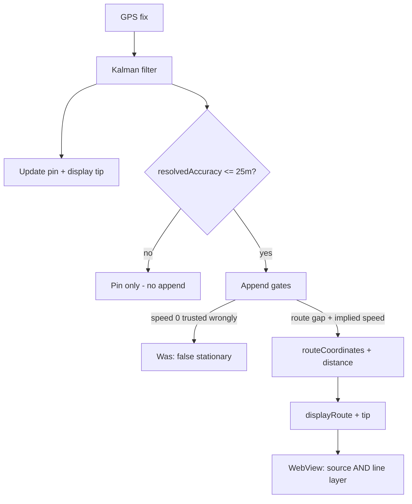
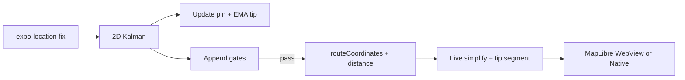

# PROGRESS.md — Clean-Up Give Back Prototype

---

## [2026-08-18] — Doc pass: radius tiers, welcome gradient, profile photo

**End goal:** Capture shipped mobile UI decisions in living docs (Decisions/Patterns/Ontology), not only inventory rows.

**Shipped (docs only):**

- `docs/frontend/context/components.md` — **Button radius tiers** pattern; profile photo editor pattern.
- `docs/frontend/context/app.md` — welcome hero gradient stops; membership Apply `radius.sm` decision.
- `docs/frontend/context/project.md` — Profile photo ontology + storage decision.
- `docs/frontend/brand.md` — radius implementation summary pointing at `design.md` §7.

**Status:** Docs only; follows commit `067d5f9`.

---

## [2026-08-18] — Mobile chrome polish (photo capture, app bar, week picker)

**End goal:** Tighten volunteer-facing chrome on photo capture, Home/Shop app bars, event detail, and Service Hours week labels.

**Shipped:**

- `PhotoCaptureScreen` zoom pills rebuilt as inset-ring `ZoomPill`s (even 2px border; selected = gold ring + dark fill, white label, regular `×`); BeReal **Retake Photos** / **Submit** `paddingBottom` 48 → 20.
- Shared `appBarChrome.ts`: bell 24px filled `textTertiary`; cart 28px filled `textTertiary` (optical match). `CartBadge` `cart` = primary, `notification` = tertiary.
- Event detail **What to bring** heading uses `sectionBody` + 10px to the item card.
- Service Hours date badge: `formatWeekRangeLabel` always uses short months (`Sep 14 - 20, 2026` / `Aug 31 - Sep 6, 2026`); badge stretches to **Week N** / **This week**; calendar modal day cells are centered **36×36** circles (not full-column `flex:1` disks that touch); dropped extra chart `marginTop` that doubled the gap under the picker.

**Also in this tree (pre-session, shipping with the same commit):** Account profile photo crop (`ProfilePhotoCropModal`, `cropProfilePhoto.ts`, `profilePhoto.ts`), EmptyState radius, order/donation history mocks, WelcomeScreen, `app.json` / package bumps.

**Docs:** `docs/frontend/context/app.md`, `docs/frontend/context/components.md`, `docs/current.md`, this entry.

**Status:** Code + docs. Push to `origin/main`.

---

## [2026-08-18] — Welcome hero gradient, account profile photo, app-bar polish, DS radius fixes

**End goal:** Match Figma welcome hero gradient; ship account profile photo pick/crop/upload; align membership Apply + EmptyState CTAs with design-system radius; unify app-bar icon/badge chrome; polish Service Hours calendar + order/donation history timestamps; refine photo-capture zoom pills.

**Shipped:**

- `WelcomeScreen.tsx` — 5-stop `#009540` linear gradient overlay on hero (0%→0%, 35%→15%, 55%→55%, 72%→85%, 88%→100% opacity); removed extra dim layer and 0.9 opacity multiplier.
- `ProfilePhotoCropModal.tsx` + `cropProfilePhoto.ts` + `profilePhoto.ts` — Account avatar tap → Take Photo / Choose from Library / Remove Photo; pan/pinch crop with Fill/Crop presets; upload `{user_id}/profile.jpg` to `session-photos`, sync `user_metadata.avatar_path`, local-uri cache; `expo-image-picker` + `expo-image-manipulator` deps; iOS/Android photo-library permission strings in `app.json`. **Spec:** [frontend/specs/account-profile-photo.md](../frontend/specs/account-profile-photo.md).
- `AccountScreen.tsx` — profile photo hero, **Court Ordered** / **Volunteer** role pill under name, membership company-code input + **Apply** use `radius.sm` (8px) per DS Input row.
- `appBarChrome.ts` + `CartBadge.tsx` — shared 24px bell / 28px cart icon sizing; notification badge uses tertiary fill; cart badge stays primary green; wired through Home/Shop/Product Detail/Cart/Checkout/Event Detail/Sessions/Request Data screens.
- `EmptyState.tsx` — card + CTA `radius.md`; full-width 52px CTA (16px label) to match shop/order primary buttons.
- `ServiceHoursWeekPicker.tsx` — week range short-month labels; date badge stretches to trailing chip; calendar day cells as centered 36×36 circles.
- Order/donation history — date + time stamp labels via shared `sessionFormat` helpers; account subpages hide bottom tab bar where noted in `app.md`.
- `PhotoCaptureScreen.tsx` — zoom preset pills extracted to `ZoomPill` with even 2px inset ring border.

**Docs:** `docs/frontend/context/app.md`, `components.md`; `docs/current.md`; this entry.

**Status:** `cd frontend && npx tsc --noEmit` clean.

---

## [2026-08-18] — Nighttime flash warning, checkout drop-off removal, activity-based Impact dropdown

**End goal:** 8-part mobile UX/business-logic batch: warn volunteers to enable flash at night before photo capture; remove stale "no nighttime cleanings" copy; drop the local drop-off checkout option; show pickup hours and use the org name (not "Donna") in pickup copy; make the Home "Your Impact" month/year picker show only years/months with real activity; and finish wiring the $59.99 tracker price / $10 shop-shipping model (landed concurrently by another session) into `CheckoutScreen.tsx`.

**Shipped:**

- `frontend/src/utils/sunTimes.ts` (new, `suncalc`-based `isNighttime(date, lat, lng)`) + `frontend/src/features/session-tracking/components/FlashWarningModal.tsx` (new) — gated in `PhotoCaptureScreen.tsx`'s `SequentialCapture`: resolves GPS via the existing `resolveCheckpointCaptureCoords()`, shows once per capture session on the back-camera step when it's nighttime and flash is off, fails open (skips silently) if location is unavailable. `suncalc`'s own bundled types (not `@types/suncalc`, which was installed then removed) type `sunrise`/`sunset` as nullable for polar day/night — handled explicitly.
- Removed "Nighttime cleanings are not allowed." from `SessionSetupGuideScreen.tsx`, `FreeHourScreen.tsx`, `SessionSetupFormScreen.tsx` (copy only, no enforcement logic existed).
- Removed the "Local drop-off" fulfillment option from mobile checkout UI only (`CheckoutScreen.tsx` `FULFILLMENT_OPTIONS`); `FulfillmentMethod`'s `'local_dropoff'` value stays in `frontend/src/lib/shopOrders.ts` since `admin-web-app` independently depends on it for historical orders. Full follow-up cleanup: deleted every drop-off-only state/effect/handler/JSX block (~600 lines: address-suggestion autocomplete, distance-to-office calculation, the `SuggestionMenu` component, associated styles) and the now-fully-orphaned `frontend/src/features/figma-screens/utils/dropoffOfficeDistance.ts` + its test, plus the `DONNA_CONTACT_EMAIL`/`MAX_LOCAL_DROPOFF_MILES` constants in `orgLocations.ts` (had zero remaining callers).
- `PICKUP_HOURS_OF_OPERATION = '10am–5pm'` (new, `orgLocations.ts`) shown under the office address at checkout; pickup-specific copy changed from "Donna" to "Clean Up Give Back" per explicit instruction (the USPS-ship hint intentionally still says Donna — scoped to pickup only).
- `frontend/src/features/session-tracking/utils/homeDashboardStats.ts`: added `buildActiveImpactYearOptions`/`buildActiveImpactMonthOptionsForYear` (derived from `SessionStatRecord.startedAtMs`, always floor the current year/month even with zero sessions) alongside the existing pure-calendar builders (kept for their own tests); wired into `ImpactFeedSection.tsx`'s year/month picker with a fallback effect if the selected month drops out of range.

**Docs:** none yet outside this entry — `docs/frontend/context/app.md`/`components.md` follow-up still open (see Status).

**Status:** Code done, `tsc --noEmit` clean across `frontend`, `admin-web-app`, `backend/sessions`; 139 existing frontend tests pass. Not yet reflected in `docs/frontend/context/app.md` (checkout/session screens) or `components.md` (new `FlashWarningModal`) — flagged for next session. Pre-existing, unrelated ESLint parse error in `frontend/src/screens/UnderAgeLearnWhyScreen.tsx:22` (from concurrent changes outside this session) still needs a look.

---

## [2026-08-18] — Volunteer email template refresh + tracker pricing

**End goal:** Volunteer emails use brand-green CTAs, `info@` support, CID images, and tracker checkout is $59.99 with the kit included and free shipping.

**Shipped:**

- Order / hours-reminder / password-reset HTML: CTA `#009540` + `#004d21` stroke + white label; support `info@cleanupgiveback.org`; hours figure white on `#004d21`.
- Order sends CID-inline logo, header pixel, shipping GIF, and product thumbs (`buildOrderEmailForSend` in admin-web-app + Fly `backend/sessions`).
- Tracker checkout **$59.99** with kit always included and USPS **FREE**; standalone shop kit **$49.99** + `$10.00` USPS.
- BIMI assets: `admin-web-app/public/email/bimi-logo.svg` + `sender-avatar.png`. Inbox chip stays the pink **N** until DNS + CMC/VMC (ops, not done).

**Docs:** `docs/backend/specs/order-emails.md`, `hours-reminder-email.md`, `password-reset-email.md`, `order-fulfillment.md`, `docs/current.md`, `docs/admin/dulf-resend-supabase-fly.md` §2.2.1, Donna briefing `docs/reports/2026-08-18-inbox-sender-logo-donna.md`.

**Status:** Code done. BIMI DNS / certificate still ops.

---

## [2026-08-18] — Stationary session replay path fix

**End goal:** Ending a session without moving must not draw an animated walking path on session-detail replay.

**Shipped:**

- `routeFiltering.ts` — when OS reports `speedMps === 0`, treat sub-gate GPS jitter as stationary (stop appending junk trail points); replay collapse also uses recorded `distanceMiles` &lt; 0.01 mi as a display safety net.
- `SessionRouteMapPanel` — optional `distanceMiles` prop wired from submission confirmation + session detail.

**Docs:** `docs/frontend/context/components.md`.

**Status:** Done.

---

## [2026-08-18] — Live tracker location pill layout

**End goal:** Location + weather pill on the live tracker has even spacing around the divider and sits centered in the navbar (equidistant from content edges).

**Shipped:**

- `LiveSessionScreen` — pill width 203 → 188; divider `marginHorizontal: 10`; weather icon 18px (matches pin); place label ellipsize.
- Navbar restructure: pill in `navbarPillCenter` (`absoluteFillObject` + center); back chevron + compass at `zIndex: 1`.

**Docs:** `docs/frontend/context/app.md`.

**Status:** Done.

---

## [2026-08-18] — Emoji broom artwork in sweep loader

**End goal:** The loading broom matches the SVG Repo emoji broom, without the three dirt specks on the artwork.

**Shipped:**

- Replaced the simplified fan broom in `broom.svg` / `BroomSweepLoader` with the original SVG Repo paths. Removed the three circles from the source SVG. Flipped horizontally so bristles still face the dust dots.
- Retinted to CUGB brand (`amber/700` handle, `lime/500` bristles, `gray/700` collar, `gray/900` stroke). Broom draw size reduced (~46% / ~34% of width vs prior ~55% / ~40%).

**Docs:** `docs/frontend/context/components.md`, `assets.md`.

**Status:** Done.

---

## [2026-08-18] — Physics broom-sweep loader

**End goal:** Data-fetch loader uses a smaller brand-colored broom that sweeps, then kicks dots, then steps right until off-screen.

**Shipped:**

- `BroomSweepLoader` (~40% box size). Handle, collar, and wrap amber/700; bristles lime; shade gray/700.
- Full-screen preview: cream sky, full-width forest-green ground from 55% of height, cream Sanchez “Loading sessions…” in the green band. HTML phone frame in `tidy-man-preview.html`.
- Eight heavier dots; scatter on first contact; sleep when they land. Preview: `tidy-man-preview.html`.

**Docs:** `docs/frontend/context/components.md`, `assets.md`, `app.md`, `docs/current.md`.

**Status:** Done.

---

## [2026-08-17] — Tidy-man loading animation

**End goal:** Data-fetch loader uses the ISO tidy-man pictogram, with the figure tossing trash into the bin.

**Shipped:**

- `frontend/assets/animations/tidy-man.json` (~2s loop: arm swing + three squares arcing into the bin). Replaces the broom-sweep experiment.
- `BrandLoadingView` plays that Lottie at 160px; reduced motion still shows the label only.

**Docs:** `docs/frontend/context/components.md`, `assets.md`, `docs/current.md`.

**Status:** Done.

---

## [2026-08-17] — Branded broom-sweep loading animation

**End goal:** Replace generic `ActivityIndicator` / “Loading …” copy on mobile data-fetch screens with a shared on-brand broom-sweep loader.

**Shipped:** Superseded the same day by the tidy-man pictogram (`tidy-man.json`).

**Status:** Superseded.

---

## [2026-08-17] — Audit log diff: stacked from→to pills

**End goal:** Replace the audit log’s Before/After column grid with a scannable per-field transition layout Donna can read at a glance.

**Shipped:**

- `AuditDiffCard` now stacks each changed field as label + from pill → chevron → to pill (per-value tint unchanged — status tones follow the value, not column).
- Wired on `/audit-log` and volunteer timeline (same component).

**Docs:** `docs/admin-web-app.md`, `AGENTS.md` (learned fact).

**Status:** Done.

---

## [2026-08-16] — Your Impact month/year picker: list-only (no search)

**End goal:** Month and year dropdowns in **Your Impact** should be pick-from-list only — no type-to-search field.

**Shipped:**

- Removed `TextInput` + **Go** from `ImpactFeedSection` picker sheet; selection is tap-only on the scrollable `FlatList`.
- Dropped picker draft/error state, `KeyboardAvoidingView`, and `parseImpactMonthInput` / `parseImpactYearInput` imports from the component (helpers remain in `homeDashboardStats.ts` + unit tests for potential reuse).
- Updated a11y hints on month/year chips (`Opens month picker` / `Opens year picker`).

**Docs:** `docs/frontend/specs/home-dashboard-session-stats.md` (AC-4 + picker table), `components.md`, `app.md`, `current.md`.

**Status:** Done.

---

## [2026-08-16] — Home chart minute bar-label spacing

**End goal:** Sub-hour Service Hours bars (e.g. `18 min`, `12 min`) must not render flush inside narrow columns or clip the chart border.

**Shipped:** Minute-scale weeks reserve a 14px label band, place `XX min` labels above bars with spacing, and realign grid/Y-axis to the reduced plot height. Spec AC-10 in `docs/frontend/specs/home-dashboard-session-stats.md`.

**Status:** Done (code + docs).

---

## [2026-08-16] — Home Your Impact + Recent Cleanups

**End goal:** Replace the lifetime-hours stat card with a month/year impact sentence and a map-first Recent Cleanups feed; polish picker UX (motion, scroll, layout).

**Shipped:**

- **Impact sentence** — two-row layout (`In {month} {year}, you cleaned up` / `{n} places for a total of {duration}.`); month + year chips with `ChevronDownIcon`; green semibold stats; sub-hour → minutes via `sessionFormat.ts`.
- **Picker sheet** — full-width Reanimated bottom sheet (live-tracker / `MapTypesSheet` motion); list-only month/year selection (no type-to-search); 12 months × selected year; 100 years newest-first through today (`IMPACT_YEAR_SPAN`); bounded `FlatList` with dismiss scrim above sheet only; current year not clipped at open.
- **Recent Cleanups** — map always fills tile; 56×56 photo thumb top-left; status badge top-right; title/time/duration overlay; data from `impactFeedStore`. Home hides Recent Sessions list.
- **Chip styling pass, imported from Figma `1328:96`/`1328:142`** — layout iterated through several failed approaches before landing on the final one:
  - A wrapping-paragraph layout (single `<Text>` with `flex:1` tail) broke because RN can't reflow a `View`/`Pressable` inline inside `Text` on this build; nested-`Text`-only spans wrap but can't reliably paint a background/border around a nested non-text icon child.
  - `get_design_context` on the actual Figma node showed the design was never meant to wrap at all — it's two **fixed, single-line rows** (`heroRow` with `flexWrap: 'nowrap'`), so the real fix was matching that structure, not chasing paragraph reflow.
  - Final chip (`monthChip`): `colors.chipSelectedBg` pill, `Sanchez` label, `ChevronDownIcon`, contents centered (`monthChipRow` `justifyContent: 'center'`, `marginTop: 3` nudge), 1px underline (`monthChipRule`) stretched edge-to-edge via a negative `marginHorizontal` matching the chip's padding (borders on nested `Text` don't render reliably, so this has to be a real `View`). Highlighted counts use `colors.statusApprovedText`; trailing period nested in a plain-text span so it doesn't inherit the green highlight color.
  - Text sits at 16px/22 line-height — bumped from the Figma-literal 12px for legibility, with `heroRow` gap/`monthChip` padding trimmed tight specifically to keep the no-wrap row from overflowing on standard phone widths.
- **Docs:** `docs/frontend/specs/home-dashboard-session-stats.md` (AC-4 detail section), `components.md`, `current.md`.

**Status:** Done (code + docs). Spec test plan items 6–7 cover manual QA. Chip layout not yet visually verified on a real device/simulator — no wrap safety net remains on `heroRow`, so watch for clipping on very narrow screens or long month names.

---

## [2026-08-16] — Mobile empty states

**End goal:** Every list/data surface that can be empty uses a shared `EmptyState` with a next step, including first-time Home and missing session/event records.

**Shipped:** Home first-time Service Hours / Impact / Recent Sessions / Upcoming Events; Approval History live list; session + event not-found; export zero-match (disables Export); Shop category + Events View All + session photos aligned to `EmptyState`. Spec: `docs/frontend/specs/mobile-empty-states.md`.

**Status:** Done (code + docs).

---

## [2026-08-16] — Mobile session detail shows admin decline reason

**End goal:** When Donna declines a session in admin with a volunteer-facing reason, that same text appears on the mobile session detail screen for that session.

**Shipped:** Added `declineReason` to Prisma + Fly `GET /sessions` / `GET /sessions/:id` (maps existing `sessions.decline_reason`; private `admin_notes` stay admin-only). Mobile `SessionDetailScreen` shows a **Reason not approved** card when status is Declined and a reason exists. Deployed `cleanup-sessions` to Fly.

**Status:** Done (code + docs + Fly deploy).

---

## [2026-08-15] — Home weekly-hours pill contrast

**End goal:** Keep the Figma lime greeting chip, but make it WCAG AA readable.

**Shipped:** Home streak pill now uses `textPrimary` 14px SemiBold on `accentLime` (10.78:1) instead of primary green at 12px (2.45:1). Copy is “N hours this week. Keep it up!” — grouped as one `accessibilityRole="text"` announcement. Flame stays decorative. Hours match the current-week chart total at 0.1 hr (no integer rounding).

**Status:** Done (code + docs).

---

## [2026-08-15] — Local drop-off over 30 miles is blocked

**End goal:** Volunteers cannot place a local drop-off order when the address is more than 30 miles from Clean Up Give Back.

**Shipped:** Checkout shows “too far from the office — ship via USPS or contact Donna” with a `mailto:` to `donnaadam@cleanupgiveback.org`. Card fields stay hidden until they switch to Ship via USPS. Place Order is disabled. In-range addresses confirm Donna will contact them to arrange a time. Threshold is `MAX_LOCAL_DROPOFF_MILES` in `orgLocations.ts`.

**Status:** Done (code + docs).

---

## [2026-08-15] — Rewrote in-app Privacy Policy copy against Dulf's launch checklist

**End goal:** Dulf's `docs/compliance/launch-checklist.md` (2026-08-13) flagged the in-app Privacy Policy draft as over-claiming several things (password auth, live Stripe checkout, enforced retention jobs, instant deletion/export) and missing disclosures for data the app actually collects (feedback, service type, session notes, checkpoint coordinates, session/admin metadata, event registrations, company codes, court-order records, notification content, signature images) and processors it actually uses (Vercel, OSM/Photon/Nominatim/Census/Google Places, court/school/employer PDF recipients).

**Shipped:** Rewrote all four sections in [`privacyPolicyContent.ts`](../frontend/src/features/figma-screens/content/privacyPolicyContent.ts) — verified each claim against the current codebase (anonymous auth, `backend/payments/` empty, AsyncStorage keys, checkout fulfillment options, `ServiceLetterPdf.tsx` signature usage) before writing it, rather than trusting either the old draft or the checklist blindly. Picked one grace-period number (30 days) and used it consistently. Bumped `PRIVACY_POLICY_LAST_UPDATED` to August 15, 2026. Checked off the corresponding items in `launch-checklist.md` §1 with dated notes; left counsel-judgment items (BIPA, GDPR, CCPA, breach notification, controller identity) and backend-only items (retention jobs, admin audit log disclosure) unchecked.

**Not done:** Terms of Service, publishing the policy outside the app, signup acceptance checkbox, and everything else in the checklist outside §1 — out of scope for this pass.

**Status:** In-app Privacy Policy content is now accurate to the current build. Still a draft pending counsel review before public traffic.

---

## [2026-08-15] — Pickup vs USPS ship fulfillment

**End goal:** Match Donna’s ops — pickup/local or manual USPS, same $49.99 app-access price, optional kit.

**Shipped:** `shop_orders.fulfillment_method` + `includes_kit` + `fulfilled` status (`022_order_fulfillment.sql`). Checkout fulfillment selector; tracker checkout now writes `shop_orders`. Admin ship vs pickup forms; shipped email gated to USPS ship. Live Order History + ship-only track link. Spec: [backend/specs/order-fulfillment.md](backend/specs/order-fulfillment.md).

**Apply:** run `admin/db/022_order_fulfillment.sql` on Supabase before testing live rows.

**Status:** Done (code + docs). Stripe still mock.

---

## [2026-08-13] — Launch checklist: frameworks, audits, seals

**End goal:** Record which paid certifications/audits actually fit this app (GPS + selfies + court hours, 501(c)(3), under-13 blocked) so we do not buy a generic SaaS badge.

**Shipped:** [`docs/compliance/launch-checklist.md`](compliance/launch-checklist.md) §11 — apply MASVS/ASVS/NIST internally; pay for counsel memo, DPIA, DPAs, pen test, optional Play **MASA AL2**; SOC 2/ISO/PCI only when a partner or Stripe requires them; skip COPPA Safe Harbor while we block under 13.

**Status:** Done (docs). No vendor engagement started.

---

## [2026-08-13] — Compliance launch checklist

**End goal:** Capture a living, app-specific compliance/launch board (not a generic SaaS+ads+LLM list) so Privacy Policy gaps, unimplemented data rights, and store/legal blockers are tracked in `docs/`.

**Shipped:**
1. New [`docs/compliance/launch-checklist.md`](compliance/launch-checklist.md) — counsel/publication, policy accuracy, ToS, data rights, security, storage/GPS, Stripe-when-shipped, monitoring, Illinois/minors/courts, store labels; out-of-scope and suggested work order.
2. Indexed from `docs/README.md`, `privacy-and-data-protection.md`, `mobile-app-privacy-policy-outline.md`, `privacy-and-data-rights.md`, `implementation-plan.md`, `current.md`.

**Status:** Done (docs only). Counsel review and implementation of deletion/export/retention remain open on the checklist.

---

## [2026-08-13] — Branded email polish + deploy (Vercel + GitHub)

**End goal:** Document and ship live HTML email updates (cream cards, Gmail footer, placeholders, assistance copy) to GitHub and Vercel.

**Shipped:** All three templates converted to live HTML; PNG rasterization removed; cream `#fcf9f8` cards; full-width sage footer; `$XX.XXX` order prices; `Volunteer`/`Volunteer Name`/`XXX` placeholders; “For assistance” support line; single-underline footer links; forgot-password bold green headline. Docs/specs synced.

**Deploy:** Git push `main` → Vercel production (`admin-web-app`). Fly `backend/sessions` redeploy still needed for production order-placed mail.

**Status:** Done.

---

## [2026-08-13] — Forgot Password headline green + bold

**End goal:** “Forgot Password?” is primary `#009540` and bold.

**Shipped:** `h1` `font-weight:700;color:#009540`.

**Docs:** `docs/backend/specs/password-reset-email.md`, this file.

**Verify:** preview + send-test.

**Status:** Done.

---

## [2026-08-13] — Email support line says assistance

**End goal:** Support line copy is “For assistance, email …” on all branded templates.

**Shipped:** password-reset, hours-reminder, both order-email copies.

**Status:** Done.

---

## [2026-08-13] — Full-width sage footer to the bottom

**End goal:** Forgot Password, order, and hours-reminder footers span the pane and fill leftover height.

**Shipped:** Outer table `width/min-width/height: 100%`; footer row `email-footer` with the same. Sage body fill.

**Docs:** password-reset, order-emails, hours-reminder specs; this file.

**Verify:** preview scripts + test sends.

**Status:** Done.

---

## [2026-08-13] — Hours-reminder cream card

**End goal:** Missing-you support strip uses the same cream as Forgot Password and order emails.

**Shipped:** Card fill is `cream/50` `#fcf9f8` (green header unchanged).

**Docs:** `docs/backend/specs/hours-reminder-email.md`, this file.

**Verify:** preview + send-test.

**Status:** Done.

---

## [2026-08-13] — Hours-reminder footer visible in Gmail

**End goal:** Same as order mail — sage footer shows without Gmail’s “…” control.

**Shipped:** Footer is a row in the same outer table. Test send uses a unique subject.

**Docs:** `docs/backend/specs/hours-reminder-email.md`, this file.

**Verify:** preview + send-test to inbox.

**Status:** Done.

---

## [2026-08-13] — Order email footer visible in Gmail

**End goal:** Sage footer shows without Gmail’s “…” expand control.

**Shipped:** Footer is a row in the same outer table as the cream card (admin + Fly). Hidden order-number token in footer/preheader.

**Docs:** `docs/backend/specs/order-emails.md`, this file.

**Verify:** preview + send-test with a unique subject so it is not buried in the old Gmail thread.

**Status:** Done.

---

## [2026-08-13] — Order email price placeholders

**End goal:** Line-item prices and the items total use the same `$XX.XXX` mask as Order Total.

**Shipped:** `itemPrice` and `itemsTotal` in both `order-email-html.ts` copies.

**Docs:** `docs/backend/specs/order-emails.md`, this file.

**Verify:** preview + send-test order emails.

**Status:** Done.

---

## [2026-08-13] — Order emails cream card

**End goal:** Placed + shipped body uses the same cream as Forgot Password, not white.

**Shipped:** Card fill is `cream/50` `#fcf9f8` in both `order-email-html.ts` copies (admin + Fly). Green header unchanged.

**Docs:** `docs/backend/specs/order-emails.md`, this file.

**Verify:** preview + send-test order emails.

**Status:** Done.

---

## [2026-08-13] — Forgot Password cream card

**End goal:** Forgot Password card uses design-system beige, not white.

**Shipped:** Card fill is `cream/50` `#fcf9f8` (`color/bg/app`) with Outlook `bgcolor`. Sage footer unchanged.

**Docs:** `docs/backend/specs/password-reset-email.md`, this file.

**Verify:** `npx tsx scripts/preview-password-reset-email.mts`; test send.

**Status:** Done.

---

## [2026-08-13] — Consistent email letter-spacing

**End goal:** Same tracking on Forgot Password, order, and hours-reminder copy.

**Shipped:** `LETTER_SPACING = 0.02em` in all three HTML builders (admin + Fly order copies). Head CSS `body, td, p, h1, a` plus inline on every text cell and link.

**Docs:** `docs/backend/specs/password-reset-email.md`, `order-emails.md`, `hours-reminder-email.md`, this file.

**Verify:** preview scripts assert `letter-spacing:0.02em`.

**Status:** Done.

---

## [2026-08-13] — Full-width sage email footer

**End goal:** Footer spans the preview width and sits at the bottom on Forgot Password, order, and hours-reminder.

**Shipped:** Pulled `#bdcaba` out of the 600px card into a 100% table; body/`html` fill is sage so leftover height is footer color.

**Docs:** `docs/backend/specs/password-reset-email.md`, `order-emails.md`, `hours-reminder-email.md`, this file.

**Verify:** preview + send-test scripts for all three templates.

**Status:** Done.

---

## [2026-08-13] — Forgot Password: light-only color scheme

**End goal:** Same Apple Mail inversion opt-out as order and hours-reminder.

**Shipped:** `color-scheme` / `supported-color-schemes` are `light only` on the Forgot Password HTML. CTA still swaps amber → lime via `prefers-color-scheme` / `[data-ogsc]`.

**Docs:** `docs/backend/specs/password-reset-email.md`, this file.

**Verify:** `npx tsx scripts/preview-password-reset-email.mts`; `npx tsx scripts/send-test-password-reset-email.mts --to=…`

**Status:** Done.

---

## [2026-08-13] — Order email headline + transparent shipping GIF

**End goal:** “Your order is on its way!” stays white in Mail dark mode; truck has no baked rectangle.

**Shipped:** Same `light only` + `header-pixel.png` treatment as hours-reminder on both `order-email-html.ts` copies. Re-encoded `shipping.gif` at 220×106 with GIF transparency (~84KB). Test send CID-inlines the pixel + GIF so the inbox shows the local truck without a Vercel deploy.

**Docs:** `docs/backend/specs/order-emails.md`, this file.

**Verify:** `npx tsx scripts/preview-order-emails.mts`; `npx tsx scripts/send-test-order-email.mts --to=…`

**Status:** Done.

---

## [2026-08-13] — Hours-reminder: stop Apple Mail inverting body copy

**End goal:** Nudge copy stays white on the green header in Mail dark mode.

**Shipped:** Dropped the `-webkit-text-fill-color` fight (Mail inverts it). Header tiles CID `header-pixel.png` (`#009540`) as `background` — Apple Mail skips inversion on image-backed cells. Meta `color-scheme` / `supported-color-schemes` are `light only`.

**Docs:** `docs/backend/specs/hours-reminder-email.md`, this file.

**Verify:** `npx tsx scripts/preview-hours-reminder-email.mts`; `npx tsx scripts/send-test-hours-reminder-email.mts --to=…`

**Status:** Done.

---

## [2026-08-13] — Hours-reminder body stays white in Apple Mail dark mode

**End goal:** Nudge copy on the green header stays white when Mail inverts `#ffffff`.

**Shipped:** Inline `-webkit-text-fill-color:#ffffff` on a nested span (Apple Mail inverts `color` after CSS, not the fill). `color-scheme:only light` on the text cell. Dark-mode / `[data-ogsc]` rules still force white.

**Docs:** `docs/backend/specs/hours-reminder-email.md`, this file.

**Verify:** `npx tsx scripts/preview-hours-reminder-email.mts`; `npx tsx scripts/send-test-hours-reminder-email.mts --to=…`

**Status:** Done.

---

## [2026-08-13] — Transparent email GIFs

**End goal:** Bell and shipping GIFs sit on the header without a baked green rectangle in dark mode.

**Shipped:** Chroma-keyed `#009540` out of `nudge-bell.gif` and `shipping.gif` (1-bit GIF transparency). Bell renderer now captures transparent PNG frames. Shipping cache-bust `?v=5`. Hours-reminder CID-inlines the local bell; order emails need a Vercel deploy before the hosted truck updates.

**Docs:** `docs/backend/specs/order-emails.md`, `hours-reminder-email.md`, `current.md`, `admin-web-app.md`, this file.

**Verify:** Visual composite on magenta / `#004d21`; `npx tsx scripts/send-test-hours-reminder-email.mts --to=…` (CID bell). Order GIF is hosted — deploy `admin-web-app` for inbox.

**Status:** Done.

---

## [2026-08-13] — Order + hours-reminder emails: live HTML

**End goal:** Match Forgot Password — all branded transactional copy is HTML, not type PNGs.

**Shipped:** Order placed/shipped (`order-email-html.ts`, admin + Fly copies) and hours-reminder (`hours-reminder-email-html.ts`) use live HTML with Georgia / Trebuchet fallbacks and hosted `@font-face`. CTAs: lime light / amber dark. Images left: logo, shipping GIF / bell GIF, product thumbs. Removed Satori type-PNG pipeline (`hours-reminder-type-png.ts`) and CID attachments from the hours cron. `approved` / `declined` / `event_registration` were already HTML.

**Docs:** `docs/backend/specs/order-emails.md`, `hours-reminder-email.md`, `current.md`, this file.

**Verify:** `cd admin-web-app && npx tsx scripts/preview-order-emails.mts && npx tsx scripts/preview-hours-reminder-email.mts && npx tsc --noEmit`; `cd backend/sessions && npx tsc --noEmit`; send-test scripts to inbox.

**Status:** Done.

---

## [2026-08-13] — Forgot Password CTA: lime in dark mode

**End goal:** Reset Password button uses a distinct brand color when the client applies dark mode.

**Shipped:** Light stays amber `#fcab29`; dark uses lime `#c2d832` via `prefers-color-scheme: dark` and Outlook `[data-ogsc]`/`[data-ogsb]`. Meta `color-scheme` is `light dark`. Gmail may still keep amber.

**Docs:** `docs/backend/specs/password-reset-email.md`, this file.

**Verify:** `cd admin-web-app && npx tsx scripts/preview-password-reset-email.mts`; `npx tsx scripts/send-test-password-reset-email.mts --to=…`

**Status:** Done.

---

## [2026-08-13] — Forgot Password email: Georgia + Trebuchet fallbacks

**End goal:** Closest widely-supported stacks for Sanchez/Noto when Gmail strips webfonts.

**Shipped:** Headline/CTA `Georgia, 'Times New Roman', serif`; body/footer `'Trebuchet MS', Tahoma, Arial, Helvetica, sans-serif`. Hosted `@font-face` still first for Apple Mail.

**Docs:** `docs/backend/specs/password-reset-email.md`, `current.md`, `admin-web-app.md`, this file.

**Verify:** `cd admin-web-app && npx tsx scripts/preview-password-reset-email.mts`; `npx tsx scripts/send-test-password-reset-email.mts --to=…`

**Status:** Done.

---

## [2026-08-13] — Forgot Password email: live HTML, not type PNGs

**End goal:** Replace rasterized Sanchez/Noto copy in the Forgot Password template with live HTML so copy is maintainable and dark-mode CSS can target text.

**Shipped:** `buildPasswordResetEmailHtml` uses `<h1>` / `<p>` / bulletproof lime CTA / text footer links. Hosted `@font-face` for Apple Mail; Gmail falls back to Georgia (headline/CTA) and Trebuchet MS (body). Only `logo-mark-green.png` remains an image. Preview script asserts no `forgot-password-*.png` type assets. Test send no longer CID-inlines type PNGs. Order + hours-reminder emails still use the shared footer PNGs.

**Docs:** `docs/backend/specs/password-reset-email.md`, `current.md`, `admin-web-app.md`, `README.md`, this file.

**Verify:** `cd admin-web-app && npx tsx scripts/preview-password-reset-email.mts`; `npx tsc --noEmit`; `npx tsx scripts/send-test-password-reset-email.mts --to=…`

**Status:** Done.

---

## [2026-08-12] — Order emails documented as shipped

**End goal:** Living docs match the Figma `1311:359` placed + shipped mail Donna signed off.

**Shipped:** Spec rewritten (layout, type, placeholders, hosted assets, ACs). `current.md`, `admin-web-app.md`, `backend/context/sessions.md` updated.

**Docs:** `docs/backend/specs/order-emails.md`, `docs/current.md`, `docs/admin-web-app.md`, `docs/backend/context/sessions.md`, this file.

**Ops still:** apply `admin/db/020_order_emails_figma.sql`; Fly redeploy for production `POST /emails/order-placed`.

**Status:** Done.

---

## [2026-08-12] — Forgot Password email assets on Vercel

**End goal:** Hosted `/email/forgot-password-*.png` so Gmail can load type without CID after deploy.

**Shipped:** `cd admin-web-app && vercel --prod` → https://cleanupgiveback-web-app.vercel.app. Confirmed `forgot-password-body.png` `200`. HTML still test-script only; Welcome send path unwired. Sanchez is headline + CTA; everything else is Noto Sans.

**Docs:** `docs/backend/specs/password-reset-email.md`, `current.md`, `admin-web-app.md`, `accounts-and-access.md`, `README.md`, this file.

**Verify:** `curl -sI https://cleanupgiveback-web-app.vercel.app/email/forgot-password-body.png`

**Status:** Done.

---

## [2026-08-12] — Hours-reminder email on production Vercel

**End goal:** Figma Nudge `1311:432` is the live court-ordered inactivity email.

**Shipped:** Code-owned HTML + per-send type PNGs (Sanchez body/Open App, Noto Sans hours/footer; 16px laptop / 24px phone; amber hours on `#004d21`; 120px bell GIF). Cron `sendHoursReminders` fills first name + completed hours. Production deploy `cleanupgiveback-web-app` (2026-08-12); `/email/nudge-bell.gif` and `hours-reminder-*.png` return 200. Not in the Emails-tab editor.

**Docs:** `docs/backend/specs/hours-reminder-email.md`, `current.md`, `admin-web-app.md`, this file.

**Ops:** Apply `admin/db/021_hours_reminder_figma.sql` on Supabase if the `hours_reminder` body stub is not already there. Git still has uncommitted hours-reminder files after the CLI deploy.

**Verify:** `npx tsx scripts/preview-hours-reminder-email.mts`; production GIF 200.

**Status:** Done (ops: migration 021 if needed).

---

## [2026-08-12] — Order greeting wraps; placed body larger on phone

**End goal:** Name sits in one wrapping sentence; placed “We’ve received your order…” is a bit larger on phone.

**Shipped:** Greeting is one HTML line. `order-placed-body-mobile.png` at 18px, left-aligned wrap.

**Docs:** `docs/backend/specs/order-emails.md`, this file.

**Verify:** `npx tsx scripts/preview-order-emails.mts`

**Status:** Done.

---

## [2026-08-12] — Order-email GIF smaller, headline larger

**End goal:** Truck less dominant; “Your order is on its way!” a bit larger.

**Shipped:** GIF display 250×121 → 220×106. Headline Sanchez 24px → 28px (340×36).

**Docs:** `docs/backend/specs/order-emails.md`, this file.

**Verify:** `npx tsx scripts/preview-order-emails.mts`

**Status:** Done.

---

## [2026-08-12] — Hours-reminder phone type 24px

**End goal:** Phone headline/hours a step smaller than 32px.

**Shipped:** Mobile body/hours PNGs at 24px (desktop stays 16px).

**Docs:** `docs/backend/specs/hours-reminder-email.md`, this file.

**Verify:** `npx tsx scripts/preview-hours-reminder-email.mts`

**Status:** Done.

---

## [2026-08-12] — Order-shipped body left-aligned

**End goal:** “Your package is on its way…” reads as a left-aligned paragraph on phone and laptop.

**Shipped:** Re-rasterized both body PNGs left-aligned; HTML `align="left"`.

**Docs:** `docs/backend/specs/order-emails.md`, this file.

**Verify:** `npx tsx scripts/preview-order-emails.mts`

**Status:** Done.

---

## [2026-08-12] — Order-email remaining copy is Noto Sans

**End goal:** Sanchez only on headline + Track Order; everything else Noto Sans.

**Shipped:** Label/chrome PNGs + hosted `@font-face` for live fields; footer/support reuse Forgot Password Noto assets.

**Docs:** `docs/backend/specs/order-emails.md`, this file.

**Verify:** `npx tsx scripts/preview-order-emails.mts`

**Status:** Done.

---

## [2026-08-12] — Hours-reminder desktop type 16px

**End goal:** Headline and current-hours are not oversized on laptop.

**Shipped:** Desktop body/hours PNGs at 16px; phone 24px via `@media` swap (`hours-reminder-*-mobile.png`).

**Docs:** `docs/backend/specs/hours-reminder-email.md`, this file.

**Verify:** `npx tsx scripts/preview-hours-reminder-email.mts`; `npx tsc --noEmit` in admin-web-app.

**Status:** Done.

---

## [2026-08-12] — Order-shipped phone body type larger

**End goal:** “Your package is on its way…” stays readable on phone instead of shrinking with the 519px laptop PNG.

**Shipped:** `order-shipped-body-mobile.png` at 20px Noto, ~288px wrap; `@media` swap like Forgot Password.

**Docs:** `docs/backend/specs/order-emails.md`, this file.

**Verify:** `npx tsx scripts/preview-order-emails.mts`

**Status:** Done.

---

## [2026-08-12] — Forgot Password content nudged up

**End goal:** Main block sits slightly higher; only headline + CTA stay Sanchez.

**Shipped:** Tightened logo/headline/body/CTA/support padding. Body, support, and footer remain 14–16px Noto Sans PNGs.

**Docs:** `docs/backend/specs/password-reset-email.md`, this file.

**Verify:** `npx tsx scripts/preview-password-reset-email.mts`; `send-test-password-reset-email.mts --to=…`

**Status:** Done.

---

## [2026-08-12] — Hours-reminder support/footer Noto Sans

**End goal:** Remaining Arial chrome in the hours-reminder email shows Noto Sans in Gmail.

**Shipped:** Reused Forgot Password 14px Noto Sans PNGs for support + footer; mailto wraps the images. Body/Open App stay Sanchez.

**Docs:** `docs/backend/specs/hours-reminder-email.md`, this file.

**Verify:** `npx tsx scripts/preview-hours-reminder-email.mts`; `npx tsc --noEmit` in admin-web-app.

**Status:** Done.

---

## [2026-08-12] — Order-email address stays placeholder

**End goal:** Address row matches other summary fields: X-style copy until a real street + city exist.

**Shipped:** Placeholder `XXXXX, XXXXX, XX XXXXX`. `formatShippingAddress` requires line1 and city; rejects admin sentinels.

**Docs:** `docs/backend/specs/order-emails.md`, this file.

**Verify:** `npx tsx scripts/preview-order-emails.mts`

**Status:** Done.

---

## [2026-08-12] — Hours-reminder current-hours contrast

**End goal:** Keep amber hours as an accent without failing WCAG on forest green.

**Shipped:** Current-hours PNG is `#fcab29` on a `#004d21` band (~5.3:1) instead of `#009540`.

**Docs:** `docs/backend/specs/hours-reminder-email.md`, this file.

**Verify:** `npx tsx scripts/preview-hours-reminder-email.mts`; `npx tsc --noEmit` in admin-web-app.

**Status:** Done.

---

## [2026-08-12] — Forgot Password support/footer Noto Sans

**End goal:** Remaining Arial copy in the Forgot Password email shows Noto Sans in Gmail.

**Shipped:** Rasterized support + footer (Contact Us / Privacy / Unsubscribe / nonprofit) as 14px Noto Sans PNGs; mailto wraps the images. Headline and CTA stay Sanchez.

**Docs:** `docs/backend/specs/password-reset-email.md`, this file.

**Verify:** `npx tsx scripts/preview-password-reset-email.mts`; `send-test-password-reset-email.mts --to=…`

**Status:** Done.

---

## [2026-08-12] — Hours-reminder bell smaller, type larger

**End goal:** Bell less dominant; body and current-hours type larger and matched.

**Shipped:** Bell display 170→120. Body + hours rasterized at 32px (was 24).

**Docs:** `docs/backend/specs/hours-reminder-email.md`, this file.

**Verify:** `npx tsx scripts/preview-hours-reminder-email.mts`; `npx tsc --noEmit` in admin-web-app.

**Status:** Done.

---

## [2026-08-12] — Sharper order-email shipping GIF from SVG

**End goal:** Header truck is crisp in Gmail (Gmail strips animated SVG).

**Shipped:** Recolored `frontend/assets/animations/shipping.svg`; rendered 749×362 GIF (256-color, no dither) displayed 250×121.

**Docs:** `docs/backend/specs/order-emails.md`, `docs/frontend/context/assets.md`, this file.

**Status:** Done.

---

## [2026-08-12] — Forgot Password body: phone vs laptop

**End goal:** 16px body on laptop and phone.

**Shipped:** Two 16px body PNGs + `@media (max-width: 600px)` table swap (`forgot-password-body.png` full-width wrap / `forgot-password-body-mobile.png` ~320px wrap).

**Docs:** `docs/backend/specs/password-reset-email.md`, this file.

**Verify:** `npx tsx scripts/preview-password-reset-email.mts`; `send-test-password-reset-email.mts --to=…`

**Status:** Done.

---

## [2026-08-12] — Hours-reminder fonts as PNGs (Gmail)

**End goal:** Hours-reminder branded type matches Forgot Password: rasterized Sanchez / Noto Sans, CID-inlined on send.

**Shipped:** `hours-reminder-type-png.ts` (satori + resvg); body/hours/button ``s in `hours-reminder-email-html.ts`; cron + test send CID-inline logo, bell GIF, and per-volunteer type PNGs. Placeholder PNGs under `public/email/`. Footer stays live Arial.

**Docs:** `docs/backend/specs/hours-reminder-email.md`, `current.md`, `admin-web-app.md`, this file.

**Verify:** `npx tsx scripts/preview-hours-reminder-email.mts`; `npx tsx scripts/send-test-hours-reminder-email.mts --to=<inbox>`; `npx tsc --noEmit` in admin-web-app.

**Status:** Done.

---

## [2026-08-12] — Forgot Password body type larger

**End goal:** Body copy (“That’s okay…”) readable in Gmail.

**Shipped:** Re-rasterized `forgot-password-body.png` at Noto Sans 24px so Gmail phone scale-down stays readable (16px PNG was ~10px on a 375px screen).

**Docs:** `docs/backend/specs/password-reset-email.md`, this file.

**Verify:** `npx tsx scripts/preview-password-reset-email.mts`; `send-test-password-reset-email.mts --to=…`

**Status:** Done.

---

## [2026-08-12] — Order email fonts + tighter GIF spacing

**End goal:** Gmail shows Sanchez/Noto like Forgot Password; less gap under the shipping GIF.

**Shipped:** Rasterized headline/CTA/body PNGs; Arial for live fields; cropped `shipping.gif` to 170×77; CID-inline on test send.

**Docs:** `docs/backend/specs/order-emails.md`, this file.

**Verify:** `npx tsx scripts/preview-order-emails.mts`; `send-test-order-email.mts --to=…`

**Status:** Done.

---

## [2026-08-12] — Figma Forgot Password email HTML

**End goal:** Implement Figma `1311:449` as Resend HTML. Welcome → Forgot Password stays unwired.

**Shipped:**
1. `buildPasswordResetEmailHtml` in `admin-web-app/src/lib/password-reset-email-html.ts` — table/inline CSS, lime Reset Password CTA, sage footer, forest-green `logo-mark-green.png` (white `logo-mark.png` is for the order-email header).
2. Preview + Resend test scripts under `admin-web-app/scripts/`.

**Docs:** `docs/backend/specs/password-reset-email.md`, `current.md`, `admin-web-app.md`, `README.md`, this file.

**Verify:** `npx tsx scripts/preview-password-reset-email.mts`; live send `send-test-password-reset-email.mts` (CID-inlines type PNGs so Gmail shows Sanchez/Noto Sans before Vercel deploy); `npx tsc --noEmit` in admin-web-app.

**Status:** Done (HTML + test). Send path not wired.

---

## [2026-08-12] — White shipping Lottie GIF in order emails

**End goal:** Header truck on order-placed/shipped emails is a white looping Lottie (GIF in inboxes) on forest green.

**Shipped:** Recolored `frontend/assets/animations/shipping.json` (truck + speed lines white; check `#009540`). Exported `admin-web-app/public/email/shipping.gif` (zoomed, 340px source, displayed 170×170) and wired both `order-email-html.ts` copies.

**Docs:** `docs/backend/specs/order-emails.md`, `docs/frontend/context/assets.md`, this file.

**Verify:** `npx tsx scripts/preview-order-emails.mts`; `npx tsc --noEmit` in admin-web-app + backend/sessions. Production GIF: https://cleanupgiveback-web-app.vercel.app/email/shipping.gif (`200`).

**Status:** Done.

---

## [2026-08-12] — Figma hours-reminder (Nudge) email

**End goal:** Implement Figma `1311:432` as the court-ordered 7–10 day inactivity email, with a CUPGB-recolored bell GIF.

**Shipped:**
1. `buildHoursReminderEmailHtml` (`admin-web-app/src/lib/hours-reminder-email-html.ts`) — table/inline CSS, placeholder-first name/hours, Open App href constant.
2. Cron `sendHoursReminders` now sends that HTML and fills completed hours from approved court-ordered sessions after `hours_reset_at`.
3. Recolored `Bell.json` → `/email/nudge-bell.json` + animated GIF `/email/nudge-bell.gif`.
4. Hours reminder removed from Emails-tab editor (`EMAIL_TAB_TEMPLATE_TYPES = []`); migration `021`.

**Docs:** `docs/backend/specs/hours-reminder-email.md`, `current.md`, `admin-web-app.md`, this file.

**Verify:** `npx tsx scripts/preview-hours-reminder-email.mts`; `npx tsc --noEmit` in admin-web-app. Apply 021 on Supabase; Vercel deploy for the GIF.

**Status:** Done (ops: apply migration + Vercel deploy).

---

## [2026-08-12] — Figma order placed + shipped emails

**End goal:** Implement Figma `1311:359` as Resend HTML for order-placed (checkout) and order-shipped (admin fulfillment), placeholder-first until real `shop_orders` fields exist.

**Shipped:**
1. Shared `buildOrderEmailHtml` (`admin-web-app/src/lib/order-email-html.ts`, copied to `backend/sessions/src/lib/order-email-html.ts`) — table/inline CSS, Figma placeholders, per-field real-data swap.
2. Admin `sendShopOrderEmail` on first `→ shipped` transition; mobile `POST /emails/order-placed` after `createShopOrder`.
3. Migration `admin/db/020_order_emails_figma.sql` (`order_placed` template type).
4. Preview + Resend test scripts under `admin-web-app/scripts/`.

**Docs:** `docs/backend/specs/order-emails.md`, `current.md`, `admin-web-app.md`, `sessions-api.md`, `app.md`, this file.

**Verify:** `npx tsx scripts/preview-order-emails.mts`; `npx tsc --noEmit` in admin-web-app + backend/sessions. Apply 020 on Supabase; Vercel deploy for `/email/*` assets; Fly redeploy for the new endpoint.

**Status:** Done (ops: apply migration + deploys).

---

## [2026-08-12] — Admin Sessions visibility: diagnose “not syncing” → default All + approve polish

**End goal:** Donna can see mobile-logged sessions in `admin-web-app` and approve them without hunting for **All** or hitting stale Approve/Decline buttons. Co-developer report: “sessions aren’t syncing” after a GitHub push — needed root-cause + fix.

**Approach:**
1. **Diagnose before coding** — trace mobile → Fly finalize → Supabase → admin read path. Clarify that git push does **not** sync session **data** (only deploys `admin-web-app` code); Fly sessions API is manual `fly deploy`.
2. **Reproduce with co-dev clarification** — sessions **do** appear on the mobile app; admin was empty until period **All**. Confirmed UX/period-filter trap, not a broken backend sync.
3. **Rank remaining risks** — Fly `/health/deep` OK; service-role on Vercel Production still a separate ops check; mobile finalize/checkpoint races out of scope for this pass.
4. **Ship admin-only polish** — default `/sessions` to All, fix Dashboard deep links, empty-state CTA, optimistic approve UI, drawer moderation gates.

**Investigation (diagnosis only):**
| Finding | Implication |
|---------|-------------|
| Mobile Sessions tab lists `under_review` via Fly `GET /sessions` | Finalize path works; rows exist in Supabase |
| Admin `/sessions` defaulted to **Today** (`parsePeriod` → `"day"`) | Older/cross-midnight submissions hidden until **All** |
| Dashboard Waiting tile linked to bare `/sessions` | Full queue on Home → empty list after click |
| GitHub push ≠ Fly deploy | Pushing code never moves session data |
| Fly `cleanup-sessions` healthy (`/health`, `/health/deep` DB true) | Not the Aug historical `DATABASE_URL` outage |

**Steps done:**
1. **Diagnosis** — documented ranked causes (period default, Vercel `SUPABASE_SERVICE_ROLE_KEY`, approve UI bugs); ruled out “sessions not reaching backend” given mobile visibility.
2. **`admin-web-app/src/app/sessions/page.tsx`** — server redirect bare `/sessions` → `?period=all` (preserves `open=`).
3. **`SessionsPage.tsx`** — client guard when PeriodToggle strips query params; period-empty state with outside-window count + **Show all sessions**; optimistic `updateLocalStatus` after live approve/decline/bulk.
4. **`PeriodToggle.tsx`** — Today writes `period=day` explicitly.
5. **`DashboardPage.tsx`** — Waiting / Approved / Hours tiles → `/sessions?period=all`.
6. **`SessionPreviewDrawer.tsx`** — Approve/Decline only when `under_review`; error feedback red.
7. **`actions/sessions.ts`** — bulk notify passes `adminUserId`.
8. **Verify** — `cd admin-web-app && npm run build` clean; local `/sessions` issues 307 → `?period=all`.
9. **Docs** — `docs/admin-web-app.md`, `docs/current.md`, this entry.

**Current failure / follow-up:**
- **None blocking locally** — polish shipped; build green.
- **Production:** Vercel deploy needed for live admin (`cleanupgiveback-web-app.vercel.app`). Confirm Production env has `SUPABASE_SERVICE_ROLE_KEY` (same Supabase project as mobile) or admin lists stay empty even on All.
- **Out of scope (logged earlier):** mobile finalize-before-checkpoint-upload race, Pay Later silent sync failure, stuck `active` rows — separate pass if they recur.

**Status:** Done (code + docs); awaiting Vercel production deploy for Donna.

---

## [2026-08-12] — Free-hour paywall: Pay Later ends session → detail + Go Home (documented)

**End goal:** Document the shipped free-hour paywall behavior after QA: 1-hour default restored; Pay Later finalizes and opens session detail; session detail can return Home via primary CTA and back chevron.

**Shipped behavior:**
1. **Duration** — `FREE_TRIAL_DURATION_SECONDS` = **3600**; `__DEV__` override via `EXPO_PUBLIC_FREE_TRIAL_SECONDS`.
2. **Expiry** — `LiveSessionScreen` pushes `/free-trial-done` once and fires `alertPhotoCheckpointDue({ force: true })` once (sound + haptics; no loop).
3. **Continue** — `replace` → `/checkout?mode=tracker&returnTo=live-session`.
4. **Pay Later** — `finalizeLiveSession({ status: 'under_review' })` → `dismissTo('/')` → `push('/session-detail?id=…')` (fallback `/sessions-list`).
5. **Session detail** — primary green **Go Home** above Delete; back chevron also → Home; **New Session** outlined secondary.

**Docs:** `docs/frontend/specs/free-hour-tracker-paywall.md` (ACs), `docs/current.md`, `docs/frontend/context/app.md`, `docs/frontend/context/components.md`, `docs/README.md`, this file, root `PROGRESS.md`.

**Verify:** Spec test plan in `free-hour-tracker-paywall.md`; manual Pay Later → detail → Go Home.

**Status:** Done.

---

## [2026-08-12] — Document session-guide Skip/Continue + photo Retake motion

**End goal:** Close out the guide/retake animation work in living docs (user confirmed done).

**Shipped behavior:**
1. **Guide Skip** — `skipSessionSetupGuideForward` resolves location / camera / finale and one forward `replace` (`enter=forward` on permission screens).
2. **Free-kit Continue** — `continueFromSessionFreeKit` same resolve with one `push` (no blank step6 hop into the finale).
3. **Photo Retake** — opacity cross-fade on a black host (preview fades + slight scale; camera mounts under at 0 opacity then fades in after a head start). Slide retake was abandoned as janky; reduced motion stays instant.

**Docs:** `app.md`, `components.md`, `current.md`, `photo-checkpoint-dual-capture.md` AC-4, this file + the implementation entry below.

**Status:** Done.

---

## [2026-08-12] — Service Hours “This week” jump

**End goal:** After arrow-navigating away from the current week on the Home Service Hours chart, volunteers needed a one-tap way back without opening the calendar modal.

**Approach:** Trailing control on `ServiceHoursWeekPicker` — when the selected Monday week ≠ current week, replace the Week N badge with a quiet **This week** chip (`chipBg` + soft primary border + primary label; View-backed fill so it paints on native/web). Tap calls `applyWeekStart(startOfWeekMonday(today), today)`. On the current week, show Week N as before. Avoid near-white fills (`statusApprovedBg` / very low primary alpha) — invisible on the white card; avoid full `bgTour` + solid primary border — too loud next to the date bar.

**Steps done:**
1. `ServiceHoursWeekPicker.tsx` — `goToCurrentWeek` + trailing chip (narrower width + left margin so it clears the date bar).
2. Docs — `components.md` (inventory + Patterns), `current.md`, `home-dashboard-session-stats.md` AC-8, this file, root `PROGRESS.md`.

**Verify:** `npx tsc --noEmit` clean. Manual — leave current week with arrows → **This week** → chart/total reset to this week.

---

## [2026-08-12] — Session onboarding Cancel → Hold On → Home (documented)

**End goal:** Document the shipped session-start Cancel path and related guide Previous fix.

**Shipped behavior:**
1. **Guide Previous** — linear steps use named `replace` helpers (`goToSessionSetupGuide` / step2–5 / free-hour / free-kit / permission helpers / `goToPreviousFromSessionSetupComplete`); never `router.back()` after Skip/auto-skip (that jumped to Home).
2. **Form → session-start photos** — `push` (not `replace`) so capture sits above the form.
3. **Session-start Cancel** — clears pending setup → `CommonActions.reset` to `/hold-on` (`HoldOnScreen`: “Hold on for a moment” + progress bar ~1.6s, Creating Account pattern) → screen fades out → `replace('/?enter=fade')` + `requestHomeFadeIn` into Home.
4. **In-session Cancel** (checkpoint / session-end) — still `dismissTo('/live-session')` (not Home).
5. **`/photo-capture`** — stack card + `slide_from_bottom` (not iOS `fullScreenModal`).

**Docs:** `app.md`, `components.md`, `photo-checkpoint-dual-capture.md` AC-5, `current.md`, this file.

**Verify:** Manual Cancel on session-start capture → Hold On → fade → Home; mid-session Cancel → live tracker.

---

## [2026-08-12] — Contribute Custom keyboard / footer layout

**End goal:** Shop → Custom on Contribute: natural scroll, no hollow gap above Continue, white footer flush to keyboard, custom amount field visible above footer+keyboard, no harsh gray footer line.

**Approach (settled):**
- Absolute sticky Continue footer (`bottom: keyboardHeight` on iOS) + white keyboard filler underneath — do **not** pad footer height inside flex (that shrinks ScrollView and opens a hollow middle).
- Hairline top divider only (no stacked `shadows.barTop`).
- Custom field: `measureLayout` relative to scroll content → `scrollTo` so the input clears footer+keyboard; fallback `scrollResponderScrollNativeHandleToKeyboard`. Shop → Custom uses `autoFocus`. Avoid remounting the focused input.

**Docs:** `components.md` (inventory + Patterns), `app.md` `/donate`, `current.md`.

**Verify:** `npx tsc --noEmit` clean; manual Shop → Custom — custom field + Continue visible above keyboard.

---

## [2026-08-12] — Session-start Cancel → Hold On progress bridge

**End goal:** Cancel from session-start photos avoids white flash via an intentional loading screen.

**Approach:** New `/hold-on` (`HoldOnScreen`) — “Hold on for a moment” + progress bar (same pattern as Creating Account). Cancel resets stack to hold-on; bar fills ~1.6s; then fade out + `replace('/?enter=fade')` + `requestHomeFadeIn` into Home.

**Verify:** Manual — Cancel on session-start capture → Hold On → fade → Home.

---

## [2026-08-12] — Session-start Cancel soft cream cross-fade

**End goal:** Cancel from session-start photos soft-fades camera → cream → Home with no white flash and no hard cut.

**Approach:** RN `Modal` was flashing white on mount — replaced with always-mounted root `HomeTransitionCover` View. Cancel fades local cream + root veil in parallel (~280ms), resets stack under opaque cream, holds for Home paint, then fades veil out.

**Verify:** Manual — Cancel on session-start capture: soft cream, then Home, no white/abrupt cut.

---

## [2026-08-12] — Session-start Cancel → Home (kill white flash)

**End goal:** Cancel on pre-session photo capture lands on Home with no white flash.

**Approach:** Root overlays cannot cover iOS `fullScreenModal` (separate UIViewController). Dropped `fullScreenModal` for `/photo-capture` (card + slide_from_bottom). Cancel paints opaque cream inside the capture screen, sets `animation: 'none'`, resets stack to Home at full opacity (`requestHomeInstant` — no homeOpacity 0→1).

**Verify:** Manual — Start Session → Cancel → cream → Home, no white.

---

## [2026-08-12] — Session-start Cancel → Home fade (root cover)

**End goal:** Cancel on pre-session photo capture goes Home without a white intermediate flash.

**Approach:** Local screen cream fade was not enough — fullScreenModal dismiss slides away and reveals the onboarding stack (white navigator chrome). Added `HomeTransitionCover` in root `_layout` (sync via `useSyncExternalStore`), shown before dismiss; hidden when Home opacity fade completes. Root stack + `GestureHandlerRootView` use cream `bgApp` `contentStyle`.

**Verify:** Manual — Start Session → Cancel → cream hold → Home fade, no white flash.

---

## [2026-08-12] — Session-start Cancel → Home fade (no white flash)

**End goal:** Cancel on pre-session photo capture goes Home without a white intermediate flash.

**Approach:** Fade a `bgApp` cream cover over the black camera, then `requestHomeFadeIn` + `dismissTo('/?enter=fade')`. Home also keeps an opaque cream backdrop under its opacity fade so `homeOpacity: 0` never shows the navigator’s default white.

**Verify:** Manual — Start Session → Cancel → cream cross-fade into Home.

---

## [2026-08-12] — Session-start photo Cancel → Home

**End goal:** Cancel during pre-session photo capture aborts to Home (not back into setup/guide).

**Approach:** `handleCancelCapture` for `mode=session-start` clears pending setup and `dismissTo('/')`.

**Verify:** Manual — Start Session → Cancel on camera → Home.

---

## [2026-08-12] — Session-guide Previous after photo retake → Home

**End goal:** Fix session onboarding so Previous after canceling/retaking start photos walks the guide linearly instead of dumping to Home.

**Approach:** Skip/auto-skip `replace`s collapse the stack; free-kit/free-hour/step Previous still called `router.back()`, so two Previous taps could land on Home. Mirrored the finale's named-`replace` pattern across the linear guide. Also changed form → session-start capture from `replace` to `push` so Cancel after Retake returns to the form.

**Steps done:**
1. `sessionSetupGuideNavigation.ts` — `goToSessionSetupGuide` / step2–5 / free-hour / free-kit helpers; wired Previous on steps 2–5, free-hour, free-kit.
2. `SessionSetupFormScreen` push to photo-capture; cancel fallback to `/session-setup`.
3. Tests + `app.md` / `components.md` / photo-capture spec.

**Verify:** `npx tsc --noEmit`; `sessionSetupGuideNavigation` unit tests.

---

## [2026-08-12] — Session-guide Skip + photo Retake transitions

**End goal:** Soften the abrupt Skip jump in pre-session onboarding and the hard cut when retaking checkpoint photos.

**Approach:**
- Skip was `replace` → step6, then blank permission auto-hops to step7/complete when perms were already granted. Added `skipSessionSetupGuideForward` that resolves the real destination first and one forward-slide `replace` (`enter=forward` → push-style replace on permission screens).
- Free-kit Continue had the same blank hop into the finale; added `continueFromSessionFreeKit` (resolve + one `push`).
- Retake: first tried preview-down / camera-up slide (felt janky + instant); shipped a longer opacity **cross-fade** on a black host (preview fades + scale 0.98; camera mounts at opacity 0 then fades in after `screenEnter` head start). Reduced motion stays instant.

**Steps done:**
1. `sessionSetupGuideNavigation.ts` + tests — `resolveSessionSetupGuideSkipHref` / `skipSessionSetupGuideForward` / `continueFromSessionFreeKit`.
2. Wired Skip on guide steps 1–5, free-hour, free-kit; free-kit Continue; step6 auto-skip jumps once to camera or finale.
3. `_layout.tsx` — permission screens use push replace when `enter=forward`.
4. `PhotoCaptureScreen.tsx` — retake cross-fade transition.
5. Docs synced (see documentation entry above).

**Verify:** `npx tsc --noEmit` clean; `sessionSetupGuideNavigation` unit tests pass. Manual: Skip mid-guide; Continue free-kit → finale; Retake after dual capture.

**Status:** Done (user confirmed).

---

## [2026-08-12] — Branded order-tracking email + admin deploy; second Expo Go background-location crash fix; iOS Live Activity spec

**End goal:** Design branded HTML for the admin's `shipped` order-tracking email template, ship + deploy the admin console, diagnose a live-reported crash ("app breaks after submitting first photos, can't see the map"), and scope a Lock Screen widget feature for a future session.

**Approach:**
- Email: built a reusable `emailShell()` (inline-CSS table layout — Gmail/Outlook strip `<style>` blocks) wrapping the `shipped` template in a branded header/logo/footer, verified live via Resend test sends to a real inbox both before and after.
- Caught before shipping that `shipped` was listed in `EMAIL_TAB_TEMPLATE_TYPES`, making it editable in the Emails tab's WYSIWYG editor — which saves through `sanitizeEmailHtml`'s narrow allowlist (no `table`/`tr`/`td`, no `img` style/width/height) and would silently flatten the branding to plain paragraphs on save. Removed it from that list; branded templates stay code-only.
- Crash: used `superpowers:systematic-debugging`. Tailed the live Expo/Metro log while the user reproduced it — total silence right up to the crash, which itself is evidence (a JS exception would print a red-screen error; this didn't, pointing at a native crash). Asked the user to pull the actual iOS crash report from Settings → Analytics Data rather than guessing further. It showed `EXC_BAD_ACCESS`/`SIGKILL`, `CODESIGNING`/`Invalid Page` at `0x0`, main thread, stack `Expo Go → CoreLocation → LocationSupport` — a null function-pointer jump inside CoreLocation caused by Expo Go's shell app lacking the `UIBackgroundModes:location` entitlement.
- Traced that stack to `enableBackgroundLocationIfPossible()` in `liveSessionStore.ts`, which calls `Location.requestBackgroundPermissionsAsync()` unconditionally — before the already-existing `isExpoGoClient()` gate that protects the sibling `startBackgroundLocationUpdates()` call (fixed in an earlier session, 2026-08-10) is ever reached. This is the same crash class recurring from a second, independent call site in the same file.
- Widget: asked the user to pick a content direction (live tracker vs. quick-start vs. lifetime stats) before scoping; wrote a spec under `docs/frontend/specs/` per this repo's spec-first workflow rather than starting native code directly.

**Steps done so far:**
1. `admin-web-app/src/lib/email-template-render.ts` — added `emailShell()`; branded the `shipped` template; removed `shipped` from `EMAIL_TAB_TEMPLATE_TYPES`.
2. Synced the live Supabase `email_templates` row for `shipped` to the new HTML (a code-only default change doesn't affect an already-seeded DB row — `getTemplate()` prefers the row).
3. Committed + pushed a large batch to `main` (commit `3f004c3`) — explicitly confirmed scope with the user first (this session's email work plus pre-existing uncommitted court-risk-removal/hours-reminder work already in the tree, not authored in this conversation).
4. Deployed `admin-web-app` to Vercel production (`cleanupgiveback-web-app.vercel.app`); first attempt hit a transient `ECONNRESET`, second succeeded.
5. `frontend/src/features/session-tracking/liveSessionStore.ts` — gated `enableBackgroundLocationIfPossible()` behind `isExpoGoClient()`, mirroring the existing pattern; real builds unaffected (`app.json`'s `expo-location` plugin already declares `isIosBackgroundLocationEnabled`/`isAndroidBackgroundLocationEnabled`).
6. Committed + pushed the crash fix (commit `0d8e1c0`).
7. `docs/frontend/specs/live-session-lock-screen-widget.md` — new spec scoping an ActivityKit Live Activity (not a static WidgetKit widget) for the live-session Lock Screen/Dynamic Island, indexed in `docs/README.md`. Flags two open decisions (iOS 16.1 deployment-target bump scope; Live Activity staleness if the app is force-quit, since this repo deliberately has no push entitlement) rather than deciding them unilaterally. Not yet implemented.
8. `cd admin-web-app && npx tsc --noEmit` and `cd frontend && npx tsc --noEmit` clean after each round.

**Current failure:** None outstanding from this session's own work. The Expo dev server background process was stopped before the crash fix could be re-verified live end-to-end in Expo Go — the fix is evidence-backed (matches the exact guard pattern already confirmed for the first occurrence of this crash class) but worth one more live reproduction pass to close the loop.

**Verify:** Both `tsc --noEmit` checks clean. Order-tracking email confirmed branded in a live inbox. Outstanding: restart the Expo dev server, resubmit session-start photos, confirm the live-session map now loads instead of the app crashing.

---

## [2026-08-12 Session 4] — Session-pause removal, resume-gate removal, React Compiler staleness bug, checkpoint alert cadence

**End goal:** Volunteer explicitly asked to remove the automatic "tracking freezes on missed checkpoint" pause feature and the "Resume cleanup session?" cold-start prompt, then iterated live-testing the checkpoint due/overdue UI and alert cadence until they matched expectations, surfacing a serious React Compiler staleness bug along the way. (A concurrent session covers checkpoint-modal-stack-overlap / grace-countdown-scale / ignored-checkpoint-escalation bugs in parallel entries below — this entry is a separate thread on the same overall feature.)

**Approach — session pause removal:**
- Read `docs/agents/session-abuse-checklist.md` first (required by `AGENTS.md` before touching checkpoint/session-trust logic) — it explicitly lists the forced-end freeze as a control **not to regress** (prevents wall-clock padding). Surfaced this tradeoff to the user before proceeding via `AskUserQuestion`; user chose "keep tracking, just drop the modal/lock, record the miss for admin review."
- Removed `forcedEndPending`/`trackingFrozenAt`/`frozenElapsedSeconds`/`frozenDistanceMiles` from `liveSessionStore.ts` and every screen that branched on them (`LiveSessionScreen`, `PhotoCheckpointScreen`, `PhotoCaptureScreen`, `LiveSessionMinimizedPill`, `CheckpointNotificationBootstrap`); deleted the now-fully-dead `CheckpointSessionGate.tsx` (its only job was routing to the forced-end screen).
- Did **not** add a new backend field/migration for "flag missed checkpoint for admin" — that needs a real Supabase migration + admin-web-app UI change, out of scope for a removal request. Added a local `checkpointMisses: number[]` on session state instead (mirrors `submittedCheckpoints`), and told the user admin can currently only infer a miss from existing checkpoint timestamp gaps.

**Approach — resume-gate removal:**
- User initially asked to remove the modal only; clarified via `AskUserQuestion` whether the underlying auto-resume-after-kill should stay. User chose full removal (no resume at all).
- Deleted `LiveSessionResumeGate.tsx` and the entire `liveSessionDraft.ts` AsyncStorage persistence layer (its only consumer was resume) — `bootstrapLiveSessionResumeOffer`, `resumeLiveSessionFromDraft`, `discardPendingLiveSessionResume`, `pendingResumeOffer`, and every debounced draft-write call in `liveSessionStore.ts`.

**Approach — photo-checkpoint modal navigation:**
- Iterated twice: first attempt deleted the `/photo-checkpoint` modal entirely and redirected checkpoint alerts straight to `/live-session` — user corrected this ("why did you delete the modals, don't do that"). Restored the modal from git history, but had to reconstruct it from the mid-session edited version (not raw `git show HEAD`) to avoid clobbering the user's own uncommitted `useFocusEffect`/`BackHandler`/`dismissCheckpointPrompt` additions that predated this session.
- Final behavior: `CheckpointAlertLoop` and `CheckpointNotificationBootstrap` push `/live-session` first (only if not already there) then stack `/photo-checkpoint` on top, so "Back to tracker" always reveals the tracker instead of whatever tab the volunteer had minimized on.

**Approach — React Compiler staleness bug (the big one):**
- User reported: after backing out of an expired checkpoint popup, the card showed "Next photo due in: 00:00" instead of "Time elapsed" — sometimes, not always. Root-caused via `superpowers:systematic-debugging` after 3+ rounds of pure static-analysis hypotheses failed to explain it — had the user run `npm start` in the foreground (`!` prefix) and paste real Metro logs from a temp diagnostic.
- The logs showed `Date.now()` frozen at the exact same millisecond across 30+ consecutive render logs, while `checkpointSecondsRemaining` (from the `useLiveSession()` hook) correctly ticked down in the same logs. Cause: `isCheckpointDueOrGrace()`/`getCheckpointOverdueSeconds()` were called directly in `LiveSessionScreen`'s and `LiveSessionMinimizedPill`'s render bodies — plain functions reading `Date.now()` + module-level mutable state, with zero React-Compiler-visible dependencies, so the compiler auto-memoized the first result forever.
- Fix: promoted `checkpointDueOrGrace`/`checkpointOverdueSeconds` to real fields on `LiveSessionState`, recomputed once per tick in `syncSessionClocks()` and reset immediately on submit/session-start/session-end; both screens now read them off the `useLiveSession()` snapshot instead of calling the impure functions in render. Documented the full pattern in `docs/frontend/context/components.md` → Patterns for future sessions.

**Approach — alert cadence + cleanup:**
- `CheckpointAlertLoop`'s repeat interval only sped up to 5s after the modal had been dismissed once (45s before that) — with the (then still temp) 10s interval/10s grace, nothing visibly repeated during testing. Consolidated to one `CHECKPOINT_ALERT_REPEAT_INTERVAL_MS = 5_000` regardless of dismiss state.
- Removed the now-fully-unused `dismissCheckpointPrompt()`/`isCheckpointPromptDismissed()`/`checkpointPromptDismissedForWindow` once nothing branched on cadence by dismiss state anymore.
- Decoupled the checkpoint-card photo thumbnails from `shouldShowCheckpointSubmissionCount` (which only shows for *early* submissions) — with the red/overdue state now triggering immediately, almost all real submissions are late, so thumbnails were hidden almost every time. Thumbnails now show whenever any checkpoint exists.
- Removed the "X not yet synced / Retry upload" row from the checkpoint card per explicit request (confirmed scope via `AskUserQuestion` — removed the whole row, not just the text). `retryCheckpointSync` in the store has no caller now but was left in place.
- Reverted `PHOTO_CHECKPOINT_INTERVAL_SECONDS`/`CHECKPOINT_MISS_GRACE_MS` from TEMP testing values (10s/10s) back to production (`30 * 60`/`10 * 60 * 1000`).

**Steps done so far:** all listed above; `cd frontend && npx tsc --noEmit` and `npm run lint` clean after every change (0 errors throughout, same pre-existing warning count).

**Current failure:** None outstanding. `/missed-checkpoint` screen route is now unreferenced (only trigger was the deleted forced-end resume-discard path) — left in place as a generic "restart required" screen, not deleted.

**Verify:** Start a session, let a checkpoint go overdue without submitting — card + minimized pill show "Time elapsed" counting up immediately (dismissed or not), sound/haptics repeat every 5s, popup only closes via explicit Take Photo / Back to tracker. Kill the app mid-session — no resume prompt, session is gone next launch. `checkpointConstants.ts` back to 30 min / 10 min.

---

## [2026-08-12 Session 2] — Ignored-checkpoint escalation state, paywall/checkpoint-timer decoupling, footer + icon polish

**End goal:** Work a chain of user-reported bugs and polish requests on the live-session checkpoint flow through Expo Go, one at a time. (A concurrent session's entry above covers the checkpoint-modal-stack-overlap and grace-countdown-scale bugs; this entry covers the rest of the same overall bug sweep, done in parallel.)

**Steps done:**
1. Removed "Saved on this device" text from the checkpoint photo card; sync row now only renders when something's actually unsynced (`screens/LiveSessionScreen.tsx`).
2. "Photo due —" → "Photo due:" copy; set testing checkpoint interval to 10s (later reverted by the user).
3. First chevron-collapse after session start was abrupt, animated fine on every later collapse — root cause: session-start entered `/live-session` via a deep-stack `replace` (8+ onboarding screens still underneath), so the first dismiss had to unwind a whole deep stack at once, which native-stack doesn't animate like a normal single-level pop. Fixed by flattening the stack (`dismissTo('/')` + `push`) before entering the tracker on session start (`screens/PhotoCaptureScreen.tsx`), plus an `animationTypeForReplace` correction (`app/_layout.tsx`).
4. "Take Photo" modal must reappear with every audio alert and never be passively dismissible (swipe/hardware-back); added a disclaimer ("session may be denied if a photo isn't taken"); made haptics always fire with audio and stronger (`components/CheckpointAlertLoop.tsx`, `screens/PhotoCheckpointScreen.tsx`, `utils/photoCheckpointAlert.ts`, `app/_layout.tsx`).
5. "Ignored checkpoint" scenario: after the user backs out of the prompt without submitting, the checkpoint card flips to a red/urgent state showing elapsed time counting up (instead of grace remaining), and the audio/haptic cadence escalates to every 5s until a photo is submitted. New store state `checkpointPromptDismissedForWindow` + `dismissCheckpointPrompt`/`isCheckpointPromptDismissed`/`getCheckpointOverdueSeconds` in `features/session-tracking/liveSessionStore.ts`; wired into `screens/LiveSessionScreen.tsx`, `features/session-tracking/components/LiveSessionMinimizedPill.tsx`, `screens/PhotoCheckpointScreen.tsx`, `components/CheckpointAlertLoop.tsx`.
6. One-hour paywall screen (`/free-trial-done`) was triggering off checkpoint-submission count instead of the real session clock — decoupled entirely; now fires purely off `isFreeTrialExpired(elapsedSeconds)` (`screens/LiveSessionScreen.tsx`, `screens/PhotoSubmittedScreen.tsx`); removed the now-dead `shouldTriggerPaywallAfterCheckpoint` (`features/session-tracking/trackerPaymentStore.ts`).
7. Personal Details / Account Details footer height parity, then a slight size reduction on request — scoped via a new `compact` prop on the shared `OnboardingInfoFooterActions` (used by 5 other onboarding screens) rather than a global style change (`features/figma-screens/screens/PersonalDetailsScreen.tsx`, `components/onboarding/OnboardingInfoFooterActions.tsx`, `screens/AccountDetailsScreen.tsx`).
8. Redundant sync-warning banner flash on session-end submit — `persistFinalizeToRemote` set `sessionSyncWarning` right before `endLiveSession()` unconditionally wiped it in the same tick, so it could only ever be seen as a one-frame flash; removed (the submission-confirmation screen already has its own permanent sync-failure banner + retry) (`features/session-tracking/liveSessionStore.ts`).
9. Weather icon read visually smaller than the location icon despite an equal `size` prop — the Weather Icons glyph set bakes in more internal padding than the hand-drawn pin icon; bumped `size` 18 → 22 (`screens/LiveSessionScreen.tsx`).
10. Investigated a reported `map.tsx` MLRNCameraModule crash — turned out to be a stale error overlay, not a live repro — but found and fixed a real, independent bug while looking: `EventLocationMap.tsx` called `isExpoGoClient()` once at module-load time instead of per-render, racing `expo-constants` hydration; fixed to match `LiveSessionMap.tsx`'s already-correct render-time check.
11. `git pull` — fast-forwarded one commit (README polish), no conflicts.

**Current failure:** None from this entry's own changes — `cd frontend && npx tsc --noEmit` clean. Note the file changes above overlap with a concurrent session's work in `PhotoCheckpointScreen.tsx`/`liveSessionStore.ts`/`app/_layout.tsx` — reconcile both entries' diffs together before committing, don't cherry-pick one.

### Learnings

- **`isExpoGoClient()` must be called at render time, not module-load time** — `expo-constants`'s native value can be read before it's hydrated that early in the module graph. `LiveSessionMap.tsx` already had this right; `EventLocationMap.tsx` didn't. Same bug pattern can recur even when a correct reference implementation exists elsewhere in the codebase.
- **`animationTypeForReplace` only governs the entering screen's own animation** — it has no effect on that screen's later exit transition. "First collapse abrupt, later ones fine" was actually a stack-depth issue (multi-screen `dismissTo` doesn't animate like a single-level pop), not a replace-entry animation-type issue.
- Two independent components (`CheckpointSessionGate`, `CheckpointAlertLoop`) had each grown their own "push the checkpoint modal" responsibility across separate fixes this session — worth checking for duplicate ownership whenever two `subscribeLiveSession` listeners react to the same state transition.

---

## [2026-08-12] — Session sync-error diagnosis; photo-checkpoint modal-stack fix; stale pause-notification cleanup

**End goal:** Diagnose a "session sync failed" toast reported after logging a session; fix the "Photo submitted" popup rendering on top of (instead of replacing) the "Photo required" popup; fix the post-submit grace countdown showing 10 minutes instead of 10 seconds under the temporary testing interval; remove a checkpoint-reminder notification that falsely claims a missed photo pauses the session.

**Approach:**
- Sync-error: used `superpowers:systematic-debugging` — traced the banner to `persistFinalizeToRemote` in `liveSessionStore.ts`, verified `EXPO_PUBLIC_API_URL` and backend health independently, then added temporary `__DEV__`-only diagnostics to surface the real error inline (no Metro terminal available). User confirmed it resolved before the underlying cause was pinned down; diagnostics were reverted.
- Modal-stack overlap: traced "Photo required" to `PhotoCheckpointScreen`, which pushes (not replaces) `/photo-capture`, and found its own auto-dismiss effect is guarded to only run while focused — so it can never pop itself once something is pushed on top. Root-caused to `PhotoCaptureScreen`'s submit handler using `router.replace('/photo-submitted')` instead of `dismissTo`.
- Grace countdown: found `CHECKPOINT_MISS_GRACE_MS` (10 min, real value) was left unscaled while `PHOTO_CHECKPOINT_INTERVAL_SECONDS` was temporarily dropped to 10s for testing — the two are independent constants.
- Pause notification: confirmed via `liveSessionStore.ts` (`recordCheckpointMissIfNeeded`'s comment: "see removed forced-end pause") that the forced-end/pause mechanism no longer exists, so the notification text was factually false, not just stale copy.

**Steps done so far:**
1. `frontend/src/screens/PhotoCaptureScreen.tsx` — checkpoint submit now `router.dismissTo('/photo-submitted')` instead of `router.replace`.
2. `frontend/src/features/session-tracking/checkpointConstants.ts` — `CHECKPOINT_MISS_GRACE_MS` temporarily scaled to 10s to match the already-temporary 10s interval (both flagged `// TEMP: testing only` — **revert both before shipping**, since the user's local copy has since reverted `PHOTO_CHECKPOINT_INTERVAL_SECONDS` back to `30 * 60`; `CHECKPOINT_MISS_GRACE_MS` should be checked against that).
3. `frontend/src/features/session-tracking/checkpointNotifications.ts` — removed the "Last chance for this checkpoint" / "...or the session will pause" notification and its `FINAL_WARNING_THRESHOLD_MIN` branch; all grace reminders now use one neutral "Don't forget your checkpoint" nudge with no consequence claim. Deleted the now-unused `graceMinutesRemaining` helper.
4. Documented the `dismissTo`-vs-`replace` modal-stack pattern and the removed pause/forced-end mechanism in `docs/frontend/context/components.md` → Patterns, so the next transparentModal chain doesn't repeat the overlap bug.
5. `cd frontend && npx tsc --noEmit` clean after each change.

**Current failure:** None outstanding from this session. Sync-error root cause was never conclusively identified (resolved on its own, possibly transient backend/auth blip) — if it recurs, re-add the temporary diagnostic described above (pattern preserved in this entry) rather than re-deriving it.

**Verify:** `cd frontend && npx tsc --noEmit` passes. Manual: submit a mid-session checkpoint photo → only "Photo submitted" shows, no "Photo required" underneath; let the (testing-only) grace window run out → countdown/notification no longer claims the session will pause.

---

## [2026-08-12] — Root README TL;DR polish

**End goal:** Make the repo README instantly graspable — what the product is, why verification matters, and how the monorepo fits — without burying readers in tooling.

**Approach:** Lead with a short TL;DR + “why this matters” (evidence-backed hours), then keep layout / quick start / docs as scannable tables.

**Steps done so far:**
1. Rewrote root `README.md` (TL;DR, significance, surfaces, quick start, docs pointers)
2. Commit + push to `origin/main`

**Current failure:** None — docs-only polish.

---

## [2026-08-11 Session 3] — Minimized live pill on every bottom-nav screen

**End goal:** After minimizing a live session, the green tracker banner stays visible on **every** bottom-nav screen (Home, Shop, Sessions, Account, and account subpages) — not only Home — and Track always resumes the active session instead of sending the volunteer through setup again.

**Approach:**
- Debugged with runtime hypotheses: pill was Home-scoped UI only (`isActive` in `liveSessionStore` survived navigation); Shop Track always pushed `/session-setup-guide`, which could overwrite continuity by starting a new session
- Extract shared `LiveSessionNavChrome` (`useLiveSessionNavChrome` + `LiveSessionMinimizedBar`) so one path owns pill visibility, expand wipe, scroll bottom pad extra, and Track resume vs setup
- Wire that chrome into all screens that render the 5-tab `BottomNavBar`; leave `/live-session` without the pill
- Keep store behavior unchanged (module singleton + AsyncStorage draft); this was a chrome/UX gap, not session teardown

**Steps done so far:**
1. Reproduced: minimize → pill on Home only; other tabs looked empty; Shop Track felt like “start over”
2. Confirmed root cause: Home-only `LiveSessionBar`; Shop ignored `isActive`
3. Added `frontend/src/components/navigation/LiveSessionNavChrome.tsx`
4. Wired Home / Shop / Sessions / Account + Notifications, Order/Donation/Approval history, privacy/request/delete account screens
5. Fixed Shop Track to resume via shared `onTrackPress`
6. Verified on device; removed debug instrumentation
7. Living docs: `docs/progress.md`, `docs/current.md`, `docs/frontend/context/app.md`, `docs/frontend/context/components.md`

**Current failure (resolved this session):**
1. ~~Minimized banner only on Home; other tabs looked like the session vanished~~
2. ~~Shop Track always opened session setup / felt like starting from the beginning~~

### Tasks

| Task | Status |
|------|--------|
| Shared `LiveSessionNavChrome` + minimized bar | ✅ |
| Wire pill + Track resume on all bottom-nav screens | ✅ |
| Fix Shop Track when `isActive` | ✅ |
| Device verify + strip debug instrumentation | ✅ |
| Living docs + this progress entry | ✅ |
| Commit + push to `origin/main` | ✅ |

**Verify:** `cd frontend && npx tsc --noEmit` passes. Manual: start session → minimize → Shop/Sessions/Account show green pill; Track expands `/live-session` (not setup).

---

## [2026-08-11 Session 2] — Checkpoint grace, forced-end submit, alert audio

**End goal:** Volunteers never get stuck after canceling the camera at checkpoint time. Every **submitted** session has at least **4 photos** (start pair + end pair). Mid 30‑min checkpoints may be missed with **no admin flag / no DB column**. Tracking freezes when the **10‑min grace** expires until the user takes forced-end photos. Abandon without end photos → discard / restart (session is **not** submitted).

**Approach:**
- Replace grace-miss → `invalid` + `/missed-checkpoint` dead-end with **forced-end** dual capture → `under_review`
- Store owns `forcedEndPending` + frozen elapsed/distance/GPS; global `CheckpointSessionGate` prompts from any tab
- Due/grace UI always shows **Take Photo**; modal stays open for full grace; cancel camera returns with CTA still available
- Paywall **8b**: after unpaid user submits **3rd** checkpoint (~60 min), never during due/grace/forced-end
- Scratch planned `missedCheckpoint` flag / Incomplete checkpoints admin badge (never applied migration; deleted `016`)
- Fix in-app alert audio: preload `photo-checkpoint-alert.wav`, play with haptics via `CheckpointAlertLoop`

**Steps done so far:**
1. Locked policy (10‑min grace, forced-end, discard without end photos, global gate, paywall 8b)
2. Store + draft: grace helpers, `forcedEndPending`, freeze tracking, finalize without flag
3. Tracker / photo-checkpoint / capture UI: Take Photo CTA, grace copy, modal stay-open, forced-end Complete Session
4. `CheckpointSessionGate` + notification routing; `/missed-checkpoint` narrowed to discard-only
5. Paywall after 3rd checkpoint (`trackerPaymentStore` / PhotoSubmitted)
6. Scratched admin flag path; no `missed_checkpoint` column (016 deleted — ADD never applied)
7. Alert audio: preload + wait-for-load, `CheckpointAlertLoop`, foreground notification sound fallback
8. Living docs: session-tracking spec, `app.md`, `components.md`, `current.md`, backend sessions docs, abuse checklist

**Current failure (resolved this session):**
1. ~~Cancel camera at due → tracker with no Take Photo / popup dead-end~~
2. ~~Tracker showed `Next photo due in: 00:00 minutes` instead of grace countdown~~
3. ~~Grace miss → `invalid` session that could not be submitted~~
4. ~~Checkpoint alert buzzed + bannered but no audio clip~~

### Tasks

| Task | Status |
|------|--------|
| Store: 10-min grace, `forcedEndPending`, freeze tracking, finalize `under_review` only | ✅ |
| Tracker + capture UI: Take Photo CTA, grace copy, modal stay-open, paywall 8b | ✅ |
| Global `CheckpointSessionGate` + notification routing; discard-only `/missed-checkpoint` | ✅ |
| No `missed_checkpoint` DB/admin flag (016 deleted; never applied) | ✅ |
| Checkpoint alert audio (`photo-checkpoint-alert.wav` + `CheckpointAlertLoop`) | ✅ |
| Living docs + this progress entry | ✅ |
| Commit + push to `origin/main` | ✅ |

**Verify:** `cd frontend && npx tsc --noEmit` passes. Manual smoke: cancel at due → Take Photo; grace countdown; miss → forced-end → submit; abandon without end photos → Home; alert plays sound.

---

## [2026-08-11 Session 1] — Court-ordered hours rework (reset-on-letterhead, not tracked-to-completion), email template consolidation, county-only heatmap

**Session goal:** Stop tracking/showing "hours remaining to complete" for court-ordered volunteers anywhere (mobile + admin) — completed hours now reset to zero each time a service letter is generated, with a manual + bulk reset option for Donna. Consolidate the Emails tab down to 2 editable templates (hours reminder, order tracking) while keeping transactional sends (approve/decline/event registration) working. Simplify the admin US activity map to a single county-level choropleth with a metric filter, dropping the state/neighborhood drill-down.

**Workflow used:** Plan mode — 2 parallel Explore agents for research (court-hours/emails/PDF/comms surfaces; map component), `AskUserQuestion` to lock in reset mechanics/trigger/bulk-scope/court-risk-page-scope/template-consolidation before writing the plan, then direct implementation with `tsc --noEmit` after each area. Two dependencies surfaced mid-implementation that weren't in the original research (an event-detail "notify at-risk volunteers" widget, and `event_registration`'s email template being live) — both resolved via follow-up `AskUserQuestion` rather than silently breaking or silently keeping them.

### Tasks Completed

| Task | File(s) | Status |
|---|---|---|
| Mobile: remove Court Progress card, add reset disclaimer | `frontend/src/features/figma-screens/components/CourtProgressCard.tsx`, `session-tracking/courtProgressStore.ts`, `lib/courtProgressApi.ts` (all deleted); `AccountScreen.tsx`, `HomeScreen.tsx` | ✅ Account screen now shows a static disclaimer (gated on `serviceType === 'Court Ordered'` via `getServiceType()`, not the removed store) explaining hours reset to zero each service letter |
| Backend: `hours_reset_at` reset marker + auto-reset on letterhead | `admin/db/014_court_hours_reset.sql` (new), `backend/sessions/prisma/schema.prisma`, `letterhead/buildServiceLetter.tsx`, `letterhead/ServiceLetterPdf.tsx`; `routes/courtProgress.ts` deleted (`GET /me/court-progress` had no remaining consumer) | ✅ Completed-hours math filters to approved+court-ordered sessions dated after `hours_reset_at`; generating a court packet PDF sets the marker to now; cover sheet dropped the "Completion %" row (kept required/completed hours as case documentation) |
| Admin: removed court-risk page + every "hours remaining" display | `app/court-risk/page.tsx`, `CourtRiskDashboardPage.tsx`, `lib/court-risk.ts`, `CourtProgressChart.tsx` (all deleted); volunteer profile stat pill, Users page "At Risk" stat + row progress bar, `UserPreviewDrawer`'s court-progress section, and the typed-confirmation "hours overshoot" gate on approve/adjust-hours (`actions/sessions.ts`, `SessionPreviewDrawer.tsx`) all removed | ✅ Also found and removed two dependencies not caught by research: the event-detail "notify at-risk volunteers" widget (`components/events/NotifyAtRiskVolunteers.tsx` + `actions/events.ts`'s `notifyAtRiskVolunteers`, both entirely dependent on the deleted risk model) and the Insights page's "Court progress" bar chart |
| Admin: manual + bulk "Reset hours" | `actions/courtOrders.ts` (`resetCourtOrderHours`, `resetCourtOrderHoursBulk`), `CourtOrderForm.tsx` (button), `SessionsPage.tsx` (bulk-select extended with a "Reset hours" action resetting every distinct court-ordered volunteer represented in the selected approved sessions) | ✅ Reuses the existing bulk-select checkbox UI already built for bulk-approve |
| Admin: email templates consolidated to 2 | `lib/email-template-render.ts` (`EMAIL_TAB_TEMPLATE_TYPES`), `lib/email-templates.ts` (`listAllTemplates` filters system rows to the 2), `admin/db/015_hours_reminder_template.sql` (renames `at_risk_nudge` row → `hours_reminder`, relabels `shipped` → "Order tracking"); backend `routes/sessions.ts`/`emails.ts` template-type unions updated | ✅ `approved`/`declined`/`event_registration` keep sending automatically, just hidden from the Emails tab's editable list (confirmed `event_registration` was live — mobile event registration confirmation email — before deciding to keep it working rather than delete it per the original ask) |
| Admin: hours-reminder cron | `lib/hours-reminders.ts` (new), `app/api/cron/send-hours-reminders/route.ts` (new), `vercel.json` | ✅ Daily Vercel cron (Hobby-plan constraint, same as the existing scheduled-emails cron) finds court-ordered volunteers idle 7-10 days, dedups against `email_log` sends in the last 7 days, logs every send so it surfaces in the volunteer Communications tab |
| Admin: unified court-ordered tag color | `app/volunteers/[id]/page.tsx` | ✅ Custom amber-colored inline badge replaced with the shared `CourtBadge` component (blue-gray) already used everywhere else — user flagged this mid-session as an inconsistency |
| Admin: county-only US heatmap with metric filter | `lib/us-heatmap.ts` (`HeatmapMetric`, `metricValue`), `lib/mock-data.ts` (`buildGeoActivity` now tracks `approvedHours`/`underReviewHours` per bucket), `components/dashboard/UsHeatmap.tsx` (rewritten); `CountyTractMap.tsx`, `lib/census-tracts.ts`, `lib/nominatim.ts`, `lib/place-reverse.ts`, `app/api/place-reverse/` all deleted | ✅ Nation→state→county→tract drill-down replaced with a single national county choropleth (Albers USA projection, all ~3100 counties); segmented filter switches the color-gradient/ranking metric between session count (default), hours completed, approved hours, under-review hours |

### Key Decisions

- Completed hours are always *derived live* (sum of approved court-ordered sessions) — there was never a stored "completed hours" column, so "reset to zero" needed a reset marker (`court_orders.hours_reset_at`) filtering the derivation, not a literal zero-write; this was confirmed via research before planning, since the naive design (a stored counter) would have silently diverged from the session-of-record data.
- The due-date/required-hours "at risk" classification (`buildCourtRisk`) is discontinued entirely, not just hidden — user chose to remove the court-risk dashboard outright rather than keep the deadline logic and only hide hours numbers, which cascaded into removing every downstream consumer (Attention Inbox's `at_risk_volunteer` bucket, the Insights court-progress chart, the events at-risk-notify widget) once each was discovered.
- `shipped` keeps its DB `template_type` value (only its display label changes to "Order tracking") specifically to avoid a data migration across historical `email_log`/`scheduled_emails` rows — a rename would have been cosmetic-only benefit for real migration risk.
- `event_registration` and `approved`/`declined` were preserved as live automatic sends, hidden only from the Emails tab's *editable template list* — deleting them outright (as literally requested) would have broken a working, unrelated feature (event registration confirmations) and volunteer session-decision notices; surfaced via `AskUserQuestion` before proceeding either way.

### Learnings

- A locked-in plan decision ("remove court risk page entirely") can have a wider blast radius than the research pass that informed it — `buildCourtRisk`/`loadLiveCourtProgress` turned out to feed 3 more surfaces (events at-risk widget, Insights chart, Attention Inbox bucket) beyond the `/court-risk` page itself. Grepping for a function's full consumer list *after* deciding to delete it, not just before, caught all of them before they became silent breakage.
- When an explicit deletion request would break a live, unrelated feature (removing `event_registration` would have killed event-signup confirmation emails; removing the at-risk-notify widget's underlying template touched a real send path), the right move was surfacing it and asking rather than either silently complying (breaks something the user likely didn't intend) or silently preserving it (ignores the instruction) — both directions were confirmed via `AskUserQuestion` in this session.
- Reset-to-zero for a derived (not stored) metric is a marker-and-filter problem, not a write problem — the same pattern would apply to any other "period resets" feature in this codebase.

### Post-implementation fixes (same session, after initial ship)

Follow-up issues found while the user clicked through the live app, fixed in place:

| Fix | File(s) | Notes |
|---|---|---|
| Volunteer profile "Send email" → Emails tab handoff | `VolunteerCommunicationLog.tsx`, `EmailsPage.tsx`, `app/emails/page.tsx` | `/emails?to=<volunteerId>` prefills the Compose recipient; replaced an initial inline-compose-on-profile approach per user preference |
| Emails tab "To" dropdown only showed Donna | `lib/volunteers.ts` (new `resolveVolunteerEmail`), `live-data.ts` | Root cause: mobile volunteers use anonymous Supabase auth, so `auth.users.email` is null for almost everyone — real email lives in `user_metadata.email`. Same bug also existed in the volunteer profile's own loader (wrong name field too — `user_metadata.name` instead of `full_name`). Volunteers with no email anywhere yet get a non-routable mock placeholder (`isMockAddress()`) so they're still visible in pickers; every real send path (Compose, hours-reminder cron, order-shipped notify) now blocks sending to that mock domain |
| Order-tracking template: stray literal `{{/if}}` in sent emails | `email-template-render.ts` | `renderTemplate()`'s regex doesn't support nested `{{#if}}` — `{{#if carrier}}` was nested inside `{{#if tracking_number}}`. Fixed by making them sequential; see memory `template-renderer-no-nested-if` |
| Order-tracking template: tracking number/carrier not shown | `email-template-render.ts`, `actions/orders.ts`, `EmailsPage.tsx`, `live-data.ts` (new `loadLatestOrderTrackingByVolunteer`) | Two rounds: first made the lines unconditional (always show `Tracking number: …` / `Carrier: …`, falling back to a literal `[blank]`), then auto-fill both fields in Compose from the volunteer's actual latest `shop_orders` row instead of requiring manual entry |
| Both templates rewritten for warmer, human copy | `email-template-render.ts` | Per explicit user request; order-tracking sample data also switched from a realistic-looking fake tracking number to an obvious `########` placeholder |
| US heatmap reverted to original nation→state→county drill | `UsHeatmap.tsx`, `us-heatmap.ts`, `us-geo.ts` (restored from git HEAD then hand-trimmed) | User wanted the neighborhood/tract level removed but everything else back to the pre-session design — the earlier "single national county choropleth + metric filter" redesign from this same session was fully reverted, not iterated on. `CountyTractMap.tsx`/`census-tracts.ts`/`nominatim.ts`/`place-reverse.ts` and the `/api/place-reverse` route were deleted again since the final design doesn't use them |

Six new migrations from this session (`014`–`019` in `admin/db/`) were applied by the user via the Supabase SQL Editor — no CLI/psql access exists in this environment (no stored DB password, Supabase MCP is `read_only=true`), confirmed and recorded as a reference memory (`supabase-migrations-manual-apply`).

All three projects (`frontend`, `admin-web-app`, `backend/sessions`) verified `tsc --noEmit` clean after every round of fixes.

---

## [2026-08-10 Session 1] — Figma asset import (Icons/Illustrations pages) + brand-mark vector fix

**Session goal:** Import the app's real image/SVG assets into the `CleanUpGiveBack-Design-System` Figma file's Icons/Illustrations pages (via the Figma MCP `upload_assets` tool, not just text documentation), then fix an imperfect brand-mark vector the user found in Figma and propagate the correction back into the app's app icon, splash animation, and the welcome-screen logo mark.

**Workflow used:** Chat-driven, iterative — figma-use/figma-generate-library skills for all Figma writes; local Python (Pillow/cairosvg, throwaway venv) for compositing the corrected vector onto the app icon's gradient.

### Tasks Completed

| Task | Location | Status |
|---|---|---|
| Import referenced illustration assets into Figma | Figma file `rye7OGQxun1HxkrFSfrzU6`, Illustrations page Cover frame | ✅ 47+ real images (onboarding, shop, sessions, account leaves, event/live-session) uploaded via `upload_assets` and organized under the pre-existing green-banner Cover template's section headers; confirmed the Icons page already had full ported-vector icon coverage so no changes were needed there |
| Add account leaf icons + welcome-screen "Prove your impact" accents to Figma | same file | ✅ `leaf-large.svg`/`leaf-small.svg` (Account), `welcome-burst.svg`/`welcome-underline.svg` (Onboarding), 3 purchase-confirmation heart SVGs (Shop), filled (`icon.png`) + outlined (`welcome-logo.svg`) brand-mark pair (new Brand Mark section) |
| Fix imperfect brand-mark vector app-wide | `frontend/assets/images/icon.png`, `frontend/src/components/AppSplashScreen.tsx`, `frontend/src/components/onboarding/OnboardingIcons.tsx` | ✅ user found a broken/unclosed subpath (the crumpled-paper shape near the hand) in the Figma vector; corrected path exported from Figma node `91:1894` and applied to all three. `AppSplashScreen.tsx`'s `LOGO_PATH` swapped 1:1 (viewBox already matched, no rescale needed); `WelcomeLogoMark` in `OnboardingIcons.tsx` patched with the same path scaled 1/3 (verified via exact string diff against a script-generated transform, not hand-typed, after an earlier hand-transcription attempt silently dropped digits). `icon.png` was first recomposited here at 678×678 (cairosvg + Pillow) — **superseded before/during commit `7f1bb72` by a separately-run, correctly-sized 1024×1024 version** (see `sips-svg-rasterization` / `ios-icon-composer-override` memory: this machine's cairosvg is normally broken via the default interpreter, and `app.json`'s `ios.icon` points at a still-unconfigured `expo.icon` bundle that may override `icon.png` on real iOS builds regardless) |

### Key Decisions

- Icons page was left untouched — it already contains full-fidelity ported `react-native-svg` renders of every live icon, so re-uploading raw SVGs there would have been redundant; only Illustrations (previously text-only documentation cards) needed real pixels.
- Only the 94-ish assets confirmed still `require()`'d from `frontend/src` were imported; ~187 dead/ported/unreferenced files (old `figma/shared/`, unused `logos/`, superseded backdrop PNGs, etc.) were explicitly skipped.
- Android adaptive-icon layers (`android-icon-foreground.png`/`android-icon-monochrome.png`) were left alone — inspection showed they render an unrelated blue "A" chevron mark, not the person+trash-bin mark, so updating them would have been a guess outside what was asked.

### Learnings

- **Figma's `upload_assets` MCP tool needs a `figma.setCurrentPageAsync(page)` call (via `use_figma`) immediately before each upload batch** — asset placement targets whatever page is "current" in the live document, which is separate state from the calling tool.
- **`resize()` resets `counterAxisSizingMode` back to `FIXED`** even if set to `AUTO` beforehand — auto-layout wrap frames silently stopped hugging their wrapped content and clipped rows until this was caught via `get_metadata` height inspection, not visually.
- **Hand-transcribing SVG path data into source files is unreliable at this length** — a manual retype of the scaled `WelcomeLogoMark` path silently dropped/altered digits; switched to a scripted regex-based numeric transform + programmatic Edit + exact-string verification for the second attempt.
- Commit `7f1bb72` (this session's edits + unrelated pre-session dirty files + a superseding icon.png fix) landed on `main` without this session ever running `git commit` — a concurrent/later session evidently had its own explicit commit authorization and swept in whatever was dirty at the time, consistent with the existing `broad-commit-authorization-scope` memory. Not investigated further since it matches a known pattern, not an anomaly.

---

## [2026-08-09 Session 2] — Schedule-send time picker, court-risk terminology/severity fixes, fixed volunteer-profile crash

**Session goal:** Follow-up requests on the same-day Emails/court-risk work: (1) custom time picker for schedule-send, (2) mock demo data for `/court-risk` (empty in prod), (3) fix a 404 clicking a volunteer from `/court-risk`, (4) fix confusing court-risk UI wording/color, (5) fix a second 404 clicking a session on the volunteer profile.

**Workflow used:** Chat-driven, iterative — each fix verified against a local dev server + Chrome devtools screenshot before committing/deploying, since these were live bug reports.

### Tasks Completed

| Task | Location | Status |
|---|---|---|
| Schedule-send time picker | `EmailsPage.tsx` (`ScheduleDateTimePicker`, `TIME_OPTIONS`) | ✅ replaces native `datetime-local` with date input + styled 15-min dropdown, shared by Compose and the Scheduled-tab edit drawer |
| Attachments-optional clarity + disabled-button hint | `EmailsPage.tsx` | ✅ attachments were already optional (`canSend` never checked them) — labeled "(optional)"; added inline hint listing missing recipient/subject/message when Send/Schedule are disabled |
| Mock court-risk demo data | shared prod Supabase (not code) | ✅ 4 `court_orders` + 13 `sessions` rows tagged `[mock-court-risk-demo]`, 4 real `auth.users` ids — see `court-risk-mock-seed-data` memory |
| Fixed volunteer-profile crash for court-ordered volunteers | `CourtOrderForm.tsx`, `app/volunteers/[id]/page.tsx` | ✅ `CourtOrderForm` ('use client') was receiving `formatDate` as a function prop from the server component — functions can't cross the RSC boundary, so any court-ordered volunteer's profile threw at render (looked like a 404 to the user). Fixed by importing `formatDate` directly inside the client component |
| Court-risk table wording/severity | `CourtRiskDashboardPage.tsx`, `app/volunteers/[id]/page.tsx` | ✅ "Invalid (30d)" → "Missed checkpoints" (header tooltip); "Spike" → "Late rush" ("Rushed"/"Steady"); Deadline column got a real 3-step severity ladder (solid dark red overdue > light red due-within-5-days > amber due-within-14-days) after user feedback that overdue and due-soon looked equally urgent |
| Fixed dead `/sessions/[id]` links on volunteer profile | new `components/ui/VolunteerSessionHistory.tsx`, `lib/live-data.ts` (`loadLiveVolunteerById` now selects `ended_at`) | ✅ no `/sessions/[id]` route exists anywhere in admin-web-app; every other session view uses `SessionPreviewDrawer`. New client component opens that same drawer on row click instead of linking to a route that never existed |

### Key Decisions

- Seeded demo data directly into the shared production Supabase project rather than standing up a separate dev DB — confirmed with the user first, since there's no staging environment; tagged every row for easy cleanup.
- Deadline severity uses a 3-tier color ladder (not a new status/filter tab) — kept the fix presentational/client-side in `CourtRiskDashboardPage.tsx` rather than touching `buildCourtRisk`'s at_risk/in_progress/completed classification, since the ask was "make urgency legible," not "add a new filter."

### Learnings

- A server component passing a function as a prop to a `'use client'` component is a silent, `tsc`-invisible crash in Next.js RSC — only surfaces at render time, and only for the code path that actually uses the prop (here, only court-ordered volunteers ever rendered `CourtOrderForm`). Worth grep-checking for other function-prop-across-boundary cases if similar "works for some records, 404s for others" reports come in.
- Inserting mock rows to populate an intentionally-fixture-free live dashboard (`/court-risk` has no mock fallback by design, see `us-map-no-mock-data`) is a legitimate one-off demo need, but it's real production data — always confirm the target DB and tag rows before inserting.
- User bug reports of "404" were, twice this session, not literal 404s: once a server-render crash (RSC function-prop) and once a genuinely-missing route (`/sessions/[id]`) — both needed reproduction in a browser to diagnose correctly rather than trusting the reported symptom at face value.

---

## [2026-08-09] — Emails: From, Cc/Bcc, typography, schedule log

**R:** Donna needs Cc/Bcc, font controls, schedule-send with a cancel/edit/send-now log, everyday-language template fields (no mustache), a unified To field, select chevron spacing, and a clear **From** address on Compose.

**A:** Migration `013_scheduled_emails.sql`; `dispatchAdHocEmail` + schedule actions + cron; RichTextEditor font/size/color; personalization chips; EmailsPage Compose/Scheduled/Templates with read-only From (`EMAIL_FROM`); docs synced. `tsc --noEmit` green.

**L:** Own Supabase queue (not Resend `scheduledAt`) so attachment signed URLs mint at send time.

**P:** Apply `013` in Supabase; set `CRON_SECRET` (+ existing `EMAIL_FROM`) on Vercel. Hobby blocks `* * * * *` cron — switched to daily `0 15 * * *` UTC so deploys succeed.

**H:** Donna never authors `{{brackets}}` in the Templates UI; From stays env-driven / read-only.

---

## [2026-08-08] — Fix Vercel 500s on /attention and /emails (jsdom)

**R:** Production `/attention` and `/emails` (and some `/sessions` actions) returned 500. Vercel logs: `Failed to load external module jsdom` → `ERR_REQUIRE_ESM` requiring `@exodus/bytes/encoding-lite.js` from `html-encoding-sniffer` under Node 24.

**A:** Removed `isomorphic-dompurify` (jsdom). Rewrote `lib/sanitize-html.ts` to use `sanitize-html` (htmlparser2) with the same allowlist. Synced `docs/admin-web-app.md`.

**L:** Any server import of the email/notify graph pulled jsdom into shared SSR chunks — so Attention failed even without calling the sanitizer.

**P:** Local build green; needs a Vercel production deploy for the live fix.

**H:** Do not reintroduce `isomorphic-dompurify`/`jsdom` on the admin serverless runtime.

---

## [2026-08-08] — Court progress card: search + name links + fullscreen

**R:** Donna needs to find a court-ordered volunteer quickly on Insights/Analytics and open their profile without leaving the card’s list for a separate Volunteers search — and scan the full list without the card’s ~5-row scroll height.

**A:** `CourtProgressChart` now has an in-card name search, each name links to `/volunteers/[id]`, and an expand control opens a full-screen dialog (Escape / Exit). `buildCourtProgressBars` passes through volunteer `id` for those links.

**L:** —

**P:** On `/insights` or `/analytics`, Court progress filters by typed name; clicking a name opens that volunteer’s detail page; expand shows the full searchable list.

**H:** —

---

## [2026-08-08] — Empty session Photos placeholders: 4 cards

**R:** Session preview drawer empty Photos state showed three dashed tiles (Selfie / Progress / Selfie); Donna expects two selfie+progress pairs → four tiles.

**A:** Extended `PHOTO_LABELS` in `SessionPreviewDrawer.tsx` to Selfie → Progress → Selfie → Progress; mirrored default count/labels in archived `admin/.../PhotoPlaceholder.tsx`; noted in `docs/admin-web-app.md`.

**L:** —

**P:** Empty/mock Photos empty-state now renders four placeholders.

**H:** —

---

## [2026-08-07] — Fix session-link 404s (Attention/Audit Log) + audit diff color confusion

**R:** `attention-inbox.ts` and `audit-log-summary.ts` linked session items to `/sessions/${id}`, but `admin-web-app` has no `src/app/sessions/[id]` route — Sessions is a filtered list + client-state preview drawer (`SessionsPage.tsx`'s `previewId`), not a routable per-session page, so every "view session" link from Attention or the Audit Log 404'd. Separately, `AuditDiffCard`'s Before/After grid tinted the Before column red and the After column green unconditionally, by column position — a session going to "Declined" rendered in the same green as "Approved" in the After column, since the tint didn't look at the actual value.

**A:** Added a `?open=<id>` deep-link into `SessionsPage.tsx` (`useSearchParams`, a `useEffect` that calls `setPreviewId(openId)` once the matching session shows up in `localSessions`) and repointed every session href — `attention-inbox.ts` (session review, suspicious session, data-quality items) and `audit-log-summary.ts`'s `auditTargetLabel` — from `/sessions/${id}` to `/sessions?period=all&open=${id}` (`period=all` so the target session is in scope regardless of the drawer's default "Today" filter). Added per-value `fromTone`/`toTone` to `AuditChangeLine` (`audit-log-summary.ts`, `fieldValueTone()` — status `approved` → positive, `not_approved`/`invalid` → negative, else neutral) and switched `AuditDiffCard.tsx` to tint each cell by that tone instead of by column; fields with no inherent good/bad reading (hours, notes, dates) stay untinted on both sides.

**L:** Sessions has no dynamic `[id]` route by design, so any future "link to one specific session" needs the same `?open=` pattern (or a real route would need to be added) — `court_orders`/`events`/`shop_orders`/`volunteers` targets in `audit-log-summary.ts` already pointed at real routes and were untouched.

**P:** Both fixes verified live in Chrome — clicking a session row in the Audit Log now opens the Sessions page with that session's preview drawer already open instead of 404ing; "Declined" renders red and "Approved" renders green in the same Before/After table, no longer visually identical. `tsc --noEmit` clean.

**H:** —

---

## [2026-08-07] — Decision templates, volunteer timeline, readiness page, court packet export, mobile court progress

**R:** Donna declines sessions with no recorded reason, pieces together a volunteer's risk pattern across two disconnected profile sections, has no way to check Supabase/Resend/Realtime health at a glance, and court paperwork has no court-order context. Court-ordered mobile volunteers have no single view of required vs. approved vs. remaining hours.

**A:** Five features, admin-web-app + backend/sessions + frontend:
- Hardcoded decline-reason templates + admin-note snippets (`admin-web-app/src/lib/decisionTemplates.ts`), wired into `SessionPreviewDrawer.tsx`'s decline flow and notes textarea.
- Volunteer risk timeline (`VolunteerTimeline.tsx` + `loadVolunteerTimeline` in `live-data.ts`) on the existing `/volunteers/[id]` page, sourced from `admin_audit_log`; added a new `'email sent'` audit action (`notify.ts`) so decision emails show up too.
- Production readiness page (`ProductionReadinessPanel.tsx`, `lib/health-checks.ts`, `actions/health.ts`) on `/settings` — probes Resend, Sessions API (new `GET /health/deep` on `backend/sessions`), admin API key, Supabase Auth/data, both storage buckets, and a Realtime **round-trip** check (not just connection status).
- Court packet export — extended the existing `buildServiceLetterPdf` (`backend/sessions/src/letterhead/`) with an optional cover sheet (case reference, due date, required/completed hours, completion %) and per-session "Adjusted from Xh to Yh by admin" annotations; new `CourtOrder` Prisma model maps the pre-existing `court_orders` table.
- Mobile Court Progress card (`CourtProgressCard.tsx`, `courtProgressStore.ts`) on Home — reads a new `GET /me/court-progress` Fly endpoint (mirrors admin's court-risk math server-side; `court_orders` RLS stays admin-only). Gated on `serviceType === 'Court Ordered'` (`user_metadata.service_type`) OR an active order, per explicit correction mid-build — a self-selected court-ordered volunteer should see the module even before an admin configures their order.

**L:** `admin_audit_log.target_id` for `court_orders` rows is the *volunteer's* user id (not the court-order row's own id, since `upsertCourtOrder` uses `onConflict: 'user_id'`) — simplified the timeline query considerably once confirmed by reading `actions/courtOrders.ts`. `'volunteer deleted session'` audit rows are written with `admin_user_id` = the volunteer's own id (`backend/sessions/src/routes/sessions.ts`), so the timeline matches those via `admin_user_id = userId` rather than `target_id`.

**P:** All five features implemented and type-check clean (`admin-web-app`, `backend/sessions`, `frontend` — strict `tsc --noEmit`); new files pass lint with zero errors (pre-existing lint debt elsewhere in the repo untouched). No SQL migrations needed — all tables already existed.

**H:** Court-risk math (required/completed/remaining hours, at-risk window) is now duplicated in three places by design: `admin/lib/court-risk.ts`, `admin-web-app/src/lib/court-risk.ts`, and `backend/sessions/src/routes/courtProgress.ts` (+ `buildCourtCoverSheet` in `buildServiceLetter.tsx`). `backend/sessions` is a separate deployable so this isn't a simple import — if the 14-day at-risk window or the "approved + court_ordered only" rule ever changes, all three/four call sites need updating together.

---

## [2026-08-07] — Heatmap search pin popup contrast

**R:** Address popup text was low-contrast and sat on top of the green pin tip.

**A:** Dedicated `.heatmap-search-popup` styles (dark `#1c1b1b` text, border, shadow) and bottom-anchored offset `44px` so the card sits clear above the marker.

**P:** Selected-address label is readable and sits above the pin.

---

## [2026-08-07] — Heatmap search pin + sticky dropdown fix

**R:** Picking a suggestion rewrote the input, which re-fetched typeahead and reopened the list while panning. Fly-to alone also didn't show the exact address.

**A:** Lock suggestions after pick/Search until the user types again; blur the input on commit. Drop a MapLibre pin (+ address popup) at the match (zoom 16); clear pin on new typing or exit fullscreen.

**P:** Select a place → dropdown stays closed; green pin marks the address.

---

**R:** County map hover showed muted `Tract 8080.01`-style IDs; Donna wants colloquial names like Lincoln Park. Browser Nominatim was also unreliable (User-Agent / CORS).

**A:** Added `/api/place-reverse` (`lib/place-reverse.ts`: Photon → Nominatim). `UsHeatmap` queues every visible tract for reverse-geocode (activity first), prioritizes the hovered GEOID, and `CountyTractMap` uses `placeNamesById` for tooltips (muted tract fallback until resolved).

**P:** Hover on a neighborhood upgrades from `Tract …` to a real place name within about one reverse-geocode round-trip when prioritized.

---

## [2026-08-07] — Heatmap fullscreen Places autocomplete

**R:** Photon/OSM miss many US streets; need free coverage for both streets and places without Google.

**A:** Free search = parallel **US Census** (street-like queries) + **Photon** (places), Census hits listed first, **Nominatim** fills remaining slots (`lib/census-geocode.ts` + `lib/place-search.ts` + `/api/place-search`). Optional Google Places only when a Maps key is set.

**P:** Full-screen heatmap search works without Google; street addresses lean on Census, parks/landmarks on Photon/Nominatim.

---

## [2026-08-07] — Audit log action filter chevron spacing

**R:** Native `<select>` width followed the longest option label, so “All actions” left a large gap before the chevron.

**A:** `/audit-log` filter: `field-sizing-content` + `w-fit`, `appearance-none`, custom chevron inset `12px` (`admin-web-app/src/app/audit-log/page.tsx`).

**P:** Chevron sits beside the selected label.

---

## [2026-08-06] — Mild tighten of live GPS append gates

**R:** Standing-still sessions were still occasionally growing junk trail points from GPS jitter; mild append-gate tighten preferred over lowering the 8 m replay collapse span.

**A:** In `routeFiltering.ts`: jitter floor **2 → 2.5 m**, min-move factor **0.4 → 0.45**, slow-walk speed floor **0.12 → 0.14 m/s**. Updated unit expectations + synced maps/project/current/spec docs.

**L:** Docs still cited stale `max(1m, ×0.25)` / 0.12 — code had already moved to 2 m / ×0.4 before this tighten.

**P:** Milder still-session filtering; outdoor slow-walk QA still recommended.

**H:** Replay `collapseStationaryRoute` span stays **8 m** (display only); capture gates are the first line of defense.

---

## [2026-08-06] — Session abuse checklist for agents

**R:** Court-ordered volunteers have strong incentive to game GPS + photo + hours; need a durable thinking aid for Claude on trust/review work.

**A:** Added [agents/session-abuse-checklist.md](agents/session-abuse-checklist.md); linked from `AGENTS.md` workflow + docs README agents row. No product code.

**P:** Use when changing sessions/checkpoints/admin approve/court hours or evaluating suspicious patterns.

---

## [2026-08-04] — Trash Cleanup Kit carousel image order

**R:** Product view showed flatlay before hero; Donna wanted those swapped.

**A:** In `productDetail.ts` cleanup-kit `images`/`thumbnails`, swapped `kitHero` ahead of `kitHeroFlatlay`.

**P:** First slide is group hero; second is flatlay.

---

## [2026-08-04] — Shipping integration research brief (Donna)

**R:** Need a compact ops/eng brief on live shipping, tracking IDs, email, and admin visibility before next-week implementation planning.

**A:** Wrote [research/shipping-integration-2026-08.md](research/shipping-integration-2026-08.md) — Phase 1 manual Pirate Ship + Resend + existing `shop_orders` fulfillment; Phase 2 Shippo. Indexed in README + current.md. No code/vendor signup.

**P:** Share brief with Donna; confirm ship-from / printer / carrier questions before Phase 1 build.

---

## [2026-08-04] — No fake live path while standing still (Expo Go)

**R:** Live walkthrough drew a straight seed→pin segment when the volunteer did not move. Expo Go WebView invented a 2-point LineString whenever the marker drifted ≥0.15 m from a single seed; `appendLiveTipToDisplayRoute` did the same on the React side.

**A:** Tip append only when the committed polyline already has ≥2 points. Removed WebView seed→current synthesis; clear route GeoJSON when length &lt; 2. Bumped `LIVE_MAP_HTML_REVISION` to 5. Tests + `components.md`.

**P:** Stationary live session shows marker only; path appears after real walk appends.

---

## [2026-08-04] — Event detail icons blank + Register weight

**R:** Event detail social / what-to-bring / calendar glyphs were blank (`expo-image` + raw `.svg` requires don’t paint on native — same as shop). Register CTA used Regular instead of SemiBold.

**A:** Ported `EventIcons` to inline `react-native-svg` from `assets/figma/event-detail/*.svg`. Set `RegisterButton` label to `notoSansSemiBold`. Docs: `components.md`, `current.md`.

**P:** Event detail shows organizer socials, bring icons, calendar glyph, and SemiBold Register.

---

## [2026-08-04] — Session Details top bar back chevron invisible

**R:** Opening a logged session from Home/Sessions showed “Session Details” with no visible back control (`router.back` was wired; Figma `back.svg` via `expo-image` did not render).

**A:** Matched Event Detail: `SessionSetupBackChevronIcon` + title overlay layout in `SessionDetailScreen` top bar. Docs: `components.md`.

**P:** Logged session detail shows a tappable left chevron that uses navigation history.

---

## [2026-08-04] — Session detail enlarge chevrons invisible

**R:** Tapping a completed-session photo opened the enlarge modal without visible prev/next arrows.

**A:** `PhotoEnlargeModal` was rendering Figma `chevron-right.svg` (`fill="#1C1B1B"`) via `expo-image` + `tintColor` white — tint doesn’t recolor that SVG, so glyphs stayed near-black on the dark scrim. Switched to white `ChevronLeftIcon` / `ChevronRightIcon` (same pattern as close). Docs: `components.md`.

**P:** With 2+ photos, enlarge shows white side chevrons; first/last still hide the inactive side (`opacity: 0`).

---

## [2026-08-04] — Wire Account Sign out → login

**R:** Profile Sign out button did nothing (unwired); PRD marked logout Near-term.

**A:** `ProfilePage` calls `supabase.auth.signOut()` then `router.push('/login')` + refresh; disabled/Signing out… state. Docs: `admin-web-app.md`, PRD v3. Deployed production via Vercel CLI.

**P:** With `BYPASS_AUTH=false`, Account → Sign out lands on `/login` and admin routes stay gated until re-login.

---

## [2026-08-04] — Fix walking-path photo thumbnails not rendering

**R:** July 21 session legend showed “Photos on trail (4)” and Photos grid had images, but no thumbs on the MapLibre path (Start/End only).

**A:** Hardened `SessionWalkingPathMap` pin sync: retry when style isn’t ready, re-sync on `idle`, heal timeout if HTML marker count drifts, GeoJSON circle fallback layer under thumbs, bottom-anchored square pins with z-index. Redeploying admin-web-app to Vercel.

**P:** Re-open the July 21 session drawer — trail should show green dots + square photo thumbs; tap still opens lightbox.

---

## [2026-08-04] — Harden checkpoint lat/lng for admin trail pins

**R:** July 21 walk checkpoints often had null GPS (session-start before watch fix), so admin Walking Path could not place thumbs on the real capture location.

**A:** Added `resolveCheckpointCaptureCoords` (store → last-known → timed current fix). `PhotoCaptureScreen` submits with those coords (start/in-session/end). `persistCheckpointToRemote` backfills GPS before Fly POST if still null. `getSession` types include lat/lng. Admin already prefers stored GPS via `loadSessionEvidence`. Specs/docs updated.

**P:** New checkpoint rows in Supabase should have non-null `latitude`/`longitude`; admin map pins use them (snapped to polyline).

---

## [2026-08-04] — Seed mid-path photo pins on July 21 walk session

**R:** Long outdoor walk session (`48425f22…`, 788 GPS pts) only had a start checkpoint, so Walking Path thumbs didn’t show along the trail.

**A:** Reused that session’s existing selfie/progress Storage paths; set start CP lat/lng; inserted 3 mid-path checkpoints at ~25/50/75% with GPS + capture times. DB-only (no code change).

**P:** Open that July 21 session in admin → Walking Path should show 4 square photo pin clusters along the route.

---

## [2026-08-04] — Walking path photo pins: square rounded + clickable

**R:** Trail checkpoint thumbs were circular; Donna prefers square with radius, clearly tappable.

**A:** `SessionWalkingPathMap` pin thumbs use `border-radius: 12px` (was `50%`); explicit pointer-events + click → lightbox. Docs: `admin-web-app.md`.

**P:** Open a session drawer with checkpoint photos → square rounded pins on the path; tap opens enlarge.

---

## [2026-08-04] — List Month = last 30 days; Feedback PeriodToggle

**R:** Sessions Month used calendar August, so a July 23 session disappeared even though it was ~12 days ago. Legacy `30d` was remapped to Month without keeping a rolling window on list pages.

**A:** Added `listPeriodInterval` / `filterByListPeriod` / `listPeriodLabel` (Month = rolling last 30 days). Wired on Sessions, Orders, Feedback. Feedback gained PeriodToggle + period-scoped KPIs/list. Home/Insights still use calendar month; Payments still uses 6-mo/6-yr. Docs: `admin-web-app.md`.

**P:** `/sessions?period=month` should show the July 23 session; `/feedback` has the same period bar.

---

## [2026-08-04] — Shop items table fills donut-card height

**R:** Item table next to Revenue share left empty space under the Total row because the card stretched to the taller donut.

**A:** `ShopItemBreakdownSection` table uses flex column + `flex-1` rows so data rows expand evenly to fill the card.

**P:** `/payments` — table rows meet the Total footer with no bottom gap.

---

## [2026-08-04] — Admin web-app auto-deploy via GitHub Action

**R:** Native Vercel Git integration can’t connect a collaborator to a personal-owned repo (`dvjgenis/CleanUpGiveBackApp`). Git push alone never deployed.

**A:** Added `.github/workflows/deploy-admin-web-app.yml` (vercel pull/build/deploy --prod on `main` when `admin-web-app/` changes). Repo secrets `VERCEL_TOKEN` / `VERCEL_ORG_ID` / `VERCEL_PROJECT_ID`. Set project `rootDirectory` to `admin-web-app`. Docs: `accounts-and-access.md`, `admin-web-app.md`.

**P:** Push to `main` under `admin-web-app/` → Actions run → https://cleanupgiveback-web-app.vercel.app updates.

---

## [2026-08-04] — Revenue share donut size + label

**R:** Center total was cramped in the donut hole; “pp” was unclear.

**A:** Donut 96→128px (inner 42 / outer 58); share deltas say “percentage points”; longer totals use a slightly smaller center type. Docs: `admin-web-app.md`.

**P:** Refresh `/payments` — hole fits currency; legend shows e.g. `+3 percentage points`.

---

## [2026-08-04] — Period filter: drop 30d; Payments 6-mo / 6-yr

**R:** PeriodToggle still offered “30 days”; Payments Month/Year only showed the current calendar window.

**A:** Removed 30d from PeriodToggle (Today / Month / Year / All / Custom). Legacy `?period=30d` maps to month. Payments uses `paymentsPeriodInterval` — Month = last 6 months (monthly bars), Year = last 6 years (yearly bars) for KPIs + chart + shop items. Docs: `admin-web-app.md`, `current.md`.

**P:** Flip PeriodToggle — no 30 days chip. `/payments?period=month` → 6 monthly bars; `?period=year` → 6 yearly bars.

---

## [2026-08-04] — Shop items empty → mock mix

**R:** Period-scoped shop-item loader returned zeros when the live window had no line items, so Revenue share looked empty.

**A:** `loadShopItemBreakdown` falls back to sample catalog tallies + MoM prior whenever the window has no matched sales (`useMock: true` → Sample banner). Docs: `admin-web-app.md`.

**P:** Refresh `/payments` with an empty shop window → Shop items + Revenue share show the sample mix.

---

## [2026-08-04] — Orders + Sessions period sync

**R:** PeriodToggle on Orders/Sessions only updated copy; lists and Orders KPIs ignored the window (unlike Payments).

**A:** Client `filterByPeriod` on Orders (`createdAt` → Open/Total/Revenue + list/export) and Sessions (`ended_at`→`started_at`→`created_at` → list/export; clear bulk select on period change). Period-aware empty copy. Docs: `admin-web-app.md`, `current.md`.

**P:** `/orders` or `/sessions` — flip PeriodToggle; counts/rows follow. Use All time for the full roster (default Today hides older July fixtures).

---

## [2026-08-04] — Insights empty→fixtures for all cards

**R:** Insights/Analytics showed empty charts when sessions/court_orders were empty.

**A:** Page-level `resolveInsightsFixtures` on `/insights` + `/analytics` injects `buildInsightsMockSessions(now)` (relative dates so Today fills all chart cards) + `MOCK_COURT_PROGRESS` when live lists are empty; Sample data banner. Sessions/Users loaders stay empty-real. Docs: `admin-web-app.md`.

**P:** Refresh `/insights` with empty live sessions → all cards populated under Today.

---

## [2026-08-04] — Revenue share card: MoM trends

**R:** Payments Revenue share donut stretched tall next to the item table and looked empty.

**A:** Densified `DonutChart` (currency total, per-slice share + MoM ±pp, top-mover insight, footer % vs last month). `payments-data.loadShopItemBreakdown` + mock catalog attach calendar this-month / prior-month tallies for the trend.

**P:** Open `/payments` — Revenue share shows share deltas, top mover, and MoM revenue %.

---

## [2026-08-04] — Payments revenue syncs with PeriodToggle

**R:** Payments always showed a fixed last-6-months bar series + unscoped shop-item mix even when Today was selected.

**A:** Ported period-scoped `loadPaymentsBreakdown` / `loadShopItemBreakdown` + granularity (`admin-web-app/src/lib/payments-data.ts`). `/payments` reads `searchParams` and reloads KPIs/bars/table/shop items for the window (day → one bar). Docs: `admin-web-app.md`.

**P:** `/payments?period=day` → single-day chart subtitle “Totals for today”; shop items reflect that window only.

---

## [2026-08-04] — Denser metric tiles with period deltas

**R:** Waiting/Approved/Hours/Feedback tiles had large empty vertical space (content centered in cells stretched to the Review column). User asked to fill with useful info, not just shrink padding.

**A:** Redesigned `MetricTile` to `justify-between` (label / value+visual / signed delta + period-specific caption: “vs yesterday” / “vs last month” / “vs prior 30d” / “vs last year” / “vs prior range”). Wired `periodInterval` / `previousPeriodInterval` / `formatSignedDelta` / `priorPeriodCaption` in `dashboard-period.ts`. Approved/Hours period-scoped; Waiting delta = open queue vs still-waiting from prior window; Feedback uses live rows for period avg + delta. Docs: `admin-web-app.md`.

**P:** Flip PeriodToggle — tile values and deltas should move; All time shows “No prior”.

---

## [2026-08-03] — Sessions/Users never inject fixtures on Vercel

**R:** Empty `sessions` / Auth directory (or missing service-role) still returned Maya Chen–style fixtures, so production could look “loaded” with sample people.

**A:** `loadLiveSessions` / `loadLiveUsers` / `loadLiveCourtProgress` / `loadLiveVolunteerById` return empty real lists (`useMock: false`). Page defaults + sidebar badges/notifications no longer seed mock session/user data. Restored Vercel Production+Development Supabase URL/anon/service-role from local `.env.local`. Made `tryCreateServiceClient` cookie-free (`createServiceRoleClient`) so a signed-in admin JWT cannot collapse list reads under volunteer RLS. Docs: `admin-web-app.md`, `current.md`.

**P:** Sign in on https://cleanupgiveback-web-app.vercel.app → `/sessions?period=all` and `/users` show the shared Supabase rows (23 sessions currently).

---

## [2026-08-03] — Dashboard Court-ordered only filter

**R:** “Court-ordered only” on Home was a non-interactive span — no toggle/filter.

**A:** Wired as `aria-pressed` button; filters under-review queue to `court_ordered`; heading shows `N of M` when active; empty filter copy when none match.

**P:** Toggle on/off with mixed court + voluntary under-review rows.

---

## [2026-08-03] — Sessions Date = local started_at

**R:** Sessions list Date used `created_at`; wrong calendar day vs when the cleanup ran. `formatDateTime` also forced UTC, which could disagree with local list dates by a day.

**A:** Sessions Date (table + mobile) → `started_at`. Shared `formatDate` / `formatDateTime` / `formatOrderDate` use date-fns local formatting (same as legacy admin). Docs: `admin-web-app.md`.

**P:** Spot-check a live session’s Date vs wall-clock start in your TZ.

---

## [2026-08-03] — Accurate dashboard queue “Xd ago”

**R:** Review-queue age used `Math.round` on hours then `floor(hours/24)`, which could off-by-one the day count (e.g. ~23.5h → “1d ago”).

**A:** `DashboardPage` `ageLabel` now uses date-fns `differenceInHours` / `differenceInDays` (full elapsed periods). Doc note in `admin-web-app.md`.

**P:** Confirm a live under-review row’s age matches wall-clock days since `created_at`.

---

## [2026-08-03] — Fix Events page client boundary

**R:** Marking `EventsPage` as `"use client"` for Export broke Vercel SSR — server routes import `eventListItemToDemoEvent`/`EVENTS` from that module.

**A:** Restored server `EventsPage`; moved export UI to client `EventsExportMenu`.

**P:** Smoke `/events` on production.

---

## [2026-08-03] — Admin `/login` + branded gradient bars

**R:** Port login for `admin-web-app` with a non-distracting brand atmospheric background (was missing while `BYPASS_AUTH` skipped auth).

**A:** Added `gradient-bars-background.tsx` (cream canvas, soft `#009540` bars, slow pulse, reduced-motion), `/login` (Supabase email/password + admin claim), and `src/middleware.ts` (enforces auth when bypass off; allows `/login` preview when bypass on). Docs: `admin-web-app.md`, PRD v3 §7.1.

**P:** Open `http://localhost:3000/login` with bypass on to preview UI; set `BYPASS_AUTH=false` to exercise real sign-in; wire Account Sign out next.

---

## [2026-08-03] — Export accordion (CSV/PDF) + Insights geocoding UI off

**R:** Donna wanted Export CSV replaced by an accordion with CSV + PDF on list tabs; Insights Enhanced Geocoding checkbox should go.

**A:** Shared `ExportMenu` + `export-download` helpers; wired on Sessions, Users, Feedback, Orders, Events, Payments, Insights. PDF uses printable HTML + browser print. Removed Insights Enhanced Geocoding toggle (always `UsHeatmap`). Docs: `admin-web-app.md`.

**P:** Smoke Export → CSV download and PDF print dialog; confirm Insights has no geocoding checkbox.

---

## [2026-08-03] — Admin PRD v3

**R:** v2 admin PRD still described archived `admin/`, localhost-only hosting, and pre-ship feature gaps; Donna/eng need a living requirements doc for `admin-web-app/`.

**A:** Authored [`docs/admin/admin-portal-prd-v3.md`](admin/admin-portal-prd-v3.md) (as-built + near-term roadmap, including production auth while temporarily bypassed). Marked v2 superseded; linked from [`docs/README.md`](README.md).

**P:** Stakeholder review of §13 near-term roadmap and AC9 (auth).

---

## [2026-08-03] — Sessions list volunteer name → profile

**R:** Donna needs to open a volunteer profile from the Sessions tab by hovering/clicking the name (underline + primary color), matching archived admin.

**A:** `/sessions` list (`SessionsPage.tsx`) links `volunteer_name` → `/volunteers/[user_id]` with `hover:text-primary hover:underline`; `stopPropagation` on desktop so the session drawer does not open. Mobile list uses a sibling `Link` (not nested in the preview button). Docs: `admin-web-app.md`.

**P:** Smoke desktop hover + click; confirm drawer still opens from the rest of the row.

---

## [2026-08-03] — Account password show/hide eyes (io5)

**R:** Donna needed password visibility toggles on Account change-password fields; do not add Lucide eyes — use `react-icons/io5` like mobile onboarding.

**A:** `EyeIcon` / `EyeOffIcon` from `IoEye` / `IoEyeOff` in `Icons.tsx`; `/profile` Password section uses a shared `PasswordField` with independent toggles for current / new / confirm. Docs: `admin-web-app.md`.

**P:** Smoke `/profile` — eye reveals text, eye-off hides; tap does not submit the form.

---

## [2026-08-03] — Feedback rating filter (admin-web-app)

**R:** Donna needs to slice the Feedback tab by rating type (Excited → Very Sad) instead of scrolling the full list.

**A:** `/feedback` (`FeedbackPage.tsx`) is now a client page with pill filters (All + each rating) matching Orders/Users; rating-distribution columns also toggle the same filter. List + count update; KPIs stay overall. Docs: `admin-web-app.md`, `current.md`.

**L:** `volunteer_feedback.rating` was already live; only UI filtering was missing. Source (`session`/`account`) left unfiltered for now.

**P:** Optional follow-up: source filter chips if Donna reviews post-session vs Account feedback separately.

---

## [2026-08-03] — Volunteer profile Miles Walked KPI

**R:** Donna needs total miles walked when opening a volunteer in admin-web-app; per-session distance already existed, but the profile KPI strip only showed Sessions / Approved Hours / Court Progress.

**A:** `/volunteers/[id]` sums `distance_miles` across **approved** sessions (same scope as Approved Hours) and shows a **Miles Walked** KPI via existing `formatMiles`. Docs: `admin-web-app.md`, `current.md`.

**L:** No backend change — data already on `sessions.distance_miles` from finalize.

**P:** Smoke on a volunteer with approved sessions that have distance; confirm `0.0 mi` when none.

---

## [2026-08-03] — README links public website

**R:** Surface the org site on the repo landing page.

**A:** Added [cleanupgiveback.org](https://cleanupgiveback.org/) link + badge to root `README.md`.

**P:** None — docs-only.

---

## [2026-08-03] — Resend verified end-to-end (docs finalized)

**R:** Finish Resend after domain verification so admin + Fly can send mail; document and push.

**A:** Confirmed `cleanupgiveback.org` **verified** in Resend; synced `admin-web-app/.env` + `.env.local` (Resend + Supabase); smoke-sent test emails to `DONNA_EMAIL` (HTTP 200); set Fly secrets `RESEND_API_KEY` / `EMAIL_FROM` / `DONNA_EMAIL` on `cleanup-sessions`. Docs updated: `current.md`, `accounts-and-access.md`, `supabase.md`, `architecture.md`, `implementation-plan.md`, `backend/context/payments.md` (Stripe next), `admin/dulf-resend-supabase-fly.md`, `admin-web-app.md`, `.env.local.example`.

**L:** Admin local + Fly transactional email unblocked. Vercel Resend env still optional. Stripe is next (`backend/payments/` empty).

**P:** Stripe test-mode implementation next; optionally add Resend vars on Vercel for production admin mail.

---

## [2026-08-03] — Featured kit image larger without growing card

**R:** Bumping wrap height made the whole featured card taller; only the photo should look bigger.

**A:** Restored wrap to 246 with `overflow: 'hidden'`; image fills wrap, scales ~1.1, and nudges down `translateY: 8` so it reads slightly larger inside the same card.

**P:** Reload `/shop` — card height unchanged; kit photo fills more of the image area.

---

## [2026-08-03] — Featured kit image slightly larger

**R:** Shop featured Trash Clean Up Kit image felt small in the card.

**A:** (superseded) earlier size bumps grew the card; see entry above.

**P:** Reload `/shop` — featured kit photo should read a bit larger.

---

## [2026-08-03] — Tote flatlay tighter crop + matched carousel height

**R:** First tote slide had empty surface above the handles plus gray letterboxing under `contain`.

**A:** Restored upright flatlay, light top/side trim (994×722) keeping full handle loops. Sized tote carousel to that aspect so `contain` fills the card without cutting the bags.

**P:** Reload tote detail — first slide should fill the card with less empty space above the handles.

---

## [2026-08-03] — Adult vest carousel taller for full-width contain

**R:** Adult flatlay is portrait; in the default 343px card `contain` left side gaps. `cover` would cut the vest.

**A:** For `adult-safety-vest`, set carousel height to `width × 1024/768` so `contain` fills the card width without cropping.

**P:** Reload adult vest detail — second slide should span full width with the vest fully visible.

---

## [2026-08-03] — Adult vest second slide contain

**R:** Adult vest flatlay (`adultVestFlatlay`) was still on `cover` and cutting off the vest.

**A:** Use `contentFit="contain"` for `adultVestFlatlay` as well.

**P:** Reload adult vest detail — both slides show the full vest.

---

## [2026-08-03] — Adult vest first slide contain

**R:** First adult vest image (`adultVest`) was cropped by `cover` like the child vest lead slide.

**A:** Use `contentFit="contain"` for `adultVest`; keep `cover` on `adultVestFlatlay`.

**P:** Reload adult vest detail — first slide should show the full vest.

---

## [2026-08-03] — Child vest first slide contain

**R:** First child vest image (`childVest`) was cropped by `cover` and cut off the vest edges.

**A:** Use `contentFit="contain"` for `childVest`; keep `cover` on `childVestFlatlay`.

**P:** Reload child vest detail — first slide should show the full vest.

---

## [2026-08-03] — Adult vest carousel order + cover

**R:** Match child vest — original image first; slides should fill the card.

**A:** Reversed `adult-safety-vest` images to `[adultVest, adultVestFlatlay]`. Both use `contentFit="cover"`.

**P:** Reload adult vest detail — original first; slides fill the card width.

---

## [2026-08-03] — Child vest carousel order + cover

**R:** Child vest should lead with the original image; both slides letterboxed under contain.

**A:** Reversed `child-safety-vest` images to `[childVest, childVestFlatlay]`. Both use `contentFit="cover"` in the carousel.

**P:** Reload child vest detail — original first; slides fill the card width.

---

## [2026-08-03] — Tote flatlay contain (no bag cutoff)

**R:** Tote flatlay used `cover` and cropped bag edges/handles.

**A:** Keep `toteBagsPhotoFlatlay` on `contentFit="contain"`; cover remains for tote group photo + kit heroes.

**P:** Reload tote detail — first flatlay slide should show both bags fully.

---

## [2026-08-03] — Kit carousel flatlay fills card

**R:** Kit flatlay letterboxed with gray gaps under `contentFit="contain"`.

**A:** Treat `kitHeroFlatlay` + `kitHero` like tote group photos — `contentFit="cover"` in `ProductDetailScreen`.

**P:** Reload kit detail — first slides should edge-to-edge fill the carousel card.

---

## [2026-08-03] — Kit flatlay 180° + drop gloves from carousel

**R:** Kit flatlay needed another 180°; gloves slide was redundant in the kit carousel.

**A:** Rotated `kit-hero-flatlay.png` 180°. Removed `gloves` from cleanup-kit `images`/`thumbnails` (still in includes).

**P:** Reload kit product detail — flatlay upright; carousel has no gloves slide.

---

## [2026-08-03] — Add product-detail flatlay photos

**R:** User supplied four product photos (tote, kit, adult vest, child vest) that needed rotation; existing shop PNGs must stay.

**A:** Rotated into new `*-flatlay.png` files under `frontend/assets/figma/shop/product-detail/` (no overwrites). Prepended each as the first carousel slide in `productDetail.ts` for `tote-bags`, `cleanup-kit`, `adult-safety-vest`, and `child-safety-vest`.

**P:** Expo Go — open product detail for those four SKUs; first slide is the new flatlay; swipe still shows prior images.

---

## [2026-07-30] — Replace tote variants with transparent cutouts

**R:** User provided clean per-bag RGBA cutouts (background already removed); prior grid crops left black handle holes / fringe.

**A:** Copied the four new transparent PNGs over `tote-{green,blue}-{planet-b,earth-friendly}.png` as-is (no flood-fill). Carousel `chipBg` shows through alpha.

**P:** Reload tote detail — individual slides should sit on gray with no black matte.

---

## [2026-07-30] — Tote group photo fills carousel card

**R:** Landscape group photo letterboxed with gray bars under `contentFit="contain"`.

**A:** Group photo slide uses `contentFit="cover"`; individual tote variants stay `contain`.

**P:** Open tote detail — first slide should edge-to-edge fill the carousel card.

---

## [2026-07-30] — Replace tote variant PNGs from new grid

**R:** User provided a cleaner 2×2 tote render (black bg) to replace the previous individual variant crops.

**A:** Cropped each bag by content bbox, flood-filled near-black → `#f0edec`, added 92px gray bottom pad, overwrote `tote-{green,blue}-{planet-b,earth-friendly}.png`. Filenames/mock wiring unchanged (group photo still first; swatches still optional filter).

**P:** Reload tote detail to see the new renders in the carousel.

---

## [2026-07-30] — Tote default group photo + deselected swatches + gray backgrounds

**R:** Default tote view should show the group photo first with all variants in the carousel; color filter optional; individual bag PNGs had white letterboxing that clashed with the carousel `chipBg`.

**A:** Default `images` = photo + 4 designs; `toteColor` starts `null` (tap swatch to filter, tap again to clear). Flood-filled near-white backgrounds on the four individual tote PNGs to `#f0edec` (`chipBg`).

**P:** Open tote detail — group photo first, no swatch selected; pick Earth/Ocean to filter; individual slides blend into the carousel gray.

---

## [2026-07-30] — Tote color swatches filter carousel + Planet B padding

**R:** Color swatches were visual-only; all individual tote crops sat flush against the bottom edge.

**A:** Added `imagesByColor` on tote product detail (Earth → green variants, Ocean → blue). `ProductDetailScreen` swaps carousel slides on swatch tap and resets to slide 0. Padded ~92px white below both Planet B and both Earth Friendly PNGs.

**P:** On tote detail, tap Earth/Ocean and confirm only that color’s bags appear; all individual tote slides have bottom breathing room.

---

## [2026-07-30] — Tote bag product carousel images

**R:** Tote product detail only had a single placeholder image; real product photos were available for a multi-slide carousel like the cleanup kit.

**A:** Saved the group photo plus four cropped design variants under `frontend/assets/figma/shop/product-detail/` (`tote-bags-photo.png`, `tote-{green,blue}-{planet-b,earth-friendly}.png`). Wired them into `PRODUCT_DETAILS['tote-bags'].images` so `ProductDetailScreen` shows the existing horizontal pager + dots (no thumbnail strip — five 74px thumbs would overflow the kit layout). Prefetch picks them up via `PRODUCT_DETAIL_ASSETS`.

**P:** Open `/product-detail?id=tote-bags` and swipe through five tote images.

---

## [2026-07-30] — Fix mobile shop-item breakdown spacing

**R:** The desktop five-column product table leaked into mobile, leaving Revenue / Share / Rank labels and values unevenly spaced.

**A:** Added a dedicated mobile card layout: item + sold count on the first row, then a stable three-column Revenue / Share / Rank definition grid. The footer mirrors the first row geometry (Total + total sold), but because it carries no Rank it uses its own two-track metric grid rather than the product-row grid: Revenue is edge-aligned left under Total and Share / 100% is edge-aligned right under total sold. An earlier note claiming the footer left an intentionally empty Rank track was wrong — that spare track is what pushed Share into the middle of the row. Desktop table columns are unchanged. Product rows inherit the card's top/bottom corner radius, and the top-share highlight uses an inset ring so its green border is not clipped on mobile.

**P:** Payments → Shop items at mobile width has consistent metadata alignment without collisions or irregular gaps.

---

## [2026-07-30] — Fix mobile walking-path control collision

**R:** The floating fullscreen control overlapped MapLibre's top-right zoom control on narrow maps, especially after expanding the walking path.

**A:** Embedded maps now offset the expand button left of MapLibre controls. Fullscreen maps hide the redundant floating collapse button and use the existing header **Exit full screen** action.

**P:** On mobile, expand the Walking Path map; map controls no longer overlap.

---

## [2026-07-30] — Rename `web-app/` → `admin-web-app/`

**R:** Clearer folder name now that legacy `admin/` is archived.

**A:** `git mv web-app admin-web-app`; renamed `docs/web-app.md` → `docs/admin-web-app.md`; updated living docs, AGENTS, cursor rules, package name. Vercel project remains `cleanupgiveback-web-app`.

**P:** `cd admin-web-app && npm run dev` / `vercel --prod`.

---

## [2026-07-30] — Archive legacy `admin/` Next app

**R:** Production admin is `web-app/` on Vercel; keeping two Next admin apps invites drift.

**A:** Soft-archived `admin/` with README + ARCHIVED.md. Docs (`current`, `accounts-and-access`, `web-app`, root README, AGENTS) now point product work at `web-app/`. Kept `admin/db/*.sql` path for Supabase migrations.

**P:** Use `web-app` only for admin UI; run SQL from `admin/db/` as before.

---

## [2026-07-30] — Fix Feedback rating distribution clarity

**R:** Sample Rating Distribution showed twin counts (Excited 4 / Happy 4, Sad 1 / Very Sad 1) that looked like a render bug.

**A:** Rebalanced mock ratings to 5/3/2/1/1. Distribution UI now uses a fixed emoji order with proportional bars + % share so equal counts read as separate categories.

**P:** `/feedback` sample distribution no longer shows adjacent duplicate totals; bars/% make shares obvious.

---

## [2026-07-30] — Census address verify + Google Maps fallback

**R:** Photon/OSM miss or mis-match many US streets (e.g. Algonquin Rd). Wanted free Census accuracy with Google ready when a key exists.

**A:** Dropped Photon. Default UX is free-text + Census verify-on-blur (`verifyEventAddress`). `forwardGeocodeAddress` = Census → Google Geocoding. When `NEXT_PUBLIC_GOOGLE_MAPS_API_KEY` is set, UI uses Places Autocomplete instead. Save path uses the same Census→Google chain.

**P:** `/events/new` without key — blur to match Census; with key — Places suggestions. Either path fills lat/lng for the location map.

---

## [2026-07-30] — Free address autocomplete (Photon + Nominatim)

**R:** Google Places for the new/edit event address field needs a paid API key; wanted a free alternative.

**A:** Replaced `AddressAutocomplete` with Photon (`photon.komoot.io`) typeahead (Chicagoland bias, no key). Manual entry still allowed; `geocodeAddress` now calls Nominatim on save when lat/lng are missing. Dropped Google Maps script dependency for this flow. Updated `.env.local.example` (removed Maps key).

**P:** `/events/new` — type an address → suggestions; pick one for pin, or save without pick and Nominatim fills coords.

---

## [2026-07-30] — Checkpoint GPS (lat/lng) for trail photo pins

**R:** Web-app trail thumbs for older long sessions were missing or poorly placed — checkpoints had no coordinates, only time-based guesses along `sessions.route`.

**A:** Added `checkpoints.latitude` / `longitude` (`admin/db/007_checkpoint_coordinates.sql`). Fly `POST /sessions/:id/checkpoints` accepts optional WGS84 coords; mobile `addPhotoCheckpoint` embeds the live tracker GPS (display/current/last route point) when syncing. Web-app `loadSessionEvidence` prefers stored GPS (snapped onto the polyline); legacy rows still use time-along-route. Prisma schema + GET session serialization updated.

**P:** Supabase `007` applied (Shiv). Remaining: Dulf redeploys Fly per [dulf-checkpoint-gps-fly-redeploy.md](admin/dulf-checkpoint-gps-fly-redeploy.md), then a new cleanup with photos should show GPS pins. Older sessions remain time-estimated.

---

## [2026-07-30] — Walking path fullscreen, trail photo pins, clearer legend

**R:** Donna needed fullscreen map review; photos weren’t shown on the trail; the “black Start · red End” legend was hard to read (tiny grey text).

**A:** Fullscreen control portals the map above the drawer (Escape exits). Checkpoint photos are pinned along the GPS polyline by capture time between `started_at`/`ended_at` (stacked selfie+progress thumbs; tap to enlarge). Legend replaced with high-contrast swatches + 13px primary text. `photoPins` added to `loadSessionEvidence`.

**P:** Open a multi-point session with checkpoints → green trail thumbs; expand icon for fullscreen; legend readable.

---

## [2026-07-30] — Web-app walking path route replay + Start/End labels

**R:** Session drawer showed a static GPS polyline with tiny green/red dots — no Play/Pause/Replay like mobile, and Start/End were easy to miss.

**A:** `SessionWalkingPathMap` now mirrors mobile `SessionRouteMapPanel`: distance-based polyline growth, tip marker while playing, Play/Pause/Replay + time pill, auto-replay once (respects reduced motion). Start/End use labeled badges (black Start / red End). Ghost full-route line under the live trail. Replay helpers in `session-route.ts`. Diagnosed live: 788-point route auto-replays with controls; photos sign correctly; 1-point routes correctly skip the map. Fixed drawer Approve/Decline still claiming “Demo only” on live sessions (now calls `approveSession`/`declineSession`).

**P:** Open a live session with ≥2 route points → path auto-replays; Start/End labels; Play/Pause/Replay work. Production: https://cleanupgiveback-web-app.vercel.app/sessions

---

## [2026-07-30] — Web-app session drawer: live walking path + photos

**R:** Session preview showed dashed "coming soon" Walking Path / Photos placeholders even when live Supabase rows had a GPS `route` polyline and `session-photos` checkpoints.

**A:** Added `loadSessionEvidence` (`lib/session-evidence.ts` + server action) to read `sessions.route` and sign checkpoint selfie/progress URLs. Wired `SessionPreviewDrawer` to fetch on open; `SessionWalkingPathMap` (MapLibre + Carto Voyager raster, green start / red end) and `SessionPhotoGrid` (thumbs + lightbox) render when data exists; mock mode keeps placeholders.

**L:** Need ≥2 route points for a LineString; photo signing still requires `SUPABASE_SERVICE_ROLE_KEY` (same as admin PhotoGrid).

**P:** Open a live session on `/sessions` → drawer shows real path/photos when the mobile app finalized a route and uploaded checkpoints.

---

## [2026-07-30] — Event map Opens Google Maps by address, not bare coords

**R:** Tapping the location map opened `query=lat,lng`, so Google showed coordinates with no readable place name.

**A:** Web `EventLocationMap` and mobile `mapsLinkForLocation` now prefer the street address in the Maps URL (coords only if address is empty). iOS open path already labeled with `q=address`.

**P:** Tap the pin preview → Google should show e.g. “600 E Algonquin Rd…”.

---

## [2026-07-30] — Fix blank event Location map (basemap tiles)

**R:** Event detail “Location map” showed only the green pin on a cream rectangle — no streets. MapLibre + HTML marker were fine; the Carto *vector* Voyager style paints its background even when `tiles-*.basemaps.cartocdn.com` MVTs fail (ad blockers / iframe srcDoc), so it looked blank.

**A:** Web `EventLocationMap` now mounts MapLibre in-page (`maplibre-gl` dep) with Carto Voyager *raster* tiles. Mobile `EventLocationMapWebView` uses the same raster style JSON inside its WebView HTML.

**L:** Cream `#fbf8f3` + pin with no roads ≈ style loaded, vector source empty — prefer raster for non-interactive pin previews.

**P:** Hard-refresh `/events/[id]` — map should show streets under the pin.

---

## [2026-07-30] — Confirm `/sessions` live Supabase data + harden mock fallback

**R:** Needed proof production Sessions is not serving fixtures, plus a safe path if Supabase errors.

**A:** Verified prod HTML contains all 23 live `sessions` ids (17 `under_review` + 6 `active`), real names (`Shivam Patel`, Auth hex volunteers), no Sample data banner / no mock names (`Maya Chen`). Hardened `loadLiveSessions` to **throw** on Supabase query error instead of silently returning `MOCK_SESSIONS`. Redeploy + route/log diagnose.

**L:** Empty table still uses mocks + banner; query failure now surfaces `Unable to load sessions` via the page ErrorFallback.

**P:** `/sessions` live on Vercel with real rows; no post-deploy errors.

---

## [2026-07-30] — Fix Vercel `/sessions` stuck on skeleton (active status crash)

**R:** Production https://cleanupgiveback-web-app.vercel.app/sessions never left `loading.tsx` — Vercel logs showed `TypeError: Cannot read properties of undefined (reading 'className')` in `SessionsPage` while mapping rows.

**A:** Live Supabase has `active` sessions (in-progress tracking) plus `under_review`; web-app `SESSION_STATUS_CONFIG` only knew approved/under_review/not_approved. Expanded `MockSession.status` + config to match admin (`active`/`invalid`), added `getSessionStatusConfig` fallback, wired Sessions table/cards + SessionPreviewDrawer, Active filter chip, and `SessionWithLocation` typing.

**L:** Home still loaded because Dashboard doesn't chip every status; Sessions SSR crashed on the first `active` row and Next streamed only the loading shell (try/catch around JSX creation doesn't catch child render errors).

**P:** Redeploy web-app to Vercel; `/sessions` should list 17 under review + 6 active without hanging.

---
## [2026-07-30] — Complete web-app and mobile backend integration

**R:** Multiple pending integrations needed to be completed: order fulfillment in web-app, volunteer profile detail pages, insights period scoping, loading/error UX, county/neighborhood heatmap tiers, and mobile checkout database persistence.

**A:** 
- **Order fulfillment**: Added full CRUD operations for web-app Orders with status/tracking updates, ported OrderFulfillmentForm and CopyAddressButton components, created order detail pages with clickable navigation
- **Volunteer profiles**: Built comprehensive volunteer detail pages in web-app with session history, court order details, and StatusChip integration
- **Insights period scoping**: Wired period toggle to re-filter all charts with live data using filterByPeriod utility, including enhanced heatmap tiers  
- **Loading/error UX**: Added loading skeletons (loading.tsx files) and ErrorFallback components around all live data loaders for better user experience
- **County/neighborhood heatmap tiers**: Implemented mock GPS → FIPS geocoding service (geocode.ts) with multi-tier geographic analysis (enhanced-geo-activity.ts), EnhancedUsHeatmap component with tier selection and GeocodingStats display
- **Mobile checkout integration**: Created shopOrders.ts for database persistence, updated CheckoutScreen to call createShopOrder and navigate with orderId, enhanced PurchaseConfirmationScreen to display order ID

**L:** All integrations maintain backwards compatibility with mock data fallbacks. Mobile checkout now properly persists orders to public.shop_orders with full error handling. Enhanced geocoding provides state/county/neighborhood analysis for future expansion.

**P:** Web-app Orders support full fulfillment workflow, Volunteers pages show comprehensive profiles, Analytics charts respond to period selection, all pages have proper loading states and error handling, enhanced heatmap shows multi-tier geographic data, mobile checkout saves orders to database and displays confirmation with order ID.

---
## [2026-07-30] — Event geocode for any venue (not only Des Plaines)

**R:** New events without Places-selected coords saved `address` but null `lat`/`lng`, so the MapLibre pin only appeared for the seeded Des Plaines row.

**A:** Added `web-app/src/lib/geocode.ts` (Google Geocoding if key set, else Nominatim). `createEvent`/`updateEvent` geocode whenever address is present and lat/lng are missing. Detail page coerces numeric lat/lng from Postgres and shows an "Open in Google Maps" fallback when no pin. Address field copy is venue-agnostic.

**P:** Create event with any US address + photos → saved row has coords → detail shows map + gallery. Works without Google Maps API key.

---

## [2026-07-30] — Real Supabase events row + event-photos bucket

**R:** `public.events` already existed (from `001_admin_portal_migration.sql`) but was empty, so web-app/mobile fell back to mocks. `image_urls` and the `event-photos` storage bucket from later migrations were not applied.

**A:** Via service-role REST: created public Storage bucket `event-photos`; inserted one published row — Downtown Riverfront Clean-up (`706b8f32-523d-4fdd-ae78-a24d5d9cf23f`, Des Plaines `42.0417,-87.887`, Unsplash `image_url`). Added `admin/db/005_events_image_urls_and_seed.sql` (adds `image_urls`, storage policies, gallery backfill) for SQL Editor. Web-app `eventListItemToDemoEvent` now falls back to `image_url` when `image_urls` is missing (matches mobile).

**P:** `/events` should show the live published event (no Sample data banner for events). Still need to run `005_events_image_urls_and_seed.sql` in Supabase SQL Editor before multi-photo upload/create writes `image_urls`.

---

## [2026-07-30] — Donations revenue table

**R:** Payments (`admin/` and `web-app/`) had donations pinned to deterministic fixtures forever because "no donations table exists anywhere in the repo" — confirmed by a repo-wide grep in the prior session. The user asked to add the table.

**A:** Added `admin/db/006_donations.sql` (`public.donations`: `amount_cents`, `status` enum `pending|succeeded|failed|refunded`, `donor_name`/`donor_email`/`message`/`payment_reference`, admin-only RLS — same shape/convention as `shop_orders`). Wired `admin/lib/payments-data.ts` (`loadPaymentsSummary`, `loadPaymentsBreakdown`) and `web-app/src/lib/live-data.ts` (`loadLiveMonthlyRevenue`) to query it in parallel with `shop_orders`, preferring live rows per-source and falling back to the existing mock donation generator only when `donations` has zero rows in the window — mirrors the existing `shopFromDb` pattern with a new `donationsFromDb` flag (admin's Payments KPI subtext now reads "From donations" when live, same as "From shop orders").

**L:** No table alone makes donations "live" — the mobile Donate flow (`frontend/src/app/donate.tsx`) has never persisted anywhere (no Stripe integration; `DonationHistoryScreen` is mock-only too), so this table has no writer yet. Documented that explicitly rather than implying donations are now real; the live-read path is ready for whenever a checkout writes to it (Stripe webhook, or manual seeding for now).

**P:** `npx tsc --noEmit` clean for both apps; `admin`/`web-app` both `npm run build` clean (lint failures in both are pre-existing/unrelated — admin's `next lint` needs interactive ESLint config setup, web-app has known `set-state-in-effect` warnings from prior sessions). Docs updated: [web-app.md](web-app.md), [current.md](current.md), [admin/dulf-resend-supabase-fly.md](admin/dulf-resend-supabase-fly.md). Migration still needs to be run against the live Supabase project (Supabase MCP was unavailable this session — `serverStatus: error`), same manual-apply step as `004_admin_refinements.sql`.

---

## [2026-07-30] — web-app: bulk approve, admin notes, hours adjustment, letterhead PDF

**R:** These four session-admin actions were called out as explicitly out of scope in the prior live-wiring session ("no web-app UI surface for these yet") because web-app has no `/sessions/[id]` detail page like admin's. The user asked to add them anyway.

**A:** Ported `adjustHours`/`saveAdminNotes`/`approveSessionsBulk`/`markLetterheadGenerated` into `web-app/src/actions/sessions.ts`, plus `sessionsApiConfig.ts`/`assertAdmin.ts` and the two `/api/service-letter` proxy routes (all from `admin/`, unchanged besides import paths). Rather than building a full session detail page (photos/map/checkpoints — out of scope for this ask), attached Hours/Notes/Letterhead to the existing `SessionPreviewDrawer.tsx` (mock-safe local state when `isMock`, real actions otherwise) and added bulk-select checkboxes + an "Approve selected" action bar to `SessionsPage.tsx`'s list. Added `SESSIONS_API_URL`/`ADMIN_API_KEY` to `.env.local.example` and optional `admin_notes`/`decline_reason`/`letterhead_generated_at` fields to `MockSession`.

**P:** `npx tsc --noEmit`, lint (only pre-existing `set-state-in-effect` warnings unrelated to this change), and `npm run build` all pass; `/api/service-letter/[sessionId]` and `/api/service-letter/bulk/[volunteerId]` show up as dynamic routes in the build output. Docs updated: [web-app.md](web-app.md), [current.md](current.md), [accounts-and-access.md](accounts-and-access.md).

---

## [2026-07-30] — Events sample: one mock + photos + MapLibre map

**R:** Events page still showed five text-only mock fixtures with no photos or pin map, unlike the mobile event detail (MapLibre + header images).

**A:** Collapsed `EVENTS` to a single Des Plaines sample (`Downtown Riverfront Clean-up`) matching mobile `downtownRiverfrontEvent` (Unsplash photo placeholders, `lat`/`lng`). Added `EventLocationMap` (MapLibre GL via CDN + Carto Voyager, same HTML pattern as mobile `EventLocationMapWebView`). Wired `lat`/`lng` through `DemoEvent` / `eventListItemToDemoEvent`; detail shows photo carousel + location map; list cards show a thumbnail when photos exist.

**P:** Empty Supabase `events` → one sample on `/events`; detail `/events/e1` shows photos + tappable MapLibre pin map. Live rows with coords get the same map.

---

## [2026-07-30] — Home header: Welcome back Donna first

**R:** Home header led with queue count; greeting should be the primary header.

**A:** Home header is only `Welcome back Donna!` (`h1`, Donna in `text-primary-brand` #009540). Dropped the queue-count subtitle — it already appears in the Needs you / Review bento.

**P:** Home `/` / `/dashboard` shows green Donna greeting as header; no duplicate review count above the period toggle.

---

## [2026-07-30] — Wired remaining web-app live features (moderation, events actions, insights)

**R:** After the first live-data pass, four admin-only capabilities were still mock-only in `web-app/`: session approve/decline, events edit/publish/delete/notify-at-risk, and Insights/Analytics chart data. Donations revenue was confirmed to stay mock forever (no donations table exists anywhere in the repo — `admin/lib/payments-data.ts` itself keeps it on fixtures).

**A:** Ported `admin/lib/audit.ts`, `resend.ts`, `notify.ts`, and `court-risk.ts` (`buildCourtRisk`) into `web-app/src/lib/`. Added `web-app/src/actions/sessions.ts` (`approveSession`/`declineSession`) and extended `web-app/src/actions/events.ts` with `updateEvent`/`setEventPublished`/`deleteEvent`/`notifyAtRiskVolunteers`. `SessionsPage.tsx` rows now show inline Approve/Decline (decline via a small reason modal); mock mode does a local-only optimistic update. `EventForm.tsx` now supports edit mode (bound to `updateEvent`), with a new `/events/[id]/edit` route. Added `EventDetailActions.tsx` (edit/publish/delete) and `NotifyAtRiskVolunteers.tsx` (email picker for at-risk court-ordered volunteers), wired into `EventDetailPage.tsx` for live events only. Added `loadLiveCourtProgress` to `live-data.ts` (refactored from an unused `loadLiveCourtVolunteers` to share `buildCourtRisk`) and wired `/insights` + `/analytics` to real `sessions`/`court_orders` data via new `sessions`/`courtProgress`/`isMock` props on `AnalyticsPage`.

**L:** `resend`'s soft-fail pattern (return `null` client when `RESEND_API_KEY` is unset) matches admin exactly and let session/event notifications degrade gracefully without extra guards at call sites.

**P:** `npx tsc --noEmit`, `npm run lint` (pre-existing `react-hooks/set-state-in-effect` pattern, same as `PeriodToggle`/`SampleDataBanner`/`UserPreviewDrawer`/`useHasMounted`, extended once more for the sessions prop-sync effect), and `npm run build` all pass. Docs updated: `web-app.md`, `current.md`.

---

## [2026-07-30] — Retired admin Vercel deployment, deployed web-app

**R:** `web-app/` is now the primary desktop UI going forward; the old `admin/` Vercel project (`cleanupgiveback-admin`) was no longer needed as the deployed production surface.

**A:** Deleted the `cleanupgiveback-admin` Vercel project via `vercel remove`. Linked and deployed a new project `cleanupgiveback-web-app` from `web-app/` (`vercel link` + `vercel --prod`), copying the same Supabase env vars (`NEXT_PUBLIC_SUPABASE_URL`, `NEXT_PUBLIC_SUPABASE_ANON_KEY`, `SUPABASE_SERVICE_ROLE_KEY`) and `BYPASS_AUTH=true` from `admin/.env.local` into Production + Development on the new project.

**L:** The installed Vercel CLI (51.8.0 local / 58.1.0 build image) returns a `git_branch_required` action-required JSON for `vercel env add <name> preview --value ... --yes` even when omitting a branch — Preview env vars weren't set via CLI and need to be added manually in the Vercel dashboard.

**P:** Live at https://cleanupgiveback-web-app.vercel.app (Production + Development env vars set; Preview env vars still pending). `admin/` no longer has a Vercel deployment — local dev only (`cd admin && npm run dev`) until/unless redeployed. Docs updated: `current.md`, `accounts-and-access.md`, `web-app.md`.

---

## [2026-07-30] — Web-app tablet responsiveness

**R:** Web-app shell switched to the desktop icon rail at `md` (768px), which crowded iPad portrait and clipped Orders/Sessions/Users filter toolbars.

**A:** Moved shell nav to `lg` (1024px) to match admin (hamburger + overlay below `lg`). Stacked search/filter toolbars until `lg`; KPI/chart grids use 2-col on tablet and 3–4-col on desktop; preview drawers widen to `md:max-w-lg`.

**P:** Resize to ~768 portrait and ~1024 landscape — tablet shows top bar + drawer; desktop rail from 1024; Orders filters no longer clip.

---

## [2026-07-30] — Smoother volunteer / review drawers

**R:** User preview and review drawers felt abrupt on open/close.

**A:** Spring slide (`stiffness` 320 / `damping` 34), longer scrim fade, content fade-up; hold last row during exit. Applied to admin `UserPreviewDrawer` + `ReviewDrawer`, web-app `UserPreviewDrawer` + `SessionPreviewDrawer`.

**P:** Users → View volunteer / court-ordered row — panel eases in/out; Escape reverses mid-spring.

---

## [2026-07-30] — Account settings: name, email, password

**R:** Donna needed to change her own name, email, and password from Account instead of env-only read-only fields.

**A:** Admin `/account` editable Profile + Password forms via `actions/account.ts` (Supabase `updateUser` + current-password check). Sidebar/MobileNav show live `full_name` initials. Web-app `/profile` mirrors the UI (local mock save). Docs: `accounts-and-access.md`.

**P:** Sign in without BYPASS_AUTH → Account → save name/email or password; confirm email change if Supabase requires it.

---

## [2026-07-30] — Shop items: donut + top-share outline + most/least cards

**R:** Shop item table buried most/least; highest revenue share needed a clear mark; empty space next to the list.

**A:** Redesigned `ShopItemBreakdownSection` — Most/Least bought as large cards, revenue-share donut, table row with primary outline for top share %. Shop filter on Payments uses this view.

**P:** Payments → Shop — donut + outlined top-share row + most/least cards.

---

## [2026-07-30] — Payments Shop filter → product bar chart

**R:** Shop filter on Payments still showed period bars; needed per-product revenue in the bar graph.

**A:** Added `ProductRevenueBarChart`; Shop filter swaps chart + table to catalog items (kit/tote/grabber/vests). Wired in web-app + admin.

**P:** Payments → Shop — bars are Kit / Tote / Grabber / Adult vest / Child vest by revenue.

---

## [2026-07-30] — Orders: drop Delivered, keep Shipped

**R:** Delivered and shipped meant the same thing in fulfillment UI.

**A:** Removed `delivered` from order status filters/forms/charts in admin + web-app; legacy `delivered` normalizes to `shipped`. Mock rows updated.

**P:** Orders filters show Pending / Paid / Shipped / Cancelled only.

---

## [2026-07-30] — Web-app Payments shop item breakdown

**R:** Product breakdown was only on admin `/payments`; user viewing web-app did not see it.

**A:** Ported `shop-catalog.ts` + `ShopItemBreakdownSection` into web-app and wired under the revenue table on `/payments`.

**P:** Refresh web-app `/payments` — Shop items section with 5 catalog SKUs.

---

## [2026-07-30] — Court progress View more after 5

**R:** Insights Court progress should collapse sooner so the page stays scannable.

**A:** `VISIBLE_LIMIT` on web-app + admin `CourtProgressChart` is now 5 (was 20 on web-app; admin had no collapse). Docs updated.

**P:** `/insights` Court progress shows 5 rows + View more.

---

## [2026-07-30] — Payments shop item breakdown

**R:** Donna needs to see which shop SKUs sell most/least and how much revenue each contributes (kit, tote, grabber, adult/child vest).

**A:** Added `shop-catalog.ts` + `loadShopItemBreakdown` (parses `shop_orders.items`, mock fallback). Wired `ShopItemBreakdownSection` under the existing revenue chart on `/payments` (horizontal qty bars + ranked table with share %).

**P:** Open Payments — Shop items section shows most/least + totals for the five catalog products.

---

## [2026-07-29] — Web-app Insights matches admin + Court View more

**R:** Insights was a simplified stub; needed the real admin Insights layout (trend, queue age, decisions, court progress, donuts, US heatmap). Court list needed a View more control past 20 rows.

**A:** Ported `CourtProgressChart` + `DonutChart`; rewrote `AnalyticsPage` to mirror `admin/.../insights/page.tsx`. Added `MOCK_COURT_PROGRESS` (22 volunteers) and View more/less on Court progress when length > 20. `tsc --noEmit` clean.

**P:** Open `/insights` — full Insights composition; Court progress shows first 20 + View more (2 more).

---

## [2026-07-29] — Sidebar: Donna Adams + brand logo

**R:** Sidebar footer said “Account”; brand mark used a CG letter placeholder.

**A:** Footer label is **Donna Adams** with **DA** initials (web-app + admin). Web-app `Logo` / `LogoIcon` / mobile header use `/logo.png` (copied from admin brand asset).

**P:** Hover sidebar — name + DA avatar; collapsed/expanded/mobile show real logo, not CG.

---

## [2026-07-29] — Web-app Account page max-width collapse

**R:** Account card rendered ~40px wide — unreadable labels/avatar.

**A:** Tailwind v4 resolves `max-w-2xl` from `--spacing-2xl` (40px) when `--max-width-2xl` is unset. Added explicit `--max-width-2xl`…`7xl` in `web-app/src/app/globals.css`.

**P:** Account/Settings (`max-w-2xl`) and other max-w-* pages should lay out at rem widths again.

---

## [2026-07-29] — Web-app sidebar nav order

**R:** Align `web-app` sidebar with admin nav order.

**A:** Reordered `sidebar-demo.tsx` to Home → Sessions → Users → Insights → Feedback → Events → Orders → Payment; added `/sessions`, `/users`, `/insights`, `/payments` routes (users/insights reuse existing page components).

**P:** Sidebar matches admin order; sessions/payment pages are placeholders until ported.

---

## [2026-07-29] — Sidebar Aceternity animation only

**R:** Match Aceternity sidebar hover expand/collapse motion without adopting its styles, layout chrome, or demo content.

**A:** Desktop `Sidebar` uses immediate `onMouseEnter`/`onMouseLeave` open state, default Framer Motion width spring (72↔240), and label `opacity` + `display` fade; CUGB tokens, icons, badges, and mobile nav unchanged. `framer-motion` already present — no new Aceternity UI file.

**P:** ≥1024px — hover rail expands with spring + labels fade in; leave collapses; Tab focus still expands.

---

## [2026-07-29] — Admin tab navigation performance

**R:** Tab switches felt slow because `(admin)/layout` ran `getNavBadges()` on every hop — full sessions select + `auth.admin.listUsers` — then each page often repeated the same work.

**A:** Slimmed badges to head counts + approved court-ordered sessions only (no directory for counts); 30s `unstable_cache` via cookie-free `createServiceRoleClient` + `revalidateTag('nav-badges')` from session/order/court actions; `getVolunteerDirectory` memoized with React `cache()` (zero-arg) so one RSC request shares a single `listUsers`.

**L:** `unstable_cache` cannot touch `cookies()` — service-role client must be cookie-free for the badge cache path.

**P:** Spot-check tab hops with service role set; badges should refresh within 30s or immediately after approve/fulfill/court upsert.

---

## [2026-07-29] — Admin portal on Vercel

**R:** Host the admin Next.js app so Donna can use it without localhost.

**A:** Linked `admin/` → Vercel project `cleanupgiveback-admin` (scope `sjp10-9620s-projects`). Production env from local (Supabase + sessions API; `BYPASS_AUTH=false`). Deployed production at https://cleanupgiveback-admin.vercel.app.

**P:** Add Vercel URL to Supabase Auth redirect allowlist; optional custom domain; add missing `RESEND_API_KEY` / `ADMIN_API_KEY` in Vercel if those features are needed in prod.

---

## [2026-07-29] — Sidebar ease-bezier expand/collapse

**R:** Sidebar spring felt abrupt; want a smooth cubic-bezier morph.

**A:** Width + label maxWidth use Emil ease-in-out `cubic-bezier(0.77, 0, 0.175, 1)` at 280ms; labels still fade with ease-out; header/link padding eases in sync.

**P:** Hover/leave sidebar at ≥1024px — should ease open/closed, not snap.

---

## [2026-07-29] — User side preview drawer

**R:** Donna wants to glance at a volunteer from Users without leaving the list.

**A:** Users rows open a right-side `UserPreviewDrawer` (stats, court progress, contact) via View / name click; Escape/scrim closes. Full profile still available via “Open full profile”.

**P:** Users → View → preview → Open full profile optional.

---

## [2026-07-29] — Orders charts + sidebar polish

**R:** Orders should mirror Payments visualizations; Account divider was inset; sidebar expand felt rigid.

**A:** Orders page gets PeriodToggle, KPICards, revenue bar chart, status bars, and period table (`OrdersBreakdownSection` + `loadOrdersBreakdown`). Sidebar Account rule is full-bleed (outside nav padding). Expand/collapse uses Framer spring width + label fade (icons-only when collapsed).

**P:** Spot-check `/orders` charts + hover sidebar spring.

---

## [2026-07-29] — Sidebar hover-to-expand

**R:** Donna wants the admin sidebar collapsed by default and to open when she hovers it.

**A:** Desktop sidebar starts as icon rail; expands to full labels on hover (and keyboard focus-within). Push layout (in-flow width) so main content shifts aside — no overlay. Width morph uses Emil ease-in-out `cubic-bezier(0.77, 0, 0.175, 1)` at 250ms; labels fade/slide with ease-out + short enter delay. Removed localStorage pin + Collapse toggle.

**P:** Spot-check at ≥1024px: collapsed rail → hover opens (content pushes) → leave collapses; Tab into nav expands.

---

## [2026-07-30] — Root README polish

**R:** Improve root README aesthetics (logo, shields, light typing animation) without cluttering content.

**A:** Centered brand icon + typing SVG tagline; Expo / RN / TS / Router / license / platform badges; light emoji column on layout table; kept quick start and docs links intact.

**P:** Open GitHub repo README preview after push.

---

## [2026-07-28] — Admin refinements full batch (execute)

**R:** Ship the full admin refinement plan: notifications, live feedback, CSV, polish, court/orders writes, auth, Wave 3 correctness + UX — keep US heatmap and hours-wait bars on home.

**A:** Contracts + `004_admin_refinements.sql`; `credentials.local.md`; Resend/Expo notify on approve/decline + Donna on finalize; `POST /feedback` + mobile submit + live Feedback admin; CSV exports; nav badges, bulk approve, sticky Review next, SampleDataBanner, Cmd-K; court upsert + order fulfillment forms; letterhead stamp + bulk date range; middleware admin claim; security headers; `check:imports`; decline_reason; session date filter; audit deep links; notify-at-risk last-emailed; Account PII via env.

**L:** Cross-repo feedback needs Fly deploy + migration 004 applied; donations still fixtures.

**P:** Run `admin/db/004_admin_refinements.sql` on Supabase; set `RESEND_API_KEY`/`DONNA_EMAIL`; create Donna admin user from credentials.local.md; redeploy Fly sessions API for `/feedback` + finalize email.

**H:** Heatmap + wait bars stay on `/`; Stripe refunds / map replay / multi-admin still out of scope.

---

## [2026-07-28] — Payments preview bar hover amounts

**R:** Donna needed exact donation/shop/total numbers on the Today payments stacked bars without opening Payments.

**A:** `PaymentsPreviewCard` shows a hover/focus tooltip (donations, shop, total) above each month bar; header still links to `/payments`.

**P:** Home → hover a payments bar.

---

## [2026-07-28] — Shop order detail (shipping + status)

**R:** Donna needs to open a shop order from the list (or home open-orders preview) and see who to ship to, fulfillment status, and tracking.

**A:** Extended `orders-data` with shipping/line items/tracking helpers; built `/orders/[id]` detail page; linked list rows + homepage preview people to that page.

**P:** Orders → click a volunteer; or Today → Open orders → click a name. Confirm address, status chip, carrier/tracking.

---

## [2026-07-28] — Admin photo lightbox zoom

**R:** Donna needs to inspect checkpoint details (faces, litter, signs) beyond fit-to-screen.

**A:** Session `PhotoGrid` lightbox: zoom in/out controls, scroll-wheel, double-click toggle, drag-to-pan when zoomed; `+/-` / `0` keyboard; arrows disabled while zoomed.

**P:** Open a session with photos → lightbox → zoom / pan / reset.

---

## [2026-07-28] — Admin polish: payments preview, search, invalid, live hours, photo lightbox

**R:** Donna needed a payments bar preview on Today, clearer search chrome, no “Invalid” admin status, instant duration feedback when adjusting hours, and photo navigation with date stamps.

**A:** `PaymentsPreviewCard` on home; `AdminSearchBar` flex+gap; removed Mark Invalid / filter / chart slice; `SessionHoursProvider` updates Duration live; `PhotoGrid` lightbox with arrows + date stamp.

**P:** Open Today (payments bars), Sessions filters (no Invalid), session detail adjust hours + photo lightbox.

---

## [2026-07-28] — Mobile responsiveness audit + P0 fixes

**R:** Closing out the 11-item admin feature batch required a mobile audit per the plan; manual Chrome-emulation testing at 375×812 surfaced real regressions, not just polish items.

**A:** Found and fixed a P0 where `PaymentsBreakdownSection.tsx` (client component) imported the `formatCents` runtime value from the server-only `lib/payments-data.ts`, breaking the dev build for every route except a few precompiled ones (500s on Payments/Orders/Insights/Feedback/Account/Users-redirects/Audit Log) — moved the import to the client-safe `lib/payments-mock.ts`. Also fixed a clipped Orders "Revenue" stat card (`grid-cols-3` → `grid-cols-2 sm:grid-cols-3`), added `scroll-padding-bottom` so the fixed mobile bottom nav doesn't swallow a form's trailing submit button on native scroll-into-view, and labeled the two bare dates in the Users mobile card view (Joined vs Last active). Report: [mobile-responsiveness-audit-2026-07-28.md](admin/mobile-responsiveness-audit-2026-07-28.md).

**P:** All 13 admin routes verified returning 200; `npx tsc --noEmit` clean. Event detail (`NotifyAtRiskVolunteers`) and the photo lightbox weren't visually verified live (empty dev DB) — reviewed via code only, flagged as a follow-up if a real event/session-with-photos becomes available to test against.

---

## [2026-07-28] — Event registration multi-photo upload

**R:** Donna needed more than one hero for event registration; the mobile detail screen already had a carousel but was fed a duplicated single `image_url`.

**A:** Added `events.image_urls text[]` (`admin/db/003_event_image_urls.sql`); `EventPhotoUpload` multi-select (up to 8) with remove + URL paste; server action uploads all `photo_files` and syncs `image_url` = first; mobile `eventsApi` maps real gallery into `headerImages`.

**P:** Run `003_event_image_urls.sql` on Supabase, then create/edit an event with multiple photos and confirm the app carousel.

---

## [2026-07-28] — Home: “How long sessions wait” chart

**R:** Queue-age bars lived only on Insights under the jargon-ish “Days waiting” label; Donna needs that backlog signal on Today with a plain title.

**A:** Passed `queueAge` into `DashboardWorkbench`; placed `HorizontalBarChart` beside hours trend on home. Renamed title → **How long sessions wait** (subtitle “Under review, by age”) on Today + Insights; empty → “No sessions waiting for review.” Docs: `chart-types`, `current`.

**P:** Open `localhost:3001/` — under Review/metrics, wait bars + hours trend side-by-side, then US heat map.

---

## [2026-07-27] — US heat map drill-down (state → county → neighborhood)

**R:** Schematic metro map was too local; Donna wants national visibility with drill-down.

**A:** Replaced metro heatmap with `UsHeatmap` (Census us-atlas TopoJSON + d3-geo): nation states → county map → Cook County neighborhood schematic; session rollups by `state_fips` / `county_fips` / `neighborhood_id`.

**P:** Today/Insights — click Illinois → counties → Cook County neighborhoods. Live sessions currently default to IL/Cook until GPS geocoding ships.

---

## [2026-07-27] — Today: metro map + hours trend instead of list tiles

**R:** Donna needs location + hours trend on Today without opening Insights; Court Hours and Recent Decisions lists were lower-signal in that slot.

**A:** Replaced Court Hours / Recent Decisions bento tiles with `TrendAreaChart` (hours & submissions) and `MetroHeatmap`; Court Hours remains at `/court-hours`, fuller charts at `/insights`.

**P:** Open admin Today — below Review/metrics, hours trend then metro heatmap.

---

## [2026-07-27] — Collapsible icon-rail sidebar

**R:** Donna needs more main-content width on laptop without losing nav affordances.

**A:** Sidebar toggles between full (`w-60`) and icon-only (`w-[4.5rem]`); labels become `title`/`aria-label` tooltips when collapsed; preference persisted in `localStorage` (`cugb-admin-sidebar-collapsed`). Collapse control at bottom of rail.

**P:** Desktop (≥lg): click Collapse → icons remain; Expand restores labels. Preference survives refresh.

---

## [2026-07-27] — Admin icons → react-icons (Lucide)

**R:** Admin UI mixed custom SVG paths, emoji bottom-nav glyphs, and a hand-rolled `Icons.tsx`. User asked to standardize on react-icons.

**A:**
- Added `react-icons@5.5.0`; rewrote `admin/components/ui/Icons.tsx` as Lucide (`react-icons/lu`) wrappers with stable named exports + aliases
- Sidebar, MobileNav (incl. hamburger/close + tab bar), PeriodToggle, Sessions filters/actions, PhotoPlaceholder now use the shared set
- Left chart/map SVGs (Sparkline, MiniDonut, MetroHeatmap, WalkingPath) and feedback sentiment emoji as non-chrome visuals

**P:** Admin `tsc --noEmit` clean. Spot-check sidebar, mobile bottom nav, and session detail placeholders.

---

## [2026-07-27] — Admin Events CRUD + mobile feed sync (Phase 5)

**R:** Events tab was mock-only; Donna needs to open an event for details and create events that appear in the volunteer app.

**A:**
- Wired `/events` to `public.events` (upcoming/past, Published/Draft chips); cards link to `/events/[id]`
- Create/edit forms (`/events/new`, `/events/[id]/edit`) upsert via server actions + audit log; publish toggle + delete on detail
- Mobile Home refetches published events from Supabase on focus; Event detail loads by id when published (`frontend/src/lib/eventsApi.ts`); falls back to mocks when DB empty

**P:** Confirm `admin/db/001_admin_portal_migration.sql` created `public.events`. Create + publish an event in admin → reopen Home in Expo Go → event shows; tap → detail.

---

## [2026-07-27] — Admin Payments summary (PRD §7.12)

**R:** Payments was demoted under “Coming soon” with only a Stripe link-out. Donna needs the Phase 6 summary: donations + shop revenue this month, 6-month trend, Stripe manage link.

**A:**
- Built `/payments` with KPI cards (donations / shop / total), stacked `RevenueBarChart` (recharts), and Stripe CTA
- Mock monthly series in `payments-mock.ts`; `loadPaymentsSummary` overlays live `shop_orders` for the current month when rows exist
- Promoted Payments in sidebar + mobile nav; removed demoted “Coming soon” section

**P:** Admin `tsc --noEmit` clean. Open `/payments` — should show July KPIs + 6-month bars; shop KPI links to `/orders`.

---

## [2026-07-27] — Admin nav polish, volunteer profiles, remove mock badges

**R:** Page-to-page navigation felt buggy (scroll position carried over, sidebar shared-layout animation glitches, mobile menu stayed open). Volunteers/Court Hours needed full-row/card click-through to account profiles. Mock preview badges cluttered the UI.

**A:**
- Added `MainScrollReset`, `(admin)/loading.tsx`, CSS-only sidebar active state (removed Framer `layoutId`), mobile menu closes on route change
- Volunteers list: entire row links to `/volunteers/[id]`; profile expanded with Account Information + Court Order sections (`InfoRow`)
- Court Hours: each card links to volunteer profile
- Removed visible “Mock preview” / “Mock data” / “(demo)” tags across admin pages

**P:** Admin `tsc --noEmit` clean. Restart dev server and spot-check Volunteers → profile and Court Hours → profile.

---

## [2026-07-27] — Metric-tile donuts + feedback emoji strip on Today

**R:** Waiting / Approved / Hours / Feedback tiles looked bare with only a number + hint (and optional sparkline). Asked for compact visualizations — donuts for the first three, emoji distribution for feedback.

**A:**
- Added `MiniDonut` (pure SVG, no recharts) and `FeedbackEmojiStrip` (emoji + scaled bars)
- `page.tsx` builds `metricVisuals`: Waiting = queue vs cleared; Approved = approved/declined/reviewing; Hours = court vs voluntary hours; Feedback = rating emoji counts (mock distribution when DB empty)
- `DashboardWorkbench` MetricTiles render donut or emoji strip beside the KPI value; Snapshot sparkline unchanged

**L:** Full `DonutChart` (recharts) is too heavy for 2×2 tiles — mini SVG matches Sparkline’s server-safe pattern.

**P:** Admin `tsc --noEmit` clean. Refresh Today — four tiles should show visuals; Feedback falls back to muted emojis when no ratings in period.

---

## [2026-07-27] — Wire admin dashboard reads to live mobile sessions via service role

**R:** Admin and mobile already shared the same Supabase project URL/anon key, and the DB had 23 real `sessions` (+ 18 checkpoints). Dashboard pages still showed **Mock preview** because list/detail reads used the cookie/anon `createClient()` while `BYPASS_AUTH=true` left no admin JWT — volunteer RLS (`auth.uid() = user_id`) returned zero rows and flipped every surface into fixtures. Adding `SUPABASE_SERVICE_ROLE_KEY` alone was not enough until reads preferred that client.

**A:**
- Added `createDataClient()` in `admin/lib/supabase/server.ts` — prefers service role, falls back to anon/cookie client
- Routed Today / Insights (`dashboard-data`), Sessions list + detail, Volunteers list + profile, Court Hours, nav badges, Audit Log, and dashboard feedback/orders queries through `createDataClient()`
- Fixed session-detail photo signing bucket: `checkpoints` → `session-photos` (matches mobile upload + Fly letterhead)

**L:** Anon-without-user sees `*/0` sessions; service role sees `23`. Admin JWT `role` claim is Postgres `authenticated`, not `user_metadata.role`, so the migration's `auth.jwt() ->> 'role' = 'admin'` policies would not unlock volunteer-owned `sessions` even after real login — service-role data client is the correct admin data plane. `court_orders` table is still missing on this project (PGRST205); Court Hours stays on mock until `admin/db/001_admin_portal_migration.sql` is applied.

**P:** Admin `tsc --noEmit` clean. Restart `admin` (`npm run dev`) and open `/sessions` — expect live rows (no “Mock preview” badge) and volunteer names from Auth. Court Hours remains mock until `court_orders` exists.

---

## [2026-07-27] — Session detail: Walking Path + Photos placeholders always shown

**R:** Clicking View on a session only ever showed photos when live checkpoints had successfully signed URLs, and mock sessions explicitly said photos/checkpoints were unavailable — no walking-path/map section existed anywhere, even though `sessions.route` (jsonb) already exists in the schema for exactly this. Asked to always show both a walking path and photos on session detail, as placeholders for now.

**A:**
- Added `admin/app/(admin)/sessions/[id]/WalkingPath.tsx` — a bordered map-preview placeholder (dashed SVG path + start/end pins, "Map view — coming soon") that reports whether `sessions.route` actually has data (`Array.isArray(session.route)` point count) vs. not, so it's honest about state instead of decorative-only
- Added `admin/app/(admin)/sessions/[id]/PhotoPlaceholder.tsx` — a 3-tile dashed camera-icon grid (Selfie/Progress/Selfie) shown whenever real signed photos aren't available
- `sessions/[id]/page.tsx`: both mock and live branches now always render a Walking Path section and a Photos section. Live sessions show real `PhotoGrid` when signed URLs exist, otherwise `PhotoPlaceholder` with a caption explaining why (needs `SUPABASE_SERVICE_ROLE_KEY`, or simply no photos yet); mock sessions always show the placeholder with a "mock session" caption

**L:** `sessions.route` (jsonb) is already captured by the mobile app but has no renderer yet — the placeholder is intentionally data-aware (point count when present) so wiring up a real map later is just swapping the placeholder's inner content, not re-plumbing the page.

**P:** Admin `tsc --noEmit` clean (one pre-existing, unrelated error in an untracked `account/page.tsx` not touched by this change), no new lint errors. Verified in-browser: mock session detail (`/sessions/m3`) shows "Map view — coming soon" + "No GPS route recorded for this session" and three dashed Selfie/Progress/Selfie placeholder tiles with the mock caption.

---

## [2026-07-27] — Admin sidebar Account tab, real logo, Donna greeting

**R:** Donna needs a clear personal entry point in the admin chrome (account details at the bottom of the sidebar), the placeholder hexagon mark should be the real Clean Up – Give Back logo, and the home headline should greet her by name instead of saying “Today.”

**A:**
- Copied brand `logo-main.png` → `admin/public/logo.png`; wired it into Sidebar, MobileNav header, and login
- Added bottom **Account** link (avatar initials + Donna Adam) in Sidebar and mobile menu; new `/account` page shows Executive Director profile fields (name, title, role, org, email/phone/address, last sign-in when available) + sign-out
- Dashboard home `h1`: **Welcome back Donna!**

**L:** Org constants already define Donna as Executive Director with `donnaadam@cleanupgiveback.org` — account page reuses that identity; live auth email overrides the default when signed in.

**P:** Smoke: sidebar shows real logo; bottom Account opens `/account`; home reads “Welcome back Donna!”; login uses the same logo mark.

---

## [2026-07-27] — Sessions list: Approve/Decline merged into one Actions dropdown, View always shown

**R:** The Sessions table's Actions column packed up to three separate buttons (Approve, Decline, View) into one cell, and View only had room to breathe when a row wasn't `under_review`. Asked to consolidate Approve/Decline into a single control and guarantee View is always present and consistent.

**A:** In `SessionsClientShell`'s `SessionRow`, replaced the two standalone Approve/Decline buttons with one **Actions ▾** dropdown (only rendered for `under_review` rows) that opens a small menu with Approve and Decline items; picking Decline swaps the menu content to the existing reason textarea + Back/Decline confirm (same `declineSession` call as before, just relocated). Added click-outside-to-close via a `menuRef` + `mousedown` listener. `View` is now unconditional and un-crowded — it renders in the same slot for every row regardless of status.

**L:** Reusing the same `showDecline`/`declineReason` state inside the dropdown (instead of a second popover) kept the change to markup + one new `menuOpen` state — no new data flow needed.

**P:** Admin `tsc --noEmit` and lints clean. Smoke: open `/sessions`, a row with **Under Review** status shows only an **Actions** button (no bare Approve/Decline); clicking it opens Approve/Decline, Decline swaps to the reason form in place; every row (any status, live or mock) shows **View** linking to `/sessions/[id]`.

---

## [2026-07-27] — Session/volunteer detail pages degrade gracefully without SUPABASE_SERVICE_ROLE_KEY

**R:** The new click-through work (session deep-links, volunteer profile links) assumed a real, non-mock session or volunteer would always resolve cleanly. Two pages still called the throwing `createServiceClient()` instead of the graceful `tryCreateServiceClient()` used everywhere else (Sessions list, Court Hours, Today, Volunteers list): `sessions/[id]/page.tsx`'s live branch and `volunteers/[id]/page.tsx`. Any live session or volunteer visited before `SUPABASE_SERVICE_ROLE_KEY` is set in `admin/.env.local` would hard-crash instead of showing a friendly limited state — undermining the very links this session's work just wired up. `SessionsClientShell`'s inline row Approve/Decline also lacked the try/catch + toast pattern already used in `DashboardWorkbench`/`SessionActions`, so a failed write (e.g. missing key) would throw unhandled inside a transition.

**A:**
- `sessions/[id]/page.tsx`: swapped to `tryCreateServiceClient()`; without it, volunteer name falls back to `Volunteer {shortId}` (matches `resolveVolunteerName`'s own fallback) and photos are skipped with a "needs SUPABASE_SERVICE_ROLE_KEY" note instead of throwing on `.auth.admin.getUserById` / `.storage...createSignedUrl`
- `volunteers/[id]/page.tsx`: swapped to `tryCreateServiceClient()`; without it, renders a short explanatory panel (same copy pattern as the Volunteers list banner) instead of crashing on `.auth.admin.getUserById`
- `SessionsClientShell`'s `SessionRow.handleApprove`/`handleDecline` (live path) now wrap the server action in try/catch and surface failures via `pushToast`, same as the Today dashboard's queue actions

**L:** Real-data readiness isn't just "does the mock/live branch pick the right data" — every page reachable via the new deep-links also needs the same graceful-degradation contract for the service-role key, or the click-through features regress into crashes the moment they hit a real row without the key configured. No code changes were needed for volunteer *name resolution* itself (`getVolunteerDirectory`/`getVolunteerName` were already conditionally wired everywhere and just start returning real names the moment the key is filled in — no caching to worry about since these are dynamic, cookie-based server components).

**P:** Admin `tsc --noEmit` clean. Smoke once `SUPABASE_SERVICE_ROLE_KEY` is added to `admin/.env.local`: `/sessions/[id]` and `/volunteers/[id]` show real Auth names/photos automatically; with the key still empty, both pages render a short "needs SUPABASE_SERVICE_ROLE_KEY" message instead of a 500, and inline Approve/Decline on the Sessions list shows an error toast instead of crashing on a real row.

---

## [2026-07-27] — Recent decisions tile, session deep-links everywhere, distinct court badge

**R:** The Today "Jump to / Common work" tile duplicated sidebar nav and added nothing. Separately, clicking a session almost anywhere except the live Sessions list dead-ended (mock rows, Today queue/recent, ReviewDrawer), and the `COURT` marker reused Under Review's amber so a court session in the queue looked like a second warning chip.

**A:**
- `DashboardWorkbench`: replaced the Jump to tile with **Recent decisions** (last approved/declined sessions this period, `props.recent` filtered + sorted), each row linking to `/sessions/[id]`
- Today Review queue rows: activity/duration line now links to `/sessions/[id]`; `ReviewDrawer` gained an **Open full session →** link
- `sessions/[id]/page.tsx`: falls back to `MOCK_SESSIONS` when no live row matches the id, rendering a **Mock preview** detail view with local-only `MockSessionActions` (approve/decline update local state + toast, nothing persisted)
- `SessionsClientShell`: removed the mock-mode toast stubs on View/activity/cards — they now always link to `/sessions/[id]`
- Added `admin/components/ui/CourtBadge.tsx` (cool slate, not amber) and swapped it in for every amber court marker on session rows: Today queue + Recent decisions, Sessions list (table + mobile card, replacing the amber ⚖️ circle), `ReviewDrawer`'s Type stat, and session detail headers (live + mock)

**L:** Under Review amber is a status signal (`StatusChip`) and a deadline-risk signal (Court Hours "Behind"/"Soon") — both stay amber/red by design. Court-ordered is a session-type signal and needed its own palette so the two never collide on the same row.

**P:** Admin `tsc --noEmit` clean, no new lint errors. Smoke: open `/` — click a queue row's activity line, a Recent decisions row, and a Sessions list row (including under mock preview) → all open `/sessions/[id]`; court-ordered rows show a slate **Court** badge, not amber.

---

## [2026-07-27] — Rename Insights "Queue age" → "Days waiting"

**R:** "Queue age" was jargon; admins need a plain label for how long under-review sessions have been waiting.

**A:** Insights chart title → **Days waiting**; empty state → "Nothing waiting for review"; docs (`chart-types`, `ux-audit`) updated. Internal helper `buildQueueAgeBars` / `queueAge` key unchanged.

**P:** Reload `/insights` to confirm the bar chart title.

---

## [2026-07-27] — Admin Court Hours mock preview when no orders

**R:** Court Hours showed an empty state with no `court_orders`, so the tracker couldn’t be demoed alongside Sessions mock preview.

**A:**
- Expanded `MOCK_COURT_HOURS` / `MOCK_COURT_AT_RISK` to 8 volunteers (at risk / in progress / completed)
- `/court-hours` falls back to fixtures + **Mock preview** badge when `court_orders` is empty; volunteer deep-links disabled in mock mode
- Nav badge uses mock at-risk count when no live orders

**P:** Admin `tsc --noEmit` clean. Open `http://localhost:3001/court-hours` with empty `court_orders`.

---

## [2026-07-27] — Admin Sessions page mock preview when DB empty

**R:** With no live `sessions` rows, the admin Sessions list was empty and hard to demo filters/approve/decline.

**A:**
- `/sessions` probes live count; when empty, serves `MOCK_SESSIONS` with in-memory filter/sort/pagination and a **Mock preview** badge
- `SessionsClientShell` `isMock` mode: local-only Approve/Decline + toast; View/volunteer deep-links disabled so fake ids don’t 404

**L:** Mock approve/decline must not call server actions with fixture ids (`m1`…).

**P:** Admin `tsc --noEmit` clean. Open `http://localhost:3001/sessions` with an empty sessions table to see demo rows.

---

## [2026-07-27] — Sessions list empty CTA for new users

**R:** New volunteers with zero logged sessions were hitting a hard "Unable to load sessions / Try again" empty/error path instead of a clear first-action prompt.

**A:**
- `SessionsScreen`: empty list copy is **No sessions logged yet.** with **Log session?** → `/session-setup-guide`
- First-load API failures with no cached rows fall through to the same empty CTA (preserve previously loaded rows when a refresh fails)
- `listSessions` returns `[]` when the payload omits `sessions`
- Docs: `current.md`, `components.md`

**L:** Brand-new accounts often surface list-fetch failures before auth settles; treating empty/first-load failure as the onboarding empty state is clearer than a retry-only error.

**P:** Empty CTA shipped in `SessionsScreen`. Smoke: open `/sessions-list` as a user with no sessions → tap **Log session?** → session setup guide.

---

## [2026-07-27] — Wire admin dashboard to live sessions + participant profiles + Insights

**R:** Sessions logged in the app already land in the shared Supabase `sessions` table, but Today fell back to mock names, Volunteers/Court Hours were 100% fixtures, Insights were buried behind a closed disclosure, and there was no real participant click-through.

**A:**
- Frontend: `syncVolunteerProfile` writes onboarding preferred name to `user_metadata.full_name` at Setup Complete; Personal Details screen now lets testers edit display name and sync the same way
- Admin helpers: `lib/volunteers.ts` (Auth directory + name resolution), `lib/court-risk.ts` (court_ordered-only hours, at-risk = overdue or due ≤14d), `lib/dashboard-data.ts` / `lib/dashboard-insights.ts` (shared period-scoped load + composition)
- Today: real volunteer names on Review queue, sparklines on Approved/Hours, always-visible Snapshot tile; heavy charts moved to new `/insights` (sidebar + mobile nav)
- Volunteers list/detail rewritten against Auth user UUIDs; Sessions list/detail + Review drawer + Court Hours link through to `/volunteers/[id]`
- Court Hours + nav badges use real `court_orders` + `buildCourtRisk` (empty state when no orders, no mock fallback)
- Docs: `current.md`, `chart-types-2026-07-22.md`, `ux-audit-2026-07-22.md`

**L:** Concurrent agent writes in `admin/` can silently revert each other — verify with grep after multi-agent sessions. Anonymous Auth identity is not durable across reinstalls (accepted limitation this phase).

**P:** Admin + frontend `tsc --noEmit` clean. Dev servers: admin `localhost:3001`, Expo Go Metro on `8081` (tunnel). Manual smoke: log a session → reload Today → click volunteer profile → check Court Hours / Insights.

---

## [2026-07-26] — Approved session service letter PDF + local DB sync

**R:** Volunteers and admins need the same multi-page PDF (org letter + route map + checkpoint photos) for approved sessions; schema needs `adjusted_hours` / `letterhead_generated_at` on Supabase.

**A:**
- Fly Sessions API: `@react-pdf/renderer` letterhead module, OSM static route maps, `GET/POST …/service-letter.pdf`, assets in `backend/sessions/assets/`
- Mobile: **Download PDF** on approved session detail; sessions list select approved → bulk download (`downloadServiceLetterPdf` + `expo-sharing`)
- Admin: `/api/service-letter/[sessionId]` and `/api/service-letter/bulk/[volunteerId]` proxy to Fly with `x-admin-key`
- Spec: [service-letter-pdf.md](frontend/specs/service-letter-pdf.md); living docs updated (`sessions-api.md`, `current.md`, `app.md`, admin PRD §7.6)
- Local Prisma: `DATABASE_URL` in `backend/sessions/.env` (Supabase **session pooler**); `npm run db:push` succeeded — DB in sync with Prisma schema

**L:** Prisma CLI only loads `.env` from `backend/sessions/`, not `frontend/.env`. Direct `db.<ref>.supabase.co:5432` from home networks often yields P1001; session pooler URI fixes local push.

**P:** Feature code complete; **deploy Fly** with `SUPABASE_SERVICE_ROLE_KEY` + redeploy for PDFs in prod. Admin needs `SESSIONS_API_URL` + `ADMIN_API_KEY`. Manual QA: approve session → Download PDF; admin Generate Letterhead. Bulk admin date-range picker still TBD.

---

## [2026-07-23] — Who-we-share processors sentence completed

**A:** Expanded the last “We do not sell your data” body so the processors clause is a full sentence (services to CUGB only — not sale/own advertising).

**P:** `/privacy-who-we-share-it-with` last section no longer reads truncated.

---

## [2026-07-23] — Privacy policy index 501(c)(3) footer

**A:** Replaced bare `CleanUpGiveBack` tag on `/privacy-policy` with Account-matching copy: “CleanUp Give Back is a 501(c)(3) nonprofit corporation.”

**P:** Privacy policy main page footer states nonprofit status next to the copyright icon.

---

## [2026-07-23] — Cart line item description preview

**R:** Cart cards showed title only when products were added from shop/product detail because `description` was not passed into `cartStore`.

**A:** Wired product descriptions from `PRODUCT_DETAILS` on shop + product-detail add-to-cart; cart card shows up to 2 lines with `ellipsizeMode="tail"`.

**P:** Any product added to cart shows a truncated description under the name.

---

## [2026-07-23] — Privacy policy in-app copy refresh

**R:** July 23 draft policy must match engineering reality (MapLibre/CARTO/Esri, Fly.io, Resend) and replace stale Google Maps language.

**A:** Centralized copy in `privacyPolicyContent.ts`; wired index + four detail routes; dates Effective July 20 / Last updated July 23; synced `mobile-app-privacy-policy-outline.md` and DPA checklist wording.

**P:** In-app privacy UI reflects draft product copy; counsel review still required before App Store submission.

---

## [2026-07-23] — COPPA cutoff, under-age PII wipe, universal privacy

**A:** `age < 13` via `constants/ageGate.ts`; under-age clears `onboardingStore` and `replace` to `/under-age`; notification defaults all off; removed notification nudge copy; policy copy updated; ADR-003 and compliance docs aligned (no Teen Privacy Tier).

**P:** COPPA under-13 standard, no retention of blocked signup data, same highest-privacy defaults for all allowed users.

---

## [2026-07-23] — System architecture Mermaid diagrams

**A:** Added `docs/architecture.md` with four Mermaid diagrams (system context, frontend structure, sessions API surface, live-session sequence) and linked from `docs/README.md`.

**P:** Living system overview for frontend + backend + integrations.

---

## [2026-07-23] — Expand live-tracker Weather Icons

**R:** Figma MCP timed out on community Weather Icons node `2:78993`; that Figma file is the react-icons/wi set, so paths were extracted from `react-icons@5.5.0`.

**A:** Unified all 27 live weather glyphs on Weather Icons (`react-icons/wi`), scaled 30→24 to match Figma extract viewBox; live pill uses `WeatherConditionIcon` + `weatherIcon` from `useLiveWeather`.

**L:** Prefer react-icons/wi when Figma community MCP is unavailable — same source as the Ultimate React Icons library.

**P:** Live pill icons track WMO codes with day/night variants; full ~220 wi catalog still out of scope.

**H:** All live weather glyphs share Weather Icons + viewBox `0 0 24 24` (scaled from wi 30×30). Keep `WEATHER_ICON_VIEWBOX` in sync if the source size changes.

---

## [2026-07-22] — Admin Today bento redesign

**A:** Rebuilt dashboard as sparse bento grid: hero Review tile, 4 metric tiles, Court + Jump-to tiles; removed feed/bulk/sticky/TodayFocus clutter; Insights (charts+map) one collapsed block.

**P:** First screen is scannable in seconds — review, metrics, court, links.

---

## [2026-07-22] — Admin chart types (progressive disclosure)

**A:** Added area trend (hours + submissions), queue-age bars, decision bars, court progress bars under collapsed Charts; helpers in `dashboard-charts.ts`. Doc: `docs/admin/chart-types-2026-07-22.md`.

**P:** Today stays queue-first; richer analytics only when Donna expands Charts.

---

## [2026-07-22] — Admin dashboard UX audit (Donna)

**A:** Research → action-first layout: TodayFocus + Review next, queue waiting age/court/bulk approve, KPIs after queue, map/charts collapsed, recent skips queue dupes, court urgency colors, mobile sticky CTA. Doc: `docs/admin/ux-audit-2026-07-22.md`.

**P:** Dashboard home is a work queue for Donna, not an analytics wall.

---

## [2026-07-22] — Admin accessibility audit + fixes

**A:** axe-core on dashboard/sessions; primary → AA-safe `#007536`; heatmap keyboard via list only; skip link; named actions/badges; sessions sort label + filter `aria-pressed`; docs in `docs/admin/a11y-audit-2026-07-22.md` + `brand-web.md`.

**P:** Dashboard/Sessions report 0 axe violations after clean `.next` rebuild.

---

## [2026-07-22] — Admin metro neighborhood heatmap

**A:** SVG choropleth of 8 mock metro neighborhoods; session counts/hours by period; click filters recent table; brand green heat scale.

**P:** Dashboard shows Local metro activity map under court-risk strip.

---

## [2026-07-22] — Admin dashboard UX pass (all 9)

**Session goal:** Implement queue-first UX: attention hierarchy, inline decisions, review drawer, nav badges, density, toasts, empty/loading honesty, a11y targets.

**A:**
- Thin mock strip; amber only on review queue; court risk neutral
- First screen = period + KPIs + queue; charts behind “Show charts”; hours below fold
- Inline Approve/Decline + reason sheet + undo toasts (mock local; live via server actions)
- Review drawer (summary → decide) with J/K/A/D/Esc
- Sidebar/mobile badges; Payments demoted to Coming soon
- Denser recent table + status chips + mobile cards; court “C” icon
- ToastProvider; KPI skeletons on period pending; empty donut copy; ≥44px targets + KPI chevrons

**P:** Dashboard UX pass live at `localhost:3001` on mock data.

---

## [2026-07-22] — Admin dashboard: work-queue redesign

**Session goal:** Turn the admin dashboard into Donna’s daily work surface while keeping mock data for empty DB.

**A:**
- Period toggle (This month / Last 30 days / All time) scopes KPIs + donuts
- KPI mix: Under Review · Approved · Court hours at risk · Avg feedback (clickable); Approved hours callout with sparkline/delta
- Review queue (oldest + court-first), court-risk strip, louder mock banner, Approve disabled on mock
- Recent table: volunteer, age, court badge, Open/Approve; under-review sorted first
- Quieter motion + KPI count-up; shared `dashboard-mock` / `dashboard-period` helpers

**P:** Dashboard at `localhost:3001` serves the redesigned layout on mock data.

---

## [2026-07-22] — Instant minimize to Home + down chevron

**Session goal:** Remove blank flash before Home when minimizing the live tracker; point minimize chevron down.

**A:** Skip collapse wipe on dismiss (`dismissTo('/')` immediately). Rotate minimize chevron `-90deg` (down). Docs: `app.md`, `current.md`.

**P:** Minimize lands on Home with no blank interstitial; chevron reads as “minimize down.”

---

## [2026-07-22] — Session-start camera stability + merged My Location + reliable minimize

**Session goal:** Fix crash after first session-start photos (camera remount drift vs specs); merge live tracker Follow + Recenter into one control; ensure minimize always returns to Home with session still running.

**A (Action):**
- `PhotoCaptureScreen` `SequentialCapture`: removed `key={step}` on `CameraView`; stop resetting `cameraReady` on front→back step change (AC-12 / AC-36)
- `LiveSessionScreen`: single **My Location** button — flyTo + enable follow when off; disable follow when on
- Tracker minimize: collapse animation then `dismissTo('/')` (fallback `replace('/')`) so session-setup screens are cleared; Android hardware back minimizes the same way; collapse always invokes navigation even if the timing callback is interrupted
- Updated `session-tracking-expo-go.md` AC-9 / AC-26, `current.md`, `app.md`, `project.md`, `maps.md`

**P:** Session-start dual capture and live tracker map tools match shipped specs; minimize always lands on Home with the minimized pill while the session keeps running.

---

## [2026-07-21] — Admin Portal Phase 1 Scaffold

**R (Reasoning):** PRD v2.0 defines a standalone Next.js 15 admin portal at `admin/` with Supabase Auth, sessions management, and letterhead generation. Phase 1 covers auth + dashboard + sessions core + audit log.

**A (Action):**
- Scaffolded `admin/` Next.js 15 app at monorepo root (zero touches to `frontend/`, `backend/sessions/`, or any existing file)
- Configured Tailwind with all brand tokens from `docs/admin/brand-web.md`
- Loaded Sanchez, Noto Sans, IBM Plex Sans via `next/font/google`
- Set up Supabase SSR client (browser + server + service role) with admin role claim check
- Built middleware: auth guard redirects unauthenticated → `/login`; admin role check blocks non-admin users
- Login page (`/login`): email/password via Supabase Auth + admin role check
- Root layout with persistent sidebar (desktop 240px) + hamburger drawer + mobile bottom tab bar
- Dashboard: 6 KPI cards (under review, approved, declined, open orders, total hours, avg feedback), "Needs attention" banner, recent activity feed — all with Framer Motion stagger animation
- Sessions list (`/sessions`): status chips filter, court-ordered toggle, sort, 25/page pagination, inline approve/decline popover with Framer Motion animation
- Session detail (`/sessions/[id]`): two-column layout, signed Supabase Storage URLs (1h expiry), photo grid with lightbox, full admin action panel (approve/decline/invalid/adjust hours/notes/letterhead links)
- Server actions: `approveSession`, `declineSession`, `markInvalid`, `adjustHours`, `saveAdminNotes` — all write to `admin_audit_log`
- Audit log (`/audit-log`): read-only table with before/after JSON collapsible
- DB migration SQL at `admin/db/001_admin_portal_migration.sql` — additive only (no drops/renames)
- Placeholder pages for Phases 3–6 routes (volunteers, court-hours, feedback, events, orders, payments)
- `admin/.env.local.example` template

**L (Learning):**
- `@supabase/supabase-js` v2 Database generic requires an exact schema shape; easier to omit the generic and use inline type casts
- Framer Motion `layoutId="nav-indicator"` sidebar pill requires `'use client'` on the Sidebar component
- `CookieOptions` must be imported from `@supabase/ssr` explicitly to satisfy TypeScript strict mode

**P (Progression):**
- Phase 1 ✅ (auth, dashboard, sessions, audit log scaffold)
- Phase 2 **service letter PDF:** ✅ code on Fly Sessions API (`@react-pdf/renderer` + OSM static maps); admin proxies `/api/service-letter/*`; Prisma schema synced locally (2026-07-26). **Deploy Fly + secrets** for production PDFs. Date-range picker for bulk admin export still TBD.
- Phase 3 pending: volunteer directory, court-hours tracker, court-order CRUD
- Phases 4–7 pending: feedback, events, orders, notifications, CSV export, security hardening

**H (History):**
- Zero files modified in `frontend/`, `backend/sessions/`, `docs/frontend/`, or any existing path
- DB migration is additive only — existing `sessions` and `checkpoints` tables unchanged except 3 new nullable columns
- No Vercel deployment; portal runs at `localhost:3001` via `cd admin && npm run dev`

Session-by-session progress tracker. Distinct from `notes/journey.md` (correction log) and `IMPLEMENTATION_PLAN.md` (task list).

---

## [2026-07-21] — Fix Expo QR missing (piped stdio)

**Goal:** Restore QR code after `npm start` stalled on “Waiting on http://localhost:8081” with no QR.

**Cause:** `start-expo-go.mjs` piped Metro stdout/stderr, so Expo treated the session as non-interactive and skipped the QR.

**Change:** Inherit stdout/stderr; keep stdin piped for anonymous login. Docs: `expo-go-dev-networking.md`.

---

## [2026-07-21] — App audit: sync resilience + feedback stack + docs


**Goal:** Verify the runnable app (typecheck, tests, env, Fly/Supabase, Metro bundle) and fix correctness gaps found in the audit.

**Verified**
- `frontend/node_modules/.bin/tsc --noEmit` clean; Jest **85/85** pass; ESLint **0 errors** (warnings only)
- `frontend/.env` shape OK (project-root Supabase URL, JWT anon key, Fly API URL)
- Fly `GET /health` → 200; `GET /sessions` → 401 without auth (expected); Supabase GoTrue health → 200
- Metro tunnel start + iOS entry bundle **200** (~8.7MB, 1423 modules)

**Fixes**
- Finalize now recreates remote session once on `404 Active session not found` via `createRemoteSessionFromSetup` (works after local teardown)
- Live tracker surfaces `sessionSyncWarning` as a top banner; successful checkpoint sync clears it
- Feedback thank-you Continue uses `dismissTo` so Back does not reopen the feedback form
- Docs: `current.md`, `app.md`, `components.md` — end-session + feedback flow, sync banner, finalize recreate

**Known (documented, not fixed this pass)**
- Feedback Submit is UI-only (no API persistence yet)
- Anon auth failure is memoized until app reload
- Delete-account auth wipe still incomplete

---

## [2026-07-21] — Reverse feedback rating emoji order

**Goal:** Show feedback rating faces negative → positive (Very Sad → Excited) instead of Excited → Very Sad.

**Change:** Reversed `EMOJIS` in `FeedbackScreen.tsx`; docs in `components.md` / `assets.md`.

---

## [2026-07-21] — Expo Go networking: Wi‑Fi / hotspot / cellular

**Goal:** Reliable physical-device Metro for same Wi‑Fi, iPhone Personal Hotspot, and phone-on-cellular.

**Change:** Smart `npm start` — hotspot (`172.20.10.x`) → **LAN** (was wrongly forcing tunnel); `start:hotspot` → LAN; tunnel failure prints recovery hints; docs matrix updated.

| Connection | Command |
|---|---|
| Same Wi‑Fi | `npm run start:lan` |
| Hotspot | `npm start` or `npm run start:hotspot` |
| Cellular | `npm run start:device` |

See [expo-go-dev-networking.md](frontend/specs/expo-go-dev-networking.md).

---

## [2026-07-21] — Match replay precision to live trail

**Goal:** Session detail / confirmation replay should look as granular as the live green trail (not a chunky 4 m polygon).

**Cause:** Replay used `simplifyRouteForDisplay` (4 m); live uses `simplifyRouteForLiveDisplay` (1 m + raw tail). Stored `routeCoordinates` were already dense.

**Fix:** `SessionRouteMapPreviewNative` + preview WebView (`simplifyRouteForLiveDisplay` in `webViewMapHelpers`) use the live display pipeline. Tests + spec AC updates.

**Verify:** `npm run typecheck && npm test`; replay a walked session in Expo Go.

---

## [2026-07-21] — Fix live GPS trail (outdoor walk, Expo Go)

### End goal

Ship a **visible, granular green trail** and an **honest distance readout** during outdoor cleanup walks in **Expo Go** (app open / foreground), then carry the same capture quality into **EAS + Always** for lock-screen continuity.

This session sits on top of [GPS trail precision and continuity](#2026-07-21--gps-trail-precision-and-continuity): density/resume work had landed in code, but a physical outdoor walk still showed **pin moving, Distance 0.0, no polyline** (live tracker and post-session detail).

**Success criteria (Expo Go, outdoors, app open):**
1. Walk 1–2 minutes → **Distance** climbs (hundredths under 0.1 mi, then tenths).
2. **Green polyline** grows behind the heading pin (tip + stored points).
3. Brief app switch → return → trail continues (soft resume already shipped).
4. End session → confirmation / session detail replay shows the same path.

**Out of scope:** lock-screen continuous GPS in Expo Go (still EAS + Always); Strava-grade map-matching; fixing Supabase publishable-key vs anon JWT beyond docs/env guidance.

### Approach

| Layer | Strategy |
|---|---|
| **Capture gates** | Align append accuracy with Kalman (**resolvedAccuracy ≤ 25 m**); stop treating iOS `speedMps === 0` as stationary; stationary uses **distance from last route point**, not tiny per-tick Kalman steps; do not advance `lastAcceptedTimestamp` on rejected appends. |
| **Display sync** | Refresh `displayRouteCoordinates` + live tip (**0.15 m** deadband) on every pin update so the line reaches the arrow between appends. |
| **MapLibre WebView** | Ensure GeoJSON **line layer** exists whenever the source does (`line-join`/`line-cap` in **layout**); two-point fallback when one stored point + moving pin; remount HTML via revision key after map JS changes. |
| **UX honesty** | Distance format: **2 decimals under 0.1 mi** so short walks do not read as `0.0`. |
| **Env / sync** | Normalize Supabase project URL (strip `/rest/v1`); document anon JWT vs publishable key — auth noise does not block local GPS but blocks sync QA. |
| **Debug method** | Runtime Metro logs (`[dbg-…]`) on device walk → confirm/reject hypotheses → fix with evidence → strip instrumentation after user confirmation. |


```mermaid
flowchart TD
  fix[GPS fix] --> kalman[Kalman filter]
  kalman --> pin[Update pin + display tip]
  kalman --> acc{resolvedAccuracy <= 25m?}
  acc -->|no| pinOnly[Pin only - no append]
  acc -->|yes| gates[Append gates]
  gates -->|speed 0 trusted wrongly| blocked[Was: false stationary]
  gates -->|route gap + implied speed| append[routeCoordinates + distance]
  append --> display[displayRoute + tip]
  display --> webview[WebView: source AND line layer]
```

### Steps done so far

| Step | What shipped | Key files | Status |
|---|---|---|---|
| Accuracy gate | Append path uses `isAcceptableAccuracy(resolvedAccuracy)`; cap **15 → 25 m** | `liveSessionStore.ts`, `routeFiltering.ts` | ✅ |
| Display tip every fix | `buildDisplayRouteWithTip`; tip deadband **0.5 → 0.15 m** | `liveSessionStore.ts`, `routeFiltering.ts` | ✅ |
| WebView tip fallback | One stored point + current ≥ 0.15 m → two-point LineString | `LiveSessionMapWebView.tsx` | ✅ |
| Supabase URL normalize | Strip `/rest/v1`; `.env.example` + `docs/supabase.md` warnings | `supabase.ts`, `.env.example` | ✅ |
| Stationary / speed=0 | Ignore `speedMps === 0`; stationary uses **route-gap** meters + gap timing | `routeFiltering.ts` | ✅ |
| Timestamp hygiene | Do not bump `lastAcceptedTimestamp` on rejected appends | `liveSessionStore.ts` | ✅ |
| Line layer reliability | Re-add layer if missing; layout vs paint; thicker line; `LIVE_MAP_HTML_REVISION` remount | `LiveSessionMapWebView.tsx`, preview WebView | ✅ |
| Distance UI | Hundredths below 0.1 mi on live + minimized pill | `LiveSessionScreen.tsx`, `LiveSessionMinimizedPill.tsx` | ✅ |
| Heading flood | Route inject on geometry/pin; separate heading-only inject | `LiveSessionMapWebView.tsx` | ✅ |
| Tests | Accuracy 25 m; stationary `speedMps === 0` walking case | `routeFiltering.test.ts` | ✅ |
| Docs | `current.md`, runbook troubleshooting, `supabase.md` | `docs/` | ✅ |
| Instrumentation cleanup | Removed debug ingest / `[dbg-2d9418]` after user confirmed trail works | — | ✅ |

**Verified:** Outdoor Expo Go walk — user confirmed trail + distance; `npm run typecheck && npm test` (**84** tests).

### Failures encountered (and status)

| Failure | Evidence | Cause | Status |
|---|---|---|---|
| Pin moves, no trail, Distance 0.0 (~2 min) | Screenshots; empty/sparse `routeCoordinates` early in investigation | Raw accuracy gate / sparse appends; later: **`speedMps === 0` stationary** | **Fixed** |
| Store had route but UI looked broken | Metro: `routeLen` 30+, `distanceMiles` ~0.05, `mapLen` 17+, `hasSource: true` while UI showed 0.0 / no line | (1) `toFixed(1)` hid short distance (2) WebView **source without line layer** / bad paint props | **Fixed** |
| Supabase `Invalid path` / `Invalid API key` | Metro during live session | URL had `/rest/v1/`; anon value may be publishable key not JWT | **Mitigated** (URL normalize + docs); **user must set anon JWT** for sync |
| Checkpoint / create session 404 / Not authenticated | Metro | Auth/env until anon JWT + API healthy | **Open** (sync path; local GPS OK) |

### Current failure / open issue (working on)

Expo Go **foreground trail is signed off**. Remaining work is sync + EAS continuity, not “no green line while walking with app open.”

| Open item | Evidence | Next |
|---|---|---|
| **Supabase anon JWT in local `.env`** | Metro: `anonymous sign-in failed: Invalid API key`; sessions create/hydrate fail | Dashboard → API → **anon public** `eyJ…` (not `sb_publishable_…`); Project URL without `/rest/v1/`; restart Metro |
| **EAS + Always lock-screen trail** | Expo Go cannot keep GPS while locked | Dev-client build; Always location; walk with lock; confirm polyline continues |
| **Checkpoint sync residual 404s** | Prior Metro 404 Active session not found | Re-test after auth fixed; `ensureRemoteSession` already retries once |

### Specs / docs touched

- [expo-go-eas-tester-runbook.md](frontend/specs/expo-go-eas-tester-runbook.md) — trail troubleshooting
- [supabase.md](supabase.md) — Project URL + anon JWT
- [current.md](current.md), [implementation-plan.md](implementation-plan.md)
- Related prior session: [GPS trail precision and continuity](#2026-07-21--gps-trail-precision-and-continuity)

---

## [2026-07-21] — Sessions Select on sort row

**R:** Select sat in the top app bar away from list controls; user wanted it beside Most recent.

**A:** Moved **Select** onto the sort header row (right of Most recent); Cancel / Select all stay in the top bar during selection mode. Docs: `app.md`, `components.md`, `current.md`.

**L:** —

**P:** Done. `npx tsc --noEmit` clean.

**H:** Sessions multi-select entry is on the sort row, not the title bar.

---

## [2026-07-21] — Product copy, account upgrades, and flow edits

**R:** Ship onboarding/legal copy, court/nighttime notices, email confirmations, company-code upgrade, export court-mandated filter, form→selfie session start order, mock location event images, and sessions Select + mocks.

**A:**
- Welcome 501(c)(3); creating-account 2 facts / ~7.5s; legal name + accuracy copy; court acceptance + nighttime bans in onboarding/session setup
- Event detail: removed REGISTERED badge; what-to-bring updated; Register → Resend via `backend/sessions` email routes
- Personal details: email-only + OTP; Account company code → `markTrackerPaid` (persisted) + upgrade modal
- Export: court mandated → approved-only; session flow form then photos then live; home event images location-mapped URIs; Sessions Select button + multi-status mocks

**L:** Anonymous Supabase auth makes Resend OTP preferable to Auth `updateUser({ email })` for email change.

**P:** Done for this batch; configure `RESEND_API_KEY` / `EMAIL_FROM` on Fly for real delivery.

**H:** Session start order is now form → photo → live (not photo → form).

---

## [2026-07-21] — Finalize for Expo Go + EAS testing

**Session goal:** Crash-safe dual-runtime QA (Expo Go + EAS dev client) with live Fly/Supabase sync; align docs and tooling.

| Task | Status |
|---|---|
| Root `package.json` scripts-only (no Expo 57 mismatch) | ✅ |
| Remove `expo-dual-camera`; add `expo-camera` plugin + Android CAMERA | ✅ |
| Photo capture remount on front/back step | ✅ |
| `ensureRemoteSession` + checkpoint 404 recreate/retry | ✅ |
| `frontend/.env` + `.env.example` (API URL + Supabase placeholders) | ✅ |
| ESLint + root `npm test` | ✅ |
| [expo-go-eas-tester-runbook.md](frontend/specs/expo-go-eas-tester-runbook.md) | ✅ |

**Open:** Set **anon public JWT** in `frontend/.env` (not publishable key); outdoor Expo Go trail **confirmed** (see trail-fix session); EAS build when ready for lock-screen GPS.

---

## [2026-07-21] — GPS trail precision and continuity

### End goal

Make live session geolocation feel **precise, granular, and smooth** — comparable to consumer apps like Google Maps / Strava — for **both**:

1. **Expo Go (foreground)** — dense, continuous polyline and arrow motion while the app is open during cleanup walks (including slow litter-picking pace).
2. **EAS dev build + Always location (background)** — same capture quality when the phone is locked or the app is backgrounded, using the existing `expo-task-manager` path.

**User-reported symptoms driving this work:** the trail **stops updating** during slow walking or after returning from background, and when it does update it feels **chunky / laggy** versus athletic-grade trackers.

**Out of scope (unchanged):** map-matching to roads, mid-session route PATCH, realtime GPS streaming to server, building the EAS binary in-repo (code path only).

### Approach

| Layer | Strategy |
|---|---|
| **Continuity** | Stop false stalls: slow walks were classified `stationary` → watch throttled to 3s/9m and append gates rejected points; every `AppState` → `active` resume called `stopLocationWatching()` and **wiped Kalman + append timestamps**. Fix: **soft** subscription teardown on mid-session restart; motion affects **append gates only**, not watch intervals. |
| **Capture density** | Move from ~3m sparse appends to **~1m** sampling: `MIN_ROUTE_SAMPLE_METERS`, watch `distanceInterval`, `getMinMovementMeters` (`max(1m, accuracy×0.25)`), shorter warm-up (**3s**), lower slow-walk speed floor (**0.12 m/s**). |
| **Display smoothness** | Faster EMA on live arrow (**α=0.5**), tighter live Douglas–Peucker (**1m + 10-point raw tail**), shorter Follow ease (**280ms**). Stored route / API polyline unchanged — display-only polish per AC-24. |
| **EAS background** | Keep **1s / 1m** + `BestForNavigation`; on foreground resume, **re-assert** background task if Always granted but updates stopped. |
| **Verification** | Unit tests for gates + Kalman; **`tsc --noEmit`**; manual outdoor checklist on device (Expo Go + EAS when available). |


```mermaid
flowchart LR
  gps[expo-location fix] --> kalman[2D Kalman]
  kalman --> pin[Update pin + EMA tip]
  kalman --> gates[Append gates]
  gates -->|pass| route[routeCoordinates + distance]
  route --> display[Live simplify + tip segment]
  display --> map[MapLibre WebView or Native]
```

### Steps done so far

| Step | What shipped | Key files | Status |
|---|---|---|---|
| Soft resume | `stopLocationSubscriptions()` vs full `stopLocationWatching()`; `startLocationWatching` / `resumeLiveSessionTrackingAfterForeground` preserve Kalman + append state | `liveSessionStore.ts` | ✅ |
| No watch throttle on motion | Removed `restartForegroundLocationWatch` and stationary **3s/9m** interval flip; fixed **1s / 1m** `BestForNavigation` while session active | `liveSessionStore.ts` | ✅ |
| Denser capture | `MIN_ROUTE_SAMPLE_METERS` 3→**1**; min-move **×0.25**; `GPS_WARMUP_MS` 8s→**3s**; `MIN_SPEED_TO_RECORD_MPS` 0.4→**0.12** | `geo.ts`, `routeFiltering.ts` | ✅ |
| Smoother display | `DISPLAY_COORDINATE_EMA_ALPHA` **0.5**; live simplify **1m + 10** raw tail; Follow **280ms** | `routeFiltering.ts`, `LiveSessionMapWebView.tsx`, `LiveSessionMapCamera.tsx` | ✅ |
| Background re-assert | `ensureBackgroundLocationRunning()` after foreground resume when Always granted | `liveSessionStore.ts` | ✅ |
| Tests | Updated min-move / warm-up expectations; slow-walk append case | `routeFiltering.test.ts` | ✅ |
| Living docs | AC-24/32/33/26, maps context, project patterns, current capability, components tip copy | `docs/frontend/specs/session-tracking-expo-go.md`, `docs/backend/context/maps.md`, `docs/frontend/context/project.md`, `docs/current.md`, `docs/frontend/context/components.md` | ✅ |

**Verified in CI/dev:** `cd frontend && ./node_modules/.bin/tsc --noEmit`; `npm test -- --testPathPattern='routeFiltering|locationKalman'` (**52** tests pass).

### Failures encountered (and status)

| Failure | Cause | Status |
|---|---|---|
| Trail stops on slow cleanup walking | `MIN_SPEED_TO_RECORD_MPS` 0.4 + stationary watch throttle + append gates | **Addressed in code** (0.12 m/s, fixed dense watch, gates-only motion) |
| Trail stops after app switch / unlock | `startLocationWatching` → `stopLocationWatching` reset Kalman mid-session | **Fixed** (soft subscription stop) |
| Chunky polyline vs Strava | ~3m appends + 8s warm-up + heavy EMA/Follow lag | **Addressed in code** (~1m capture + display tuning) |
| Lock-screen GPS gaps in Expo Go | OS / Expo Go cannot run Always background updates | **Expected** — mitigated by resume + re-assert; **full fix requires EAS + Always** |

### Current failure / open issue (working on)

| Failure | Evidence | Notes |
|---|---|---|
| **Expo Go outdoor trail (no line / Distance 0.0)** | Follow-up outdoor walks after this density work | **Resolved in** [Fix live GPS trail (outdoor walk)](#2026-07-21--fix-live-gps-trail-outdoor-walk-expo-go) — stationary `speedMps===0`, WebView line layer, distance format |
| **EAS + Always lock-screen continuity** | Expo Go cannot keep GPS while locked | **Still open** — needs EAS dev client + Always; same capture pipeline |
| **Checkpoint / auth sync** | Metro Not authenticated / Invalid API key until anon JWT set | **Separate** — see trail-fix session open items + [supabase.md](supabase.md) |

Also still watching: Expo Go notification delivery limits; very short / indoor sessions may still show sparse routes (≥2 accepted points needed for replay).

### Specs touched

- [session-tracking-expo-go.md](frontend/specs/session-tracking-expo-go.md) — AC-24, AC-32, AC-33, AC-26
- [maps.md](backend/context/maps.md), [project.md](frontend/context/project.md), [components.md](frontend/context/components.md), [current.md](current.md)
- Plan reference (not edited in-repo): GPS trail precision and continuity (2026-07-21)

---

## [2026-07-21] — Tour graphic header spacing

**Session goal:** Align graphic-to-title distance across all onboarding tour slides.

| Task | File(s) | Status |
|---|---|---|
| Shared `TOUR_LAYOUT.graphicGapFromTitle` (24px) | `tourLayout.ts` | ✅ |
| Home/Shop/Track/Session tours use fixed gap + `flex-start` graphic anchor | `HomeTourScreen.tsx`, `ShopTourScreen.tsx`, `TrackTourScreen.tsx`, `SessionTourScreen.tsx` | ✅ |
| Docs | `components.md`, `progress.md` | ✅ |

---

## [2026-07-21] — Home tour graphic position

**Session goal:** Move the home tour dashboard graphic closer to the Continue button.

| Task | File(s) | Status |
|---|---|---|
| Illustration stack anchored to bottom of body flex area | `HomeTourScreen.tsx` | ✅ |

---

## [2026-07-21] — Phone field max-length flash fix

**Session goal:** Prevent an 11th digit from briefly appearing in US/CA formatted phone inputs.

| Task | File(s) | Status |
|---|---|---|
| `phoneDisplayMaxLength` helper + `maxLength` on phone `TextInput` | `CountryPickerModal.tsx`, `PersonalDetailsScreen.tsx`, `AccountPhoneScreen.tsx` | ✅ |
| Docs | `components.md`, `progress.md` | ✅ |

---

## [2026-07-21] — All Events date filters

**Session goal:** Add From/To date filters in the All Events modal (home → View All).

| Task | File(s) | Status |
|---|---|---|
| Date parse/filter helpers | `utils/eventFormat.ts` | ✅ |
| From/To fields + filtered list + empty state | `EventsViewAllModal.tsx` | ✅ |
| Docs | `components.md`, `progress.md` | ✅ |

---

## [2026-07-21] — Personal Details + Export footer matches session detail

**Session goal:** Align Save Changes and Export Record footers with session detail sticky footer (white bar, navBottom shadow, 52px primary CTA).

| Task | File(s) | Status |
|---|---|---|
| Absolute white footer + scroll bottom pad | `PersonalDetailsScreen.tsx`, `ExportServiceRecordScreen.tsx` | ✅ |
| Docs | `components.md`, `progress.md` | ✅ |

---

## [2026-07-21] — Export Service Record footer (no navbar)

**Session goal:** Remove bottom nav from Export Service Record; match Personal Details sticky footer only.

| Task | File(s) | Status |
|---|---|---|
| Drop `BottomNavBar`; `SafeAreaView` bottom + footer `paddingBottom: 16 + insets.bottom` | `ExportServiceRecordScreen.tsx` | ✅ |
| Docs | `components.md`, `progress.md` | ✅ |

---

## [2026-07-21] — Export Service Record sticky footer

**Session goal:** Match Personal Details sticky footer pattern on Export Service Record so Export Record CTA is fully visible above bottom nav.

| Task | File(s) | Status |
|---|---|---|
| Move Export Record button out of ScrollView into footer; flex layout for nav (no absolute overlap) | `ExportServiceRecordScreen.tsx` | ✅ |
| Docs | `components.md`, `progress.md` | ✅ |

---

## [2026-07-21] — Session detail footer matches event detail

**Session goal:** Align session detail sticky footer with event detail (upcoming event tap-through).

| Task | File(s) | Status |
|---|---|---|
| White footer bar + `navBottom` shadow; outlined delete + `RegisterButton` New Session | `SessionDetailScreen.tsx` | ✅ |
| Docs | `components.md`, `progress.md` | ✅ |

**A:** Replaced plain text delete link + green CTA on `bgApp` with the same two-row footer pattern as `EventDetailScreen` (secondary outlined action above full-width primary).
**P:** Verify from Home recent session → session detail on device.

---

## [2026-07-21] — Upcoming Events card real photos

**Session goal:** Replace colored-initials placeholders on Upcoming Events cards with real photos; enlarge thumb height.

| Task | File(s) | Status |
|---|---|---|
| Add `image` to `UpcomingEventSummary` + mock assets | `home.types.ts`, `home.ts`, `home.returningUser.ts` | ✅ |
| Render `expo-image` thumb 72×88 (was 56×56 initials) | `UpcomingEventCard.tsx` | ✅ |
| Docs | `components.md`, `assets.md`, `progress.md` | ✅ |

**A:** Wired header / volunteers / park / trail scene requires into event mocks; card uses `contentFit="cover"`.
**P:** Verify on Home Upcoming Events + View All modal.

---

## [2026-07-20 Session 215] — Remove tracker banner; photo → setup form

**Session goal:** Drop the live-tracker route-tracking banner; reverse start order so first dual photo precedes the session setup form (activity / description / etc.).

| Task | File(s) | Status |
|---|---|---|
| Remove `LiveSessionBackgroundTrackingBanner` from tracker | `LiveSessionScreen.tsx` (deleted banner component) | ✅ |
| Photo-first start: stash photos → `/session-setup` → start live | `pendingSessionSetup.ts`, `PhotoCaptureScreen.tsx`, `SessionSetupFormScreen.tsx`, `SessionSetupCompleteScreen.tsx`, `MissedCheckpointScreen.tsx` | ✅ |
| Specs + living docs | `photo-checkpoint-dual-capture.md`, `session-tracking-expo-go.md`, `app.md`, `components.md`, `current.md`, `maps.md` | ✅ |


## [2026-07-20 Session 225] — Integrate upstream `ea167d1` (session UX refinement)

**Session goal:** Pull upstream commit `ea167d1` (checkpoint alerts, background-tracking banner, session delete, resume gate, `pendingSessionSetup`) into local tree without losing the in-flight `PhotoCaptureScreen` zoom-control + photo-submitted work.
**A:** `git stash` → `git pull` (fast-forward) → `git stash pop` (auto-merge), then hand-resolved 7 conflicted files: `_layout.tsx` (nested `GestureHandlerRootView` outermost, 3 session gates inside `AuthProvider`), `LiveSessionScreen.tsx` (auto-merged cleanly — navbar refactor + checkpoint alerts + background banner all landed), `PhotoCaptureScreen.tsx` (kept `ZoomControl` pills+arc, merged in `mode=session-start/session-end`, PiP selfie, haptics, `handleCancelCapture`), `SubmissionConfirmationScreen.tsx` and `SessionDetailScreen.tsx` (kept shared `SessionPhotosSection`, merged in `useFocusEffect` refresh / delete-session button), `liveSessionStore.ts` (kept local route-seeding bugfix — seeds on `routeCoordinates.length === 0` rather than `!previousCoordinate`, which crashed when a low-accuracy sample set `currentCoordinate` before ever appending to the route), and the four doc files (combined both sides' bullets/rows; renumbered upstream's colliding progress-log heading to avoid a duplicate `Session 214`).
**P:** All conflicts resolved and staged; `npx tsc --noEmit` verification pending.

---

## [2026-07-20 Session 224] — Fix zoom dial scroll direction

**Session goal:** Stop the photo-capture zoom wheel from scrolling into the empty arc left of 0.5×; scroll only rightward through labeled stops.
**R:** Tick angles place 0.5→5 top→right, but `dialStyle` used positive (clockwise) rotation — caret moved into blank space behind 0.5×.
**A:** Negated dial rotation so zoom-in brings right-side ticks under the caret; clamps unchanged (hard floor at 0.5×); docs synced from horizontal-strip claim back to curved arc.
**P:** On device — drag zoom pill, confirm caret travels 0.5→5 rightward only and never past 0.5× into empty arc.

| Task | File(s) | Status |
|---|---|---|
| Negate dial rotation | `PhotoCaptureScreen.tsx` | ✅ |
| Sync route docs | `docs/frontend/context/app.md` | ✅ |

---

## [2026-07-20 Session 223] — Match photo-submitted Lottie size to missed-checkpoint

**Session goal:** Make the camera Lottie artboard/display as big as the missed-checkpoint Lottie.
**A:** Refit composition to 500×500 (same as missed); hero `size` 150 (PlayOnceLottie default used on missed).
**P:** Reload `/photo-submitted` — camera hero should match missed-checkpoint scale.

| Task | File(s) | Status |
|---|---|---|
| 500 artboard + size 150 | `photo-submitted.*`, `PhotoSubmittedScreen.tsx`, `PhotoSubmittedHeroVideo.tsx` | ✅ |

---

## [2026-07-20 Session 222] — Nudge photo-submitted camera up again

**A:** Pre-comp 1 Y nudged to 317.08 (down 20 from 297.08); rays unchanged.
**P:** Reload `/photo-submitted`.

---

## [2026-07-20 Session 221] — Photo-submitted Lottie primary green

**Session goal:** Make the camera body and ray lines brand primary green.
**A:** Set body fill + ray strokes to `#009540` (`[0, 149/255, 64/255]`); kept lens/sensor white.
**P:** Reload `/photo-submitted` for green camera + rays.

| Task | File(s) | Status |
|---|---|---|
| Recolor Lottie | `photo-submitted.json`, `photo-submitted.lottie` | ✅ |

---

## [2026-07-20 Session 220] — Center camera in photo-submitted ray burst

**Session goal:** Center the camera icon between the flash ray lines.
**A:** Set Pre-comp 1 position to match Shape Layer 1 (rays) at `[360, 457.08]`.
**P:** Reload `/photo-submitted` — camera should sit in the middle of the burst.

| Task | File(s) | Status |
|---|---|---|
| Align camera to ray center | `photo-submitted.json`, `photo-submitted.lottie` | ✅ |

---

## [2026-07-20 Session 219] — Stop photo-submitted rays clipping at artboard edge

**Session goal:** Flash rays were cut off at the Lottie edge after shifting them down.
**R:** Ray tips extend ~230px from the layer; at Y 353 that overflowed the 512 artboard.
**A:** Expanded composition to 720×720 and offset top layers by +104 so rays clear all edges.
**P:** Reload `/photo-submitted` — full ray burst should be visible.

| Task | File(s) | Status |
|---|---|---|
| Expand artboard + offset layers | `photo-submitted.json`, `photo-submitted.lottie` | ✅ |

---

## [2026-07-20 Session 218] — Lower photo-submitted flash rays

**Session goal:** Move the flash ray lines down to align with the raised camera.
**A:** Shape Layer 1 (rays) Y 257.08 → 305.08 → 353.08 (+96 total) in `photo-submitted.json` / `.lottie`.
**P:** Reload `/photo-submitted` to check ray/camera alignment.

| Task | File(s) | Status |
|---|---|---|
| Shift rays down | `photo-submitted.json`, `photo-submitted.lottie` | ✅ |

---

## [2026-07-20 Session 217] — Nudge photo-submitted camera up in Lottie

**Session goal:** Position the camera icon higher so it sits between the side flash rays.
**A:** Moved Pre-comp 1 Y from 256 → 208 (−48), then → 168 (−88 total) in `photo-submitted.json` / `.lottie`.
**P:** Reload `/photo-submitted` to see the raised camera.

| Task | File(s) | Status |
|---|---|---|
| Shift camera pre-comp up | `photo-submitted.json`, `photo-submitted.lottie` | ✅ |

---

## [2026-07-20 Session 216] — Loop photo-submitted Camera Pop-Up

**Session goal:** Make the photo-submitted hero animation loop.
**A:** Passed `loop` to `PlayOnceLottie` from `PhotoSubmittedHeroVideo`.
**P:** `/photo-submitted` Camera Pop-Up animation repeats while the screen is open.

| Task | File(s) | Status |
|---|---|---|
| Enable loop | `PhotoSubmittedHeroVideo.tsx` | ✅ |

---

## [2026-07-20 Session 215] — Photo-submitted uses Camera Pop-Up `.lottie`

**Session goal:** Replace photo-submitted hero with `Camera Pop-Up.lottie`.
**R:** Metro already lists `lottie` in `assetExts`; embedded JSON matches prior `Camera Pop-Up.json` and still needs repeater baking for RN.
**A:** Packed repeater-baked animation into `photo-submitted.lottie`; `PhotoSubmittedHeroVideo` requires that asset.
**P:** Reload Expo to pick up the new `.lottie` hero.

| Task | File(s) | Status |
|---|---|---|
| Pack + wire `.lottie` | `photo-submitted.lottie`, `PhotoSubmittedHeroVideo.tsx` | ✅ |
| Docs | `app.md`, `components.md`, `assets.md`, `progress.md` | ✅ |

---

## [2026-07-20 Session 214] — Swap photo-submitted Lottie to Camera Pop-Up

**Session goal:** Replace photo-submitted hero with `Camera Pop-Up.json`.
**R:** New asset differs from `TuZanFlZp9` (30fps vs 50fps); still uses Repeater + Trim Paths.
**A:** Wrote repeater-baked copy to `photo-submitted.json` (+ alias); hero already requires that path.
**P:** Reload `/photo-submitted` to see Camera Pop-Up animation.

| Task | File(s) | Status |
|---|---|---|
| Replace + bake Lottie | `assets/animations/photo-submitted.json` | ✅ |
| Docs | `components.md`, `assets.md`, `progress.md` | ✅ |

---

## [2026-07-20 Session 213] — DualCapture fallback, overlay screens, one-hour paywall, timer UX, prefetch

**Session goal:** Fix VisionCamera v5 SIGABRT crash → wire SequentialCapture as default; add dark/light map toggle; overlay photo/checkpoint/paywall screens transparently over the live map; add one-hour session trigger; optimize onboarding image load time.
**Workflow used:** Chat

### Skills Invoked

| Skill | Purpose | Outcome |
|---|---|---|
| `/wrap` | End-of-session hygiene | This block |

### Tasks Completed

| Task | File(s) | Status |
|---|---|---|
| Disable DualCapture (SIGABRT on Fabric); SequentialCapture always-on | `PhotoCaptureScreen.tsx` | ✅ |
| Add map dark/light toggle button (4th MapToolButton) | `LiveSessionScreen.tsx` | ✅ |
| Remove black start marker (MapLibre bitmap timing crash) | `LiveSessionMapNative.tsx` | ✅ |
| Shrink timer card + reduce gap to move it up | `LiveSessionScreen.tsx` | ✅ |
| One-hour elapsed trigger → navigate to `/free-trial-done` | `LiveSessionScreen.tsx` | ✅ |
| `photo-checkpoint`, `photo-submitted`, `missed-checkpoint`, `free-trial-done` as `transparentModal` | `_layout.tsx` | ✅ |
| Dim overlay root backgrounds (`rgba(0,0,0,0.55)`) for all four screens | `PhotoCheckpointScreen.tsx`, `PhotoSubmittedScreen.tsx`, `MissedCheckpointScreen.tsx`, `FreeTrialModal.tsx` | ✅ |
| Replace shop-tour middle graphic with new image | `assets/figma/tour/shop-showcase.png` | ✅ |
| Eager prefetch all tour/onboarding/shop graphics at module load | `tourAssets.ts`, `onboardingGraphics.ts`, `shopAssets.ts`, `_layout.tsx` | ✅ |
| Local Xcode build unblocked (EAS blocked by team agreement) | `app.json` ATS plugin | ✅ |

### Key Decisions

- DualCapture preserved as dead code (hybridRef/JSI approach) for future re-enable when VisionCamera/Nitro fixes Fabric HybridObject prop serialization.
- `transparentModal` keeps parent (live-session map) mounted and rendered — overlay screens must never push again from within or the stack breaks.
- Prefetch uses `Asset.fromModule(module).uri` (sync, no downloadAsync) + batched `ExpoImage.prefetch(uris, 'memory-disk')` at module-load time.

### Learnings

- VisionCamera v5 HybridObjects cannot survive Fabric's `folly::dynamic` serialization at `UIManager::createNode` — hard SIGABRT. Only fix: avoid mounting NativePreviewView with hybridRef props until Nitro resolves this.
- `MissedCheckpointScreen` has double-dim: root `rgba(0,0,0,0.55)` + static `scrim` View with same color — appears too dark. Known issue, needs visual fix.
- Metro port 8081 held by Cursor editor process; kill with `lsof -ti:8081 | xargs kill -9` before starting dev server.

---

## [2026-07-20 Session 212] — Fix photo-submitted Camera Lottie rendering

**Session goal:** Photo-submitted hero Lottie played but looked wrong vs the intended Camera animation.
**R:** `TuZanFlZp9` uses Repeater (10× / 36°) + Trim Paths; `lottie-react-native` was only drawing a partial ray burst / odd lens fill. Same asset’s GIF export (`photo-submitted-success.gif`) shows the correct full burst.
**A:** Baked the repeater into 10 explicit ray groups in `photo-submitted.json`; kept Lottie hero (transparent bg on the card); bumped display size to 160.
**P:** `/photo-submitted` should show the full flash-ray Camera animation.

| Task | File(s) | Status |
|---|---|---|
| Bake repeater in Lottie JSON | `assets/animations/photo-submitted.json` | ✅ |
| Wire hero to baked Lottie | `PhotoSubmittedHeroVideo.tsx` | ✅ |
| Docs | `components.md`, `assets.md`, `progress.md` | ✅ |

---

## [2026-07-20 Session 211] — Photo-submitted hero uses Lottie

**Session goal:** Replace the photo-submitted success GIF with the Camera Lottie (`TuZanFlZp9.json`).
**R:** That file already matched `assets/animations/photo-submitted.json`; the screen was still wired to `photo-submitted-success.gif`.
**A:** `PhotoSubmittedHeroVideo` now plays `photo-submitted.json` once via `PlayOnceLottie`.
**P:** `/photo-submitted` shows the Lottie hero instead of the GIF.

| Task | File(s) | Status |
|---|---|---|
| Wire Lottie hero | `PhotoSubmittedHeroVideo.tsx` | ✅ |
| Docs | `components.md`, `assets.md`, `app.md`, `progress.md` | ✅ |

---

## [2026-07-20 Session 210] — Free-trial Continue opens full checkout

**Session goal:** Continue on "Your one hour is up!" should open the real checkout page, not a popup-wrapped screen.
**R:** `/free-trial-done` is a `transparentModal`; `router.push` to checkout kept modal presentation for the next screen.
**A:** Continue now `router.replace`s `/checkout?mode=tracker&returnTo=live-session` so checkout is a normal stack screen over the live tracker.
**P:** Continue → full-page tracker checkout; back from checkout returns to live session.

| Task | File(s) | Status |
|---|---|---|
| Replace (not push) checkout from paywall | `free-trial-done.tsx` | ✅ |
| Docs | `app.md`, `components.md`, `progress.md` | ✅ |

---

## [2026-07-20 Session 209] — Session Detail Photos carousel (sessions tab)

**Session goal:** Sessions-tab session detail should show the same clickable Photos section as post-session confirmation.
**R:** Post-session UI already had a horizontal Photos carousel + enlarge modal; Sessions-tab detail used a smaller “Photo Evidence” card that felt different.
**A:** Extracted `SessionPhotosSection`; wired it into `SessionDetailScreen` and `SubmissionConfirmationScreen`.
**P:** Opening a session from Sessions → Session Details shows Photos (empty copy or carousel); tap opens full-screen viewer.

| Task | File(s) | Status |
|---|---|---|
| Shared Photos carousel + enlarge | `SessionPhotosSection.tsx` | ✅ |
| Sessions-tab detail uses shared section | `SessionDetailScreen.tsx` | ✅ |
| Post-session confirmation uses shared section | `SubmissionConfirmationScreen.tsx` | ✅ |
| Docs | `app.md`, `components.md`, `current.md`, `progress.md` | ✅ |

---

## [2026-07-20 Session 209] — Horizontal zoom tick strip

**Session goal:** Replace the curved zoom arc with a horizontal tick strip; keep quick-zoom pills inside the dial.
**R:** Arc SVG was tall/layout-fragile; user asked for ticks in a flat strip with controls in the dial.
**A:** Rewrote `ZoomControl` — fixed caret + scrolling horizontal ticks; pills always visible below the strip; pan swipe-right = zoom in.
**P:** Photo-capture zoom is a compact horizontal dial; Metro was aborted earlier — restart if testing on device.

---

## [2026-07-20 Session 208] — Fix photo-capture crash (zoom dial worklets)

**Session goal:** Investigate crash when opening Submit Photo / photo-capture.
**R:** Metro showed GestureDetector-without-root earlier; ZoomWheel also called non-worklet JS (`zoomToFactor` / `formatZoomFactor`) inside `useAnimatedStyle` / `useAnimatedReaction`, which crashes Reanimated on mount.
**A:** Rewrote zoom dial to RN `PanResponder`; inlined zoom math in the worklet; wrapped app root in `GestureHandlerRootView`.
**P:** Photo-capture should open without crashing; zoom still pans horizontally.

---

## [2026-07-20 Session 207] — Tracker chrome follows map dark mode

## [2026-07-20 Session ea167d1] — Live trail smoothness, Expo Go GPS UX, distance replay (upstream sync)

### End goal

Fix three issues found during **Expo Go** device QA on live session tracking:

1. **Background / lock** — elapsed time keeps running but the GPS route stops when the user leaves the app or locks the phone; set honest expectations and resume cleanly on return (no fake background GPS in Expo Go).
2. **Live map trail** — tracking is more granular after recent Kalman work, but the polyline still feels clunky; smooth **display-only** rendering without changing stored route samples.
3. **Route replay** — submission confirmation / session detail replay should reanimate the path the user walked evenly (short ~3–10s preview), not jump by GPS vertex index.

**Locked product choices:** testing client = **Expo Go**; replay = **Option A** (distance-scaled preview, not timestamp-true journey / no API schema change).

### Approach

- **Do not** attempt TaskManager background GPS in Expo Go — OS stops `watchPositionAsync` when backgrounded; gaps while locked are expected until an **EAS dev build + Always** location.
- **Mitigate UX:** soft banner when `backgroundLocationEnabled` is false; **`AppState` → `active`** calls `resumeLiveSessionTrackingAfterForeground()` (sync clocks, ensure tick, **restart** location watch — subscription can exist but stall after background).
- **Smooth live trail:** keep capture pipeline (1s / ~3m, Kalman, append gates); lighter live Douglas–Peucker (`simplifyRouteForLiveDisplay`, ~2m + raw tail); **`appendLiveTipToDisplayRoute`** so the line reaches the EMA-smoothed arrow between appends; round WebView line caps/joins.
- **Replay:** shared **`sliceRouteByDistanceProgress`** (cumulative meters + interpolated tip) in native + WebView preview maps; duration still from `computeRouteReplayDurationMs`; fix auto-play starting at progress `1` then flashing full route.

### Steps done so far

| Area | What shipped | Key files |
|---|---|---|
| Expo Go GPS honesty | `LiveSessionBackgroundTrackingBanner` on live tracker when background GPS off; copy explains pause on background/lock | `LiveSessionBackgroundTrackingBanner.tsx`, `LiveSessionScreen.tsx` |
| Foreground resume | `AppState` listener → `resumeLiveSessionTrackingAfterForeground()` | `liveSessionStore.ts` |
| Live display simplify | `simplifyRouteForLiveDisplay` used in `buildDisplayRoute` | `routeFiltering.ts`, `liveSessionStore.ts` |
| Live tip segment | Maps draw route + EMA tip between appends | `appendLiveTipToDisplayRoute`, `LiveSessionMapNative.tsx`, `LiveSessionMapWebView.tsx` |
| WebView polyline paint | `line-join` / `line-cap` round on live + preview WebViews | `LiveSessionMapWebView.tsx`, `SessionRouteMapPreviewWebView.tsx` |
| Distance replay slice | `sliceRouteByDistanceProgress` + WebView helper | `routeFiltering.ts`, `webViewMapHelpers.ts`, `SessionRouteMapPreviewNative.tsx`, `SessionRouteMapPreviewWebView.tsx` |
| Replay auto-play flash | `SessionRouteMapPanel` initial progress `0` when `replayOnce` | `SessionRouteMapPanel.tsx` |
| Tests | Unit tests for distance slice (48 total in `routeFiltering.test.ts`) | `routeFiltering.test.ts` |
| Living docs | Spec ACs, components registry, current capability text | `session-route-replay.md`, `session-tracking-expo-go.md` (AC-34 banner wired), `current.md`, `components.md` |

**Verified:** `cd frontend && npx tsc --noEmit`; `npm test -- --testPathPattern=routeFiltering`.

### Failures encountered (and status)

| Failure | Cause | Status |
|---|---|---|
| GPS route freezes while timer runs (lock / background) | Expo Go cannot run Always + `expo-task-manager` background updates; foreground watch pauses | **Mitigated** (banner + restart on foreground); **not fixable in Expo Go** — EAS dev client + Always for pocket walks |
| Clunky live polyline | Line only grows on route append (~3m) while arrow EMA updates every fix; 4m display simplify on live path | **Fixed** (display-only tip segment + lighter live simplify) |
| Replay speed uneven / “wrong” animation | Replay sliced by **vertex index** after Douglas–Peucker, not path distance | **Fixed** (`sliceRouteByDistanceProgress` + interpolated tip) |
| Full route flash before auto-replay | `replayProgress` initialized at `1` then auto-play jumped to `0` | **Fixed** (`replayOnce` starts at `0`) |
| AC-34 claimed soft banner but UI missing | `backgroundLocationEnabled` set in store, never shown | **Fixed** (`LiveSessionBackgroundTrackingBanner`) |

### Current failure / open issue (working on)

| Failure | Evidence | Notes |
|---|---|---|
| **Post-ship device QA not signed off** | Code + unit tests pass; user-reported clunky trail / replay / background behavior addressed in this session | **Next:** re-walk in Expo Go — app open (smooth trail), lock screen (banner + expected gap), unlock (GPS resumes), end session (even replay). Report any remaining jank on WebView replay RAF. |
| **Checkpoint persist 404** during live session | Metro: `[sessions] checkpoint persist failed: API 404: {"error":"Active session not found"}` | **Carried from Session 213** — local checkpoint kept; remote create lag / draft id / env mismatch. Not in scope for Session 214 code changes. |
| **Continuous GPS while phone locked** | Product need for pocket walks | **Out of scope for Expo Go** — requires EAS development build, Always permission, existing `backgroundLocationTask.ts` path (see [accounts-and-access.md](accounts-and-access.md)). |

Also still watching: Expo Go notification delivery limits; route replay still needs ≥2 GPS points (indoor / very short tests → “No route recorded”).

### Specs touched

- [session-route-replay.md](frontend/specs/session-route-replay.md) — AC-2 / AC-5 distance-along-path replay
- [session-tracking-expo-go.md](frontend/specs/session-tracking-expo-go.md) — AC-24 live display; AC-27 distance replay; AC-34 banner + foreground resume
- [current.md](current.md), [frontend/context/components.md](frontend/context/components.md), [frontend/context/project.md](frontend/context/project.md)
- [backend/context/maps.md](backend/context/maps.md), [implementation-plan.md](implementation-plan.md)

---

## [2026-07-20 Session 213] — Sessions multi-select delete, persisted tombstones, 5‑min grace

### End goal

1. **Mass delete** on the Sessions list — volunteers can multi-select sessions and hard-delete them in one action (same rules as detail: no archive; approved sessions blocked).
2. **Deletes stay gone** after `npm start` / app restart — no ghost rows on Sessions or Home after testing deletes.
3. **Shorter checkpoint grace** — miss window after a due checkpoint is **5 minutes** (was 10).

### Approach

- **Bulk hard delete only** — no soft-delete / archive status; reuse existing `removeVolunteerSession` + `DELETE /sessions/:id` in a sequential bulk helper (`removeVolunteerSessions`).
- **Client tombstones + remote delete** — Postgres hard delete is source of truth when API is configured; AsyncStorage tombstones (`@cugb/volunteer-deleted-sessions`) hide ids across restarts so list/hydrate cannot resurrect rows (including mock/offline path).
- Hydrate tombstones in `AuthProvider` **before** `hydrateRecentSessionsFromApi()` so Home never briefly shows deleted sessions.
- Grace duration is a single constant (`CHECKPOINT_MISS_GRACE_MS`) consumed by store tick, notifications, and miss finalize.

### Steps done so far

| Area | What shipped | Key files |
|---|---|---|
| Persist tombstones | In-memory Set + AsyncStorage write-through; `hydrateVolunteerDeletedSessions()` | `volunteerDeletedSessions.ts`, `AuthProvider.tsx` |
| Bulk delete helper | Sequential deletes; returns `{ deletedIds, failed[] }` | `removeVolunteerSession.ts` (`removeVolunteerSessions`) |
| Sessions multi-select UI | Top bar **Select** / **Cancel** / **Select all**; row checkboxes; approved disabled; sticky **Delete (N)** + confirm Alert; mock list filtered by tombstones | `SessionsScreen.tsx` |
| 5‑min grace | `CHECKPOINT_MISS_GRACE_MS = 5 * 60 * 1000` | `checkpointConstants.ts` |
| Specs / living docs | AC-44 multi-select; AC-41 AsyncStorage tombstones; AC-6 grace = 5 min | `session-tracking-expo-go.md`, `current.md`, `app.md`, `components.md`, `implementation-plan.md` |

### Failures encountered (and status)

| Failure | Cause | Status |
|---|---|---|
| Deleted session reappears after `npm start` | Tombstones were in-memory only; after restart, `listSessions` / hydrate brought the row back if remote delete missed or mocks were used | **Fixed** (AsyncStorage tombstones + hydrate-before-recent; remote DELETE still required for API-backed permanence) |
| Wanted “archive” on multi-select | No session archive / soft-delete in domain | **Out of scope** — bulk hard delete only (user chose option 1) |

### Current failure / open issue (working on)

| Failure | Evidence | Notes |
|---|---|---|
| **Checkpoint persist 404** during live session | Metro: `[sessions] checkpoint persist failed: API 404: {"error":"Active session not found"}` (seen under `npm start` / Expo Go tunnel) | Local checkpoint still kept; remote create likely lagged, draft resumed against a missing remote id, or env/JWT mismatch. **Not fixed this session** — device QA / sync timing follow-up. Same class of risk noted in Session 212. |

Also still watching (not active bugs this session): Expo Go notification limits; checkpoint persist 404 (see above).

### Specs touched

- [session-tracking-expo-go.md](frontend/specs/session-tracking-expo-go.md) — AC-44; AC-41 persistence; AC-6 5‑min grace
- [current.md](current.md), [frontend/context/app.md](frontend/context/app.md), [frontend/context/components.md](frontend/context/components.md), [implementation-plan.md](implementation-plan.md)

---

## [2026-07-20 Session 212] — Session photo gates, delete sync, Expo Go map + end-flow fixes

### End goal

Make volunteer session lifecycle trustworthy and photo-gated end-to-end:

1. **Delete** removes a session from Sessions / Home and does not leave ghost rows.
2. **Start** requires dual checkpoint photos before GPS/time tracking begins.
3. **During** session: 30‑min checkpoints with a **5‑min grace**, loud reminders (in-app + scheduled local notifications), tracking continues through grace; miss → `invalid` finalize even if UI is not open.
4. **Live tracker** has no manual **Submit Photo** — only due popup / notifications.
5. **End** requires a final dual photo, then show **submission confirmation** with route preview + live replay (not Home).

### Approach

- Prefer local-first UX with Fly API best-effort sync; treat remote DELETE **404** as already-gone and **tombstone** ids so list/hydrate cannot resurrect rows.
- Gate tracking with `pendingSessionSetup` + `/photo-capture?mode=session-start|session-end`.
- Centralize checkpoint interval/grace in `checkpointConstants.ts`; schedule reminders in `checkpointNotifications.ts`; evaluate miss from store tick, resume, and background GPS ingest.
- In Expo Go, never mount MapLibre native (`MLRNCameraModule`); use `isExpoGoClient()` (`StoreClient` **or** `appOwnership === 'expo'`) → WebView maps.
- Avoid navigation races after `finalizeLiveSession()` clears `isActive`.

### Steps done so far

| Area | What shipped | Key files |
|---|---|---|
| Delete 404 + cleanup | Remote 404 → continue local cleanup; delete cached `remoteSessionId` for `session-*` ids | `removeVolunteerSession.ts` |
| Delete list sync | In-memory tombstones; Sessions list filters + optimistic update; detail → `replace('/sessions-list')`; hydrate skips tombstones; **removed** post-delete `hydrateRecentSessionsFromApi` (it refilled deleted rows) | `volunteerDeletedSessions.ts`, `SessionsScreen.tsx`, `SessionDetailScreen.tsx`, `recentSessionsStore.ts` |
| Photo before start | Start Session → capture → then `startNewLiveSession` + first checkpoint | `pendingSessionSetup.ts`, `SessionSetupFormScreen.tsx`, `PhotoCaptureScreen.tsx` |
| 5‑min grace + alarms | Grace 5m; in-app alert + ~45s nag; scheduled local notifications; miss finalize without LiveSessionScreen | `checkpointConstants.ts`, `checkpointNotifications.ts`, `liveSessionStore.ts`, `LiveSessionScreen.tsx`, gates in `_layout.tsx`, `app.json` |
| Tracker UX | Removed Submit Photo; End Session → `mode=session-end` | `LiveSessionScreen.tsx` |
| End → confirmation | Finalize → `/submission-confirmation` (map + replay); refresh snapshot on focus | `PhotoCaptureScreen.tsx`, `SubmissionConfirmationScreen.tsx` |
| Expo Go map crash | `MLRNCameraModule` missing — gate WebView via `isExpoGoClient()` | `isExpoGoClient.ts`, `LiveSessionMap.tsx`, `SessionRouteMapPreview.tsx`, `EventLocationMap.tsx` |
| Specs / living docs | AC-39–43, dual-capture start/end modes, current/app/components | `session-tracking-expo-go.md`, `photo-checkpoint-dual-capture.md`, `current.md`, `app.md`, `components.md` |

### Failures encountered (and status)

| Failure | Cause | Status |
|---|---|---|
| Delete showed “Session not found” / row stayed | Cache-first detail + hard-fail on API 404; post-delete hydrate resurrected rows | **Fixed** (404→local OK + tombstones; no post-delete hydrate) |
| `MLRNCameraModule` crash after photos → live map | Expo Go took native MapLibre path (`executionEnvironment` alone insufficient) | **Fixed** (`appOwnership === 'expo'` too) |
| After final end photos, bounced to **Home** (no preview/replay) | `PhotoCaptureScreen` `useEffect`: `isSessionEnd && !isActive` → `replace('/')` raced `replace('/submission-confirmation')` after finalize cleared `isActive` | **Fixed** (redirect only if inactive **on mount**) |
| After end photos, went to feedback first (no immediate preview) | Initial end flow targeted `/session-feedback` | **Fixed** (navigate to `/submission-confirmation`) |

### Current status / remaining risk

- **Primary end-of-session preview race: fixed** (user confirmed). Instrumentation removed.
- **Still watch in device QA:**
  - Closed-app checkpoint alarms need notification permission + **EAS/dev client** for reliability (Expo Go limited; iOS Critical Alerts out of scope).
  - Metro may log `checkpoint persist failed: API 404 Active session not found` when remote create lagged / env mismatch — local checkpoint still kept.
  - Route replay needs ≥2 GPS points; very short indoor tests may show “No route recorded”.
  - Rebuild native binary after `app.json` `expo-notifications` / permission changes.

### Specs touched

- [session-tracking-expo-go.md](frontend/specs/session-tracking-expo-go.md) — AC-39–43
- [photo-checkpoint-dual-capture.md](frontend/specs/photo-checkpoint-dual-capture.md) — start/end modes
- [current.md](current.md), [frontend/context/app.md](frontend/context/app.md), [frontend/context/components.md](frontend/context/components.md)

*(Grace duration later shortened to 5 minutes in Session 213.)*

---

## [2026-07-20 Session 211] — Sessions delete sync + tracker photo UX

**Session goal:** Deleted sessions disappear from Sessions list; remove manual Submit Photo; require photo before End Session. *(Superseded detail in Session 212.)*

| Task | File(s) | Status |
|---|---|---|
| Tombstone deleted ids + drop post-delete hydrate | `volunteerDeletedSessions.ts`, `removeVolunteerSession.ts`, `recentSessionsStore.ts` | ✅ |
| Sessions list filter + detail → sessions-list | `SessionsScreen.tsx`, `SessionDetailScreen.tsx` | ✅ |
| End Session → session-end capture; no Submit Photo | `LiveSessionScreen.tsx`, `PhotoCaptureScreen.tsx` | ✅ |
| Docs | `session-tracking-expo-go.md`, `photo-checkpoint-dual-capture.md`, `current.md`, `app.md` | ✅ |

---

## [2026-07-20 Session 210] — Delete fix, photo-first start, 10-min grace alarms

**Session goal:** Fix volunteer session delete on stale remote IDs; require dual photo before tracking; 10-min checkpoint grace with escalating notifications. *(See Session 212 for full arc.)*

| Task | File(s) | Status |
|---|---|---|
| DELETE 404 → local cleanup; remote id from cache | `removeVolunteerSession.ts` | ✅ |
| Photo-before-start flow | `pendingSessionSetup.ts`, `SessionSetupFormScreen.tsx`, `PhotoCaptureScreen.tsx` | ✅ |
| 10-min grace + miss finalize without UI | `checkpointConstants.ts`, `liveSessionStore.ts`, `LiveSessionResumeGate.tsx`, `backgroundLocationTask` ingest | ✅ |
| Scheduled + in-app checkpoint alarms | `checkpointNotifications.ts`, `LiveSessionScreen.tsx`, `_layout.tsx`, `app.json` | ✅ |
| Specs + current/app/components docs | `session-tracking-expo-go.md`, `photo-checkpoint-dual-capture.md`, `current.md`, `app.md`, `components.md` | ✅ |

---

## [2026-07-20 Session 209] — Docs sync to current app state

**Session goal:** Bring living docs under `docs/` in line with shipped session tracking (expo-camera, draft resume, delete, networking).

| Task | File(s) | Status |
|---|---|---|
| Fix stale VisionCamera / Fly-pending / PreviewApp-only claims | `current.md`, `accounts-and-access.md`, `project.md`, `README.md` | ✅ |
| Document resume gate, View All, delete, list refetch | `app.md`, `components.md`, `sessions.md` | ✅ |
| Spec status + AC-36/38 + test plan | `session-tracking-expo-go.md`, `sessions-api.md`, `session-route-replay.md` | ✅ |
| Index networking spec; mark plan items done | `docs/README.md`, `implementation-plan.md` | ✅ |

---

## [2026-07-20 Session 208] — Home View All + volunteer session delete

**Session goal:** Wire Home Recent Sessions **View All**; let volunteers delete non-approved sessions (cancels admin review).

| Task | File(s) | Status |
|---|---|---|
| View All → `/sessions-list` | `HomeScreen.tsx` | ✅ |
| `DELETE /sessions/:id` (block `approved`) | `backend/sessions/src/routes/sessions.ts` | ✅ |
| `deleteSession` + `removeVolunteerSession` + store cleanup | `sessionsApi.ts`, `removeVolunteerSession.ts`, recent/cache/stats stores | ✅ |
| Session detail delete UI + list refetch on focus | `SessionDetailScreen.tsx`, `SessionsScreen.tsx` | ✅ |
| API/context/current docs | `docs/backend/specs/sessions-api.md`, `docs/backend/context/sessions.md`, `docs/current.md` | ✅ |

---

## [2026-07-20 Session 207] — Expo Go dev server: Wi‑Fi, hotspot, cellular

**Session goal:** Reliable Expo Go physical-device testing on home Wi‑Fi, iPhone Personal Hotspot, and phone-on-cellular.

| Task | File(s) | Status |
|---|---|---|
| Harden start script (CI unset, no `--offline`, banner, ngrok preflight) | `frontend/scripts/start-expo-go.mjs` | ✅ |
| `start:device` + root delegates | `frontend/package.json`, `package.json` | ✅ |
| Metro `0.0.0.0` for LAN | `frontend/metro.config.js` | ✅ |
| Networking spec + README/current/accounts | `docs/frontend/specs/expo-go-dev-networking.md` | ✅ |

---

## [2026-07-20 Session 207 — tracker chrome] — Tracker overlay follows map dark mode

**Session goal:** When map dark mode is on (sun/moon or auto night), restyle live-tracker UI chrome to match (remote commit on `main` before local Session 214 rebase).

| Task | File(s) | Status |
|---|---|---|
| Add `getTrackerChromeColors(theme)` palette | `trackerChromeTheme.ts` | ✅ |
| Wire `LiveSessionScreen` overlays to chrome | `LiveSessionScreen.tsx` | ✅ |
| Theme `TrackerActionButton` + `MapTypesSheet` | those components | ✅ |
| Spec + docs | `map-theme-and-weather-icons.md`, `app.md`, `current.md` | ✅ |

---

## [2026-07-20 Session 206] — Session tracking harden (GPS, draft, camera, replay)

**Session goal:** Polish the four shipped session pillars: smoother GPS ingest, mid-session crash recovery, BeReal-style sequential capture UX, and route replay quality.

### Tasks Completed

| Task | File(s) | Status |
|---|---|---|
| Foreground/background GPS dedupe + last-processed coordinate tracking | `routeFiltering.ts`, `liveSessionStore.ts` | ✅ |
| Live map cold-start: wait for GPS fix (WebView + native copy) | `LiveSessionMapWebView.tsx`, `LiveSessionMapNative.tsx` | ✅ |
| AsyncStorage live-session draft + Resume/Discard modal | `liveSessionDraft.ts`, `liveSessionStore.ts`, `LiveSessionResumeGate.tsx`, `_layout.tsx` | ✅ |
| Sequential capture: no remount flash, mirror, PiP, haptics | `PhotoCaptureScreen.tsx` | ✅ |
| Route replay: scaled duration, `useReducedMotion` auto-play skip | `routeReplayDuration.ts`, `SessionRouteMapPanel.tsx` | ✅ |
| Specs/docs sync (expo-camera, AC-37, replay) | `docs/frontend/specs/*`, `docs/current.md`, feature README | ✅ |

### Verification

- `npm test -- --testPathPattern='locationKalman|routeFiltering'` — 48 passed
- Device checklist: outdoor walk, force-quit resume, checkpoint capture, replay on confirmation/detail (manual)

---

## [2026-07-20 Session 206b] — Photo capture: flash (back only) + zoom

**Session goal:** Add flash and zoom on the back-camera step; Apple-style zoom dial.

| Task | File(s) | Status |
|---|---|---|
| Flash cycle Off → On → Auto (back step only) | `PhotoCaptureScreen.tsx` | ✅ |
| Curved zoom dial 1×–5× + dim shutter footer | `PhotoCaptureScreen.tsx` | ✅ |

---

## [2026-07-20 Session 205] — UI polish: Did-you-know icon swap and session-setup chevron exit fix

**Session goal:** Replace the question-mark icon on the creating-account screen with the info-circle asset, improve "Did you know" label visibility, and fix the top-left chevron on all session-setup guide screens to exit back to the originating screen rather than stepping backward through the guide.
**Workflow used:** Chat

### Skills Invoked

_None this session — direct inline edits._

### Tasks Completed

| Task | File(s) | Status |
|---|---|---|
| Add `InfoCircleIcon` from `assets/figma/session-setup/info-circle.svg` | `OnboardingIcons.tsx` | ✅ New export alongside existing `QuestionIcon` |
| Swap `QuestionIcon` → `InfoCircleIcon` on creating-account screen | `CreatingAccountScreen.tsx` | ✅ |
| Bump "Did you know" label color `borderOutline` → `textNavInactive` | `CreatingAccountScreen.tsx` | ✅ |
| Fix chevron on session-setup guide screen to call `exitSessionSetupGuideToTrackEntry` | `SessionSetupGuideScreen.tsx` | ✅ |
| Fix chevron on steps 2–5 to call `exitSessionSetupGuideToTrackEntry` | `SessionSetupStep2–5Screen.tsx` | ✅ |

### Key Decisions

- **Chevron vs Previous:** Top-left chevron now consistently exits the entire guide flow (via `router.dismissTo(returnHref)`) on all 5 coachmark screens; the footer "Previous" button still navigates backward through steps. This matches the pattern already used by `session-free-hour` and `session-free-kit`.
- **InfoCircleIcon** is a standalone export — `QuestionIcon` is kept for backward compatibility.

### Learnings

- `session-free-hour` and `session-free-kit` already had the correct `onBack` / `onPrevious` split; the coachmark screens were inconsistently using `goBackInSessionSetupGuide` for both.
- `exitSessionSetupGuideToTrackEntry` uses `router.dismissTo(returnHref)` which bypasses any stale stack entries from prior onboarding flows; `router.back()` does not.

---

## [2026-07-20] — Account: Personal Details section (edit name/phone/birthday/service type)

**Session goal:** Add a Personal Details section to the Account tab where the user can edit the fields collected during onboarding: name, phone number, birthday, and service type (Court Ordered, Volunteering, School, Other).

| Change | File | Status |
|--------|------|--------|
| `onboardingStore` now persists phone, birthday, service type (not just preferred name); adds `usePersonalDetails()` snapshot hook | `onboardingStore.ts` | ✅ |
| Shared service-type constant (`SERVICE_TYPES`/`ServiceType`), replacing the copy local to `AccountDetailsScreen` | `constants/serviceTypes.ts` | ✅ |
| Extracted birthday sheet modal + helpers out of `AccountDetailsScreen` for reuse | `figma-screens/components/BirthdayPickerModal.tsx` | ✅ |
| Extracted country-code sheet modal + phone helpers out of `AccountPhoneScreen` for reuse | `figma-screens/components/CountryPickerModal.tsx` | ✅ |
| `AccountPhoneScreen`/`AccountDetailsScreen` now persist to `onboardingStore` on Continue and prefill from it; refactored to use the shared modal components | `AccountPhoneScreen.tsx`, `AccountDetailsScreen.tsx` | ✅ |
| New Personal Details editor screen (name/phone/birthday/service-type form + Save) | `figma-screens/screens/PersonalDetailsScreen.tsx` | ✅ |
| New `/personal-details` route | `app/personal-details.tsx` | ✅ |
| New "Personal Details" section/row on Account tab → `/personal-details` | `figma-screens/screens/AccountScreen.tsx` | ✅ |
| Simple person glyph for the new section (no Figma node) | `figma-screens/components/PersonalDetailsIcon.tsx` | ✅ |
| Docs: components inventory, routes table, onboarding-flow pattern note, current.md capability note | `docs/frontend/context/components.md`, `docs/frontend/context/app.md`, `docs/current.md` | ✅ |

**Verified:** `npx tsc --noEmit` clean.

---

## [2026-07-20] — Back chevron on session setup guide screens

**Session goal:** Add a leftward back chevron above the progress pills (top-left) on every session-setup onboarding/guide screen, wired to whatever screen the user was previously on, persisting across the whole flow.

| Change | File | Status |
|--------|------|--------|
| New shared `SessionSetupGuideNavRow` (back chevron + `OnboardingProgressPills` row); `onBack` optional — omitting it hides the chevron | `frontend/src/components/session-setup/SessionSetupGuideNavRow.tsx` | ✅ |
| Wired into guide intro, steps 2–7, and finale — `onBack` reuses each screen's existing Previous handler (`goBackInSessionSetupGuide` / `goToSessionSetupStep5`); finale omits `onBack` (no chevron on last session-setup page) | `SessionSetupGuideScreen.tsx`, `SessionSetupStep2-7Screen.tsx`, `SessionSetupCompleteScreen.tsx` | ✅ |
| Docs: component inventory + current-state note | `docs/frontend/context/components.md`, `docs/current.md` | ✅ |

**Verified:** `npx tsc --noEmit` clean.

---

## [2026-07-20] — Onboarding age gate lowered to 13

**Session goal:** Minimum age policy is 13, not 18 — the parent/admin permission screens (`/under-age`, `/under-age-learn-why`) must only appear for users 13 and younger; users 14+ proceed straight through onboarding.

| Change | File | Status |
|--------|------|--------|
| Age-gate threshold `< 18` → `<= 13` | `AccountDetailsScreen.tsx` | ✅ |
| Docs: routes table + onboarding flow pattern + new Policy note | `docs/frontend/context/app.md` | ✅ |

**Verified:** `npx tsc --noEmit` clean.

---

## [2026-07-20] — Session detail Notes field

**Session goal:** Add editable per-session notes under Description; persist locally for later edits from Sessions list **and** immediately after each session ends.

| Change | File | Status |
|--------|------|--------|
| `sessionNotesStore` (AsyncStorage, 500-char limit) | `sessionNotesStore.ts`, `AuthProvider.tsx` | ✅ |
| Shared `SessionNotesField` component | `SessionNotesField.tsx` | ✅ |
| Notes on Session Detail (`/session-detail`) | `SessionDetailScreen.tsx` | ✅ |
| Notes on post-session screen (`/submission-confirmation`) | `SubmissionConfirmationScreen.tsx` | ✅ |
| `description` on `SessionDetailData` | `sessionDetail.ts`, `useSessionDetail.ts` | ✅ |

**Verified:** `npx tsc --noEmit` clean.

---

## [2026-07-20] — Service Hours chart tracks real session hours

**Session goal:** Home bar graph must reflect completed session durations in hours, not static Figma mock values.

| Change | File | Status |
|--------|------|--------|
| Chart buckets aggregate hours (1 decimal) from `sessionStatsStore` | `homeDashboardStats.ts`, `HomeScreen.tsx` | ✅ |
| Persist stats to AsyncStorage; hydrate on boot | `sessionStatsStore.ts`, `AuthProvider.tsx` | ✅ |
| Re-hydrate from API on Home focus | `HomeScreen.tsx` | ✅ |
| Week picker labels follow selected week | `HomeScreen.tsx` | ✅ |
| `HomeScreenReturningUser` alias → live `HomeScreen` | `HomeScreenReturningUser.tsx` | ✅ |
| Tests | `homeDashboardStats.test.ts` | ✅ |

**Verified:** `homeDashboardStats.test.ts` pass; `npx tsc --noEmit` clean.

---

## [2026-07-20] — Home greeting uses onboarding name

**Session goal:** Fix home greeting so the name entered during onboarding appears instead of the mock fallback.

| Change | File | Status |
|--------|------|--------|
| Fix shadowed `setPreferredName` (local state setter never wrote to store) | `AccountPhoneScreen.tsx` | ✅ `persistPreferredName` |
| Pre-fill preferred name from create-account; save name on step 1 Continue | `CreateAccountScreen.tsx`, `AccountPhoneScreen.tsx` | ✅ |

**P:** Home greeting reads `usePreferredName()` → `homeUser.firstName` after onboarding.

---

## [2026-07-20] — Session detail live replay controls

**Session goal:** Replace text replay buttons with icon Play/Pause/Replay, add synced timer, remove layers picker from replay maps.

| Change | File | Status |
|--------|------|--------|
| Icon play/pause/replay + `MM:SS / MM:SS` timer synced to replay progress | `SessionRouteMapPanel.tsx`, `PlayIcon.tsx`, `PauseIcon.tsx`, `ReplayIcon.tsx` | ✅ |
| Remove basemap layer picker from replay panel (`showLayerControl` removed) | `SessionRouteMapPanel.tsx`, `SessionDetailScreen.tsx` | ✅ |
| Living docs | `components.md`, `session-tracking-expo-go.md`, `session-route-replay.md`, `current.md` | ✅ |

**P:** Replay bar shows timer + play/pause + replay only; map opens on session-end basemap via `initialMapLayer`.

---

## [2026-07-20] — Live WebView drop start pin (black duplicate)

**Session goal:** Fix the dark pin that appears beside the green tip when switching map styles.

| Change | File | Status |
|--------|------|--------|
| Remove live-tracker start-marker sync (match native) | `LiveSessionMapWebView.tsx` | ✅ |
| Docs AC-25 / maps | `session-tracking-expo-go.md`, `maps.md`, `progress.md` | ✅ |

**R:** Expo Go WebView still drew a gray `coords[0]` start pin; native already dropped it. On short walks / after style re-sync it sits next to the green tip and reads as the marker “turning black.”
**A:** Live WebView now syncs only the current-position arrow marker (route polyline unchanged).
**L:** Screenshot: green tip + dark 14px start pin with line ending at the dark pin.
**P:** Done; switch Standard/Satellite/Hybrid — only the green pin should remain.
**H:** Live tracker must not render a start pin; keep start pins on replay/preview only.

---

## [2026-07-20] — Map Types sheet dismiss animation on select

**Session goal:** Close the Map Types drawer with its spring animation when switching basemap styles, not instantly.

| Change | File | Status |
|--------|------|--------|
| `handleSelect` calls `dismiss()` after `onSelect` | `MapTypesSheet.tsx` | ✅ |
| `onSelect` only updates store; visibility via `onClose` | `LiveSessionScreen.tsx` | ✅ |
| Docs | `components.md`, `progress.md` | ✅ |

**R:** Parent set `mapLayerPickerVisible` false inside `onSelect`, so `Modal visible={false}` unmounted the sheet before `dismiss()` could run.
**A:** Sheet owns animated close on select; parent only flips visibility from `onClose` after the spring finishes.
**L:** Animated sheets must not let callers set `visible=false` until the dismiss callback.
**P:** Done; switch Standard/Satellite/Hybrid and confirm the sheet slides down.
**H:** Never close `MapTypesSheet` from `onSelect` — only from `onClose`.

---

## [2026-07-20] — Photo enlarge modal chrome redesign + safe area

**Session goal:** Fix safe-area clipping on the photo viewer and simplify overlay chrome.

| Change | File | Status |
|--------|------|--------|
| Wrap Modal body in `SafeAreaProvider` + `initialWindowMetrics` | `PhotoEnlargeModal.tsx` | ✅ |
| Round close button; date/time tag; bottom `1/N`; hide Selfie/Progress | `PhotoEnlargeModal.tsx` | ✅ |
| Docs | `components.md`, `progress.md` | ✅ |

**R:** RN `Modal` zeroed safe-area insets; chrome also mixed caption + counter + timestamp in one top card.
**A:** Re-seed safe area; top = date/time pill + round X; bottom = counter tag; `caption` kept for a11y only.
**L:** Full-screen `overFullScreen` modals need their own `SafeAreaProvider`.
**P:** Done; verify Session Detail + live tracker thumb expand.
**H:** Do not rely on parent safe-area context alone inside RN `Modal`; do not show Selfie/Progress in enlarge chrome.

---

## [2026-07-20] — Live map stuck on spinner after Start Session

**Session goal:** Fix live tracker map not loading when starting a session.

| Change | File | Status |
|--------|------|--------|
| Start `watchPositionAsync` + compass before Always / one-shot GPS; timeout `getCurrentPositionAsync` at 8s | `liveSessionStore.ts` | ✅ |
| Docs | `components.md`, `maps.md`, `app.md`, `progress.md` | ✅ |

**R:** Map mounts only after a GPS seed (anti-US-flash). `startLocationWatching` awaited Always permission then untimed `getCurrentPositionAsync` *before* the watch — a hang or slow dialog left the spinner forever.
**A:** Watch + heading first; last-known + timed current fix and background enablement run in parallel afterward.
**L:** `useLiveWeather` already raced `getCurrentPositionAsync` with 8s — live session must do the same (or better, not block the watch on it).
**P:** Done; re-test Start Session in Expo Go — map should leave the spinner once last-known or first watch fix arrives.
**H:** Never await untimed one-shot GPS or Always permission before `watchPositionAsync` while the map gates on a seed.

---

## [2026-07-20] — Session detail photo thumbs → full-screen viewer

**Session goal:** Same edge-to-edge photo enlarge on Session Detail evidence thumbs as live tracker / submission confirmation.

| Change | File | Status |
|--------|------|--------|
| Pass thumb `source` into modal; date/time from `capturedAt` | `SessionDetailScreen.tsx` | ✅ |
| Modal accepts `source` via `expo-image` | `PhotoEnlargeModal.tsx` | ✅ |
| Local cache emits selfie + progress evidence | `sessionDetail.ts` | ✅ |
| API detail captions + `capturedAt` | `useSessionDetail.ts` | ✅ |
| Docs | `app.md`, `components.md`, `progress.md` | ✅ |

**R:** Detail already mounted the modal but resolved URIs separately — empty/failed resolve meant tap looked dead; snapshot path also omitted progress photos.
**A:** Open with the same `source` as the thumbnail; include both checkpoint photos from cache; stamp timestamps when available.
**L:** Prefer sharing the thumb `ImageSource` over a second URI resolve for enlarge.
**P:** Done; verify Sessions list → detail → tap evidence thumb.
**H:** Keep selfie + progress in evidence list; do not gate visibility on a separate URI resolve.

---

## [2026-07-20] — Photo thumbnail → true full-screen viewer

**Session goal:** Tapping a checkpoint / evidence photo thumbnail opens an edge-to-edge full-screen photo.

| Change | File | Status |
|--------|------|--------|
| Edge-to-edge image (`contain`), overlay chrome, `overFullScreen` | `PhotoEnlargeModal.tsx` | ✅ |
| Docs | `components.md`, `progress.md` | ✅ |

**R:** Prior viewer capped the photo at ~72% height with side padding — felt like a dialog, not full screen.
**A:** Image fills the viewport; header/nav float as scrim overlays; tap photo dismisses.
**L:** Image must use `pointerEvents="none"` so backdrop dismiss still works under overlay chrome.
**P:** Done; verify on live tracker thumbs, session detail, submission confirmation.
**H:** Keep `presentationStyle="overFullScreen"`; do not reintroduce inset maxHeight framing.

---

## [2026-07-20] — Compass latency + accuracy

**Session goal:** Lower live compass lag and improve heading accuracy on the tracker dial + map beam.

| Change | File | Status |
|--------|------|--------|
| Adaptive EMA + platform accuracy gates; reject interference readings | `routeFiltering.ts` (+ tests) | ✅ |
| Publish throttle 100→33 ms; deadband 1→0.35° | `liveSessionStore.ts` | ✅ |
| Skip second EMA when controlled; dial anim 180→70 ms | `Compass.tsx` | ✅ |
| Docs: AC-25, components, maps | `session-tracking-expo-go.md`, `components.md`, `maps.md`, `project.md`, `current.md` | ✅ |

**R:** Stacked EMA (store + Compass) + 100 ms throttle + 180 ms anim made turns feel late; Android calibration 0 was treated like iOS 0° excellence.
**A:** One adaptive smooth in the store; Compass only animates; tighter true-north thresholds; drop unusable readings instead of flipping to bad mag.
**L:** Controlled compass must not re-EMA — map arrow and dial share one filtered heading.
**P:** Done; verify on device turn vs standstill.
**H:** Keep adaptive alpha (slow when still, fast on turns); do not reintroduce fixed 0.22 + double pass.

---

## [2026-07-20] — Submission confirmation scroll gap

**Session goal:** More scroll room between Court Ordered Status and the sticky Go Home footer.

| Change | File | Status |
|--------|------|--------|
| `SCROLL_FOOTER_GAP` 24→96 under court-ordered row | `SubmissionConfirmationScreen.tsx` | ✅ |

**R:** Content sat too tight against the fixed footer; needed padding to scroll clear.
**A:** Raised bottom content inset via `SCROLL_FOOTER_GAP`.
**L:** Sticky footer clearance lives in ScrollView `paddingBottom`, not gap on the court-ordered row.
**P:** Done.
**H:** Keep footer absolute; only adjust scroll padding for clearance.

---

## [2026-07-20] — Tracker return + checkpoint thumb + free-hour type

**Session goal:** After photo submit, land on the original live map (not a nested replace); square checkpoint thumbs; smaller free-hour countdown.

| Change | File | Status |
|--------|------|--------|
| Continue Tracking → `dismissTo('/live-session')` | `PhotoSubmittedScreen.tsx` | ✅ |
| Checkpoint thumbs: rounded square (`radius.sm`) | `LiveSessionScreen.tsx` | ✅ |
| Free-hour countdown font 18→14 | `LiveSessionScreen.tsx` | ✅ |

**R:** `replace('/live-session')` stacked a second tracker over photo modals; Cancel already used `dismissTo`.
**A:** Match Cancel navigation; thumb borderRadius circle→sm; free-hour type scale down.
**L:** Photo flow must dismiss to the existing map route, same as capture Cancel.
**P:** Done for these three UI fixes.
**H:** Do not reintroduce `replace` for Continue Tracking after submit.

---

## [2026-07-20 Session 192] — Shop tour showcase image (transparent bg)

**Session goal:** Replace shop tour “Get your gear” graphic — previous PNG had an opaque black matte that showed on the forest-green tour screen.

### Tasks Completed

| Task | File(s) | Status |
|---|---|---|
| Swap `shop-showcase.png` for mint-kit PNG with transparent corners | `assets/figma/tour/shop-showcase.png` | ✅ |
| Docs | `progress.md`, `assets.md` | ✅ |

---

## [2026-07-20 Session 191] — Service Hours chart Y-axis integers only (re-apply)

**Session goal:** Y-axis tick labels on the Home Service Hours bar chart must be integers, never decimals (prior fix had not persisted).

### Tasks Completed

| Task | File(s) | Status |
|---|---|---|
| `niceMax` ceilings to multiples of 4 so `/4` steps stay integers | `HomeScreen.tsx` | ✅ |
| Docs sync | `progress.md`, `components.md` | ✅ |

### Verified

- Scale examples: max 45 → ticks 48/36/24/12/0; max 7 → 8/6/4/2/0; max 0 → 4/3/2/1/0

---

## [2026-07-20 Session 190] — Session detail: slightly more scroll room

**Session goal:** Add a bit more bottom scroll padding on session detail so content isn’t cramped against the fixed New Session CTA.

### Tasks Completed

| Task | File(s) | Status |
|---|---|---|
| Bump scroll bottom pad 64 → 96 | `SessionDetailScreen.tsx` | ✅ |
| Docs | `app.md`, `progress.md` | ✅ |

---

## [2026-07-20 Session 189] — Tracker: drop device-only banner + instant map pin

**Session goal:** Remove the "Session saved on device only" banner on the live tracker, and stop the map from opening on a continental US overview before jumping to the user.

### Tasks Completed

| Task | File(s) | Status |
|---|---|---|
| Remove sync banner from tracker UI | `LiveSessionScreen.tsx` | ✅ |
| Stop setting device-only create/sync warning copy | `liveSessionStore.ts` | ✅ |
| Activate session + GPS before remote create; seed last-known | `liveSessionStore.ts` | ✅ |
| Mount map only after a GPS center (native + WebView) | `LiveSessionMapNative.tsx`, `LiveSessionMapWebView.tsx` | ✅ |
| Docs | `app.md`, `session-tracking-expo-go.md`, `progress.md` | ✅ |

### Key Decisions

- Tracker no longer surfaces sync-status banners; remote session create runs after local activate.
- Map never uses `DEFAULT_MAP_CENTER` / US zoom — shows a brief spinner until last-known or current fix arrives, then mounts already centered at zoom 15.

### Verified

- `npx tsc --noEmit` — clean

---

## [2026-07-20 Session 188] — Tracker / shop tour / onboarding UI polish

**Session goal:** Ship the attached tracker + shop-tour + onboarding polish batch (image swap, instant onboarding images, timer card pulse, free-hour countdown, map marker fixes, feedback bubble order, etc.).

### Tasks Completed

| Task | File(s) | Status |
|---|---|---|
| Replace shop-showcase + remove Trash Cleanup Kit overlay | `shop-showcase.png`, `ShopTourScreen.tsx` | ✅ |
| Enlarge/raise session-tour graphic | `SessionTourScreen.tsx` | ✅ |
| Boot-prefetch + expo-image for session-setup/onboarding | `onboardingGraphics.ts`, `_layout.tsx`, guide/step/free-kit/hour/welcome | ✅ |
| Suppress route-tracks banners; pulsating border; free-hour countdown | `LiveSessionScreen.tsx`, `liveSessionStore.ts` | ✅ |
| Remove park backgrounds; overlapping checkpoint thumbs | photo-checkpoint/submitted/missed + LiveSessionScreen | ✅ |
| Instant markers on style switch + drop shadow; feedback small→big; session detail scroll pad | map native/webview/helpers, `FeedbackScreen`, `SessionDetailScreen` | ✅ |
| Docs | `app.md`, `progress.md` | ✅ |

### Key Decisions

- Free-hour remaining countdown sits inside the timer card in forest green; elapsed timer stays primary.
- Map style changes no longer remount the native map or tear down WebView markers mid-swap.
- Photo modals use a solid dark scrim only (park assets unused).

### Verified

- `npx tsc --noEmit` — clean after Compass `headingDegrees` prop fix on tracker.

---

## [2026-07-20 Session 188] — Session-setup guide starts on pill 1

**Session goal:** Fix "How does this work?" showing on the third progress pill instead of the first when location/camera were already granted during onboarding.

### Tasks Completed

| Task | File(s) | Status |
|---|---|---|
| Shrink pill `total` instead of advancing coachmark `active` when perms auto-skip | `sessionSetupGuideNavigation.ts` | ✅ |
| Wire location/camera/complete screens to shared pill hook | `SessionSetupStep6/7Screen`, `SessionSetupCompleteScreen` | ✅ |
| Unit tests for pill math | `sessionSetupGuideNavigation.test.ts` | ✅ |
| Docs | `app.md`, `progress.md` | ✅ |

### Key Decisions

- Coachmarks always use linear active indices (guide=1 … free-kit=7); skipped permission screens reduce `total` (8 vs 10) so step5→free-hour still advances by one pill without jumping the intro to pill 3.

### Verified

- `npx tsc --noEmit` — clean
- `sessionSetupGuideNavigation.test.ts` — 6 passed

---

## [2026-07-20 Session 187] — Session-setup coachmark pills match free-hour compression

**Session goal:** Fix progress-pill jump on session setup: "Now that the session is over" showed 5 filled / 5 empty, then the next screen (free-hour) jumped to 8 filled / 2 empty when location+camera were already granted.

### Tasks Completed

| Task | File(s) | Status |
|---|---|---|
| Extend `getSessionSetupGuidePillProgress` to guide + steps 2–5 | `sessionSetupGuideNavigation.ts` | ✅ |
| Wire coachmark screens to `useSessionSetupGuidePillProgress` | `SessionSetupGuideScreen`, `SessionSetupStep2–5Screen` | ✅ |
| Docs | `app.md`, `progress.md` | ✅ |

### Key Decisions

- Same compression rule as free-hour/free-kit: when permission screens will auto-skip, earlier screens advance so the bar stays contiguous (both granted: step5=7 → free-hour=8 → free-kit=9 → complete=10).

### Verified

- Pill math: both perms granted → step5 active=7 (3 empty), free-hour active=8 (2 empty) — one-step advance, not a 3-pill jump.

---

## [2026-07-18 Session 181] — Core tracking audit polish (post–main merge)

**Session goal:** Reconcile local tracking-audit work with `origin/main` (VisionCamera, map theme, free-trial) and close remaining plan gaps.
**Workflow used:** Stash → pull → conflict resolve → plan audit

### Tasks Completed

| Task | File(s) | Status |
|---|---|---|
| Kalman + adaptive GPS + gap recovery | `locationKalman.ts`, `routeFiltering.ts`, `liveSessionStore.ts` | ✅ |
| Background GPS (active session only) | `backgroundLocationTask.ts`, `app.json`, `_layout.tsx` | ✅ |
| Compass-primary heading + precomputed display route + Follow 450ms | `liveSessionStore`, map components, `LiveSessionMapCamera` | ✅ |
| Sync banners + missed-checkpoint → `invalid` + list `photoCount` | `liveSessionStore`, `LiveSessionScreen`, `sessions.ts`, `homeDashboardStats` | ✅ |
| Sequential capture harden (ready gate + Alert) | `PhotoCaptureScreen.tsx` | ✅ Dual still disabled; 8s timeout on Dual path |
| Replay RAF single owner + calendar permissions | `SessionRouteMapPanel`, `addEventToCalendar.ts` | ✅ |
| Docs AC-32–36 + privacy/maps/accounts/app/components | `session-tracking-expo-go.md`, living docs | ✅ |

### Key Decisions

- Keep upstream **VisionCamera sequential-default** (DualCapture disabled) rather than reintroducing `expo-dual-camera`.
- Compass-primary heading (upstream) over speed-dependent GPS+mag fusion — same UX goal, less jitter when standing still.
- Background GPS remains **session-active only**; Expo Go stays foreground-only with soft banner.

### Verification

- `npm test -- --testPathPattern="routeFiltering|locationKalman"` — 35 passed
- `npx tsc --noEmit` — only pre-existing typed-route gaps (`/free-hour`, `/feedback-thank-you`, etc.)

### Docs sweep (same day)

Living docs aligned to shipped tracking audit: `maps.md`, `sessions.md`, `sessions-api.md`, privacy outline, ADR-004/005 amendments, dual-cam report, `README.md` spec index, feature specs (home stats / replay / calendar / photo capture), `project.md` / `components.md` / `accounts-and-access.md`.

---

## [2026-07-18 Session 180] — Align session-setup buttons with onboarding

**Session goal:** Make session-setup guide / form CTAs match onboarding button styles.
**Workflow used:** Chat / visual consistency pass

### Tasks Completed

| Task | File(s) | Status |
|---|---|---|
| Expand shared guide footer to Continue / Previous / Skip | `SessionSetupGuideFooterActions.tsx` | ✅ IBM Plex 18 · `paddingVertical: 20` · matches `OnboardingInfoFooterActions` |
| Wire guide steps 1–7 + finale to shared footer | `SessionSetupGuideScreen` + `Step2`–`Step7` + `Complete` | ✅ |
| Align form Start Session CTA | `SessionSetupFormScreen.tsx` | ✅ Same type + padding as onboarding primary |

### Key Decisions

- Keep session-setup footer chrome (inline, lighter padding) separate from onboarding’s absolute-pinned footer; only the **button** styles are shared visually.
- Permission steps reuse the same component with `continueLabel` / `skipLabel="Not now"` / `disabled`.

### Learnings

- Steps 2–5 were still on Noto Sans 16 / fixed `height: 56`; steps 6–7/complete already had IBM Plex text but kept the shorter 56px hit target.

---

## [2026-07-18 Session 179] — Backend overview + dual-cam production report

**Session goal:** Explain backend layout / Fastify·Prisma·Fly; diagnose dual-cam crash risk; record App Store stance.
**Workflow used:** Chat / Q&A

### Tasks Completed

| Task | File(s) | Status |
|---|---|---|
| Write conversation report | `docs/reports/2026-07-18-backend-and-dual-camera.md` | ✅ |
| Index reports folder | `docs/README.md` | ✅ |

### Key Decisions

- **App Store v1:** prefer **sequential** photo capture as production default; dual simultaneous front+back is optional and crash-prone (native failures bypass JS fallback).
- Dual requires hardware multi-cam sessions (roughly iPhone A12+); not all phones support it.

### Learnings

- `checkMultiCamSupport` + DualCapture JS fallback do not protect against native shutter crashes.
- Root `backend/README.md` “scaffold only” is outdated — sessions API is live on Fly.

---

## [2026-07-18 Session 178] — Migrate react-native-vision-camera v4 → v5

**Session goal:** Fix VisionCamera iOS 26 native crash by migrating to v5 Nitro Modules API.
**Workflow used:** Chat / iterative debug

### Tasks Completed

| Task | File(s) | Status |
|---|---|---|
| Upgrade package version | `frontend/package.json` | ✅ `^4.7.3` → `^5` |
| Install Nitro peer deps | `package.json` | ✅ Added `react-native-nitro-modules`, `react-native-nitro-image` |
| Remove broken Expo plugin entry | `frontend/app.json` | ✅ No `app.plugin.js` in v5; camera perm moved to `ios.infoPlist` |
| Rewrite `checkMultiCamSupport` | `src/utils/checkMultiCamSupport.ts` | ✅ Uses `VisionCamera.requestCameraPermission()` + `createDeviceFactory()` |
| Rewrite `DualCapture` | `src/screens/PhotoCaptureScreen.tsx` | ✅ Full v5 session API: `createCameraSession(true)`, `NativePreviewView`, `capturePhotoToFile` |
| Rewrite `SequentialCapture` | `src/screens/PhotoCaptureScreen.tsx` | ✅ `useCameraDevice()` hook + `usePhotoOutput()` + `capturePhotoToFile` |
| Fix selfie order | `src/screens/PhotoCaptureScreen.tsx` | ✅ Sequential now selfie-first (front), then cleanup area (back) |
| Fix compass null heading TS error | `src/features/session-tracking/liveSessionStore.ts` | ✅ `prevHeading ?? 0` guard |

### Key Decisions

- `DualCapture` auto-falls back to `SequentialCapture` if the native multi-cam session fails — no user-visible error
- `PhotoFile.path` (v4) → `PhotoFile.filePath` (v5); `capturePhotoToFile` used throughout
- `Camera.requestCameraPermission()` (v4 static) → `VisionCamera.requestCameraPermission()` (v5)
- `photo={true}` prop removed; v5 uses `outputs={[photoOutput]}`

### Learnings

- VisionCamera v5 has no `app.plugin.js` — remove from Expo `plugins` array; set `NSCameraUsageDescription` via `ios.infoPlist` in `app.json`
- SDWebImage CocoaPods 1.16.2 modulemap bug recurs after every `prebuild --clean`; fix: `pod cache clean SDWebImage --all && pod install --repo-update`
- `react-native-nitro-modules` and `react-native-nitro-image` must be installed as explicit deps alongside v5

---

## [2026-07-17 Session 157] — Tighten onboarding field error spacing

**Session goal:** Align missing-field error messages with the phone-number error (closer to the input).

### Tasks Completed

| Task | File(s) | Status |
|---|---|---|
| Nest preferred-name error under input (not section gap) | `AccountPhoneScreen.tsx` | ✅ |
| Nest birthday + service-type errors the same way | `AccountDetailsScreen.tsx` | ✅ |
| Docs | `app.md`, `progress.md` | ✅ |

### Key Decisions

- Phone error was already tight because it lived inside `phoneFieldCol`; other errors were siblings in `gap: 20` sections, which pushed them 20px away from the control.

---

## [2026-07-17 Session 156] — Map style zoom jump + dual-camera default

**Session goal:** Stop map zoom-out/in when switching basemap layer or light/dark; prefer true simultaneous dual-camera capture.

### Tasks Completed

| Task | File(s) | Status |
|---|---|---|
| Remove Map remount `key` on layer/theme | `LiveSessionMapNative.tsx`, `SessionRouteMapPreviewNative.tsx` | ✅ Style updates in place |
| Camera uses `initialViewState` only | `ui/map.tsx` | ✅ No declarative fly on every render/style swap |
| Dual-cam device pick (not `isMultiCam` gate) | `checkMultiCamSupport.ts` | ✅ Prefer wide-angle; `isMultiCam` ≠ concurrent front+back |
| DualCapture default + sequential fallback | `PhotoCaptureScreen.tsx` | ✅ `onError` / capture fail → SequentialCapture |
| Docs | `app.md`, `progress.md` | ✅ |

### Key Decisions

- Remounting Map via `key={layer-theme}` was the zoom glitch (fresh camera + re-center fly).
- Vision Camera’s `isMultiCam` means logical dual/triple lens, not AVCaptureMultiCamSession — gating on it incorrectly forced sequential capture on many phones.

---

## [2026-07-17 Session 156] — Fix set-tour Go Home fade (was still instant)

**Session goal:** You’re-all-set Go Home was still cutting instantly; make exit + home enter fade reliably.

### Tasks Completed

| Task | File(s) | Status |
|---|---|---|
| Fade out set-tour before navigate | `SetTourScreen.tsx` | ✅ |
| Fix home opacity race (`rAF` after 0) + delay clearing `enter` | `app/index.tsx` | ✅ |
| Docs | `homeEnterTransition.ts`, `progress.md`, `app.md` | ✅ |

### Key Decisions

- Stack `?enter=fade` alone is unreliable (param clear / native-stack timing); source fade-out + destination opacity fade is the source of truth.
- Assigning `opacity = 0` then `withTiming(1)` in one tick can no-op when the view was already at 1 — defer the timing with `requestAnimationFrame`.

---

## [2026-07-17 Session 155] — Submission confirmation Go Home fade

**Session goal:** Fade into home from session-details Go Home (same path as tour finale).

### Tasks Completed

| Task | File(s) | Status |
|---|---|---|
| Go Home uses `?enter=fade` + `requestHomeFadeIn` | `SubmissionConfirmationScreen.tsx` | ✅ |
| Docs / comments | `homeEnterTransition.ts`, `_layout.tsx`, `app.md`, `progress.md` | ✅ |

### Key Decisions

- Reuse the existing tour Go Home fade path so BottomNav `replace('/')` stays instant.

---

## [2026-07-17 Session 154] — Go Home fade + live-tracker unlock on Xcode build

**Session goal:** Fade into home from set-tour Go Home; fix live tracker (map / location / weather / compass / timer / photo-due) hanging on Xcode development builds.

### Tasks Completed

| Task | File(s) | Status |
|---|---|---|
| Go Home fade (`?enter=fade` + opacity) | `SetTourScreen.tsx`, `app/index.tsx`, `_layout.tsx`, `homeEnterTransition.ts` | ✅ |
| Activate session before GPS/API await | `liveSessionStore.ts` | ✅ Timer/checkpoint tick immediately; location prewarm timed out |
| NativeWind CSS at app root + map flex fallback | `_layout.tsx`, `ui/map.tsx` | ✅ Map no longer depends solely on className sizing |
| Weather GPS timeout | `useLiveWeather.ts` | ✅ |
| Docs | `app.md`, `progress.md` | ✅ |

### Key Decisions

- Session start must not block on `getLastKnownPositionAsync` / remote `createSession` — both could hang and left `isActive=false`, freezing timer + checkpoint + location watchers.
- Tab BottomNav keeps `animation: 'none'`; only tour Go Home opts into fade via route param.

---

## [2026-07-17 Session 154] — Align chart Y labels with week chevron

**Session goal:** Nudge service-hours bar-chart Y-axis labels inward so their left edge matches the week-picker left chevron glyph.

### Tasks Completed

| Task | File(s) | Status |
|---|---|---|
| Y-label `left: 0` → `8` | `HomeScreen.tsx` | ✅ Matches chevron tip inset in 24px icon |
| Docs | `components.md`, `progress.md` | ✅ |

---

## [2026-07-17 Session 153] — Home greeting uses preferred name

**Session goal:** Show the preferred name from account-phone in the home time-of-day greeting.

### Tasks Completed

| Task | File(s) | Status |
|---|---|---|
| Store preferred name in onboardingStore | `onboardingStore.ts` | ✅ `setPreferredName` / `usePreferredName` |
| Save on account-phone Continue | `AccountPhoneScreen.tsx` | ✅ |
| Home greeting override | `HomeScreen.tsx` | ✅ Falls back to mock if unset |
| Docs | `app.md`, `components.md`, `progress.md`, `current.md` | ✅ |

### Key Decisions

- In-memory only (same as onboarding complete flag); Log In without onboarding keeps mock first name.

---

## [2026-07-17 Session 152] — Preferred name on first details screen

**Session goal:** Add a “What would you like to be called?” field to the first “A few details” onboarding step (`/account-phone`).

### Tasks Completed

| Task | File(s) | Status |
|---|---|---|
| Preferred name field + validation | `AccountPhoneScreen.tsx` | ✅ Required, min 2 chars; above phone |
| Docs | `app.md`, `progress.md`, `current.md` | ✅ |

### Key Decisions

- Placed on `/account-phone` (first “A few details” screen), not `/account-details`, so it’s asked before birthday/service type.
- Distinct from create-account legal “Name” — this is the preferred/display nickname for greetings.

---

## [2026-07-17 Session 151] — Organize loose feedback assets

**Session goal:** Move nine root-level feedback SVGs into `assets/figma/feedback-screen/` (kebab-case) so the assets tree matches the per-screen convention.

### Tasks Completed

| Task | File(s) | Status |
|---|---|---|
| `git mv` 9 SVGs → `figma/feedback-screen/` | `assets/figma/feedback-screen/*.svg` | ✅ |
| Update `require()` paths | `FeedbackScreen.tsx` | ✅ |
| Docs | `assets.md`, `figma/README.md`, `progress.md` | ✅ |

### Key Decisions

- Scope limited to loose root SVGs; did not reshuffle `images/`, `stitch/`, or `app.json` paths.
- Left unused PNG exports (`chat-bubble.png`, `sparkle-*.png`) in place.

---

## [2026-07-17 Session 150] — Camera migration to react-native-vision-camera + Xcode dev build

**Session goal:** Replace expo-camera with react-native-vision-camera v4 to enable simultaneous front+back camera capture (one tap, both photos), set up a physical-device Xcode dev build, and push to GitHub main.
**Workflow used:** Skill-driven / iterative native module integration

### Tasks Completed

| Task | File(s) | Status |
|---|---|---|
| Rewrite `PhotoCaptureScreen` — one-tap dual-camera | `screens/PhotoCaptureScreen.tsx` | ✅ `DualCapture` (simultaneous, A12+) + `SequentialCapture` (auto-selfie fallback) |
| Add `checkMultiCamSupport` utility | `utils/checkMultiCamSupport.ts` | ✅ Checks `isMultiCam` + permission before mounting both cameras |
| Migrate from `expo-camera` to `react-native-vision-camera@4.7.3` | `app.json`, `package.json` | ✅ v5 had incompatible API; pinned to v4 |
| Update `app.json` — bundle ID, vision-camera plugin, iOS 15.1, remove push notifications | `frontend/app.json` | ✅ Bundle ID: `com.shivpat.cleanupgiveback`; Push Notifications removed (blocked on personal teams) |
| Generate native folders via `expo prebuild --clean` | `ios/`, `android/` | ✅ New `nonprofitmobileapp` project; old `CleanUpGiveBack` native files removed |
| Pod install with repo-update | `ios/Podfile` | ✅ 119 pods installed |
| Remove Push Notifications entitlement for personal-team signing | `ios/nonprofitmobileapp/nonprofitmobileapp.entitlements` | ✅ Empty dict |
| Add Xcode build guide | `docs/xcode-build.md` | ✅ Covers setup, common errors, TestFlight path |
| Update `.gitignore` to exclude `android/` | `.gitignore` | ✅ |
| Push to GitHub main | — | ✅ Commits `5532116` + `9e5cbd5` |

### Key Decisions

- **Downgraded vision-camera v5 → v4**: v5 (auto-installed by `npx expo install`) has an entirely different API (`usePhotoOutput`, `saveToTemporaryFileAsync`, `NitroImage`) with no `app.plugin.js`. v4 has the stable `Camera.takePhoto()` + ref API that matches the component design.
- **Dual-cam with fallback**: `DualCapture` mounts two `Camera` components simultaneously (works on A12+, `isMultiCam: true`); `SequentialCapture` auto-fires the selfie 900ms after the back photo for older devices — still one user tap.
- **Personal team signing constraints**: Push Notifications capability removed from entitlements and `app.json`; build now signs cleanly on a free Apple ID.

### Learnings

- `npx expo install react-native-vision-camera` resolves to v5 (latest) which breaks; always pin: `npm install react-native-vision-camera@4`.
- `npx expo prebuild` runs pod install automatically; only run `pod install --repo-update` manually if prebuild pod step fails with `ReactNativeDependencies` spec not found.
- `npx expo run:ios --device` requires an interactive terminal to show the device picker; run directly in Terminal, not via `! command`.
- `ios/` is already gitignored in this repo; old tracked files (CleanUpGiveBack.*) needed explicit `git rm --cached` to stage their removal.
- Personal Apple Developer accounts cannot sign apps with Push Notifications, Wallet, iCloud, or other entitlements that require a paid team.

---

## [2026-07-17 Session 149] — Account Give Feedback entry

**Session goal:** Add a Give Feedback option on Account that opens the feedback UI with alternate title copy, without changing the session-end "Rate your experience!" experience.

### Tasks Completed

| Task | File(s) | Status |
|---|---|---|
| Preferences row → `/give-feedback` | `AccountScreen.tsx`, `AccountIcons.tsx` | ✅ |
| Account feedback route (alternate title) | `app/give-feedback.tsx`, `_layout.tsx` | ✅ title **"We'd love your feedback!"** |
| Optional props on FeedbackScreen (defaults unchanged) | `FeedbackScreen.tsx` | ✅ `source: 'account'` skips/submit return to Account |
| Thank-you `returnTo=account` | `FeedbackThankYouScreen.tsx` | ✅ Continue → `/account` |
| Docs | `app.md`, `components.md`, `progress.md` | ✅ |

### Key Decisions

- `/session-feedback` still mounts bare `<FeedbackScreen />` so session-end copy stays **"Rate your experience!"**.
- Account path uses the same screen component with props rather than duplicating the Figma layout.

---

## [2026-07-17 Session 148] — Photo checkpoint sound + haptic on timer expiry

**Session goal:** When the 30-minute checkpoint timer hits zero and the photo-required popup appears, play an alert sound and haptic buzz (not only vibration).

### Tasks Completed

| Task | File(s) | Status |
|---|---|---|
| Alert helper (sound + haptics) | `src/utils/photoCheckpointAlert.ts` | ✅ `expo-audio` + `expo-haptics` / Android `Vibration` |
| Fire once on timer expiry → popup | `src/screens/LiveSessionScreen.tsx` | ✅ ref-guarded; resets when countdown restarts |
| Alert WAV asset | `assets/sounds/photo-checkpoint-alert.wav` | ✅ short two-tone chime |
| Config plugin (playback only) | `app.json` | ✅ `expo-audio` with mic/record disabled |
| Docs | `app.md`, `assets.md`, `progress.md` | ✅ |

### Key Decisions

- Feedback runs from live-session when the countdown hits 0 (not on manual **Submit Photo**), matching setup-guide copy that the phone buzzes when it's time.
- Ref guard prevents repeat sound/navigation while `checkpointSecondsRemaining` stays at 0 each tick.
- iOS uses `expo-haptics` (Warning + Heavy impacts); Android keeps the three-burst `Vibration` pattern plus a notification haptic.

---

## [2026-07-17 Session 147] — Tracker back from onboarding → home

**Session goal:** After reaching the live tracker via the onboarding / session-setup guide, the back chevron should return to home — not the session-setup form.

### Tasks Completed

| Task | File(s) | Status |
|---|---|---|
| Pass `from=onboarding` when starting session | `SessionSetupFormScreen.tsx` | ✅ `router.push('/live-session?from=onboarding')` |
| Back already branches on that param | `LiveSessionScreen.tsx` | ✅ existing `from === 'onboarding' ? replace('/') : back()` |
| Docs | `app.md`, `progress.md` | ✅ |

### Key Decisions

- Reuse the existing `from=onboarding` query flag rather than always `replace('/')` — home→tracker still gets a reverse `slide_from_bottom` via `router.back()`.

---

## [2026-07-17 Session 146] — Live tracker free-hour countdown → paywall

**Session goal:** On first-time (unpaid) tracker use, show a one-hour countdown on the live session screen; when it hits zero, present the "Your one hour is up!" `FreeTrialModal`.

### Tasks Completed

| Task | File(s) | Status |
|---|---|---|
| Free-trial helpers + duration constant | `trackerPaymentStore.ts` | ✅ `FREE_TRIAL_DURATION_SECONDS` (3600; `__DEV__` override via `EXPO_PUBLIC_FREE_TRIAL_SECONDS`), `getFreeTrialSecondsRemaining`, `isFreeTrialExpired` |
| Countdown UI + paywall trigger | `LiveSessionScreen.tsx` | ✅ "Free hour left: MM:SS" under timer card; Modal wraps `FreeTrialModal` at expiry; Continue → tracker checkout; Pay Later dismisses for session |
| Docs | `app.md`, `components.md`, `progress.md` | ✅ |

### Key Decisions

- Countdown is session-elapsed based (same clock as the live timer), gated by `!hasPaid` — matches Free Hour copy ("1 hour before paying").
- Pay Later only dismisses for the current mount so the paywall does not re-fire every second; payment clears it permanently via `markTrackerPaid`.

---

## [2026-07-17 Session 145] — Unify session-setup transitions + progress pills

**Session goal:** Make transitions between session setup guide screens consistent — especially landing on the finale (`session-setup-complete`), which used a different `fade_from_bottom` animation than the default slide used by steps 2–7 / free-hour / free-kit. Also align progress pill design with onboarding (outlined inactive pills, not solid gray).

### Tasks Completed

| Task | File(s) | Status |
|---|---|---|
| Match complete-screen stack animation to other guide steps | `frontend/src/app/_layout.tsx` | ✅ Dropped `fade_from_bottom`; keep `animationTypeForReplace: 'push'` for step7 camera auto-skip |
| Reuse onboarding pill design on session-setup guide | guide + steps 2–7 + complete screens | ✅ Replaced local solid-fill `ProgressPills` with `OnboardingProgressPills` |
| Docs | `docs/frontend/context/app.md`, `components.md`, `docs/progress.md` | ✅ |

### Key Decisions

- Keep replace as forward (`push`) on the finale so `router.replace('/session-setup-complete')` from step7 still slides forward, not a backward pop.
- Single shared pill component (`OnboardingProgressPills`) so onboarding and session-setup stay visually identical.

---

## [2026-07-17 Session 144] — Event detail live location map preview

**Session goal:** Event detail Location section should show a live maps preview; tapping it opens Apple Maps (iOS) or Google Maps (Android).

### Tasks Completed

| Task | File(s) | Status |
|---|---|---|
| Expo Go WebView pin map | `EventLocationMapWebView.tsx` (new) | ✅ Non-interactive MapLibre + brand pin at event coordinate |
| Router: Expo Go → WebView | `EventLocationMap.tsx` | ✅ Matches ADR-005 tier (WebView / native / web CTA) |
| Tap → external maps | existing `openLocationInMaps` + overlay | ✅ Already wired from `EventDetailScreen` |
| Docs | `components.md`, `app.md`, `current.md`, ADR-005 | ✅ |

### Key Decisions

- Reuse ADR-005 WebView MapLibre pattern (not a static image); gestures disabled so the whole preview is a Maps deep-link target.
- Web keeps the “Open in Maps” CTA card; native/dev-client keeps `EventLocationMapNative`.

---

## [2026-07-17 Session 143] — Checkout Place Order footer vs keyboard

**Session goal:** When typing payment fields on checkout, the sticky Place Order footer was lifted by `KeyboardAvoidingView` padding, leaving a gap below the white footer. Extend the footer to the bottom of the page while the keyboard is open; restore normal safe-area padding when it dismisses.

### Tasks Completed

| Task | File(s) | Status |
|---|---|---|
| Keyboard-aware footer padding | `CheckoutScreen.tsx` | ✅ Removed `KeyboardAvoidingView`; iOS keyboard height pads footer so white fills to screen bottom; ScrollView uses `automaticallyAdjustKeyboardInsets` |
| Docs | `components.md` | ✅ CheckoutScreen keyboard footer note |

### Key Decisions

- Pad the footer's own `paddingBottom` with keyboard height (iOS) instead of KAV bottom padding — same lift for the button, but the footer background fills the gap.
- Android keeps window-resize behavior; do not double-apply keyboard height there.

---

## [2026-07-17 Session 142] — Free-trial paywall: Lottie hourglass + payment → confirmation flow

**Session goal:** Fix the "Your one hour is up!" paywall modal (Figma `1141:2178`), swap the WebView hourglass for the local Lottie file, and wire Continue → payment → confirmation with estimated shipping time (Figma `1168:3619`).

### Tasks Completed

| Task | File(s) | Status |
|---|---|---|
| Replace WebView hourglass with Lottie | `HourglassIcon.tsx` | ✅ Uses `assets/animations/hourglass.json` via `PlayOnceLottie` |
| Remove dimmed backdrop | `FreeTrialModal.tsx` | ✅ Opaque `bgApp` full-screen background, no vignette — matches Figma |
| Tracker payment confirmation | `PurchaseConfirmationScreen.tsx`, `mocks/purchaseConfirmation.ts` | ✅ `?mode=tracker` reuses the single receipt screen — adds "Estimated Shipping: ~2-3 days" detail row, single Continue button → `returnTo` |
| Checkout tracker mode | `CheckoutScreen.tsx`, `mocks/checkout.ts` | ✅ `?mode=tracker` fixed $49.99 summary; Place Order → `/purchase-confirmation?mode=tracker&returnTo=` + `markTrackerPaid()` |
| Wire live session flow | `LiveSessionScreen.tsx` | ✅ Continue → `/checkout?mode=tracker&returnTo=live-session`; modal hidden after payment |
| Tracker paid store | `trackerPaymentStore.ts` | ✅ In-memory `hasPaid` flag |
| Docs | `app.md`, `components.md`, `assets.md` | ✅ Routes + assets documented |

### Key Decisions

- Reused existing `CheckoutScreen` with a `mode=tracker` param instead of a separate payment screen — same shipping/payment validation UX, fixed order summary.
- Reused the single existing `PurchaseConfirmationScreen` receipt for the tracker confirmation instead of a dedicated screen — added an `Estimated Shipping` detail row and a tracker-specific single Continue action, rather than maintaining two near-identical "thank you" screens. Removed the short-lived `TrackerPaymentThankYouScreen` + `Shipping.json` from this same session.
- Ignored Figma chat-bubble artwork; hourglass Lottie stays on the paywall only.
- `FreeTrialModal` backdrop changed from a dimmed `rgba` overlay to opaque `colors.bgApp` — Figma's `free_trial_done`/paywall frames are full-screen, not a floating dialog over the home screen.

---

## [2026-07-17 Session 141] — Tracker dark mode: make parks/natural/green spaces visible

**Session goal:** In the live tracker's dark map theme, upstream Carto Dark Matter painted parks, nature reserves, and green landcover (wood/grass/recreation ground) the same near-black as the map background — effectively invisible. Fix visibility for those areas in dark mode only. Follow-up in the same session: user reported a specific named local park (Devonshire Park) was still not visible after the first pass.

**Workflow used:** Direct implementation. Fetched the live `dark-matter-gl-style/style.json` to inspect layer paint values, confirmed `landcover` (class wood/grass/subclass recreation_ground), `park_national_park`, and `park_nature_reserve` all used `fill-color: #0e0e0e` — identical to the `background` layer's `#0e0e0e` — and `poi_park` label text (`#515151`) was low-contrast on the same background. On the follow-up report, fetched Carto's vector tile schema (`carto.streets/v1/tiles.json`) and Voyager's style to confirm the root cause: the `park` source-layer's `class` field supports arbitrary values (generic city parks are `class == "park"`), but **both** Dark Matter and Voyager only ship a `fill` layer for `class == national_park` / `class == nature_reserve` — named local parks get no polygon fill at all in Carto's stock style, in either theme, only a `poi_park` point label.

### Tasks Completed

| Task | File(s) | Status |
|---|---|---|
| Vendor Dark Matter style locally (sources/sprite/glyphs still CDN) | `frontend/src/features/session-tracking/utils/cartoDarkMatterStyle.json` (new) | ✅ One-time snapshot of `https://basemaps.cartocdn.com/gl/dark-matter-gl-style/style.json` |
| Patch greenspace layers to a legible dark green at module load | `frontend/src/features/session-tracking/utils/mapStyles.ts` | ✅ `buildCartoDarkMatterStyle()` clones the JSON and repaints `landcover` / `park_national_park` / `park_nature_reserve` fill to `#1f3d2a` and `poi_park` label text to `#7fae8f`; `getMapStylePayload('standard', 'dark')` now returns `{ type: 'json', value: CARTO_DARK_MATTER }` instead of the raw Carto URL (light/Voyager unchanged, still a URL) |
| Add missing fill for generic/named local parks (e.g. Devonshire Park) | `frontend/src/features/session-tracking/utils/mapStyles.ts` | ✅ `buildCartoDarkMatterStyle()` now splices in a synthetic `park_local` fill layer right after `park_nature_reserve` — same `park` source-layer, filtered to exclude `national_park`/`nature_reserve` (so it doesn't double-paint those), painted the same `#1f3d2a` at 0.9 opacity |
| Update spec + components docs | `docs/frontend/specs/map-theme-and-weather-icons.md`, `docs/frontend/context/components.md`, `docs/current.md` | ✅ New AC-8/AC-9; Policies notes explaining why the style is vendored locally (MapLibre RN's `mapStyle` prop only accepts a URL or a full `StyleSpecification` — no post-load `setPaintProperty` hook), the `park_local` gap-fill, and what to re-check if Carto changes upstream Dark Matter |

### Key Decisions

- Chose to vendor a patched local copy of the style's `layers` array rather than a runtime fetch-and-patch step, because `@maplibre/maplibre-react-native`'s `Map` component only exposes `mapStyle: string | StyleSpecification` with no imperative `setPaintProperty`-style API — the JSON has to be fully correct before it's handed to the native view. The web WebView path (`LiveSessionMapWebView.tsx`) already supported JSON-object styles via `getMapStylePayload`, so both native and Expo Go paths share the same patched style with no branching.
- Left Voyager (light theme) as a live URL and did **not** backport the `park_local` fix there — the missing-local-park-fill gap exists in light mode too, but only dark mode was reported as hard to read. If light mode needs the same fix later, mirror `park_local` into a light-mode style override (documented in `components.md`).
- Verification: `cd frontend && npx tsc --noEmit` — passes with no errors.

---

## [2026-07-16 Session 140] — FeedbackScreen: reverse typing dots, dismiss-on-outside-tap, 1000-char limit

**Session goal:** Address three pieces of direct user feedback on `FeedbackScreen`: reverse the chat-bubble typing-dot order, dismiss the keyboard when tapping outside the textarea, and raise the feedback character limit to 1000.

**Workflow used:** Direct implementation (small, well-scoped UI fixes).

### Tasks Completed

| Task | File(s) | Status |
|---|---|---|
| Reverse typing-dot order to small → medium → big toward the tail (was big → medium → small) | `frontend/src/screens/FeedbackScreen.tsx` | ✅ Swapped `bigBubble`/`smallBubble` position styles; `mediumBubble` unchanged; fade-in order (by name) unchanged |
| Dismiss keyboard on outside tap | `frontend/src/screens/FeedbackScreen.tsx` | ✅ Wrapped screen in `TouchableWithoutFeedback` + `Keyboard.dismiss`; nested `Pressable`/`AnimatedPressable` controls still receive their own taps |
| Raise feedback char limit 500 → 1000 | `frontend/src/screens/FeedbackScreen.tsx` | ✅ `FEEDBACK_MAX_LENGTH = 1000`; counter-on-type behavior (`feedbackText.length > 0`) was already correct, no change needed |
| Update components doc pattern note | `docs/frontend/context/components.md` | ✅ Flagged the dot-direction reversal as an intentional, user-driven override of the Figma spec (previously reverted the other way in an earlier session) |

### Key Decisions

- The typing-dot direction has now flipped twice across sessions (Figma-faithful big→small, then user-requested small→big). Documented explicitly in `components.md` so a future session doesn't "fix" it back to the Figma spec without checking here first.
- Verification: `cd frontend && npx tsc --noEmit` — passes with no errors.

---

## [2026-07-16 Session 139] — Match `disclaimer` (1125:360) footer/graphic overlap on free-hour + free-kit screens

**Session goal:** Fix the `FreeHourScreen` / `FreeKitScreen` hero graphic + footer composition to match Figma `disclaimer` (1125:360): larger graphic, footer buttons pinned in the same position as the preceding onboarding screens, opaque footer fill that covers/crops the graphic behind it, and a secondary outline border on the footer's top edge.

**Workflow used:** Figma MCP inspection (`get_design_context` / `get_metadata` on node `1125:360`) → compare against `LocationPermissionScreen` / `CameraPermissionScreen` footer conventions → implement.

### Tasks Completed

| Task | File(s) | Status |
|---|---|---|
| Pin footer to screen bottom with opaque fill + top border | `frontend/src/components/onboarding/OnboardingInfoFooterActions.tsx` | ✅ `position: absolute`, `bottom: 0`, `backgroundColor: C.bgApp`, `borderTopWidth: 1` / `borderTopColor: C.borderOutline` |
| Enlarge hero graphic + drop `ScrollView` in favor of the `flex`/`justify-content: flex-end` pattern used by prior onboarding screens | `frontend/src/screens/FreeHourScreen.tsx`, `frontend/src/screens/FreeKitScreen.tsx` | ✅ Free-hour graphic `280×467` → `336×560` (same 0.6 aspect ratio as the source PNG); free-kit graphic height `220` → `260`; graphic now anchors to the screen's bottom edge so its lower portion sits behind the footer |
| Verify types | `cd frontend && npx tsc --noEmit` | ✅ No errors |
| Update components doc | `docs/frontend/context/components.md` | ✅ `OnboardingInfoFooterActions` entry updated |

### Key Decisions

- Footer padding/gap values (`paddingHorizontal: 16`, button gap `20`) match the existing `LocationPermissionScreen` / `CameraPermissionScreen` footer convention rather than inventing new spacing, satisfying "same exact position as previous onboarding screens."
- Removed the `ScrollView` + `justifyContent: 'space-between'` scroll-content approach in both screens since the footer is no longer part of the document flow — it's now an absolute overlay, matching how the Figma `Footer` node (`1126:442`) is composed (`bottom-0`, full width, opaque bg) relative to the `Content Container` graphic above it.
- Left `borderOutline` (`#bdcaba`, already in `frontend/src/constants/tokens.ts`) as the "secondary border color" rather than introducing a new token — it's the exact hex Figma uses for this border.

### Learnings

- The Figma `disclaimer` screen's Footer is a full-bleed, absolutely-positioned overlay that intentionally overlaps the bottom ~130px of the hero graphic; this isn't achievable with a scrolling flex-`space-between` layout — the footer must leave document flow so an oversized graphic can render underneath it.

---

## [2026-07-16 Session 138] — Implement free-trial paywall modal after 1-hour tracker session

**Session goal:** Build and wire the "Your one hour is up!" paywall modal (Figma `1141:2178`) that appears on the live tracker after 60 minutes of elapsed time.
**Workflow used:** Skill-driven (frontend-design)

### Skills Invoked

| Skill | Purpose | Outcome |
|---|---|---|
| `frontend-design` | UI implementation guidance for Figma-to-RN conversion | Component built matching Figma spec |

### Tasks Completed

| Task | File(s) | Status |
|---|---|---|
| Create `FreeTrialModal` component | `frontend/src/features/session-tracking/components/FreeTrialModal.tsx` | ✅ Paywall modal with card + bottom bar + Stripe logo |
| Create `HourglassIcon` component | `frontend/src/features/session-tracking/components/HourglassIcon.tsx` | ✅ Animated CSS hourglass via WebView; plays once; brand green colors |
| Wire 1-hour trigger in `LiveSessionScreen` | `frontend/src/screens/LiveSessionScreen.tsx` | ✅ Shows modal when `elapsedSeconds >= 3600`; dismissed state prevents repeat |
| Replace Figma-URL Stripe logo with local SVG | `FreeTrialModal.tsx` | ✅ Uses `ShopStripeLogo` from `ShopAssetIcons.generated` |
| Update components doc | `docs/frontend/context/components.md` | ✅ `FreeTrialModal` and `HourglassIcon` entries added |

### Key Decisions

- `HourglassIcon` uses a `WebView` (already a dependency via the map) rather than Reanimated to avoid rewriting the complex 14-keyframe CSS animation in JS. The WebView is 80×80px and only rendered inside the modal.
- Motion arcs use `#009540` (brand primary) instead of white because the modal card background is light (`#fcf9f8`) — white arcs would be invisible.
- "Continue" routes to `/cart` (existing route); "Pay Later" dismisses the modal and lets the user continue the session. `freeTrialDismissed` state prevents the modal re-appearing if elapsed time crosses 3600 again during the same session mount.
- Remaining Figma image assets (chat bubble / sparkle illustrations) were replaced entirely by the hourglass SVG — no expiring remote URLs in the shipped code.

### Learnings

- `ShopStripeLogo` is already an SVG component in `features/figma-screens/components/ShopAssetIcons.generated` — no need to fetch or store a Stripe logo image asset.
- The `animation-iteration-count: infinite` in the original hourglass CSS must be changed to `1` + `animation-fill-mode: forwards` for a play-once effect that settles in the final state.
- `react-native-webview` supports `androidLayerType="software"` to handle SVG CSS animations that require compositing on Android.

---

## [2026-07-16 Session 137] — Fix: feedback emoji icon padding/sizing per Figma

**Session goal:** Match `FeedbackScreen`'s rating-row icon size/padding to the Figma "Feedback Icon" frame (`1126:1419`).

### Reasoning

The icon glyph was rendered at `EMOJI_SIZE - 4` (43px inside a 47px button) — nearly edge-to-edge. Figma's frame (46.875×46.875) centers its glyph at `23.4375×23.4375`, exactly half the frame size, giving generous ~25%-of-width padding on every side. The button itself was already correctly sized/positioned; only the icon-to-button ratio was off.

### Action

- `EMOJI_SIZE` → `46.875` (was `47`, now matches the Figma frame exactly).
- Added `EMOJI_ICON_SIZE = 23.4375` and pointed `s.emojiImage` at it, replacing the old `EMOJI_SIZE - 4` computed size.
- No change to `emojiButton`/`emojiButtonSelected` — centering (`alignItems`/`justifyContent`) already produces the correct symmetric padding once the icon shrinks.

### Progression

`FeedbackScreen`'s rating icons now match Figma's padding ratio. `npx tsc --noEmit` passes clean; no lint errors.

---

## [2026-07-16 Session 136] — Fix: feedback rating icons use asset SVGs, not hand-coded paths

**Session goal:** Switch `FeedbackScreen`'s rating-row icons from a hand-written `react-native-svg` component (`FeedbackRatingIcons.tsx`) to the actual SVG files already committed under `frontend/assets/` (`Excited.svg`, `Happy.svg`, `Neutral.svg`, `Sad.svg`).

### Reasoning

The prior session ported the Figma vector paths by hand into a new component so the icon fill could be recolored on selection. The exact same glyphs already existed as standalone asset files in `frontend/assets/` — duplicating that path data in code was an unnecessary second source of truth for the same graphic.

### Action

- Deleted `frontend/src/components/feedback/FeedbackRatingIcons.tsx`.
- `FeedbackScreen`'s `EMOJIS` array now holds `require()`'d asset sources (`Excited.svg`, `Happy.svg`, `Neutral.svg`, `Sad.svg`) rendered via `expo-image`'s `Image`, matching the codebase's existing SVG-via-`Image` convention.
- Added `frontend/assets/VerySad.svg`, hand-authored in the same 24×24/`#BDCABA` style as the other four (no Figma source — completes the 5-point scale decided in Session 134/135).
- Because the asset SVGs bake in a static `fill="#BDCABA"`, per-icon recoloring on selection is no longer possible; selection is now conveyed only via `emojiButtonSelected`'s background/border change (same affordance the screen already had for the button itself).
- Documented the new root-level asset files in `docs/frontend/context/assets.md` (previously undocumented/untracked).

### Learning

Before hand-porting Figma vector paths into a new component, check whether the asset already exists as a raw file in `assets/` — recoloring-on-selection is a real requirement, but it doesn't justify duplicating icon geometry if the simpler asset-based approach (static color + background/border for selected state) satisfies the actual design.

### Progression

Feedback rating icons are asset-driven; no dangling references to the deleted component remain (`FeedbackScreen.tsx` was the only consumer). `npx tsc --noEmit` and lint pass clean.

### History

Do not reintroduce a hand-coded icon component for these glyphs unless a future design requires per-icon dynamic recoloring that the asset files can't express.

---

## [2026-07-16 Session 135] — Feature: feedback thank-you screen

**Session goal:** Add a "Thank you for your feedback" acknowledgment screen shown after `FeedbackScreen`'s Submit, before landing on the session review.

### Reasoning

`FeedbackScreen`'s Submit and Skip both routed straight to `/submission-confirmation` — fine functionally (that screen is the correct next step in the End Session flow: session review + "Under Review" status), but gave no distinct acknowledgment that feedback was received. No Figma source exists for a thank-you screen, so it's hand-designed, reusing `FeedbackScreen`'s centered-card shell for visual continuity and `SetupCompleteScreen`'s checkmark-pop convention (`CheckCircleIcon` + `popSpring`) for the success moment.

### Action

| Change | Files | Status |
|--------|-------|--------|
| New `FeedbackThankYouScreen` (card shell, checkmark pop-in, Continue → `/submission-confirmation`) | `screens/FeedbackThankYouScreen.tsx` (new) | ✅ |
| New route, registered in root stack | `app/feedback-thank-you.tsx` (new), `app/_layout.tsx` | ✅ |
| `FeedbackScreen`'s Submit now routes to `/feedback-thank-you`; Skip still goes straight to `/submission-confirmation` | `FeedbackScreen.tsx` | ✅ |
| Documented new screen + corrected the End Session flow description (previously omitted `/session-feedback` entirely) | `components.md`, `current.md` | ✅ |
| `npx tsc --noEmit` | — | ✅ |

### History

`current.md`'s End Session flow description predated the feedback screen's introduction and never mentioned `/session-feedback` at all — fixed both mentions while adding the thank-you step, so the doc now matches `LiveSessionScreen.tsx`'s actual `router.push('/session-feedback')` call.

## [2026-07-16 Session 134] — Fix: feedback screen Figma fidelity + typing-dot fade + char limit

**Session goal:** Re-implement `FeedbackScreen` against Figma `1126:1516` more faithfully than a prior pass, fix the chat-bubble typing dots so they fade in one-by-one instead of simultaneously, and add a character-limit counter to the feedback textarea.

### Reasoning

Comparing Figma's `get_design_context`/metadata against the existing screen turned up three gaps: (1) the rating row used 4 custom colorful emoji illustrations, but Figma specifies 5 outline-style glyphs matching `color/border/outline` unselected / `color/primary` selected; (2) the two middle glyphs in Figma are an identical duplicate "Neutral" face — flagged to the user as a likely Figma authoring mistake, and resolved (user-selected option) by extending the 4 ported glyphs into a coherent 5-point scale with a hand-authored `VerySad`; (3) the three "typing" dots inside the chat bubble were positioned mirrored left-right vs. Figma (small dot on the left; Figma has the *big* dot on the left, shrinking toward the tail on the right) — and their fade-in delays overlapped enough (180ms duration, 180ms stagger) to read as simultaneous rather than sequential.

### Action

| Change | Files | Status |
|--------|-------|--------|
| Ported 4 outline face glyphs from Figma's exact vector paths + hand-authored `VerySad` | `components/feedback/FeedbackRatingIcons.tsx` (new) | ✅ |
| Switched rating row to 5 icons, `color` prop toggles selected/unselected per design tokens | `FeedbackScreen.tsx` | ✅ |
| Fixed dot left-right order (big→medium→small) + non-overlapping fade stagger (220ms > 180ms duration) | `FeedbackScreen.tsx` | ✅ |
| Added `maxLength` (500) + character counter shown once typing starts | `FeedbackScreen.tsx` | ✅ |
| Documented new component + typing-dot pattern | `components.md` | ✅ |
| `npx tsc --noEmit` | — | ✅ |

### History

Asked the user via structured question whether to match Figma's duplicate-Neutral glyph exactly, fix it into a coherent scale, or keep the original 4-icon set; user chose "fix into a coherent scale," which is now the durable rating-scale shape for this screen (Excited → Happy → Neutral → Sad → Very Sad).

## [2026-07-16 Session 133] — Fix: live tracker sun/moon icon + marker disappearing on theme switch

**Session goal:** Fix two live-tracker regressions from the map light/dark theme feature (Session 132) — the toggle showed the wrong icon for the active theme, and switching themes made the GPS marker vanish.

### Reasoning

The theme-toggle icon was previously an "action" icon (showing what tapping it *does*), which read backwards to the user; switched it to an "indicator" icon (showing the *current* state). The marker bug traced to `LiveSessionMapWebView.tsx`'s `window.setMapStyle`: it removes the start/current markers, swaps the Standard basemap style URL (Carto Voyager ↔ Dark Matter), and waits on `map.once('style.load', ...)` to re-add them via `applyRouteOverlay`. That function's `isStyleLoaded()` guard can still read `false` right when `'style.load'` fires (the event only means the style document parsed, not that sources/tiles are ready), so the resync silently no-opped and the markers stayed gone until the next GPS fix.

### Action

| Change | Files | Status |
|--------|-------|--------|
| Swap toggle icon to match active theme (moon = dark, sun = light) | `LiveSessionScreen.tsx`, `TrackerMapThemeIcons.tsx` | ✅ |
| Add `forceApply` param to bypass `isStyleLoaded()` guard on the post-`setStyle` marker resync | `LiveSessionMapWebView.tsx` | ✅ |
| Doc the `isStyleLoaded()` timing gotcha as a durable pattern | `components.md` | ✅ |
| Update AC-3 wording + spec | `map-theme-and-weather-icons.md` | ✅ |
| `npx tsc --noEmit` | — | ✅ |

### History

Native MapLibre path (`LiveSessionMapNative.tsx`) remounts via `key={layer-theme}` when style changes (Fabric often ignores in-place `mapStyle` updates) and restores the camera with `jumpTo` (no fly) so toggles do not zoom-out/in; WebView path uses `setStyle` + marker resync.

## [2026-07-16 Session 132] — Feature: Standard map light/dark + weather condition icons

**Session goal:** Add Standard basemap light/dark toggle (auto by time of day + Account preference) and weather-code icons on the live tracker pill.

### Action

| Change | Status |
|--------|--------|
| `mapThemeStore` (AsyncStorage, follow time of day 19:00–05:59, manual override) | ✅ |
| Carto Dark Matter for Standard dark; Voyager for light | ✅ |
| Live map sun/moon tool + pressed/active brand states | ✅ |
| Account → Preferences → Map theme follows time of day | ✅ |
| Open-Meteo `weather_code` + Figma wi icons → `WeatherConditionIcon` | ✅ |
| Spec + living docs | ✅ |

### History

Manual map toggle turns off time-of-day follow; re-enable from Account. Theme applies to Standard only.

## [2026-07-16 Session 131] — Remove: ESA WorldCover land-cover overlay

**Session goal:** Drop land-cover overlay — average users need hours + walking path, not thematic land classification.

### Reasoning

Land cover was optional, default-off, and orthogonal to core tracking. Keeping it added Map Types UI, Terrascope tile dependency, store state, and legend without helping the primary job.

### Action

| Change | Files | Status |
|--------|-------|--------|
| Delete overlay utils + legend | `utils/landCover.ts`, `LandCoverLegend.tsx`, spec `land-cover-overlay.md` | ✅ |
| Strip store / maps / Map Types sheet | `liveSessionStore.ts`, `LiveSessionMap{Native,WebView}.tsx`, `MapTypesSheet.tsx`, `LiveSessionScreen.tsx` | ✅ |
| Supersede ADR-006; sync living docs | ADR-006, overview, `current.md`, `app.md`, `components.md`, `supabase.md`, expo-go AC-28 removed | ✅ |

### Progression

Live tracker Map Types is Standard / Satellite / Hybrid only. Basemaps unchanged (ADR-005).

### History

ADR-006 Accepted → Superseded (feature removed). Do not reintroduce WorldCover without a new product ask.

## [2026-07-16 Session 130] — Fix: repo-wide `tsc` failures (OnboardingIcons parse error + stale mock refs)

**Session goal:** Get `cd frontend && npx tsc --noEmit` fully clean; it was failing before any land-cover work started.

### Action

| Fix | Files | Status |
|-----|-------|--------|
| `OnboardingIcons.tsx` had a bad-merge artifact: duplicate `LocationPermissionIllustration`/`EyeOpenIcon`/`EyeOffIcon` with unclosed `<Svg>` tags, plus a stray duplicate `<Svg>`/`<Path>` fragment inside `CameraPermissionIllustration`; removed the broken older copies (Figma refs `725:…`), kept the closed newer ones (`728:…`/`1077:…`), and closed the previously-unterminated trailing `EyeOffIcon` | `components/onboarding/OnboardingIcons.tsx` | ✅ |
| `figma-screens/mocks/sessionDetail.ts` referenced `MOCK_EVIDENCE_PHOTOS`, `mockSessionsList`, `DETAIL_OVERRIDES` that no longer exist — leftover from Session 124's placeholder-mock removal; simplified `getSessionDetail` to just cache-or-default/empty (dead `mockSessionsList` branch was unreachable since that list is now `[]`); added missing `mapLayer: DEFAULT_MAP_LAYER` to `DEFAULT_DETAIL` and `emptySessionDetail` | `figma-screens/mocks/sessionDetail.ts` | ✅ |
| `useSessionDetail.ts` Fly API result was missing `mapLayer` (added to `SessionDetailData` in Session 128's replay work but never backfilled here) — API doesn't return a stored layer, so defaults to `DEFAULT_MAP_LAYER` | `session-tracking/hooks/useSessionDetail.ts` | ✅ |
| `animated-icon.web.tsx` imports `./animated-icon.module.css` with no type declaration | new `types/css-modules.d.ts` (`declare module '*.module.css'`) | ✅ |

### Learning

None of these were caused by the land-cover overlay work (Session 129) — `npx tsc --noEmit` was already broken beforehand; the land-cover session only verified its own changed files compiled clean via targeted `rg` filtering, which is why the pre-existing breaks surfaced afterward as a distinct fix pass.

### Progression

`cd frontend && npx tsc --noEmit` exits 0 repo-wide.

## [2026-07-16 Session 129] — Feature: ESA WorldCover land-cover overlay on live tracker

**Session goal:** Add optional ESA WorldCover land-cover overlay without migrating basemaps away from MapLibre + Carto + Esri (ADR-006).

### Reasoning

Strava-style stack comparison showed Mapbox/Maxar as basemap upgrades and EarthEnv as research-heavy; WorldCover is the highest-value *new* layer for cleanup context. Keep free no-key basemaps; add Terrascope MapProxy WorldCover 2021 as a toggleable overlay.

### Action

| Change | Files | Status |
|--------|-------|--------|
| Spec + ADR-006 | `docs/frontend/specs/land-cover-overlay.md`, `docs/adr/ADR-006-…`, overview | ✅ |
| Tile spike (MapProxy XYZ, HTTP 200 PNG) | `utils/landCover.ts` | ✅ |
| Store `landCoverEnabled` + setter; reset on session start/end | `liveSessionStore.ts` | ✅ |
| Map Types Overlays section + legend/attribution | `MapTypesSheet.tsx`, `LandCoverLegend.tsx`, `LiveSessionScreen.tsx` | ✅ |
| WebView ensure-after-`setStyle` + native `RasterSource` | `LiveSessionMapWebView.tsx`, `LiveSessionMapNative.tsx` | ✅ |
| Docs backpressure | `current.md`, `app.md`, `components.md`, `supabase.md`, expo-go AC-28 | ✅ |

### Learning

Terrascope’s REST MapProxy URL (`…/webmercator/{z}/{x}/{y}.png`) works with MapLibre; the older KVP/WMTS templates and `wmts.terrascope.be` REST with `{TIME}` did not without a valid TIME dimension.

### Progression

Done for live tracker (Expo Go + native). Not on session-detail / submission preview. Mapbox migration still out of scope.

### History

Basemaps remain Carto Voyager + Esri; WorldCover is overlay-only (do not bake into StyleSpecification JSONs).

## [2026-07-15 Session 128] — Feature: one-shot walking-path replay on session detail maps

**Session goal:** Add a one-time animated replay of the walking path on the post-session map (submission confirmation + historical session detail), per plan `route_replay_animation_b539bd60`.
## [2026-07-15 Session 124] — Sessions persistence verified + placeholder mocks removed

**Session goal:** Verify Fly sessions API persists to Supabase Postgres end-to-end; remove Figma placeholder session rows from production UI.

### Tasks Completed

| Task | File(s) | Status |
|---|---|---|
| Added a distance-based one-shot replay engine to the WebView route preview: `window.replayRoute` grows the polyline from start to end and moves a tip marker along it (duration scaled 1.8–3.5s by route length), then settles into the existing static `showRoute` view (start/end markers, full polyline); guarded by an in-WebView `hasReplayed` flag so re-injections (e.g. basemap layer change) show the static route instead of replaying again | `SessionRouteMapPreviewWebView.tsx` | ✅ |
| Refactored the static `applyRoute` path to share `ensureRouteLayer` / `fitToRouteBounds` / `setRouteData` helpers with the new replay path (no behavior change to the existing static draw) | `SessionRouteMapPreviewWebView.tsx` | ✅ |
| Added `replayOnce?: boolean` prop, threaded through `SessionRouteMapPanel` → `SessionRouteMapPreview` → `SessionRouteMapPreviewWebView`; the WebView component checks `useReducedMotion()` and falls back to the static route when reduced motion is on | `SessionRouteMapPanel.tsx`, `SessionRouteMapPreview.tsx`, `SessionRouteMapPreviewWebView.tsx` | ✅ |
| Enabled `replayOnce` on both post-session map surfaces | `SubmissionConfirmationScreen.tsx`, `SessionDetailScreen.tsx` (figma-screens) | ✅ |
| Native map path (`SessionRouteMapPreviewNative.tsx`) intentionally unchanged — still draws the full static route immediately; replay is Expo Go/WebView only for this pass | — | ✅ (by design) |
| Updated spec (new AC-27), living docs (`components.md`, `current.md`) | `docs/frontend/specs/session-tracking-expo-go.md`, `docs/frontend/context/components.md`, `docs/current.md` | ✅ |
| `npx tsc --noEmit` clean of new errors | — | ✅ |

### Key Decisions

- Replay timing is **distance-scaled wall-clock**, not derived from GPS timestamps — stored `routeCoordinates` are `[lng, lat]` only with no per-point timestamps, so true "as-walked" real-time replay would require a store schema change (explicitly out of scope).
- The tip marker reuses the existing green `createEndMarkerElement` styling rather than introducing a new marker asset, keeping visual parity with the final settled end marker.
- Replay plays once per WebView mount (i.e. once per screen visit), not once ever — opening session detail again replays the animation again, matching "replays once in the session detail screen" from the request.

---

## [2026-07-15 Session 127] — Fix: Hybrid map missing road names/boundaries/place labels

**Session goal:** Fix reported bug — Hybrid map view showed satellite imagery but no road names, boundaries, or place labels.

### Tasks Completed

| Task | File(s) | Status |
|---|---|---|
| Root-caused: `HYBRID_MAP_STYLE` only overlaid Esri's `Reference/World_Boundaries_and_Places` layer (political boundaries + place names) on top of `World_Imagery` — it never included Esri's dedicated roads/transportation reference layer, so road names and street lines never rendered | `mapStyles.ts` | ✅ |
| Added a third raster layer, `Reference/World_Transportation` (road lines + road name labels), stacked between imagery and the boundaries/places layer so place labels still render on top of roads | `mapStyles.ts` | ✅ |
| `npx tsc --noEmit` clean of new errors (same pre-existing unrelated `SessionsScreen.tsx` error) | — | ✅ |

### Key Decisions

- Kept all three Hybrid layers as separate Esri raster sources (imagery → transportation → boundaries/places) rather than a single combined tile service, matching Esri's documented "hybrid" reference-layer composition pattern and avoiding any new API key requirement.

---

## [2026-07-15 Session 126] — Fix: live tracker map type picker not wired to basemap

**Session goal:** Fix reported bug — tapping Standard / Satellite / Hybrid in the live tracker's Map Types sheet did not change the map.

### Tasks Completed

| Task | File(s) | Status |
|---|---|---|
| Root-caused: `LiveSessionScreen` held its own local `mapType` state and passed `onSelect={setMapType}` to `MapTypesSheet`, which only updated the sheet's selection highlight; the map components actually read a separate `mapLayer` field from `liveSessionStore` that was never updated (`setLiveSessionMapLayer` was imported but never called) | `LiveSessionScreen.tsx` | ✅ |
| Wired `MapTypesSheet` directly to the store: `selectedType={mapLayer}` / `onSelect={setLiveSessionMapLayer}`; removed the dead local `mapType` state and the unused `mapLayerPickerVisible` leftover | `LiveSessionScreen.tsx` | ✅ |
| Consolidated `MapLayerType` from 4 options down to 3 (`standard` / `satellite` / `hybrid`), dropping the redundant `streets` layer since Standard now uses the same Voyager style | `mapStyles.ts` | ✅ |
| Switched the Standard basemap from Carto Positron (minimal, few features) to Carto Voyager (parks in green, buildings, roads, and place labels all visible) to match the "illustrated roads, parks, buildings, labels" requirement for Standard view | `mapStyles.ts`, `LiveSessionMapWebView.tsx`, `SessionRouteMapPreviewWebView.tsx` | ✅ |
| Re-exported `MapTypeOption` as an alias of `MapLayerType` in `MapTypesSheet.tsx` so the sheet's option type and the store's layer type can't drift apart again | `MapTypesSheet.tsx` | ✅ |
| `npx tsc --noEmit` clean of new errors (one pre-existing unrelated error in `SessionsScreen.tsx` confirmed present before this session's changes) | — | ✅ |

### Key Decisions

- Satellite (Esri World Imagery) and Hybrid (Esri imagery + labels) tile styles already existed in `mapStyles.ts` — they were simply unreachable due to the wiring bug, so "implementing" them was primarily a wiring fix rather than new tile integration.
- Dropped "Streets" (Carto Voyager) as its own layer rather than keeping 4 options, since the new Standard already uses Voyager — keeping both would have been a duplicate entry with no visual difference.
- Considered switching the WebView map stack to `mapcn.dev` (the web/DOM version of mapcn); decided against it — the native map path already uses `mapcn-react-native`, and the web version targets bundled React DOM apps, not this app's hand-rolled `WebView` HTML string. It also wouldn't address either the wiring bug or the Standard-visibility ask. Added a forward-looking note to ADR-005 instead.

---

## [2026-07-15 Session 125] — Fix: live tracker map not pinning to user location

**Session goal:** Fix reported bug — opening the live tracker did not center the map on the user's GPS position.

### Tasks Completed

| Task | File(s) | Status |
|---|---|---|
| Root-caused: `recordLocationSample` dropped the *entire* sample (including `currentCoordinate`/`displayCoordinate`) whenever accuracy exceeded `MAX_ACCEPTABLE_ACCURACY_METERS` (15m) — common for the first fix(es) while GPS is still acquiring lock, so the map never received a coordinate to center on | `liveSessionStore.ts` | ✅ |
| Decoupled map-pin updates from route/distance accumulation: every fix now updates `currentCoordinate`/`displayCoordinate`/`currentHeading` immediately; the 15m accuracy gate + `shouldAppendRoutePoint` hardening still guard the recorded route/distance only | `liveSessionStore.ts` | ✅ |
| Verified `routeFiltering.test.ts` (39 tests) still pass unchanged; `LiveSessionMapCamera` / `LiveSessionMapWebView` centering logic (`hasInitialCentered`) now fires on the first fix regardless of accuracy | — | ✅ |

### Key Decisions

- Map centering is a display concern and should not wait on the same accuracy bar as recorded route/distance data — a low-accuracy fix is still useful to show "roughly where you are," while route points still need the accuracy-adaptive/stationary/reversal filters from Session 123 to avoid scribble.

---

## [2026-07-15 Session 124] — Account profile leaf placement

**Session goal:** Match Jane Doe card decorative leaves to Figma ProfileHero (`569:901`).

### Tasks Completed

| Task | File(s) | Status |
|---|---|---|
| Export Figma leaf icons (`569:917`, `569:918`) | `leaf-large.svg`, `leaf-small.svg` | ✅ |
| Position + rotate to match Figma (−75° / −50°) | `AccountScreen.tsx`, `AccountIcons.tsx` | ✅ |
| Docs / asset inventory | `assets.md`, `organize_screen_assets.py` | ✅ |

### Key Decisions

- Leaves are two separate Lucide-style leaf icons with Figma rotations, not a pre-composed `leaves.svg`.
- Card `overflow: 'hidden'` clips them at the top-right corner per design.

---

## [2026-07-16 Session 125] — Camera UX, checkpoint timer, compass accuracy & homepage polish

**Session goal:** Six feature improvements: dual-camera simultaneous capture, "Upcoming Events" label, 5-min checkpoint auto-dismiss, haptic buzz on 30-min timer, compass accuracy, (item 5 skipped by user).
**Workflow used:** Plan → Implement (plan at `~/.claude/plans/so-i-have-a-cozy-thunder.md`)

### Skills Invoked

| Skill | Purpose | Outcome |
|---|---|---|
| `using-superpowers` | Session start skill check | Loaded |
| `wrap` | End-of-session hygiene | Running now |

### Tasks Completed

| Task | File(s) | Status |
|---|---|---|
| Dual-camera BeReal-style capture (back = main, front = PIP top-left, single shutter) | `src/screens/PhotoCaptureScreen.tsx` | ✅ |
| "Recent Events" → "Upcoming Events" label + rename export | `src/features/session-tracking/screens/HomeScreen.tsx`, `mocks/home.ts`, `src/features/figma-screens/screens/HomeScreen.tsx` | ✅ |
| 5-minute auto-dismiss countdown on photo checkpoint popup | `src/screens/PhotoCheckpointScreen.tsx` | ✅ |
| Haptic/vibration buzz when 30-min checkpoint timer expires | `src/screens/LiveSessionScreen.tsx` | ✅ |
| Compass accuracy: 2° jitter filter, trueHeading guard, 100ms animation | `src/components/ui/Compass.tsx` | ✅ |

### Key Decisions

- Dual-camera: uses two `<CameraView>` instances (back = full-screen, front = 100×133px PIP, `position: absolute`, top-left). `Promise.all` fires both `takePictureAsync` calls simultaneously. Requires iOS 13+ / modern Android for multi-cam session.
- Haptic: uses React Native's built-in `Vibration` (no new package) — pattern `[0, 300, 150, 300, 150, 300]` produces three noticeable bursts.
- Compass jitter filter: `if (Math.abs(delta) < 2) return` inside the heading callback, avoiding full EMA/low-pass filter complexity.
- `trueHeading` guard: only trusted when `> 0` OR when it equals exactly `0` with accuracy `< 30°`, preventing stale `-1` fallthrough.
- Auto-dismiss: 5-min `setInterval` cleaned up on unmount; interval ref pattern avoids stale closure on the countdown setter.

### Learnings

- The router's HomeScreen is `features/figma-screens/screens/HomeScreen.tsx` (loaded via `src/app/index.tsx`), not the session-tracking version — both needed updating.
- `expo-haptics` is not installed; `Vibration` from react-native covers the buzz without a new dependency.
- `npx tsc --noEmit` is not available in this project (TypeScript is bundled inside expo, no standalone `tsc` binary); `expo lint` also unavailable (eslint not installed). Code correctness verified by inspection.

---

## [2026-07-14 Session 123] — GPS precision + real-time tracking fix
| Re-point Fly `DATABASE_URL` to Supabase Postgres | Fly secrets | ✅ |
| Fix JWT auth: JWKS (ES256) instead of legacy HS256 secret | `backend/sessions/src/auth.ts` | ✅ |
| Production smoke test: create → finalize → list | Fly API | ✅ |
| Sessions list: loading/empty/error; no mock fallback | `SessionsScreen.tsx` | ✅ |
| Session detail: API fetch + signed Storage photo URLs | `useSessionDetail.ts`, `signedStorageUrl.ts`, `SessionDetailScreen.tsx` | ✅ |
| Clear `mockSessionsList`; preview rows → `sessions.preview.ts` | `mocks/sessions.ts`, `mocks/sessions.preview.ts` | ✅ |
| Docs sync | `current.md`, `implementation-plan.md`, `session-tracking-expo-go.md`, `app.md`, `components.md` | ✅ |

### Key Decisions

- Supabase project uses ES256 JWT signing keys (JWKS); legacy `SUPABASE_JWT_SECRET` HS256 verify no longer works.
- Production UI shows only API-backed sessions when `EXPO_PUBLIC_API_URL` is set.
- Figma preview rows preserved in `sessions.preview.ts` for design harness only.

---

**Session goal:** Eliminate erratic GPS scribble routes, smooth live tracking, and add optional map follow mode.

### Tasks Completed

| Task | File(s) | Status |
|---|---|---|
| Hardened capture filters (stationary, accuracy-adaptive, turn rejection) | `routeFiltering.ts`, `routeFiltering.test.ts` | ✅ |
| Rewrite `recordLocationSample` + `displayCoordinate` EMA | `liveSessionStore.ts` | ✅ |
| 1s GPS interval, 6m sample threshold, 8s warm-up | `liveSessionStore.ts`, `geo.ts` | ✅ |
| Follow toggle (default off) on live tracker | `LiveSessionScreen.tsx`, `LiveSessionMapCamera.tsx` | ✅ |
| WebView in-place arrow marker + follow pan | `LiveSessionMapWebView.tsx`, `webViewMapHelpers.ts` | ✅ |
| Douglas-Peucker display simplification on all map components | `routeFiltering.ts`, `SessionRouteMapPreview*`, `LiveSessionMap*` | ✅ |
| Docs AC-24/26 | `session-tracking-expo-go.md`, `current.md`, `project.md` | ✅ |

### Key Decisions

- Route append distance measured from last **stored** route point (not jittered `currentCoordinate`).
- `lastAcceptedTimestamp` updated on every accepted fix (fixes speed-calc bug).
- Stored route stays capture-filtered raw; Douglas-Peucker is display-only per AC-24.
- Follow mode is opt-in toggle; Recenter remains independent flyTo.

---

## [2026-07-14 Session 122] — GPS tracking refinement

**Session goal:** Improve GPS precision filtering, add start/heading markers, and smooth route display on MapLibre.

### Tasks Completed

| Task | File(s) | Status |
|---|---|---|
| Route filtering + smoothing utils + tests | `routeFiltering.ts`, `routeFiltering.test.ts` | ✅ |
| BestForNavigation watch + accuracy/speed gate | `liveSessionStore.ts`, `geo.ts` | ✅ |
| Shared map markers (start, heading-beam dot, end) | `SessionMapMarkers.tsx` | ✅ |
| Live + preview map marker/smoothing parity | `LiveSessionMapNative/WebView`, `SessionRouteMapPreview*` | ✅ |
| Submission confirmation uses `SessionRouteMapPanel` | `SubmissionConfirmationScreen.tsx` | ✅ |
| Docs AC-24/25 | `session-tracking-expo-go.md`, `maps.md`, `current.md` | ✅ |

### Key Decisions

- Stored route stays filtered-raw for distance/API; smoothing is display-only.
- Stay on MapLibre/expo-location (no Mapbox SDK).

---

## [2026-07-14 Session 121] — Session detail route map wiring

**Session goal:** Show the user's completed walking path on session detail.

### Tasks Completed

| Task | File(s) | Status |
|---|---|---|
| Wire session detail map to cache + API route resolver | `SessionDetailScreen.tsx`, `useSessionRouteCoordinates.ts` | ✅ |
| `SessionRouteMapPanel` with pan/zoom + layer picker on detail | `SessionDetailScreen.tsx` | ✅ |
| Build session detail from completed-session cache | `sessionDetail.ts` | ✅ |
| Recent session cards navigate to session detail | `RecentSessionCard.tsx`, `HomeScreen.tsx` | ✅ |

---

## [2026-07-14 Session 120] — Map layer picker (standard / streets / satellite / hybrid)

**Session goal:** Let users toggle basemap views on the live tracking map.

### Tasks Completed

| Task | File(s) | Status |
|---|---|---|
| Map layer style definitions (Carto + Esri, no API key) | `mapStyles.ts` | ✅ |
| `mapLayer` state + setter in live session store | `liveSessionStore.ts` | ✅ |
| Layer picker menu on live tracker | `MapLayerPicker.tsx`, `LiveSessionScreen.tsx` | ✅ |
| WebView `setMapStyle` with route overlay restore | `LiveSessionMapWebView.tsx` | ✅ |
| Native map style switch | `LiveSessionMapNative.tsx` | ✅ |
| Docs + AC-23 | `session-tracking-expo-go.md`, `current.md`, `maps.md` | ✅ |

### Key Decisions

- Satellite/hybrid use free Esri World Imagery + label overlay tiles (no Google/Mapbox key).
- Layer choice resets to Standard when a session ends; picker wired to existing Figma layers button.

---

## [2026-07-14 Session 119] — Map pan & zoom for geo tracking

**Session goal:** Enable drag-to-pan and pinch-to-zoom on live tracking and route preview maps.

### Tasks Completed

| Task | File(s) | Status |
|---|---|---|
| Stop WebView auto-recenter on every GPS tick | `LiveSessionMapWebView.tsx` | ✅ |
| Preview `fitBounds` only on first route load | `SessionRouteMapPreviewWebView.tsx` | ✅ |
| Touch responder wrapper for map gestures | `MapInteractionContainer.tsx` | ✅ |
| Wrap all four map components | `LiveSessionMapNative.tsx`, `SessionRouteMapPreviewNative.tsx` | ✅ |
| Overlay touch passthrough on live screen | `LiveSessionScreen.tsx` | ✅ |
| Spec AC-22 + docs | `session-tracking-expo-go.md`, `current.md`, `progress.md` | ✅ |

### Key Decisions

- Live map follows user only on first GPS fix and recenter tap (mirrors `LiveSessionMapCamera` on native).
- `MapInteractionContainer` wins touch responder over parent `ScrollView`s on preview screens.

---

## [2026-07-13 Session 118] — Session duration fix

**Session goal:** Fix 0m duration mismatch on submission confirmation; audit duration logic app-wide.

### Tasks Completed

| Task | File(s) | Status |
|---|---|---|
| Wall-clock duration helpers + unit tests | `sessionFormat.ts`, `sessionFormat.test.ts` | ✅ |
| `liveSessionStore` derives elapsed/checkpoint from timestamps | `liveSessionStore.ts`, `LiveSessionScreen.tsx` | ✅ |
| Submission confirmation + recent sessions use resolved duration | `SubmissionConfirmationScreen.tsx`, `recentSessionsStore.ts` | ✅ |
| Backend finalize recomputes `durationSeconds` | `backend/sessions/src/routes/sessions.ts` | ✅ |

### Key Decisions

- Wall-clock `startedAt`/`endedAt` is canonical for completed-session duration; tick loop only refreshes UI.
- Sub-minute display rounds up to `1m` when duration is ≥ 30s (submission detail only).

---

## [2026-07-13 Session 117] — Sessions + geolocation implementation

**Session goal:** Implement Fastify sessions API, Supabase/frontend wiring, WebView map for Expo Go.

### Tasks Completed

| Task | File(s) | Status |
|---|---|---|
| Backend Fastify + Prisma sessions API | `backend/sessions/` | ✅ |
| Prisma schema pushed to Supabase | `prisma db push` | ✅ |
| Frontend Supabase auth + API clients | `lib/supabase.ts`, `api.ts`, `sessionsApi.ts`, `uploadCheckpointPhotos.ts` | ✅ |
| AuthProvider in root layout | `components/AuthProvider.tsx`, `app/_layout.tsx` | ✅ |
| Wire liveSessionStore to API | `liveSessionStore.ts` | ✅ |
| WebView map for Expo Go | `LiveSessionMapWebView.tsx`, `SessionRouteMapPreviewWebView.tsx` | ✅ |
| Sessions list API fetch | `SessionsScreen.tsx` | ✅ |
| Fix frontend `.env` var names | `frontend/.env`, `.env.example` | ✅ |

### Key Decisions

- Fly deploy blocked by org machine limit — API code ready; user runs `fly deploy` + sets `EXPO_PUBLIC_API_URL`.
- App degrades gracefully when API URL unset (local-only session flow + mock sessions list).

### Blockers

- Fly.io: `requested machine count exceeds organization limit` — upgrade plan or delete unused apps, then `fly deploy`.

---

## [2026-07-13 Session 116] — Sessions + geolocation documentation

**Session goal:** Document architecture, ADRs, and specs for Expo Go session tracking with Supabase + Fly persistence and WebView map.

### Tasks Completed

| Task | File(s) | Status |
|---|---|---|
| Sanitize exposed secrets; setup-only Supabase guide | `docs/supabase.md` | ✅ |
| ADR-004 Supabase + Fly sessions backend | `docs/adr/ADR-004-sessions-backend-supabase-fly.md` | ✅ |
| ADR-005 Expo Go WebView map | `docs/adr/ADR-005-expo-go-webview-map.md` | ✅ |
| Sessions API spec | `docs/backend/specs/sessions-api.md` | ✅ |
| Frontend Expo Go integration spec | `docs/frontend/specs/session-tracking-expo-go.md` | ✅ |
| Update backend context (sessions, maps) | `docs/backend/context/sessions.md`, `maps.md` | ✅ |
| Update accounts, current, implementation-plan, README | `docs/accounts-and-access.md`, `current.md`, `implementation-plan.md`, `README.md` | ✅ |

### Key Decisions

- Expo Go test phase: anonymous Supabase auth, Fly Fastify API, client-direct Storage uploads.
- Map in Expo Go: WebView + MapLibre GL JS + Carto Positron (no API key); native MapLibre unchanged for EAS builds.
- Geolocation client-owned (`liveSessionStore`); route persisted on finalize — no separate maps microservice for v1.
- **Action required:** rotate Supabase service_role key, JWT secret, and DB password if previously exposed in docs/chat.

---

## [2026-07-14 Session 119] — Map Types bottom sheet (UI-only)

**Session goal:** Open a Map Types sheet from the live tracker layers control (Standard / Satellite / Hybrid) without wiring MapLibre.
**Workflow used:** Chat / plan execution

### Tasks Completed

| Task | File(s) | Status |
|---|---|---|
| Temporary map-type thumbnail PNGs | `frontend/assets/figma/live-session/map-type-*.png` | ✅ |
| `MapTypesSheet` bottom sheet (primary selection styling) | `MapTypesSheet.tsx` | ✅ |
| Layers button opens sheet; local selection state only | `LiveSessionScreen.tsx` | ✅ |
| Docs backpressure | `components.md`, `assets.md`, `app.md`, `current.md`, figma README | ✅ |

### Key Decisions

- Selection highlight uses brand primary (`#009540`), not Google Maps orange.
- Basemap / MapLibre `mapType` wiring deferred; sheet is UI-only.

---

## [2026-07-13 Session 118] — Welcome title + permission button order

**Session goal:** Align welcome headline with Figma `137:900`; reorder permission CTAs.
**Workflow used:** Chat

### Tasks Completed

| Task | File(s) | Status |
|---|---|---|
| Welcome title reimported from Figma `137:900`; squiggle anchored under “impact.” | `WelcomeScreen.tsx` | ✅ |
| Location + camera permission: button order Enable → Previous → Not now | `LocationPermissionScreen.tsx`, `CameraPermissionScreen.tsx` | ✅ |
| Stay updated footer pinned like A few details (`space-between`) | `NotificationPreferenceScreen.tsx` | ✅ |
| Allow location/camera footers copied to A few details ScrollView + `space-between` pattern | `LocationPermissionScreen.tsx`, `CameraPermissionScreen.tsx` | ✅ |

### Key Decisions

- Permission tertiary “Not now” sits below Previous (not above Enable) per product request.

---

## [2026-07-13 Session 117] — SetupComplete animation rewrite, Go Home fade, tour polish

**Session goal:** Full sequenced-entrance animation on SetupCompleteScreen; skip splash on back-nav; HomeTour illustration sizing; SetTour button palette.
**Workflow used:** Chat / Skill-driven

### Skills Invoked

| Skill | Purpose | Outcome |
|---|---|---|
| `/wrap` | End-of-session hygiene | PROGRESS.md updated, backpressure check run |

### Tasks Completed

| Task | File(s) | Status |
|---|---|---|
| Rewrite SetupCompleteScreen with sequenced entrance (blobs T=0→scale+fade, checkmark pop T=160, copy T=460, CTA T=560) | `SetupCompleteScreen.tsx` | ✅ |
| Go Home: module-level `hasBooted` flag so splash skips on `router.replace('/')` nav-back; fade-in via `homeOpacity` shared value | `app/index.tsx` | ✅ |
| HomeTourScreen illustration split into chart + cards PNGs with aspect-ratio layout (removes fragile `maxHeight`) | `HomeTourScreen.tsx`, tour asset PNGs | ✅ |
| SetTourScreen button palette: Replay Tour → `C.textPrimary` (black) icon + text; Go Home → `C.primary` green text, `IBMPlexSans_600SemiBold` 18px | `SetTourScreen.tsx` | ✅ |

### Key Decisions

- `hasBooted` is module-level (not React state) because `useState` resets on every component remount triggered by `router.replace`; module scope persists for the JS bundle lifetime.
- SetupComplete animation: blobs use `modalSpring` for scale entrance + 28px drift after 220ms; checkmark uses `popSpring`; copy/CTA use `withTiming` fade+slide with stagger. All gated on `useReducedMotion`.
- HomeTour now uses two separate images (`home-stats-chart.png`, `home-stats-cards.png`) with `aspectRatio` constraints instead of a single `maxHeight` — more robust across screen sizes.

### Learnings

- `animation:'none'` on a Stack.Screen applies to ALL navigations to that route including `router.replace` — not just pushes. Use `router.back()` to get slide animation.
- When `useState(false)` resets on `router.replace` to the same route, module-level variables are the right escape hatch for “boot has happened” state.

---

## [2026-07-13 Session 116] — Onboarding location + camera permission screens

**Session goal:** Wire Figma onboarding permission frames into the account flow; organize assets/docs; fix progress-pill step conflict.

### Tasks Completed

| Task | File(s) | Status |
|---|---|---|
| Routes `/location-permission`, `/camera-permission` + stack entries | `app/location-permission.tsx`, `app/camera-permission.tsx`, `_layout.tsx` | ✅ |
| Screens with OS permission prompts; Continue from account-details | `LocationPermissionScreen.tsx`, `CameraPermissionScreen.tsx`, `AccountDetailsScreen.tsx` | ✅ |
| Fix account-details pills to step 2/5 (match Figma); location=3, camera=4, notif=5 | `AccountDetailsScreen.tsx` | ✅ |
| Port illustrations into `OnboardingIcons`; keep SVG sources under `assets/figma/onboarding/` | `OnboardingIcons.tsx`, illustration SVGs | ✅ |
| Manifest + page notes + living docs | `manifest.yaml`, `01-onboarding.md`, `app.md`, `assets.md`, `components.md`, `current.md` | ✅ |

### Key Decisions

- Onboarding uses `/location-permission` + `/camera-permission` (nodes `725:553` / `725:613`); session guide keeps `/session-setup-step6` / `step7` (nodes `728:639` / `728:658`).
- Progress pills stay at 5: phone + details share step 2; permissions fill the previously reserved steps 3–4.

---

## [2026-07-13 Session 115] — Setup-complete blobs + static check

**Session goal:** Opposite-corner drift on lime success blobs; remove broken checkmark animation and reimport static check.

### Tasks Completed

| Task | File(s) | Status |
|---|---|---|
| Reimport `success-check.svg` (Figma `137:36`); port to `AccountCreatedCheck` | `assets/figma/onboarding/`, `OnboardingIcons.tsx` | ✅ |
| Delete `DrawnAccountCreatedCheck` + checkmark pop | `DrawnAccountCreatedCheck.tsx` removed | ✅ |
| Blob TL→BR / BR→TL drift (~28px) on enter; reduced-motion skip | `SetupCompleteScreen.tsx` | ✅ |
| Docs | `app.md`, `components.md`, `assets.md`, `progress.md` | ✅ |

### Key Decisions

- No checkmark animation — prior stroke-draw / pop wrappers kept failing; static SVG port matches other onboarding glyphs.
- Copy/CTA still use screen-enter fade+slide; no longer delayed on checkmark.

---

## [2026-07-13 Session 114] — Per-screen assets + frontend layout cleanup

**Session goal:** Organize icons/media per screen and tidy the frontend asset layout.

### Tasks Completed

| Task | File(s) | Status |
|---|---|---|
| Map dump → `assets/figma/<screen>/` (home, calendar, shared, etc.) | `scripts/organize_screen_assets.py`, `assets/figma/**` | ✅ |
| Group rasters under `images/screens/<flow>/` + update requires | session-setup / permissions / photo flows | ✅ |
| Move root `figma_assets/` → `design/figma/exports/library/` | design-time dump only | ✅ |
| Shop ported glyphs → `shop/_source/` | cart/donate/streak source files | ✅ |
| Inventory + docs | `assets/figma/README.md`, `assets.md`, `frontend/README.md` | ✅ |

### Key Decisions

- Bundled assets stay under `assets/figma/<screen>/`; raw library dump is design-time only.
- Raster companions mirror screen keys under `images/screens/<screen>/`.

---

## [2026-07-13 Session 114] — Sync Figma design-system tokens into repo

**Session goal:** Close the DS sync gap — commit token JSON, canonicalize RN tokens, wire `theme.ts`, drop hardcoded session-setup hex palettes.

### Tasks Completed

| Task | File(s) | Status |
|---|---|---|
| Commit Figma collection JSON mirrors | `design/figma/tokens/*.json` + README | ✅ |
| Canonical RN tokens module | `src/constants/tokens.ts` | ✅ |
| Wire Expo chrome theme to Figma tokens | `src/constants/theme.ts` | ✅ |
| Feature token files → re-export canonical | `figma-screens/tokens.ts`, `session-tracking/tokens.ts`, legacy | ✅ |
| Session-setup / photo / submission screens use tokens | `screens/SessionSetup*`, `Photo*`, `Missed*`, `Submission*`, session-setup components | ✅ |
| Docs | `brand.md`, `assets.md`, `components.md`, `progress.md`, `current.md` | ✅ |

### Key Decisions

- Single source: `@/constants/tokens`; feature `tokens.ts` files stay as thin re-exports for existing imports.
- `colors.bgSurface` remains white for shipped card UIs; Figma elevated `#f6f3f2` is `bgSurfaceElevated` / session-tracking `bgSurface`.
- JSON exports are documented mirrors of Figma (not live API dump); refresh when DS variables change.

---

## [2026-07-13 Session 113] — Onboarding Figma design-system fixes

**Session goal:** Address onboarding audit gaps vs Figma design system (tokens, chips, splash, CTAs).

### Tasks Completed

| Task | File(s) | Status |
|---|---|---|
| Extend shared tokens (`bgTour`, `chipBg`, `textOnPrimarySoft`, `overlayScrim`, `bgSurface`) | `figma-screens/tokens.ts` | ✅ |
| Notif chips → `#f0edec` + outline (drop `#e8f5ee` selected look) | `NotificationPreferenceScreen.tsx` | ✅ |
| Selected fills → `statusApprovedBg` (`#f7fff1`) | `AccountPhoneScreen`, `AccountDetailsScreen` | ✅ |
| Wire onboarding screens + shared chrome to `tokens.ts` | screens + `TourNavButtons`, pills, icons, splash | ✅ |
| Under-age Contact Admin → form CTA size (pv20 / IBM 18) | `UnderAgeScreen`, `UnderAgeLearnWhyScreen` | ✅ |
| Document dual on-primary + tour mint; mark splash node stale | `brand.md`, `01-onboarding.md`, `manifest.yaml` | ✅ |

### Key Decisions

- Tour Continue keeps cream `textOnPrimarySoft` (matches Figma); form CTAs keep white `textOnPrimary`.
- Splash Figma `827:111` is missing — native stays on `color/primary`.

---

## [2026-07-13 Session 112] — Setup-complete checkmark pop

**Session goal:** Replace the broken/invisible checkmark animation with a simple scale + opacity pop (no stroke draw).

### Tasks Completed

| Task | File(s) | Status |
|---|---|---|
| Scale + opacity pop via `checkmarkPop` / `popSpring` | `DrawnAccountCreatedCheck.tsx` | ✅ |
| Docs | `app.md`, `components.md`, `progress.md` | ✅ |

### Key Decisions

- No path draw — reuse the same success pop motif as photo submitted.
- `CHECKMARK_FADE_MS` stays as `durations.checkmarkPop` for copy/CTA delay.

---

## [2026-07-13 Session 111] — Setup-complete checkmark fade-in

**Session goal:** Replace the weird stroke-dash checkmark draw on “Your account was created!” with a simple fade-in.

### Tasks Completed

| Task | File(s) | Status |
|---|---|---|
| Fade-in `AccountCreatedCheck` instead of stroke-dash draw | `DrawnAccountCreatedCheck.tsx` | ✅ |
| Delay copy/CTA enter after fade (`CHECKMARK_FADE_MS`) | `SetupCompleteScreen.tsx` | ✅ |
| Docs | `app.md`, `components.md`, `screen-map.md`, `progress.md` | ✅ |

### Key Decisions

- Keep component name `DrawnAccountCreatedCheck` so the screen import stays stable; animation is opacity-only on the original SVG.

---

## [2026-07-13 Session 110] — Account-details spacing + onboarding CTA size

**Session goal:** Match birthday/service-type “few details” layout to phone step; unify Continue/Previous sizes.

### Tasks Completed

| Task | File(s) | Status |
|---|---|---|
| Align account-details scroll/form spacing with account-phone | `AccountDetailsScreen.tsx` | ✅ |
| Standardize Continue/Previous to `paddingVertical: 20` | `AccountDetailsScreen.tsx`, `TourNavButtons.tsx`, `SetupCompleteScreen.tsx`, `SetTourScreen.tsx` | ✅ |
| Docs | `app.md`, `components.md`, `progress.md` | ✅ |

### Key Decisions

- Canonical onboarding CTA size matches create-account / account-phone / notification-preference (`paddingVertical: 20`, radius 16, IBM Plex 18) — not fixed `height: 56`.

---

## [2026-07-13 Session 109] — Remove onboarding top-left chevron

**Session goal:** Drop the top-left back chevron from onboarding screens.

### Tasks Completed

| Task | File(s) | Status |
|---|---|---|
| Remove back chevron from account-details header | `AccountDetailsScreen.tsx` | ✅ |
| Docs | `app.md`, `progress.md` | ✅ |

### Key Decisions

- Only `/account-details` had a top-left chevron among onboarding steps; other steps already rely on Previous CTAs.
- Keep footer Previous for back navigation.

---

## [2026-07-13 Session 108] — Birthday picker dismiss lag

**Session goal:** Remove long black-scrim linger after birthday wheel Done / dismiss.

### Tasks Completed

| Task | File(s) | Status |
|---|---|---|
| Fade scrim + timed sheet exit (no slow spring settle before unmount) | `AccountDetailsScreen.tsx` | ✅ |
| Docs | `app.md`, `progress.md` | ✅ |

### Key Decisions

- Root cause: static full-opacity scrim stayed up until `sheetDismissSpring` finished (>1s), then `onClose`.
- Exit now matches motion tokens: backdrop + sheet use `withTiming` / `durations.sheetDismiss` (360ms).

---

## [2026-07-13 Session 107] — Setup-complete CTA fade + subtitle contrast

**Session goal:** Account-created screen — Continue matches copy fade/slide; subtitle more visible via DS token.

### Tasks Completed

| Task | File(s) | Status |
|---|---|---|
| Continue CTA same enter as copy (opacity + translateY after check draw) | `SetupCompleteScreen.tsx` | ✅ |
| Subtitle `border-outline` → `color/text/on-primary` | `SetupCompleteScreen.tsx` | ✅ |
| Docs | `app.md`, `screen-map.md`, `progress.md` | ✅ |

### Key Decisions

- Figma subtitle `137:990` rebound from `border-outline` → `color/text/on-primary` (text on primary fills).
- Continue uses the same `@motion enter=opacity+translateY(8)` / `screenEnter` enter as copy, delayed until after checkmark draw.

---

## [2026-07-13 Session 106] — Learn why as full screen (not modal)

**Session goal:** Tap **Learn why** on `/under-age` should open Figma `833:314` as a page, not a popup.

### Tasks Completed

| Task | File(s) | Status |
|---|---|---|
| Native Learn why screen (back, 4 reason cards, Contact Admin) | `UnderAgeLearnWhyScreen.tsx`, `/under-age-learn-why` | ✅ |
| Replace modal with `router.push` | `UnderAgeScreen.tsx` | ✅ |
| Docs | `app.md`, `screen-map.md`, `current.md`, `manifest.yaml`, `01-onboarding.md` | ✅ |

### Verified

- `npx tsc --noEmit` clean

---

## [2026-07-13 Session 105] — Splash: remove duplicate logo/title

**Session goal:** Loading splash showed duplicate logo and title; keep fill-up without stacking two copies.

### Tasks Completed

| Task | File(s) | Status |
|---|---|---|
| Single logo + title; green cover shrinks top→bottom for fill | `AppSplashScreen.tsx` | ✅ |
| Docs | `components.md`, `current.md`, `progress.md` | ✅ |

### Key Decisions

- Previous fill used dim + clipped cream layers (two of each), which read as duplicates.
- One cream mark under a solid green cover that animates height from full → 0.

### Verified

- `npx tsc --noEmit` clean

---

## [2026-07-13 Session 104] — Session tour middle reimport

**Session goal:** Rebuild `session_tour` middle (search + list) from Figma and fix lime star placement on approved rows.

### Tasks Completed

| Task | File(s) | Status |
|---|---|---|
| Replace flat `session-list.png` with native search + tilted rows | `SessionTourScreen.tsx` | ✅ |
| Position stars per Figma (`137:1002`/`1004`/`1006`) on approved left edges | `SessionTourScreen.tsx` | ✅ |
| Docs | `app.md`, `screen-map.md`, `progress.md` | ✅ |

### Key Decisions

- Stars are row-relative (`left: -9`, `top: -16`, full 28.25×44.75) so they stay anchored when layout scales, matching screen absolute coords on the 390×844 frame.
- Odd rows −2°, even +2°; stars only on Approved (Lake Park / Fulton Park / Oakbrook Terrace).

### Verified

- `npx tsc --noEmit` clean

---

## [2026-07-13 Session 103] — Fix account-created checkmark draw

**Session goal:** Restore the visible checkmark draw on “Your account was created!” — mask reveal was blank.

### Tasks Completed

| Task | File(s) | Status |
|---|---|---|
| Replace Mask + animated dash with stroke-dash draw → filled path | `DrawnAccountCreatedCheck.tsx` | ✅ |
| Docs | `app.md`, `components.md`, `screen-map.md`, `progress.md` | ✅ |

### Key Decisions

- `react-native-svg` Mask does not reliably update when dashoffset is animated inside it, so the check stayed invisible.
- Draw along the centerline stroke, then crossfade to the original filled path (SVG asset / `AccountCreatedCheck` still unchanged).

### Verified

- `npx tsc --noEmit` clean

---

## [2026-07-13 Session 102] — Splash logo/title fill-up

**Session goal:** Replace the animated splash gradient with a fill-up animation on the logo and title.

### Tasks Completed

| Task | File(s) | Status |
|---|---|---|
| Bottom-up cream fill on logo + title; solid green bg | `AppSplashScreen.tsx` | ✅ |
| Docs | `components.md`, `current.md`, `progress.md` | ✅ |

### Key Decisions

- Dim cream base + clipped full-cream layer rising from the bottom (`useNativeDriver: false` for height).
- Title fill starts ~180ms after logo; reduced motion jumps to full fill.

### Verified

- `npx tsc --noEmit` clean

---

## [2026-07-13 Session 101] — Creating account interstitial (Figma 137:73)

**Session goal:** Show the creating-account screen while signup runs, with rotating Did-you-know facts as the progress bar fills.

### Tasks Completed

| Task | File(s) | Status |
|---|---|---|
| Native `CreatingAccountScreen` + `/creating-account` route | `CreatingAccountScreen.tsx`, `creating-account.tsx`, `_layout.tsx` | ✅ |
| Wire Create Account CTAs → creating-account → account-phone | `CreateAccountScreen.tsx` | ✅ |
| Question badge SVG + onboarding asset | `OnboardingIcons.tsx`, `assets/figma/onboarding/question-icon.svg` | ✅ |
| Docs / manifest | `app.md`, `components.md`, `assets.md`, `screen-map.md`, `current.md`, `01-onboarding.md`, `manifest.yaml` | ✅ |

### Key Decisions

- Progress is a ~4.2s linear fill (mock account creation); facts rotate with a short fade on the same cadence.
- `router.replace('/account-phone')` so the interstitial is not on the back stack.
- Reduced motion: skip fact fades, jump progress, navigate after a short delay.

### Verified

- `npx tsc --noEmit` clean

---

## [2026-07-13 Session 100] — Tour shop/track graphic load delay

**Session goal:** Fix delayed middle graphics on “Get your gear” and “Track your hours” tour screens.

### Tasks Completed

| Task | File(s) | Status |
|---|---|---|
| Compress shop/track PNGs → webp | `shop-showcase.webp`, `track-map.webp` | ✅ |
| Shared tour asset registry + prefetch | `tourAssets.ts` | ✅ |
| Prefetch from setup-complete + home-tour; expo-image on tour screens | `SetupCompleteScreen`, `HomeTourScreen`, `ShopTourScreen`, `TrackTourScreen` | ✅ |
| Docs | `assets.md`, `components.md`, `progress.md` | ✅ |

### Key Decisions

- Shop showcase was ~313KB PNG; webp ~42KB. Prefetch into expo-image memory-disk before navigation so paint isn’t decode-bound.
- Shop tour also prefetches track map for the next step.

### Verified

- `npx tsc --noEmit` clean

---

## [2026-07-13 Session 99] — Stay updated chips static + checkmark draw

**Session goal:** Make Stay updated preference pills non-clickable; draw the account-created checkmark without changing the SVG.

### Tasks Completed

| Task | File(s) | Status |
|---|---|---|
| Preference chips → display-only Views (always selected) | `NotificationPreferenceScreen.tsx` | ✅ |
| Mask-reveal check draw; leave `AccountCreatedCheck` SVG untouched | `DrawnAccountCreatedCheck.tsx`, `SetupCompleteScreen.tsx` | ✅ |
| Docs | `app.md`, `components.md`, `screen-map.md`, `progress.md` | ✅ |

### Key Decisions

- Chips are illustrative of notification categories, not toggles — Enable / Not now own the action.
- Draw uses a thick centerline stroke as an SVG mask over the same filled path; original `OnboardingIcons` / asset SVG unchanged.

### Verified

- `npx tsc --noEmit` clean

---

## [2026-07-13 Session 98] — Splash animated gradient (replace shimmer)

**Session goal:** On the loading splash, animate the brand gradient itself instead of a white shimmer band.

### Tasks Completed

| Task | File(s) | Status |
|---|---|---|
| Seamless drifting green gradient; remove shimmer overlay | `AppSplashScreen.tsx` | ✅ |
| Docs | `components.md`, `current.md`, `progress.md` | ✅ |

### Key Decisions

- Tall `#005926` → `#149D4F` → `#005926` strip translated by one screen height so the loop is seamless; skipped under `useReducedMotion()`.
- Still uses RN `Animated` + native driver (same stack as fade-out).

### Verified

- `npx tsc --noEmit` clean

---

## [2026-07-13 Session 97] — Set-tour speckled stars + staggered fade-in

**Session goal:** Match “You’re all set!” stars to Figma speckled lime asset, clear text overlap, fade stars in one-by-one.

### Tasks Completed

| Task | File(s) | Status |
|---|---|---|
| Port full `star-set.svg` path (holes/speckles) into `TourSetStar` | `TourIcons.tsx` | ✅ |
| Orbit stars in copy-block padding; staggered opacity enter | `SetTourScreen.tsx` | ✅ |
| Delay first star ~450ms so hero is empty on arrival | `SetTourScreen.tsx` | ✅ |
| Mount stars only after delay (no first-paint flash) | `SetTourScreen.tsx` | ✅ |
| Docs | `app.md`, `components.md`, `assets.md`, `current.md` | ✅ |

### Key Decisions

- Source of truth is `frontend/assets/figma/tour/star-set.svg` (same as Figma `112:7219` / `figma_assets` speckled star), not the solid simplified path.
- Stars sit in padding around the title/subtitle so they never overlap copy; fade uses motion tokens + `useReducedMotion`.
- Initial delay before stagger so no stars are visible on first paint.

### Verified

- `npx tsc --noEmit` clean

---

## [2026-07-13 Session 96] — Stay updated preference chips tappable

**Session goal:** Make the middle preference pills on Stay updated (`/notification-preference`) clearly toggleable.

### Tasks Completed

| Task | File(s) | Status |
|---|---|---|
| Extract `PreferenceChip` with on/off styling + full-width hit target | `NotificationPreferenceScreen.tsx` | ✅ |
| Keep scale handlers from being overwritten by `...rest` | `AnimatedPressable.tsx` | ✅ |
| Docs | `app.md` | ✅ |

### Key Decisions

- Selected = soft green fill + primary border; off = muted chip + outline (was border-only, easy to miss).
- `pointerEvents="none"` on chip contents so SVG icons don’t steal taps on web.

### Verified

- `npx tsc --noEmit` clean

---

## [2026-07-13 Session 95] — Setup-complete checkmark animation

**Session goal:** Animate the checkmark on the “Your account was created!” screen.

### Tasks Completed

| Task | File(s) | Status |
|---|---|---|
| Checkmark pop + delayed copy enter | `SetupCompleteScreen.tsx` | ✅ |
| Motion inventory / route note | `screen-map.md`, `app.md` | ✅ |

### Key Decisions

- Reuse shared `@/motion` tokens (`checkmarkPop`, `popSpring`, `enterFrom`) — same success motif as submission confirmation.
- Respect `useReducedMotion()` (skip animation, show final state).

### Verified

- `npx tsc --noEmit` clean

---

## [2026-07-13 Session 94] — Splash text clip + shimmer

**Session goal:** Fix cut-off brand title on loading splash; add a slight gradient shimmer before the first page.

### Tasks Completed

| Task | File(s) | Status |
|---|---|---|
| Unclip title + logo stroke | `AppSplashScreen.tsx` | ✅ |
| Soft horizontal shimmer (respects reduced motion) | `AppSplashScreen.tsx` | ✅ |
| Docs | `components.md`, `progress.md` | ✅ |

### Key Decisions

- Title: full-width + padding + taller lineHeight + `adjustsFontSizeToFit` so “Clean Up - Give Back” never clips on narrow devices.
- Logo SVG viewBox padded so stroke isn’t cropped at edges.
- Shimmer: low-opacity white band translating across the green gradient (~1.6s loop); skipped when `useReducedMotion()` is true. Min splash hold raised to 1.8s so the shimmer reads before fade-out.

### Verified

- `npx tsc --noEmit` clean

---

## [2026-07-13 Session 93] — Native onboarding tour screens

**Session goal:** Implement Figma coachmark/tour frames `home_tour`, `shop_tour`, `track_tour`, `session_tour`, `set_tour` as native Expo Router screens.

### Tasks Completed

| Task | File(s) | Status |
|---|---|---|
| Tour assets (stats/map/shop PNGs + star/replay SVGs) | `frontend/assets/figma/tour/` | ✅ |
| Shared tour chrome | `TourNavButtons.tsx`, `TourIcons.tsx` | ✅ |
| Five tour screens + routes | `HomeTourScreen`…`SetTourScreen`, `/home-tour`…`/set-tour` | ✅ |
| Wire setup-complete → tour | `SetupCompleteScreen.tsx` | ✅ |
| Manifest + living docs | `manifest.yaml`, `app.md`, `screen-map.md`, `01-onboarding.md`, `assets.md`, `components.md`, `current.md` | ✅ |

### Key Decisions

- Full-screen illustrated tour (Figma) over PRD overlay coachmarks — Figma is ground truth.
- Onboarding marked complete when leaving setup-complete into the tour so mid-tour quit still reaches home.
- Complex middle illustrations exported as PNG; Continue/Previous shared via `TourNavButtons`.

### Verified

- `npx tsc --noEmit` clean

---

## [2026-07-13 Session 92] — Phone country-code flag picker

**Session goal:** Let users scroll and pick a country flag/dial code on the onboarding phone screen.

### Tasks Completed

| Task | File(s) | Status |
|---|---|---|
| Country dial-code list + flag emojis | `frontend/src/constants/countries.ts` | ✅ |
| Scrollable country picker modal on flag tap | `AccountPhoneScreen.tsx` | ✅ |
| Docs | `docs/frontend/context/app.md` | ✅ |

### Key Decisions

- Unicode flag emojis (no flag asset package) so ~130 countries scroll without bundling SVGs.
- Bottom sheet modal matches birthday picker pattern; selecting a row updates flag + `+dialCode` and closes.

### Verified

- `npx tsc --noEmit` clean

---

## [2026-07-13 Session 91] — Finish onboarding screens left incomplete by Claude

**Session goal:** Complete the onboarding flow Claude started (hit session limit): splash → welcome → create account → account details → notification preference → setup complete; wire under-18 gate.

### Tasks Completed

| Task | File(s) | Status |
|---|---|---|
| Welcome screen (Figma `112:6776`) | `WelcomeScreen.tsx`, `/welcome` | ✅ |
| Create account (Figma `105:2`) | `CreateAccountScreen.tsx`, `/create-account` | ✅ |
| Account details wiring | `AccountDetailsScreen.tsx`, `/account-details` | ✅ Continue → notif or `/under-age` |
| Notification preference (Figma `112:7130`) | `NotificationPreferenceScreen.tsx` | ✅ |
| Setup complete / account created (Figma `133:93`) | `SetupCompleteScreen.tsx`, `/setup-complete` | ✅ |
| Splash → welcome gate | `index.tsx`, `onboardingStore.ts` | ✅ |
| Shared pills + icons | `OnboardingProgressPills.tsx`, `OnboardingIcons.tsx` | ✅ |
| Assets | `frontend/assets/figma/onboarding/` | ✅ |

### Key Decisions

- In-memory `onboardingStore` so Log In / setup-complete can `replace('/')` without re-showing splash→welcome in the same session.
- Birthday MM/YYYY under 18 → `/under-age` (parent permission screen Claude already built).
- Coachmark tutorial still designed-only; setup-complete Continues to home.

### Verified

- `npx tsc --noEmit` clean

---

## [2026-07-12 Session 90] — UI polish: sticky sessions controls, top-bar alignment, calendar Done fix, timer auto-nav, emphasis text

**Session goal:** Batch of UI polish and UX correctness fixes across multiple screens.
**Workflow used:** Chat

### Skills Invoked

| Skill | Purpose | Outcome |
|---|---|---|
| `/wrap` | End-of-session hygiene | This entry |

### Tasks Completed

| Task | File(s) | Status |
|---|---|---|
| Privacy FAB arrow flipped upward + functional scroll-to-top | `PrivacyPolicyDetailScreen.tsx` | ✅ `rotate: '-90deg'`; ScrollView ref scroll via FAB press |
| Remove section header chevrons from privacy detail pages | `PrivacyPolicyDetailScreen.tsx` | ✅ `AccountChevronIcon` removed from section headers; restored on index page |
| Sessions page sticky controls | `SessionsScreen.tsx` | ✅ Search bar, filter chips, sort header lifted out of ScrollView into fixed `stickyControls` View |
| Cart icon uses design-system color | `ShopIcons.tsx`, `ShopAssetIcons.generated.tsx` | ✅ All cart icons default to `colors.textPrimary` instead of hardcoded `'#1c1b1b'` |
| Featured item button gap reduced | `ShopScreen.tsx` | ✅ `featuredBtnGroup: { gap: 8 }` wraps View Kit + Add to cart buttons |
| Product detail image corners consistently rounded | `ProductDetailScreen.tsx` | ✅ `carouselSlide` uses `borderRadius: radius.md` on all corners |
| Featured item card tap navigates to kit page | `ShopScreen.tsx` | ✅ Card wrapped in `AnimatedPressable` with `onPress={onViewKit}` |
| Top bar icon alignment standardized to 16px | `ProductDetailScreen.tsx`, `CartScreen.tsx`, `CheckoutScreen.tsx`, `SessionDetailScreen.tsx` | ✅ Left buttons: `alignItems: 'flex-start'`; right buttons: `alignItems: 'flex-end'` within 44px containers |
| Calendar Done returns to calendar view | `ServiceHoursWeekPicker.tsx` | ✅ `confirmPicker` checks `monthYearPickerVisible`; collapses wheel without closing modal |
| Auto-navigate to photo checkpoint when timer hits 0 | `LiveSessionScreen.tsx` | ✅ `useEffect` on `checkpointSecondsRemaining === 0` pushes `/photo-checkpoint` |
| "Sessions not automatically approved" emphasis | `SessionSetupStep5Screen.tsx` | ✅ `NotoSans_700Bold` + `textDecorationLine: 'underline'` + `color: C.textPending` |

### Key Decisions

- Top bar alignment technique: `paddingHorizontal: 16` on the row + `alignItems: 'flex-start'`/`flex-end` on 44px button containers — icons land exactly 16px from edge without absolute positioning.
- `Math.max(0, ...)` clamp in `liveSessionStore` means `checkpointSecondsRemaining === 0` fires exactly once per interval cycle — safe to use as `useEffect` trigger for auto-navigation.

### Learnings

- React Native nested `Pressable` consumes touches naturally — no `stopPropagation` needed for card-wrapping + inner button coexistence.
- Reverted donate gift text from lime green back to yellow (`colors.statusPendingBorder`) per user request.

---

## [2026-07-12] — Add to cart navigates to cart; donation button layout fix

**Goal:** Tapping "Add to cart" anywhere in ShopScreen should navigate directly to `/cart` and the cart badge should update. Donation preset buttons ($5/$10/$25) and Custom button on CartScreen should expand to match description text width.

**Action:**
- `ShopScreen`: both `addShopProduct` (product grid) and the featured kit's inline `onAddToCart` now call `router.push('/cart')` after `addCartItem`. Cart badge auto-updates since `CartBadge` reads from `useCartItemCount()`.
- `CartScreen` `DonationSection`: `donateGrid` changed from `width: 232` fixed to `alignSelf: 'stretch'`; `donateAmountBtn` changed from `width: 64` to `flex: 1` so three preset buttons share full card content width. Custom button was already `width: '100%'` so it inherits the wider grid.

---

## [2026-07-12] — Camera Cancel returns to tracker

**Goal:** Cancel on the camera screen should return to the live tracker, not the photo-required prompt.

**Action:** `PhotoCaptureScreen` Cancel / Go Back now uses `router.dismissTo('/live-session')` so `/photo-checkpoint` is dismissed from the stack.

---

## [2026-07-12] — Checkout missing-field red highlights

**Goal:** Checkout Place Order should highlight incomplete fields in red like session setup.

**Action:** `CheckoutScreen` tracks per-field errors; missing labels use `statusDeclinedText` and inputs use `statusDeclinedBorder`; toast still via `SessionSetupValidationToast`; errors clear live as fields are filled.

---

## [2026-07-12] — Event detail copy toast + open in Maps

**Goal:** Copy should toast that the link was copied; map should open Apple/Google Maps (no placeholder image).

**Action:**
- Copy icon writes a Maps URL via `expo-clipboard` and shows `LinkCopiedToast`.
- Replaced static `map.jpg` with `EventLocationMap` (MapLibre pin / Expo Go CTA); tap → Apple Maps (iOS) or Google Maps (Android).
- Event mocks include lat/lng coordinates.

---

## [2026-07-12] — Session detail Photo Evidence card restored

**Goal:** Bring back the Photo Evidence card on session detail.

**Action:** Repopulated `mocks/sessionDetail.ts` with 4 stub thumbs (`photo-1`…`photo-4`); card + enlarge modal already existed and only hid when `evidencePhotos` was empty.

---

## [2026-07-12] — Navbar tab switches use fade

**Goal:** Bottom nav icon taps should not use the horizontal swipe stack animation.

**Action:** Set `animation: 'fade'` on tab roots (`index`, `shop`, `sessions-list`, `account`) in `_layout.tsx`. Hierarchical pushes keep the default slide.

---

## [2026-07-12] — Contribute hero loads faster

**Goal:** First open of Contribute felt slow because the hero PNG was ~685KB.

**Action:** Replaced with cropped `hero.webp` (~38KB, 780×280); Donate uses `expo-image` (memory-disk); Shop prefetches the hero on mount.

---

## [2026-07-12] — Contribute Continue → donation confirmation

**Goal:** After selecting a gift amount on Contribute, route to the shop confirmation receipt adapted for donation-only.

**Action:** Donate **Continue** → `/purchase-confirmation?mode=donation&amount=`. Confirmation shows gift copy, donation line only, “Total Gift”, “Back to Shop”; order mode unchanged.

---

## [2026-07-12] — Cart → checkout/confirmation sync + empty toast + hearts

**Goal:** Checkout/confirmation should mirror cart contents; empty cart icon should toast; confirmation hearts should animate in.

**Action:**
- `cartStore` starts empty; donation shared across cart/checkout/confirmation.
- Confirmation receipt lists all cart lines; clears cart on Continue Shopping / Go Home.
- `EmptyCartToast` + `useCartIconPress` on Shop / Product Detail / Checkout.
- Confirmation hearts: opacity + scale spring enter (respects reduced motion).

**Verified:** `npx tsc --noEmit` clean.

---

## [2026-07-12] — Contribute: Figma spacing, cut end scroll empty only

**Goal:** Contribute had phantom empty scroll at bottom; earlier pass had also tightened Figma gaps.

**Action:** Restored Figma `412:4` metrics (section gap 30, hero 140, amount presets h 61, card padding). Kept only the scroll fix: `paddingBottom: 16` (not `footerBottom + 120`); sticky footer remains a sibling.

---

## [2026-07-12] — Kits filter shows Trash Clean Up Kit

**Goal:** Shop home Kits chip showed an empty grid.

**Action:** Added Trash Clean Up Kit to the product catalog (`category: 'Kits'`) and removed the Kits→empty special case. View/Add map to `cleanup-kit`.

---

## [2026-07-12] — Checkout: cut end scroll empty space only

**Goal:** Checkout had excess empty scroll at the bottom; Figma spacing/layout must stay.

**Action:** Restored Figma card gaps, field sizes, and City/State + ZIP rows. Kept only the fix: scroll `paddingBottom` is 16 (was `footerBottom + 120` phantom space under a sticky footer sibling).

---

## [2026-07-12] — Cart badge centered + live item count

**Goal:** Cart badge number was off-center; count was hardcoded and did not follow cart contents.

**Action:** Shared `CartBadge` (optically centered green pill) + in-memory `cartStore` (`useSyncExternalStore`). Shop / product detail Add to cart, cart qty/remove, and checkout/confirmation summaries all read the same store; badge count = sum of line quantities.

**Verified:** `npx tsc --noEmit` clean.

---

## [2026-07-12] — Contribute page less empty scroll

**Goal:** Donate/Contribute had too much scrollable empty space.

**Action:** ~~Removed `paddingBottom: footerBottom + 120` and tightened gaps.~~ Superseded — Figma spacing restored; only end padding reduced (see entry above).

---

## [2026-07-12] — Shop donate card icon crisp vector

**Goal:** Green donate card icon was blurry (`donate-circle-icon.png`).

**Action:** Replaced `ShopDonateIcon` with `react-native-svg` path from Figma assets library `Donate Icon.svg` (`figma_assets/Donate Icon.svg` / `frontend/assets/figma/shop/donate-icon.svg`).

---

## [2026-07-12] — Shop Continue CTAs full-width (Figma `415:160`)

**Goal:** Continue buttons on shop pages were narrow / cut off.

**Action:** Root cause — `AnimatedPressable` put layout styles on an inner view while the outer `Pressable` shrink-wrapped under `alignItems: 'center'`. Moved styles+scale onto the Pressable; Donate/Cart/Checkout/PurchaseConfirmation footers use `alignItems: 'stretch'` + `width: '100%'` (h 52, radius.md).

**Verified:** `npx tsc --noEmit` clean.

---

## [2026-07-12] — Donate page heart watermark matches Figma

**Goal:** Place shop-home donation-card heart SVG behind “Support the mission” like Figma `412:319`.

**Action:** Reused `ShopDonateWave` (same path as shop `627:438`) on DonateScreen; positioned at left ~38.5% / 346×324; removed stacked opacity that made it nearly invisible.

**Verified:** `npx tsc --noEmit` clean.

---

## [2026-07-12] — Shop flow SVGs render on native

**Goal:** Many shop-page SVGs blank (cart, checkout, donate, confirmation).

**Action:** Root cause unchanged — `expo-image` + raw `.svg` requires don’t paint on native. Ported remaining shop SVG set to `react-native-svg`:
- `ShopAssetIcons.generated.tsx` (cart trash/±/heart/stripe + checkout bag/truck/payments/card/shield)
- `DonateIcons.generated.tsx` + DonateScreen wiring
- `PurchaseConfirmationIcons.generated.tsx` + confirmation screen wiring
- Mocks keep PNGs only

**Verified:** `npx tsc --noEmit` clean.

---

## [2026-07-12] — Shop donate card heart watermark

**Goal:** Hand-drawn heart missing behind donate card content (Figma `627:438`).

**Action:** Same SVG/`expo-image` issue — ported heart path to `react-native-svg` via `ShopDonateHeartPath.ts` + `ShopDonateWave` (`#BDCABA` @ 30% opacity). Dropped opaque Figma PNG export (baked green bg).

**Verified:** `npx tsc --noEmit` clean.

---

## [2026-07-12] — Shop Best Seller flame icon

**Goal:** Fire/streak icon missing next to “Best Seller” on shop featured card.

**Action:** Replaced fragile 14×14 Figma-scaled path in `ShopStreakIcon` with the proven home `StreakIcon` 24×24 glyph (`fillRule: evenodd`); loosened product-detail badge `height: 20` clip.

**Verified:** `npx tsc --noEmit` clean.

---

## [2026-07-12] — Shop cart + donate icons + product images

**Goal:** Fix missing shop TopAppBar cart and donate-card icons; refresh product PNGs from Figma.

**Action:**
- Root cause: `ShopIcons` loaded `.svg` via `expo-image` (no Metro SVG transformer) → blank glyphs on native.
- Ported `ShopCartIcon`, `ShopFeaturedCartIcon`, `ShopDonateIcon`, `ShopStreakIcon` to `react-native-svg` paths (Figma `498:665` / `510:1153` / `627:442` / `510:1144`).
- Re-downloaded shop product PNGs from Figma MCP (`featured-kit`, tote bags, trash grabber, child/adult vests).

**Verified:** `npx tsc --noEmit` clean.

---

## [2026-07-12] — Purchase confirmation (Figma `494:262`)

**Goal:** Checkout **Place Order** opens the thank-you receipt (`shop_confirmation` / PRD §6.24).

**Action:**
- Added native `/purchase-confirmation` (`PurchaseConfirmationScreen` + mocks) with ticket receipt, hearts, order/donation rows, Total Impact.
- Continue Shopping → `/shop`, Go Home → `/`; wired from Checkout via `replace`.
- Manifest `purchase-confirmation` → `implemented`.

**Verified:** `npx tsc --noEmit` clean.

---

## [2026-07-12] — Checkout screen (Figma `657:1809`)

**Goal:** Cart **Continue** opens checkout (`shop_checkout_final` / PRD §6.23).

**Action:**
- Added native `/checkout` (`CheckoutScreen` + `mocks/checkout.ts`) with order summary, shipping + payment forms, sticky Place Order + Stripe footer.
- Icons under `frontend/assets/figma/shop/checkout/`; wired from Cart Continue; PreviewApp + manifest `checkout` → `implemented`.

**Verified:** `npx tsc --noEmit` clean.

---

## [2026-07-12] — Cart screen (Figma `657:1585`)

**Goal:** Shop / product-detail cart icon opens the Figma cart (`shop_checkout` / PRD §6.22).

**Action:**
- Added native `/cart` (`CartScreen` + `mocks/cart.ts`) with line item, qty/remove, donation presets, order summary, Continue CTA (checkout TBD).
- Assets under `frontend/assets/figma/shop/cart/`; icons via `ShopIcons` (trash, heart, stripe).
- Wired cart icon from `ShopScreen` + `ProductDetailScreen`; PreviewApp + manifest `cart` → `implemented`.

**Verified:** `npx tsc --noEmit` clean.

---

## [2026-07-12] — Donate / Contribute screen (Figma `412:4`)

**Goal:** Shop $5 / $10 / $15 / Custom open the Contribute donate page.

**Action:**
- Added native `/donate` (`DonateScreen` + `mocks/donate.ts`) matching `shop_donate`.
- Wired Shop donate amount chips + Custom → `/donate?amount=5|10|15|custom`.
- Assets under `frontend/assets/figma/shop/donate/`; manifest `donate` → `implemented`.

**Verified:** `npx tsc --noEmit` clean.

---

## [2026-07-12] — Product detail screens (all shop SKUs)

**Goal:** Wire Shop **View Kit** / **View** to Figma product detail frames (`492:114`, `909:126`, `905:166`, `905:236`, `905:306`).

**Action:**
- Added parameterized native route `/product-detail?id=` (`ProductDetailScreen` + `mocks/productDetail.ts`).
- Kit shows Best Seller badge, thumbnail strip, includes list; tote shows Earth/Ocean color swatches; other SKUs share qty + Add to cart chrome.
- Downloaded product-detail heroes under `frontend/assets/figma/shop/product-detail/`.
- Manifest product-detail routes → `implemented`; PreviewApp + Shop navigation wired.

**Verified:** `npx tsc --noEmit` clean.

---

## [2026-07-12] — Shop TopAppBar matches Figma `498:661`

**Goal:** Implement shop page top bar per Figma node `498:661`.

**Action:**
- Centered Sanchez “Shop” title + trailing stroke cart with green count badge.
- Layout matches Account/Product detail bars (`paddingTop: insets.top`, 44px title row, `shadows.barTop`).
- Exported Figma stroke cart SVG (`cart-icon.svg`); badge drawn in RN.
- Product detail top bar reuses `ShopCartIcon`.

**Verified:** `npx tsc --noEmit` clean.

---

## [2026-07-12] — Shop home aligned to Figma `498:606`

**Goal:** Update existing native Shop screen to match `shop_home` (Figma `498:606`).

**Action:**
- Refined `ShopScreen` spacing/hierarchy to Figma (mission → donate → featured → filters → grid).
- Replaced misnamed PNG icons with Figma SVGs via `ShopIcons` (`donate-icon`, wave, streak, dark/white carts).
- Category chips filter the product grid; Kits shows empty (kit is featured-only).
- Wired Shop tab from Account + Sessions; PreviewApp renders `ShopScreen`; manifest `shop` → `implemented`.

**Verified:** `npx tsc --noEmit` clean.

---

## [2026-07-12] — Export date picker matches home (+ day wheel)

**Goal:** Reuse homepage calendar picker UI on Export Service Record; add day column to the month/year wheel.

**Action:**
- `ExportDateField` modal now mirrors `ServiceHoursWeekPicker` (header chevron, month grid, Today/Done).
- `DateWheelPicker` supports `includeDay` → Month | Day | Year for export; home stays Month | Year.

**Verified:** `npx tsc --noEmit` clean.

---

## [2026-07-12] — Fix Export Service Record render crash

**Goal:** Fix `TypeError: date.getMonth is not a function` on `/export-service-record`.

**Action:**
- Root cause: timeframe fields expected `Date`, but Fast Refresh could leave prior string mock values (`"Jan 1, 2026"`).
- Added `toExportDate()` coercion; hardened `formatExportDate` / `ExportDateField`; screen normalizes start/end on mount.

**Verified:** `npx tsc --noEmit` clean; string and Date inputs format correctly.

---

## [2026-07-12] — Event detail + registration confirmation (Figma `196:226` / `787:406`)

**Goal:** Open Event Details from Home Recent Events; Register shows success confirmation overlay.

**Action:**
- Added `EventDetailScreen` + `/event-detail` route (Figma `events_detail`); assets under `frontend/assets/figma/event-detail/`.
- Home recent events + View All sheet navigate with `?id=`; **Register** opens `EventRegistrationSuccessModal` (Figma `787:406`); **Go Home** → `/`.
- Manifest `event-detail` → `implemented`.

**Verified:** `npx tsc --noEmit` clean.

---

## [2026-07-12] — Session detail (Figma `515:1848`)

**Goal:** Open session detail from Sessions list rows per Figma `session_detail`.

**Action:**
- Added `SessionDetailScreen` + `/session-detail?id=` route; icons/map/photos under `frontend/assets/figma/session-detail` and `images/screens/session-detail`.
- Sessions list row tap navigates with session id; New Session → `/session-setup-guide`.
- Manifest `session-detail` → `implemented`.

**Verified:** `npx tsc --noEmit` clean.

---

## [2026-07-12] — Sessions list (Figma `515:1791`)

**Goal:** Implement Sessions tab destination from the bottom navbar using Figma `sessions_list___hybrid_redesign`, with icons from `figma_assets`.

**Action:**
- Added `SessionsScreen` + `/sessions-list` route; icons from `frontend/assets/figma/sessions-list/` (copied from `figma_assets`: GrSearch, HiOutlineChevronUp, Expand Icon / BiExpandAlt, Ellipse 1) via `expo-image`.
- Sessions tab on Home, Notifications, and Account → `/sessions-list`; Profile from Sessions → `/account`.
- Manifest `sessions-list` → `implemented`.

**Verified:** `npx tsc --noEmit` clean.

---

## [2026-07-12] — Export timeframe date editing

**Goal:** Let users change Start/End dates on Export Service Record.

**Action:**
- Added `ExportDateField` — type dates (`Jan 1, 2026`, `1/1/2026`, `2026-01-01`) or open a calendar modal via the calendar icon.
- Start/end stay ordered (moving one past the other clamps the other).

**Verified:** `npx tsc --noEmit` clean.

---

## [2026-07-12] — Export record success (Figma `840:561`)

**Goal:** Show confirmation after Export Record on Export Service Record.

**Action:**
- Added `ExportRecordSuccessScreen` + `/export-record-success` (checkmark card, Continue → Account, View PDF/CSV placeholder).
- Export Record navigates with `?format=pdf|csv`.

**Verified:** `npx tsc --noEmit` clean.

---

## [2026-07-12] — Export Service Record (Figma `854:383`)

**Goal:** Wire Account → Export Service Record to native form matching Figma.

**Action:**
- Added `ExportServiceRecordScreen` + `/export-service-record` with Timeframe dates, Include Statuses multi-select, PDF/CSV tiles, and Export Record CTA.
- Account Records → Export Service Record navigates to the new route.
- Manifest `export-service-record` → `implemented`.

**Verified:** `npx tsc --noEmit` clean.

---

## [2026-07-12] — Approval History (Figma `854:294`)

**Goal:** Wire Account → Approval History to native list matching Figma.

**Action:**
- Added `ApprovalHistoryScreen` + `/approval-history` with summary stats (14 / 3 / 1) and four session cards (Approved / Under Review / Not Approved + notes).
- Account Records → Approval History navigates to the new route.
- Manifest `approval-history` → `implemented`.

**Verified:** `npx tsc --noEmit` clean (pre-existing `SessionsScreen` elevation duplicate only).

---

## [2026-07-12] — Donation History (Figma `854:205`)

**Goal:** Wire Account → Donation History to native list matching Figma.

**Action:**
- Added `DonationHistoryScreen` + `/donation-history` with two donation cards (date, amount, email confirmation chip).
- Account Shop → Donation History navigates to the new route.
- Manifest `donation-history` → `implemented`.

**Verified:** `npx tsc --noEmit` clean.

---

## [2026-07-12] — Order History (Figma `854:116`)

**Goal:** Wire Account → Order History to native list matching Figma.

**Action:**
- Added `OrderHistoryScreen` + `/order-history` with three Delivered order cards + email receipt chips.
- Account Shop → Order History navigates to the new route.

**Verified:** `npx tsc --noEmit` clean.

---

## [2026-07-12] — Request data sent (Figma `728:1648`)

**Goal:** Show confirmation after Submit on Request Data.

**Action:**
- Added `RequestDataSentScreen` + `/request-data-sent` (success check + copy + Continue).
- Request Data Submit → `/request-data-sent`; Continue → `/account`.

**Verified:** `npx tsc --noEmit` clean.

---

## [2026-07-12] — Request your data (Figma `728:1385`)

**Goal:** Wire Account → Request Data to native form matching Figma.

**Action:**
- Added `RequestDataScreen` + `/request-data` with Access / Delete / Download radio options (Access selected by default).
- Submit returns to Account until `request_data_sent` is implemented.

**Verified:** `npx tsc --noEmit` clean.

---

## [2026-07-12] — Delete account confirmation (Figma `725:361`)

**Goal:** Wire Account → Delete Account to native confirm screen; block confirm unless user types DELETE.

**Action:**
- Added `DeleteAccountScreen` + `/delete-account-confirm`; warning banner + confirm field + destructive CTA.
- Invalid confirm shows session-setup-style toast with attention shake; valid confirm replaces to home (welcome not yet built).

**Verified:** `npx tsc --noEmit` clean.

---

## [2026-07-12] — Native Account tab (Figma `569:896`)

**Goal:** Implement Account screen from Figma and wire Profile tab navigation.

**Action:**
- Added `AccountScreen` + `/account` route; icons load from `frontend/assets/figma/account/*.svg` via `expo-image`.
- Profile tab on Home + Notifications navigates to `/account`; Notifications row opens `/notifications`.
- Manifest `account` → `implemented` (`569:896`).

**Verified:** `npx tsc --noEmit` clean.

---

## [2026-07-11] — Emil motion across full session flow

**Goal:** Apply `design.md` §10 Emil Kowalski motion throughout the wired Expo Router session flow (excluding `SessionSetupCompleteScreen` / "That's it!").

**Action:**
- Added `useCoachmarkEnter` + `CoachmarkEnter` for guide tutorial steps (fade + scale 0.95→1).
- Replaced remaining `TouchableOpacity` / plain `Pressable` touch targets with `AnimatedPressable` (`TrackerActionButton`, `SessionSetupTopAppBar`, `HomeScreen` live bar + notifications + view-all).
- Coachmark enter on guide steps 1–7 + location/camera permission screens.
- Stagger/fade enters on `SessionSetupFormScreen`, `PhotoCaptureScreen`, `PhotoCheckpointScreen` (inner), `SubmissionConfirmationScreen`.
- Validation toast on form uses `useAttentionShake` on appear.

**Verified:** `npx tsc --noEmit` clean; no `TouchableOpacity` under `frontend/src/`.

---

## [2026-07-11] — Multi-checkpoint progress in live tracker

**Goal:** Surface completed checkpoint photos when a user submits more than one 30-minute photo during a live session.

**Action:**
- `sessionFormat.ts` — `formatSubmittedCheckpointCount`, `formatCheckpointOrdinal`.
- `LiveSessionScreen` — checkpoint card header shows count + green dot row from `liveSessionStore.submittedCheckpoints`.
- `HomeScreen` minimized `LiveSessionBar` — same dots + label between stats and progress track.
- `PhotoSubmittedScreen` — session count chip + ordinal body copy on 2nd+ submissions.

**Verified:** `npx tsc --noEmit` clean.

---

## [2026-07-11] — Emil Kowalski motion on Expo Go native flow

**Goal:** Apply `design.md` §10 motion principles to the wired Expo Router screens (`frontend/src/screens/`).

**Action:**
- Added shared `frontend/src/motion/index.ts` (easing, durations, springs, `enterFrom`, `staggerDelay`).
- Added `AnimatedPressable` + hooks (`useFadeUpEnter`, `useModalCardEnter`, `useAttentionShake`) under `frontend/src/components/motion/`.
- Motion Inventory screens: `photo-checkpoint` modal slide-up, `photo-submitted` stagger enter, `submission-confirmation` footer enter, `session-setup-complete` stagger, `missed-checkpoint` shake + enter.
- Replaced `TouchableOpacity` + `activeOpacity` with `AnimatedPressable` spring press (`0.97` / `0.98` on icon controls) across all session-setup, live-session, and bottom-nav touch targets.
- Removed looping Lottie on photo-submitted (play-once per `@emil decorative=false`).

**Verified:** `npx tsc --noEmit` clean.

---

## [2026-07-11 continued] — Photo capture flow + looping Lottie fix

**Goal:** Loop the photo-submitted celebration animation without cropping; implement real two-step camera capture before confirmation.

**Action:**
- `PhotoSubmittedScreen` — Lottie now **loops** (`loop` prop), frame **280px**, `overflow: 'visible'` on card + overlay to show radiating burst lines.
- Added `expo-camera` + `app.json` camera permission plugin.
- New `/photo-capture` route (`PhotoCaptureScreen`): front-camera selfie → back-camera progress photo → preview with retake → **Submit Photos** → `/photo-submitted` → **Continue Tracking** → `/live-session`.
- `PhotoCheckpointScreen` **Take Photo** now opens `/photo-capture` instead of skipping straight to confirmation.

**Verified:** `npx tsc --noEmit` clean. Camera capture requires EAS dev client (not Expo Go web).

---

## [2026-07-11 continued] — Session detail uses live photos + route map

**Goal:** Session Detail (`/submission-confirmation`) shows real captured checkpoint photos with timestamps and a GPS walking-path map preview.

**Action:**
- `liveSessionStore` — tracks `submittedCheckpoints`, `startedAt`, and `finalizeLiveSession()` snapshot used by Session Detail.
- `PhotoCaptureScreen` — calls `addPhotoCheckpoint()` on submit.
- `LiveSessionScreen` — **End Session** calls `finalizeLiveSession()` before navigating to Session Detail.
- `SubmissionConfirmationScreen` — renders snapshot photos (progress image + capture time), checkpoint timeline, duration/date-time, setup copy, and `SessionRouteMapPreview` for the recorded route.
- Added `SessionRouteMapPreview` + `sessionFormat` helpers.

**Verified:** `npx tsc --noEmit` clean.


**Goal:** Show the full photo-submitted Lottie without cropping; start the next-photo timer immediately on this screen.

**Action:**
- `PhotoSubmittedScreen` — Lottie frame expanded to **240px** with `overflow: 'visible'` on hero block.
- Subscribes to `useLiveSession()`; calls `resetCheckpointCountdown()` on mount so the chip counts down from `30:00` while the user reads the confirmation (no longer static text; reset moved off **Continue Tracking**).

**Verified:** `npx tsc --noEmit` clean.

---

## [2026-07-11] — Home dashboard Figma `406:300` / `406:291` as default route

**Goal:** Mount the returning-user Home dashboard matching the Figma frame the user linked.

**Action:**
- Switched `/` (`index.tsx`) from `HomeScreen` (first-time empty) to `HomeScreenReturningUser` (populated Figma mock).
- Aligned `home.returningUser.ts` week labels to Figma copy: **October 21–28, 2026**, **Week 16**, `weekStartIso: 2026-10-21`.
- `ServiceHoursWeekPicker` now accepts optional `weekRangeLabel` / `weekNumberLabel` from mock data for the default week; recomputes labels after week navigation.
- Updated `docs/current.md` and `docs/frontend/context/app.md`.

**Verified:** `npx tsc --noEmit` clean.

---

## [2026-07-11 continued] — Service Hours calendar picker

**Goal:** Interactive week navigation on Home Service Hours card.

**Action:**
- Added `ServiceHoursWeekPicker` — chevrons step ±1 week; range badge opens modal calendar with month/year navigation, day selection, and **Today** jump.
- Added `utils/weekCalendar.ts` for Monday-based week labels and grid math.
- `weekStartIso` on home mocks drives default week; chart shows mock bars only on the default week.

**Verified:** `npx tsc --noEmit` clean.

---

## [2026-07-11] — Home first-time-user empty state + returning-user copy

**Goal:** Save populated home dashboard as a copy; show first-time-user empty state on live `/` route.

**Action:**
- Split home mocks into `home.types.ts`, `home.ts` (`firstTimeHomeDashboard`), and `home.returningUser.ts` (`returningUserHomeDashboard`).
- Refactored `HomeScreen` → `HomeScreenWithData({ data })`; default `HomeScreen` uses first-time mock (July 13–20 2026, `0.0 hrs`, empty chart bars, hidden impact/sessions/streak, one event).
- Added `HomeScreenReturningUser.tsx` and figma-screens `PreviewApp` entry **Home (Returning)**.

**Verified:** `npx tsc --noEmit` clean.

---

## [2026-07-10 continued 17] — Tracker Figma alignment + Lottie play-once

**Goal:** Match live tracker to Figma `251:439`; photo-submitted / missed-checkpoint Lotties play once without cropping.

**Action:**
- Rebuilt `LiveSessionScreen` against Figma `session_setup_guide` (`251:439`): fixed 203px location pill, weather icon, compass ticks, green checkpoint countdown (`30:00 minutes`), 12px checkpoint title, design-token colors/radii, distance starts at `0 miles`.
- Added `PlayOnceLottie` (`ui/PlayOnceLottie.tsx`) — `loop={false}`, `resizeMode="contain"`.
- Wired `PhotoSubmittedScreen` + `MissedCheckpointScreen` to `PlayOnceLottie`.
- Added `formatCheckpointDue()` in session mocks.

**Verified:** `npx tsc --noEmit` clean.

---

## [2026-07-10 continued 16] — Fix `/live-session` unmatched route

**Goal:** **Start Session** should navigate to the live tracker without Expo Router "Unmatched Route".

**Action:**
- Lazy-loaded MapLibre in `LiveSessionMap` (`LiveSessionMapNative.tsx`) so Expo Go / web don't evaluate `@/components/ui/map` at route import time.
- Registered native session routes explicitly in `src/app/_layout.tsx`.
- `SessionSetupFormScreen` uses `router.push('/live-session')` after `startNewLiveSession()`.

**Verified:** `npx tsc --noEmit` clean.

---

## [2026-07-10 continued 15] — Live session timer from session setup

**Goal:** After valid session setup, navigate to live tracker with elapsed timer at `00:00:00` and checkpoint countdown at `30:00`.

**Action:**
- Added `liveSessionStore.ts` — shared session clock (`startNewLiveSession`, `resetCheckpointCountdown`, `useLiveSession`).
- `SessionSetupFormScreen` calls `startNewLiveSession` + `router.replace('/live-session')`.
- `LiveSessionScreen` subscribes to store for elapsed + checkpoint timers (ticks continue across photo flow).
- `PhotoSubmittedScreen` resets checkpoint to 30:00 on **Continue Tracking**.

**Verified:** `npx tsc --noEmit` clean.

---

## [2026-07-10 continued 14] — Session setup TopAppBar (Figma 260:1392)

**Goal:** Match session setup form header to [Figma `260:1392`](https://www.figma.com/design/DrDcQH14n7ntDQ80F7au9S/CleanUpGiveBack?node-id=260-1392).

**Action:**
- Added `SessionSetupTopAppBar` + `SessionSetupBackChevronIcon` — white bar, `0 4 5` shadow, 23px nav row, 8.5px bottom padding, Figma chevron (`8.485×14.142`), screen-centered Sanchez 18 title.
- Replaced inline app bar in `SessionSetupFormScreen`.

**Verified:** `npx tsc --noEmit` clean.

---

## [2026-07-10 continued 13] — Session setup form validation

**Goal:** Block **Start Session** when required fields are missing; show red labels/borders and a top toast listing missing field names.

**Action:**
- Added `SessionSetupValidationToast.tsx` — alert toast below app bar: "There are missing fields" + comma-separated labels.
- Extended `SessionSetupDateField` with `hasError`, `onInteraction`, and imperative `validate()` via ref.
- Updated `SessionSetupFormScreen` — validates activity (non-empty), date (parseable), location + camera toggles (must be on); errors clear on user interaction.

**Verified:** `npx tsc --noEmit` clean.

---

## [2026-07-10 continued 12] — Photo checkpoint screen (Figma 364:115)

**Goal:** Implement the photo checkpoint prompt from [Figma `364:115`](https://www.figma.com/design/DrDcQH14n7ntDQ80F7au9S/CleanUpGiveBack?node-id=364-115).

**Action:**
- Added `frontend/src/screens/PhotoCheckpointScreen.tsx` — blurred background, green-bordered card, camera icon, **Take Photo** CTA.
- Route: `frontend/src/app/photo-checkpoint.tsx` → `/photo-checkpoint`.
- Rewired **Submit Photo** on `LiveSessionScreen` → `/photo-checkpoint`; **Take Photo** → `/photo-submitted`.
- Asset: `photo-checkpoint-background.png` (camera icon hand-authored SVG from Figma paths).
- Updated `manifest.yaml`, docs.

**Verified:** `npx tsc --noEmit` clean.

---

## [2026-07-10 continued 11] — Missed checkpoint screen (Figma 269:1587)

**Goal:** Implement the missed checkpoint error from [Figma `269:1587`](https://www.figma.com/design/DrDcQH14n7ntDQ80F7au9S/CleanUpGiveBack?node-id=269-1587).

**Action:**
- Added `frontend/src/screens/MissedCheckpointScreen.tsx` — blurred background, red-bordered card, missed icon, info box, **Restart Session** / **Return Home**.
- Route: `frontend/src/app/missed-checkpoint.tsx` → `/missed-checkpoint`.
- Assets: `missed-checkpoint-background.png`, `missed-checkpoint-icon.png` (GIF from Figma).
- **Restart Session** → `/session-setup`; **Return Home** → `/`.
- Updated `manifest.yaml`, docs.

**Verified:** `npx tsc --noEmit` clean.

**Pending:** Auto-trigger from live session when checkpoint timer expires (not wired yet).

---

## [2026-07-10 continued 10] — Photo submitted screen (Figma 260:1571)

**Goal:** Implement the photo submission confirmation from [Figma `260:1571`](https://www.figma.com/design/DrDcQH14n7ntDQ80F7au9S/CleanUpGiveBack?node-id=260-1571).

**Action:**
- Added `frontend/src/screens/PhotoSubmittedScreen.tsx` — blurred park background, green-bordered card, camera icon, "Next photo in 30:00" chip, **Continue Tracking** CTA.
- Route: `frontend/src/app/photo-submitted.tsx` → `/photo-submitted`.
- Wired **Submit Photo** on `LiveSessionScreen` → `/photo-submitted`; **Continue Tracking** → `/live-session`.
- Asset: `frontend/assets/images/screens/photo-submitted-background.png` (camera graphic hand-authored SVG — Figma export 404).
- Updated `manifest.yaml`, `docs/frontend/context/app.md`, `docs/current.md`, `docs/frontend/context/assets.md`.

**Verified:** `npx tsc --noEmit` clean.

---

## [2026-07-10 continued 9] — Live session screen (Figma 251:439)

**Goal:** Implement the next screen after session setup — the active live tracker from [Figma `251:439`](https://www.figma.com/design/DrDcQH14n7ntDQ80F7au9S/CleanUpGiveBack?node-id=251-439).

**Action:**
- Added `frontend/src/screens/LiveSessionScreen.tsx` — full-bleed map, navbar (back / location pill / compass), IN PROGRESS badge, lime-bordered timer card, checkpoint countdown + progress bar, Submit Photo / End Session CTAs.
- Route: `frontend/src/app/live-session.tsx` → `/live-session`.
- Wired **Start Session** on `SessionSetupFormScreen` → `router.push('/live-session')`.
- Reused `LiveSessionMap` + `formatElapsed` / `formatCountdown` from the session-tracking feature slice.
- Updated `manifest.yaml` (`live-session` → `figmaNode: 251:439`, `status: implemented`), `docs/frontend/context/app.md`, `docs/current.md`.

**Verified:** `npx tsc --noEmit` clean.

**Pending:** Wire Submit Photo → photo-checkpoint and End Session → session-review once those native routes ship.

---

## [2026-07-10 continued 8] — Fixed three pre-existing dev-server bugs, ran the preview live

**Goal:** "Run local host so I can see the prototype" — get `expo start --web` actually booting so the session-tracking feature slice (built in previous entries) could be viewed in a browser.

**Finding:** `expo start --web` was broken for reasons unrelated to this feature — pre-existing environment/dependency issues that would have blocked *any* `expo start` invocation, not just this preview:

1. **Config plugin resolution crash.** `@maplibre/maplibre-react-native`'s `app.plugin.js` does a bare `require('@expo/config-plugins')`. npm had only installed nested copies of that package (inside `@expo/config`, `@expo/prebuild-config`, `@expo/cli`) with no top-level copy, so Node's module resolution from the plugin file's directory couldn't find it — every `expo start` failed immediately with `MODULE_NOT_FOUND`.
2. **Stale `@expo/ui` canary build.** The locked `@expo/ui` version (`0.2.0-canary-20260121-a63c0dd`, resolved via the `~0.2.0-beta.9` range in `package.json`) doesn't export a `./babel-plugin` subpath, but `babel-preset-expo` (SDK 54) unconditionally tries to resolve it, throwing `ERR_PACKAGE_PATH_NOT_EXPORTED` — a error code `resolveModule`'s try/catch doesn't swallow. `@expo/ui` isn't used anywhere in `frontend/src`.
3. **MapLibre crashes the web bundle.** `@maplibre/maplibre-react-native`'s native components call `codegenNativeComponent`, which `react-native-web` doesn't implement (`TypeError: ... is not a function`). This isn't caught by the existing Expo-Go-only fallback in `LiveSessionMap.tsx`, because the crash happens at *module-evaluation* time (static `import` in `ui/map.tsx`), before any runtime `Platform.OS` check in the importing code ever executes.

**Action:**
1. `npm install @expo/config-plugins@54.0.4 --save-dev` — pins a top-level, resolvable copy at the same version already used transitively.
2. `frontend/babel.config.js` — pass `expoUi: false` to `babel-preset-expo` (see file for rationale comment).
3. New `frontend/src/components/ui/map.web.tsx` — inert web stub matching `ui/map.tsx`'s exported API, following the existing `animated-icon.web.tsx` platform-file precedent (see [components.md](frontend/context/components.md) Patterns). Metro's `.web.tsx` resolution keeps the native module out of the web bundle entirely.
4. `LiveSessionMap.tsx` — extended its `isExpoGo`-only fallback check to `isExpoGo || Platform.OS === 'web'`, so web preview gets the same styled "map preview needs a dev-client build" card instead of relying solely on the stub.
5. Temporarily pointed `frontend/src/app/index.tsx` at `PreviewApp` (per the feature's own README instructions) and ran `npx expo start --web --port 8081`.

**Verified:** Bundled clean (`Web Bundled`, no errors). Loaded `http://localhost:8081` in-browser and walked through the flow: confirmed `HomeScreen` renders the full dashboard (greeting/streak, Service Hours chart, Impact grid) *and* that `MinimizedTrackerBar` (distance/time/time-left + progress bar) correctly appears pinned above the bottom nav — the exact behavior the previous entry's `isTrackingActive` refactor was meant to guarantee. `npx tsc --noEmit` clean; no linter errors on touched files.

**Follow-up for whoever next touches `frontend/src/app/index.tsx`:** it's currently pointed at `PreviewApp` for this review session — revert to `<Redirect href="/prototype/welcome" />` before committing, per the feature README.

---

## [2026-07-10 continued 7] — Hardened the minimize-to-Home widget guarantee

**Goal:** "Make sure the widget appears on the Home screen if the user goes to Home during tracking" — verify and harden `MinimizedTrackerBar`'s visibility contract in `dev/PreviewApp.tsx`.

**Finding:** Traced every navigation path into and out of `live-session`. `CameraPermissionScreen`'s `onNext` reset the minimized flag before starting tracking, but its `onSkip` path (same destination: `live-session`) did not — a latent bug where a stale `true` from a previous minimized session could leak into a freshly-started one. More broadly, the flag was toggled ad hoc at each navigation call site, which is fragile: any future screen/path added to the switch could forget to set or clear it correctly.

**Action:** Replaced the manually-toggled `isSessionMinimized` boolean with a single `isTrackingActive` source of truth, set exactly once when tracking starts (both `CameraPermissionScreen` exits) and cleared exactly once when a session truly ends (`MissedCheckpointScreen` / `SubmissionConfirmationScreen` "Return Home"). `HomeScreen`'s `isSessionMinimized` prop now reads directly from that flag, so the widget's visibility is a pure function of "is a session live" rather than of which button the user pressed to get to Home. `LiveSessionScreen`'s `onMinimize` no longer touches the flag at all — it's already `true` by the time a session is live.

**Verified:** `npx tsc --noEmit` clean; no linter errors. README's "minimize-to-Home interaction" section rewritten to document the new one-flag contract for future Home tab wiring.

---

## [2026-07-10 continued 6] — Home dashboard built for the session-tracking feature slice

**Goal:** Implement the real Home screen (Figma `home_dashboard___final_branding`, `406:291`) inside `frontend/src/features/session-tracking/`, replacing the minimal `HomePlaceholderScreen` stand-in used to demo the minimize-to-Home interaction.

**Action:** Pulled `get_design_context` + screenshot + metadata for `406:291`, then built:

| Layer | What was built |
|---|---|
| New icons | `BellIcon`, `CalendarIcon`, `BuildingIcon`, `FlameIcon`, `RouteIcon`, `ChevronRightIcon` hand-ported into `components/icons/*`; registered in `Icon.tsx` alongside a `clock` alias reusing `SessionsIcon`'s clock-face glyph for time chips |
| New component | `components/WeeklyHoursChart.tsx` — flexbox bar chart (no new charting dependency) for the "Service Hours" card, driven by `mocks/home.ts` |
| New mocks | `mocks/home.ts` — streak, weekly hours, impact stats, recent sessions, recent events, notification count, all copied verbatim from the Figma mock |
| New screen | `screens/HomeScreen.tsx` — top app bar (logo + notification badge), greeting + streak badge, Service Hours card (chart + week nav), Your Impact 2×2 stat grid, Recent Sessions list, Recent Events list, `MinimizedTrackerBar` (Figma `622:176`, unchanged) + `BottomNavBar` |
| Wiring | `HomePlaceholderScreen.tsx` deleted; `dev/PreviewApp.tsx`'s `'home'` entry now renders `HomeScreen` |

**Verified:** `npx tsc --noEmit` clean; no linter errors on the feature folder.

**Deferred (mocked, per the feature's existing scope):** week-navigation arrows are decorative (single static week); no backend for any card's data; "View All"/"See More" have no destination.

---

## [2026-07-10 continued 5] — Figma token/copy fixes (pages 2–7)

**Goal:** Apply audit findings from pages 2–7 Figma review; maintain a tracked checklist.

**Action:** Fixed in Figma via Plugin API (`use_figma`):

| Category | Fixes |
|---|---|
| Nav labels | Leftmost tab → **Home**; reverted account-tab regression → **Profile** (`503:1057`) |
| Token bindings | 13 green CTA texts → `color/text/on-primary`; `events_detail` address → `color/text/tertiary` |
| Copy | Sessions filter **Under Review**; checkout header **Checkout**; order history prices aligned to shop; submission grammar + photo checkpoint times |

**Verified:** Bulk scans found 0 unbound `#f0edec` / `#758080` / white card fills. MCP `get_design_context` still aliases `color/text/tertiary` as `color-text-nav-inactive` in exports — Figma bindings are correct.

**Docs synced:** [figma-token-fix-checklist-2026-07-10.md](frontend/figma-token-fix-checklist-2026-07-10.md), `manifest.yaml` (home `137:2174`, missing-frame flags), `pages/07-compliance-legal.md`, `docs/README.md` index.

**Deferred:** `home_dashboard` mixed-style greeting spans (H2); create missing frames (`live-session`, `settings`, `account-privacy`, `privacy-permissions`).

---

## [2026-07-10 continued 4] — Session Tracking flow implemented as an isolated feature slice

**Goal:** Implement the Session Tracking screens (PRD §6.9–6.15) in code, kept separate from the existing `frontend/src/app/` Expo Router flow, in a new `frontend/src/features/session-tracking/` folder.

**Action:** Built the full flow end to end against mocked data:

| Layer | What was built |
|---|---|
| Foundations | `tokens.ts` (brand colors/type/spacing), `motion.ts` (Reanimated durations/easing/springs per emil-design-eng), hand-ported Heroicons SVG icon set (`components/icons/*` + `Icon.tsx` — `react-icons` is web-only, so glyphs were ported to `react-native-svg` instead), `mocks/session.ts` |
| Shared components | `SessionButton`, `ProgressPills`, `StatusPill`, `PermissionToggleRow`, `PhotoPreviewCard`, `LiveSessionMap` (real `mapcn-react-native`/MapLibre with mocked route + Expo Go fallback), `MinimizedTrackerBar` (Figma `622:176`), `BottomNavBar` |
| Screens | `SessionSetupScreen`, `LocationPermissionScreen`, `CameraPermissionScreen`, `LiveSessionScreen`, `PhotoCheckpointScreen` (draggable sheet via `react-native-gesture-handler` + Reanimated, replacing the legacy `PanResponder` prototype), `PhotoSubmittedScreen` and `MissedCheckpointScreen` (both recreated as native Reanimated micro-interactions instead of the legacy CSS-keyframe "gifs"), `SessionReviewScreen`, `SubmissionConfirmationScreen`, `HomePlaceholderScreen` |
| Minimize interaction | `LiveSessionScreen` reports `onMinimize`; the harness owns `isSessionMinimized` state and swaps to `HomePlaceholderScreen`, which renders `MinimizedTrackerBar` — establishes the state-ownership contract for wiring a real Home tab later |
| Tooling | NativeWind/Tailwind set up from scratch (`tailwind.config.js`, `global.css`, `babel.config.js`, `metro.config.js`) to support `mapcn-react-native`'s styling; `app.json` + `eas.json` configured for an EAS dev-client build (MapLibre native module) — `eas build`/`eas init` deliberately not run; `dev/PreviewApp.tsx` screen-switcher harness with font loading |

**Finding:** No Figma frames exist yet for Live Session, Photo Checkpoint, Photo Submitted, Missed Checkpoint, or Session Review (per `figma/pages/04-session-tracking.md`) — used the legacy Stitch HTML (`live_session___refined_map_tracker.html`, `photo_checkpoint.html`, `assets/stitch/photo_submitted.html`, `restart_required.html`) and the existing `prototype/screens/session/*.tsx` copy/layout as references instead of guessing. Confirmed via `screen-map.md` and the PRD (§6.14–6.15) that Session Review and Submission Confirmation are distinct screens from Session Detail (§6.18, out of scope) — the Stitch file named `submission_confirmation___prd_aligned.html` actually contains Session-Detail-shaped content and was **not** used for `SubmissionConfirmationScreen`.

**Verification:** `cd frontend && npx tsc --noEmit` — zero errors. No linter errors in the new folder.

**Docs synced:** `current.md`, `frontend/context/project.md` (Decisions), `frontend/specs/figma-to-native-handoff.md` ("Related, non-conforming build" note), this entry. `frontend/src/features/session-tracking/README.md` documents scope, folder structure, and preview steps.

**Pending:** Running `eas build --profile development` to actually preview the real map (left to the user); wiring the flow into `frontend/src/app/` for real (would follow `figma-to-native-handoff.md`'s Phase 1 criteria, not this slice's shortcuts); real `expo-location`/`expo-camera` integration; a `SessionDetail` screen (§6.18).

---

## [2026-07-10 continued 3] — Figma product detail pages (4 SKUs)

**Goal:** Create product detail frames in Figma for Trash Grabber, Reusable Tote Bags, Adult Safety Vest, and Child Safety Vest using `shop_product_view` (`492:114`) as template; align copy with [cleanupgiveback.org/products](https://cleanupgiveback.org/products); add Earth/Ocean color swatches on tote detail.

**Action:** Duplicated kit template four times in `Shop Flow` (`627:166`):

| Frame | Node | Price |
|---|---|---|
| `shop_product_view_trash_grabber` | `909:126` | $23.99 |

**Note:** Trash grabber frame was accidentally deleted and recreated 2026-07-10; new node `909:126` replaces `905:96`. Prototype View link on `shop_home` restored.
| `shop_product_view_tote_bags` | `905:166` | $3.00 |
| `shop_product_view_adult_safety_vest` | `905:236` | $12.99 |
| `shop_product_view_child_safety_vest` | `905:306` | $9.99 |

Per frame: removed Best Seller badge, thumbnail row, and included-items list; set hero to `#f0edec` placeholder; pasted live-site descriptions. Tote frame: added Color row with Earth (green, selected) and Ocean (blue) swatches. Renamed `shop_home` (`498:606`) card titles to live-site names. Wired prototype View → detail and back → shop.

**Docs synced:** `pages/03-shop-payments.md`, `manifest.yaml`, `screen-map.md`.

**Pending:** Product photography on hero placeholders; optional rename featured kit to "Trash Cleanup Kit" (spacing).

---

## [2026-07-10 continued 2] — Shop product prices corrected to match live site

**Goal:** Update Figma shop screen prices to match the real product prices on [cleanupgiveback.org/shop](https://cleanupgiveback.org/shop).

**Finding:** The `3·Shop & Payments` Figma page (canvas `77:4`, section `Shop Flow` `627:166`) was previously undiscoverable via `figma get_metadata` with no `nodeId` — that call only surfaces one top-level page. Resolved by listing `figma.root.children` via `use_figma`, which revealed 6 real flow pages (`77:2`–`77:7`) plus `Design System` (`1:3`) and `Archived Design + Research (DO NOT VIEW)` (`1:2`). `manifest.yaml` and `pages/03-shop-payments.md` had never recorded these node IDs (`figmaNode: ""` / `TBD`).

**Price audit** (`shop_home`, `498:606`): 3 of the 4 non-featured product cards showed a copy-pasted placeholder price of `$23.99` (from the Trash Grabber card), regardless of product:

| Product card | Before | After (live site) |
|---|---|---|
| Tote Bags (`515:1551`) | $23.99 | **$3.00** |
| Trash Grabber (`515:1567`) | $23.99 | $23.99 (already correct) |
| Child Clean Up Kit (`515:1583`) | $23.99 | **$9.99** |
| Adult Clean Up Kit (`515:1599`) | $23.99 | **$12.99** |

Featured Trash Clean Up Kit ($29.99) and all downstream cart/checkout/confirmation references to it were already correct and left unchanged; donation amounts ($5/$10/$25/$50 presets, tax, shipping) are unrelated to shop catalog pricing and were not touched.

**Docs synced:** `manifest.yaml` (`figmaNode` filled in for `shop`, `product-detail`, `cart`, `checkout`, `purchase-confirmation`, `donate`), `pages/03-shop-payments.md` (node table + new pricing table). `donation-checkout` / `donation-confirmation` frames were not conclusively located as distinct nodes — flagged as a follow-up, not guessed.

---

## [2026-07-10 continued] — Account Records/Shop destination screens (Order/Donation/Approval History, Export Service Record)

**Goal:** Answer 3 product questions (export approved records? order/donation history? approval history tab?) and design the missing destination screens in Figma.

**Finding:** All 3 were already "yes" in the PRD (§6.28–6.30, §7) and already had visible entry-point rows in the Account `Records`/`Shop` cards (Shop card un-hidden by product ahead of this session) — the actual gap was that none of the 4 destination frames existed in Figma yet, only as legacy Stitch HTML + PRD wireframe text.

| Screen | Figma node | Notes |
|---|---|---|
| `order-history` | [`854:116`](https://www.figma.com/design/DrDcQH14n7ntDQ80F7au9S/CleanUpGiveBack?node-id=854-116) | Order cards, `StatusTag/Approved` relabeled "Delivered", muted `$0.00` line |
| `donation-history` | [`854:205`](https://www.figma.com/design/DrDcQH14n7ntDQ80F7au9S/CleanUpGiveBack?node-id=854-205) | Content rebuilt from PRD §6.29 — legacy `donation_history.html` is a copy-paste of `order_history.html` and was **not** used as a reference |
| `approval-history` | [`854:294`](https://www.figma.com/design/DrDcQH14n7ntDQ80F7au9S/CleanUpGiveBack?node-id=854-294) | 3-up summary stat row + session cards, `StatusTag/Approved\|Pending\|Declined`, contextual notes on non-Approved cards |
| `export-service-record` | [`854:383`](https://www.figma.com/design/DrDcQH14n7ntDQ80F7au9S/CleanUpGiveBack?node-id=854-383) | Timeframe (2 stacked `Input` instances), Include Statuses checklist, File Format tiles, sticky `Button/Style=Primary` CTA; kept bottom `Navbar` (diverges from HTML's nav-suppressed flow, matches sibling `request_data` form frame) |

**Build approach:** Cloned the `notifications` frame shell (`TopAppBar` w/ back button + `Navbar`) for each screen, then composed content from Design System page (`1:3`) components (`StatusTag`, `Input/State=Default`, `Button/Style=Primary`) with every fill/stroke/radius bound to existing file variables (`color/primary`, `color/status/*`, `color/border/outline`, `color/bg/surface`, `radius/md`/`sm`) and text styles (`Headline/Detail`, `Body/*`, `Label/Overline`, `Data/Stat`) — no new tokens introduced. Wired `NAVIGATE` reactions from all 4 Account/Shop rows (in both `account` and `account_teen`) to their destination frames; back arrows inherit the standard `BACK` reaction from the cloned shell.

**Docs synced:** `manifest.yaml` (4 routeKeys → `figmaNode` + `status: bound`; also fixed `approval-history`'s `prdSection` from a stale `6.26` to the correct `7`), `pages/06-account-settings.md`, `screen-map.md` (added missing row 32 `Approval History`, which existed in the PRD/manifest but not this table).

**Known simplification:** No Material-style icon glyphs were added (calendar, mail, location, etc.) — status/meaning is conveyed via the existing `StatusTag` component (color + text label), consistent with the a11y rule of never using color alone.

---

## [2026-07-10] — Parent permission blocker + Learn why explainer (Figma)

**Goal:** Design follow-up screen when a minor taps **Learn why** on `parent_permission_confirmation`.

| Action | Result |
|---|---|
| `parent_permission_learn_why` | [`837:102`](https://www.figma.com/design/DrDcQH14n7ntDQ80F7au9S/CleanUpGiveBack?node-id=837-102) — back nav, 4 reason cards, Contact Admin CTA, Privacy Policy link |
| Flow | `parent_permission_confirmation` (728:901) → Learn why → back or Contact Admin |
| Registered | `parent-permission-confirmation`, `parent-permission-learn-why` in `manifest.yaml` |

---

## [2026-07-10] — Disney-style splash loading screen in Figma

**Goal:** Add a cinematic app-loading splash to the existing CleanUpGiveBack Figma file using design-system tokens.

| Action | Result |
|---|---|
| Created `splash-loading` frame | [`827:111`](https://www.figma.com/design/DrDcQH14n7ntDQ80F7au9S/CleanUpGiveBack?node-id=827-111) on **1 · Onboarding** |
| Visual treatment | Dark radial forest-green bg, lime glow arc, white vegetation mark, Sanchez title, Noto Sans tagline |
| Handoff | `_impl-notes` with `@route splash-loading`; manifest + screen-map updated |

**Docs synced:** `manifest.yaml`, `pages/01-onboarding.md`, `screen-map.md`.

---

## [2026-06-30] — Figma pages 1–6 text token sweep (complete)

**Goal:** Ensure every text layer on flow pages 1–6 has color and typography variable/token bindings.

| Action | Result |
|---|---|
| Color fill audit + fix | **25** text nodes bound (`color/text/*`, `color/status/approved/text`) |
| Typography primitive binding | `family/*`, `size/*`, `weight/*` on all unbound text |
| New `size/*` primitives | Added 13 sizes for screen outliers: 9, 13, 15, 17, 19, 20, 24, 26, 30, 31, 32, 40, 50 |
| Mixed-text repair | `627:633` (order confirmation) — fixed corrupt 1px title line from Stitch import |
| Final verification | **980 / 980** text layers pass (0 missing color, 0 missing typography) |

**Docs synced:** `frontend/design/figma/pages/01–06`, `design.md` §14, `tokens/README.md`.

---

## [2026-06-30] — Floating DS components consolidated into Component Library

**Goal:** Remove 11 master components scattered at negative/off-canvas coordinates on the Design System page.

| Action | Detail |
|---|---|
| Created `DS / Component Library` | `743:58` at x=1200 — right of `DS / Root` |
| Moved all masters | Button, Input, SearchBar, FilterChip, BottomNav, TopAppBar, SessionRow, StatusTag |
| Grouped by category | Buttons · Form controls · Navigation · Lists & status |
| Page top-level count | **2** frames only (`DS / Root` + `DS / Component Library`) |

**Docs synced:** `design.md` §16, `components/README.md`.

---

## [2026-06-30] — Figma Design System page reorganized (a11y documented)

**Goal:** Reorganize the Design System page (`1:3`) into a single readable vertical flow and incorporate 2026-06-30 a11y audit changes.

| Action | Detail |
|---|---|
| Moved `Foundations / Elevation` into `DS / Root` | Was orphaned at x=1934; now §6 in scroll order |
| Reordered sections | Known Inconsistencies before Components; added §9 Interactive States + §10 Accessibility |
| Added **Color Usage Rules** | `742:361` — contrast + token usage from a11y audit §4.4 |
| Added **Interactive States** | `742:364` — FocusRing Rect/Pill/Circle specimens, component mapping |
| Added **Accessibility foundations** | `742:382` — touch targets, contrast, focus, roles, `_impl-notes` tags |
| Updated copy | Cover v1.1, Getting Started, Known Inconsistencies, typography labels, section numbering |

**Docs synced:** `frontend/design/figma/design.md` §16, `docs/frontend/brand.md`.

**Still planned in Figma (not this session):** promote `· States` component sets from spec to canvas; apply token remediation (`approved/text-dark`, border outline darken).

---

## [2026-06-30] — Privacy Policy drill-down frames (Page 6)

**Goal:** Create missing privacy section detail pages from `what-we-collect` template.

| Frame | Node ID |
|-------|---------|
| `how-we-use-it` | `735:101` |
| `who-we-share-it-with` | `735:160` |
| `how-we-protect-it` | `735:219` |

Index (`728:995`) and `what-we-collect` (`728:1295`) pre-existed; `request_data` / `request_data_sent` use a form layout. Docs: `frontend/design/figma/pages/06-account-settings.md`.

---

## [2026-06-30] — Retire `color/text/secondary`; migrate all Figma screens to tertiary

**Goal:** Remove `color/text/secondary` (`VariableID:672:225`, `#6e7a6c`) and use `color/text/tertiary` (`VariableID:672:226`, `#3e4a3d`) as the sole de-emphasized text token across all Figma pages.

| Action | Count |
|---|---|
| Paint updates (bound + hardcoded `#6e7a6c` / `#758080`) | **137** across pages 1–7 |
| Variable deleted | `color/text/secondary` |
| Post-migration scan (bound + hardcoded secondary hex) | **0** remaining |

**Per-page updates:** DS 48 · Onboarding 8 · Home & Events 9 · Shop & Payments 16 · Session Tracking 19 · Sessions History 36 · Account & Settings 1 · Compliance & Legal 0 (already clean).

**Docs synced:** `brand.md`, `design.md`, `a11y-audit-2026-06-30.md`, DS Known Inconsistencies label in Figma.

---

## [2026-06-30] — Privacy & Compliance Documentation

**Session goal:** Document nationwide privacy/compliance requirements, audit Figma gaps, add Account-tab privacy hub spec, register 13 new manifest routeKeys — **without modifying existing HTML/Figma/prototype screens** (pending product approval).

| Deliverable | Status |
|-------------|--------|
| `docs/compliance/privacy-and-data-protection.md` | ✅ |
| `docs/compliance/mobile-app-privacy-policy-outline.md` | ✅ |
| `docs/compliance/figma-compliance-screen-gap-audit.md` | ✅ |
| `docs/adr/ADR-003-minor-data-protection-baseline.md` | ✅ |
| `docs/backend/specs/privacy-and-data-rights.md` | ✅ |
| `docs/frontend/specs/privacy-compliance-prd-addendum.md` | ✅ |
| `frontend/design/figma/pages/07-compliance-legal.md` | ✅ |
| `manifest.yaml` — 13 new routeKeys (`account-privacy`, Page 7 screens) | ✅ |
| Living docs: README, implementation-plan, screen-map, project.md, adr/overview, page 06 spec | ✅ |

**Not modified (pending approval):** `account.html`, `settings.html`, `privacy_security.html`, `create-account`, `welcome`, `live-session`, and other existing screens. Change list in gap audit.

**Next steps:**
1. Design Figma frames for `account-privacy` + Page 7 compliance screens.
2. Approve and apply HTML/Figma updates per gap audit (prototype navigation).
3. Counsel review of privacy policy outline.

---

## [2026-06-30 continued] — PRD merge + privacy screen split decision

**Session goal:** Complete remaining plan todos — merge compliance sections into main PRD, document privacy screen split, enhance Page 6 spec.

| Deliverable | Status |
|-------------|--------|
| Main PRD patched — §5 flow, §6.0a–6.0e, §6.31–6.37, updates to §6.1–6.3, §6.11, §6.25, §6.27 | ✅ |
| `docs/compliance/privacy-screen-split-decision.md` | ✅ |
| `frontend/design/figma/pages/06-account-settings.md` — account-privacy wireframe | ✅ |
| Living docs: README, project.md, implementation-plan, gap audit, addendum status | ✅ |

**Still pending:** Native RN implementation, counsel review, updates to existing screens (welcome, create-account, live-session, etc.).

---

## [2026-06-30 continued] — Figma compliance frames designed

| Deliverable | Status |
|-------------|--------|
| 13 Figma frames on Page 6 + Page 7 via Figma MCP | ✅ |
| `manifest.yaml` — all 13 `figmaNode` IDs + `status: designed` | ✅ |
| Page specs 06 + 07, screen-map, implementation-plan, gap audit | ✅ |

**Figma file:** [CleanUpGiveBack](https://www.figma.com/design/DrDcQH14n7ntDQ80F7au9S/CleanUpGiveBack?node-id=718-236) — Page 7 Compliance & Legal Flow section.

---

## [2026-06-30] — Figma Design Ground-Truth Scaffold

**Session goal:** Prepare the repo for Figma-driven native implementation without implementing any screens. Create the local Figma workspace, screen manifest, ADR, handoff spec, and update all living docs.

**Workflow:** Plan confirmed; implemented in one agent session.

| Deliverable | Status |
|-------------|--------|
| `frontend/design/figma/` folder tree (README, manifest, pages, tokens, exports, components) | ✅ |
| `manifest.yaml` — 33 canonical screens seeded from HTML_MAP + 6-page Figma structure | ✅ |
| `docs/adr/ADR-002-figma-design-ground-truth.md` | ✅ |
| `docs/frontend/specs/figma-to-native-handoff.md` | ✅ |
| Living docs updated: `assets.md`, `app.md`, `brand.md`, `screen-map.md`, `current.md`, `implementation-plan.md`, `docs/README.md` | ✅ |
| `@deprecated` JSDoc on `[screen].tsx`; `LEGACY.md` in `stitch_htmls/` | ✅ |
| HTML prototype confirmed runnable — zero code logic changes | ✅ |

**Key decisions:**
- Figma cloud file is canonical; no `.fig` binary in git.
- `HTML_MAP` is frozen — no new entries. New screens registered in `manifest.yaml` first.
- Migration status tracked per-screen: `designed` → `bound` → `implemented`.
- HTML prototype (`/prototype/*`) stays live until its corresponding native screen reaches `implemented`.

**Next steps:**
1. Fill `figmaNode` fields in `manifest.yaml` using Figma MCP export (run `use_figma` with each page to get node IDs).
2. Bind design tokens to remaining 5 Figma pages (Onboarding already done 2026-06-30).
3. Begin native RN implementation starting with the Onboarding flow.

---

## [2026-06-06 Session 1] — Address gap analysis, wire navigation, fix blank-screen bug in Expo Go

**Session goal:** Read gap analysis, build 4 missing screens, fix navigation, apply Emil Kowalski motion principles, get prototype functional in Expo Go iOS simulator.
**Workflow used:** Skill-driven + iterative debugging

### Skills Invoked

| Skill | Purpose | Outcome |
|---|---|---|
| `/emil-design-eng` | Apply Emil Kowalski motion design principles to all new and existing screens | Active:scale-[0.97], transition-[transform], stagger animations, hover guards applied throughout new screens |

### Tasks Completed

| Task | File(s) | Status |
|---|---|---|
| Read gap analysis | `/Users/shivpat/.gemini/antigravity-ide/brain/.../gaps_analysis.md` | ✅ 4 gaps identified |
| Create Setup Complete screen | `frontend/assets/stitch/setup_complete.html` | ✅ With Emil motion principles |
| Create Coachmark Tutorial (6-step) | `frontend/assets/stitch/coachmark_tutorial.html` | ✅ Step transitions, progress dots, spring-like easing |
| Create Approval History screen | `frontend/assets/stitch/approval_history.html` | ✅ Based on order_history structure, stagger animations |
| Create Checkout Form screen | `frontend/assets/stitch/checkout_form.html` | ✅ Shipping + payment, input focus states, sticky CTA |
| Fix account.html navigation | `frontend/assets/stitch/account.html` | ✅ Added button linkElements for all sub-pages |
| Fix shopping cart checkout link | `frontend/assets/stitch/shopping_cart__no_tote_bag_.html` | ✅ Routes to checkout_form not thank_you |
| Fix notification_preference routing | `frontend/assets/stitch/notification_preference___standardized_redo.html` | ✅ Routes to setup_complete |
| Fix order_history back button | `frontend/assets/stitch/order_history.html` | ✅ Fixed {{DATA:SCREEN}} placeholder |
| Register new screens in HTML_MAP | `frontend/src/app/prototype/[screen].tsx` | ✅ 4 new keys added |
| Fix root layout (blank screen bug) | `frontend/src/app/_layout.tsx` | ✅ Replaced NativeTabs with Stack navigator |
| Add metro.config.js for HTML assets | `frontend/metro.config.js` | ✅ Added html to assetExts |
| Fix WebView source loading | `frontend/src/app/prototype/[screen].tsx` | ✅ expo-asset + FileSystem + fetch fallback |
| Fix navigation bridge (iOS WebKit) | `frontend/src/app/prototype/[screen].tsx` | ✅ injectedJavaScriptBeforeContentLoaded + onMessage, postMessage bridge |

### Key Decisions

- **Stack over NativeTabs**: Root layout switched from `NativeTabs` (which hid `/prototype/*` routes) to `Stack` with `headerShown: false`. This is the correct architecture for a full-screen WebView prototype.
- **injectedJavaScriptBeforeContentLoaded + onMessage over onShouldStartLoadWithRequest**: iOS WKWebView doesn't reliably fire `onShouldStartLoadWithRequest` for programmatic `window.location.href` changes. The JS bridge approach (postMessage) is more reliable.
- **expo-file-system over fetch for asset reading**: `Asset.fromModule().downloadAsync()` + `FileSystem.readAsStringAsync(localUri)` is more reliable than `fetch(asset.uri)` for reading bundled HTML assets in Expo Go dev mode.
- **html to assetExts in metro.config.js**: Required for Metro to recognize and bundle `.html` files as assets accessible via `require()`.

### Learnings

- `NativeTabs` from `expo-router/unstable-native-tabs` only registers explicitly named tabs — any route outside those tabs (like `/prototype/*`) is invisible to the navigator.
- `onShouldStartLoadWithRequest` does NOT reliably fire for `window.location.href = '...'` assignments on iOS WKWebView when using `source={{ html }}`.
- `Location.prototype.href` setter override via `Object.defineProperty` silently fails on iOS WebKit — not configurable.
- `injectedJavaScript` runs after page load but `window.ReactNativeWebView` may not be initialized yet; `injectedJavaScriptBeforeContentLoaded` + `DOMContentLoaded` listener is more reliable.
- Metro does not bundle `.html` files as assets by default — must add to `assetExts` in `frontend/metro.config.js`.

---

## [2026-06-30] — Figma Onboarding Flow: Color & Typography Token Refactor

**Goal:** Bind all hardcoded solid fills/strokes to semantic design-system variables and apply canonical text styles across the 11 Onboarding Flow screens in `CleanUpGiveBack` Figma (`node 627:29`), using a hybrid typography strategy (fix rogue fonts/families; preserve intentional size outliers like 40px tour titles).

**Screens touched:** `welcome` (112:6776), `create_account` (105:2), `details_account` (112:6882), `notif_account` (112:7130), `creating_account` (137:73), `create_account_success` (133:93), `home_tour` (137:527), `shop_tour` (137:115), `track_tour` (137:431), `session_tour` (137:173), `set_tour` (112:7170).

| Step | Status | Count |
|---|---|---|
| Discovery audit (color + font inventory) | ✅ | 29 unique hex values, 23 font combos — all 0% bound before refactor |
| Resolve token IDs | ✅ | 16 color vars + 14 text styles mapped |
| Color variable binding | ✅ | **238 nodes** bound across 11 screens |
| Font fixes (variant + family) | ✅ | **22 nodes**: `Noto Sans Display Regular` → `Regular`; `Noto Sans SemiBold 18px` → `IBM Plex Sans SemiBold` |
| Text style application | ✅ | **28 nodes** received canonical `textStyleId` |
| Visual verification | ✅ | All 11 screens screenshot-verified; no layout or color regressions |

**Color variables bound (15 tokens):**

| Token | Variable ID | Hex |
|---|---|---|
| `color/primary` | `VariableID:672:221` | `#009540` |
| `color/bg/app` | `VariableID:672:222` | `#fcf9f8` |
| `color/bg/surface` | `VariableID:672:223` | `#f6f3f2` |
| `color/text/primary` | `VariableID:672:224` | `#1c1b1b` |
| `color/text/tertiary` | `VariableID:672:226` | `#3e4a3d` | (renamed from `color/text/nav-inactive` 2026-06-30; sole de-emphasized text token — secondary retired same day) |
| `color/border/outline` | `VariableID:672:227` | `#bdcaba` |
| `color/border/chip-selected` | `VariableID:672:228` | `#e5e2e1` |
| `color/status/approved/bg` | `VariableID:672:229` | `#f7fff1` |
| `color/status/pending/bg` | `VariableID:672:232` | `#ffddb5` |
| `color/status/pending/text` | `VariableID:672:233` | `#835400` |
| `color/status/pending/border` | `VariableID:672:234` | `#fcab29` |
| `color/status/declined/bg` | `VariableID:672:235` | `#ffd9de` |
| `color/status/declined/text` | `VariableID:672:236` | `#ba1a1a` |
| `color/text/on-primary` | `VariableID:672:238` | `#ffffff` |
| `color/accent/lime` | `VariableID:678:49` | `#c2d832` |

**Text styles applied (9 canonical styles):**
`Body/Default` · `Body/Large` · `Body/Small` · `Body/Emphasis` · `Label/Status` · `Display/Hero` · `Headline/Page` · `Data/Stat` · `Data/Timer`

**Intentionally skipped (logged follow-up gaps):**
- `#c2f9dd` (3 nodes — approved badge text on green in `session_tour`) — not in token table; would change appearance if bound to `color/status/approved/text` (`#009540`). Left hardcoded as a token gap.
- Gradients and image fills — not solid token targets.
- `#000000` × 8, `#d9d9d9` × 8, `#66de7f` × 5 — decorative/icon fills with no matching semantic token.

**Intentional size outliers left as manual (hybrid rule):**
- `Sanchez Regular 40px` × 4 (tour hero titles — no canon style; correct family retained)
- `IBM Plex Sans SemiBold 18px` × 19 (button labels after family fix — size exceeds `Label/Button` 16px)
- `Noto Sans SemiBold/Medium 16px` × 21 (valid weight variants without exact canon match)

### Key Decisions

- **Hybrid typography over full normalization:** Forced text styles only on exact family+weight+size matches to avoid unintended line-height shifts on tour titles and large action buttons.
- **`Noto Sans SemiBold 18px` → `IBM Plex Sans SemiBold 18px`:** Per the plan's explicit hybrid rule — 18px button labels use the correct IBM Plex family (matching brand `Label` role) while retaining their intentional larger size.
- **Per-span color binding on welcome title:** The lime/white mixed-span headline was handled by the color-binding pass (fills bound per node), preserving the two-tone effect without forcing a single `textStyleId`.

### Learnings

- All variables in this Figma file are **file-local** (not library-published); `search_design_system` returns empty for them. Use `figma.variables.getLocalVariableCollectionsAsync()` + `getVariableByIdAsync()` instead.
- `setBoundVariableForPaint` returns a **new paint object** — always capture and reassign the fills/strokes array.
- `figma.skipInvisibleInstanceChildren = false` is required when binding colors into instance overrides (the default `true` would skip component children).
- Pre-loading all canonical fonts with `figma.loadFontAsync` at script start prevents mid-iteration failures when applying `textStyleId` on previously-unloaded fonts.

---

## [2026-06-30] — Final Sweep + Radius Standardization (all pages 1–6)

**Goal:** Catch any missed color bindings from the first two passes (supplemental rogue greens + drift color), eliminate all remaining rogue fonts, and bind all corner radius properties to the four `radius/*` design tokens.

### What was discovered and fixed in this pass

**Missed color mappings (not in original hex table):**
- `#006b2c` → `color/primary` (darker rogue green, per DS "Known Inconsistencies" list)
- `#008739` → `color/primary` (mid rogue green, per DS "Known Inconsistencies" list)
- `#758080` → `color/text/tertiary` (drift of `#6e7a6c`; secondary token later retired 2026-06-30)

**Radius tokens resolved:**

| Token | Variable ID | Value |
|---|---|---|
| `radius/sm` | `VariableID:672:251` | 8px |
| `radius/md` | `VariableID:672:252` | 16px |
| `radius/search` | `VariableID:672:253` | 22px |
| `radius/full` | `VariableID:672:254` | 9999px |

**Radius binding rule applied:** exact integer match for sm/md/search (±0 tolerance); any `cornerRadius >= 900px` bound to `radius/full` (captures all pill variants: 999, 9999, 10554, etc.).

### Radius nodes bound per page

| Page | Nodes bound |
|---|---|
| 1 · Onboarding | 69 |
| 2 · Home & Events | 23 |
| 3 · Shop & Payments | 71 |
| 4 · Session Tracking | 113 |
| 5 · Sessions History | 36 |
| 6 · Account & Settings | 15 |
| **Total** | **327** |

### Intentionally left unbound (radius)

- Values not matching any token: 3px, 6px, 10px, 12px, 14px, 20px, 24px (fractional values from images/scaled vectors)
- Intermediate design-specific radii (88px, 100px) — no token exists; kept as manual overrides

### Final confirmed unbound colors (no token exists for these)

These will remain hardcoded and are logged as design-system gaps for a future token additions pass:

| Color | Count | Note |
|---|---|---|
| `#000000` | ~170 | Map elements, icon outlines — intentional |
| `#d9d9d9` | 8 | Placeholder/skeleton fills |
| `#66de7f` | 5 | Decorative grass illustration |
| `#f0edec` | 15 | Off-white surface not matching `color/bg/surface` |
| `#334e68` | 12 | Navy/blue decorative — no token |
| `#c2f9dd` | 3 | Approved badge on green bg — visual conflict with `color/status/approved/text` |
| `#85d5eb`, `#13a9ff` | 6 | Decorative/map tint |
| `#d1d5db` | 4 | Gray toggle inactive — no token |

### Final file-wide totals (all sessions combined)

| Metric | Count |
|---|---|
| Color nodes bound to variables | **~2,200+** |
| Font nodes fixed (all types) | **48** |
| Text style nodes bound | **311** |
| Radius nodes bound to variables | **327** |
| Rogue fonts eliminated | JetBrains Mono (5), SF Pro Text (12), Noto Display Regular (4), Noto Display SemiBold (2), Noto SemiBold 18px→IBM Plex (22+) |
| Pages fully refactored | **6 of 6** (pages 1–6; archived page excluded) |

### No rogue fonts remain on any page (confirmed by audit)

---

## [2026-06-30] — Pages 2–6 Token Refactor + Rogue Font Elimination

**Goal:** Apply the same color variable binding, canonical text styles, and font family corrections to all remaining design pages (2 · Home & Events, 3 · Shop & Payments, 4 · Session Tracking, 5 · Sessions History, 6 · Account & Settings). Additionally, eliminate JetBrains Mono and SF Pro Text from the entire file per a targeted user request.

### Rogue font elimination (all pages, targeted pass)

| Replacement | Count | Nodes |
|---|---|---|
| `JetBrains Mono Medium` → `IBM Plex Sans Medium` | 4 | Pages 2 (28px), 3 (14px ×2), 4 (28px) |
| `SF Pro Text Regular` → `Noto Sans Regular` | 12 | Pages 2 (×2), 3 (×2), 4 (×2), 5 (×2), 6 (×4) |

### Color binding results

| Page | Section | Nodes bound |
|---|---|---|
| 2 · Home & Events | `627:98` (home_dashboard, events_detail) | 238 |
| 3 · Shop & Payments | `627:166` (6 shop screens) | 362 |
| 4 · Session Tracking | `627:319` (14 frames: setup guides, photo checkpoints, submission) | 584 |
| 5 · Sessions History | `627:357` (sessions_list, session_detail) | 273 |
| 6 · Account & Settings | `627:373` (account, notifications) | 131 |
| **Total pages 2–6** | | **1,588** |
| **Grand total (all pages)** | | **1,826** |

### Typography results per page

| Page | Font fixes | Text styles applied |
|---|---|---|
| 2 · Home & Events | 0 remaining | 28 |
| 3 · Shop & Payments | 2 (`Noto Sans Display Regular` → `Regular`) | 75 |
| 4 · Session Tracking | 6 (`Display SemiBold` ×2, `Noto SemiBold 18px` → IBM Plex ×4) | 33 |
| 5 · Sessions History | 2 (`Noto SemiBold 18px` → IBM Plex) | 118 |
| 6 · Account & Settings | 0 remaining | 29 |
| **Total** | **10** | **283** |

Text styles applied: `Body/Default` · `Body/Large` · `Body/Small` · `Body/Emphasis` · `Label/Status` · `Display/Hero` · `Headline/Page` · `Data/Stat` · `Data/Timer`

### Screens verified (all screenshot-checked, no regressions)

- **Page 2:** home_dashboard, events_detail
- **Page 3:** shop_donate, shop_home, shop_product_view, shop_confirmation, shop_checkout, shop_checkout_final
- **Page 4:** session_setup_guide (×8), home_dashboard_final_branding, photo_checkpoint (×2), photo_submitted (×2), submission_confirmation
- **Page 5:** sessions_list, session_detail
- **Page 6:** account, notifications

### Cumulative refactor totals (pages 1–6)

| Operation | Count |
|---|---|
| Color nodes bound to variables | **2,064** |
| Font fixes (all types) | **48** |
| Text style nodes | **311** |
| Rogue fonts eliminated | JetBrains Mono (5), SF Pro Text (12), Noto Display Regular (4), Noto Display SemiBold (2) |

### Notes on retained outliers (pages 2–6)

Same hybrid rules applied as page 1:
- Non-tokenized decorative colors (`#334e68`, `#758080`, `#006b2c`, `#121212`, etc.) — left hardcoded; no semantic token exists
- Size outliers outside the 9 canonical text styles (e.g. `IBM Plex Sans Medium 32px`, `Sanchez Regular 30px`, `Noto Sans Medium 24px`) — correct family, preserved size
- `#758080` — migrated to `color/text/tertiary` (2026-06-30 secondary retirement)

---

## [2026-06-30 Session 3] — Figma Shadow Reduction (Pages 1–6)

**Goal:** Strip all applied shadows from pages 1–6 except `Shadow/Nav/Bottom` (BottomNav) and `Shadow/Bar/Top` (TopAppBar/section headers). Update DS components and docs to match.

| Action | Count |
|---|---|
| Shadow styles cleared from pages 1–6 | 64 nodes |
| Shadow styles cleared from DS components | 13 nodes |
| Styles retained (Nav/Bottom + Bar/Top only) | 29 nodes |

Updated `docs/frontend/brand.md` Elevation section to document the simplified policy: only structural chrome (BottomNav, TopAppBar) carries a shadow; all other surfaces use border contrast.

---

## [2026-07-01] — Figma Unused Shadow Style Cleanup

**Goal:** Delete the 9 `Shadow/*` effect styles with zero node usage; trim `Foundations/Elevation` swatch grid to the 2 active styles; sync docs.

| Action | Count |
|---|---|
| Effect styles deleted | 9 (Element/Subtle, Card/*, Container/*, Image/*, Brand/Glow) |
| Effect styles retained | 2 (`Shadow/Nav/Bottom` — 19 nodes, `Shadow/Bar/Top` — 26 nodes) |
| Elevation swatch rows removed | 9 |

Updated `frontend/design/figma/design.md`, `docs/frontend/brand.md`, `frontend/design/figma/components/README.md`.

---

## [2026-06-30 Session 2] — Figma Shadow Styles Rollout (Pages 1–6)

**Goal:** Apply all 11 canonical `Shadow/*` Figma effect styles to every applicable node across flow pages 1–6, link all existing ad-hoc shadows to named styles, clean SVG artifacts, add `Foundations/Elevation` section to DS page, and sync docs.

### Shadow counts per page (applied / linked / cleaned)

| Page | Nodes linked to style | Ad-hoc artifacts removed |
|---|---|---|
| DS components | 4 (BottomNav, TopAppBar, Button/Primary, SessionRow) | 0 |
| 1 · Onboarding | 10 | 2 |
| 2 · Home & Events | 10 | 0 |
| 3 · Shop & Payments | 20 | 2 |
| 4 · Session Tracking | 13 | 4 |
| 5 · Sessions History | 23 | 0 |
| 6 · Account & Settings | 11 | 0 |
| **Total** | **91** | **8** |

### Validation result

Re-scan of all 6 flow pages after rollout: **0 unlinked `DROP_SHADOW` effects** on any page. All drop shadows are now bound to one of the 11 `Shadow/*` named effect styles. `LAYER_BLUR` and `GLASS` effects (intentional map UI) were left untouched.

### DS additions

- `Foundations / Elevation` swatch frame (`708:48`) added to Design System page showing all 11 styles with usage notes.
- `BottomNav` component source now has `Shadow/Nav/Bottom` style (was ad-hoc, now linked).

### Docs updated

- `docs/frontend/brand.md` — new **Elevation** section with CSS equivalents and variable table.
- `PROGRESS.md` Session B — stale "Effect styles: 0" line corrected to reflect 11 styles created.

---

## [2026-06-10] — Monorepo layout

**Goal:** Organize repo into `frontend/`, `backend/`, and `docs/` while keeping Expo app runnable.

| Task | Status |
|------|--------|
| Move Expo app, assets, design, scripts to `frontend/` | ✅ |
| Scaffold `backend/{maps,payments,sessions}/` | ✅ |
| Centralize docs under `docs/` with frontend/backend subdivisions | ✅ |
| Root stubs (`AGENTS.md`, `CLAUDE.md`, `package.json`) | ✅ |
| Update `.cursor` rules and docs-backpressure hook | ✅ |
| Verify `npx expo export` bundles prototype routes | ✅ |

---

## [2026-07-12 Session 86] — Shop/Cart/Confirmation UI polish

**Session goal:** Polish shop flow UX — cart donation defaults, tab animations, product card interactions, confirmation page hearts, and order summary layout.
**Workflow used:** Chat / incremental edits

### Skills Invoked

| Skill | Purpose | Outcome |
|---|---|---|
| `/run` | Launch Expo Go dev server | Server started with `npx expo start --go` from `frontend/` |

### Tasks Completed

| Task | File(s) | Status |
|---|---|---|
| Heart SVGs outlined (stroke-only) | `PurchaseConfirmationIcons.generated.tsx` | ✅ Changed fill → stroke on PurchaseHeart1/2/3 |
| Confirmation date/time dynamic | `mocks/purchaseConfirmation.ts` | ✅ `getNow()` generates real date/time at call time |
| Cart donation not pre-selected | `cartStore.ts` | ✅ Initial `cartDonation` changed from `DEFAULT_DONATION` to `null` |
| Tab nav instant (no fade) | `src/app/_layout.tsx` | ✅ `tabRootScreenOptions` animation changed `fade` → `none` |
| Donation amount toggle (deselect) | `screens/CartScreen.tsx` | ✅ Tapping selected amount passes `null` to deselect |
| Image dots pill hidden for single-image products | `screens/ProductDetailScreen.tsx` | ✅ `CarouselDots` gated on `images.length > 1` |
| Entire product card tappable | `screens/ShopScreen.tsx` | ✅ `ProductCard` wrapped in `AnimatedPressable` → `onView` |
| Cart CTA lifted to fixed footer | `screens/CartScreen.tsx` | ✅ Continue + Stripe row moved out of ScrollView into `footer` style matching CheckoutScreen |
| Order summary card bottom padding fixed | `screens/CartScreen.tsx` | ✅ Removed `marginBottom: 40` from `totalRow`; card padding balanced at 24 |
| Shop mission text hidden | `screens/ShopScreen.tsx` | ✅ "Support cleanup work…" text removed from render |

### Key Decisions

- Fixed footer pattern for cart CTA mirrors CheckoutScreen — `footer` style with white bg + top border + `FOOTER_PAD` constant.
- Donation deselect: `DonationSection.onSelect` prop type widened to `CartDonationAmount | null` to allow clearing.
- No outlined heart SVG assets existed in repo — converted existing filled paths to `stroke`-only with `fill="none"`.

### Learnings

- `marginBottom` on the last child inside a padded card creates invisible extra space — always check inner margins, not just card padding.
- React Native nested Pressables do not bubble events — no `stopPropagation` needed for "Add to cart" inside a tappable card.
- `DEFAULT_DONATION` import can be safely removed from `cartStore.ts` once initial state is set to `null`.

---

## [2026-07-12 Session 87] — Checkout form validation with toast

**Session goal:** Require all shipping + payment fields before Place Order is allowed; show a bulleted validation toast matching the session-setup pattern when any field is missing.
**Workflow used:** Chat / single-file edit

### Skills Invoked

| Skill | Purpose | Outcome |
|---|---|---|
| none | — | — |

### Tasks Completed

| Task | File(s) | Status |
|---|---|---|
| Checkout field validation + toast | `screens/CheckoutScreen.tsx` | ✅ `getMissingFields()` + `handlePlaceOrder()` block nav; `SessionSetupValidationToast` renders missing-field bullets |

### Key Decisions

- Reused `SessionSetupValidationToast` (red-bordered, bulleted) directly from `@/components/session-setup/` — no new component needed.
- Card Number validated at ≥15 digits (Amex), Expiry at 4 digit chars, CVV at ≥3 digits.
- Toast placed immediately below the top bar, above `KeyboardAvoidingView`, so it stays visible regardless of scroll position.
- A linter pass also added `FieldErrors` state to highlight individual field borders in red — field-level highlight + list toast in tandem.

### Learnings

- `SessionSetupValidationToast` is a general-purpose validation pattern reusable across any form screen — not session-setup-specific.
- Expiry raw strip: `.replace(/\s/g,'').replace('/','')` gives the 4-digit check cleanly without touching the formatted display value.

---

## [2026-07-12 Session 91] — HomeScreen notification bell color and clear recent sessions

**Session goal:** Polish HomeScreen — make notification bell use black brand color and add a Clear button for recent sessions.
**Workflow used:** Chat

### Skills Invoked

| Skill | Purpose | Outcome |
|---|---|---|
| `/wrap` | End-of-session hygiene | PROGRESS.md updated, context preserved |

### Tasks Completed

| Task | File(s) | Status |
|---|---|---|
| Notification bell → black brand color | `frontend/src/features/figma-screens/screens/HomeScreen.tsx` | ✅ Passed `colors.textPrimary` (#1c1b1b) to `NotificationIcon` |
| Clear recent sessions button | `frontend/src/features/figma-screens/screens/HomeScreen.tsx` | ✅ Added "Clear" `AnimatedPressable` in section header calling `resetRecentSessions()` |

### Key Decisions

- Used `colors.textPrimary` (#1c1b1b) for the notification bell — matches the black brand color from the token system rather than introducing a new value.
- "Clear" button sits left of "View All" in the section header row, styled with `colors.textTertiary` to be secondary/destructive-neutral (not alarming).
- `resetRecentSessions()` was already exported from `recentSessionsStore.ts` as a dev/test helper — repurposed it for the UI clear action.

### Learnings

- `NotificationIcon` default color is `colors.primary` (green) — must always pass an explicit color prop when placing it outside a green-primary context.
- `resetRecentSessions` was already in the store (marked "test/dev helper") — no new store action needed.

---

## [2026-07-12 Session 88] — Privacy pages, widget redesign, live session polish

**Session goal:** Implement Figma privacy screens wired from AccountScreen, redesign the minimized live session tracker widget with a yellow bar, and fix navigation/layout issues.
**Workflow used:** Chat / multi-file edit

### Skills Invoked

| Skill | Purpose | Outcome |
|---|---|---|
| `/wrap` | Session close hygiene | PROGRESS.md + MEMORY.md updated |

### Tasks Completed

| Task | File(s) | Status |
|---|---|---|
| Privacy Policy index screen | `screens/PrivacyPolicyScreen.tsx`, `app/privacy-policy.tsx` | ✅ Figma node 728:995 — 4 policy rows with chevron, copyright footer |
| Privacy Policy detail template | `screens/PrivacyPolicyDetailScreen.tsx` | ✅ Shared article template for all 4 detail screens; sticky scroll-to-top FAB (green, bottom-right) |
| 4 privacy detail route files | `app/privacy-what-we-collect.tsx`, `app/privacy-how-we-use-it.tsx`, `app/privacy-who-we-share-it-with.tsx`, `app/privacy-how-we-protect-it.tsx` | ✅ Full Figma copy passed as props to shared template |
| AccountPrivacyScreen (hub) | `screens/AccountPrivacyScreen.tsx`, `app/account-privacy.tsx` | ✅ PRD wireframe privacy hub with "Your data", "Legal", "Your rights", "Controls" sections |
| AccountScreen Privacy row wired | `screens/AccountScreen.tsx` | ✅ `onPress` → `router.push('/privacy-policy')` |
| _layout.tsx routes registered | `src/app/_layout.tsx` | ✅ 6 new Stack.Screen entries added |
| "Your rights" section removed | `screens/PrivacyPolicyScreen.tsx` | ✅ PolicyRow for "Your rights" removed from index |
| "Back to tracker" button | `screens/PhotoCheckpointScreen.tsx` | ✅ Ghost button below "Take Photo" using `router.back()` |
| Instant animation fix | `screens/PhotoCheckpointScreen.tsx` | ✅ Changed from `router.replace('/live-session')` → `router.back()` to get natural slide animation |
| Widget yellow top bar | `components/LiveSessionMinimizedPill.tsx` | ✅ `liveBar` with `backgroundColor: statusPendingBorder`, "Live" centered text, black expand button (absolute right) |
| Widget time text white | `components/LiveSessionMinimizedPill.tsx` | ✅ `timeLeftValue` color → `textOnPrimary`; `statUnit` → `textOnPrimary` opacity 0.75 |
| Widget white background removed | `screens/HomeScreen.tsx` | ✅ Removed `backgroundColor` from `liveBar` and `bottomStack` |
| Navbar white background restored | `screens/HomeScreen.tsx` | ✅ `navBarBg` wrapper added around BottomNavBar with `backgroundColor: white` + shadow |
| Gap below navbar fixed | `screens/HomeScreen.tsx` | ✅ `paddingBottom: bottomInset` moved from transparent `bottomStack` to white `navBarBg` |

### Key Decisions

- Privacy detail screens share one `PrivacyPolicyDetailScreen` component — content passed as props arrays, keeping 4 screens DRY.
- `router.back()` (not `router.replace`) for "Back to tracker" avoids inheriting `animation: 'none'` from the `live-session` Stack.Screen options.
- Widget's safe area gap fix: scope `paddingBottom: bottomInset` to only the white navbar wrapper, not the transparent outer container.
- Yellow bar expand button uses `position: 'absolute', right: 14` so "Live" text remains truly centered with `flex: 1, textAlign: 'center'`.

### Learnings

- `animation: 'none'` on a Stack.Screen affects ALL navigation targeting that route — including `router.replace`. Use `router.back()` to bypass the target route's options.
- Transparent container with `paddingBottom` creates a visible gap — always apply safe-area inset padding on the view that has the background color.
- Sticky FAB on a ScrollView screen requires a `useRef<ScrollView>` + absolute positioning outside the ScrollView, not inside the content container.

---

## [2026-07-13 Session 6] — Implement under-age gate screen (Figma 728:901)

**Session goal:** Build the `UnderAgeScreen` shown when a user born after 2008 completes account details onboarding — a centered amber-bordered card with alert triangle, "Get in touch with an admin." heading, Contact Admin mailto CTA, and "Learn why" → `/under-age-learn-why` navigation.
**Workflow used:** Figma MCP design-to-code (skill: `frontend-design:frontend-design`)

### Skills Invoked

| Skill | Purpose | Outcome |
|---|---|---|
| `frontend-design:frontend-design` | Design-to-code from Figma node 728:901 | Screen implemented with pixel-faithful layout |

### Tasks Completed

| Task | File(s) | Status |
|---|---|---|
| `UnderAgeScreen` component | `screens/UnderAgeScreen.tsx` | ✅ Figma 728:901 — amber-bordered card, alert triangle SVG, Contact Admin mailto, Learn why → `/under-age-learn-why` |
| Route entry point | `app/under-age.tsx` | ✅ Re-exports `UnderAgeScreen` |
| Stack route registered | `app/_layout.tsx` | ✅ `<Stack.Screen name="under-age" />` added |

### Key Decisions

- `QuestionIcon` imported from shared `OnboardingIcons.tsx` (already contains it) — no new component needed.
- "Learn why" navigates to `/under-age-learn-why` (separate route) rather than inline Modal — consistent with user's existing pattern.
- `Linking.openURL('mailto:admin@cleanupgiveback.org')` on Contact Admin — placeholder address; wired to actual link at backend integration time.
- `AlertTriangleIcon` built as inline SVG (`react-native-svg`) — no image asset download required.

### Learnings

- `app.md` and `_layout.tsx` already had the `/under-age` and `/under-age-learn-why` route stubs from prior session work — only the screen component was missing.

---

## [2026-07-13 Session 92] — Display name render error investigation (onboarding screens)

**Session goal:** Diagnose a render error related to "display name" in the onboarding screen changes (camera-permission, location-permission, setup-complete, home-tour, set-tour, account-details)
**Workflow used:** Chat / investigation (no fix applied — user interrupted before resolution)

### Skills Invoked

| Skill | Purpose | Outcome |
|---|---|---|
| `/wrap` | Session close hygiene | PROGRESS.md + MEMORY.md updated |

### Tasks Completed

| Task | File(s) | Status |
|---|---|---|
| Investigation: reviewed all modified onboarding screens | `CameraPermissionScreen.tsx`, `LocationPermissionScreen.tsx`, `AccountDetailsScreen.tsx`, `SetupCompleteScreen.tsx`, `HomeTourScreen.tsx`, `SetTourScreen.tsx`, `OnboardingIcons.tsx`, `OnboardingProgressPills.tsx`, `index.tsx`, `_layout.tsx` | 🔍 No fix applied — session ended before root cause confirmed |

### Key Decisions

- None — investigation only session.

### Learnings

- All new/modified route files export named components via `export default NamedComponent` — not anonymous — so Expo Router's "missing displayName" warning is not the source.
- `CalendarIcon` in `AccountDetailsScreen.tsx` is a module-level named function (not inline arrow in JSX), so not the cause.
- `AnimatedPressableBase = Animated.createAnimatedComponent(Pressable)` wraps a named component, not anonymous — low suspicion.
- **Next step:** Run `npx tsc --noEmit` in `frontend/` and check the Metro bundler output live to pinpoint the exact "display name" warning stack trace.

---

## [2026-07-13 Session 120] — Polish home tour graphic, permission screen layout, and asset cleanup

**Session goal:** Resize the home tour graphic, fix camera/location permission screen layout to match other onboarding screens, and clean up orphaned tour assets.
**Workflow used:** Chat / Skill-driven

### Skills Invoked

| Skill | Purpose | Outcome |
|---|---|---|
| `frontend-design` | Guided UI polish decisions for layout, sizing, and asset reorganisation | Applied throughout session |

### Tasks Completed

| Task | File(s) | Status |
|---|---|---|
| Home dashboard bar chart enlarged 20% | `features/figma-screens/screens/HomeScreen.tsx` | ✅ `CHART_H` 140→168 |
| Split home-stats.png into two separate PNGs | `assets/figma/tour/home-stats-chart.png`, `home-stats-cards.png` | ✅ Added as separate assets for independent sizing |
| HomeTourScreen wired to split graphics | `screens/HomeTourScreen.tsx` | ✅ Two `ExpoImage` with aspect-ratio sizing; cards 88% width, centered, `marginTop: 6` |
| tourAssets updated with new keys | `components/onboarding/tourAssets.ts` | ✅ Added `homeStatsChart`, `homeStatsCards`; removed dead `homeStats` key |
| SetupCompleteScreen prefetch updated | `screens/SetupCompleteScreen.tsx` | ✅ Prefetches `homeStatsChart` + `homeStatsCards` instead of `homeStats` |
| Camera permission screen layout fixed | `screens/CameraPermissionScreen.tsx`, `app/camera-permission.tsx` | ✅ `SafeAreaView` as root, `paddingTop: 16`, buttons reordered to match tour screens |
| Location permission screen layout fixed | `screens/LocationPermissionScreen.tsx`, `app/location-permission.tsx` | ✅ Same pattern as camera screen |
| Orphaned tour assets removed | `assets/figma/tour/` | ✅ Deleted `home-stats.png`, `session-list.png`, `shop-showcase.png` |

### Key Decisions

- Split the combined `home-stats.png` into `home-stats-chart.png` + `home-stats-cards.png` so vertical gap between chart and stat cards can be controlled independently in code.
- Both tour images use `width: '100%'` + `aspectRatio` from actual pixel dimensions (716×470, 668×221) — no stretching, right edges align naturally.
- Permission screens: "Not now" moved above Enable+Previous so the primary action button aligns vertically with "Continue" in tour screens (both bottom-pinned with `paddingBottom: 24` from safe area).
- `SafeAreaView` as root (instead of nested inside a plain `View`) matches the pattern used by `CreateAccountScreen` and `AccountDetailsScreen`.

### Learnings

- `contentFit="contain"` centers an image within its container — pair with `contentPosition={{ left: 0, top: 0 }}` to left-anchor, or use `aspectRatio` to match the container to the image and eliminate dead space.
- Removing `flex` from image styles and using `aspectRatio: w/h` with `width: '100%'` is the cleanest way to make a PNG fill container width at native proportions.
- Button stacking order matters for vertical alignment: with `justifyContent: 'space-between'` the bottom of the actions block is pinned — so put the tertiary action (Not now) at the top of the stack to let primary+secondary sit at the tour-button position.

---

## [2026-07-13 Session 123] — Wire AppSplashScreen into app entry on cold start

**Session goal:** Implement the loading page shown when the user opens the app (Figma node 817:299) — green gradient, white logo, Sanchez "Clean Up - Give Back" title.
**Workflow used:** Figma MCP → design context → code wiring

### Skills Invoked

| Skill | Purpose | Outcome |
|---|---|---|
| `figma:figma-use` | Load Figma tool schemas for design-to-code | Design context fetched for node 817:299 |

### Tasks Completed

| Task | File(s) | Status |
|---|---|---|
| Fetch Figma loading screen design | Figma node `817:299` | ✅ Green gradient + white SVG logo + Sanchez title confirmed |
| Download SVG logo asset | `frontend/assets/images/splash-logo.svg` | ✅ Downloaded from Figma MCP asset URL |
| Install expo-linear-gradient | `frontend/package.json` | ✅ SDK 54 compatible |
| Wire `AppSplashScreen` into `index.tsx` | `frontend/src/app/index.tsx` | ✅ Shows on cold start while fonts load; fades out and hands off to home/welcome; `hasBooted` flag prevents replay on router.replace |
| TypeScript check | — | ✅ No errors |

### Key Decisions

- `AppSplashScreen` was already committed in `288229b` with a bottom-up fill animation (shrinking green cover over logo/title), reduced-motion support, and a `MIN_DISPLAY_MS` of 1800ms. The linter preserved that version over a simpler replacement — it's the correct implementation.
- `index.tsx` now uses `hasBooted` module-level flag so splash only plays on cold start, not on `router.replace('/')` navigations back to home.
- Linter extended `index.tsx` to also handle `isOnboardingComplete()` redirect (to `/welcome`) and a reanimated fade-in for the home screen after splash exits.

### Learnings

- When a committed implementation already exists for a component, the hook/linter may restore it over a simpler write — always check `git log --diff-filter=A` before assuming a component is absent.
- `expo-linear-gradient` is not in the project by default but installs cleanly against SDK 54 with `npx expo install`.

---

## [2026-07-13 Session 120] — Implement account-details screen (Figma 112:6882)

**Session goal:** Implement the "A few details" onboarding step — birthday input and service type selector.
**Workflow used:** Skill-driven (frontend-design)

### Skills Invoked

| Skill | Purpose | Outcome |
|---|---|---|
| `frontend-design` | Guided design-to-code implementation from Figma node 112:6882 | `AccountDetailsScreen.tsx` created |

### Tasks Completed

| Task | File(s) | Status |
|---|---|---|
| AccountDetailsScreen implemented | `src/screens/AccountDetailsScreen.tsx` | ✅ Birthday typed input + wheel picker, 2×2 service-type radio grid, age gate (<18 → `/under-age`) |

### Key Decisions

- Birthday accepts both typed `MM/YYYY` input (number-pad, auto-slash) **and** wheel picker via calendar icon tap — dual-mode gives speed for keyboard users without hiding the picker for unfamiliar users.
- Modal uses Reanimated spring enter + timed exit (`sheetDismiss` timing) so scrim fades before the sheet fully settles, matching the phone-step pattern.
- Age gate: `ageFromMonthYear()` runs on Continue; if < 18 → `router.push('/under-age')`.
- Colors consumed from shared `figma-screens/tokens.ts` (`colors as C`, `radius`) instead of a local `C` object.
- `OnboardingProgressPills active={2}` (step 3 in the 5-step onboarding flow, 2 pills filled).

### Learnings

- The linter auto-upgraded the simple implementation to use `KeyboardAvoidingView + ScrollView + Pressable dismiss` wrapper — this is the established pattern for onboarding form screens (matches `CreateAccountScreen`).
- `IBMPlexSans_600SemiBold` is used for button labels on this screen (consistent with Figma token `--font-family-label`), not `NotoSans_600SemiBold`.

---

## [2026-07-13 Session 121] — Session hygiene only

**Session goal:** `/compact` + `/wrap` after session 120 implementation.
**Workflow used:** Chat

No implementation work this session. TypeScript type check: ✅ exit 0.

---

## [2026-07-13 Session 128] — Onboarding UX polish: tour graphics, permission footers, inline validation, sheet animation

**Session goal:** Polish the onboarding and tour flows — replace tour graphics with real product PNGs, standardize permission screen footers, add inline form validation, fix country code sheet dismiss speed/black screen, and align welcome title text rendering.
**Workflow used:** Chat + `figma:figma-use`

### Skills Invoked

| Skill | Purpose | Outcome |
|---|---|---|
| `figma:figma-use` | Read Figma node 137:900 (Title Section) to match welcome screen text layout | Identified nested Text approach for inline color; squiggle underline positioning confirmed |

### Tasks Completed

| Task | File(s) | Status |
|---|---|---|
| Fix welcome title inline text coloring | `WelcomeScreen.tsx` | ✅ Replaced flex-wrap row of mixed Text/View with nested `<Text>` children |
| Welcome hero faster load | `WelcomeScreen.tsx` | ✅ Swapped RN `Image` → `expo-image` with `priority="high"`, `cachePolicy="memory-disk"`, `transition={0}` |
| Standardize permission screen footers | `LocationPermissionScreen.tsx`, `CameraPermissionScreen.tsx`, `NotificationPreferenceScreen.tsx` | ✅ Footer order: Enable → Previous → Not now (tertiary); styles match AccountDetailsScreen Continue exactly (`borderRadius:16`, IBMPlexSans 18px) |
| Replace tour graphics with PNGs | `tourAssets.ts`, `assets/figma/tour/` | ✅ shop-showcase.png, track-map.png, session-list.png added; SessionTourScreen simplified to image-only |
| AccountDetailsScreen inline validation | `AccountDetailsScreen.tsx` | ✅ `validate()` for birthday + service type; touched/submitted pattern; red border + error text |
| AccountPhoneScreen inline validation | `AccountPhoneScreen.tsx` | ✅ `validatePhone()` for digits (10 for US/CA, 4+ others); error left-aligned with input field |
| Fix country code sheet dismiss speed | `AccountPhoneScreen.tsx` | ✅ `withSpring(sheetDismissSpring)` → `withTiming(320ms, drawer easing)` |
| Fix black screen after Done | `AccountPhoneScreen.tsx` | ✅ Animated scrim opacity (0→1 on open, 1→0 on dismiss) in sync with sheet |
| Fix flag/chevron jumping on error | `AccountPhoneScreen.tsx` | ✅ `phoneRow` → `alignItems:'flex-start'`; `countryBtn` fixed `height:56` to pin against input top |

### Key Decisions

- Permission screens now share identical footer structure: primary Enable CTA (green) → Previous (outline) → Not now (ghost text, `paddingVertical:12`). "Not now" below Previous avoids pushing Enable up relative to AccountDetailsScreen's Continue.
- Tour graphics switched from webp to PNG throughout — new assets are photos/screenshots, not optimized illustrations where webp had meaningful size advantage.
- Country picker dismiss uses `withTiming` not `withSpring` — gives a predictable 320ms close; spring was open-ended and could settle in 500ms+.
- Scrim must be an `Animated.View` with opacity animation; a static `View` stays opaque until `onClose` fires (= visible black screen during sheet travel).

### Learnings

- Mixing `<View>` inside a flex-wrap `<Text>` row breaks inline text flow in RN. Nested `<Text>` inside `<Text>` is the correct pattern for inline mixed-color text.
- `alignItems:'center'` on a flex row containing a column with dynamic content (error text appearing/disappearing) causes sibling items to jump. Fix: `flex-start` on the row + fixed height on the stable sibling.
- `expo-image` with `cachePolicy:"memory-disk"` and `priority:"high"` provides significantly faster hero image load than RN `Image` because it uses SDWebImage (iOS) / Glide (Android) with true disk caching.

---

## [2026-07-14 Session 130] — Fix instant back-navigation animation on the live tracker screen

**Session goal:** Replace the instant (no-animation) transition when tapping the back arrow on the LiveSession tracker screen with a proper slide-down dismissal.
**Workflow used:** Chat

### Skills Invoked

_None this session._

### Tasks Completed

| Task | File(s) | Status |
|---|---|---|
| Fix tracker back button animation | `frontend/src/screens/LiveSessionScreen.tsx` | ✅ Changed `router.replace('/')` → `router.back()` so the slide_from_bottom entry reverses naturally |

### Key Decisions

- `router.replace('/')` targeted the `index` route which carries `animation: 'none'`, causing an instant cut. `router.back()` reverses the `slide_from_bottom` that was used to push `live-session`, giving a slide-down dismissal with no layout changes needed.

### Learnings

- `router.replace('<tab-root>')` on any route with `animation: 'none'` always produces an instant cut, even from a bottom-sheet-style screen. Use `router.back()` to get the natural reverse of the entry animation.

---

## [2026-07-14 Session 131] — Polish live session tracker: checkpoint photo thumbnails, full-screen photo modal, and widget cleanup

**Session goal:** Polish the LiveSession tracker screen with checkpoint photo thumbnails, a full-screen individual photo viewer (selfie-first ordering, timestamps, close/nav buttons), and remove the photo count row from the home widget pill.
**Workflow used:** Skill-driven (swarm-orchestration)

### Skills Invoked

| Skill | Purpose | Outcome |
|---|---|---|
| `/swarm-orchestration` | Orchestrate multi-step tracker screen polish | Guided parallel implementation across LiveSessionScreen + LiveSessionMinimizedPill |
| `/wrap` | End-of-session hygiene | PROGRESS.md updated, tsc verified clean |

### Tasks Completed

| Task | File(s) | Status |
|---|---|---|
| Shrink timer card (padding, font, gap) | `frontend/src/screens/LiveSessionScreen.tsx` | ✅ paddingVertical 22→14, fontSize 50→42, lineHeight 68→56 |
| Remove "Checkpoint Photo" title text | `frontend/src/screens/LiveSessionScreen.tsx` | ✅ Text + style removed; header only shows when submission count exists |
| Add overlapping photo thumbnail strip above "Next photo" block | `frontend/src/screens/LiveSessionScreen.tsx` | ✅ Max 5 visible, white border overlap (marginLeft:-14), +N overflow badge |
| Move IN PROGRESS badge + timer card slightly higher | `frontend/src/screens/LiveSessionScreen.tsx` | ✅ `inProgressSection` gap 60→40, `main` gap 24→20 |
| Remove extra whitespace at bottom of checkpoint card | `frontend/src/screens/LiveSessionScreen.tsx` | ✅ Removed `checkpointTitle` margin contribution; card gap drives spacing |
| Remove photo count row (dots + "2 photos submitted") from home widget | `frontend/src/features/session-tracking/components/LiveSessionMinimizedPill.tsx` | ✅ Full checkpointRow block + styles + format imports removed |
| Full-screen photo modal — individual screens per photo | `frontend/src/screens/LiveSessionScreen.tsx` | ✅ `allPhotos = submittedCheckpoints.flatMap(cp => [selfie, cleanupArea])` flat array |
| Photo modal: brand-styled chips (label, date·time, counter) | `frontend/src/screens/LiveSessionScreen.tsx` | ✅ Semi-transparent pill chips in top bar |
| Photo modal: repo SVG close/nav icons (CloseIcon, ChevronLeftIcon, ChevronRightIcon) | `frontend/src/screens/LiveSessionScreen.tsx` | ✅ Icons from session-tracking/icons/, on-brand rgba backgrounds |
| Photo modal: selfie-first ordering | `frontend/src/screens/LiveSessionScreen.tsx` | ✅ flatMap puts selfieUri at even index (0,2,4…), cleanupArea at odd (1,3,5…) |
| Photo modal: timestamp (date + time) in chip | `frontend/src/screens/LiveSessionScreen.tsx` | ✅ `cp.capturedAt` ms → toLocaleTimeString + toLocaleDateString |
| Rename "Progress" label → "Cleanup Area" | `frontend/src/screens/LiveSessionScreen.tsx` | ✅ Label string updated in allPhotos flatMap |
| Add slide_from_bottom animation to live-session screen | `frontend/src/app/_layout.tsx` | ✅ `animation:'slide_from_bottom', animationTypeForReplace:'pop'`; back uses `router.back()` |

### Key Decisions

- Flat array (`flatMap`) approach for individual-photo navigation: selfie and cleanup area are separate entries at index `i*2` and `i*2+1`. Thumbnails open at `startIndex * 2` (selfie of that checkpoint). Single `selectedPhotoIndex` state drives the entire modal.
- `router.back()` instead of `router.replace('/')` for the tracker back button — reverses the slide_from_bottom entry naturally; replace was cutting to the tab root's `animation:'none'` route.
- Thumbnail `onPress` maps checkpoint strip index to flat photo array index: `(startIndex + i) * 2` always opens at the selfie for that checkpoint.

### Learnings

- `animation:'none'` on `Stack.Screen` applies to ALL navigation to that route including `router.replace` — use `router.back()` to get the natural reverse animation.
- `flatMap` with `[selfieUri, progressUri]` pairs makes selfie-first ordering implicit: even indices are always selfies, no sort step needed.
- `top:'50%'` with `marginTop:-22` correctly centers absolute-positioned nav buttons vertically in RN (no transform needed).

## Session — Default session-setup permission toggles from OS-granted status

**Session goal:** Confirm the location/camera permission screens trigger the real iOS system prompt, then default the Session Setup form's Location/Camera toggles to on when those permissions were already granted.

### Tasks Completed

| Task | File(s) | Status |
|---|---|---|
| Verify OS prompt wiring | `frontend/src/screens/LocationPermissionScreen.tsx`, `CameraPermissionScreen.tsx`, `SessionSetupStep6Screen.tsx`, `SessionSetupStep7Screen.tsx` | ✅ Already call `Location.requestForegroundPermissionsAsync`/`Camera.requestCameraPermissionsAsync` with `app.json` usage-description plugins configured — no change needed; iOS only shows the native dialog once per install (expected OS behavior) |
| Add no-prompt permission status checks | `frontend/src/utils/sessionPermissions.ts` | ✅ `isSessionLocationPermissionGranted`/`isSessionCameraPermissionGranted`; camera calls moved to the `Camera` legacy object (named top-level exports don't exist in `expo-camera` 17.0.10) |
| Default Required Permissions toggles from actual grant status | `frontend/src/screens/SessionSetupFormScreen.tsx` | ✅ `useEffect` on mount checks both permissions and flips the toggle on if already granted; toggles still default off (and stay user-editable) when not granted |

### Key Decisions

- Sync toggle defaults once on mount rather than on every focus, so a user who manually turns a toggle off doesn't have it silently flipped back on by a re-focus.
- Kept the `Camera` legacy object (`Camera.getCameraPermissionsAsync`/`requestCameraPermissionsAsync`) rather than switching to the `useCameraPermissions` hook, to keep the request/check usable from plain async functions outside component render.

### Learnings

- `expo-camera` 17.x's docs advertise top-level named exports (`getCameraPermissionsAsync`, `requestCameraPermissionsAsync`), but this installed version only exposes them via the deprecated `Camera` object; `tsc` catches the mismatch immediately.

### Follow-up: skip session-setup-guide's own Allow location/camera screens when already granted

- Extended the same already-granted check to `SessionSetupStep6Screen.tsx` (location) and `SessionSetupStep7Screen.tsx` (camera) — on mount each checks `isSessionLocationPermissionGranted`/`isSessionCameraPermissionGranted` and `router.replace`s straight to the next step if already granted, so a user who granted permission during onboarding never sees a redundant "Allow location?"/"Allow camera?" ask screen in the session setup guide. Renders a blank `View` while the check resolves to avoid a flash of the ask screen before the redirect.

### Follow-up: Account → Permissions Camera/Location toggles

**Ask:** In Account settings, toggling Camera/Location off then back on should show the iOS permission popup again.

**Reality check (communicated to user):** iOS shows its native permission dialog **exactly once** per app install per permission — once the user has granted or denied it, no app can make the system dialog reappear; the only way to reset it is the user manually changing it in the iOS Settings app (or a full reinstall). No in-app code can override this.

- `frontend/src/features/figma-screens/screens/AccountScreen.tsx` — the Camera/Location Access toggles under "Permissions" were previously local-only `useState(true)`, not connected to any real permission. Rewired to:
  - Mirror the real OS status via `useFocusEffect` (re-checked every time the Account tab is focused, e.g. after returning from iOS Settings).
  - Turning a toggle **on** calls the real `requestSessionCameraPermission`/`requestSessionLocationPermission` — this shows the native prompt only if that permission was never decided yet (fresh install / reset); otherwise it resolves immediately with the existing status, per the OS constraint above. If still not granted after the call (previously denied), shows an alert with an **Open Settings** button (`Linking.openSettings()`).
  - Turning a toggle **off** can't revoke the OS permission from inside the app — the switch snaps back to the real (on) status and the same Open-Settings alert is shown.

### Key Decisions

- Chose to be transparent about the iOS one-time-dialog constraint rather than build UI that implies a capability the platform doesn't allow — the toggles now honestly mirror OS state and route users to Settings when the app can't act further, instead of silently no-op'ing or faking a "disabled" state that diverges from actual permission reality.

### Follow-up: iOS permission popups not appearing

**Root causes found:**
1. Metro log showed `getCameraPermissionsAsync is not a function` from an earlier bad import path — hardened camera helpers to use `Camera.*` with try/catch.
2. Request helpers were short-circuiting when `get()` already reported granted, which can skip Expo Go’s per-experience permission prompt.
3. Account toggles snapped back to ON on disable, so “off then on again” never reached a real request path.
4. iOS only shows the system dialog while status is **undetermined**; after Allow/Don’t Allow for **Expo Go**, further taps resolve silently — reset via Settings → Expo Go (or Reset Location & Privacy) to retest.

**Fixes:** Always call `request*PermissionsAsync` unless `canAskAgain === false`; wait for interactions before requesting; Account off → UI off + Settings; Preferences → Notifications toggles also request OS permission when turning on.

## Session — Fix duplicated title baked into Track-your-hours tour PNG

**Issue:** `frontend/assets/figma/tour/track-map.png` (rendered by `TrackTourScreen.tsx`) had the "Track your hours. Real time." headline baked into the top of the image in a mismatched serif font, on top of the screen's own `Sanchez_400Regular`/`titleGreen` `<Text>` rendering the same copy — the title appeared twice with two different typefaces, and the extra whitespace pushed/cropped the map card inside the `contentFit="cover"` image box.

**Fix:** Cropped the source PNG to just the green-bordered live-map card (removed the top ~291px containing the duplicate headline), so the asset now matches the intended composition — screen-rendered title text above a map-only image card. No code changes; `frontend/assets/figma/tour/track-map.png` replaced in place (716×741, was 716×1032).

## Session — Replace Track-your-hours tour map PNG

**Ask:** Use the user-provided map card PNG on the Track your hours tour screen.

**Action:** Replaced `frontend/assets/figma/tour/track-map.png` (716×740) with the provided asset; regenerated `track-map.webp`. `TrackTourScreen` already loads via `TOUR_GRAPHICS.trackMap` — no code change.

## Session — Fix delayed heading beam at live session start

**Issue:** The heading beam on the live-session marker (see AC-25) took a noticeable moment to appear after starting a session, instead of showing instantly.

**Root cause:** `startLocationWatching()` in `frontend/src/features/session-tracking/liveSessionStore.ts` called `startHeadingWatching()` (the device compass subscription, `Location.watchHeadingAsync`) only *after* `await`ing the initial `getCurrentPositionAsync` GPS fix and `watchPositionAsync` setup. GPS fixes can take a few seconds on cold start, and `currentHeading` starts `null` (no beam) until either the compass or a GPS-derived heading arrives — so the beam waited on the slower of the two, sequenced behind the GPS fix.

**Fix:**
- Start the compass subscription in parallel with the GPS fix instead of after it — `void startHeadingWatching()` now runs immediately once foreground location permission is granted, not after `watchPositionAsync` resolves.
- Seed `currentHeading` at session start from the cached `Location.getLastKnownPositionAsync()` fix's GPS course (`resolveHeading`), the same way `displayCoordinate` is already prewarmed from that cached fix — so the beam can render on the very first frame, then gets replaced by a live compass/GPS reading moments later.

Both native (`SessionMapMarkers.tsx`) and WebView (`webViewMapHelpers.ts`) marker paths key the beam purely off `currentHeading` being non-null, so no other changes were needed.

## Session — Fix marker not appearing after switching map layer until a tap

**Issue:** Switching the live-session map layer to Hybrid (and, latently, the other layers) left the current-position marker invisible until the user tapped the screen.

**Root cause:** `window.setMapStyle` in `frontend/src/features/session-tracking/components/LiveSessionMapWebView.tsx` (Expo Go's MapLibre GL JS WebView map, per ADR-005) removes and recreates the marker DOM elements once `map.setStyle()`'s `style.load` event fires, but does nothing to force a repaint afterward. When the map is already centered on the user (the common case — no `flyTo`/`easeTo` camera move happens on a plain layer switch), there's nothing left to trigger a WebGL repaint, and RN's iOS WebView can leave the newly-added marker DOM committed but unpainted until a real touch event forces WebKit's next compositing pass.

**Fix:** After `applyRouteOverlay` re-adds the markers in the `style.load` callback, explicitly call `map.resize()` and `map.triggerRepaint()` — the same repaint MapLibre already performs automatically for real container-size changes via the existing `ResizeObserver`, just invoked manually here since a style swap doesn't go through that path.

### Follow-up: Hybrid switch still noticeably slow (network, not repaint)

**Issue:** Even after the repaint fix above, switching to Hybrid still had a visible delay.

**Root cause:** Hybrid (`HYBRID_MAP_STYLE` in `frontend/src/features/session-tracking/utils/mapStyles.ts`) layers three separate raster sources — imagery, transportation, labels — all hosted on Esri's free ArcGIS Online tile service, which is noticeably slower than the CDN-backed standard (Carto/MapLibre) basemap. Switching to it "cold" means waiting on three parallel tile fetches from a slow host before anything paints, which is a genuine network cost, not a repaint bug.

**Fix:** Added a background tile prefetch so those tiles are usually already cached by the time the user picks the layer:
- `prefetchRasterStyleTiles` (`frontend/src/features/session-tracking/utils/webViewMapHelpers.ts`) reads any raster style JSON's `sources`, computes the current center tile (XYZ) at the current zoom, and fires plain `fetch()` calls (fire-and-forget, errors ignored) for the current tile plus its 8 neighbors, for every raster source in that style — generic over any raster style, so it isn't hardcoded to Esri's URLs.
- `window.prefetchLayerTiles` (`LiveSessionMapWebView.tsx`'s injected HTML) exposes this to the React side.
- `LiveSessionMapWebView` calls it ~2.5s after the map reports `'ready'`, prefetching whichever of `satellite`/`hybrid` isn't the currently-active `mapLayer` (delayed so it doesn't compete with the initial map/route load for bandwidth). By the time the user opens the map-type sheet and taps Hybrid, most of its tiles are already in the WebView's HTTP cache, so the actual switch just repaints from cache instead of waiting on Esri's servers.

## Session — Persist ending map layer for route replay

**Ask:** Session detail live-replay should open on whatever basemap the user had selected when they ended the session (e.g. Hybrid), not always Standard.

**Action:**
- Added `mapLayer` to `CompletedSessionSnapshot`; `finalizeLiveSession` copies `state.mapLayer` into the snapshot before cache/list write.
- `SessionRouteMapPanel` accepts `initialMapLayer` (defaults to Standard) and seeds its layer state from it.
- `SessionDetailData.mapLayer` flows from the cached snapshot (`detailFromCompletedSnapshot`); mock/list fallbacks use `DEFAULT_MAP_LAYER`.
- Session detail and submission confirmation pass `initialMapLayer={detail.mapLayer}` / `session?.mapLayer`.
- `SessionRouteMapPreviewWebView` bakes the chosen layer into the MapLibre HTML `style` at mount so Hybrid/Satellite open without a post-load `setStyle` that raced and cancelled the one-shot route replay.

### Follow-up: Black start marker on route replay

**Ask:** Live replay should show a black marker at the starting point, with the main (green) tip moving away from it.

**Action:** Preview/replay maps use a black start pin (`#000000`) — WebView via `buildWebViewMapHelpers` start color; native via `SessionStartMarker color="#000000"`. Live tracker keeps the gray start marker. Replay already pins `startMarker` at `displayCoords[0]` and animates the green tip along the route.

### Follow-up: Start marker color follows map type

**Ask:** Start pin color should change with map type so it stays visible on every basemap during live replay.

**Action:** Added `getReplayStartMarkerColors(layer)` in `mapStyles.ts` — black fill / white border on Standard; white fill / black border on Satellite and Hybrid. Wired through preview WebView (baked into HTML + updated on layer swap) and native preview (`SessionStartMarker` fill + border).

---

### Dual-camera capture investigation & sequential fallback (2026-07-18)

**Ask:** Submit Photo camera screen crashes instantly on iPhone 13 Pro with VisionCamera v5.

**Root cause identified:**
VisionCamera v5 uses Nitro Modules (`margelo::nitro`). `NativePreviewView` is a `ReactNativeView<PreviewViewProps>` registered via `NativeComponentRegistry`. Its `HybridPreviewViewProps` constructor takes props from `folly::dynamic`. Fabric's `UIManager::createNode` serializes ALL React props through `folly::dynamic` at mount time. Nitro `HybridObject`s are JSI HostObjects — they **cannot** survive `folly::dynamic` serialization. `RawValue::castValue(folly::dynamic, pair<jsi::Runtime*, jsi::Value>)` aborts because a HybridObject cast from `folly::dynamic` is impossible.

Three crash layers were hit in sequence:
1. `useState` → serialized HybridObject as prop → abort
2. Reanimated `cloneShadowTreeWithNewPropsRecursive → mergeProps` traversal hitting `NativePreviewView` → abort
3. `UIManager::createNode` itself → `HybridPreviewViewProps(folly::dynamic)` → `RawValue::castValue` → abort

The safe path in `HybridPreviewViewComponent.cpp`:
```cpp
const react::RawValue* rawValue = rawProps.at("previewOutput", nullptr, nullptr);
if (rawValue == nullptr) return sourceProps.previewOutput;  // safe
const auto& [runtime, value] = (std::pair<jsi::Runtime*, jsi::Value>)*rawValue;  // crashes with folly::dynamic
```

**Fix attempted (incomplete):** Mount `NativePreviewView` with no `previewOutput` prop; set it imperatively via `hybridRef` callback → JSI `setPreviewOutput()` after mount, bypassing `folly::dynamic` entirely. Code is committed but could not be verified on-device before switching to the sequential fallback.

**Resolution:** `DualCapture` is kept in the file but never rendered. `PhotoCaptureScreen` now always uses `SequentialCapture` (back camera photo → front selfie prompt). The `multiCamResult` / `forceSequential` state and `checkMultiCamSupport` import have been removed from the root component.

**To revisit:** The `hybridRef` imperative approach in `DualCapture` is architecturally correct. If VisionCamera v5 releases a fix for Fabric/Nitro prop serialization, or if `react-native-nitro-modules` exposes a stable JSI ref API, re-enable by restoring the condition in `PhotoCaptureScreen`.

---

## [2026-07-20 Session 132] — Fix "maximum update depth exceeded" in LiveSessionScreen

**Session goal:** Identify and fix the React "maximum update depth exceeded" console error on the live session screen.
**Workflow used:** Chat / direct implementation

### Skills Invoked

None.

### Tasks Completed

| Task | File(s) | Status |
|---|---|---|
| Fix maximum update depth exceeded error | `frontend/src/screens/LiveSessionScreen.tsx` | ✅ Derived booleans replace elapsedSeconds-dep effects |

### Root Cause

Two `useEffect` hooks depended on `elapsedSeconds` (increments every second from the ticker). After `transparentModal` was introduced for `photo-checkpoint`, `missed-checkpoint`, and `free-trial-done`, `LiveSessionScreen` stays mounted underneath these overlays. Once `isFreeTrialExpired(elapsedSeconds)` became true, the effect fired `router.push('/free-trial-done')` every second indefinitely — rapid navigation state mutations triggered React's maximum update depth limit.

### Fix

Derived two boolean flags during render so effects only fire on the boolean transition (false → true), not every tick:

```tsx
const checkpointMissed = isCheckpointMissed();
const freeTrialExpired = !getTrackerHasPaid() && isFreeTrialExpired(elapsedSeconds);

useEffect(() => {
  if (checkpointMissed) { /* ... */ }
}, [checkpointMissed, router]);

useEffect(() => {
  if (freeTrialExpired) { /* ... */ }
}, [freeTrialExpired, router]);
```

### Key Decisions

- Pattern: when a `useEffect` triggers navigation and the source data is an always-changing counter (like `elapsedSeconds`), derive a stable boolean from the condition and use that as the dep.
- The `checkpointSecondsRemaining === 0` effect was already correct and left unchanged (that dep only changes once per 30-min interval).

### Learnings

- `transparentModal` screens keep the parent mounted — any effect with a frequently-changing dep (ticker, elapsed time) that triggers navigation will loop.
- `isCheckpointMissed()` and `isFreeTrialExpired()` are stable boolean-returning pure functions safe to call during render; the derived boolean approach is idiomatic and needs no ref guards.

---

## [2026-07-20 Session 206] — Map type drawer, feedback flow, splash font, and SDK restore

**Session goal:** Fix map layer picker (restore image drawer), ensure feedback screen appears after session end, fix splash screen font, fix compass prop name, fix map theme icon, restore Expo Go SDK 54 compatibility.
**Workflow used:** Chat / inline edits

### Skills Invoked

| Skill | Purpose | Outcome |
|---|---|---|
| none | Direct inline fixes | All changes applied |

### Tasks Completed

| Task | File(s) | Status |
|---|---|---|
| Restore MapTypesSheet drawer for layers button | `LiveSessionScreen.tsx` | ✅ Replaced MapLayerPicker with MapTypesSheet (animated bottom sheet with image thumbnails) |
| Fix map theme icon mapping | `LiveSessionScreen.tsx` | ✅ Icon now shows current mode (light→light icon, dark→dark icon) |
| Wire feedback screen after End Session | `LiveSessionScreen.tsx` | ✅ End Session → `/session-feedback` → submit/skip → `/submission-confirmation` |
| Fix splash screen Sanchez font | `AppSplashScreen.tsx` | ✅ Fill animation now waits for fontsLoaded before starting |
| Fix Compass prop name | `LiveSessionScreen.tsx` | ✅ `heading` → `headingDegrees` to match Compass component API |
| Install react-native-worklets | `package.json` | ✅ Added v0.5.1 (Reanimated v4 peer dep for babel plugin) |
| Restore Expo Go SDK 54 compatibility | `package.json`, `package-lock.json` | ✅ Reverted npm audit upgrades; app runs in App Store Expo Go |

### Key Decisions

- `MapTypesSheet` (Modal-based bottom drawer) must be rendered at the root `<View>` level, not nested inside map tool controls — Modals must not be deeply nested.
- Do not run `npm audit fix` on this project — it upgrades Expo SDK breaking Expo Go compatibility.
- `react-native-worklets@0.5.1` is the correct version for `react-native-reanimated@~4.1.1` (peer dep range 0.5–0.8).

### Learnings

- Expo Go App Store version supports SDK 54; SDK 57 requires TestFlight beta. Do not upgrade SDK without planning a dev build.
- `npm audit fix` silently upgrades react-native and expo to incompatible major versions — treat it as a breaking operation on this project.

---

## [2026-07-20 Session 208] — Remove VisionCamera v5; add checkpoint photo thumbnails with full-screen viewer

**Session goal:** Permanently fix sequential photo capture crashes by replacing react-native-vision-camera v5 with expo-camera; add overlapping checkpoint thumbnails with tappable full-screen viewer on live tracker.
**Workflow used:** Skill-driven (systematic-debugging)

### Skills Invoked

| Skill | Purpose | Outcome |
|---|---|---|
| `superpowers:systematic-debugging` | Root-cause the sequential capture crash before attempting any fix | Identified VisionCamera v5 `folly::dynamic` / Nitro HybridObject serialization as the structural crash cause |

### Tasks Completed

| Task | File(s) | Status |
|---|---|---|
| Replace VisionCamera v5 with expo-camera | `screens/PhotoCaptureScreen.tsx` | ✅ CameraView + useCameraPermissions; key={step} remount trick |
| Remove all VisionCamera packages | `package.json`, `app.json`, `src/utils/checkMultiCamSupport.ts` | ✅ 7 packages removed; npm install synced |
| PIP moved to left side in preview | `screens/PhotoCaptureScreen.tsx` | ✅ `left: PIP_RIGHT` |
| Remove route-tracking banner | `screens/LiveSessionScreen.tsx` | ✅ backgroundLocationEnabled banner removed |
| Overlapping checkpoint thumbnails | `screens/LiveSessionScreen.tsx` | ✅ 44px rounded thumbs, -14px overlap, up to 5 + overflow badge |
| Checkpoint photo full-screen viewer | `screens/LiveSessionScreen.tsx` | ✅ `CheckpointPhotoViewer` Modal — selfie PIP top-left, date/time top-left, ‹/› nav, 1/N counter |
| Update stale app.md `/photo-capture` entry | `docs/frontend/context/app.md` | ✅ VisionCamera refs replaced with expo-camera description |
| Update vision-camera memory | `memory/vision-camera.md` | ✅ Reflects full removal of all VisionCamera packages |

### Key Decisions

- `key={step}` on `CameraView` is the correct fix for front→back camera transitions — forces a full native session teardown rather than in-place reconfiguration (which VisionCamera v5 crashed on).
- `CheckpointPhotoViewer` built as a `Modal` overlay inside `LiveSessionScreen` rather than a separate route — avoids navigation stack complexity for a transient viewer.
- Viewer shows `progressUri` full-screen and `selfieUri` as PIP (mirrors the capture preview layout).

### Learnings

- VisionCamera v5 Nitro HybridObjects cannot be passed as React props through Fabric's `folly::dynamic` serialization path — this is a structural incompatibility, not a race condition.
- expo-camera `CameraView` cleanly supports device switching via React key remounting; no special session management needed.
- EAS builds blocked by Apple Developer Program License Agreement require the account **holder** (not a team member) to accept at developer.apple.com/account.

---

## [2026-07-20 Session 216] — PiP layout polish + session-end feedback screen

**Session goal:** Move the selfie PiP to the left side on both capture and preview, push the "Capture your progress" copy below the PiP, and surface the feedback screen after a user ends a session.
**Workflow used:** Chat / inline edits

### Skills Invoked

| Skill | Purpose | Outcome |
|---|---|---|
| None | All work done inline | — |

### Tasks Completed

| Task | File(s) | Status |
|---|---|---|
| Move PiP from right to left (capture step) | `screens/PhotoCaptureScreen.tsx` | ✅ `right: PIP_RIGHT` → `left: PIP_RIGHT` on SequentialCapture |
| Move PiP from right to left (preview step) | `screens/PhotoCaptureScreen.tsx` | ✅ Same change in BeRealPreview |
| Push copy block below PiP on back-camera step | `screens/PhotoCaptureScreen.tsx` | ✅ `copyAreaBelowPip` style: marginTop = PIP_TOP + PIP_SIZE − 56 + 12 = 140 |
| Add "Share Feedback" button to submission confirmation footer | `screens/SubmissionConfirmationScreen.tsx` | ✅ Outlined primary button above "Go Home"; pushes to `/session-feedback` |
| Fix FeedbackScreen session-skip navigation loop | `screens/FeedbackScreen.tsx` | ✅ `router.push('/submission-confirmation')` → `router.back()` |
| Bump FOOTER_HEIGHT for extra button | `screens/SubmissionConfirmationScreen.tsx` | ✅ 168 → 232 |

### Key Decisions

- PiP is now left-anchored at `PIP_RIGHT = 17` on both the back-camera capture step and the BeReal-style preview — consistent across both views.
- Copy block on the back step uses a conditional style (`copyAreaBelowPip`) rather than restructuring the overlay layout — zero impact on front-step appearance.
- Feedback is surfaced as a prominent (but skippable) CTA in the confirmation footer rather than auto-navigating — avoids jarring forced navigation after an emotional moment.

### Learnings

- `replace_all: true` on `{ top: insets.top + PIP_TOP, right: PIP_RIGHT }` is safe here because both PiP instances use identical inline style objects.
- FeedbackScreen's `handleSkip` for `source === 'session'` was incorrectly pushing a new confirmation screen (creating a stack loop); correct fix is `router.back()`.

---

## [2026-07-21 Session 258] — Admin portal PRD authored for Donna

**Session goal:** Generate a comprehensive PRD for a standalone admin web portal so Donna can manage sessions, generate letterheads, view feedback, manage events, track shop orders, and receive notifications.
**Workflow used:** Skill-driven / Plan-mode

### Skills Invoked

| Skill | Purpose | Outcome |
|---|---|---|
| `emil-design-eng` | Establish Emil Kowalski animation principles for the admin portal UI | Full motion spec added to PRD (§10): easing curves, component-specific animations, Framer Motion patterns, `prefers-reduced-motion` support |
| `/wrap` | End-of-session hygiene | This block |

### Tasks Completed

| Task | File(s) | Status |
|---|---|---|
| Author admin portal PRD (v2.0) | `docs/admin/admin-portal-prd.md` | ✅ Full PRD including all features, agent assignments, 70-item checklist, isolation guarantee |
| Create web brand guidelines | `docs/admin/brand-web.md` | ✅ CSS custom properties, next/font config, Tailwind config — all values from existing `tokens.ts`, original files untouched |
| Index new admin docs | `docs/README.md` | ✅ Two entries added |
| Save admin PRD memory | `.claude/projects/.../memory/project-admin-prd.md` | ✅ |
| Update MEMORY.md index | `.claude/projects/.../memory/MEMORY.md` | ✅ |

### Key Decisions

- Admin portal lives in a new `admin/` directory; zero changes to `frontend/`, `backend/sessions/`, or any existing file (Isolation Guarantee §17 in PRD)
- localhost-only for now — no Vercel deployment until feature set reviewed
- Bulk letterhead (multi-session PDF per volunteer, date-range-scoped) is in scope v1 (resolved from open question Q4)
- Web brand guidelines are a separate file (`docs/admin/brand-web.md`) — `docs/frontend/brand.md` is never touched
- Animation follows Emil Kowalski principles: custom `cubic-bezier` curves, Framer Motion, `scale(0.95)` not `scale(0)`, no animations on keyboard actions or high-frequency interactions
- All 7 deferred gaps from initial PRD draft pulled into v1 scope (volunteer directory, court-hours tracker, bulk letterhead, CSV export, event management, notifications, audit log viewer)

### Learnings

- `FeedbackScreen` (both `/session-feedback` and `/give-feedback`) currently persists nothing to the backend — `POST /feedback` is a blocker before the admin feedback view can populate
- `backend/payments/` service and `shop_orders` table don't exist yet — blocker for admin orders view
- Two blockers must be resolved before Phase 4 and Phase 6 respectively; phases are independent of each other

---

## [2026-07-21 Session 260] — Admin dashboard: data viz + mock data across all tabs

**Session goal:** Replace the placeholder admin dashboard with a visual layout inspired by a CRM-style deals dashboard — donut charts, KPI cards, sortable sessions table — plus rich mock data for every stub tab.
**Workflow used:** Skill-driven (frontend-design skill) + Chat

### Skills Invoked

| Skill | Purpose | Outcome |
|---|---|---|
| `frontend-design` | Establish aesthetic direction before building the dashboard UI | Design direction committed: clean operational dashboard using brand colors (forest green #009540, accent lime, Sanchez/Noto Sans/IBM Plex mono), 4-KPI row + 3 donut charts + table layout |
| `wrap` | End-of-session hygiene | This block |

### Tasks Completed

| Task | File(s) | Status |
|---|---|---|
| Install Recharts | `admin/package.json` | ✅ `recharts@^3.10.0` added |
| Build DonutChart component | `admin/components/ui/DonutChart.tsx` | ✅ PieChart with legend, center total label, Framer Motion reveal, CustomTooltip |
| Build RecentSessionsTable component | `admin/components/ui/RecentSessionsTable.tsx` | ✅ 6-column table (Volunteer, Activity, Date, Duration, Distance, Status) with clickable volunteer names |
| Rewrite dashboard page | `admin/app/(admin)/page.tsx` | ✅ 4 KPI cards + 3 donut charts (Status, Activity Type, Court-Ordered) + sessions table; mock fallback when DB empty |
| Add volunteer name links to dashboard | `admin/components/ui/RecentSessionsTable.tsx` | ✅ Volunteer column links to /volunteers/:id |
| Replace sidebar logo | `admin/components/nav/Sidebar.tsx`, `admin/public/logo.svg` | ✅ Splash logo SVG copied to public/, next/image renders it in green box |
| Volunteers page mock data | `admin/app/(admin)/volunteers/page.tsx` | ✅ 12-volunteer directory table |
| Volunteer detail page mock data | `admin/app/(admin)/volunteers/[id]/page.tsx` | ✅ Profile header, stat cards, session history per volunteer |
| Court Hours page mock data | `admin/app/(admin)/court-hours/page.tsx` | ✅ 8 court-ordered volunteers with progress bars, at-risk detection, due dates |
| Feedback page mock data | `admin/app/(admin)/feedback/page.tsx` | ✅ 12 entries, emoji ratings, flagged items, distribution row |
| Events page mock data | `admin/app/(admin)/events/page.tsx` | ✅ Upcoming vs past events, fill-rate indicator, "almost full" warning |
| Orders page mock data | `admin/app/(admin)/orders/page.tsx` | ✅ 8 orders with status chips, revenue summary, Stripe link |
| Sessions page mock fallback | `admin/app/(admin)/sessions/page.tsx` | ✅ 14 mock sessions with full filter/sort/approve shell working client-side |

### Key Decisions

- Mock data is injected server-side when DB returns 0 rows — no env flag, no extra component — just a `useMock` boolean that routes to constants; real data takes precedence automatically
- Volunteer IDs in dashboard mock sessions (`v1`–`v12`) match the MOCK_VOLUNTEERS map in the volunteer pages — clicking a name navigates to a pre-populated `/volunteers/v3` style page
- Recharts chosen over Victory/nivo: smaller bundle, good RSC/Next.js story, straightforward PieChart API
- Logo: `splash-logo.svg` uses `var(--stroke-0, #FCF9F8)` stroke — renders correctly on the `bg-primary` green background in the sidebar

### Learnings

- `admin/` is a completely separate Next.js app at port 3001 — run from `admin/` directory, not repo root
- `npx tsc --noEmit` run from repo root silently exits 0 (wrong dir); must be run from `admin/` to catch errors
- Volunteer detail route uses `params: Promise<{ id: string }>` — Next.js 15 App Router passes params as Promise, must be awaited

---

## [2026-08-04] — Fix silent session-sync failures + instant admin realtime, diagnose Fly DB outage

**Session goal:** Diagnose why a mobile-logged session wasn't appearing in admin-web-app, fix it, and make future sessions appear on the web admin instantly.
**Workflow used:** Chat (systematic-debugging skill for root-cause investigation)

### Skills Invoked

| Skill | Purpose | Outcome |
|---|---|---|
| `systematic-debugging` | Root-cause the missing-session report before proposing fixes | Traced to a fire-and-forget finalize call in `liveSessionStore.ts` — confirmed via code read, not guessed |
| `vercel:deploy` | Ship the realtime admin fix to production | `admin-web-app` deployed to `cleanupgiveback-web-app.vercel.app`, build clean |
| `wrap` | End-of-session hygiene | This block |

### Tasks Completed

| Task | File(s) | Status |
|---|---|---|
| Await + retry session finalize | `frontend/src/features/session-tracking/liveSessionStore.ts` | ✅ `finalizeLiveSession()` now async/awaited; `persistFinalizeToRemote()` retries twice with backoff before giving up (was fire-and-forget, silently swallowed) |
| Surface sync failure to user | `frontend/src/screens/SubmissionConfirmationScreen.tsx`, `PhotoCaptureScreen.tsx` | ✅ New "Retry Sync" banner (`getLastFinalizeSyncFailed`/`retryFinalizeSync`) replaces the old blanket "submitted for approval" message when finalize fails |
| Instant admin session visibility | `admin-web-app/src/lib/useSessionsRealtimeRefresh.ts` (new), `SessionsPage.tsx`, `DashboardPage.tsx` | ✅ Client-side Supabase Realtime subscription (`postgres_changes` on `sessions`, debounced 400ms) triggers `router.refresh()` — mobile-logged sessions now appear without manual reload |
| Admin RLS + Realtime publication migration | `admin/db/008_admin_sessions_realtime_read.sql` (new) | ✅ Adds `admin_read_all_sessions` SELECT policy (`user_metadata.role = 'admin'`) + adds `sessions` to `supabase_realtime` publication; run by Superman in Supabase SQL editor, confirmed via Publications UI showing "1 table" |
| Verify admin JWT shape matches new policy | — (dashboard SQL check) | ✅ `select ... from auth.users where raw_user_meta_data->>'role' = 'admin'` returned Donna's account — policy claim path confirmed correct |
| Deploy admin-web-app to production | Vercel | ✅ `vercel --prod` — READY, all routes built including `/sessions`, `/dashboard` |

### Key Decisions

- Chose Supabase Realtime over polling for admin instant-update, after presenting the tradeoff to Superman (Realtime = true push but needs a new RLS policy since browser subscriptions run under the admin's own JWT, not the service-role key server reads use; polling = simpler but not truly instant) — Superman picked Realtime
- Realtime subscription lives in the two page-level client components (`SessionsPage`, `DashboardPage`) rather than a shared layout wrapper, since those are the only surfaces currently reading live `sessions` rows
- Debounced the refresh 400ms so a burst of checkpoint + finalize writes for one session collapses into a single `router.refresh()` instead of one per row change

### Learnings

- **Root cause of the original missing session:** `finalizeLiveSession()` called `void persistFinalizeToRemote(...)` (fire-and-forget) then immediately tore down module state via `endLiveSession()`, which also wiped `state.sessionSyncWarning` — so even the one warning mechanism that existed was self-erased before any screen could show it. The confirmation screen read only the local snapshot and unconditionally claimed success.
- **Deeper root cause, found only after fixing the above:** the `cleanup-sessions` Fly backend's `DATABASE_URL` had a stale Postgres password — reproduced directly with `curl` (anonymous Supabase signup → real JWT → `POST /sessions` → 500 `Authentication failed against database server`). The client-side retry/banner fix was necessary but not sufficient; without this, every session write fails regardless of client reliability.
- **Fly org access ≠ app access:** a personal-account Fly app (not inside a shared org) can't be shared via "add as collaborator" — the teammate needs to either run secret changes themselves or `flyctl apps move cleanup-sessions -o <shared-org>` to transfer it into an org Superman actually has membership in. Confirmed by checking the shared org's dashboard and finding 0 apps there after being "added."
- Supabase database passwords are write-only after project creation — no "reveal" option, only reset via Database settings; the "existing connections will break" warning on reset only matters for consumers still holding the old value (here, only the Fly `DATABASE_URL` secret — REST/Auth API consumers using anon/service_role keys are unaffected).
- Docs' recommended **session pooler** host (`aws-1-us-east-1.pooler.supabase.com:5432`) differs from the **direct** host (`db.<ref>.supabase.co:5432`) — a secret update that still errors mentioning the direct host is a strong signal the wrong string got pasted in, not that the password is still wrong.
- **Still open at end of session:** after the teammate's first `DATABASE_URL` update, `curl` reproduction still failed, still citing the direct host — teammate needs to re-run `flyctl secrets set` with the pooler host and confirm via `flyctl secrets list`/`flyctl releases` before this is verified fixed. Mobile session logging remains broken until that lands.

---

## [2026-08-07] — Session-trust admin tooling, US heatmap fixes, human-readable audit log

**Session goal:** Build decision-support tooling for Donna's session review (per `docs/agents/session-abuse-checklist.md`), then fix a cluster of US-heatmap and audit-log UX bugs surfaced during review.
**Workflow used:** Chat, with Explore/Plan subagents for research before the implementation plan; direct implementation after.

### Skills Invoked

| Skill | Purpose | Outcome |
|---|---|---|
| Agent (Explore ×2, Plan ×1) | Inventory existing session/court-order/audit-log infra and privacy-policy constraints before scoping the plan | Confirmed `admin_audit_log` + `writeAuditLog` already existed but had no viewer in `admin-web-app`; confirmed per-session GPS/photo fraud use is privacy-disclosed, cross-session pattern rollups were not (shipped anyway per explicit decision, with a policy-copy follow-up flagged) |

### Tasks Completed

| Task | File(s) | Status |
|---|---|---|
| Session photo-thumbnail toggle | `admin-web-app/src/components/sessions/SessionWalkingPathMap.tsx` | ✅ Show/hide checkpoint photo thumbnails on the route-replay map, on by default |
| Court-order edit UI | `admin-web-app/src/actions/courtOrders.ts` (new), `components/ui/CourtOrderForm.tsx` (new), `app/volunteers/[id]/page.tsx` | ✅ Donna can edit required hours / due date / case reference inline (previously only in the archived `admin/` app) |
| Court-hours overshoot guardrail | `lib/court-risk.ts`, `actions/sessions.ts`, `components/ui/SessionPreviewDrawer.tsx` | ✅ Typed `OVERRIDE` confirmation required before approving/adjusting hours past a court order's required hours |
| Server-side GPS/speed plausibility check | `backend/sessions/src/lib/sessionPlausibility.ts` (new), `routes/sessions.ts`, `prisma/schema.prisma`, `admin/db/009_session_plausibility_signal.sql` (new) | ✅ Finalize now independently recomputes speed/tight-loop/idle signals server-side instead of trusting client-submitted route/distance; advisory only, never gates status |
| Volunteer activity-pattern rollup | `lib/live-data.ts`, `app/volunteers/[id]/page.tsx` | ✅ Session frequency, invalid-rate, delete/resubmit count, near-court-deadline clustering — pure aggregation, no new data collected |
| Red-flag badge in session drawer | `lib/session-red-flags.ts` (new), `components/ui/RedFlagBadge.tsx` (new), `SessionPreviewDrawer.tsx` | ✅ Non-blocking tooltip badge implementing the checklist's "quick red-flag bundle" |
| Audit-log viewer | `app/audit-log/page.tsx` (new), `lib/audit-log-summary.ts` (new), `components/ui/sidebar-demo.tsx`, `Icons.tsx` | ✅ Ported from archived `admin/` app; rewritten twice — first pass showed raw before/after JSON (flagged as unreadable for Donna), rewritten to plain-language "field: old → new" summaries with friendly action labels; then added free-text search + action-type filter dropdown |
| US heatmap period-filter bug | `components/pages/DashboardPage.tsx` | ✅ Fixed `mapSessions = scoped.length > 0 ? scoped : sessions` silently falling back to all-time counts (18 sessions) when the selected period (e.g. "Today") had zero activity |
| US heatmap county names | `components/dashboard/UsHeatmap.tsx` | ✅ Hover panel showed raw `County 17031` instead of `Cook County` — `byCounty` now merges real TopoJSON-resolved names before use, instead of only the sidebar list resolving them |
| US heatmap search autocomplete | `components/dashboard/UsHeatmap.tsx` | ✅ Added a Google Maps-style suggestion dropdown while typing; discovered it was being clipped by the card's `overflow-hidden` (needed for the map's rounded corners) — fixed by portaling the dropdown to `document.body`, positioned from the input's screen rect |
| Court Progress card (Insights) | `components/ui/CourtProgressChart.tsx` | ✅ Replaced click-to-expand "View more" button with an in-place scrollable list past 5 rows |
| Walking-path map corner bleed | `components/sessions/SessionWalkingPathMap.tsx` | ✅ MapLibre's WebGL canvas doesn't reliably respect an ancestor's rounded-corner clipping across browsers — rounded the canvas directly (`[&_.maplibregl-canvas]:!rounded-sm`) and added a matching container border as backstop |
| Backend + admin deploys | Fly (`cleanup-sessions`), Vercel (`admin-web-app`) | ✅ Multiple rounds — SQL migration applied manually via Supabase SQL editor first, then `flyctl deploy` (image builds `prisma generate` automatically) and `vercel deploy --prod` |

### Key Decisions

- Every session-trust feature is advisory/human-reviewed only, per the checklist's explicit "do not treat absence of automated fraud scores as safe" rule — nothing auto-approves, auto-declines, or auto-adjusts
- Court-hours overshoot requires a typed `OVERRIDE` confirmation (not a passive badge) — the checklist specifically flags "pressure for hours override" as a real threat vector for court-ordered volunteers
- Volunteer activity-pattern rollup (cross-session aggregation) shipped without blocking on a privacy-policy copy update, per explicit instruction — the copy update is tracked as a required parallel-track follow-up, not a gate, since no new data category is collected
- Photo perceptual-hash dedupe across a volunteer's history was scoped but deliberately **not built** — flagged as needing product/legal sign-off first (new derived-data store, retention-window purge design, possible new processor/DPA question)
- Dropped `target_id.ilike` from the audit-log free-text search filter — `ilike` on a `uuid` column throws in Postgres, which would have broken the entire `.or()` query, not just that clause

### Learnings

- **Fallback-to-unfiltered-data bugs hide behind "looks fine most of the time":** `scoped.length > 0 ? scoped : sessions` reads like a reasonable empty-state guard but silently defeats the period filter whenever the period genuinely has zero activity — exactly when a user is most likely to be checking "did anything happen today."
- **`overflow-hidden` clips descendants regardless of `z-index` or `position: absolute`** — an absolutely-positioned dropdown inside a clipped ancestor is still clipped if it visually extends past that ancestor's laid-out box (position:absolute removes it from flow but not from the ancestor's paint clip). The fix is a portal to `document.body` with `position: fixed`, not a higher z-index.
- **WebGL canvases (MapLibre, video elements) can bleed past an ancestor's `border-radius` + `overflow: hidden`** in some browsers — a known GPU-compositing quirk. A canvas always clips its own painted content to its own `border-radius`, so rounding the canvas element directly (via `[&_.maplibregl-canvas]:!rounded-sm`) is the robust fix, not relying on ancestor clipping alone.
- `flyctl` isn't on `PATH` in this shell — binary lives at `~/.fly/bin/flyctl`.
- When a user says "commit everything including work you did not do," that's explicit authorization to stage and commit concurrent/unrelated changes found in the working tree — but `.gitignore` stayed excluded per a separate, more specific instruction ("do not push gitignore file"), showing the specific instruction overrides the broader one issued moments earlier.

## [2026-08-07 Session 2] — Mobile empty states + checkpoint retry; admin attention inbox, court-risk dashboard, communication log, session compare, editable email templates

**Session goal:** Two independent requests handled as one plan — mobile: useful empty-state CTAs (Sessions/Orders/Donations/Events/Cart) + per-checkpoint upload recovery; admin: unify Donna's review surfaces into one attention inbox, plus 6 supporting features (communication log, at-risk court dashboard, visual audit diff, session comparison, data-quality alerts, editable email templates).
**Workflow used:** Plan mode — 3 parallel Explore agents for research, `AskUserQuestion` to resolve scope on 4 ambiguous items (2 requested features turned out to already be built), then direct feature-by-feature implementation with `tsc --noEmit` + `eslint` after each.

### Tasks Completed

| Task | File(s) | Status |
|---|---|---|
| Shared `EmptyState` + 5 mobile screens | `frontend/src/components/ui/EmptyState.tsx` (new); `SessionsScreen.tsx`, `CartScreen.tsx`, `OrderHistoryScreen.tsx`, `DonationHistoryScreen.tsx`, `EventsViewAllModal.tsx` | ✅ Orders/Donations had no empty handling at all before this; Sessions/Cart refactored onto the shared component; Events got a "Clear filters" CTA for the filtered-empty case |
| Per-checkpoint upload recovery | `frontend/src/features/session-tracking/liveSessionStore.ts` (`syncStatus` field, `retryCheckpointSync`), `LiveSessionScreen.tsx` | ✅ Photos were already saved to persistent storage pre-upload; added per-checkpoint status tracking + a targeted retry button, modeled on the existing `retryFinalizeSync` pattern |
| Data-quality alert checks | `admin-web-app/src/lib/data-quality.ts` (new) | ✅ 5 pure checks: missing checkpoint coords, route-missing-with-photos, zero-mile approved sessions, orders without resolvable email, events without address |
| "Needs Donna's attention" unified inbox | `lib/attention-inbox.ts` (new), `app/attention/page.tsx` (new), `components/pages/AttentionInboxPage.tsx` (new) | ✅ Aggregates session review, flagged feedback, order issues, failed emails, at-risk volunteers, red-flagged sessions, and data-quality alerts into one filterable queue; live/reactive, no persisted "acknowledged" state (flagged as a possible fast-follow) |
| Audit diff visual upgrade | `components/ui/AuditDiffCard.tsx` (new); wired into `app/audit-log/page.tsx` and `VolunteerTimeline.tsx` | ✅ Two-column Before/After card replacing the old single-line "field: from → to" text — rendering-only change, `describeAuditChanges` logic untouched |
| Volunteer communication log | `admin/db/010_email_log.sql` (new), `lib/email-log.ts` (new), `app/api/webhooks/resend/route.ts` (new), `actions/communication.ts` (new), `components/ui/VolunteerCommunicationLog.tsx` (new); wired into `notify.ts`, `actions/events.ts`, backend `emails.ts`/`sessions.ts` | ✅ Every email send now logs to `email_log`; manual contact notes reuse `admin_audit_log` (new `'logged contact note'` action) rather than a new table; Resend webhook receiver verifies Svix HMAC signatures manually (no new dependency) — inert until an admin configures the webhook URL + secret in the Resend dashboard |
| At-risk court dashboard | `lib/live-data.ts` (`loadCourtRiskDashboard`, batched `buildActivityPattern` across all court-ordered volunteers in 3 queries instead of N), `app/court-risk/page.tsx` (new), `components/pages/CourtRiskDashboardPage.tsx` (new) | ✅ Extends existing `buildCourtRisk()` at-risk classification with invalid-session count + near-deadline volume spike, both already computed per-volunteer for the profile page's Activity Pattern card |
| Session comparison view | `lib/session-compare.ts` (new), `app/sessions/compare/page.tsx` (new), `components/pages/SessionCompareView.tsx` (new); "Compare sessions" mode added to `SessionsPage.tsx` | ✅ Side-by-side photos + walking path + notes for two sessions confirmed same-volunteer (client and server validated); v1 automated hint limited to exact-duplicate note text — full photo/route similarity detection scoped out as out-of-budget per the plan |
| Editable email templates (initial) | `admin/db/011_email_templates.sql`, `lib/email-template-render.ts`, `lib/email-templates.ts`, `actions/emailTemplates.ts` | ✅ 5 templates (approved/declined/shipped/event_registration/at_risk_nudge) editable with live preview; send sites (`notify.ts`, `actions/events.ts`, backend `emails.ts`) render from the DB template with hardcoded-default fallback; "shipped" had **no prior send at all** — net-new notify wired into `actions/orders.ts`'s `updateOrderFulfillment` on the `pending/paid → shipped` transition only |
| **Emails redesign** (same-session follow-up, user feedback: "does Donna need to write HTML code? Fix this. Also allow attachments, send straight from the dashboard, and a Templates section she can create from") | `components/ui/RichTextEditor.tsx` (new), `admin/db/011_email_templates.sql` (rewritten — id PK, `name`, `is_system`), `admin/db/012_email_attachments.sql` (new), `lib/email-attachments.ts` + `actions/emailAttachments.ts` (new), `actions/emails.ts` (new, `sendAdHocEmail`), `lib/email-templates.ts` (rewritten for custom-template CRUD), `app/emails/page.tsx` + `EmailsPage.tsx` (new, replacing `app/email-templates/` + `EmailTemplateEditorPage.tsx`) | ✅ Raw-HTML textarea replaced with a zero-dependency `contentEditable`/`execCommand` WYSIWYG (no new npm package); **Compose** tab sends real email now (volunteer picker or manual address, inline images via public `email-inline-images` bucket, file attachments via private `email-attachments` bucket + Resend signed-URL fetch at send time, optional "start from template"); **Templates** tab manages system (fixed 5) + Donna-created custom templates in one schema. Caught and fixed mid-build: rendering `{{volunteer_name}}` (volunteer-editable account data) unescaped into the compose body's `innerHTML`/`dangerouslySetInnerHTML` sinks would have been a stored-XSS-into-admin vector — fixed by routing it through the same `escapeHtml` option added for the earlier HTML-injection fix |

### Key Decisions

- Feedback persistence, one of the originally-requested items, was dropped from scope after research showed `/session-feedback` and `/give-feedback` already POST to a real `volunteer_feedback` table end-to-end, with admin already reading it back on `FeedbackPage.tsx` — confirmed via `AskUserQuestion` before touching anything
- Audit diff upgrade scoped down to a rendering change only, after confirming the underlying data (`describeAuditChanges`) already produces plain-language before/after values, not raw JSON — the ask became "visual layout upgrade," not new logic
- Attention inbox ships without persisted per-item "acknowledged" state — matches the existing Dashboard bento's reactive-view pattern; flagged as a fast-follow if Donna wants a stateful queue instead
- Resend webhook signature verification implemented by hand (HMAC-SHA256 over Svix's documented signing scheme) instead of adding the `svix` npm dependency, since this is the only consumer
- `EmailTemplateEditorPage`'s live preview uses `dangerouslySetInnerHTML` on admin-authored HTML — flagged by the security-guidance hook; accepted as-is since it's an auth-gated, audit-logged, admin-only editor previewing its own draft (not third-party content reaching another user's browser), with the caveat that a compromised admin session could in principle stored-XSS another admin viewing the same template — worth DOMPurify if multi-admin trust becomes a concern
- `admin_audit_log.target_id` is a `uuid` column — `email_templates` audit entries can't use `template_type` ('approved' etc.) as the target id, so it travels inside `before_value`/`after_value` instead (added `template_type` to the diff's `SKIP_FIELDS` so it doesn't render as a spurious "changed" field)
- **Post-implementation security review caught a real regression:** switching `POST /emails/event-registration` from a `text:` body to `html:` (to support the new template system) turned previously-inert string interpolation into an actual HTML-injection vector, since `eventTitle` is client-submitted. Fixed by adding an `escapeHtml` option to `renderTemplate` (both the shared `email-template-render.ts` copy and the backend's local mirror), applied at every body-render call site (subjects stay unescaped plain text). Also, while reviewing that route, found and — with explicit user confirmation — fixed a **pre-existing** issue unrelated to this session's change: the endpoint accepted an arbitrary `to` address from the request body with no check that it matched the caller, making it a potential open relay for any authenticated user; `to` is now always derived from the caller's own JWT `email` claim (`auth.ts`), never trusted from the body.

### Learnings

- Two of nine requested features had already shipped by the time this session started — always worth a research pass before planning, even (especially) on a long feature list, since assuming "not built" wastes a scope slot that should go to actually-missing work.
- Reusing existing pure functions (`buildActivityPattern`, `buildCourtRisk`, `computeRedFlags`, `describeAuditChanges`) as building blocks kept 5 of the 7 admin features to mostly aggregation/rendering work rather than new business logic — the codebase's existing "pure function over already-fetched data" pattern (established by `session-red-flags.ts`) paid off directly here.
- Splitting `email-template-render.ts` (pure, no server imports) from `email-templates.ts` (DB access) was necessary, not stylistic — a `"use client"` editor component importing anything that pulls in `next/headers`-based Supabase server clients fails to bundle; the pure/impure boundary has to be a real file boundary, not just a mental one.
- **Switching an email body from `text:` to `html:` is a security-relevant change, not a cosmetic one** — plain-text interpolation of user-controlled strings is inert; the same interpolation into an HTML body is an injection vector. Any future template/rendering change that crosses that boundary needs an explicit escaping pass, not just a "did it compile" check.

## [2026-08-16] — Mobile empty states rollout; Home Your Impact extracted into `ImpactFeedSection`

**Session goal:** Ship shared `EmptyState` coverage across first-time Home, empty lists, and missing-record screens (spec: [mobile-empty-states.md](frontend/specs/mobile-empty-states.md)); extract Home's **Your Impact** block out of `HomeScreen.tsx` into a standalone `ImpactFeedSection` component backed by a new `impactFeedStore`, and align its month/year dropdown chips to the Figma design.

### Tasks Completed

| Task | File(s) | Status |
|---|---|---|
| `EmptyState` coverage | `ApprovalHistoryScreen.tsx`, `EventDetailScreen.tsx`, `ExportServiceRecordScreen.tsx`, `SessionDetailScreen.tsx`, `ShopScreen.tsx`, `EventsViewAllModal.tsx` | ✅ Missing/empty-filter states now show a CTA instead of a blank screen |
| `ImpactFeedSection` extraction | `components/ImpactFeedSection.tsx` (new, ~417 lines moved out of `HomeScreen.tsx`), `session-tracking/impactFeedStore.ts` (new) | ✅ Month/year picker sheet, hero sentence, and Recent Cleanups map-first tiles now own their own component + store instead of living inline in `HomeScreen` |
| `RoutePathThumbnail` | `components/RoutePathThumbnail.tsx` (new) | ✅ Lightweight `react-native-svg` polyline glyph for feed tiles — avoids mounting a MapLibre WebView per tile |
| Month/year dropdown chip — Figma alignment | `components/ImpactFeedSection.tsx` (`monthChip`, `monthChipRule`, `heroRow` styles) | ✅ Matched Figma nodes `1328:143`/`1328:150`: 4px border radius, `overflow: 'hidden'` so the underline rule clips to the rounded corners, rule repositioned `absolute` (was a flow child with a negative-margin bleed) so it no longer adds to the chip's layout height, `heroRow` switched from `alignItems: 'center'` to `'flex-start'` so the chip's text stays pinned to the same top edge as the surrounding sentence regardless of the chip's own height — which is what let extra top/bottom chip padding (`paddingTop: 3` + `marginTop: -3`, `paddingBottom: 4`) get added afterward without shifting the chip label out of line with the rest of the sentence |
| `homeDashboardStats` / `sessionFormat` extensions | `session-tracking/utils/homeDashboardStats.ts`, `session-tracking/utils/sessionFormat.ts` (+ new tests) | ✅ Supporting utilities for the extracted feed section |

### Key Decisions

- **Growing a flex-centered chip's padding without disturbing sibling text requires decoupling the axis, not just adding padding.** Adding `paddingBottom` alone to a flex child inside an `alignItems: 'center'` row shifts every sibling as the row's cross-axis size grows. Fixed by switching the row to `alignItems: 'flex-start'` (all children anchor to a shared top edge, independent of individual height) and, for top padding specifically, pairing `paddingTop: N` with `marginTop: -N` so the box grows upward while the text's on-screen position stays exactly where it was.
- Positioning the chip's underline rule as `position: 'absolute'` (mirroring the Figma layer structure, where the divider line is absolutely positioned and doesn't consume flow height) instead of a normal flow sibling with a negative-margin bleed was the actual fix for the original text/sentence misalignment — not a font or line-height tweak.
